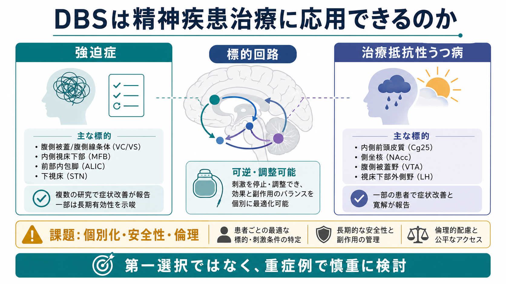
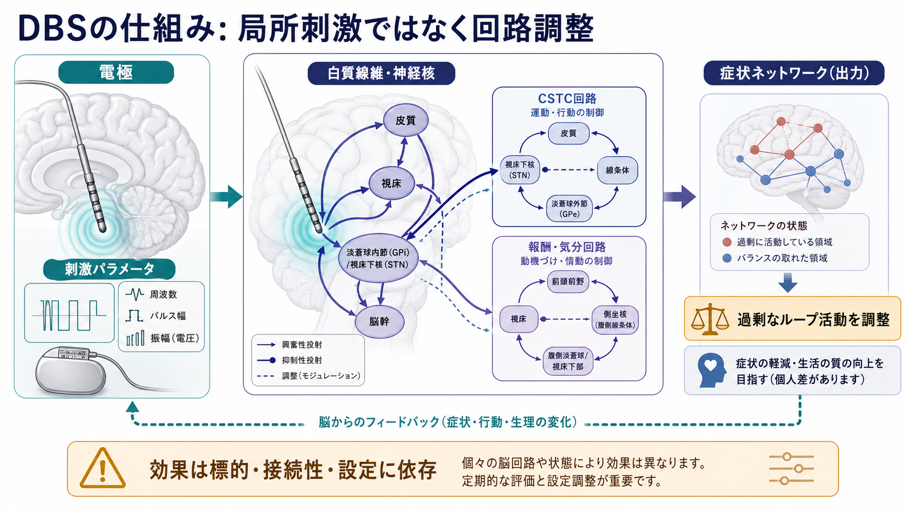
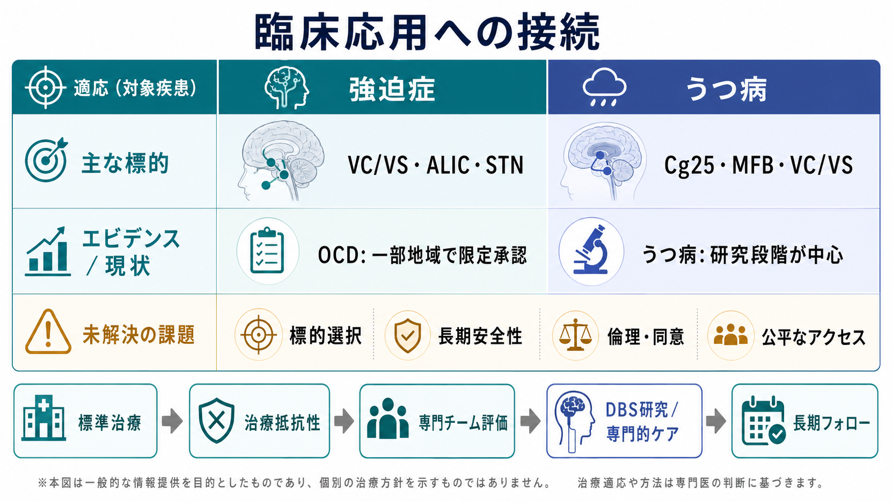

# DBSは精神疾患治療に応用できるのか

## 要点

- 深部脳刺激（deep brain stimulation: DBS）は、電極を脳内の神経核や白質線維の近くに置き、植込み型刺激装置から電気刺激を送って神経回路の活動を調整する治療技術である。精神疾患では「病変を切除する」のではなく、症状に関わる回路を可逆的・調整可能に変える方法として研究されてきた[1]。
- 強迫症（OCD）では、腹側被蓋/腹側線条体（VC/VS）、前部内包脚（ALIC）、側坐核、視床下核（STN）など、[[強迫症では皮質線条体視床回路に何が起きているのか|皮質-線条体-視床-皮質回路]]に近い標的が検討されている。米国では治療抵抗性OCDに対する前部内包脚刺激が Humanitarian Device Exemption として限定的に承認されている[2]。
- 治療抵抗性うつ病では、梁下帯状皮質（Cg25）、内側前脳束（MFB）、VC/VS・ALIC などが標的候補だが、強迫症よりもエビデンスは不安定で、研究段階の側面が大きい[5][6]。
- 最大の課題は、どの症状に、どの回路標的を、どの刺激条件で、どの評価指標に基づいて調整するかである。精神症状は運動症状より即時に観察しにくく、個別化・長期安全性・倫理・アクセスの問題が治療効果の検証を難しくする[7][8]。

## この記事で答える問い

この記事では、DBSを精神疾患に応用する発想を、次の問いに分けて整理する。

1. DBSは精神疾患を「治す」技術なのか、それとも神経回路を調整する補助的治療なのか。
2. 強迫症とうつ病では、どの標的回路が検討されているのか。
3. 臨床試験から何が分かり、何がまだ分かっていないのか。
4. 精神疾患への侵襲的脳刺激を考えるとき、どのような安全性・倫理・研究上の課題があるのか。

## まず結論

DBSは精神疾患治療に「応用できる可能性がある」が、一般的な第一選択治療ではない。現時点で最も臨床応用に近いのは、薬物療法や認知行動療法に十分反応しない重症・慢性の強迫症であり、うつ病では有望な開放試験や一部の試験結果がある一方、多施設ランダム化試験で一貫した有効性を示すことに苦戦してきた[2][5][6]。

したがってDBSは、[[精神疾患は脳の病気なのか|精神疾患を単純な脳の故障として扱う技術]]ではなく、症状を支える回路仮説を臨床的に検証する強力だが侵襲的な介入である。標的回路、刺激設定、臨床評価、患者の価値観、長期フォローアップを組み合わせて初めて意味をもつ。

## 背景

DBSはパーキンソン病、本態性振戦、ジストニアなどの運動障害で発展してきた。運動症状では、刺激条件を変えたときの振戦や筋強剛の変化が比較的短時間で観察しやすい。これに対して精神疾患では、不安、強迫観念、気分、意欲、認知、社会機能などが複数の時間スケールで変化するため、標的が正しく刺激されているかをすぐに判断しにくい[8]。

精神疾患へのDBS研究は、症状を単一の「部位」の異常としてではなく、回路の過活動、同期、可塑性、学習の偏りとして理解する流れと結びついている。たとえば強迫症では、確認や洗浄などの反復行動が、CSTC回路の過剰なループ活動や行動ゲーティングの偏りとして説明されることがある。うつ病では、[[報酬系の異常はうつ病をどう説明するのか|報酬系]]、内側前頭前野、帯状皮質、辺縁系、白質結合の異常が、気分・意欲・自己評価の持続的な変化に関わると考えられている。

## 基本概念

### DBS

DBSでは、定位脳手術によって電極を標的領域に留置し、胸部や頭部近くに置かれた刺激装置から持続的または間欠的な電気刺激を送る。刺激は周波数、パルス幅、振幅、刺激接点の組み合わせとして調整される。効果は単純な「興奮」や「抑制」ではなく、局所の神経活動、通過する白質線維、ネットワークの同期、神経可塑性にまたがる[1][7]。

### 標的回路

精神疾患DBSでいう標的は、点としての脳部位だけでなく、そこを通る線維束や接続先を含む。OCDでは VC/VS、ALIC、側坐核、STN が、うつ病では Cg25、MFB、VC/VS・ALIC などが候補になる。近年は、術前MRIや拡散MRIを使って、個人ごとの白質結合に合わせた標的設定を行う発想も強まっている[7]。

### 治療抵抗性

精神疾患へのDBSは、通常、十分な標準治療を受けても重い症状と機能障害が続く場合に検討される。OCDではSSRI、クロミプラミン、曝露反応妨害を含むCBTなどが先に検討される。うつ病では抗うつ薬、増強療法、心理療法、電気けいれん療法、反復経頭蓋磁気刺激などが文脈に入る。この記事は教育・研究目的の整理であり、個別の適応判断や治療指示ではない。

## 仕組み

DBSの作用は「電気で症状を消す」というより、病的に固定化した回路状態を別の作動点へ動かすことに近い。高頻度刺激は局所の発火を単純に増やすとは限らず、神経核、軸索、シナプス入力、出力経路に異なる影響を与える。刺激が線維束に及ぶ場合、遠隔の皮質・辺縁系・基底核領域にも影響が広がる[1][7]。

OCDでは、CSTC回路の過剰な反復ループを弱め、確認や洗浄のような強迫行為に移りやすい行動ゲートを調整する、という説明がよく使われる。STN刺激のランダム化試験では、重症OCD患者で症状改善が報告され、基底核回路が治療標的になりうることを示した[3]。側坐核やVC/VS刺激でも、治療抵抗性OCDでY-BOCSの改善が報告されている[4]。

うつ病では、Cg25を含む内側前頭-辺縁系回路、MFBを含む報酬・意欲回路、VC/VS・ALICを含む前頭線条体系が標的候補になる。開放試験では改善が報告されてきたが、梁下帯状皮質DBSの多施設ランダム化試験では、早期時点で明確な群間差を示せず、標的選択・刺激最適化・評価期間の設計が課題として残った[6]。

## 図解

上の図1は、DBSの精神疾患応用を「対象疾患」「標的回路」「可逆・調整可能性」「課題」に分けてまとめている。図2は、電極が局所だけでなく白質線維や神経核を介してCSTC回路、報酬・気分回路、症状ネットワークに影響しうることを示している。

図3は臨床応用への接続を、強迫症とうつ病で比較している。重要なのは、同じDBSでも疾患ごとに標的、評価指標、承認状況、リスク・ベネフィットの考え方が異なる点である。

## 臨床・研究との接続

### 強迫症

OCDでは、DBSの臨床応用が比較的進んでいる。FDAのHDEリストでは、2009年に Reclaim DBS Therapy が、慢性・重症・治療抵抗性OCDの成人患者に対する前部内包脚の両側刺激として掲載されている。ただしこれは通常の広範な承認とは異なり、希少で重症な条件に対する限定的枠組みである[2]。

臨床試験では、STN刺激、側坐核刺激、VC/VS・ALIC刺激などが検討されてきた。MalletらのSTN刺激試験は、重症OCDで症状改善を報告した重要なランダム化試験である[3]。Denysらの側坐核DBS試験も、治療抵抗性OCDで開放期とクロスオーバー期を組み合わせ、症状改善を示した[4]。ただし、研究規模は大きくなく、標的や患者選択の違いも大きいため、すべてのOCDに一般化できるわけではない。

### 治療抵抗性うつ病

うつ病DBSは、神経回路モデルとしては非常に重要だが、臨床的には慎重に読む必要がある。VC/VS・ALIC刺激のランダム化クロスオーバー試験では、最適化後に一部の患者で改善が見られ、シャム期との比較でも効果が示唆された[5]。一方、梁下帯状皮質DBSの多施設ランダム化シャム対照試験では、初期主要評価時点で明確な有効性を示せず、試験デザインと標的個別化の難しさが浮き彫りになった[6]。

この違いは、DBSが効かないという単純な結論ではなく、うつ病が多様な症候群であり、報酬、自己関連処理、睡眠、炎症、ストレス、認知制御などの寄与が患者ごとに異なることを示している。[[炎症仮説はうつ病をどう説明するのか]]や[[神経可塑性低下はうつ病をどう説明するのか]]で扱うような複数の病態仮説と、回路標的をどう対応させるかが今後の課題である。

### 閉ループDBSと個別化

近年は、刺激を固定的に入れ続けるだけでなく、脳信号、行動、自己評価、デジタル指標を使って状態に応じて刺激を調整する閉ループDBSが注目されている。精神疾患では、症状が主観的・文脈依存的で、変化が遅いこともあるため、何を「状態指標」とするかが難しい。Widgeは、精神疾患DBSが多施設試験で苦戦してきた理由として、標的関与の証明と刺激パラメータ最適化の難しさを強調している[8]。

## よくある誤解

### 誤解1: DBSは精神疾患を電気で即座に治す

DBSは即効性のスイッチではない。運動障害では刺激調整の効果が短時間で見えることがあるが、精神症状では数日から数か月の調整、心理社会的支援、生活機能の回復が関わる。効果も副作用も、標的、接続性、刺激条件、併存症、環境に依存する[7][8]。

### 誤解2: DBSが効くなら精神疾患は脳だけの問題だ

DBS研究は、精神疾患に脳回路が関わることを示すが、心理、身体、社会、文化の要因を消すものではない。むしろ、どの症状がどの回路状態と結びつくかを丁寧に対応づける必要がある。[[神経科学は精神疾患をどのように説明できるのか]]で述べるように、脳モデルは個人の体験や生活史を置き換えるものではない。

### 誤解3: うつ病DBSはすでに確立した標準治療である

治療抵抗性うつ病へのDBSは研究上重要だが、標準治療として広く確立した段階ではない。標的ごとの試験結果が一致せず、患者選択、刺激最適化、評価期間、シャム対照の倫理と安全性が課題である[5][6][8]。

### 誤解4: 侵襲的治療だから倫理的に使うべきではない

侵襲性は重大な懸念だが、それだけで一律に否定されるわけでもない。重症・慢性・治療抵抗性の患者では、症状そのものによる苦痛と機能障害も大きい。必要なのは、十分な説明と同意、独立した倫理審査、現実的な期待設定、長期フォロー、副作用管理、公平なアクセスである[2][8]。

## 関連ノート

- [[深部脳刺激DBSは神経回路をどう調節するのか]]
- [[強迫症では皮質線条体視床回路に何が起きているのか]]
- [[報酬系の異常はうつ病をどう説明するのか]]
- [[前頭前野は情動制御にどう関わるのか]]
- [[双極性障害は情動ネットワークの異常として説明できるのか]]
- [[神経可塑性低下はうつ病をどう説明するのか]]
- [[神経科学は精神疾患をどのように説明できるのか]]
- [[精神疾患は脳の病気なのか]]

### 関連ノート候補

- 治療抵抗性うつ病とは何か
- 精神疾患における閉ループDBSとは何か
- 梁下帯状皮質Cg25は気分調整にどう関わるのか
- 前部内包脚と腹側線条体は強迫症治療でなぜ標的になるのか

### MOC更新候補

- `content/00_MOC/` 配下の神経科学、精神医学、計算論的精神医学関連MOCに、本記事へのリンクを追加する候補。
- 並列ジョブとの競合を避けるため、このタスクではMOC本体は更新しない。

## 理解チェック

1. DBSが精神疾患で「局所刺激」だけではなく「回路調整」として説明される理由は何か。
2. 強迫症とうつ病で、DBSのエビデンスや承認状況が異なるのはなぜか。
3. 治療抵抗性うつ病のDBS試験で、多施設ランダム化試験が難しい理由を説明できるか。
4. 精神疾患へのDBSで、同意・期待設定・長期フォローが特に重要になる理由は何か。

## 参考文献

[1] Sullivan, C. R. P., Olsen, S., & Widge, A. S. (2021). Deep brain stimulation for psychiatric disorders: From focal brain targets to cognitive networks. *NeuroImage, 225*, 117515. https://doi.org/10.1016/j.neuroimage.2020.117515

[2] U.S. Food and Drug Administration. (2009). *Listing of CDRH Humanitarian Device Exemptions: Reclaim Deep Brain Stimulation for Obsessive Compulsive Disorder Therapy*. https://www.fda.gov/medical-devices/hde-approvals/listing-cdrh-humanitarian-device-exemptions

[3] Mallet, L., Polosan, M., Jaafari, N., et al. (2008). Subthalamic nucleus stimulation in severe obsessive-compulsive disorder. *New England Journal of Medicine, 359*(20), 2121-2134. https://doi.org/10.1056/NEJMoa0708514

[4] Denys, D., Mantione, M., Figee, M., et al. (2010). Deep brain stimulation of the nucleus accumbens for treatment-refractory obsessive-compulsive disorder. *Archives of General Psychiatry, 67*(10), 1061-1068. https://doi.org/10.1001/archgenpsychiatry.2010.122

[5] Bergfeld, I. O., Mantione, M., Hoogendoorn, M. L. C., et al. (2016). Deep brain stimulation of the ventral anterior limb of the internal capsule for treatment-resistant depression: A randomized clinical trial. *JAMA Psychiatry, 73*(5), 456-464. https://doi.org/10.1001/jamapsychiatry.2016.0152

[6] Holtzheimer, P. E., Husain, M. M., Lisanby, S. H., et al. (2017). Subcallosal cingulate deep brain stimulation for treatment-resistant depression: A multisite, randomised, sham-controlled trial. *The Lancet Psychiatry, 4*(11), 839-849. https://doi.org/10.1016/S2215-0366(17)30371-1

[7] Riva-Posse, P., Choi, K. S., Holtzheimer, P. E., et al. (2018). A connectomic approach for subcallosal cingulate deep brain stimulation surgery: Prospective targeting in treatment-resistant depression. *Molecular Psychiatry, 23*, 843-849. https://doi.org/10.1038/mp.2017.59

[8] Widge, A. S. (2024). Closing the loop in psychiatric deep brain stimulation: Physiology, psychometrics, and plasticity. *Neuropsychopharmacology, 49*, 138-149. https://doi.org/10.1038/s41386-023-01643-y

## 未解決問題

- OCDのDBSで、VC/VS、ALIC、側坐核、STNのどれが、どの症状次元に最も適するのか。
- うつ病DBSで、患者ごとの症状プロファイル、白質結合、行動指標をどう統合して標的を決めるのか。
- 閉ループDBSで、気分・強迫・不安の状態をどの生理指標で安全に推定できるのか。
- 長期刺激が人格、意思決定、自己感、社会生活に与える影響をどう評価するのか。

## 更新ログ

- 2026-04-27: 初稿作成。強迫症・治療抵抗性うつ病へのDBS標的回路、臨床試験、個別化と倫理の課題を整理し、画像3枚を追加。
