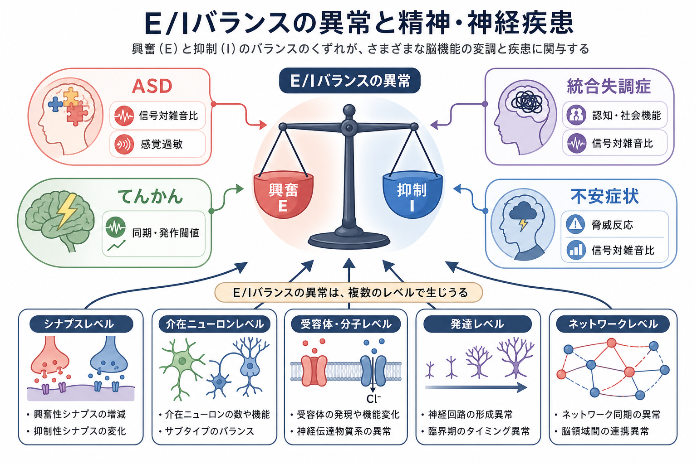
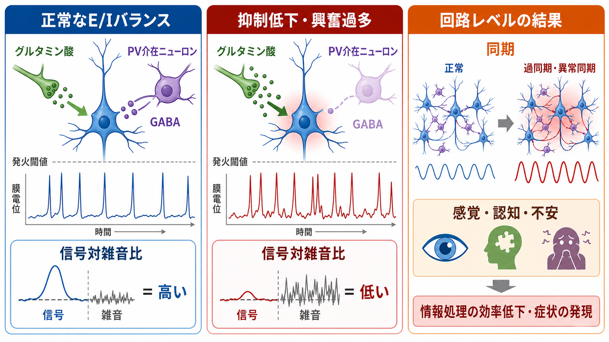
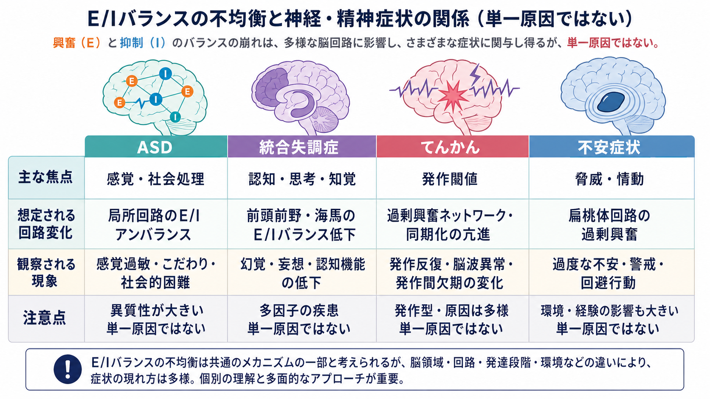

# E/Iバランス異常は精神疾患をどう説明するのか

## 要点

- E/Iバランスとは、[[グルタミン酸は脳で何をしているのか|グルタミン酸]]などによる興奮性入力と、[[GABAは脳で何をしているのか|GABA]]などによる抑制性入力が、神経細胞・局所回路・広域ネットワークの活動を適切な範囲に保つ関係である。
- 精神疾患でいう「E/Iバランス異常」は、単に興奮が多すぎる、または抑制が少なすぎるという意味ではない。発火率、スパイクタイミング、信号対雑音比、同期、可塑性、発達期の回路形成がずれることを含む[1]。
- ASD、統合失調症、てんかん、不安症状では、E/Iバランス異常がそれぞれ感覚過敏、認知・社会機能、発作閾値、脅威反応の過剰化と結びつけて研究されている[2][3][5][7][8]。
- ただし、E/Iバランスは診断名を一対一で説明する万能原因ではない。疾患内の異質性、発達段階、脳領域、測定法、代償性可塑性を分けて考える必要がある[1][4]。

## この記事で答える問い

興奮と抑制の不均衡は、なぜ精神疾患の説明に使われるのか。ASD、統合失調症、てんかん、不安症状では、どのような回路変化として理解されているのか。そして、この仮説をどこまで臨床や研究に使ってよいのか。

## まず結論

E/Iバランス異常は、精神疾患を「脳全体が興奮しすぎている」と単純化する仮説ではない。むしろ、神経回路が必要な信号を選び、不要な活動を抑え、タイミングをそろえ、経験に応じて再調整する能力がどこで崩れるかを考える枠組みである[1]。

たとえば、抑制が弱いと[[活動電位はどのように発生するのか|活動電位]]は起こりやすくなる。しかし問題は発火数だけではない。発火のタイミングが広がれば、信号対雑音比は下がり、[[神経同期とは何か|神経同期]]や[[ガンマ振動は認知機能にどう関わるのか|ガンマ振動]]も変わる。逆に、強すぎる抑制や代償性の抑制増加も、情報の通過しにくさや柔軟性の低下を生みうる。したがってE/Iバランス異常は、興奮過多だけでなく「適切な場所・時間・細胞種での調整失敗」として読むのがよい。

## 背景

脳の多くの局所回路では、[[興奮性ニューロンと抑制性ニューロンは何が違うのか|興奮性ニューロンと抑制性ニューロン]]が密に相互作用する。興奮性ニューロンは信号を広げ、抑制性ニューロンは発火の範囲、タイミング、競合する入力の選択を調整する。特に[[介在ニューロンは神経回路で何をしているのか|介在ニューロン]]は、少数でも回路全体の発火パターンに大きな影響を与える[6]。

この発想が精神疾患研究で注目されたのは、ASDや統合失調症において、遺伝子、シナプス、GABA作動性介在ニューロン、皮質振動、感覚処理、社会行動の異常が別々に報告され、それらをつなぐ概念としてE/Iバランスが使いやすかったからである[1][3][5]。E/Iバランスは診断カテゴリーそのものではなく、分子・細胞・回路・症状を接続する中間レベルの説明である。

## 基本概念

### E/Iバランスは「量の比」だけではない

[[E_Iバランスとは何か|E/Iバランス]]という言葉は、興奮性入力と抑制性入力の単純な比に見える。しかし実際には、少なくとも次の層を区別する必要がある。

| 水準 | 見ているもの | 精神疾患での意味 |
|---|---|---|
| シナプス水準 | [[EPSPとIPSPはどのように発火を調節するのか|EPSPとIPSP]]、受容体、放出確率 | 入力が閾値へ届きやすいか |
| 細胞水準 | 発火閾値、樹状突起統合、軸索初節 | ノイズと信号をどう分けるか |
| 局所回路水準 | フィードフォワード抑制、フィードバック抑制 | 感覚選択、注意、作業記憶 |
| ネットワーク水準 | 同期、振動、発作閾値 | ガンマ帯域、発作、認知機能 |
| 発達水準 | 介在ニューロン成熟、シナプス刈り込み、恒常性可塑性 | 症状がいつ・どこで出るか |

### 信号対雑音比という見方

E/Iバランス異常の重要な説明の一つは、信号対雑音比の低下である。抑制が適切に働くと、意味のある入力に対する反応は保たれ、背景活動や無関係な入力は抑えられる。抑制が弱い、または興奮が過剰になると、背景活動も上がり、重要な信号が目立ちにくくなる[1][2]。

この考え方は、ASDの感覚過敏、統合失調症の知覚・認知の不安定さ、不安症状における脅威刺激への過敏さを考える入口になる。ただし、症状とE/Iバランスの関係は一方向ではなく、経験、注意、睡眠、薬物、発達段階によって変わる。

## 仕組み

### 1. 抑制低下は発火のばらつきを増やす

GABA作動性抑制が弱くなると、細胞は発火しやすくなるだけでなく、発火する時間窓も広がる。すると、同じ入力に対して反応の精度が下がり、回路は「何に反応すべきか」を選びにくくなる。これは感覚過敏や注意の散りやすさを説明する一つの候補である[1][3]。

### 2. 興奮過多は同期と発作閾値を変える

興奮が抑制を上回ると、局所回路は過同期や過興奮へ向かいやすい。てんかんでは、発作の発生と伝播が「興奮が抑制を超える」という古典的な説明で理解されてきた[7]。ただし近年は、発達期のGABA作用、イオンチャネル、代謝、炎症、ネットワーク構造も重要であり、単純な抑制不足だけでは説明できないことが強調されている[7]。

### 3. 介在ニューロン異常はガンマ振動と認知を揺らす

パルブアルブミン陽性介在ニューロンなどの高速発火性介在ニューロンは、皮質回路のタイミング制御やガンマ振動に関わる。統合失調症では、GABA作動性介在ニューロン、NMDA受容体、ガンマ帯域活動、認知機能障害の関係が長く議論されている[5][6]。この場合のE/I異常は、幻覚や妄想を直接一つの回路で説明するというより、知覚推論、作業記憶、文脈処理の不安定さを生む基盤として考えられる。

### 4. 発達と恒常性可塑性が「見かけのバランス」を変える

ASD研究では、E/Iバランス仮説が重要な出発点になった。RubensteinとMerzenichは、一部のASDで主要な神経系における興奮/抑制比の上昇が感覚・記憶・社会行動の異常に関わる可能性を提案した[3]。その後のレビューは、ASD関連遺伝子、シナプス形成、介在ニューロン、恒常性可塑性を含めて、E/Iバランスをより複雑な発達回路の問題として整理している[4]。

重要なのは、一次的な異常と二次的な代償を区別しにくい点である。ある遺伝子変化が最初に抑制を弱めても、回路は恒常性可塑性によって興奮も下げるかもしれない。測定した時点では「興奮も抑制も下がっている」「比は変わったが発火率は保たれている」という結果になりうる[4]。

## 図解

この図の要点は、E/Iバランス異常を「抑制が弱いから症状が出る」という一段階の説明にしないことである。シナプス入力、発火閾値、介在ニューロン、同期、信号対雑音比が連鎖し、その結果として感覚、認知、社会行動、不安反応が変わる。どの段階が主因なのかは、疾患、個人、発達段階、脳領域によって異なる。

## 臨床・研究との接続

### ASD

ASDでは、E/Iバランス異常は感覚過敏、感覚選択の難しさ、社会情報処理、反復行動と関連づけて研究されている[3][4]。ただしASDは非常に異質な発達状態であり、すべてのASDに同じE/I異常があるわけではない。E/Iバランスは「ASDの単一原因」ではなく、遺伝子や発達環境が回路にどう現れるかを考える枠組みである。

### 統合失調症

統合失調症では、GABA作動性介在ニューロン、グルタミン酸/NMDA受容体、ガンマ振動、認知機能障害をつなぐ仮説としてE/Iバランスが使われる[5][6]。特に前頭前野や海馬の回路で、抑制性制御の異常が作業記憶、文脈処理、予測誤差の扱いに影響する可能性がある。ただし、患者群内の差、薬物治療、病期、測定法の違いが大きいため、単純なバイオマーカーとして扱うには慎重さが必要である。

### てんかん

てんかんでは、E/Iバランスは発作閾値、過興奮、過同期を考える中心概念である。興奮が増える、抑制が減る、または両方が起こると発作が起こりやすくなる、という説明は直感的で強い[7]。一方で、発作型や発達段階によってはGABA作動性活動が増えている場合もあり、GABAが常に単純な「抑制」として働くとは限らない。抗てんかん薬の作用も、単に興奮を下げる・抑制を上げるだけではない[7]。

### 不安症状

不安症状では、扁桃体、前頭前野、海馬などの脅威処理回路で、興奮性グルタミン酸系と抑制性GABA系の調整が問題になる。ベンゾジアゼピン系薬がGABA_A受容体を介して不安を軽減することは、抑制系が不安反応に深く関わることを示す一例である[8]。ただし、不安症状はGABAだけでなく、セロトニン、ノルアドレナリン、CRH、内因性カンナビノイド、学習履歴、身体状態にも左右される。E/Iバランスは、そのうち回路興奮性の側面を説明する概念である。

## よくある誤解

### 誤解1: E/Iバランス異常は「興奮が多い病気」という意味である

違う。ある回路では興奮過多に見えても、別の回路では抑制過多や代償性抑制が起こっているかもしれない。E/Iバランスは、量だけでなくタイミング、細胞種、脳領域、発達段階を含む。

### 誤解2: 抑制を増やせば必ず症状はよくなる

抑制は脳を止めるだけではなく、情報の選択とタイミングを作る。過剰な抑制は反応性や可塑性を下げる可能性がある。治療的に重要なのは、全体を鈍らせることではなく、問題となる回路の調整を回復することである。

### 誤解3: E/Iバランスを測れば診断できる

現在のところ、E/Iバランスは診断を置き換える指標ではない。MRS、EEG/MEG、TMS、fMRI、PET、動物モデル、細胞モデルは、それぞれ別の水準の代理指標を見ている。測定結果を「シナプスのE/I比」とそのまま同一視することはできない。

### 誤解4: E/Iバランス仮説は精神疾患を生物学に還元しすぎる

E/Iバランスは、分子から症状までをつなぐ一つの説明階層である。心理社会的要因、学習、環境、生活リズム、ストレスが回路の興奮性や抑制性調整に影響する可能性もある。したがって、生物学か心理社会かの二分法ではなく、多層的に接続するための概念として使う方がよい。

## 関連ノート

- [[E_Iバランスとは何か]]
- [[GABAは脳で何をしているのか]]
- [[グルタミン酸は脳で何をしているのか]]
- [[EPSPとIPSPはどのように発火を調節するのか]]
- [[興奮性ニューロンと抑制性ニューロンは何が違うのか]]
- [[興奮性ニューロンと抑制性ニューロンは回路内でどう協調するのか]]
- [[介在ニューロンは神経回路で何をしているのか]]
- [[抑制性介在ニューロンにはどのような種類があるのか]]
- [[神経同期とは何か]]
- [[ガンマ振動は認知機能にどう関わるのか]]

## MOC更新候補

- `content/00_MOC/` 配下の脳・神経科学、精神疾患、神経回路関連MOCに `[[E_Iバランス異常は精神疾患をどう説明するのか|E/Iバランス異常は精神疾患をどう説明するのか]]` を追加する候補。
- 並列ジョブとの競合を避けるため、この作業ではMOC本体は更新しない。

## 理解チェック

1. E/Iバランス異常を「興奮が多すぎる」とだけ説明すると、何が抜け落ちるか。
2. ASDでE/Iバランス仮説を使うとき、なぜ恒常性可塑性を考える必要があるか。
3. 統合失調症で介在ニューロンやガンマ振動が注目される理由は何か。
4. てんかんにおいて、E/Iバランス仮説が有用でありながら単純化にも注意が必要な理由は何か。
5. 不安症状をE/Iバランスで説明するとき、GABA以外の要因をなぜ無視できないか。

## 未解決問題

- ヒトのMRS、EEG/MEG、TMS指標が、細胞・シナプス水準のE/Iバランスにどこまで対応するのか。
- 疾患横断的なE/I異常が、診断カテゴリーよりも症状次元や認知機能次元をよく説明するのか。
- 発達段階ごとのE/I異常と代償性可塑性を、縦断研究でどこまで分離できるのか。
- 薬物療法、神経刺激、心理療法、睡眠・運動などの介入が、E/Iバランスを介して症状を変えるのか、それとも別経路が主なのか。

## 参考文献

[1] Sohal, V. S., & Rubenstein, J. L. R. (2019). Excitation-inhibition balance as a framework for investigating mechanisms in neuropsychiatric disorders. *Molecular Psychiatry, 24*, 1248-1257. https://doi.org/10.1038/s41380-019-0426-0

[2] Yizhar, O., Fenno, L. E., Prigge, M., et al. (2011). Neocortical excitation/inhibition balance in information processing and social dysfunction. *Nature, 477*, 171-178. https://doi.org/10.1038/nature10360

[3] Rubenstein, J. L. R., & Merzenich, M. M. (2003). Model of autism: increased ratio of excitation/inhibition in key neural systems. *Genes, Brain and Behavior, 2*(5), 255-267. https://doi.org/10.1034/j.1601-183X.2003.00037.x

[4] Nelson, S. B., & Valakh, V. (2015). Excitatory/Inhibitory balance and circuit homeostasis in Autism Spectrum Disorders. *Neuron, 87*(4), 684-698. https://doi.org/10.1016/j.neuron.2015.07.033

[5] Foss-Feig, J. H., Adkinson, B. D., Ji, J. L., et al. (2017). Searching for cross-diagnostic convergence: neural mechanisms governing excitation and inhibition balance in schizophrenia and autism spectrum disorders. *Biological Psychiatry, 81*(10), 848-861. https://doi.org/10.1016/j.biopsych.2017.03.005

[6] Marin, O. (2012). Interneuron dysfunction in psychiatric disorders. *Nature Reviews Neuroscience, 13*, 107-120. https://doi.org/10.1038/nrn3155

[7] Shao, L.-R., Habela, C. W., & Stafstrom, C. E. (2019). Pediatric epilepsy mechanisms: expanding the paradigm of excitation/inhibition imbalance. *Children, 6*(2), 23. https://doi.org/10.3390/children6020023

[8] Nasir, M., Trujillo, D., Levine, J., et al. (2020). Glutamate systems in DSM-5 anxiety disorders: their role and a review of glutamate and GABA psychopharmacology. *Frontiers in Psychiatry, 11*, 548505. https://doi.org/10.3389/fpsyt.2020.548505
