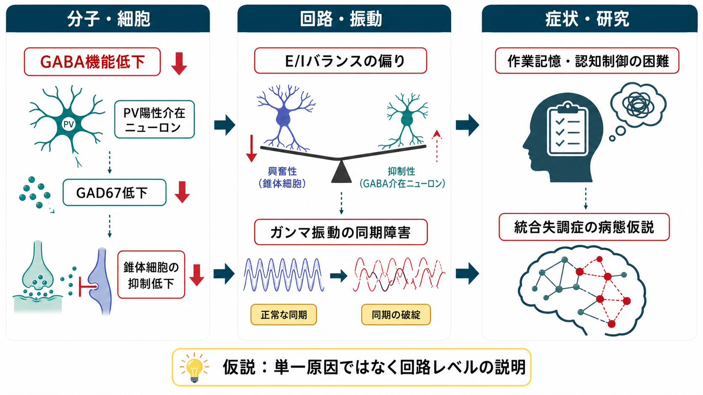
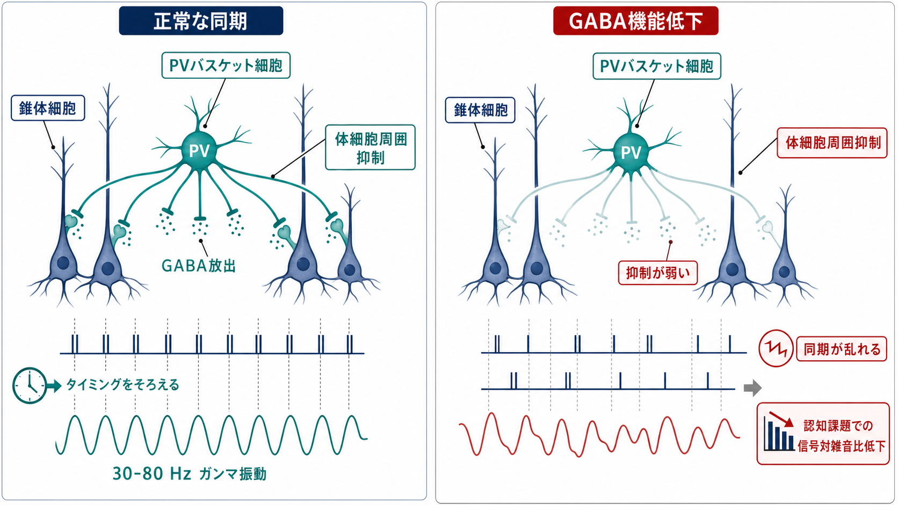
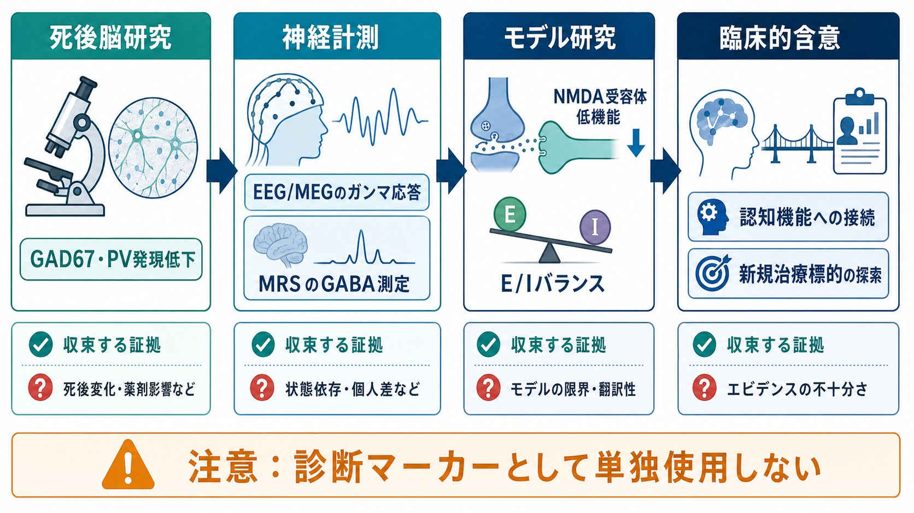

# GABA機能低下は統合失調症にどう関わるのか

## 要点

- 統合失調症では、前頭前野を中心にGABA作動性抑制の分子マーカー低下、特にGAD67やパルブアルブミン（PV）関連の変化が繰り返し報告されている[1][2][3]。
- 重要なのは「GABAが全脳で一律に少ない」という話ではなく、PV陽性介在ニューロンによる体細胞周囲抑制が弱まり、錐体細胞集団の発火タイミングをそろえにくくなるという回路仮説である[1][5]。
- ガンマ帯域（およそ30-80 Hz）の同期活動は、作業記憶や知覚統合などの認知機能と関係し、統合失調症ではその同期や課題関連応答の異常が報告されている[4][5]。
- ただし、MRSなどのin vivo GABA測定では所見が一貫しない。死後脳・電気生理・画像研究は同じものを測っていないため、GABA機能低下仮説は診断マーカーではなく、病態を説明する研究枠組みとして読む必要がある[6][7]。

## この記事で答える問い

GABA機能低下は、統合失調症の幻覚や妄想を直接生む単一原因なのか。それとも、認知機能、神経同期、前頭前野回路の働きに関わる中間的な病態仮説なのか。この記事では、[[GABAは脳で何をしているのか|GABA]]、抑制性介在ニューロン、ガンマ振動を結び、統合失調症のGABA仮説を「どこまで言えるか」と「どこから先は未確定か」に分けて整理する。

## まず結論

GABA機能低下仮説の中心は、統合失調症では前頭前野の抑制性介在ニューロン、特にPV陽性細胞の機能が低下し、錐体細胞の発火タイミングを精密にそろえる力が弱まる、という考え方である[1][5]。その結果、[[E_Iバランスとは何か|E/Iバランス]]が変化し、ガンマ振動の同期、信号対雑音比、作業記憶や認知制御が障害されやすくなると説明される[4][5]。

しかし、これは「GABA不足だけで統合失調症が起きる」という単純な仮説ではない。NMDA受容体機能低下、ドパミン系、発達、遺伝、ストレス、シナプス刈り込み、白質結合など複数の病態モデルと重なり合う。GABA仮説は、それらを前頭前野の微小回路と神経同期の問題として翻訳するための有力な回路レベルの説明である。

## 背景

統合失調症は、陽性症状だけでなく、作業記憶、注意、処理速度、認知制御などの認知機能障害を伴う。認知機能障害は生活機能と強く関係するため、薬で幻覚・妄想が軽くなっても、長期的な機能回復を考えるうえで重要な問題として残る[1]。

前頭前野、とくに背外側前頭前野は、作業記憶や認知制御に深く関わる。ここで錐体細胞が適切なタイミングで集団活動するには、興奮性入力だけでなく、GABA作動性の介在ニューロンによる精密な抑制が必要である。抑制は単なる「ブレーキ」ではなく、発火の時間窓を切り出し、不要な発火を抑え、集団の同期を作る制御である。

この観点から、統合失調症のGABA仮説は、神経伝達物質の量だけでなく、細胞種、層、シナプス部位、発達段階、振動活動を含む回路仮説として発展してきた。

## 基本概念

### GAD67

GAD67は、グルタミン酸からGABAを合成する主要な酵素の一つである。統合失調症の死後脳研究では、前頭前野におけるGAD67 mRNAやタンパク質の低下が繰り返し報告されている[2][3]。これは、GABA合成能力の低下を示唆するが、GABA作動性ニューロンが単純に消失していることを意味するとは限らない。

実際、近年の多重蛍光in situ hybridization研究では、背外側前頭前野でSSTやPVのmRNA量は低いが、該当ニューロンの密度そのものは低下していないという結果が示されている[8]。この点は重要である。仮説の焦点は「ニューロンがいない」よりも、「存在する介在ニューロンの機能状態が変わっている」ことに移っている。

### PV陽性介在ニューロン

PV陽性介在ニューロンは、速く発火し、錐体細胞の体細胞周囲や軸索初節近くを強く制御する。これにより、多数の錐体細胞の発火タイミングを狭い時間窓にそろえる。PV細胞は、皮質ガンマ振動の生成に深く関わる細胞種として扱われる[5]。

統合失調症でPV関連マーカーが低下するという所見は、前頭前野の抑制が全体に弱いというより、発火タイミングを整える「高速な抑制の精度」が落ちるという解釈につながる[1][5]。

### ガンマ振動

ガンマ振動は、神経集団が30-80 Hz前後の速いリズムで同期する現象である。知覚統合、注意、作業記憶などに関係すると考えられ、EEGやMEGで観察される。統合失調症では、安静時・課題時のガンマ帯域活動や同期性に異常があるという報告が多く、認知機能障害との関連も議論されている[4]。

ただし、ガンマ振動は単一の現象ではない。安静時パワー、課題誘発応答、位相同期、感覚刺激への応答などは別の指標であり、薬物、課題、病期、測定条件によって結果が変わる。

## 仕組み

### 1. GAD67低下がGABA合成を弱める

死後脳研究では、統合失調症の前頭前野でGAD67 mRNAの低下が報告されてきた[2]。GAD67はGABA合成に関わるため、これが低いことはGABA作動性シグナルの弱まりを示唆する。さらに、GAD67タンパク質やPV細胞終末での変化も検討され、認知機能と関係する背外側前頭前野の抑制回路異常として解釈されている[3]。

ただし、死後脳所見には死後間隔、薬物治療、病期、併存状態、サンプルサイズなどの制約がある。したがって、GAD67低下は重要な手がかりだが、それだけで病態全体を説明するものではない。

### 2. PV陽性介在ニューロンが錐体細胞の同期を作る

PV陽性バスケット細胞は、複数の錐体細胞に体細胞周囲抑制を与え、発火タイミングをそろえる。通常、これにより神経集団はガンマ帯域でリズミカルに活動しやすくなる。統合失調症でこの抑制が弱まると、発火は完全に止まるのではなく、むしろ時間的なまとまりを失いやすい。

この状態では、必要な信号と雑音の区別が弱まり、作業記憶課題で必要な情報を保持・更新する効率が下がると考えられる[1][4][5]。

### 3. NMDA受容体低機能とつながる

GABA仮説は、NMDA受容体低機能仮説とも結びつく。PV陽性介在ニューロンはグルタミン酸性入力を受け、NMDA受容体を含む興奮性入力によって発達・維持・活動調節を受ける。NMDA受容体シグナルが弱いと、PV細胞の機能やGAD67発現、ガンマ振動が乱れる可能性がある[5]。

ただし、どの細胞種のNMDA受容体低機能が、どの発達段階で、どの症状や認知機能に結びつくかは未確定である。Gonzalez-BurgosとLewisは、NMDA受容体低機能が重要でありうる一方で、障害を媒介する細胞種やメカニズムの特定には追加研究が必要だと整理している[5]。

## 図解

GABA機能低下仮説は、次のような層をつなぐ説明である。

| 層 | 観察・仮説 | 何を説明するか |
|---|---|---|
| 分子 | GAD67、PV、SSTなどの発現低下 | GABA作動性機能の弱まり |
| 細胞 | PV陽性介在ニューロンの機能変化 | 体細胞周囲抑制と発火タイミング |
| 回路 | E/Iバランス変化、ガンマ同期障害 | 作業記憶・認知制御の困難 |
| 測定 | 死後脳、EEG/MEG、MRS、PET/SPECT | 互いに異なるレベルの証拠 |
| 臨床 | 症状ではなく認知機能・病態理解への接続 | 診断ではなく研究仮説 |

## 臨床・研究との接続

### 認知機能障害を説明する回路仮説

GABA仮説が特に重視するのは、幻覚や妄想を直接説明することよりも、作業記憶、注意、認知制御の障害である。前頭前野のPV細胞が錐体細胞の発火タイミングをそろえにくくなると、課題に必要な情報を安定して保持し、不要な情報を抑える機能が落ちると考えられる[1][4]。

これは[[ドパミン仮説は統合失調症をどこまで説明できるのか|ドパミン仮説]]と競合するというより、説明する階層が違う。ドパミン仮説がサリエンスや陽性症状を説明する軸を提供する一方、GABA/PV/ガンマ仮説は前頭前野回路と認知機能障害を説明する軸を提供する。

### in vivo GABA測定とのずれ

MRSは生体内でGABA濃度を推定できるが、MRSのGABA信号はシナプス伝達そのものではなく、ボクセル内の細胞内外・代謝プールを含む総量に近い。2017年の系統的レビュー・メタ解析では、MRSによるGABA濃度やGABA_A/ベンゾジアゼピン受容体可用性について、統合失調症で一貫した群差は示されなかった[6]。

一方、2023年の内側前頭皮質に限定したMRSメタ解析では、統合失調症で中部・後部内側前頭皮質GABAが低いという結果が報告され、ボクセル位置の重要性が示された[7]。この違いは、GABA仮説が「どこを、どの方法で、何の指標として測るか」に強く依存することを示している。

### 治療標的としての含意

GABA機能低下が病態に関わるなら、GABA_A受容体を単純に強めればよいように見える。しかし、全般的なGABA増強は眠気、認知鈍麻、依存、運動失調などを生じうる。必要なのは、特定の細胞種、受容体サブタイプ、発達段階、回路状態に応じた調整である。

したがって、現時点ではGABA仮説を個別診断や治療選択の直接指標として使うのではなく、認知機能障害や新規治療標的を理解する研究枠組みとして扱うのが適切である。

## よくある誤解

### 誤解1: 統合失調症はGABA不足で起きる

単純化しすぎである。統合失調症は多因子性の症候群であり、GABA、グルタミン酸、ドパミン、発達、遺伝、環境、ストレス、神経結合などが重なって議論される。GABA仮説は、その中でも前頭前野抑制回路と神経同期に焦点を当てる仮説である。

### 誤解2: GABA作動性ニューロンが死んでいる

一部の古い解釈では細胞数低下が疑われたが、近年の研究では、少なくとも背外側前頭前野のPV・SST関連変化について、ニューロン密度の低下よりも、細胞あたりの遺伝子発現低下が支持されている[8]。つまり、「細胞が消えた」というより、「細胞の機能状態が変わった」と読む方が慎重である。

### 誤解3: ガンマ振動異常はGABA異常だけを意味する

ガンマ振動はGABA介在ニューロンに強く依存するが、興奮性錐体細胞、NMDA/AMPA受容体、長距離結合、注意状態、課題要求、薬物の影響も受ける。したがって、EEG/MEGのガンマ異常をそのまま「GABAが低い」と読み替えることはできない。

### 誤解4: MRSでGABAが低くなければGABA仮説は否定される

MRSは有用だが、細胞種特異的なシナプス抑制やPV細胞終末のGAD67低下を直接測るものではない。MRS所見が不一致であることは、GABA仮説を否定するというより、測定階層の違いと方法論上の限界を示す[6][7]。

## 関連ノート

- [[GABAは脳で何をしているのか]]
- [[E_Iバランスとは何か]]
- [[ガンマ振動は認知機能にどう関わるのか]]
- [[ドパミン仮説は統合失調症をどこまで説明できるのか]]
- [[シナプス刈り込みの異常は統合失調症と関係するのか]]

### 関連ノート候補

- NMDA受容体機能低下仮説とは何か
- 抑制性介在ニューロンにはどのような種類があるのか
- PV陽性介在ニューロンは神経同期をどう作るのか
- MRSはGABAをどこまで測れるのか
- 統合失調症の認知機能障害はどの神経回路で説明できるのか

### MOC更新候補

- `content/00_MOC/` 配下の脳・神経科学系MOC、精神医学系MOCに `[[GABA機能低下は統合失調症にどう関わるのか]]` を追加する候補。
- 並列記事生成との競合を避けるため、この作業ではMOC本体は更新しない。

## 理解チェック

1. GABA機能低下仮説が「GABA量の全般的低下」ではなく「PV陽性介在ニューロンを中心とする回路仮説」として読まれる理由を説明できるか。
2. GAD67、PV、ガンマ振動、作業記憶の関係を一つの流れとして説明できるか。
3. 死後脳研究、EEG/MEG、MRSがそれぞれ異なる階層の証拠を提供する理由を説明できるか。
4. なぜGABA仮説を診断マーカーや単一原因として使ってはいけないのかを説明できるか。

## 参考文献

[1] Lewis, D. A., Hashimoto, T., & Volk, D. W. (2005). Cortical inhibitory neurons and schizophrenia. *Nature Reviews Neuroscience*, 6, 312-324. https://doi.org/10.1038/nrn1648

[2] Hashimoto, T., Volk, D. W., Eggan, S. M., Mirnics, K., Pierri, J. N., Sun, Z., Sampson, A. R., & Lewis, D. A. (2003). Gene expression deficits in a subclass of GABA neurons in the prefrontal cortex of subjects with schizophrenia. *The Journal of Neuroscience*, 23(15), 6315-6326. https://doi.org/10.1523/JNEUROSCI.23-15-06315.2003

[3] Curley, A. A., Arion, D., Volk, D. W., Asafu-Adjei, J. K., Sampson, A. R., Fish, K. N., & Lewis, D. A. (2011). Cortical deficits of glutamic acid decarboxylase 67 expression in schizophrenia: Clinical, protein, and cell type-specific features. *American Journal of Psychiatry*, 168(9), 921-929. https://doi.org/10.1176/appi.ajp.2011.11010052

[4] Uhlhaas, P. J., & Singer, W. (2010). Abnormal neural oscillations and synchrony in schizophrenia. *Nature Reviews Neuroscience*, 11, 100-113. https://doi.org/10.1038/nrn2774

[5] Gonzalez-Burgos, G., & Lewis, D. A. (2012). NMDA receptor hypofunction, parvalbumin-positive neurons, and cortical gamma oscillations in schizophrenia. *Schizophrenia Bulletin*, 38(5), 950-957. https://doi.org/10.1093/schbul/sbs010

[6] Egerton, A., Modinos, G., Ferrera, D., & McGuire, P. (2017). Neuroimaging studies of GABA in schizophrenia: A systematic review with meta-analysis. *Translational Psychiatry*, 7, e1147. https://doi.org/10.1038/tp.2017.124

[7] Simmonite, M., Steeby, C. J., & Taylor, S. F. (2023). Medial frontal cortex GABA concentrations in psychosis spectrum and mood disorders: A meta-analysis of proton magnetic resonance spectroscopy studies. *Biological Psychiatry*, 93(2), 125-136. https://doi.org/10.1016/j.biopsych.2022.08.004

[8] Dienel, S. J., Fish, K. N., & Lewis, D. A. (2023). The nature of prefrontal cortical GABA neuron alterations in schizophrenia: Markedly lower somatostatin and parvalbumin gene expression without missing neurons. *American Journal of Psychiatry*, 180(7), 495-507. https://doi.org/10.1176/appi.ajp.20220676

## 未解決問題

- GABA関連変化は、統合失調症のどの病期で生じ、発症前リスク、初回エピソード、慢性期でどのように変わるのか。
- PV細胞、SST細胞、VIP細胞などの介在ニューロン subtype ごとの寄与を、ヒトでどこまで分離して測定できるのか。
- GABA機能、NMDA受容体、ドパミン系、シナプス刈り込みを一つの発達的モデルとしてどう統合できるのか。
- 認知機能障害を改善する治療標的として、GABA作動性回路をどの程度選択的に調整できるのか。
