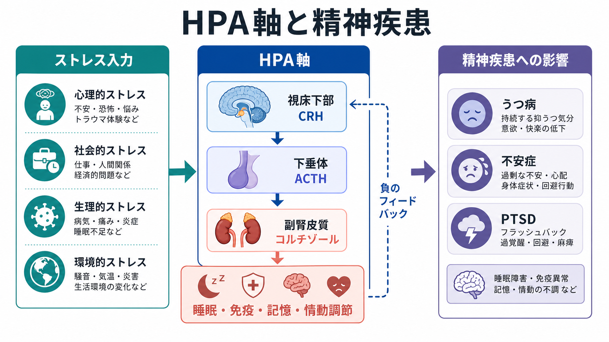
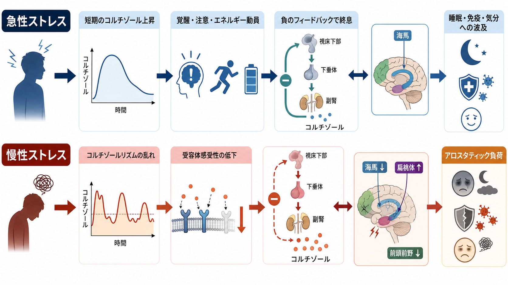
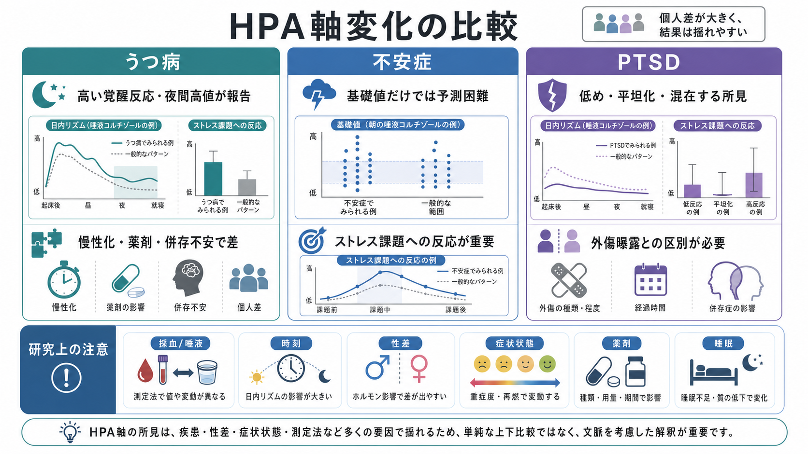

# HPA軸は精神疾患にどう関わるのか

## 要点

- HPA軸は、ストレスを受けたときに視床下部、下垂体、副腎皮質を連動させ、コルチゾールを介して覚醒、代謝、免疫、記憶、情動を調節する系である[1]。
- 急性ストレスでは適応的だが、慢性ストレスではコルチゾールのリズム、受容体感受性、負のフィードバック、睡眠・炎症・情動回路との相互作用が乱れやすい[2][3]。
- うつ病ではHPA軸の過活動が比較的一貫して報告される一方、不安症やPTSDでは疾患単位だけでなく性差、症状状態、併存、外傷曝露、測定時刻によって結果が大きく変わる[4][5][6]。
- HPA軸は「精神疾患の単独原因」ではなく、ストレス経験、脳回路、免疫、睡眠、認知、社会環境をつなぐ調節ノードとして理解するとよい。

## この記事で答える問い

1. HPA軸とは何か。
2. 慢性ストレスでHPA軸はどのように変化するのか。
3. うつ病・不安症・PTSDでは、HPA軸にどのような所見があるのか。
4. 研究や臨床でHPA軸を読むとき、どこに注意すべきか。

## まず結論

HPA軸は、ストレスに対して体を一時的に「動員モード」へ移す仕組みである。視床下部がCRHを出し、下垂体がACTHを出し、副腎皮質がコルチゾールを分泌する。コルチゾールはエネルギー利用、覚醒、免疫反応、記憶・情動処理に作用し、同時に視床下部や下垂体へ戻って反応を終わらせる[1][2]。

問題は、この系が長く強く働き続けること、または逆に必要な場面で適切に上がらないことである。慢性的なストレスでは、海馬・扁桃体・前頭前野を含むストレス制御回路、睡眠、炎症、認知評価が互いに影響し、HPA軸は疾患の「原因」でも「結果」でもあるような循環の中に入る[2][3]。したがってHPA軸は、精神疾患を一つのホルモン異常として還元する道具ではなく、脳・身体・環境の接続点として読む必要がある。

## 背景

ストレス反応は、危険や要求に対して体を素早く適応させる仕組みである。交感神経系が速い反応を担うのに対し、HPA軸は分単位から時間単位で持続する内分泌反応を担う。ここで中心になるコルチゾールは、血糖利用、循環、免疫、記憶固定、覚醒水準に関わる[1]。

精神疾患との関係が注目されるのは、うつ病、不安症、PTSDがいずれも「ストレスへの反応のしかた」と深く関係するからである。ただし、同じストレスでも、予測可能性、制御可能性、社会的評価、外傷性、幼少期経験、睡眠不足などによってHPA軸の反応は異なる[2]。[[ノルアドレナリンは覚醒とストレスにどう関わるのか]]で扱う速い覚醒系と、HPA軸の遅い内分泌反応は、並行して働くが同じものではない。

## 基本概念

### HPA軸

HPA軸とは、hypothalamic-pituitary-adrenal axis、すなわち視床下部-下垂体-副腎皮質系である。代表的な流れは次の通りである。

| 段階 | 主な物質 | 役割 |
|---|---|---|
| 視床下部 | CRH、AVP | 下垂体へストレス信号を送る |
| 下垂体前葉 | ACTH | 副腎皮質を刺激する |
| 副腎皮質 | コルチゾール | 代謝、免疫、脳機能を調節する |
| 脳・下垂体への戻り | グルココルチコイド受容体など | 反応を抑える負のフィードバックを作る |

HPA軸には日内リズムがある。一般にコルチゾールは起床前後に高く、日中から夜にかけて低下する。また、一定値で流れ続けるのではなく、拍動的に分泌される[1]。そのため、単回の採血や唾液コルチゾールだけで「HPA軸が高い/低い」と断定するのは危うい。

### 負のフィードバック

HPA軸の安定性を支えるのが負のフィードバックである。コルチゾールが増えると、視床下部や下垂体への抑制が強まり、CRHやACTHの分泌が下がる。海馬などの脳領域もこの制御に関わる[2]。[[海馬回路は記憶をどう形成するのか]]で扱う海馬は、記憶だけでなく、文脈に応じたストレス反応の調整にも関与する。

## 仕組み

### 急性ストレスでは適応的に働く

急性ストレスでは、コルチゾールの上昇は必ずしも悪いものではない。身体はエネルギーを動員し、注意を高め、免疫反応を調整し、危険な状況への対応を助ける[1][2]。短期的には、これは生存に役立つ。

### 慢性ストレスではアロスタティック負荷が増える

同じ反応が長期化すると、適応のための調節そのものが負荷になる。これをアロスタティック負荷と呼ぶ。慢性ストレスでは、コルチゾールの総量だけでなく、朝の立ち上がり、夜間低下、ストレス課題への反応、受容体感受性、炎症系との相互作用が変わる[3][8]。[[神経可塑性は発達と学習をどう支えるのか]]で扱う可塑性は、学習だけでなく、慢性ストレスへの脳回路の適応・不適応にも関係する。

### 脳回路と身体反応が循環する

HPA軸は内分泌系だけで閉じていない。扁桃体は脅威検出と情動反応に、海馬は文脈記憶とフィードバック制御に、前頭前野は評価・抑制・再解釈に関わる[2]。同時に、コルチゾールは免疫、代謝、睡眠にも影響する。したがって、慢性ストレスが精神症状に関わる道筋は、単純な「コルチゾールが高いからうつになる」ではなく、情動回路、睡眠、炎症、認知バイアスの循環として考える方が正確である。免疫との接点は[[ミクログリアは脳の免疫細胞として何をしているのか]]とも接続できる。

## 図解

### 3つの見方

| 見方 | 何を見るか | 精神疾患との読み方 |
|---|---|---|
| 水準 | 朝・昼・夜のコルチゾール量 | 高値/低値だけでなく日内リズムを見る |
| 反応性 | ストレス課題への上昇幅 | 脅威、社会的評価、制御不能性への反応を見る |
| フィードバック | デキサメタゾン抑制など | コルチゾールによる抑制が効くかを見る |

## 臨床・研究との接続

### うつ病

大うつ病では、HPA軸の過活動は比較的一貫して報告されてきた生物学的所見の一つである[4]。古典的には、コルチゾール高値、デキサメタゾン抑制不全、CRH/ACTH反応の変化などが議論されてきた。これは[[報酬系の異常はうつ病をどう説明するのか]]で扱う報酬系の低反応と独立した話ではなく、睡眠障害、食欲、疲労、炎症、認知的反すうと絡み合う。

ただし、うつ病の全員に同じHPA異常があるわけではない。重症度、メランコリー特徴、慢性化、幼少期逆境、薬剤、併存不安、測定方法によって結果は変わる。近年の研究では、基礎値だけでなくストレス反応性や長期指標を含めて読む必要がある[5][8]。

### 不安症

不安症では、HPA軸の結果はうつ病より一枚岩ではない。パニック症、社交不安症、全般不安症、恐怖症では、恐怖の対象、予期不安、回避、身体感覚への注意が異なるため、HPA軸の反応も同じとは限らない。精神疾患横断のメタ分析では、不安症のコルチゾール反応性には性差や症状状態が関わり、女性の現在症状では鈍い反応、男性の一部では高い反応が示されるなど、平均値だけでは解釈しにくい[5]。

この点は、[[セロトニンは気分だけに関わるのか]]のような神経伝達物質の説明にも共通する。単一物質の「多い/少ない」ではなく、どの文脈で、どの時間幅で、どの回路が関与しているかが重要になる。

### PTSD

PTSDでは、直感に反してコルチゾールが高いとは限らない。メタ分析では、PTSD群で日中コルチゾール出力が低めに出る所見や、デキサメタゾン後の抑制が強い所見が報告されている[6]。YehudaとSecklは、PTSDなど一部のストレス関連障害では、低めの循環コルチゾールと高いグルココルチコイド感受性が併存しうるという仮説を示している[7]。

ただし、PTSD研究では外傷曝露そのもの、PTSD発症、併存うつ病、外傷の発達時期、性差、時間経過を分ける必要がある[6]。同じ「外傷経験者」でも、PTSDを発症している人、発症していない人、うつ病を併存している人ではHPA軸所見が異なる可能性がある。これは臨床診断をホルモン値で置き換えるという意味ではない。

## よくある誤解

### 誤解1: コルチゾールが高いほど精神疾患が重い

必ずしもそうではない。うつ病では高値が議論されやすいが、PTSDでは低めの出力や強いフィードバックが報告されることがある[6][7]。また、ストレス課題への反応が鈍い場合も、高い場合もありうる[5]。

### 誤解2: HPA軸を測れば診断できる

現在のところ、HPA軸指標はうつ病・不安症・PTSDを単独で診断する検査ではない。測定時刻、採血か唾液か毛髪か、睡眠、薬剤、月経周期、身体疾患、喫煙、カフェイン、急性ストレスの有無で値は変わる[8]。教育・研究目的では有用だが、個別診断や治療指示として単純化してはいけない。

### 誤解3: HPA軸は「心の問題」を身体に置き換えるだけである

HPA軸は、心理を身体へ還元する概念ではない。むしろ、脳内評価、社会的文脈、身体状態、免疫、睡眠をつなぐ媒介である。[[精神疾患は脳の病気なのか]]で扱うように、精神疾患は脳だけ、身体だけ、社会だけのどれかに閉じない。

## 関連ノート

- [[ノルアドレナリンは覚醒とストレスにどう関わるのか]]
- [[セロトニンは気分だけに関わるのか]]
- [[海馬回路は記憶をどう形成するのか]]
- [[神経可塑性は発達と学習をどう支えるのか]]
- [[ミクログリアは脳の免疫細胞として何をしているのか]]
- [[報酬系の異常はうつ病をどう説明するのか]]
- [[精神疾患は脳の病気なのか]]

## MOC更新候補

- `content/00_MOC/MOC｜脳・神経科学.md`
- `content/00_MOC/MOC｜精神医学.md`

並列生成ジョブとの競合を避けるため、本記事ではMOC本体は更新していない。

## 理解チェック

1. HPA軸の3段階、CRH、ACTH、コルチゾールの関係を説明できるか。
2. 急性ストレスでのHPA軸活性化が適応的である理由を説明できるか。
3. 慢性ストレスで「コルチゾール総量」だけでなく「リズム」「反応性」「フィードバック」が重要になる理由を説明できるか。
4. うつ病、PTSD、不安症でHPA軸所見が同じ方向にそろわない理由を3つ挙げられるか。
5. HPA軸指標を臨床診断として単純に使えない理由を説明できるか。

## 未解決問題

- HPA軸の変化は、精神疾患の原因、結果、脆弱性、回復過程のどれをどの程度反映しているのか。
- 幼少期逆境、性差、睡眠、炎症、薬剤、併存疾患をどう分けてモデル化するか。
- 毛髪コルチゾール、日内唾液コルチゾール、ストレス課題、フィードバック試験をどのように統合すれば、個人差を説明できるか。
- HPA軸を標的にした介入は、どのサブタイプの患者に意味を持つのか。

## 参考文献

[1] Tsigos, C., Kyrou, I., Kassi, E., & Chrousos, G. P. (2020). Stress: Endocrine Physiology and Pathophysiology. *Endotext*. NCBI Bookshelf. https://www.ncbi.nlm.nih.gov/books/NBK278995/

[2] Herman, J. P., McKlveen, J. M., Ghosal, S., Kopp, B., Wulsin, A., Makinson, R., Scheimann, J., & Myers, B. (2016). Regulation of the hypothalamic-pituitary-adrenocortical stress response. *Comprehensive Physiology*, 6(2), 603-621. https://doi.org/10.1002/cphy.c150015

[3] McEwen, B. S. (2001). Plasticity of the hippocampus: adaptation to chronic stress and allostatic load. *Annals of the New York Academy of Sciences*, 933, 265-277. https://doi.org/10.1111/j.1749-6632.2001.tb05830.x

[4] Pariante, C. M., & Lightman, S. L. (2008). The HPA axis in major depression: classical theories and new developments. *Trends in Neurosciences*, 31(9), 464-468. https://doi.org/10.1016/j.tins.2008.06.006

[5] Zorn, J. V., Schür, R. R., Boks, M. P., Kahn, R. S., Joëls, M., & Vinkers, C. H. (2017). Cortisol stress reactivity across psychiatric disorders: A systematic review and meta-analysis. *Psychoneuroendocrinology*, 77, 25-36. https://doi.org/10.1016/j.psyneuen.2016.11.036

[6] Morris, M. C., Compas, B. E., & Garber, J. (2012). Relations among posttraumatic stress disorder, comorbid major depression, and HPA function: a systematic review and meta-analysis. *Clinical Psychology Review*, 32(4), 301-315. https://doi.org/10.1016/j.cpr.2012.02.002

[7] Yehuda, R., & Seckl, J. (2011). Minireview: Stress-related psychiatric disorders with low cortisol levels: a metabolic hypothesis. *Endocrinology*, 152(12), 4496-4503. https://doi.org/10.1210/en.2011-1218

[8] Staufenbiel, S. M., Penninx, B. W. J. H., Spijker, A. T., Elzinga, B. M., & van Rossum, E. F. C. (2013). Hair cortisol, stress exposure, and mental health in humans: A systematic review. *Psychoneuroendocrinology*, 38(8), 1220-1235. https://doi.org/10.1016/j.psyneuen.2012.11.015
