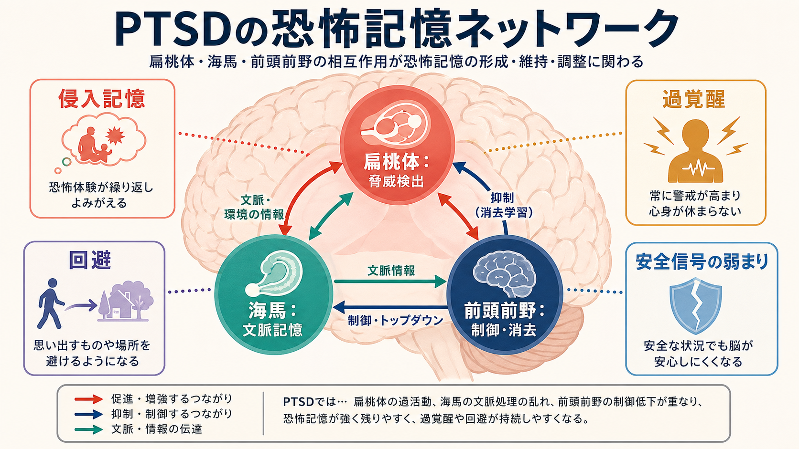
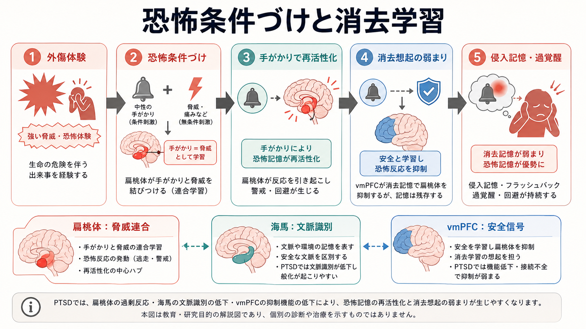
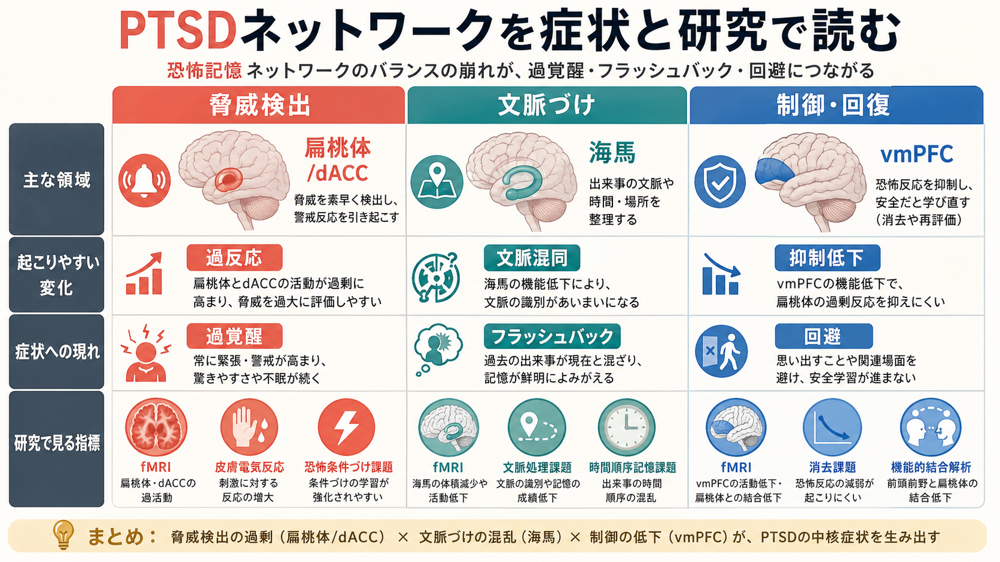

# PTSDでは恐怖記憶ネットワークに何が起きているのか

## 要点

- PTSDでは、外傷体験の記憶が「過去の出来事」として安定して収まらず、手がかりによって現在の危険のように再活性化されやすい。
- 中心になるのは、[[扁桃体過活動は不安症やPTSDにどう関わるのか|扁桃体]]、[[海馬回路は記憶をどう形成するのか|海馬]]、[[前頭前野は情動制御にどう関わるのか|前頭前野]]の相互作用である[1][2][3]。
- 扁桃体は脅威手がかりへの反応を強め、海馬は「どの文脈なら危険か」を識別し、内側前頭前野は安全信号や消去記憶を使って防御反応を調整する[2][4]。
- PTSDの過覚醒は「怖がりすぎ」ではなく、脅威検出、身体覚醒、文脈処理、消去想起、注意制御が結びついたネットワーク状態として理解できる[5][6]。
- ここでの説明は教育・研究目的の神経回路モデルであり、個別の診断や治療指示を行うものではない。

## この記事で答える問い

1. PTSDでは、恐怖記憶ネットワークにどのような偏りが起こるのか。
2. 扁桃体・海馬・前頭前野は、それぞれどの役割を担うのか。
3. トラウマ記憶、フラッシュバック、過覚醒はどのように同じ回路でつながるのか。
4. 研究知見を臨床理解に使うとき、どこを単純化してはいけないのか。

## まず結論

PTSDの恐怖記憶ネットワークでは、「脅威を検出する働き」が強まり、「文脈を区別する働き」と「安全を思い出して反応を下げる働き」が相対的に弱くなりやすい。典型的な説明では、扁桃体反応の増大、海馬による文脈処理の不安定さ、内側前頭前野や前部帯状皮質による調整の不足が組み合わさる[2][3][5]。

その結果、外傷を思い出させる音、匂い、場所、身体感覚、対人状況が、現在の安全な文脈から切り離されて「いま危険が起きている」という信号として処理されやすくなる。これがフラッシュバック、侵入記憶、過覚醒、回避、睡眠の乱れ、注意集中困難の理解につながる[1][6]。

ただし、これは「扁桃体が壊れている」「海馬が小さいからPTSDになる」という単純な話ではない。PTSDは、外傷の性質、発達歴、遺伝的脆弱性、社会的支援、睡眠、身体疾患、併存症、回復過程が絡む多層的な状態である。恐怖記憶ネットワークは、そのうち神経回路レベルで症状を読み解くための地図である[6][7]。

## 背景

PTSDは、生命や身体の安全を脅かす出来事、性的暴力、重傷、死の脅威、またはそれらへの直接・間接曝露のあとに生じうる障害である。症状は、再体験、回避、認知と気分の陰性変化、覚醒と反応性の変化に整理される[1]。このうち、恐怖記憶ネットワークは、特に再体験、過覚醒、回避、手がかり反応性を理解するうえで重要である。

恐怖条件づけ研究では、本来は中立だった刺激が嫌悪的な出来事と結びつくと、その刺激だけで防御反応が起こるようになる。扁桃体はこの結びつきの形成と表出に重要であり、海馬はその出来事が起きた場所・時間・状況を束ね、前頭前野は危険が終わったあとに反応を抑える学習を支える[4][5]。

PTSD研究では、この基礎モデルがヒトの神経画像、精神生理、内分泌、遺伝・分子研究と接続されてきた。古典的な神経回路モデルは、扁桃体の過反応、内側前頭前野の調整不足、海馬の文脈処理の弱さを中心に置いた[2]。近年のレビューでは、これに青斑核ノルアドレナリン系、HPA軸、睡眠、免疫、感覚処理、記憶再固定化などが加わり、より広いネットワークとして扱われている[6][7]。

## 基本概念

### 恐怖記憶

恐怖記憶とは、危険な出来事と、そのときの手がかり、身体反応、情動、文脈が結びついた記憶である。適応的には、将来の危険を避けるために必要である。しかし、PTSDではその記憶が過度に強く、断片的で、現在の安全文脈から切り離されて再活性化されることがある。

### 扁桃体

扁桃体は、脅威手がかりの検出、恐怖条件づけ、情動的記憶、身体反応の動員に関わる。PTSDや不安症の神経画像メタ分析では、情動刺激に対する扁桃体や島皮質の反応増大が報告されている[3]。ただし、扁桃体は「恐怖だけの中枢」ではなく、行動上重要な刺激を評価し、注意と身体準備を変える回路の一部である。

### 海馬

海馬は、出来事を文脈の中に置く。つまり、「どこで」「いつ」「何と一緒に」起きたのかを束ね、類似した状況を区別する。PTSDでは、外傷関連手がかりが現在の安全な文脈から切り離され、過去の危険が現在に侵入するように経験されることがある。この文脈処理の問題は、海馬・前頭前野・視床などを含む回路の調整不全として議論されている[5]。

### 前頭前野

内側前頭前野、とくに腹内側前頭前野（vmPFC）は、安全信号、消去記憶、情動反応の調整に関わる。恐怖消去は恐怖記憶を消すことではなく、「この文脈では危険は起きない」という新しい学習を作る過程である。ヒト研究では、消去想起にvmPFCと海馬が協調して関わることが示されている[4]。

### 過覚醒

過覚醒は、常に警戒している、驚きやすい、眠れない、集中しにくい、身体が緊張しているといった状態を含む。これは意志の弱さではなく、[[ノルアドレナリンは覚醒とストレスにどう関わるのか|ノルアドレナリン系]]、自律神経、扁桃体、島皮質、前頭前野、睡眠調節が絡む防御モードの持続として理解できる[6]。

## 仕組み

### 1. 外傷体験で脅威手がかりが強く結びつく

外傷体験では、強い恐怖、痛み、無力感、身体反応、感覚情報が同時に起こる。扁桃体は、音、匂い、表情、場所、身体感覚などの手がかりと防御反応を結びつける。これは危険を早く検出するためには適応的だが、結びつきが強すぎると、外傷と似た一部の手がかりだけで反応が再燃しやすくなる[2][4]。

### 2. 文脈処理が弱いと「過去」と「現在」が混ざる

海馬は、危険が起きた文脈と現在の文脈を区別する。たとえば、同じ音でも「戦場で聞いた音」と「安全な街で聞いた似た音」は意味が違う。文脈処理が不安定になると、手がかりは現在の安全情報で抑えられず、外傷時の意味を帯びたまま再活性化される[5]。

この観点では、PTSDの再体験は単なる「強い記憶」ではない。記憶が現在の文脈に再配置されにくく、身体反応や感覚断片と一緒に呼び出されるため、過去を思い出しているというより、いま再び起きているように感じられる。

### 3. 消去学習と消去想起がうまく働きにくい

恐怖消去では、危険手がかりに何度も出会っても実際には危険が起きないことを学ぶ。しかし消去は、古い恐怖記憶を完全に消すのではなく、新しい安全記憶を重ねる過程である。そのため、ストレス、睡眠不足、文脈の変化、似た手がかりによって、恐怖反応は再び出ることがある[4]。

PTSDの神経回路モデルでは、vmPFCや前部帯状皮質による調整が弱いと、扁桃体反応を下げる安全信号が働きにくくなると考えられる[2][3]。これは「理性が足りない」という意味ではなく、安全学習を呼び出す回路が脅威回路に負けやすい状態である。

### 4. 身体覚醒が記憶をさらに強める

過覚醒では、心拍、呼吸、筋緊張、発汗、睡眠の浅さ、驚愕反応が高まりやすい。身体が防御モードに入ると、注意は危険手がかりへ偏り、曖昧な刺激を脅威として解釈しやすくなる。こうした身体反応は、[[サリエンスネットワークとは何か|サリエンスネットワーク]]や島皮質の働きとも接続する。

PTSDの生物学的研究では、外傷関連手がかりや外傷イメージに対する心拍、皮膚電気反応、顔面筋反応などの増大が比較的一貫して報告されている[6]。つまり、トラウマ記憶は「頭の中の映像」だけではなく、身体の準備状態としても再生される。

### 5. 回避は短期的には楽にするが、長期的には安全学習を減らす

外傷関連の場所、人、話題、感覚を避けると、短期的には苦痛が下がる。しかし、避け続けると「この手がかりに出会っても危険は起きない」という新しい学習の機会が減る。結果として、恐怖記憶ネットワークは更新されにくくなる。

これは回避を責める説明ではない。回避は強い苦痛から身を守るための自然な反応である。ただし研究・臨床理解では、回避が恐怖消去や文脈更新の機会を減らしうる点を押さえる必要がある。

## 図解

図1は、扁桃体、海馬、前頭前野を中心に、侵入記憶、過覚醒、回避、安全信号の弱まりをまとめた概念地図である。PTSDを単一部位の問題ではなく、脅威検出・文脈づけ・制御のバランスとして読むための入口になる。

図2は、外傷体験から恐怖条件づけ、手がかりによる再活性化、消去学習の弱まり、侵入記憶・過覚醒へ進む流れを示している。重要なのは、消去が記憶の削除ではなく、新しい安全学習である点である。

図3は、脅威検出、文脈づけ、制御・回復を比較した図である。研究では、fMRI、精神生理指標、恐怖条件づけ・消去課題、安静時結合などを組み合わせて、このネットワークのどこが症状と結びつくかを調べる。

## 臨床・研究との接続

臨床的には、このモデルは「症状を責めずに説明する」ために役立つ。過覚醒は、本人が過剰に気にしているだけではなく、脅威手がかり、身体覚醒、記憶、文脈処理が連動している状態として理解できる。再体験も、意思で思い出しているというより、手がかりによって記憶ネットワークが自動的に再活性化される現象として整理できる[1][6]。

研究的には、PTSDを一つの診断名だけで扱うのではなく、症状ドメインごとに回路を調べる方向が重要である。たとえば、侵入記憶は感覚・記憶・文脈処理、過覚醒は覚醒系と自律神経、回避は強化学習と安全学習、陰性気分は報酬系や自己関連処理と接続する。これは[[脳ネットワークの破綻は精神疾患をどう説明するのか]]や[[機能的結合解析とは何か]]にもつながる。

ただし、脳画像や生理指標を個人診断に直結させるのは危険である。[[fMRIは神経活動を直接測っているのか|fMRI]]のBOLD信号は神経活動そのものではなく、課題、解析、薬物、睡眠、併存症、年齢、性別、外傷の種類によって結果が変わる。神経回路モデルは、診断名を置き換える検査ではなく、症状の仕組みを考えるための仮説である。

## よくある誤解

### 誤解1: PTSDは扁桃体の過活動だけで説明できる

扁桃体は重要だが、PTSDは扁桃体単独の問題ではない。海馬の文脈処理、前頭前野の安全信号、島皮質の身体感覚、前部帯状皮質の注意・反応調整、覚醒系、睡眠、社会的環境が重なる[5][6]。

### 誤解2: トラウマ記憶は強い記憶だから消せばよい

恐怖消去は記憶の削除ではなく、新しい安全学習である[4]。過去の記憶をなかったことにするのではなく、現在の文脈で反応を調整できるようにすることが重要になる。

### 誤解3: 海馬が小さい、または前頭前野が弱い人がPTSDになる

集団研究で体積差や活動差が見つかっても、それを個人に単純に当てはめることはできない。外傷前の脆弱性、外傷後の変化、併存症、薬物、睡眠、生活歴を分ける必要がある[6][7]。

### 誤解4: 神経回路で説明すると心理社会的要因が不要になる

逆である。恐怖記憶ネットワークは、外傷体験、社会的安全、支援、予測可能性、睡眠、身体状態によって更新される。神経回路モデルは、心理・身体・環境をつなぐための言語であり、社会的文脈を消すものではない。

## 関連ノート

- [[扁桃体過活動は不安症やPTSDにどう関わるのか]]
- [[前頭前野は情動制御にどう関わるのか]]
- [[海馬回路は記憶をどう形成するのか]]
- [[HPA軸は精神疾患にどう関わるのか]]
- [[ノルアドレナリンは覚醒とストレスにどう関わるのか]]
- [[サリエンスネットワークとは何か]]

### 関連ノート候補

- PTSDとは何か
- フラッシュバックとは何か
- 過覚醒とは何か
- トラウマ関連障害群とは何か
- トラウマは発達にどう影響するのか
- 恐怖条件づけとは何か
- 恐怖消去とは何か
- PTSDの神経回路モデルとは何か
- 文脈処理はPTSDにどう関わるのか
- トラウマ記憶の再固定化とは何か

### MOC更新候補

- `content/00_MOC/` 配下の脳・神経科学、精神医学、トラウマ関連のMOCに追加候補。
- 並列ジョブとの競合を避けるため、本タスクではMOC本文は更新しない。

## 理解チェック

1. PTSDの恐怖記憶ネットワークを、扁桃体・海馬・前頭前野の3要素で説明できるか。
2. 恐怖条件づけと恐怖消去の違いを説明できるか。
3. フラッシュバックを「強い記憶」だけで説明すると、何が抜け落ちるか。
4. 過覚醒を身体覚醒、注意、記憶、文脈処理の連動として説明できるか。
5. 脳画像研究の知見を個人診断にそのまま使えない理由を挙げられるか。

## 参考文献

[1] National Institute of Mental Health. (2026). *Post-Traumatic Stress Disorder*. https://www.nimh.nih.gov/health/publications/post-traumatic-stress-disorder-ptsd

[2] Rauch, S. L., Shin, L. M., & Phelps, E. A. (2006). Neurocircuitry models of posttraumatic stress disorder and extinction: human neuroimaging research-past, present, and future. *Biological Psychiatry, 60*(4), 376-382. https://doi.org/10.1016/j.biopsych.2006.06.004

[3] Etkin, A., & Wager, T. D. (2007). Functional neuroimaging of anxiety: a meta-analysis of emotional processing in PTSD, social anxiety disorder, and specific phobia. *American Journal of Psychiatry, 164*(10), 1476-1488. https://doi.org/10.1176/appi.ajp.2007.07030504

[4] Milad, M. R., & Quirk, G. J. (2012). Fear extinction as a model for translational neuroscience: ten years of progress. *Annual Review of Psychology, 63*, 129-151. https://doi.org/10.1146/annurev.psych.121208.131631

[5] Liberzon, I., & Abelson, J. L. (2016). Context processing and the neurobiology of post-traumatic stress disorder. *Neuron, 92*(1), 14-30. https://doi.org/10.1016/j.neuron.2016.09.039

[6] Pitman, R. K., Rasmusson, A. M., Koenen, K. C., Shin, L. M., Orr, S. P., Gilbertson, M. W., Milad, M. R., & Liberzon, I. (2012). Biological studies of post-traumatic stress disorder. *Nature Reviews Neuroscience, 13*(11), 769-787. https://doi.org/10.1038/nrn3339

[7] Ressler, K. J., Berretta, S., Bolshakov, V. Y., Rosso, I. M., Meloni, E. G., Rauch, S. L., & Carlezon, W. A. Jr. (2022). Post-traumatic stress disorder: clinical and translational neuroscience from cells to circuits. *Nature Reviews Neurology, 18*, 273-288. https://doi.org/10.1038/s41582-022-00635-8

## 未解決問題

- 外傷前からの脆弱性と、外傷後に生じた回路変化を個人レベルでどう区別するか。
- PTSDのサブタイプごとに、扁桃体、海馬、前頭前野、覚醒系のどの組み合わせが最も重要か。
- 恐怖消去、再固定化、睡眠、身体感覚への介入が、どの時間スケールで恐怖記憶ネットワークを変えるか。
- 神経画像・生理指標を、診断ではなく予後予測や介入反応の研究にどう慎重に接続するか。
