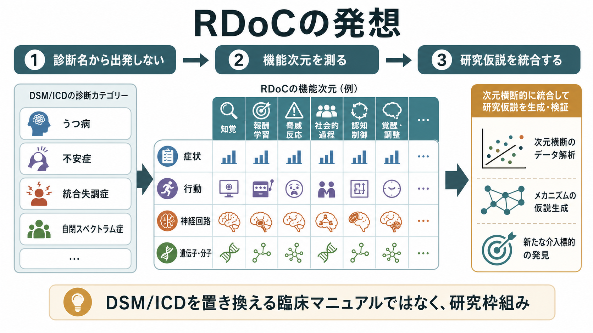
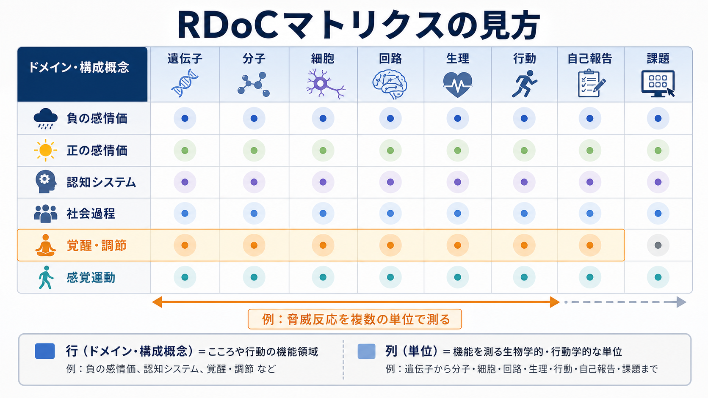
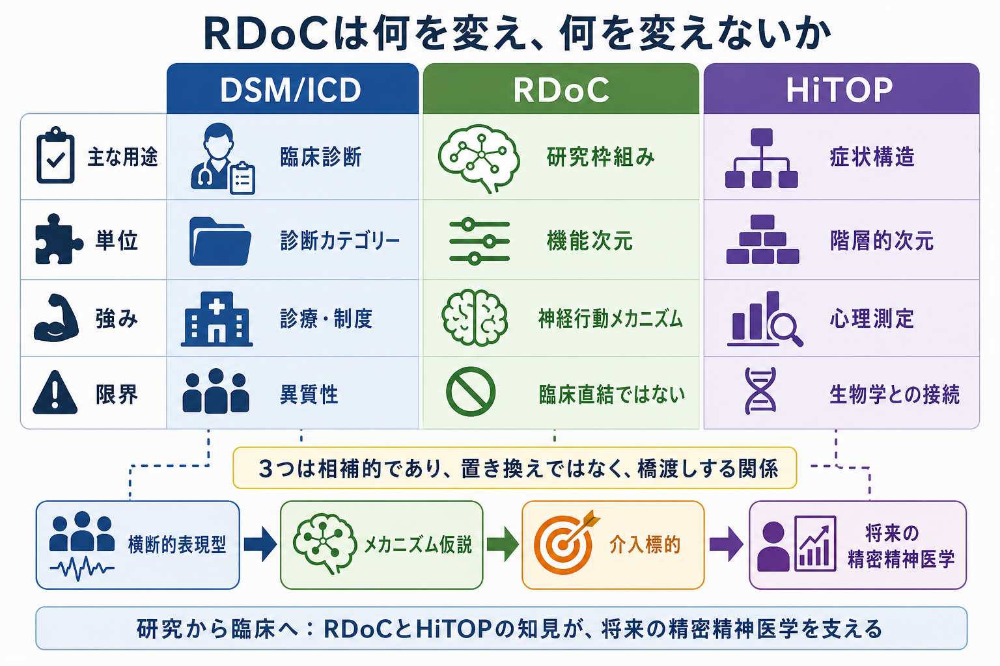

# RDoCは精神疾患研究をどう変えたのか

## 要点

- RDoC（Research Domain Criteria）は、DSM や ICD の診断カテゴリーを置き換える臨床診断マニュアルではなく、精神疾患を研究するための枠組みである[1][2]。
- 出発点を「うつ病」「統合失調症」のような診断名ではなく、脅威反応、報酬学習、認知制御、社会過程、覚醒調節などの機能次元に置く[2][3]。
- 各機能次元を、遺伝子、分子、細胞、神経回路、生理、行動、自己報告、課題という複数の単位で測定する点が特徴である[3][4]。
- RDoC は、カテゴリ診断と次元診断、精神疾患の次元的理解、[[神経科学は精神疾患をどのように説明できるのか]] をつなぐ研究言語として理解できる。

## この記事で答える問い

この記事では、RDoC が精神疾患研究に何をもたらしたのかを整理する。特に、RDoC が「診断名を脳画像や遺伝子で置き換える計画」ではなく、症状・行動・神経回路・遺伝子を同じ研究設計の中で結びつけるための枠組みである点を明確にする。

## まず結論

RDoC が変えたのは、精神疾患を研究するときの「単位」である。従来の研究では、DSM や ICD の診断カテゴリーを群分けの出発点にして、ある診断群と健常対照群を比較する設計が多かった。これは臨床的には有用だが、同じ診断名の中に異質な症状・病態が混在し、異なる診断名の間に似た症状や回路異常がまたがるという問題を抱える[1][6]。

RDoC はこの問題に対し、診断名をいったん脇に置き、脅威、報酬、認知制御、社会的コミュニケーション、覚醒・睡眠、運動などの機能次元を測る。さらに、その機能次元を自己報告だけでなく、行動課題、生理指標、神経回路、分子・遺伝子など複数の測定単位で対応づける[3][4]。そのため、RDoC は診断横断的症候群の整理や [[精神疾患における機能的結合異常とは何か]] と相性がよい。

## 背景

DSM と ICD は、診療、疫学、保険・制度、研究対象の標準化に大きく貢献してきた。一方で、精神疾患の診断カテゴリーは、発熱や血糖値のような単一の生物学的指標で決まるものではない。多くの診断は、症状の組み合わせ、持続期間、機能障害、除外診断によって定義される。このため、同じ診断名でも原因や神経機構が異なりうるし、異なる診断名でも不安、睡眠障害、認知機能低下、報酬感受性低下などが共有される[1][6]。

NIMH はこの限界を背景に、2009 年に RDoC プロジェクトを開始した[2]。2010 年の提案では、RDoC は精神疾患研究のための新しい分類枠組みとして提示され、診断カテゴリーよりも、神経生物学と観察可能な行動に基づく次元を重視するとされた[1]。これは DSM と ICD を否定するものではなく、臨床分類と研究分類の役割を分ける試みである。

## 基本概念

RDoC の中心は「ドメイン」「構成概念」「分析単位」の 3 つである。

| 概念 | 意味 | 例 |
|---|---|---|
| ドメイン | 大きな機能領域 | 負の感情価、正の感情価、認知システム、社会過程、覚醒・調節、感覚運動 |
| 構成概念 | ドメイン内の具体的な機能次元 | 急性脅威、潜在的脅威、報酬反応、ワーキングメモリ、社会的コミュニケーション |
| 分析単位 | 構成概念を測る測定レベル | 遺伝子、分子、細胞、回路、生理、行動、自己報告、課題 |

NIMH の現行説明では、RDoC マトリクスは 6 つの主要な人間機能ドメインからなり、構成概念は正常から異常までの連続的な範囲で研究される[3]。たとえば「脅威反応」を研究する場合、質問紙で不安を測るだけでなく、恐怖条件づけ課題、皮膚電気反応、扁桃体を含む回路活動、関連する遺伝的・分子的指標を組み合わせて検討する。

## 仕組み

RDoC 的な研究設計では、研究者はまず「どの診断名か」ではなく「どの機能次元が変化しているか」を問う。たとえば快感消失を扱うなら、対象を大うつ病だけに限定せず、双極性障害、統合失調症、依存症、パーキンソン病などにまたがる報酬学習・報酬反応性の変化として扱える。これは [[報酬系の異常はうつ病をどう説明するのか]] と直接つながる。

この発想には 3 つの利点がある。

第一に、診断内の異質性を分解しやすい。同じ「うつ病」でも、睡眠・覚醒の変化が主な人、報酬反応性の低下が目立つ人、認知制御の低下が中心の人では、研究上の仮説も測定指標も異なる。

第二に、診断を横断する共通機構を探しやすい。不安症、PTSD、強迫症、うつ病では、それぞれ診断名は異なっても、脅威予測、回避学習、情動調整、認知制御の変化が共有されることがある。これは [[PTSDでは恐怖記憶ネットワークに何が起きているのか]] や [[扁桃体過活動は不安症やPTSDにどう関わるのか]] と関係する。

第三に、基礎研究と臨床研究の橋渡しがしやすい。動物実験、認知課題、fMRI、心理尺度、計算モデルを「同じ構成概念を異なる単位で測っている」と位置づけることで、[[神経回路とは何か]] や [[脳ネットワークの破綻は精神疾患をどう説明するのか]] の知見を精神症状の理解へ接続しやすくなる[4][5]。

## 図解

RDoC の変化を一言でいうと、「診断カテゴリーを横に並べる研究」から「機能次元を縦横に測る研究」への移行である。

| 従来型の典型 | RDoC 型の典型 |
|---|---|
| うつ病群 vs 健常群 | 報酬反応性の連続量を測る |
| 統合失調症群 vs 健常群 | ワーキングメモリ、予測誤差、社会認知を測る |
| 不安症群 vs 健常群 | 急性脅威・潜在的脅威・回避学習を測る |
| 診断名を独立した箱として扱う | 診断をまたぐ症状・行動・回路を扱う |

## 臨床・研究との接続

RDoC は現在の診療場面で、診断書や処方判断の直接的な基準として使うものではない。臨床では DSM や ICD が依然として、診断、制度、コミュニケーション、疫学の共通言語として必要である[2][5]。

一方で、研究と教育では RDoC の意味は大きい。RDoC は、精神症状を「疾患名のリスト」ではなく、複数の機能システムの変化として考える訓練になる。たとえば、幻覚を「統合失調症の症状」とだけ見ず、予測処理、知覚、サリエンス、言語ネットワーク、トラウマ関連反応の変化として調べることができる。これは予測誤差処理による妄想理解や [[幻覚は脳内でどのように生じるのか]] と接続する。

また、RDoC はバイオマーカー研究にも影響した。ただし、RDoC は「脳画像を撮れば診断できる」という単純な主張ではない。むしろ、特定の診断名に対応する単一バイオマーカーを探すよりも、機能次元ごとに測定指標を組み合わせ、将来的な介入標的や予後予測につなげる発想を促した[5]。この点は、精神疾患の神経画像バイオマーカーをどう実用化するかという問題と重なる。

## よくある誤解

### 誤解1: RDoCはDSM/ICDを廃止するためのもの

RDoC は臨床診断マニュアルではない。NIMH の説明や RDoC 関連論文では、RDoC は研究を組織化する枠組みであり、将来の診断体系を改善する知識を蓄積するためのものと位置づけられている[2][5]。

### 誤解2: RDoCは生物学だけを重視する

RDoC は神経回路や遺伝子を重視するが、自己報告、行動、課題、生理指標も分析単位に含める。2022 年の再評価では、発達、環境、文化、社会的決定要因、計算論的アプローチの重要性も強調されている[5]。したがって、RDoC は単純な生物学的還元主義として読むより、多層的な測定を統合する枠組みとして読む方が正確である。

### 誤解3: RDoCだけで臨床分類の問題は解決する

RDoC は強力な研究枠組みだが、臨床でそのまま使える分類ではない。症状構造を心理測定的に整理する HiTOP のような別系統の次元モデルもあり、RDoC と HiTOP は対立するというより補完的に考えられる[7][8]。HiTOP は症状の共変動や階層構造を扱い、RDoC は神経行動メカニズムを扱うため、両者の接続は今後の精神疾患分類に重要である[8]。

## 関連ノート

- [[神経科学は精神疾患をどのように説明できるのか]]
- [[脳ネットワークの破綻は精神疾患をどう説明するのか]]
- [[報酬系の異常はうつ病をどう説明するのか]]

## 関連ノート候補

- DSMとICDは何が違うのか
- カテゴリ診断と次元診断は何が違うのか
- 精神疾患の次元的理解とは何か
- 精神科における診断横断的症候群とは何か
- 精神疾患の神経画像バイオマーカーは実用化できるのか
- 妄想は予測誤差処理の異常として説明できるのか

## MOC更新候補

- `content/00_MOC/` 配下の神経科学、精神医学、計算論的精神医学、研究法関連 MOC に追加候補。
- 並列ジョブとの競合を避けるため、この作業では MOC 本体は更新しない。

## 理解チェック

1. RDoC が DSM/ICD と異なるのは、研究の出発点をどこに置くからか。
2. RDoC マトリクスにおける「ドメイン」「構成概念」「分析単位」は、それぞれ何を意味するか。
3. RDoC が診断横断的研究に向いている理由を、報酬または脅威反応の例で説明できるか。
4. RDoC が臨床診断マニュアルではないことは、研究応用と臨床応用を考えるうえでなぜ重要か。

## 未解決問題

- RDoC の構成概念を、日常診療で使える簡潔な評価指標へどう翻訳するか。
- 複数の分析単位が一致しないとき、どの単位を優先して解釈するか。
- 発達、文化、社会的決定要因を、神経行動メカニズムと同じ研究設計にどう組み込むか。
- RDoC、HiTOP、DSM/ICD を、将来の精密精神医学でどのように統合するか。

## 参考文献

[1] Insel, T., Cuthbert, B., Garvey, M., Heinssen, R., Pine, D. S., Quinn, K., Sanislow, C., & Wang, P. (2010). Research domain criteria (RDoC): Toward a new classification framework for research on mental disorders. *American Journal of Psychiatry, 167*(7), 748-751. https://doi.org/10.1176/appi.ajp.2010.09091379

[2] Cuthbert, B. N., & Insel, T. R. (2013). Toward the future of psychiatric diagnosis: The seven pillars of RDoC. *BMC Medicine, 11*, 126. https://doi.org/10.1186/1741-7015-11-126

[3] National Institute of Mental Health. (n.d.). *Definitions of the RDoC Domains and Constructs*. https://www.nimh.nih.gov/research/research-funded-by-nimh/rdoc/definitions-of-the-rdoc-domains-and-constructs

[4] National Institute of Mental Health. (n.d.). *RDoC Matrix*. https://www.nimh.nih.gov/research/research-funded-by-nimh/rdoc/constructs/rdoc-matrix

[5] Morris, S. E., Sanislow, C. A., Pacheco, J., Vaidyanathan, U., Gordon, J. A., & Cuthbert, B. N. (2022). Revisiting the seven pillars of RDoC. *BMC Medicine, 20*, 220. https://doi.org/10.1186/s12916-022-02414-0

[6] Hyman, S. E. (2021). Psychiatric disorders: Grounded in human biology but not natural kinds. *Perspectives in Biology and Medicine, 64*(1), 6-28. https://doi.org/10.1353/pbm.2021.0002

[7] Kotov, R., Krueger, R. F., Watson, D., Achenbach, T. M., Althoff, R. R., Bagby, R. M., Brown, T. A., Carpenter, W. T., Caspi, A., Clark, L. A., Eaton, N. R., Forbes, M. K., & others. (2017). The Hierarchical Taxonomy of Psychopathology (HiTOP): A dimensional alternative to traditional nosologies. *Journal of Abnormal Psychology, 126*(4), 454-477. https://doi.org/10.1037/abn0000258

[8] Michelini, G., Palumbo, I. M., DeYoung, C. G., Latzman, R. D., & Kotov, R. (2021). Linking RDoC and HiTOP: A new interface for advancing psychiatric nosology and neuroscience. *Clinical Psychology Review, 86*, 102025. https://doi.org/10.1016/j.cpr.2021.102025
