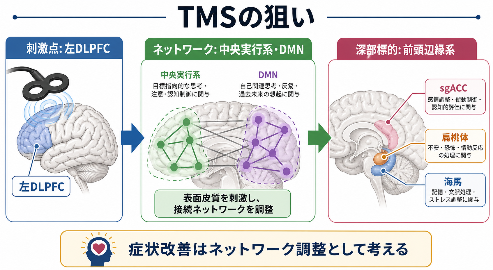
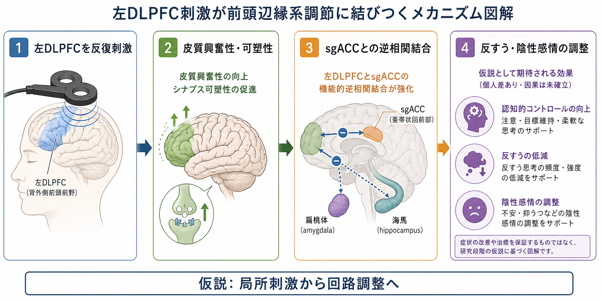
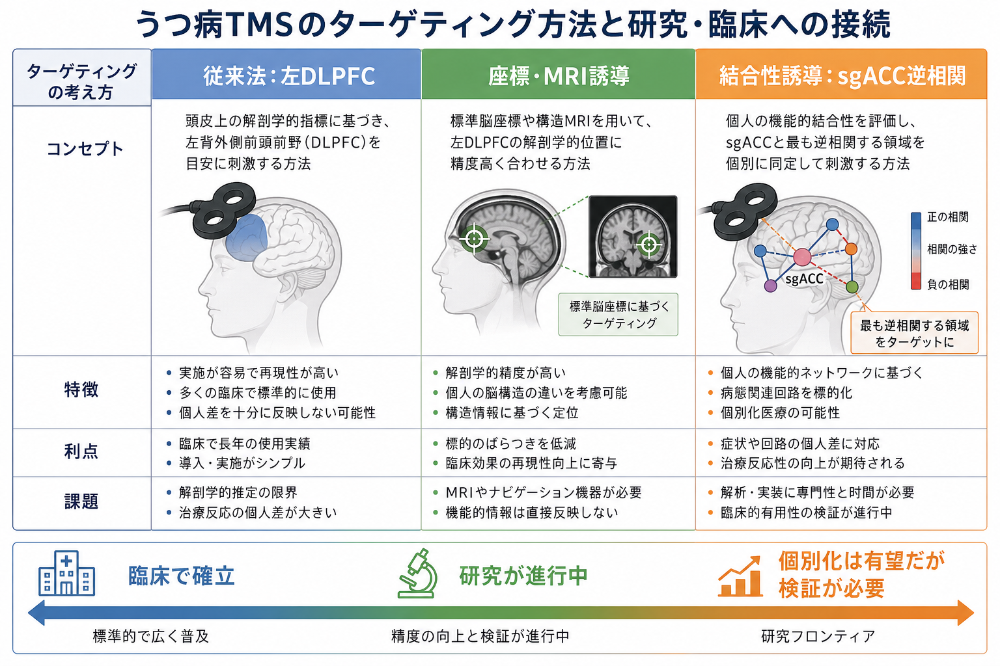

# TMSはうつ病治療でどの神経回路を狙っているのか

## 要点

- うつ病に対するTMSは、頭皮上から「気分の中枢」を直接刺激する治療ではない。主な臨床ターゲットは左背外側前頭前野（left dorsolateral prefrontal cortex; 左DLPFC）であり、そこから前頭辺縁系ネットワークを調整する介入として理解するとよい[1][2]。
- 左DLPFCは、認知制御、再評価、注意の向け直し、作業記憶、行動選択に関わる前頭前野領域である。うつ病では、反すう、否定的自己評価、報酬予測の低下、情動調節の困難と結びついて考えられる[2][4]。
- 近年の重要な考え方は、TMSの有効なDLPFC刺激点ほど、安静時機能結合で膝下部前帯状皮質（subgenual anterior cingulate cortex; sgACC）と強く逆相関する、というネットワーク仮説である[4][5]。
- sgACC、扁桃体、海馬、内側前頭前野、デフォルトモードネットワーク（DMN）、サリエンスネットワークは、抑うつ気分、自己関連処理、身体感覚、反すう、ストレス応答と関わる。TMSはこれらを単独で「止める」のではなく、DLPFCを入口として回路の結合様式を変えようとする[4][6][8]。
- 臨床的には左前頭前野高頻度rTMSなどに実績がある一方、個別化ターゲティング、加速iTBS、SNT/SAINTのような高密度プロトコルは有望だが、適応・安全性・一般化可能性を分けて読む必要がある[1][2][7][8]。

## この記事で答える問い

1. うつ病治療でTMSはなぜ左DLPFCを刺激するのか。
2. 左DLPFC刺激は、sgACC、扁桃体、海馬、DMNなどの前頭辺縁系とどう関係するのか。
3. 「DLPFC-sgACC逆相関」は何を意味し、どこまで臨床に使えるのか。
4. 従来のTMS、画像誘導TMS、加速iTBS/SNTを、神経回路の観点からどう整理できるのか。

## まず結論

うつ病TMSの中心的な狙いは、左DLPFCという皮質表面に近い入口を刺激し、抑うつに関わる前頭辺縁系ネットワークのバランスを変えることである。左DLPFCは頭蓋外から比較的狙いやすく、認知制御や情動調節に関わり、さらにsgACCや扁桃体、海馬、DMNと機能的につながる。したがってTMSの標的は「左DLPFCそのもの」だけではなく、「左DLPFCを介して調整されるネットワーク」と考える方が正確である。

特にsgACCは、持続的な陰性感情、身体化された苦痛、自己関連処理、治療抵抗性うつ病の神経回路モデルで繰り返し注目されてきた領域である。Foxらは、過去研究で有効性が高かった左DLPFC刺激点ほどsgACCと逆相関することを示し、DLPFC-sgACC結合に基づくターゲティング仮説を提案した[4]。その後、Weigandらは実際のrTMS患者で、刺激点とsgACCの負の機能結合が抗うつ反応を予測することを前向きに検証した[5]。

ただし、この話は「sgACCを抑えればうつ病が治る」という単純な図式ではない。TMSの効果は、刺激部位、コイル位置、個人の脳構造、機能結合、刺激プロトコル、病態のサブタイプ、薬物療法や心理社会的背景に依存する。この記事では、[[トランスクラニアル磁気刺激TMSは何をしているのか]]を前提に、うつ病治療でTMSが狙う神経回路を「局所刺激」と「ネットワーク調整」の二層で整理する。

## 背景

TMSは、変化する磁場によって脳内に誘導電場を生じさせ、皮質ニューロンの発火しやすさやネットワーク活動を変える非侵襲的脳刺激法である。うつ病治療では、反復TMS（repetitive TMS; rTMS）や間欠的シータバースト刺激（intermittent theta burst stimulation; iTBS）が用いられる。Clinical TMS Societyのコンセンサスレビューは、成人の大うつ病性障害に対する日次の左前頭前野TMSが、急性期治療として有効性と安全性の実績を持つと整理している[1]。

歴史的には、左DLPFCへの高頻度rTMSが代表的なプロトコルとして発展した。O'Reardonらの多施設ランダム化比較試験では、薬物療法で十分な改善を得られなかった大うつ病患者を対象に、左DLPFCへのrTMSが偽刺激と比較された[3]。その後のガイドラインでは、左DLPFC高頻度rTMSや右DLPFC低頻度rTMSなど、刺激側と周波数の組み合わせごとにエビデンスレベルが整理されている[2]。

一方、うつ病を神経回路の障害として見る研究が進むにつれて、単に「左前頭前野を活性化する」という説明では足りなくなった。[[前頭前野は情動制御にどう関わるのか]]で整理されるように、前頭前野は情動反応を上から抑えるだけの領域ではなく、価値評価、注意、記憶、身体状態、行動選択を統合する。TMSの抗うつ作用も、このような複数の回路過程をまとめて調整するものとして読む必要がある。

## 基本概念

### DLPFC

DLPFCは、背外側前頭前野と訳される。空間的には前頭葉外側の比較的背側・外側に位置し、作業記憶、注意制御、認知的柔軟性、目標維持、意思決定に関わる。うつ病では、否定的な情報へ注意が固定される、反すうが続く、将来の報酬を見積もりにくい、行動開始が難しい、といった症状があり、DLPFCを含む認知制御系の機能不全と結びつけて研究されてきた。

TMSでDLPFCが選ばれる理由は、機能だけではない。DLPFCは頭蓋外から比較的アクセスしやすい皮質領域であり、コイルで刺激できる。深部のsgACCや扁桃体を直接狙うのではなく、表面に近いDLPFCから、結合する深部・内側ネットワークに影響を与えるという発想が重要である。

### 前頭辺縁系

前頭辺縁系とは、厳密な単一解剖名というより、前頭前野、前帯状皮質、扁桃体、海馬、腹側線条体、視床、島皮質などが結びついた情動・価値・自己関連処理のネットワークを指す実用的な言い方である。うつ病では、陰性感情の持続、反すう、自己批判、身体的苦痛、報酬感受性の低下が組み合わさるため、[[扁桃体過活動は不安症やPTSDにどう関わるのか]]、[[海馬萎縮はストレスやうつ病と関係するのか]]、[[報酬系の異常はうつ病をどう説明するのか]]で扱う回路が重なり合う。

TMSはこの広い回路の中で、深部構造に直接電場を十分届けるというより、皮質入口からネットワーク状態を変える介入である。したがって、TMSを理解するには、[[脳内ネットワークとは何か]]や[[有効結合とは何か]]の観点が役立つ。

### sgACC

sgACCは、膝下部前帯状皮質または膝下部帯状皮質と呼ばれる。脳の内側前頭部、前帯状皮質の腹側に位置し、情動、自己関連処理、自律神経・身体状態、気分障害の病態モデルと関連づけられてきた。深部脳刺激、脳画像研究、薬物療法や心理療法の治療反応研究でも注目される領域である。

DLPFC-sgACC仮説で重要なのは、DLPFC刺激点とsgACCが同じ方向に活動することではなく、安静時機能結合で逆相関するDLPFC点ほど有効性が高い可能性がある、という点である[4][5]。これは、左DLPFC刺激がsgACCを単純に「抑制する」と言い切る根拠ではないが、TMSのターゲット選択をネットワーク結合で考える強い動機になった。

### iTBSとSNT/SAINT

iTBSは、短時間で与えられるシータバースト型の反復刺激である。従来の長いrTMSセッションに比べて短時間化できる可能性があり、臨床・研究で広く検討されている。SNT/SAINTは、左DLPFCのうちsgACCと最も逆相関する個別ターゲットをfMRIで選び、高密度にiTBSを行う加速プロトコルとして研究されてきた[7][8]。

ただし、SNT/SAINTは従来型TMSと同じものではない。個別化ターゲティング、刺激量、セッション間隔、対象患者、研究環境が異なるため、通常臨床のTMSの効果と直接混同してはいけない。

## 仕組み

### 1. 表面皮質を刺激する

TMSの電場は、頭皮上のコイル直下から皮質表面近くに強く及ぶ。うつ病治療で左DLPFCが使われるのは、そこが「気分の場所」だからではなく、皮質表面からアクセスでき、認知制御・情動調節に関わり、深部の情動ネットワークと結合するからである[1][2]。

従来の臨床では、運動野から一定距離前方を狙う方法、頭部計測に基づく方法、MRI座標やニューロナビゲーションを用いる方法が使われてきた。方法が違えば、同じ「左DLPFC」と呼んでも実際の刺激点はずれる。このずれが治療反応のばらつきの一部を説明する可能性がある。

### 2. 局所の興奮性と可塑性を変える

rTMSやiTBSは、単発刺激ではなく反復刺激である。局所皮質では、神経発火の確率、シナプス可塑性、興奮性・抑制性バランス、神経振動、課題状態への反応性が変わる可能性がある。これは[[神経可塑性低下はうつ病をどう説明するのか]]と接続する観点である。

ただし、「高頻度は興奮、低頻度は抑制」とだけ覚えると危うい。効果方向は、刺激部位、強度、刺激列、脳の状態、個人差、薬剤、睡眠、疾患状態に依存する。うつ病TMSでは、局所興奮性の変化が、その領域のネットワーク入出力の変化として広がる点が重要である。

### 3. DLPFC-sgACC結合を介して前頭辺縁系を調整する

Foxらの研究は、過去の複数研究で用いられた左DLPFC刺激点を比較し、臨床効果が高かった刺激点ほどsgACCと強く逆相関することを示した[4]。つまり、「DLPFCのどこでもよい」のではなく、sgACCと特定の結合関係を持つDLPFC点がよりよい標的かもしれない、という仮説である。

Weigandらは、実際の治療患者において刺激点を記録し、その点とsgACCの機能結合を大規模安静時fMRIデータで評価した。その結果、sgACCとの負の結合が強い刺激点ほど抗うつ反応が大きく、偽刺激では同じ予測が見られにくいことが示された[5]。これはDLPFC-sgACC結合が、単なる後付け説明ではなく、治療反応の予測因子になりうることを支持する。

### 4. DMN、扁桃体、海馬、報酬系にも波及する

うつ病では、自己関連思考や反すうに関わるDMN、脅威・情動顕著性に関わる扁桃体、文脈記憶やストレス反応に関わる海馬、快感・動機づけに関わる報酬系が互いに影響し合う。SNT関連研究では、TMS後にDMN、扁桃体、サリエンスネットワーク、線条体の機能結合変化が報告されており、DLPFC刺激の効果が広域ネットワークに及ぶことを示唆する[8]。

このため、TMSは「前頭前野を強くして辺縁系を黙らせる」治療と単純化しない方がよい。むしろ、反すうしやすい自己関連ネットワーク、陰性感情に偏った顕著性評価、報酬予測の鈍さ、認知制御の使いにくさを、DLPFCを入口に再調整する介入として考える。

## 図解

TMSターゲティングは、臨床で使いやすい従来法から、MRI座標、機能結合に基づく個別化へ広がっている。

| 見方 | 何を狙うか | 強み | 注意点 |
|---|---|---|---|
| 従来型左DLPFCターゲティング | 左前頭前野の標準的な部位 | 臨床実装しやすく、エビデンスが蓄積している | 個人ごとのDLPFC位置や結合性を十分に反映しにくい |
| MRI・ニューロナビゲーション | 解剖学的座標としてのDLPFC | 刺激位置を再現しやすい | 解剖学的に同じ位置でも機能結合は個人差がある |
| 結合性誘導ターゲティング | sgACCと逆相関するDLPFC点 | ネットワーク仮説と個別化治療に合う | fMRI品質、解析方法、臨床一般化、コストが課題 |
| 加速iTBS/SNT | 個別DLPFC標的に高密度刺激 | 迅速効果の可能性を検証中 | 標準治療と同一視せず、研究条件と適応を確認する |

## 臨床・研究との接続

### 臨床で確立している部分

成人の大うつ病性障害、特に抗うつ薬で十分な改善が得られない症例に対する左前頭前野TMSは、複数の試験とコンセンサスレビューで支持されている[1][3]。Lefaucheurらのエビデンスベース・ガイドラインも、うつ病に対するDLPFC刺激を主要な適応の一つとして整理している[2]。

ただし、この記事は治療選択を指示するものではない。臨床では、診断、重症度、自殺リスク、双極性障害の鑑別、けいれんリスク、金属・植込み機器、薬剤、併存症、保険適用、治療環境を医療者が評価する。TMSは外来で行われることが多いが、医療機器を用いた治療であり、教育・研究上の神経回路説明と個別治療判断は分ける必要がある。

### 研究で進んでいる部分

研究の焦点は、どのDLPFC点を、どの患者に、どのプロトコルで刺激すればよいかに移っている。DLPFC-sgACC逆相関は、その代表的な手がかりである[4][5]。さらに、SNT/SAINTでは、個人のfMRIからsgACCと最も逆相関する左DLPFC点を選び、短期間に多数のiTBSセッションを行う方法が検討された[7]。2026年のWorld Psychiatry報告では、より大きな二重盲検ランダム化試験でSNTの有効性が再検証され、EEG上の前頭部ベータ活動変化も機序候補として示された[8]。

この流れは、[[fMRIは神経活動を直接測っているのか]]で扱う脳画像指標を、治療ターゲット選択へ接続する試みである。ただし、安静時機能結合は測定条件、前処理、頭部運動、解析パイプラインに影響される。個別化ターゲティングを臨床標準にするには、再現性、費用対効果、患者選択、通常診療での実装可能性を検証する必要がある。

### 症状へのつながり

神経回路の言葉を症状に翻訳すると、次のように整理できる。

| 症状・過程 | 関連しやすい回路 | TMSで考える調整 |
|---|---|---|
| 反すう、自己批判 | DMN、内側前頭前野、sgACC | DLPFCを介して自己関連処理への入り込みを弱める可能性 |
| 陰性感情の持続 | sgACC、扁桃体、島皮質 | 前頭辺縁系の結合バランスを変える可能性 |
| 行動開始困難 | DLPFC、線条体、報酬系 | 目標維持と報酬予測を支える回路の再調整 |
| 注意の固定 | DLPFC、サリエンスネットワーク | 注意の切り替えや認知制御を使いやすくする可能性 |

ここでの「可能性」は重要である。TMSの抗うつ効果は、特定症状だけを機械的に消すものではない。症状尺度の改善と神経回路変化の対応は、個人内でも集団内でもまだ完全には解けていない。

## よくある誤解

### 誤解1: TMSは脳の深部にあるうつ病中枢を直接刺激している

うつ病TMSの主な標的は、頭皮からアクセスしやすい左DLPFCである。sgACCや扁桃体などは深部・内側にあり、通常のDLPFC刺激で直接強く刺激しているわけではない。重要なのは、DLPFCを入口として、それらと結合するネットワークを調整しようとする点である。

### 誤解2: 左DLPFCを活性化すれば全員に効く

左DLPFC高頻度rTMSには臨床実績があるが、反応しない患者もいる[1][3]。刺激位置、脳構造、機能結合、病態の異質性、併存症、薬物療法、心理社会的要因が影響する。DLPFC-sgACC逆相関仮説は、そのばらつきを説明し、よりよい標的選択を目指す試みである[4][5]。

### 誤解3: sgACCとの逆相関が強ければ必ず治療反応が出る

sgACC結合は有望な予測因子だが、単独で治療反応を決めるものではない。Cashらによる独立検証も、結合性予測の有用性と同時に、個別化の評価には慎重さが必要であることを示している[6]。機能結合は「候補標的を絞る手がかり」であり、確実な反応保証ではない。

### 誤解4: SNT/SAINTは通常のTMSを単に速くしたもの

SNT/SAINTは、個別化fMRIターゲティング、高密度iTBS、複数セッションを短期間に集約する研究プロトコルである[7][8]。通常臨床のrTMSとは刺激量、スケジュール、患者選択、研究管理が異なる。臨床応用を考えるには、有効性だけでなく安全性、持続性、実装可能性を検討する必要がある。

## 関連ノート

- [[トランスクラニアル磁気刺激TMSは何をしているのか]]
- [[前頭前野は情動制御にどう関わるのか]]
- [[脳内ネットワークとは何か]]
- [[有効結合とは何か]]
- [[デフォルトモードネットワークとは何か]]
- [[fMRIは神経活動を直接測っているのか]]
- [[報酬系の異常はうつ病をどう説明するのか]]
- [[神経可塑性低下はうつ病をどう説明するのか]]
- [[扁桃体過活動は不安症やPTSDにどう関わるのか]]
- [[海馬萎縮はストレスやうつ病と関係するのか]]

## 理解チェック

1. うつ病TMSで左DLPFCが選ばれる理由を、「アクセスしやすさ」と「ネットワーク結合」の両方から説明できるか。
2. DLPFC-sgACC逆相関仮説は、何を予測し、何をまだ保証しないのか。
3. 「前頭前野が辺縁系を抑える」という単純な説明では、どの点が不足するか。
4. 従来型rTMS、結合性誘導TMS、SNT/SAINTの違いを、標的選択と刺激プロトコルの観点から区別できるか。

## 未解決問題

- DLPFC-sgACC結合以外に、どのネットワーク指標が治療反応を安定して予測するのか。
- 反すう、快感消失、不安、睡眠障害、身体症状など、症状次元ごとに最適な刺激標的は異なるのか。
- 個別fMRIによるターゲティングは、通常診療での費用・時間・再現性に見合う利益をもたらすのか。
- TMS後の神経回路変化は、短期改善、再発予防、維持療法とどう関係するのか。

## MOC更新候補

- `content/00_MOC/` 配下の神経科学、精神疾患、ニューロモジュレーション、脳画像関連MOCがあれば、バッチ統合時に本ノートへのリンク追加を検討する。

## 参考文献

[1] Perera, T., George, M. S., Grammer, G., Janicak, P. G., Pascual-Leone, A., & Wirecki, T. S. (2016). The Clinical TMS Society Consensus Review and Treatment Recommendations for TMS Therapy for Major Depressive Disorder. *Brain Stimulation, 9*(3), 336-346. https://doi.org/10.1016/j.brs.2016.03.010

[2] Lefaucheur, J.-P., Aleman, A., Baeken, C., et al. (2020). Evidence-based guidelines on the therapeutic use of repetitive transcranial magnetic stimulation (rTMS): An update (2014-2018). *Clinical Neurophysiology, 131*(2), 474-528. https://doi.org/10.1016/j.clinph.2019.11.002

[3] O'Reardon, J. P., Solvason, H. B., Janicak, P. G., et al. (2007). Efficacy and Safety of Transcranial Magnetic Stimulation in the Acute Treatment of Major Depression: A Multisite Randomized Controlled Trial. *Biological Psychiatry, 62*(11), 1208-1216. https://doi.org/10.1016/j.biopsych.2007.01.018

[4] Fox, M. D., Buckner, R. L., White, M. P., Greicius, M. D., & Pascual-Leone, A. (2012). Efficacy of transcranial magnetic stimulation targets for depression is related to intrinsic functional connectivity with the subgenual cingulate. *Biological Psychiatry, 72*(7), 595-603. https://doi.org/10.1016/j.biopsych.2012.04.028

[5] Weigand, A., Horn, A., Caballero, R., et al. (2018). Prospective Validation That Subgenual Connectivity Predicts Antidepressant Efficacy of Transcranial Magnetic Stimulation Sites. *Biological Psychiatry, 84*(1), 28-37. https://doi.org/10.1016/j.biopsych.2017.10.028

[6] Cash, R. F. H., Zalesky, A., Thomson, R. H., Tian, Y., Cocchi, L., & Fitzgerald, P. B. (2019). Subgenual Functional Connectivity Predicts Antidepressant Treatment Response to Transcranial Magnetic Stimulation: Independent Validation and Evaluation of Personalization. *Biological Psychiatry, 86*(2), e5-e7. https://doi.org/10.1016/j.biopsych.2018.12.002

[7] Cole, E. J., Stimpson, K. H., Bentzley, B. S., et al. (2020). Stanford Accelerated Intelligent Neuromodulation Therapy for Treatment-Resistant Depression. *American Journal of Psychiatry, 177*(8), 716-726. https://doi.org/10.1176/appi.ajp.2019.19070720

[8] Kratter, I. H., Austelle, C. W., Lissemore, J. I., et al. (2026). Stanford neuromodulation therapy for treatment-resistant depression: a randomized controlled trial confirming efficacy, and an EEG study providing insight into mechanism of action and a potentially predictive biomarker of efficacy. *World Psychiatry, 25*(1), 105-116. https://doi.org/10.1002/wps.70032
