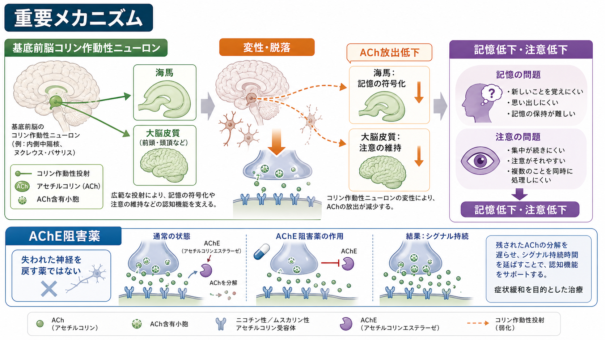
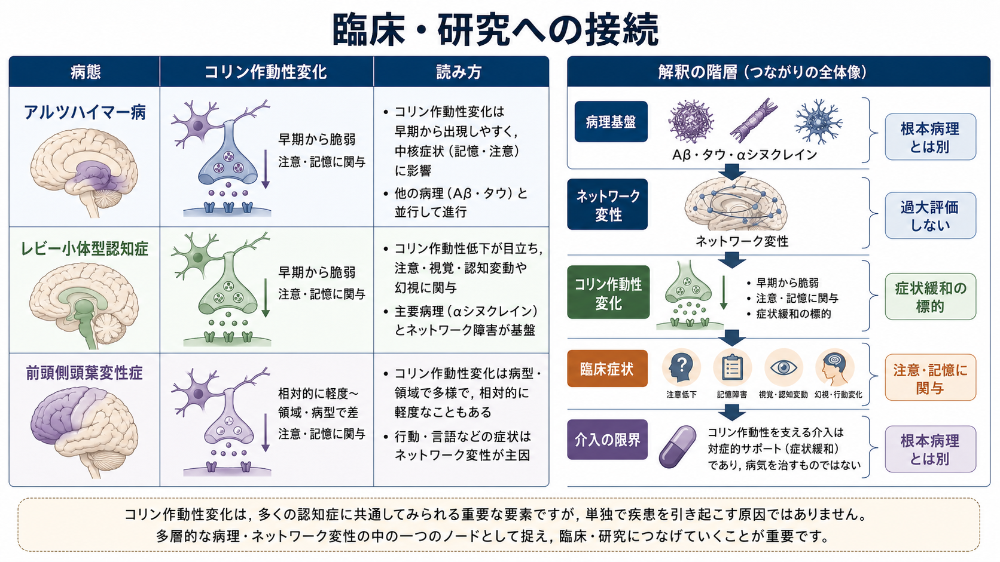
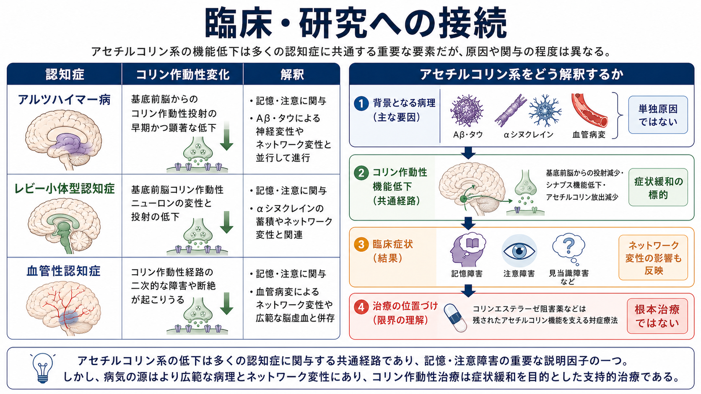

# アセチルコリン系は認知症とどう関わるのか

## 要点

- アセチルコリン系は、[[アセチルコリンは注意や記憶にどう関わるのか|注意・記憶・学習]]を支える広域調節系で、とくに基底前脳から[[海馬回路は記憶をどう形成するのか|海馬]]や大脳皮質へ投射するコリン作動性ニューロンが重要である。
- アルツハイマー病では、基底前脳コリン作動性ニューロンと皮質・辺縁系への投射が障害され、記憶低下や注意低下に関与する。ただし、これはAβ、タウ、炎症、血管因子、[[脳内ネットワークとは何か|ネットワーク変性]]と並ぶ一要素であり、単独原因ではない [1], [2], [3]。
- コリンエステラーゼ阻害薬は、残っているアセチルコリン信号を長く保つことで症状を緩和する治療であり、失われた神経細胞を再生したり、認知症の根本病理を止めたりする薬ではない [6], [7]。

## この記事で答える問い

この記事では、「認知症ではなぜアセチルコリンが問題になるのか」「それは記憶と注意の低下をどのように説明するのか」「コリンエステラーゼ阻害薬の位置づけをどう理解すべきか」を整理する。個別の診断や治療選択ではなく、教育・研究目的の神経科学的説明として扱う。

## まず結論

アセチルコリン系は、認知症の「すべての原因」ではなく、症状の出方を左右する重要な調節系である。基底前脳のコリン作動性ニューロンは、海馬の記憶符号化や大脳皮質の注意制御を支える。ここが障害されると、Aβ・タウ・αシヌクレイン・血管病変などの病理によって弱ったネットワークが、さらに情報を保ちにくく、選びにくく、更新しにくくなる。

そのため、アセチルコリン系は二重の意味で重要である。第一に、認知症の記憶障害・注意障害を理解するための神経回路上の入口になる。第二に、コリンエステラーゼ阻害薬という症状緩和治療の標的になる。ただし治療標的になることは、病気の根本原因であることを意味しない。

## 背景

認知症の研究史では、アルツハイマー病の脳で皮質のコリン作動性マーカーが低下し、基底前脳のニューロンが失われることが大きな発見だった。Whitehouseらは、アルツハイマー病と老年期認知症で基底前脳ニューロンの喪失を報告し、Bartusらは加齢・認知症の記憶障害をコリン作動性機能低下から説明する「コリン仮説」を整理した [1], [2]。

この仮説は、現在では単純な「アセチルコリン不足だけが認知症を起こす」という説としては扱われない。むしろ、アミロイド、タウ、シナプス障害、炎症、血管障害、ネットワーク変性と相互作用しながら、記憶や注意の低下を増幅する調節系として理解される [3], [4]。

## 基本概念

アセチルコリンは、神経細胞間の信号伝達だけでなく、皮質ネットワークの状態を調整する神経修飾物質として働く。基底前脳コリン作動性系は、内側中隔核、ブローカ対角帯、マイネルト基底核などを含み、海馬、扁桃体、大脳皮質へ広く投射する [4]。

この系は「特定の記憶そのものを保存する場所」ではない。むしろ、海馬や皮質が情報を符号化し、不要な入力を抑え、重要な刺激へ注意を向けるための神経環境を整える。したがって障害されると、記憶の痕跡が完全に消えるというより、入力をうまく選べない、符号化が弱い、検索の手がかりを使いにくい、といった形で症状に現れやすい。

## 仕組み

基底前脳のコリン作動性ニューロンが変性すると、海馬や大脳皮質へ届くアセチルコリン信号が低下する。海馬では新しい経験をエピソード記憶として符号化する過程が弱くなり、皮質では注意を維持し、複数の情報を同時に扱う調整が難しくなる [3], [4]。

アルツハイマー病では、タウ病理が基底前脳にも関わり、皮質・辺縁系へのコリン作動性投射の低下と結びつく。これにAβ沈着、シナプス機能低下、神経炎症、血管因子が重なるため、症状は単一の神経伝達物質だけでは説明できない [3], [5]。

レビー小体型認知症やパーキンソン病認知症では、皮質アセチルコリン低下が目立つことがあり、注意の変動、幻視、覚醒水準の揺らぎといった症状理解にも関わる。Cochraneレビューでは、レビー小体病スペクトラムに対するコリンエステラーゼ阻害薬が、認知機能や全般評価などで有益性を示す一方、副作用や中止率にも注意が必要とされた [8]。

## 図解

上の図は、コリン作動性変化を「多層的な病理の一部」として読むための概念地図である。アセチルコリン系は記憶・注意に関わるが、背景にはAβ、タウ、αシヌクレイン、血管病変、神経回路の結合変化がある。

3枚目の図は、臨床・研究での読み方をまとめたものである。アルツハイマー病、レビー小体型認知症、血管性認知症では、コリン作動性変化の関与の仕方が異なる。したがって、同じ「注意低下」「記憶低下」でも、背景病理とネットワークの文脈を分けて考える必要がある。

## 臨床・研究との接続

コリンエステラーゼ阻害薬は、アセチルコリンを分解する酵素を阻害し、シナプス間隙に残るアセチルコリン信号を相対的に長く保つ。Donepezilに関するCochraneレビューでは、アルツハイマー病の軽度から重度の認知症において、12〜24週の範囲で認知機能、日常生活動作、全般臨床評価に小さいが一定の利益があるとまとめられている [6]。

NICEガイドラインは、軽度から中等度のアルツハイマー病に対してdonepezil、galantamine、rivastigmineを選択肢として推奨し、レビー小体型認知症ではdonepezilまたはrivastigmineを提示している。一方、純粋な血管性認知症では、アルツハイマー病、パーキンソン病認知症、レビー小体型認知症の併存が疑われる場合に限って検討するとしている [7]。

この位置づけは重要である。薬が有効な場面があるからといって、アセチルコリン低下だけが認知症の原因であるとは言えない。むしろ、残存する回路機能を支える「症状緩和のレバー」として理解するほうが、現在の神経科学と臨床エビデンスに合っている。

## よくある誤解

### 誤解1: アセチルコリンが減るから認知症になる

アセチルコリン低下は重要だが、認知症の原因を単独で説明しない。アルツハイマー病ならAβとタウ、レビー小体型認知症ならαシヌクレイン、血管性認知症なら血管病変と虚血性ネットワーク障害が、それぞれ背景にある [3], [7]。

### 誤解2: コリンエステラーゼ阻害薬は病気を治す

コリンエステラーゼ阻害薬は、残っているアセチルコリン信号を支える薬であり、失われた基底前脳ニューロンを戻す薬ではない。研究では症状面の利益が示されるが、その大きさは限定的で、副作用や適応の判断も必要になる [6], [8]。

### 誤解3: 記憶障害だけを見ればよい

基底前脳コリン作動性系は記憶だけでなく注意、覚醒、皮質状態の調整にも関わる。したがって、認知症で見られる「ぼんやりする」「変動する」「集中が続かない」という症状も、記憶障害と同じくらい重要な観察点になる [3], [4]。

## 関連ノート

- [[アセチルコリンは注意や記憶にどう関わるのか]]
- [[アルツハイマー病では脳内で何が起きているのか]]
- [[レビー小体型認知症は神経回路にどのような影響を与えるのか]]
- [[海馬回路は記憶をどう形成するのか]]
- [[前頭頭頂ネットワークは認知制御をどう支えるのか]]
- [[脳内ネットワークとは何か]]
- [[脳ネットワークの破綻は精神疾患をどう説明するのか]]

## MOC更新候補

- `content/00_MOC/` 配下の神経科学・認知症・神経疾患関連MOCに、この記事へのリンクを追加する候補。
- 既存の [[アルツハイマー病では脳内で何が起きているのか]] と [[レビー小体型認知症は神経回路にどのような影響を与えるのか]] から本記事への相互リンクを、統合ジョブで検討する候補。

## 理解チェック

1. 基底前脳コリン作動性系は、海馬と大脳皮質にどのような機能的影響を与えるか。
2. 「アセチルコリン低下は認知症の単独原因ではない」と言える理由は何か。
3. コリンエステラーゼ阻害薬は、失われたニューロンを戻す薬ではなく、どの過程を支える薬か。
4. アルツハイマー病、レビー小体型認知症、血管性認知症で、コリン作動性変化の意味づけはどのように異なるか。

## 未解決問題

- 基底前脳コリン作動性障害が、Aβ・タウ病理のどの段階で認知症症状に最も強く寄与するのか。
- コリン作動性低下を画像・バイオマーカーで定量し、個別の治療反応予測に使えるか。
- コリン作動性治療を、抗アミロイド薬、抗タウ戦略、血管リスク管理、認知リハビリテーションとどう組み合わせるのが妥当か。

## 参考文献

[1] Whitehouse, P. J., Price, D. L., Struble, R. G., Clark, A. W., Coyle, J. T., & Delon, M. R. (1982). Alzheimer's disease and senile dementia: loss of neurons in the basal forebrain. *Science*, 215(4537), 1237-1239. https://doi.org/10.1126/science.7058341

[2] Bartus, R. T., Dean, R. L. III, Beer, B., & Lippa, A. S. (1982). The cholinergic hypothesis of geriatric memory dysfunction. *Science*, 217(4558), 408-414. https://doi.org/10.1126/science.7046051

[3] Hampel, H., Mesulam, M.-M., Cuello, A. C., Farlow, M. R., Giacobini, E., Grossberg, G. T., et al. (2018). The cholinergic system in the pathophysiology and treatment of Alzheimer's disease. *Brain*, 141(7), 1917-1933. https://doi.org/10.1093/brain/awy132

[4] Mesulam, M.-M. (2013). Cholinergic circuitry of the human nucleus basalis and its fate in Alzheimer's disease. *Journal of Comparative Neurology*, 521(18), 4124-4144. https://doi.org/10.1002/cne.23415

[5] Mufson, E. J., Counts, S. E., Perez, S. E., & Ginsberg, S. D. (2008). Cholinergic system during the progression of Alzheimer's disease: therapeutic implications. *Expert Review of Neurotherapeutics*, 8(11), 1703-1718. https://doi.org/10.1586/14737175.8.11.1703

[6] Birks, J. S., & Harvey, R. J. (2018). Donepezil for dementia due to Alzheimer's disease. *Cochrane Database of Systematic Reviews*, 2018(6), CD001190. https://doi.org/10.1002/14651858.CD001190.pub3

[7] National Institute for Health and Care Excellence. (2018, updated). *Dementia: assessment, management and support for people living with dementia and their carers* (NICE guideline NG97). https://www.nice.org.uk/guidance/ng97/chapter/recommendations

[8] Rolinski, M., Fox, C., Maidment, I., & McShane, R. (2012). Cholinesterase inhibitors for dementia with Lewy bodies, Parkinson's disease dementia and cognitive impairment in Parkinson's disease. *Cochrane Database of Systematic Reviews*, 2012(3), CD006504. https://doi.org/10.1002/14651858.CD006504.pub2
