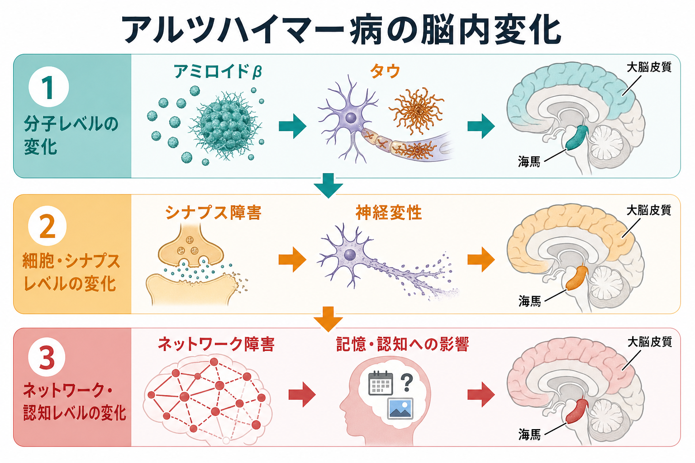
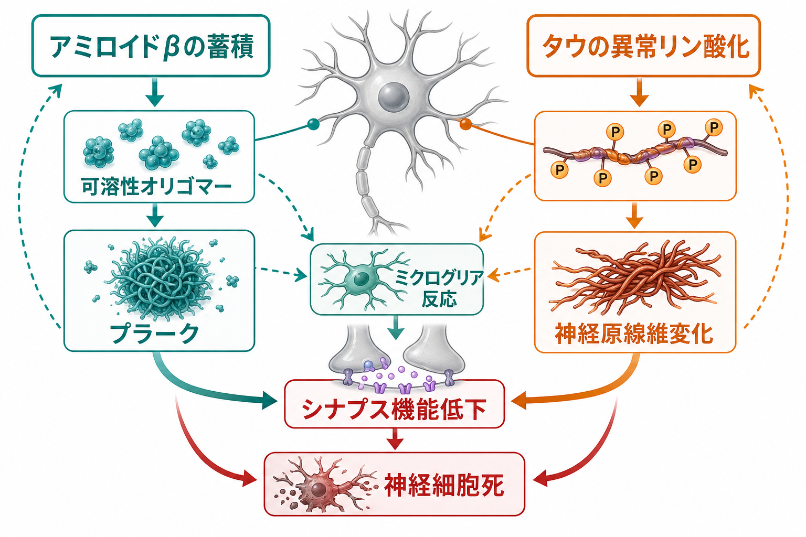
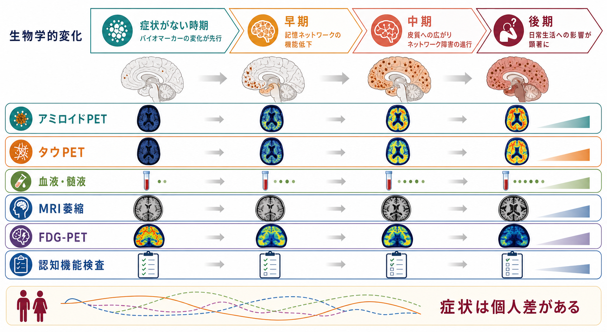

# アルツハイマー病では脳内で何が起きているのか

## 要点

- アルツハイマー病は、単なる「記憶力低下」ではなく、アミロイドβ、タウ、シナプス障害、神経炎症、神経変性、脳ネットワーク障害が時間差をもって重なる病態として理解される。
- 近年の研究基準では、アルツハイマー病は症状名というより、アミロイドβプラークとタウ神経原線維変化を中核とする生物学的プロセスとして定義される方向に進んでいる[2][3]。
- 症状の強さはアミロイドβの量だけでは説明しにくく、タウの広がり、[[シナプスとは何か|シナプス]]喪失、[[海馬回路は記憶をどう形成するのか|海馬]]から大脳皮質へ及ぶネットワーク障害が重要である[1][5][6]。
- 医療・精神医学に関する記述は教育・研究目的であり、個別の診断や治療方針を示すものではない。

## この記事で答える問い

1. アミロイドβとタウは、脳内で何を変えるのか。
2. なぜ「タンパク質の沈着」だけでなく、シナプス、グリア、神経変性、ネットワークを見る必要があるのか。
3. PET、MRI、髄液・血液バイオマーカーは、この病態のどの階層を見ているのか。

## まず結論

アルツハイマー病では、脳の中で「異常タンパク質がたまる」だけでなく、神経細胞同士の通信、細胞内輸送、グリア反応、代謝、血管・炎症環境、広域ネットワークの同期が少しずつ崩れていく。

大まかには、アミロイドβの蓄積が早期から起こり、その後または並行してタウ病理が記憶関連領域から広がり、[[シナプス可塑性とは何か|シナプス可塑性]]や回路の安定性が損なわれる。さらに神経細胞の機能低下と脱落が進むと、[[脳内ネットワークとは何か|脳内ネットワーク]]全体の結合が乱れ、記憶、見当識、言語、実行機能、日常生活機能に影響が出る[1][4][5][6]。

ただし、この流れは単純な一本道ではない。アミロイドβ、タウ、炎症、血管因子、加齢、遺伝的リスク、生活習慣、併存病理は相互作用する。したがって「アミロイドβだけが原因」「タウだけが原因」と読むより、多階層の病態ネットワークとして読む方が正確である[4][7]。

## 背景

アルツハイマー病は、認知症の代表的な原因疾患である。古典的には、死後脳で観察される老人斑、神経原線維変化、神経細胞脱落により特徴づけられてきた。現在は、[[PETは脳の何を測るのか|PET]]、髄液、血液バイオマーカー、[[構造MRIは脳の何を測っているのか|構造MRI]]などにより、生きている人の脳内変化を推定できるようになった[1][2]。

2018年のNIA-AA研究フレームワークは、アルツハイマー病を臨床症候群ではなく、A（amyloid）、T（tau）、N（neurodegeneration）というバイオマーカー軸で整理する研究枠組みを提示した[3]。2024年の改訂基準では、血液バイオマーカーを含む診断・病期分類の整理が進み、アルツハイマー病を生物学的連続体として扱う方向がさらに明確になった[2]。

重要なのは、バイオマーカーが見ているものと症状が一対一ではないことである。アミロイドβ陽性でも症状がない人がいる一方で、症状の重さにはタウ、神経変性、血管性病変、レビー小体病理、教育歴や認知予備能なども関わる[2][3][8]。

## 基本概念

### アミロイドβ

アミロイドβは、アミロイド前駆体タンパク質から切り出されるペプチドである。アルツハイマー病では、とくに凝集しやすいアミロイドβ42などが脳内で蓄積し、可溶性オリゴマーやプラークを形成する。プラークは神経細胞の外側に沈着するが、神経毒性の議論では、目に見える大きな沈着だけでなく、可溶性オリゴマーがシナプス機能を乱す可能性も重視される[1][4]。

アミロイド仮説は、アミロイドβの産生と除去の不均衡が早期の重要な引き金になるという考え方である。家族性アルツハイマー病の原因遺伝子、APP重複、APOE ε4とアミロイド除去の関係などは、この仮説を支える強い根拠である[4]。一方で、アミロイドβだけでは症状の時期や重症度を十分に説明できないため、現在はタウ、シナプス、炎症、血管、ネットワークを含めた拡張された理解が必要である。

### タウ

タウは本来、微小管を安定化し、[[軸索輸送とは何か|軸索輸送]]などを支えるタンパク質である。アルツハイマー病では、タウが異常リン酸化などの変化を受け、神経細胞内で凝集して神経原線維変化を形成する[1][5]。

BraakとBraakの病理学的ステージングでは、タウ関連の神経原線維変化は嗅内野・海馬周辺から辺縁系、さらに連合皮質へ広がるパターンを示す[5]。この広がりは、記憶障害からより広い認知障害へ進む臨床像と対応しやすい。

### シナプス障害と神経変性

認知機能は、個々の神経細胞だけでなく、シナプスを介した回路活動から生じる。アルツハイマー病では、アミロイドβやタウの影響、グリア反応、代謝障害などを通じてシナプスの構造と機能が損なわれる。シナプス喪失は、病理所見の中でも認知機能低下と強く関係する要素として重視されている[6]。

神経変性は、神経細胞の機能低下、突起の変性、細胞死、脳萎縮として現れる。MRIで見える海馬萎縮や皮質萎縮、[[FDG-PETは脳代謝をどう可視化するのか|FDG-PET]]で見える糖代謝低下は、この神経機能・構造の変化を間接的に捉える指標である[8]。

### 神経炎症とグリア

[[ミクログリアは脳の免疫細胞として何をしているのか|ミクログリア]]や[[アストロサイトはシナプスと代謝をどう支えているのか|アストロサイト]]は、単なる背景細胞ではない。アミロイドβの除去、炎症性シグナル、シナプスの維持・除去、血管周囲環境の調整に関わる。初期には保護的に働く反応が、病態の進行や慢性化により、神経回路に有害な反応へ変わる可能性がある[7]。

## 仕組み

### 1. アミロイドβが早期に蓄積する

バイオマーカーモデルでは、アミロイドβの異常は症状が出る前から検出されうる。髄液Aβ42低下、アミロイドPET陽性化、血液バイオマーカーの変化などは、脳内アミロイド病理の存在を推定する手がかりになる[2][3][8]。

ただし、アミロイドβが陽性であることは、その時点で認知症であることを意味しない。アミロイドβは病態の早期相を捉えるが、臨床症状との距離があるため、個人の生活機能や認知状態とは分けて読む必要がある。

### 2. タウ病理が記憶関連領域から広がる

タウ病理は、症状との対応が比較的強い。とくに嗅内野、海馬、側頭葉内側部はエピソード記憶と深く関係するため、この領域のタウ病理や神経変性は、初期のもの忘れや新しい情報の保持困難と結びつきやすい[5]。

アミロイドβが一定水準を超えると、タウ病理の広がりが加速するという見方がある一方、孤発性アルツハイマー病では、加齢関連のタウ病理とアミロイド病理が独立に始まり、後に相互作用する可能性も議論されている[8]。

### 3. シナプスと細胞間相互作用が崩れる

アミロイドβオリゴマーやタウ病理は、シナプス受容体、スパイン構造、ミトコンドリア、細胞内輸送、局所炎症を介して、神経伝達の効率を下げる可能性がある。ここで起きるのは、単に神経細胞がすぐ死ぬというより、まず通信品質が落ちるという変化である[6]。

さらに、ミクログリア、アストロサイト、血管細胞、神経細胞の相互作用が変化する。グリア反応は病変を片づけようとする一方で、慢性的な炎症や過剰なシナプス除去に傾くと、回路の脆弱性を高める可能性がある[7]。

### 4. 神経変性が脳萎縮と代謝低下として現れる

神経細胞の機能低下と脱落が進むと、海馬や側頭葉内側部、頭頂葉、後部帯状皮質、楔前部などで萎縮や代謝低下が観察されやすくなる。MRIは構造変化を、FDG-PETは糖代謝を、タウPETは病的タウの分布を、それぞれ異なる角度から捉える[2][8]。

この段階では、単一の分子病理よりも、複数の測定を組み合わせて「どの階層の変化がどこまで進んでいるか」を見ることが重要になる。

### 5. ネットワーク障害が認知症状へつながる

記憶や注意は、海馬だけ、大脳皮質だけで完結しない。海馬、側頭葉、頭頂葉、前頭前野、後部帯状皮質、[[デフォルトモードネットワークとは何か|デフォルトモードネットワーク]]などの大規模ネットワークが協調して働く。

アルツハイマー病では、局所病理が進むだけでなく、[[機能的結合解析とは何か|機能的結合]]や構造的結合が乱れ、ネットワーク効率が低下する。これにより、新しい記憶の形成、過去の記憶の検索、注意の切り替え、言語処理、日常行動の計画が影響を受ける[6][8]。

## 図解

図1は、分子、細胞・シナプス、ネットワーク・認知という三つの階層をつないでいる。図2は、アミロイドβとタウがシナプス障害、ミクログリア反応、神経細胞死へ収束する関係を示す。図3は、バイオマーカーと症状の時間差を示す。

## 臨床・研究との接続

研究では、アルツハイマー病をA/T/Nや、より新しいバイオマーカー分類で整理することで、同じ「認知症」でも背景病理が異なるケースを分けやすくなる[2][3]。これは、予防研究、早期介入試験、疾患修飾薬の対象選定、病期分類に重要である。

臨床では、バイオマーカーは判断を補助する情報であり、本人の症状、生活機能、神経心理検査、画像所見、併存疾患、薬剤、うつ、不眠、せん妄、血管性病変などと合わせて解釈される。2024年基準も、バイオマーカーによる生物学的診断が臨床評価を置き換えるものではないことを強調している[2]。

特に注意すべきなのは、アルツハイマー病理があっても、症状の出方は個人差が大きい点である。認知予備能、教育歴、社会活動、脳血管病変、睡眠、身体疾患、他の神経変性病理が、発症時期や症状の型を変える可能性がある。

## よくある誤解

### 誤解1：アミロイドβがあるなら、すぐ認知症である

アミロイドβの蓄積は症状より前から起こりうる。したがって、アミロイド陽性はアルツハイマー病理の存在を示す重要な情報だが、現在の生活機能や症状の重さを単独で決めるものではない[2][8]。

### 誤解2：アルツハイマー病は神経細胞が死ぬ病気だけである

神経細胞死は重要だが、その前にシナプス機能低下、グリア反応、代謝低下、ネットワーク障害が起こる。認知機能を理解するには、細胞死だけでなく、通信と回路の変化を見る必要がある[6][7]。

### 誤解3：タウはアミロイドβの単なる下流現象である

アミロイドβとタウは相互作用するが、タウ病理には独自の時空間パターンがある。孤発性アルツハイマー病では、加齢関連タウ病理とアミロイド病理が別々に始まり、後に互いに影響する可能性もある[5][8]。

### 誤解4：脳画像で一枚の「原因画像」が得られる

脳画像やバイオマーカーは、それぞれ異なる階層を測る。アミロイドPET、タウPET、FDG-PET、MRI、髄液・血液検査、認知検査を混同せず、「何を測っていて、何は測っていないか」を確認する必要がある。

## 関連ノート

- [[シナプスとは何か]]
- [[シナプス可塑性とは何か]]
- [[ミクログリアは脳の免疫細胞として何をしているのか]]
- [[アストロサイトはシナプスと代謝をどう支えているのか]]
- [[海馬回路は記憶をどう形成するのか]]
- [[脳内ネットワークとは何か]]
- [[デフォルトモードネットワークとは何か]]
- [[PETは脳の何を測るのか]]
- [[FDG-PETは脳代謝をどう可視化するのか]]
- [[構造MRIは脳の何を測っているのか]]

## MOC更新候補

- `content/00_MOC/MOC｜脳・神経科学.md` の神経変性・疾患関連項目に追加。
- `content/00_MOC/MOC｜基礎神経科学.md` のシナプス、グリア、神経変性との接続項目に追加。
- `content/00_MOC/MOC｜精神医学.md` の認知症・神経認知障害関連項目に追加。

## 理解チェック

1. アミロイドβ、タウ、神経変性は、それぞれ脳内のどの階層の変化を表すか。
2. なぜアミロイドβ陽性だけで症状の強さを判断できないのか。
3. シナプス障害が神経細胞死より前に重要になる理由は何か。
4. PET、MRI、髄液・血液バイオマーカーは、それぞれ何を測るのか。
5. アルツハイマー病をネットワーク障害として見ると、記憶症状の理解はどう変わるか。

## 未解決問題

- アミロイドβ、タウ、炎症、血管因子の因果順序は、個人差や病期によってどこまで変わるのか。
- 症状が出ないアミロイド陽性者と、早く症状が出る人を分ける保護因子・脆弱性因子は何か。
- 血液バイオマーカーを、研究、スクリーニング、臨床診断、治療効果判定でどのように使い分けるべきか。
- シナプス障害やネットワーク障害を、疾患修飾治療の標的や評価指標としてどこまで利用できるか。

## 参考文献

[1] National Institute on Aging. "What Happens to the Brain in Alzheimer's Disease?" https://www.nia.nih.gov/health/alzheimers-causes-and-risk-factors/what-happens-brain-alzheimers-disease

[2] Jack, C. R. Jr., Andrews, S. J., Beach, T. G., et al. (2024). Revised criteria for the diagnosis and staging of Alzheimer's disease. *Nature Medicine*, 30, 2121-2124. https://doi.org/10.1038/s41591-024-02988-7

[3] Jack, C. R. Jr., Bennett, D. A., Blennow, K., et al. (2018). NIA-AA Research Framework: Toward a biological definition of Alzheimer's disease. *Alzheimer's & Dementia*, 14(4), 535-562. https://doi.org/10.1016/j.jalz.2018.02.018

[4] Selkoe, D. J., & Hardy, J. (2016). The amyloid hypothesis of Alzheimer's disease at 25 years. *EMBO Molecular Medicine*, 8(6), 595-608. https://doi.org/10.15252/emmm.201606210

[5] Braak, H., & Braak, E. (1991). Neuropathological stageing of Alzheimer-related changes. *Acta Neuropathologica*, 82, 239-259. https://doi.org/10.1007/BF00308809

[6] Tzioras, M., McGeachan, R. I., Durrant, C. S., et al. (2023). Synaptic degeneration in Alzheimer disease. *Nature Reviews Neurology*, 19, 19-38. https://doi.org/10.1038/s41582-022-00749-z

[7] Leng, F., & Edison, P. (2021). Neuroinflammation and microglial activation in Alzheimer disease: where do we go from here? *Nature Reviews Neurology*, 17, 157-172. https://doi.org/10.1038/s41582-020-00435-y

[8] Jack, C. R. Jr., Knopman, D. S., Jagust, W. J., et al. (2010). Hypothetical model of dynamic biomarkers of the Alzheimer's pathological cascade. *The Lancet Neurology*, 9(1), 119-128. https://doi.org/10.1016/S1474-4422(09)70299-6
