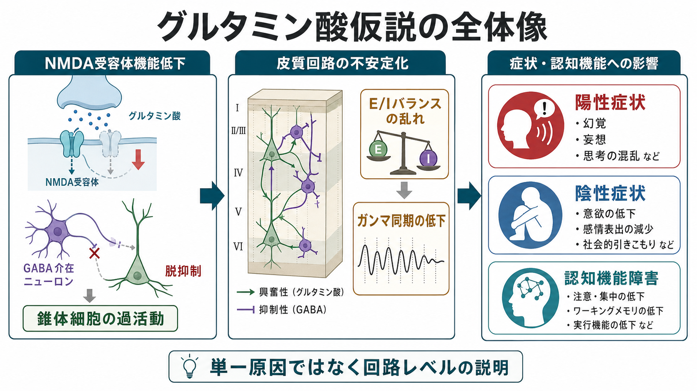
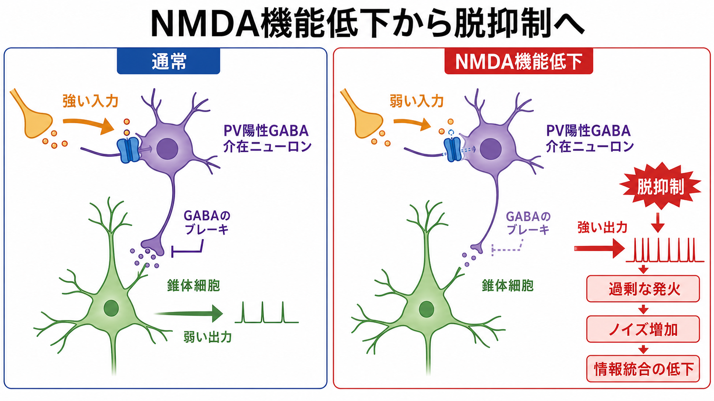
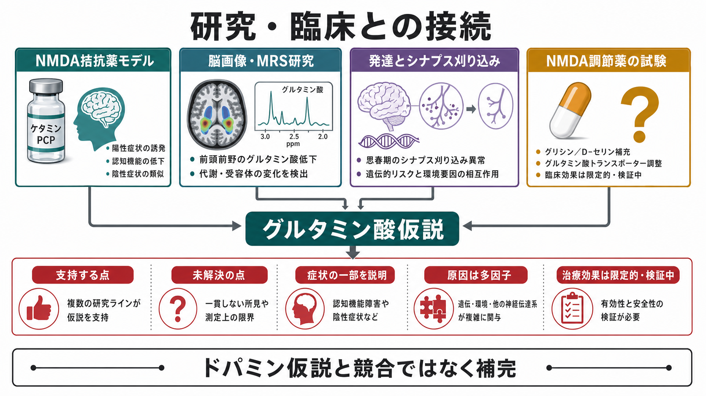

# グルタミン酸仮説は統合失調症をどう説明するのか

## 要点

- グルタミン酸仮説の中心は「グルタミン酸が多すぎる」ではなく、NMDA受容体を介した情報統合が特定の回路で弱まる、という考えである。
- PCPやケタミンなどのNMDA受容体拮抗薬は、陽性症状だけでなく陰性症状や認知機能障害に似た変化も生じうるため、ドパミン仮説だけでは拾いにくい側面を説明する手がかりになった[1][2]。
- 重要な機序は、PV陽性GABA介在ニューロンのNMDA機能低下、抑制の弱まり、錐体細胞の脱抑制、[[E_Iバランスとは何か|E/Iバランス]]の乱れ、[[ガンマ振動は認知機能にどう関わるのか|ガンマ振動]]の同期低下という回路レベルの連鎖である[3][4]。
- ただし、MRSなどの脳画像研究、治療増強研究、自己免疫性脳炎の知見は仮説を支持する一方で、所見は一貫しない部分も多く、単一原因説として読むべきではない[5][6][7]。

## この記事で答える問い

このノートでは、グルタミン酸仮説が統合失調症をどのように説明するのかを、分子、細胞、回路、症状の順に整理する。特に、[[グルタミン酸は脳で何をしているのか|グルタミン酸]]そのものよりも、NMDA受容体が担う「タイミングをそろえた情報統合」に注目する。

## まず結論

グルタミン酸仮説は、統合失調症を「皮質回路が情報を安定して統合できない状態」として説明する。NMDA受容体機能が低下すると、GABA介在ニューロンによる抑制が弱まり、錐体細胞の発火が過剰または不規則になる。その結果、外界刺激、内的思考、予測誤差、サリエンス評価が適切に調整されにくくなり、幻覚・妄想、意欲低下、作業記憶や注意の障害として現れる、という見取り図である[2][3]。

## 背景

統合失調症研究では、長くドパミンD2受容体遮断薬の効果を背景に、線条体ドパミン過活動が陽性症状を説明する中心モデルとされてきた。しかし、D2遮断は幻覚・妄想の改善には関わりやすい一方、陰性症状や認知機能障害を十分に説明しにくい。そこで、より上流の皮質・海馬回路の異常がドパミン系を二次的に押し上げるのではないか、という統合的な見方が生まれた[4]。

この流れで注目されたのが、PCPやケタミンである。これらはNMDA受容体を阻害し、健康者にも精神病様体験、解離、認知機能低下を起こしうる。また、動物モデルでは前頭前野の発火パターンや線条体ドパミン放出にも影響する。重要なのは、これらの薬物が「統合失調症そのものを作る」のではなく、NMDA受容体機能低下が皮質回路をどう乱すかを調べる実験的道具になる、という点である[2]。

## 基本概念

### NMDA受容体

NMDA受容体は、グルタミン酸受容体の一種で、シナプス可塑性、発達期の回路形成、作業記憶、文脈依存的な情報統合に深く関わる。単に興奮性入力を伝えるだけでなく、膜電位、グルタミン酸、D-セリンやグリシンなどの共作動因子がそろったときに開きやすい。この性質により、NMDA受容体は「入力が意味のあるタイミングでそろったか」を検出する装置として働く。

### PV陽性GABA介在ニューロン

PV陽性GABA介在ニューロンは、錐体細胞の発火タイミングを細かく制御する高速な抑制性ニューロンである。これらの細胞が弱ると、抑制が単に低下するだけでなく、回路全体の発火タイミングがばらつく。[[GABAは脳で何をしているのか|GABA]]のブレーキが乱れることで、ガンマ帯域の同期や作業記憶に必要な信号対雑音比が低下する、という説明が成り立つ[3]。

### 脱抑制

一見すると、NMDA受容体機能低下は「興奮性が下がる」ように見える。しかし、NMDA受容体低下が主に抑制性介在ニューロンで起きる場合、抑制の抑制が外れるため、錐体細胞はむしろ過活動になりうる。これが脱抑制であり、グルタミン酸仮説が「低機能」と「過剰なノイズ」を同時に説明する要点である[3][8]。

## 仕組み

1. 遺伝的リスク、発達期ストレス、酸化ストレス、炎症、キヌレン酸経路、NMDAR関連タンパク質の変化などが、NMDA受容体機能を弱める可能性がある[8]。
2. NMDA受容体機能低下がPV陽性GABA介在ニューロンに強く影響すると、錐体細胞への抑制が弱まる[3][8]。
3. 抑制が弱い皮質回路では、錐体細胞の発火が過剰・不規則になり、信号とノイズの区別が曖昧になる[2][3]。
4. その影響は前頭前野、海馬、視床皮質ループ、線条体ドパミン系へ広がり、陽性症状、陰性症状、認知機能障害の組み合わせとして現れる[4]。

このモデルでは、幻覚や妄想は「意味づけの過剰」として理解できる。皮質・海馬回路が不安定になると、通常なら弱い内的表象や偶然の刺激に過度なサリエンスが付与され、線条体ドパミン系を介して「これは重要だ」という重みづけが強まる。これは[[ドパミンは報酬だけの物質なのか|ドパミン]]仮説と競合するのではなく、グルタミン酸系の回路異常がドパミン異常を引き起こす上流過程になりうる、という補完関係である[4]。

陰性症状や認知機能障害については、前頭前野の持続活動、作業記憶、文脈表象、目標維持の不安定化が鍵になる。ガンマ同期が乱れると、必要なニューロン群を一時的に束ねる力が弱まり、注意、作業記憶、柔軟な推論が低下しやすい[3]。

## 図解

グルタミン酸仮説を一枚で言うなら、「NMDA受容体低機能 → GABA介在ニューロンの弱まり → 皮質回路の脱抑制 → 信号対雑音比の低下 → 症状と認知機能障害」という流れである。

もう一つ重要なのは、研究ラインが複数あることだ。薬理モデル、脳画像、死後脳研究、遺伝・発達研究、自己免疫性脳炎、NMDA調節薬の臨床試験は、同じ方向を示す部分もあるが、完全には一致しない。したがって、この仮説は「確定した原因」ではなく、複数の証拠をつなぐ作業モデルとして扱うのがよい。

## 臨床・研究との接続

### 脳画像研究

1H-MRS研究では、グルタミン酸、グルタミン、Glxの変化が調べられてきた。メタ解析では、患者群や臨床高リスク群でグルタミン酸系代謝物の変化が報告される一方、脳部位、病期、薬物治療、解析法によって結果が揺れる。したがって、MRS所見はグルタミン酸仮説を支持する材料ではあるが、単独で診断や個別病態を決めるマーカーではない[5]。

### 治療研究

NMDA受容体のグリシン部位を調節するグリシン、D-セリン、サルコシンなどは、抗精神病薬への増強療法として研究されてきた。メタ解析では陰性症状を中心に有益性が示されることがあるが、効果量、対象集団、クロザピン併用の有無、研究の質にはばらつきがある。現時点では、標準治療を置き換えるものではなく、補助的・研究的な治療標的として理解するのが妥当である[6]。

### 自己免疫性脳炎

抗NMDA受容体脳炎では、NMDA受容体に対する抗体により精神病症状、記憶障害、けいれん、意識障害、自律神経症状などが生じうる。これは「NMDA受容体機能が乱れると精神病様症状が起こりうる」という強い臨床的手がかりである。ただし、抗NMDA受容体脳炎は神経症状を伴う治療可能な自己免疫疾患であり、通常の統合失調症と同一視してはならない[7]。

## よくある誤解

### 「グルタミン酸が多い病気」という意味ではない

仮説の中心は、グルタミン酸濃度の単純な増減ではない。NMDA受容体を介したシナプス入力のタイミング、介在ニューロンの抑制、回路同期、発達期の可塑性が組み合わさって問題になる。

### ドパミン仮説を否定するものではない

グルタミン酸仮説は、ドパミン異常をより上流の皮質・海馬回路から説明しようとする。陽性症状にはドパミン系が重要であり続けるが、そのドパミン異常がどこから生じるのかを考えると、グルタミン酸系とGABA系の回路異常が重要になる[4]。

### すべての統合失調症を一つの機序で説明できるわけではない

統合失調症は臨床的にも生物学的にも不均一である。NMDA受容体機能低下は有力な収束点の一つだが、遺伝、発達、ストレス、炎症、酸化還元、シナプス刈り込み、ドパミン、GABA、環境要因が複雑に重なる[8]。

## 関連ノート

- [[グルタミン酸は脳で何をしているのか]]
- [[GABAは脳で何をしているのか]]
- [[E_Iバランスとは何か]]
- [[ガンマ振動は認知機能にどう関わるのか]]
- [[シナプス刈り込みの異常は統合失調症と関係するのか]]

MOC更新候補: `content/00_MOC/` 配下の神経科学、精神医学、統合失調症関連MOCに追加候補。

今後の作成候補: 「NMDA受容体とは何か」「抗NMDA受容体脳炎とは何か」「ドパミン仮説は統合失調症をどこまで説明できるのか」「認知機能障害は統合失調症でなぜ重要なのか」。

## 理解チェック

1. NMDA受容体機能低下が、なぜ単純な興奮低下ではなく錐体細胞の脱抑制につながりうるのか。
2. グルタミン酸仮説とドパミン仮説は、どのような意味で補完関係にあるのか。
3. MRS研究やNMDA調節薬研究の所見を、なぜ診断マーカーや確立治療として過大評価してはいけないのか。

## 参考文献

[1] Olney, J. W., & Farber, N. B. (1995). Glutamate receptor dysfunction and schizophrenia. *Archives of General Psychiatry, 52*(12), 998-1007. https://doi.org/10.1001/archpsyc.1995.03950240016004

[2] Moghaddam, B., & Krystal, J. H. (2012). Capturing the angel in "angel dust": Twenty years of translational neuroscience studies of NMDA receptor antagonists in animals and humans. *Schizophrenia Bulletin, 38*(5), 942-949. https://doi.org/10.1093/schbul/sbs075

[3] Gonzalez-Burgos, G., & Lewis, D. A. (2012). NMDA receptor hypofunction, parvalbumin-positive neurons, and cortical gamma oscillations in schizophrenia. *Schizophrenia Bulletin, 38*(5), 950-957. https://doi.org/10.1093/schbul/sbs010

[4] McCutcheon, R. A., Krystal, J. H., & Howes, O. D. (2020). Dopamine and glutamate in schizophrenia: Biology, symptoms and treatment. *World Psychiatry, 19*(1), 15-33. https://doi.org/10.1002/wps.20693

[5] Merritt, K., Egerton, A., Kempton, M. J., Taylor, M. J., & McGuire, P. K. (2016). Nature of glutamate alterations in schizophrenia: A meta-analysis of proton magnetic resonance spectroscopy studies. *JAMA Psychiatry, 73*(7), 665-674. https://doi.org/10.1001/jamapsychiatry.2016.0442

[6] Goh, K. K., Wu, T. H., Chen, C. H., & Lu, M. L. (2021). Efficacy of N-methyl-D-aspartate receptor modulator augmentation in schizophrenia: A meta-analysis of randomised, placebo-controlled trials. *Journal of Psychopharmacology, 35*(3), 236-252. https://doi.org/10.1177/0269881120965937

[7] Dalmau, J., Lancaster, E., Martinez-Hernandez, E., Rosenfeld, M. R., & Balice-Gordon, R. (2011). Clinical experience and laboratory investigations in patients with anti-NMDAR encephalitis. *The Lancet Neurology, 10*(1), 63-74. https://doi.org/10.1016/S1474-4422(10)70253-2

[8] Nakazawa, K., & Sapkota, K. (2020). The origin of NMDA receptor hypofunction in schizophrenia. *Pharmacology & Therapeutics, 205*, 107426. https://doi.org/10.1016/j.pharmthera.2019.107426
