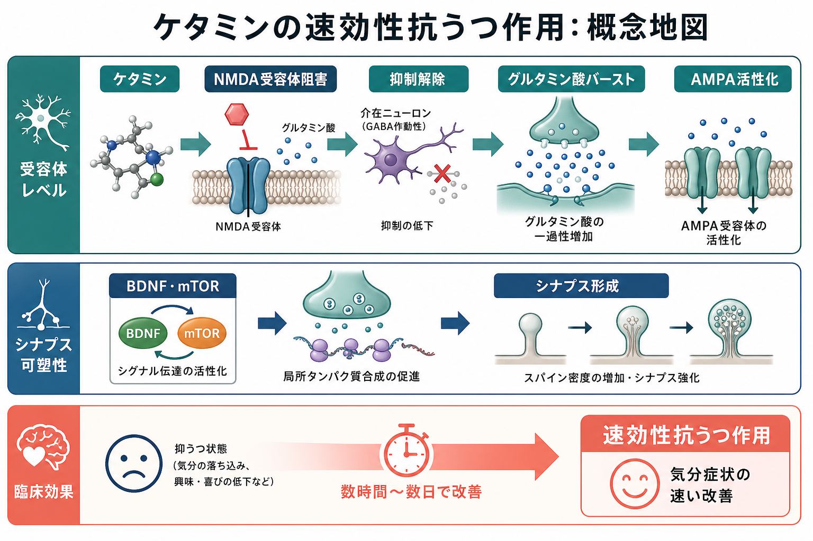
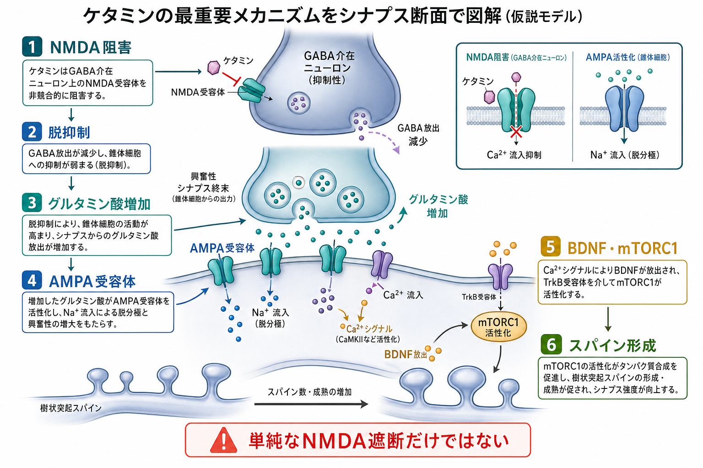
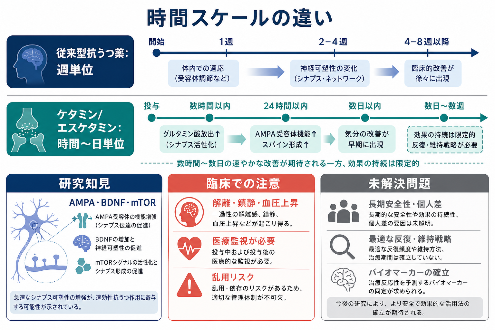

# ケタミンはなぜ速効性抗うつ作用を示すのか

## 要点

- ケタミンは、従来型抗うつ薬のようにモノアミン系の長期的な調整だけで説明するより、[[グルタミン酸は脳で何をしているのか|グルタミン酸]]伝達、AMPA受容体活性化、BDNF・mTOR経路、[[シナプス可塑性とは何か|シナプス可塑性]]の急速な変化として理解しやすい。
- 臨床研究では、ケタミンが治療抵抗性うつ病で数時間から数日以内の抗うつ効果を示すことが繰り返し報告されてきた[1][2][3]。
- 有力な機序仮説は、GABA介在ニューロン上のNMDA受容体阻害による脱抑制、グルタミン酸放出の一過性増加、AMPA受容体を介した神経活動の増強である[4]。
- その下流では、BDNF翻訳、mTORC1活性化、前頭前野のスパイン形成・シナプス機能増強が、速い症状改善に関わる可能性がある[5][6]。
- ただし、ケタミンの作用は「NMDA受容体を止めればよい」という単純な話ではない。代謝産物、AMPA依存性、オピオイド系や炎症系なども議論されており、臨床使用には解離、鎮静、血圧上昇、乱用リスクへの医療監視が必要である[7][8]。

## この記事で答える問い

この記事では、[[シナプスとは何か]]、[[シナプス可塑性とは何か]]、[[神経可塑性は発達と学習をどう支えるのか]]、[[E_Iバランス異常は精神疾患をどう説明するのか]]を背景に、次の問いに答える。

1. ケタミンは、従来型抗うつ薬と何が違うのか。
2. NMDA受容体阻害は、どのようにAMPA受容体活性化へつながるのか。
3. BDNF・mTOR・シナプス形成は、速効性とどう関係するのか。
4. 臨床応用を考えるとき、どの限界とリスクを区別すべきか。

## まず結論

ケタミンの速効性抗うつ作用は、「NMDA受容体を遮断する薬だから効く」とだけ説明すると不十分である。重要なのは、NMDA受容体阻害をきっかけに、皮質回路の興奮と抑制のバランスが一時的に変わり、グルタミン酸放出とAMPA受容体活性化が高まり、その下流でBDNFやmTORC1を介したシナプス形成・機能増強が急速に起こる、という一連の可塑性モデルである[4][5][6]。

従来型抗うつ薬は、臨床効果が現れるまで数週を要することが多い。一方、ケタミンは単回投与後に数時間から数日で抑うつ症状の改善を示す研究があり、治療抵抗性うつ病の神経生物学を考えるうえで大きな転換点になった[1][2][3]。ただし、この速さは「自己判断で使える」という意味ではない。ケタミン関連治療には解離、鎮静、呼吸抑制、血圧上昇、認知機能低下、乱用・誤用などのリスクがあるため、承認薬であるエスケタミン鼻腔スプレーも医療機関での監視とREMSのもとで扱われる[8]。

## 背景

うつ病の薬物療法は長いあいだ、セロトニン、ノルアドレナリン、ドパミンなどのモノアミン系を中心に理解されてきた。SSRIやSNRIは多くの患者に有用だが、効果発現までに時間がかかり、十分に反応しない人もいる。治療抵抗性うつ病では、複数の薬物療法を行っても症状が残ることがあり、速く効く別機序の治療標的が求められてきた。

この文脈で注目されたのが、非競合的NMDA受容体拮抗薬であるケタミンである。Bermanらの初期研究は、ケタミンが抑うつ症状を急速に軽減しうることを示した[1]。Zarateらの二重盲検クロスオーバー試験は、治療抵抗性うつ病における単回ケタミン投与後の速い効果を報告した[2]。さらにMurroughらの二施設ランダム化試験は、ミダゾラムを能動的プラセボ対照として用い、ケタミンの急速な抗うつ効果をより厳密に検討した[3]。

ただし、臨床効果があることと、機序が完全に分かっていることは同じではない。ケタミンは麻酔薬、解離性薬物、NMDA受容体拮抗薬、グルタミン酸伝達調整薬、シナプス可塑性促進薬という複数の顔をもつ。したがって、作用機序は単一の分子標的ではなく、受容体、回路、タンパク質合成、スパイン形成、代謝産物、安全性をつなぐ多層モデルとして読む必要がある。

## 基本概念

### NMDA受容体

NMDA受容体は、グルタミン酸受容体の一種で、神経活動、カルシウム流入、可塑性に関わる。通常、NMDA受容体は膜電位や補助因子の状態に依存して働き、[[シナプスとは何か|シナプス]]の強さを変える学習・記憶過程にも関与する。ケタミンはこの受容体を非競合的に阻害するが、どの細胞種・どの時間スケール・どの状態のNMDA受容体が重要かは単純ではない。

### AMPA受容体

AMPA受容体もグルタミン酸受容体で、速い興奮性シナプス伝達を担う。ケタミン研究では、NMDA受容体阻害そのものよりも、下流でAMPA受容体を介した伝達が高まることが抗うつ様作用に重要だと考えられている。前臨床研究では、AMPA受容体遮断がケタミンの抗うつ様作用を妨げることが示され、AMPA依存性が重要な論点になった[4][7]。

### BDNF

BDNFは脳由来神経栄養因子で、シナプス成熟、スパイン形成、神経回路の可塑性を支える。Autryらは、NMDA受容体遮断がeEF2キナーゼ経路を介してBDNF翻訳を脱抑制し、速い抗うつ様行動に関わることをマウスで示した[6]。これは、速効性を「神経伝達物質量の変化」だけでなく「タンパク質合成とシナプス機能の急速な更新」として捉える根拠になる。

### mTORC1

mTORC1は、細胞内の栄養状態や成長シグナルに応じてタンパク質合成を調整する経路である。Liらは、ケタミンが前頭前野でmTOR経路を速やかに活性化し、シナプスタンパク質、スパイン数、シナプス機能を増やし、mTOR阻害がこれらの効果と抗うつ様行動を妨げることを報告した[5]。これは、ストレスで弱まった前頭前野シナプスを急速に再強化するモデルにつながる。

## 仕組み

### 1. GABA介在ニューロンのNMDA受容体が抑えられる

有力な脱抑制仮説では、ケタミンはまずGABA介在ニューロン上のNMDA受容体を阻害する。GABA介在ニューロンは錐体細胞を抑制するため、この抑制性細胞の活動が弱まると、錐体細胞へのブレーキが一時的に外れる。これは[[E_Iバランス異常は精神疾患をどう説明するのか|興奮と抑制のバランス]]が短時間だけ変わる状態として理解できる。

この段階で重要なのは、ケタミンが脳全体を単純に興奮させるわけではないという点である。細胞種、受容体の局在、投与量、脳領域によって作用は異なる。抗うつ作用の説明では、前頭前野などの回路で、抑制の解除がグルタミン酸放出の一過性増加へつながることが重視される[4]。

### 2. グルタミン酸放出が一過性に増え、AMPA受容体が活性化する

脱抑制により錐体細胞の活動が高まると、グルタミン酸放出が増え、シナプス後膜のAMPA受容体が強く活性化する。ケタミンの抗うつ様作用がAMPA受容体遮断で弱まるという前臨床知見は、AMPA受容体が単なる副産物ではなく、速効性の中心的な中継点であることを示唆する[4][7]。

ここで、NMDA受容体阻害とAMPA受容体活性化は矛盾しない。ケタミンはNMDA受容体を遮断するが、その結果として回路レベルではAMPA受容体を介した速い興奮性伝達が相対的に強まる。この「NMDA遮断からAMPA活性化へ」という変換が、ケタミンを単なるNMDA拮抗薬ではなく、可塑性を再始動させる薬理学的入力として理解する鍵になる。

### 3. BDNF翻訳とmTORC1が速く動く

AMPA受容体活性化の下流では、カルシウム依存性シグナル、BDNF放出・翻訳、TrkBシグナル、mTORC1活性化が関わると考えられている[5][6]。この段階では、神経細胞が新しいシナプスタンパク質を作り、既存のシナプスを強める準備が進む。

Autryらの研究は、安静時のNMDA受容体遮断がeEF2リン酸化を下げ、BDNF翻訳を促進する経路を示した[6]。Liらの研究は、mTOR経路の活性化が前頭前野のシナプスタンパク質とスパイン形成を促し、行動効果に必要であることを示した[5]。両者は細部で異なる経路を強調するが、いずれも「速効性は神経活動の一過性変化だけでなく、可塑性関連タンパク質合成を伴う」という点で共通している。

### 4. 前頭前野のシナプス機能が回復する

慢性ストレスやうつ病モデルでは、前頭前野や海馬などで樹状突起スパインやシナプス機能が弱まることがある。ケタミンは、このようなストレス関連のシナプス低下に対して、数時間から数日の時間スケールでシナプス形成と機能を増強する可能性がある[5]。

この見方では、ケタミンは「気分を直接明るくする物質」というより、硬直した回路状態を一時的に可塑的にし、前頭前野が感情、認知、報酬、自己評価を再調整しやすくする入力として捉えられる。[[報酬系の異常はうつ病をどう説明するのか]]で扱う意欲・報酬学習の障害とも接続しうるが、ケタミンだけで心理社会的問題や長期的再発リスクが解決するわけではない。

### 5. 代謝産物も議論されている

ケタミンは体内でノルケタミンやヒドロキシノルケタミンなどに代謝される。Zanosらは、マウスでケタミン代謝産物の一つである(2R,6R)-HNKが、NMDA受容体阻害に依存せず、AMPA受容体活性化を必要とする抗うつ様作用を示すと報告した[7]。この知見は、ケタミン作用を「親化合物のNMDA遮断」だけに還元できないことを強く示した。

ただし、代謝産物仮説はすべての研究者が同じ形で受け入れているわけではない。動物種、投与経路、濃度、行動課題、臨床への外挿可能性が問題になる。したがって本文では、HNKを「確定した唯一の説明」ではなく、「NMDA遮断中心モデルを拡張する重要な研究線」と位置づける。

## 図解

図1は、ケタミンの速効性抗うつ作用を、受容体レベル、シナプス可塑性、臨床効果の3層で整理した概念地図である。NMDA受容体阻害から始まるが、中心にあるのはAMPA受容体活性化とBDNF・mTORを介したシナプス形成である。

図2は、最重要メカニズムをシナプス断面として描いたものである。GABA介在ニューロンへの作用、錐体細胞の脱抑制、グルタミン酸増加、AMPA受容体、BDNF・mTORC1、スパイン形成を一続きの流れとして読む。

図3は、時間スケールと臨床上の注意を整理したものである。速い効果が期待される一方で、効果の持続、維持戦略、長期安全性、個人差、医療監視の必要性は分けて考える必要がある。

## 臨床・研究との接続

ケタミン研究の臨床的意義は、治療抵抗性うつ病に対する新しい選択肢を示したことだけではない。より大きな意義は、うつ病の神経生物学を「モノアミンの慢性的調整」から、「グルタミン酸伝達、シナプス可塑性、前頭前野回路の速い再構成」へ広げたことである[4]。

臨床試験では、ケタミンが速い抗うつ効果を示す一方で、効果の持続は限定的で、再投与や維持療法の設計が問題になる[2][3]。エスケタミン鼻腔スプレーは、治療抵抗性うつ病などに対して承認されているが、鎮静、解離、呼吸抑制、乱用・誤用、自殺念慮・行動に関する警告を持ち、医療機関での投与後観察とREMSの対象である[8]。

研究面では、AMPA受容体増強、mTORC1、BDNF、TrkB、HNK代謝産物、炎症、オピオイド系、睡眠、心理療法との時間的組み合わせが検討されている。速効性抗うつ薬の次世代研究は、ケタミンそのものを広く使う方向だけでなく、ケタミンから得られた可塑性メカニズムをより安全で持続的な治療へ翻訳する方向に進んでいる。

## よくある誤解

### 誤解1: ケタミンはNMDA受容体を遮断するから、その遮断だけが抗うつ作用である

NMDA受容体阻害は重要な入口だが、抗うつ作用を説明するにはAMPA受容体活性化、BDNF、mTORC1、シナプス形成、代謝産物を含める必要がある[4][5][6][7]。単純なNMDA遮断だけで説明できるなら、すべてのNMDA拮抗薬が同じような速効性抗うつ作用を示すはずだが、実際はそう単純ではない。

### 誤解2: 速く効くなら、長く効くはずである

速効性と持続性は別の問題である。ケタミンは数時間から数日で効果を示しうるが、効果の持続には個人差があり、維持療法、再投与間隔、併用療法、再発予防は別に検討しなければならない[3][8]。

### 誤解3: ケタミンは危険だから研究すべきではない

解離、鎮静、血圧上昇、乱用リスクは重大であり、軽視できない[8]。しかし、そのリスクがあることは、機序研究やより安全な派生治療の開発を否定する理由にはならない。むしろ、何が抗うつ作用に必要で、何が副作用や乱用リスクに関わるのかを分けることが、研究上の重要課題である。

### 誤解4: ケタミンはうつ病を根本的に治す薬である

ケタミンは速い症状改善をもたらしうるが、生活史、ストレス環境、心理社会的要因、併存症、再発予防を単独で解決するものではない。この記事は教育・研究目的の機序整理であり、個別の診断、治療適応、投与方法を指示するものではない。

## 関連ノート

既存ノート:

- [[グルタミン酸は脳で何をしているのか]]
- [[シナプスとは何か]]
- [[シナプス可塑性とは何か]]
- [[神経可塑性は発達と学習をどう支えるのか]]
- [[E_Iバランス異常は精神疾患をどう説明するのか]]
- [[報酬系の異常はうつ病をどう説明するのか]]

関連ノート候補:

- NMDA受容体とは何か
- AMPA受容体とは何か
- BDNFは神経可塑性にどう関わるのか
- mTOR経路はシナプス形成をどう調整するのか
- 治療抵抗性うつ病とは何か
- エスケタミンとケタミンは何が違うのか
- サイケデリック治療と速効性抗うつ薬はどう違うのか

MOC更新候補:

- `content/00_MOC/MOC｜脳・神経科学.md`
- `content/00_MOC/MOC｜精神医学.md`
- `content/00_MOC/MOC｜臨床実践・治療.md`

並列ジョブとの競合を避けるため、このタスクではMOC本体は更新しない。

## 理解チェック

1. ケタミンの作用を「NMDA受容体遮断だけ」で説明すると、どの点が抜け落ちるか。
2. GABA介在ニューロンのNMDA受容体阻害が、なぜ錐体細胞のグルタミン酸放出増加につながりうるのか。
3. AMPA受容体活性化は、ケタミンの速効性抗うつ作用モデルでどの位置にあるか。
4. BDNFとmTORC1は、シナプス形成・スパイン形成とどう関係するか。
5. 速効性があることと、医療監視なしに使えることが同じでない理由は何か。

## 参考文献

[1] Berman, R. M., Cappiello, A., Anand, A., Oren, D. A., Heninger, G. R., Charney, D. S., & Krystal, J. H. (2000). Antidepressant effects of ketamine in depressed patients. *Biological Psychiatry, 47*(4), 351-354. https://doi.org/10.1016/S0006-3223(99)00230-9

[2] Zarate, C. A. Jr., Singh, J. B., Carlson, P. J., Brutsche, N. E., Ameli, R., Luckenbaugh, D. A., Charney, D. S., & Manji, H. K. (2006). A randomized trial of an N-methyl-D-aspartate antagonist in treatment-resistant major depression. *Archives of General Psychiatry, 63*(8), 856-864. https://doi.org/10.1001/archpsyc.63.8.856

[3] Murrough, J. W., Iosifescu, D. V., Chang, L. C., Al Jurdi, R. K., Green, C. E., Perez, A. M., Iqbal, S., Pillemer, S., Foulkes, A., Shah, A., Charney, D. S., & Mathew, S. J. (2013). Antidepressant efficacy of ketamine in treatment-resistant major depression: A two-site randomized controlled trial. *American Journal of Psychiatry, 170*(10), 1134-1142. https://doi.org/10.1176/appi.ajp.2013.13030392

[4] Abdallah, C. G., Sanacora, G., Duman, R. S., & Krystal, J. H. (2015). Ketamine and rapid-acting antidepressants: A window into a new neurobiology for mood disorder therapeutics. *Annual Review of Medicine, 66*, 509-523. https://doi.org/10.1146/annurev-med-053013-062946

[5] Li, N., Lee, B., Liu, R. J., Banasr, M., Dwyer, J. M., Iwata, M., Li, X. Y., Aghajanian, G., & Duman, R. S. (2010). mTOR-dependent synapse formation underlies the rapid antidepressant effects of NMDA antagonists. *Science, 329*(5994), 959-964. https://doi.org/10.1126/science.1190287

[6] Autry, A. E., Adachi, M., Nosyreva, E., Na, E. S., Los, M. F., Cheng, P. F., Kavalali, E. T., & Monteggia, L. M. (2011). NMDA receptor blockade at rest triggers rapid behavioural antidepressant responses. *Nature, 475*, 91-95. https://doi.org/10.1038/nature10130

[7] Zanos, P., Moaddel, R., Morris, P. J., Georgiou, P., Fischell, J., Elmer, G. I., Alkondon, M., Yuan, P., Pribut, H. J., Singh, N. S., Dossou, K. S. S., Fang, Y., Huang, X. P., Mayo, C. L., Wainer, I. W., Albuquerque, E. X., Thompson, S. M., Thomas, C. J., Zarate, C. A. Jr., & Gould, T. D. (2016). NMDAR inhibition-independent antidepressant actions of ketamine metabolites. *Nature, 533*, 481-486. https://doi.org/10.1038/nature17998

[8] U.S. Food and Drug Administration. (2025). *SPRAVATO (esketamine) nasal spray: Prescribing information*. Revised 04/2025. https://www.accessdata.fda.gov/drugsatfda_docs/label/2025/211243s019lbl.pdf

## 未解決問題

- ケタミンの速効性に必要な最小メカニズムは、NMDA遮断、AMPA活性化、BDNF、mTOR、HNK代謝産物のどの組み合わせなのか。
- 解離などの主観的体験は、抗うつ効果に必要なのか、それとも分離可能な副作用なのか。
- 速効性の後に、どのような心理療法、行動活性化、睡眠改善、維持療法を組み合わせると再発予防につながるのか。
- 個人ごとの反応性を、脳画像、EEG、血中マーカー、症状プロフィール、計算モデルで予測できるか。
- 長期反復使用における認知機能、膀胱症状、依存・乱用リスク、安全な治療間隔をどう評価するか。

## 更新ログ

- 2026-04-27: 初稿作成。NMDA受容体、AMPA活性化、BDNF・mTOR、シナプス形成、代謝産物、安全性を整理し、画像3枚と主要参考文献8件を追加。
