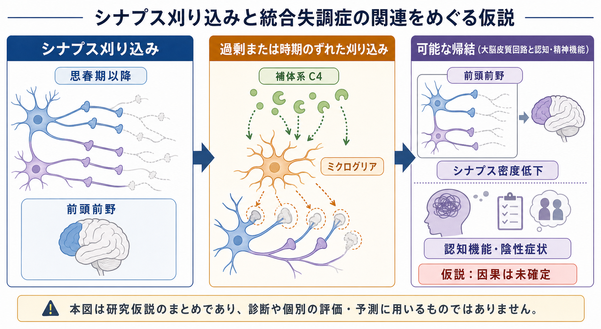
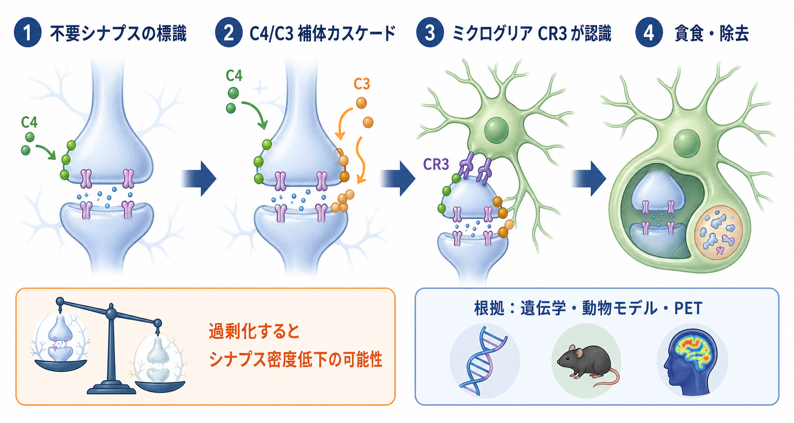
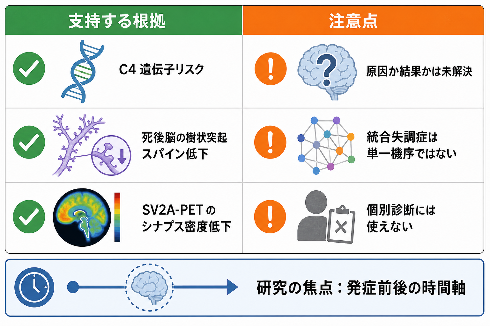

# シナプス刈り込みの異常は統合失調症と関係するのか

## 要点

- [[シナプス刈り込みはなぜ重要なのか|シナプス刈り込み]]は、発達期に過剰につくられた[[シナプスとは何か|シナプス]]の一部を整理し、神経回路を成熟させる過程である。
- 統合失調症では、思春期から若年成人期に発症リスクが高まること、前頭前野などの皮質回路変化が関わることから、「過剰または時期のずれた刈り込み」が病態の一部を説明する仮説として議論されてきた[1][2]。
- 死後脳研究、C4を中心とする補体系の遺伝学、患者由来細胞モデル、SV2A-PETは、シナプス密度低下や補体・ミクログリア経路との関連を支持する。ただし、因果関係や個人診断への応用は未確定である[3][4][7][8]。
- この仮説は「統合失調症の単一原因」ではない。ドパミン、[[E_Iバランスとは何か|興奮性・抑制性バランス]]、[[GABAは脳で何をしているのか|GABA]]、ストレス、発達環境、認知過程などと接続して読む必要がある。

## この記事で答える問い

1. シナプス刈り込みとは何で、なぜ思春期以降の統合失調症研究と結びつくのか。
2. C4、補体系、[[ミクログリアは脳の免疫細胞として何をしているのか|ミクログリア]]は、どのように刈り込み仮説に関わるのか。
3. どの証拠が仮説を支え、どこに限界があるのか。
4. 臨床や研究では、この仮説をどこまで使ってよいのか。

## まず結論

シナプス刈り込みの異常は、統合失調症と関係する可能性が高い。ただし、「過剰な刈り込みが統合失調症を直接つくる」と単純に断定できる段階ではない。

この仮説の強みは、発症時期、皮質回路の成熟、死後脳の樹状突起スパイン低下、補体成分C4の遺伝学、ミクログリアによるシナプス取り込み、SV2A-PETによるシナプス密度指標の低下を、一つの発達的な説明枠に接続できる点である[2][3][4][7][8]。一方で、これらの証拠は測っている階層が違う。遺伝子、細胞、死後組織、PET、症状は同じものを直接測っているわけではない。

したがって、現時点での妥当な読み方は、「シナプス刈り込みの過剰または不適切な時期・場所での進行が、一部の人の統合失調症リスクや認知・陰性症状に関わる可能性がある」という仮説である。医療・精神医学に関する記述は教育・研究目的であり、個別の診断や治療方針を示すものではない。

## 背景

統合失調症は、幻覚・妄想などの陽性症状だけでなく、意欲低下、感情表出の低下、社会機能の低下、認知機能障害を含む多面的な状態である。発症は思春期後半から若年成人期に多く、この時期は[[神経回路の発達はどのように進むのか|神経回路の発達]]が完了する時期ではなく、前頭前野を含む連合皮質の再編成が続く時期でもある[1]。

ヒト前頭前野の樹状突起スパイン密度は、小児期に高く、その後、思春期から20代にかけて成人水準へ向かって低下することが報告されている[1]。この長い成熟期間は、高次認知、社会的判断、作業記憶の柔軟性を支える一方で、発達過程のずれが精神疾患リスクとして表れうる時間窓にもなる。

統合失調症とシナプス刈り込みを結びつける発想は新しいものではない。Feinbergは1980年代初頭に、思春期の脳機能再編成と皮質シナプス密度低下に注目し、統合失調症の一部は思春期のプログラムされたシナプス除去の異常として理解できるのではないかと提案した[2]。現在の研究は、この古典的仮説を、遺伝学、免疫分子、ミクログリア、PET、患者由来細胞モデルで検証し直している。

## 基本概念

### シナプス刈り込み

シナプス刈り込みとは、発達中に過剰につくられたシナプスや樹状突起スパインの一部が取り除かれ、よく使われる結合や機能的に適した結合が相対的に残る過程である。これは単なる「減少」ではなく、回路を洗練する選別である。

刈り込みは、[[シナプス可塑性とは何か|シナプス可塑性]]と連続している。活動の同期、入力の競合、発達時期、局所の分子標識、グリア細胞の状態によって、残る結合と除去されやすい結合の確率が変わる。

### 統合失調症の刈り込み仮説

統合失調症の刈り込み仮説は、主に「思春期以降に、必要な皮質シナプスまで過剰に、または不適切な場所・時期で除去されると、前頭前野を中心とする回路の効率や同期が崩れ、認知機能障害、陰性症状、精神病症状への脆弱性が高まる」という考え方である。

ここで重要なのは、「刈り込みの量」だけでなく「どのシナプスが、いつ、どの細胞種・領域で、どの分子経路を介して除去されるか」である。全脳で均一にシナプスが減るというより、前頭前野、側頭葉、海馬、視床皮質回路などの特定の回路で、発達と経験に依存した選別がずれると考える方が精密である。

### 補体系とC4

補体系は免疫系の分子群だが、中枢神経系の発達ではシナプス除去にも関わる。動物研究では、古典的補体経路が発達期のシナプス除去に関与することが示されている[5][6]。

統合失調症研究で特に注目されたのが、補体成分C4である。大規模遺伝学と分子解析を組み合わせた研究では、C4A発現を高めやすいC4構造多型が統合失調症リスクと関連し、C4がマウスの発達期シナプス除去にも関わることが報告された[4]。これは、遺伝的リスクをシナプス刈り込みの細胞機構に接続した重要な知見である。

## 仕組み

### 1. 発達期の前頭前野は長く再編成される

前頭前野は、作業記憶、文脈に応じた判断、目標維持、社会的推論に関わる。これらは統合失調症で障害されやすい機能でもある。ヒト前頭前野では、樹状突起スパインの過剰産生とその後の減少が長く続き、20代まで再編成が続く可能性が示されている[1]。

この発達の長さは、統合失調症がなぜ小児期ではなく思春期後半から若年成人期に顕在化しやすいのかを考える手がかりになる。発症前から微細な認知・社会機能の脆弱性があり、思春期以降の回路再編成がそれを増幅する、という読み方ができる。

### 2. 死後脳では前頭前野のスパイン密度低下が報告されている

統合失調症の死後脳研究では、背外側前頭前野の錐体細胞で樹状突起スパイン密度が低いことが報告されている[3]。樹状突起スパインは興奮性入力の主要な受け皿なので、この低下は皮質回路の興奮性入力や長距離結合の変化を示唆する。

ただし、死後脳研究だけでは「発達期に過剰刈り込みが起きた結果なのか」「発症後の経過、薬物、生活要因、慢性ストレスなどの影響なのか」を完全には分けられない。ここが、刈り込み仮説の強い部分であると同時に、慎重に読むべき部分でもある。

### 3. 補体系がシナプスを除去候補として標識する

発達中の神経回路では、不要または弱い入力が補体分子によって標識され、除去されやすくなる経路がある。古典的な研究では、C1qやC3を含む補体系が発達期の中枢神経系におけるシナプス除去に必要であることが示された[5]。

統合失調症のC4研究は、この発達神経科学の知見を精神疾患リスクへ接続した。C4A発現を高めやすい遺伝的構成がリスクと関連するなら、補体によるシナプス標識が強まり、一部の回路でシナプス除去が過剰になる可能性がある[4]。

### 4. ミクログリアが標識されたシナプスを取り込む

ミクログリアは脳内の免疫系細胞であり、発達中の回路でシナプス要素を取り込む。視覚系の動物研究では、ミクログリアによるシナプス取り込みが神経活動と補体受容体CR3/C3経路に依存することが示された[6]。

患者由来細胞を用いた研究では、統合失調症患者由来のミクログリア様細胞や神経成分でシナプス取り込みが増えるモデルが報告され、C4座位の遺伝的変異がその一部を説明する可能性が示された[7]。これは、ヒト患者由来の細胞モデルで「過剰刈り込み」を実験的に扱った点で重要である。

ただし、細胞モデルは脳内の発達環境を完全には再現しない。血管、アストロサイト、抑制性介在ニューロン、神経修飾、経験依存的活動、ストレスホルモンなどが欠けるため、結果は「機構候補」として読む必要がある。

### 5. SV2A-PETは生体内のシナプス密度指標を与える

近年は、SV2Aに結合するPETリガンドを使って、生体内でシナプス密度の指標を推定する研究が進んでいる。統合失調症患者と健常対照を比較した研究では、前頭皮質や前部帯状皮質でSV2A指標が低いことが報告された[8]。

これは死後脳ではなく生体内でシナプス密度関連指標を測った点で重要である。ただし、サンプルサイズは限定的で、PET指標はシナプス数そのものを顕微鏡で数えているわけではない。薬物、病期、症状、脳萎縮、解析法の影響も慎重に扱う必要がある。

## 図解

下の図は、支持する根拠と注意点を並べたものである。刈り込み仮説の説得力は、単一の決定的証拠ではなく、複数の階層の証拠が同じ方向を向くところにある。

| 証拠の種類 | 支持する点 | 注意点 |
|---|---|---|
| 発達神経科学 | 前頭前野の再編成が思春期から若年成人期まで続く[1] | 健常発達の知見から疾患機構を直接断定できない |
| 古典的仮説 | 思春期のシナプス除去異常が統合失調症発症と関係する可能性を早くから提案した[2] | 仮説的枠組みであり、分子機構は後続研究が必要だった |
| 死後脳 | 前頭前野のスパイン密度低下が報告された[3] | 原因・結果・薬物・病期の切り分けが難しい |
| 遺伝学 | C4A発現を高めやすい構成がリスクと関連した[4] | C4だけで統合失調症全体を説明できない |
| 動物モデル | 補体系・ミクログリアが発達期シナプス除去に関与する[5][6] | ヒト前頭前野の思春期発達へ直接一般化しすぎない |
| 患者由来細胞 | シナプス取り込み増加を実験的に検討できる[7] | in vitroモデルは脳内環境の一部しか再現しない |
| PET | 生体内でSV2A指標低下を検出した[8] | 小規模研究が多く、病期差や薬物影響の検証が必要 |

## 臨床・研究との接続

### 認知機能・陰性症状との関係

過剰刈り込み仮説は、陽性症状だけでなく、認知機能障害や陰性症状を理解するうえで有用である。前頭前野の興奮性入力や局所回路が不安定になると、作業記憶、文脈維持、柔軟な意思決定、社会的推論が障害されやすい。これらは[[ガンマ振動は認知機能にどう関わるのか|ガンマ振動]]やE/Iバランスの異常とも接続する。

ただし、幻覚や妄想を刈り込みだけで説明するのは不十分である。統合失調症ではドパミン系のサリエンス付与、感覚予測、自己モニタリング、社会認知、ストレス反応、[[脳ネットワークの破綻は精神疾患をどう説明するのか|脳ネットワークの破綻]]など、複数の階層が関わる。

### 予防・治療標的としての注意

補体やミクログリアが関わるなら、それを薬で抑えればよい、と短絡してはいけない。補体系もミクログリアも、発達、感染防御、組織修復、恒常性維持に必要な機能をもつ。刈り込みを一律に抑えることは、別の発達上・免疫上のリスクを生む可能性がある。

将来的には、発症前後の時間軸、リスク層別化、炎症・補体・シナプス密度のバイオマーカーを組み合わせ、誰のどの時期にどの経路が問題になるかを見分ける研究が重要になる。現時点では、刈り込み仮説は治療選択を直接決める道具ではなく、病態理解と研究仮説の枠組みとして扱うのが適切である。

## よくある誤解

### 誤解1: 統合失調症はシナプスが少ない病気である

統合失調症を「シナプスが少ない病気」と言い切るのは粗すぎる。低下が報告される領域や細胞層は限定的で、測定法によって見えるものも異なる。重要なのは、シナプス数だけでなく、どの回路のどの結合がどう変わるかである。

### 誤解2: C4遺伝子があれば統合失調症になる

C4は重要なリスク機構候補だが、決定因子ではない。C4の構造多型は集団レベルのリスク差に関わるが、個人の発症を単独で予測するものではない[4]。統合失調症の遺伝リスクは多遺伝子的で、環境要因や発達過程とも相互作用する。

### 誤解3: ミクログリアは悪いシナプスを食べるだけである

ミクログリアは発達と恒常性維持に必要な細胞であり、シナプス取り込みも正常発達の一部である[6]。問題は、取り込みが過剰になること、時期がずれること、必要な結合が除去されること、炎症状態と結びつくことである。

### 誤解4: 刈り込み仮説はもう証明された

証拠は強まりつつあるが、完全に証明されたわけではない。ヒトの発症前から発症後まで、同じ個人でシナプス刈り込みを直接追跡することは難しい。現在の知見は、死後脳、遺伝学、動物モデル、細胞モデル、PETを組み合わせた推論である。

## 関連ノート

- [[シナプス刈り込みはなぜ重要なのか]]
- [[シナプスとは何か]]
- [[シナプス可塑性とは何か]]
- [[ミクログリアは脳の免疫細胞として何をしているのか]]
- [[神経回路の発達はどのように進むのか]]
- [[E_Iバランスとは何か]]
- [[GABAは脳で何をしているのか]]
- [[ガンマ振動は認知機能にどう関わるのか]]
- [[脳ネットワークの破綻は精神疾患をどう説明するのか]]

## MOC更新候補

- `content/00_MOC/` 配下の脳・神経科学または精神疾患関連MOCに、`[[シナプス刈り込みの異常は統合失調症と関係するのか]]` を追加する候補。
- 並列生成ジョブとの競合を避けるため、このジョブではMOC本体は更新しない。

## 理解チェック

1. シナプス刈り込み仮説が、統合失調症の発症時期と結びつく理由は何か。
2. C4、C3、ミクログリアは、刈り込み機構のどの段階に関わると考えられるか。
3. 死後脳研究とSV2A-PET研究は、それぞれ何を示し、何を示せないか。
4. なぜこの仮説を個別診断や治療選択へ直接使ってはいけないのか。

## 未解決問題

- 発症前、発症初期、慢性期で、シナプス密度や補体・ミクログリア経路はどのように変化するのか。
- C4リスクは、どの脳領域、細胞種、発達時期で最も強く作用するのか。
- シナプス密度低下は、病因なのか、症状やストレス、薬物、生活機能低下の結果なのか、あるいは相互作用なのか。
- PET、血液・髄液マーカー、遺伝情報、認知評価を組み合わせることで、臨床的に意味のあるサブタイプを作れるのか。

## 参考文献

[1] Petanjek, Z., Judas, M., Simic, G., Rasin, M. R., Uylings, H. B. M., Rakic, P., & Kostovic, I. (2011). Extraordinary neoteny of synaptic spines in the human prefrontal cortex. *Proceedings of the National Academy of Sciences*, 108(32), 13281-13286. https://doi.org/10.1073/pnas.1105108108

[2] Feinberg, I. (1982). Schizophrenia: Caused by a fault in programmed synaptic elimination during adolescence? *Journal of Psychiatric Research*, 17(4), 319-334. https://doi.org/10.1016/0022-3956(82)90038-3

[3] Glantz, L. A., & Lewis, D. A. (2000). Decreased dendritic spine density on prefrontal cortical pyramidal neurons in schizophrenia. *Archives of General Psychiatry*, 57(1), 65-73. https://doi.org/10.1001/archpsyc.57.1.65

[4] Sekar, A., Bialas, A. R., de Rivera, H., Davis, A., Hammond, T. R., Kamitaki, N., et al. (2016). Schizophrenia risk from complex variation of complement component 4. *Nature*, 530, 177-183. https://doi.org/10.1038/nature16549

[5] Stevens, B., Allen, N. J., Vazquez, L. E., Howell, G. R., Christopherson, K. S., Nouri, N., et al. (2007). The classical complement cascade mediates CNS synapse elimination. *Cell*, 131(6), 1164-1178. https://doi.org/10.1016/j.cell.2007.10.036

[6] Schafer, D. P., Lehrman, E. K., Kautzman, A. G., Koyama, R., Mardinly, A. R., Yamasaki, R., et al. (2012). Microglia sculpt postnatal neural circuits in an activity and complement-dependent manner. *Neuron*, 74(4), 691-705. https://doi.org/10.1016/j.neuron.2012.03.026

[7] Sellgren, C. M., Gracias, J., Watmuff, B., Biag, J. D., Thanos, J. M., Whittredge, P. B., et al. (2019). Increased synapse elimination by microglia in schizophrenia patient-derived models of synaptic pruning. *Nature Neuroscience*, 22, 374-385. https://doi.org/10.1038/s41593-018-0334-7

[8] Onwordi, E. C., Halff, E. F., Whitehurst, T., Mansur, A., Cotel, M.-C., Wells, L., et al. (2020). Synaptic density marker SV2A is reduced in schizophrenia patients and unaffected by antipsychotics in rats. *Nature Communications*, 11, 246. https://doi.org/10.1038/s41467-019-14122-0
