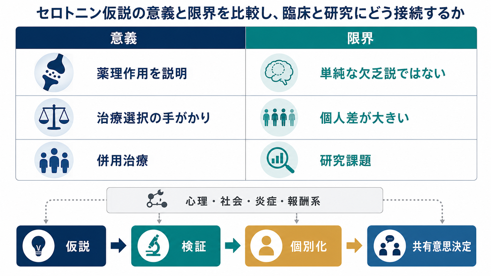
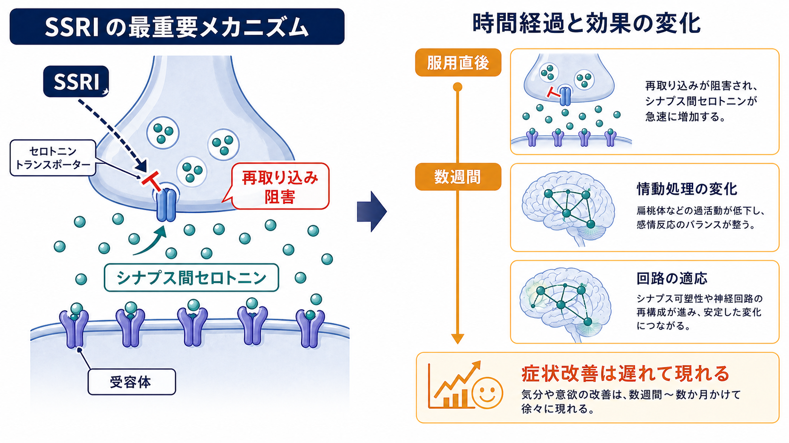

# セロトニン仮説はうつ病をどこまで説明できるのか

## 要点

- セロトニン仮説は、「うつ病のすべてはセロトニン不足で説明できる」という完成した原因論ではなく、抗うつ薬の薬理作用から発展した研究仮説である。
- SSRI はセロトニントランスポーターを阻害し、シナプス間のセロトニン利用可能性を比較的早く変える。しかし、症状改善は多くの場合すぐには起こらず、情動処理、神経可塑性、ストレス反応、学習環境の変化などを含む時間のかかる過程として理解される [4][5]。
- セロトニン系はうつ病理解に有用だが、心理社会的要因、[[HPA軸は精神疾患にどう関わるのか|HPA軸]]、[[炎症仮説はうつ病をどう説明するのか|炎症]]、[[報酬系の異常はうつ病をどう説明するのか|報酬系]]、睡眠、認知、遺伝的脆弱性などを含む多因子モデルの一部である [3][7]。

## この記事で答える問い

1. セロトニン仮説とモノアミン仮説は何を説明しようとしたのか。
2. SSRI は脳内で何を変えるのか。
3. なぜ「セロトニン不足がうつ病の原因」と単純化してはいけないのか。
4. それでもセロトニン仮説が臨床・研究で重要なのはなぜか。

## まず結論

セロトニン仮説は、うつ病の「全原因」を説明する仮説ではない。むしろ、抗うつ薬が神経伝達を変えるという観察から、気分、情動処理、ストレス反応、認知、社会環境がどのように結びつくかを問う入口である。

初学者にとって重要なのは、二つを分けて考えることである。第一に、SSRI がセロトニン再取り込みを阻害するという薬理作用は比較的明確である [4][5]。第二に、うつ病の原因が単純な「セロトニン欠乏」だといえるかは別問題であり、近年のレビューではその単純説を支持する一貫した証拠は弱いと整理されている [3]。

## 背景

モノアミン仮説は、セロトニン、ノルアドレナリン、ドパミンなどのモノアミン系の機能低下が抑うつ症状に関与するという考え方である。1960年代には、レセルピンなどの薬剤観察や三環系抗うつ薬・モノアミン酸化酵素阻害薬の作用から、情動障害とモノアミンの関係が議論された [1]。

この仮説の意義は、うつ病を「性格の弱さ」や単なる心理反応ではなく、神経伝達と治療可能性のある状態として研究する道を開いた点にある。一方で、当初から過度の単純化も含んでいた。うつ病は症状も経過も多様であり、同じ診断名の中に、睡眠障害が前景に出る人、意欲低下が中心の人、不安・焦燥が強い人、身体症状が目立つ人が含まれる。

したがって、セロトニン仮説は、[[精神疾患は脳の病気なのか|精神疾患を脳だけに閉じ込める説明]]ではなく、脳・身体・環境・経験が相互作用するモデルの一部として読むのが適切である。

## 基本概念

### セロトニン

セロトニンは、気分だけでなく、睡眠、食欲、痛み、衝動性、情動学習、社会行動などに関わる神経修飾物質である。詳しくは [[セロトニンは気分だけに関わるのか]] と接続して読むとよい。神経伝達物質は放出されたあと、分解・拡散・再取り込みによってシナプスから除去される。SSRI が標的にするのは、このうち再取り込みを担うセロトニントランスポーターである。

### SSRI

SSRI は「選択的セロトニン再取り込み阻害薬」であり、セロトニントランスポーターを阻害して、シナプス間隙に残るセロトニンの量を増やす。これは薬理学的な説明であり、「服用すれば直ちに気分が上がる」という意味ではない。臨床効果は個人差が大きく、診療ガイドラインでも心理療法、生活上の支援、症状の重症度、本人の希望、副作用リスクを含めて治療選択を考える [6]。

### モノアミン仮説

モノアミン仮説は、セロトニンだけでなく、[[ノルアドレナリンは覚醒とストレスにどう関わるのか|ノルアドレナリン]]、[[ドパミンは報酬だけの物質なのか|ドパミン]]を含む広い仮説である。セロトニン仮説はその一部であり、特に SSRI の普及とともに一般にも広く知られるようになった。

## 仕組み

SSRI の急性作用は、シナプス前終末のセロトニントランスポーターを阻害し、セロトニンの再取り込みを減らすことである。このレベルでは、[[神経伝達物質はどのように除去されるのか]]、[[受容体にはどのような種類があるのか]]、[[シナプスとは何か]] の知識が役に立つ。

ただし、臨床症状の改善は、シナプス間セロトニンの増加だけで一直線に説明できない。抗うつ薬の効果は、ネガティブな情動刺激への反応や注意バイアスを早期に変え、それが日常経験や対人関係の中で再学習されていく、という認知神経心理学的モデルも提案されている [5]。また、反復服用に伴って受容体感受性、神経可塑性、回路レベルの適応が変化する可能性がある。

## 図解

上の 1 枚目は、セロトニン仮説の「意義」と「限界」を並べたものである。意義は、薬理作用を説明し、治療選択の手がかりを与え、併用治療や研究課題へ橋をかける点にある。限界は、単純な欠乏説ではなく、個人差が大きく、心理・社会・炎症・報酬系などを含めて解釈する必要がある点である。

2 枚目は、SSRI の作用を「シナプスでの急性変化」と「数週間かけた臨床変化」に分けて示している。薬理作用と症状改善の時間差を分けることが、セロトニン仮説を過大評価しすぎないための鍵になる。

## 臨床・研究との接続

成人うつ病に対する抗うつ薬の比較研究では、複数の抗うつ薬がプラセボより有効であることが示されている一方、効果量、忍容性、患者ごとの合う・合わないには差がある [4]。そのため、SSRI の有効性を「セロトニン不足の証明」と読むのは誤りである。薬が効くことは、その薬が変える経路が症状形成や回復過程に関与している可能性を示すが、病因がその一点に還元されることは意味しない。

NICE の成人うつ病ガイドラインも、症状の重症度、治療歴、本人の希望、副作用、心理療法や社会的支援を含めた選択を重視している [6]。これは、うつ病を単一分子の欠乏としてではなく、生活機能、リスク、本人の価値観を含む臨床的問題として扱う姿勢と一致する。

研究面では、セロトニン系は今も重要である。セロトニンを「原因物質」としてではなく、ストレス反応、情動予測、睡眠、衝動性、社会的学習、[[シナプス可塑性とは何か|シナプス可塑性]]に関わる調節系として扱うと、他の仮説と接続しやすい。たとえば、炎症がモノアミン代謝に影響する可能性、HPA軸がセロトニン受容体や情動回路に影響する可能性、報酬系の変化が快感消失に関わる可能性などがある。

## よくある誤解

### 誤解1: うつ病はセロトニン不足だけで起こる

これは単純化しすぎである。セロトニン理論に関するアンブレラレビューは、低セロトニンがうつ病の主原因だとする一貫した証拠は強くないと結論づけた [3]。ただし、この結論は「セロトニン系が一切関係しない」という意味ではない。低すぎる解釈も高すぎる解釈も避ける必要がある。

### 誤解2: SSRI が効くなら、原因はセロトニン不足である

薬の作用機序と病気の原因は同じではない。鎮痛薬が痛みに効くからといって、すべての痛みの原因が鎮痛薬の標的分子だけにあるわけではない。同じように、SSRI の効果はセロトニン系の関与を示すが、うつ病全体の単一原因を証明しない。

### 誤解3: セロトニン仮説は完全に否定された

これも極端である。否定されたのは主に「単純な欠乏説」であり、セロトニン系を情動処理や神経回路調節の一部として研究する意義は残っている [2][5]。臨床的にも、SSRI は選択肢の一つであり続けている [4][6]。

### 誤解4: 抗うつ薬は気分を直接高める薬である

SSRI は気分を即座に押し上げる薬というより、情動処理や反応しやすさの条件を変え、その変化が生活経験や心理療法、対人関係、行動活性化と組み合わさって症状変化につながる可能性がある [5]。そのため、服薬だけでなく、睡眠、生活リズム、心理的支援、社会的支援を含めた包括的理解が重要になる。

## 関連ノート

- [[セロトニンは気分だけに関わるのか]]
- [[神経伝達物質はどのように除去されるのか]]
- [[受容体にはどのような種類があるのか]]
- [[シナプス可塑性とは何か]]
- [[報酬系の異常はうつ病をどう説明するのか]]
- [[炎症仮説はうつ病をどう説明するのか]]
- [[HPA軸は精神疾患にどう関わるのか]]
- [[精神疾患は脳の病気なのか]]

## MOC更新候補

- `content/00_MOC/MOC｜脳・神経科学.md`
- `content/00_MOC/MOC｜精神医学.md`
- `content/00_MOC/MOC｜臨床実践・治療.md`

## 理解チェック

1. セロトニン仮説と「単純なセロトニン欠乏説」はどこが違うか。
2. SSRI の薬理作用と臨床症状の改善には、なぜ時間差がありうるか。
3. 抗うつ薬が有効であることは、病因をどこまで説明できるか。
4. セロトニン仮説を、炎症仮説・HPA軸・報酬系の仮説と組み合わせると何が見えてくるか。

## 未解決問題

- どの患者群でセロトニン系の関与が相対的に大きいのか。
- SSRI の早期の情動処理変化は、誰にどの程度、長期的な症状改善を予測するのか。
- セロトニン系、炎症、ストレスホルモン、報酬系、睡眠リズムを統合した個別化モデルをどう検証するか。
- 薬物療法、心理療法、生活支援、社会的介入の組み合わせを、どのように本人の価値観と結びつけて選ぶか。

## 参考文献

[1] Schildkraut, J. J. (1965). The catecholamine hypothesis of affective disorders: A review of supporting evidence. *American Journal of Psychiatry, 122*(5), 509-522. https://doi.org/10.1176/ajp.122.5.509

[2] Cowen, P. J., & Browning, M. (2015). What has serotonin to do with depression? *World Psychiatry, 14*(2), 158-160. https://doi.org/10.1002/wps.20229

[3] Moncrieff, J., Cooper, R. E., Stockmann, T., Amendola, S., Hengartner, M. P., & Horowitz, M. A. (2023). The serotonin theory of depression: A systematic umbrella review of the evidence. *Molecular Psychiatry, 28*, 3243-3256. https://doi.org/10.1038/s41380-022-01661-0

[4] Cipriani, A., Furukawa, T. A., Salanti, G., et al. (2018). Comparative efficacy and acceptability of 21 antidepressant drugs for the acute treatment of adults with major depressive disorder: A systematic review and network meta-analysis. *The Lancet, 391*(10128), 1357-1366. https://doi.org/10.1016/S0140-6736(17)32802-7

[5] Harmer, C. J., Goodwin, G. M., & Cowen, P. J. (2009). Why do antidepressants take so long to work? A cognitive neuropsychological model of antidepressant drug action. *British Journal of Psychiatry, 195*(2), 102-108. https://doi.org/10.1192/bjp.bp.108.051193

[6] National Institute for Health and Care Excellence. (2022). *Depression in adults: Treatment and management* (NICE guideline NG222). https://www.nice.org.uk/guidance/ng222

[7] Malhi, G. S., & Mann, J. J. (2018). Depression. *The Lancet, 392*(10161), 2299-2312. https://doi.org/10.1016/S0140-6736(18)31948-2
