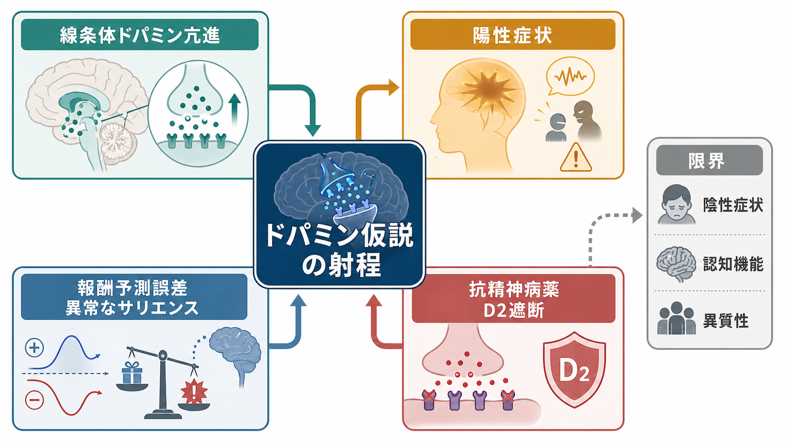
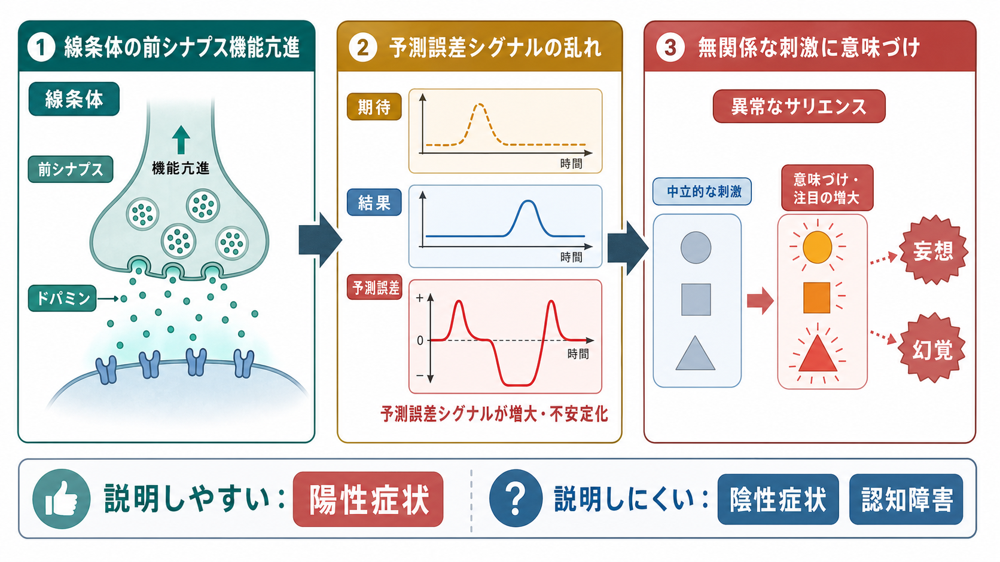
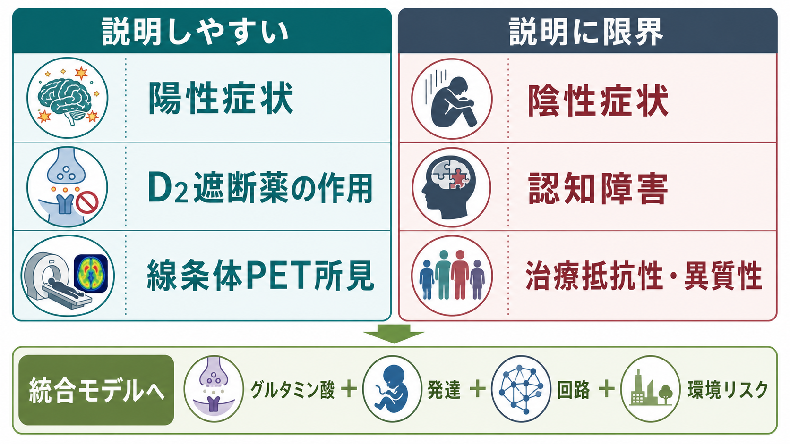

# ドパミン仮説は統合失調症をどこまで説明できるのか

## 要点

- ドパミン仮説の現在形は、「統合失調症のすべてはドパミンで説明できる」という主張ではなく、特に精神病症状に至る最終共通経路として、線条体の前シナプス性ドパミン機能亢進を重視する仮説である[1]。
- PET 研究とメタ解析は、統合失調症で線条体ドパミン合成能が上昇しやすいことを支持している。これは [[PETは脳の何を測るのか|PET]] や [[受容体PETとは何か|受容体PET]] によって、神経伝達を間接的に測る研究から得られた知見である[2][3]。
- 抗精神病薬の主要な共通作用は D2 受容体遮断であり、D2 占有率は臨床効果や錐体外路症状と関係する[4]。
- ドパミン仮説は、幻覚・妄想などの陽性症状、異常なサリエンス、報酬予測誤差の乱れを説明しやすい[5][6]。
- 一方で、陰性症状、認知障害、発達過程、グルタミン酸系、治療抵抗性、患者間の異質性を単独で説明するには不十分である[3][8]。

## この記事で答える問い

1. ドパミン仮説は、統合失調症の何をうまく説明するのか。
2. 報酬予測誤差や異常なサリエンスは、幻覚・妄想とどう関係するのか。
3. 抗精神病薬の D2 遮断作用は、ドパミン仮説をどこまで支持するのか。
4. 陰性症状、認知障害、治療抵抗性はなぜ説明しにくいのか。
5. 現在は、ドパミン仮説をどのような統合モデルの一部として読むべきか。

## まず結論

ドパミン仮説は、統合失調症という疾患全体の万能説明ではない。しかし、精神病症状、とくに妄想・幻覚・思考のまとまりにくさなどの陽性症状を、線条体ドパミン機能、報酬予測誤差、抗精神病薬の薬理作用と結びつけるうえでは、現在も強い説明力を持つ。

Howes と Kapur は、旧来の「ドパミン過剰が統合失調症を起こす」という単純な見方を改め、遺伝、発達、環境リスク、グルタミン酸系、ストレスなど複数の経路が、最終的に線条体ドパミン機能異常へ収束し、精神病症状を表現するという「version III」を提案した[1]。したがって、ドパミン仮説を読むときの焦点は「原因はドパミンか」ではなく、「どの症状・どの病期・どの治療反応が、ドパミン系を通じて表現されるのか」である。

## 背景

統合失調症は、陽性症状、陰性症状、認知機能障害、気分症状、社会機能低下などが組み合わさる異質性の高い症候群である。ここでいう陽性症状とは、妄想、幻覚、まとまりにくい思考や言動など、通常は経験されない知覚・信念・意味づけが前景化する症状を指す。陰性症状とは、意欲低下、感情表出の乏しさ、会話量の低下、社会的引きこもりなど、機能の低下として見える症状である。

ドパミン仮説が重要なのは、少なくとも三つの理由がある。第一に、アンフェタミンなどドパミン放出を高める薬物が精神病様症状を誘発・悪化させうる。第二に、多くの抗精神病薬が D2 受容体遮断作用を共有する。第三に、PET 研究が、統合失調症や精神病高リスク状態で線条体ドパミン合成能の上昇を示してきた[2][3]。

ただし、これらは「ドパミンが唯一の原因である」という意味ではない。むしろ現在の位置づけは、[[グルタミン酸は脳で何をしているのか|グルタミン酸]]、GABA、発達、炎症、ストレス、社会環境、神経回路の可塑性などが、ドパミン系と相互作用するというものに近い[3]。

## 基本概念

### 線条体ドパミン

線条体は、大脳基底核の中心的な入力部位であり、行動選択、報酬学習、習慣、動機づけと関わる。ドパミンは、ここで「快感物質」として単純に働くのではなく、行動や刺激の価値、学習の更新、注意の向け方を調整する神経修飾物質である。詳しくは [[ドパミンは報酬だけの物質なのか]] と接続して読むとよい。

統合失調症研究で特に注目されるのは、線条体の前シナプス性ドパミン機能である。これは、ドパミンがどれだけ作られ、放出されやすい状態にあるかという側面であり、DOPA PET などで推定される[2]。

### 報酬予測誤差

報酬予測誤差とは、予測した結果と実際の結果の差である。単純化すれば、次のように書ける。

$$
\delta_t = r_t + \gamma V(s_{t+1}) - V(s_t)
$$

ここで $\delta_t$ は予測誤差、$r_t$ は得られた報酬、$V(s_t)$ は現在状態の価値、$\gamma$ は将来価値の割引を表す。実際の脳内ドパミン活動をこの式だけに還元することはできないが、ドパミンが「期待より良かった」「期待より悪かった」という学習信号に関わるという発想は、強化学習モデルと精神病理解をつなぐ橋になる[6]。

### 異常なサリエンス

サリエンスとは、ある刺激や出来事が「目立つ」「重要に感じられる」性質である。Kapur は、精神病を「異常なサリエンス」の状態として捉えた[5]。この見方では、ドパミン信号の乱れにより、本来は中立的な刺激や偶然の一致に過剰な意味が付与される。そこに本人なりの説明が与えられると、妄想的信念として固定される可能性がある。

この考え方は、[[サリエンスネットワークとは何か|サリエンスネットワーク]] の話と似ているが、同じではない。サリエンスネットワークは島皮質や前部帯状皮質などを含む広いネットワーク概念であり、異常なサリエンス仮説は、精神病症状における意味づけの変化をドパミン系と結びつける症状形成モデルである。

## 仕組み

### 1. 線条体ドパミン機能が高まりやすい

DOPA PET メタ解析は、統合失調症で線条体のドパミン合成能が上昇する傾向を示している[2]。また、ドパミンとグルタミン酸を統合的に扱う近年のレビューでは、ドパミン異常が線条体、特に前シナプス側に強く見られる一方、皮質や海馬、グルタミン酸系との相互作用が重要だと整理されている[3]。

この知見は、症状を「脳のどこかが単純に過活動になる」と読むよりも、「学習・価値づけ・注意配分の調整信号が、ある文脈で過剰または不安定になる」と読むほうが近い。

### 2. 予測誤差が不適切に発生する

通常、予測誤差は学習を助ける。期待と結果がずれたとき、脳は「何かを更新すべきだ」と判断する。しかし、無関係な刺激や偶然の出来事に対して予測誤差が過剰に発生すると、世界が不自然に意味深く感じられる可能性がある[6][7]。

Maia と Frank は、統合失調症におけるドパミン異常を、関連刺激に対する適応的な phasic dopamine 応答の低下と、自発的・不適切な phasic dopamine 放出の増加の組み合わせとして整理した[6]。この枠組みでは、後者が中立刺激への異常な価値づけや陽性症状を説明しやすく、前者は報酬学習や動機づけの低下、陰性症状の一部と関係しうる。

### 3. 異常な意味づけが妄想・幻覚へ接続する

異常なサリエンス仮説では、妄想は突然ゼロから生まれるのではなく、過剰に意味づけられた経験を説明しようとする過程で形成される[5]。例えば、いつもなら無視される視線、音、偶然の一致が、「自分に関係している」「何かのメッセージだ」と感じられる。その説明が繰り返し強化されると、訂正しにくい信念になる可能性がある。

予測処理の観点では、幻覚や妄想は、予測誤差、事前信念、精度の重みづけの乱れとして理解される[7]。この枠組みはドパミンだけでなく、NMDA 受容体、グルタミン酸、GABA、階層的な皮質回路を含むため、ドパミン仮説の限界を補う方向にある。

### 4. 抗精神病薬は D2 遮断を通じて陽性症状を抑える

多くの抗精神病薬は、D2 受容体を遮断することで精神病症状を軽減する。Kapur らの初回エピソード統合失調症を対象とした PET 研究は、D2 受容体占有率が臨床反応、副作用、高プロラクチン血症と関係することを示した[4]。

この事実は、ドパミン仮説の強い支持材料である。ただし、D2 遮断は「病因を除去する」というより、過剰または不安定なドパミン信号が受容体側で症状へ変換される過程を抑える、と考えるほうが適切である。抗精神病薬が効くからといって、統合失調症の原因が D2 受容体だけにあるとは言えない。

## 図解

| 領域 | ドパミン仮説で説明しやすい点 | 限界 |
|---|---|---|
| 陽性症状 | 異常なサリエンス、予測誤差、D2 遮断薬の効果と接続しやすい[4][5][6] | 症状内容の個別性、社会的意味、妄想の固定性までは十分に説明しない |
| 陰性症状 | 報酬学習や動機づけ低下の一部は説明できる[6] | 意欲低下、感情表出低下、社会機能低下を一つのドパミン異常に還元しにくい |
| 認知障害 | 前頭線条体回路や学習信号との接点がある | 作業記憶、実行機能、処理速度、社会認知の広範な障害を単独では説明しにくい |
| 治療反応 | D2 遮断と陽性症状改善の関係を説明しやすい[4] | 治療抵抗性では、線条体ドパミン合成能が必ずしも高くない可能性がある[8] |
| 病因 | 複数リスクが精神病症状へ収束する経路として有用[1] | 発達、遺伝、環境、グルタミン酸、回路形成を別途説明する必要がある[3] |

## 臨床・研究との接続

臨床的には、ドパミン仮説は抗精神病薬の使い方を理解する土台になる。D2 遮断は陽性症状の軽減と関係するが、占有率が高すぎると錐体外路症状や高プロラクチン血症のリスクが上がる[4]。したがって、薬理学的には「ドパミンを強く抑えればよい」ではなく、効果と副作用の範囲を見ながら調整するという発想になる。

研究的には、ドパミン仮説は、症状と計算論的変数を結びつける入り口になる。報酬予測誤差、価値学習、探索、努力コスト、サリエンス、確信度などを行動課題で測り、PET、fMRI、薬理操作と対応づけることで、精神病症状をより細かく分解できる。

ただし、医療上の判断では、この知識を個別診断や自己判断の治療指示として使うべきではない。症状、病期、併存症、薬剤歴、副作用、生活背景を含めた評価が必要であり、この記事は教育・研究目的の整理である。

## よくある誤解

### 誤解1: 統合失調症はドパミン過剰だけで起こる

現在のドパミン仮説は、そのような単純説ではない。ドパミン異常は精神病症状への重要な経路だが、グルタミン酸、GABA、発達、ストレス、環境リスク、社会的経験などを切り離して理解することはできない[1][3]。

### 誤解2: ドパミンは快楽物質だから、統合失調症は快楽の病気である

ドパミンは快楽そのものよりも、学習、価値、行動選択、予測誤差、注意づけと深く関わる。統合失調症のドパミン仮説で問題になるのも、「快楽が多すぎる」ことではなく、意味づけや学習信号の乱れである[5][6]。

### 誤解3: 抗精神病薬が効くなら、原因は D2 受容体で確定している

薬が効く標的と、疾患の根本原因は同じとは限らない。D2 遮断は症状表現を抑える有効な経路だが、病因には発達、遺伝、環境、回路変化が関わる[1][3]。

### 誤解4: 陰性症状や認知障害も D2 遮断で十分に改善する

陰性症状と認知障害は、陽性症状よりもドパミン仮説だけでは説明しにくい。報酬学習や動機づけの一部にはドパミンが関わるが、広い認知機能や社会機能には、皮質回路、グルタミン酸系、GABA 系、発達歴、環境要因が関与する[3][6]。

## 関連ノート

- [[ドパミンは報酬だけの物質なのか]]
- [[PETは脳の何を測るのか]]
- [[受容体PETとは何か]]
- [[グルタミン酸は脳で何をしているのか]]
- [[GABAは脳で何をしているのか]]
- [[サリエンスネットワークとは何か]]
- [[大脳基底核ループとは何か]]
- [[直接路と間接路は行動選択をどう制御するのか]]
- [[脳ネットワークの破綻は精神疾患をどう説明するのか]]

## MOC更新候補

- `content/00_MOC/MOC｜脳・神経科学.md`
- `content/00_MOC/MOC｜精神医学.md`
- `content/00_MOC/MOC｜計算論的精神医学.md`

並列実行時の競合を避けるため、本ジョブでは MOC 本体は更新していない。

## 理解チェック

1. ドパミン仮説が最も説明しやすい症状領域は何か。
2. 線条体の前シナプス性ドパミン機能亢進とは、どのような測定・概念と関係するか。
3. 異常なサリエンス仮説では、妄想はどのように形成されると考えるか。
4. D2 遮断薬の効果は、ドパミン仮説をどこまで支持し、どこからは支持しないか。
5. 陰性症状や認知障害を説明するには、ドパミン以外にどのような要因を考える必要があるか。

## 未解決問題

- 線条体ドパミン機能亢進は、どの病期で、どの患者群に最も強く現れるのか。
- 異常なサリエンス、報酬予測誤差、予測処理モデルは、同じ現象を別の言葉で述べているのか、それとも異なる階層を説明しているのか。
- 治療抵抗性統合失調症では、ドパミン以外のどの経路が主要な治療標的になるのか。
- 陰性症状と認知障害を、ドパミン、グルタミン酸、GABA、皮質線条体回路の相互作用としてどこまで定量化できるのか。

## 参考文献

[1] Howes, O. D., & Kapur, S. (2009). The dopamine hypothesis of schizophrenia: Version III--the final common pathway. *Schizophrenia Bulletin*, 35(3), 549-562. https://doi.org/10.1093/schbul/sbp006

[2] Fusar-Poli, P., & Meyer-Lindenberg, A. (2013). Striatal presynaptic dopamine in schizophrenia, part II: Meta-analysis of [18F/11C]-DOPA PET studies. *Schizophrenia Bulletin*, 39(1), 33-42. https://doi.org/10.1093/schbul/sbr180

[3] McCutcheon, R. A., Krystal, J. H., & Howes, O. D. (2020). Dopamine and glutamate in schizophrenia: Biology, symptoms and treatment. *World Psychiatry*, 19(1), 15-33. https://doi.org/10.1002/wps.20693

[4] Kapur, S., Zipursky, R. B., Jones, C., Remington, G., & Houle, S. (2000). Relationship between dopamine D2 occupancy, clinical response, and side effects: A double-blind PET study of first-episode schizophrenia. *American Journal of Psychiatry*, 157(4), 514-520. https://doi.org/10.1176/appi.ajp.157.4.514

[5] Kapur, S. (2003). Psychosis as a state of aberrant salience: A framework linking biology, phenomenology, and pharmacology in schizophrenia. *American Journal of Psychiatry*, 160(1), 13-23. https://doi.org/10.1176/appi.ajp.160.1.13

[6] Maia, T. V., & Frank, M. J. (2017). An integrative perspective on the role of dopamine in schizophrenia. *Biological Psychiatry*, 81(1), 52-66. https://doi.org/10.1016/j.biopsych.2016.05.021

[7] Corlett, P. R., Honey, G. D., & Fletcher, P. C. (2016). Prediction error, ketamine and psychosis: An updated model. *Journal of Psychopharmacology*, 30(11), 1145-1155. https://doi.org/10.1177/0269881116650087

[8] Demjaha, A., Murray, R. M., McGuire, P. K., Kapur, S., & Howes, O. D. (2012). Dopamine synthesis capacity in patients with treatment-resistant schizophrenia. *American Journal of Psychiatry*, 169(11), 1203-1210. https://doi.org/10.1176/appi.ajp.2012.12010144
