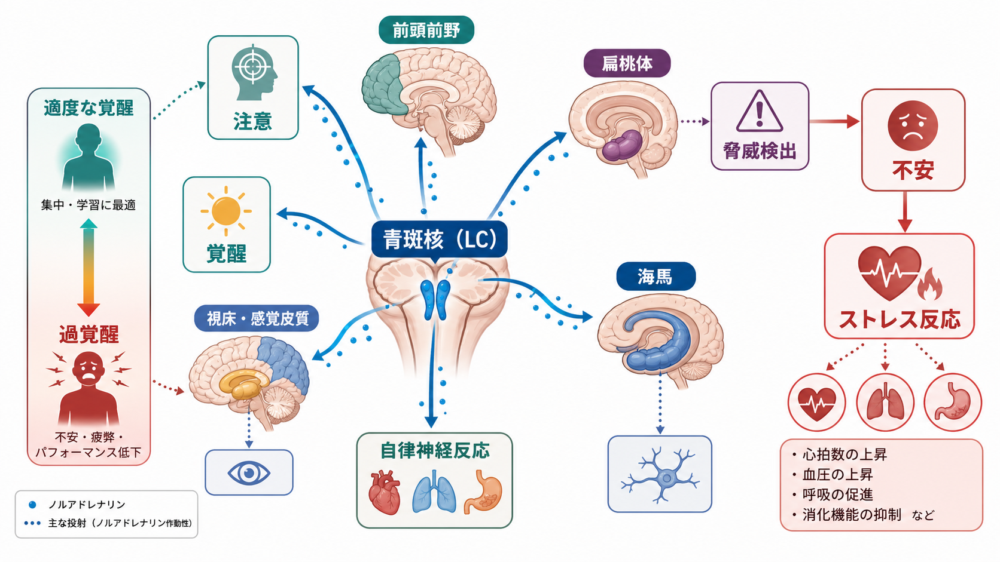
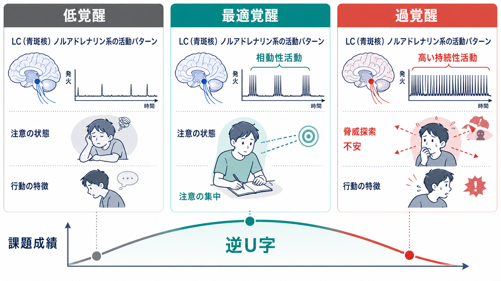
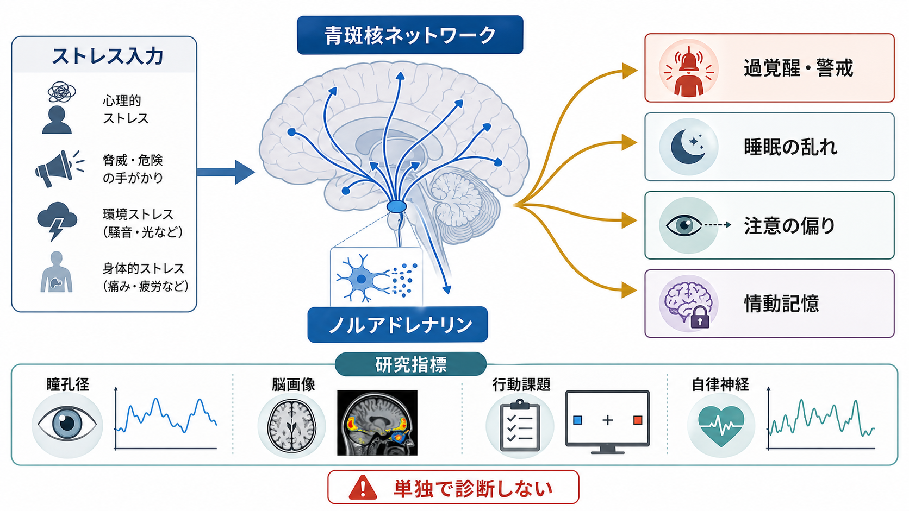

# ノルアドレナリン系は不安と覚醒にどう関わるのか

## 要点

- ノルアドレナリン系は、脳幹の青斑核（locus coeruleus; LC）を中心に、前頭前野、扁桃体、海馬、感覚皮質、自律神経反応へ広く影響する調節系である[1][3]。
- 不安や過覚醒を考えるときの核心は、「ノルアドレナリンが多いか少ないか」ではなく、どの脳部位で、どの時間スケールで、どの受容体を通じて作用しているかである[3][5]。
- 適度なLC-NE活動は注意の集中、手がかり検出、認知的柔軟性を支える。一方、高い持続性活動は脅威探索、落ち着かなさ、過覚醒と結びつきやすい[1][2]。
- ストレスが強いと、前頭前野のトップダウン制御が弱まり、扁桃体や情動記憶、自律神経反応の影響が相対的に強くなりやすい[5][6]。
- 臨床的には、不安、PTSD様の過覚醒、不眠、注意の偏りと接続しうるが、個別の診断や治療方針をノルアドレナリン系だけで決めることはできない。

## この記事で答える問い

この記事では、[[ノルアドレナリンは覚醒とストレスにどう関わるのか]]の基礎を踏まえ、精神疾患・臨床研究に近い問いへ焦点を移す。

1. 青斑核ノルアドレナリン系は、なぜ覚醒、注意、不安を同時に変えるのか。
2. 適度な覚醒と過覚醒は、どこで分かれるのか。
3. ストレス下で、前頭前野、扁桃体、海馬、自律神経反応はどのように連動するのか。
4. 不安症やPTSDを説明するとき、どのような単純化を避けるべきか。

## まず結論

ノルアドレナリン系は、脳を「いま何に備えるべきか」という状態へ調整する。青斑核は小さな脳幹核だが、前脳、脳幹、小脳、脊髄へ広く投射し、覚醒、注意、感覚処理、自律神経反応をまとめて変えうる[3][4]。このため、ノルアドレナリン系は「目が覚める」「周囲を警戒する」「脅威を検出する」「情動的な出来事を記憶に残す」といった現象にまたがる。

不安との関係では、特に**過覚醒**が重要である。適度な覚醒では、注意は課題や重要な手がかりに向かいやすい。ところがストレスや脅威予測が強くなると、LC-NE系は持続的に高まり、注意は広く警戒的になり、身体反応も上がる。これは短期的には危険への準備として役立つが、長期化すると睡眠の乱れ、集中困難、脅威への注意バイアス、情動記憶の強まりとして負荷になりうる[1][2][6]。

## 背景

ノルアドレナリンは、[[ドパミンは報酬だけの物質なのか|ドパミン]]や[[セロトニンは気分だけに関わるのか|セロトニン]]と同じく、広範な神経調節に関わるモノアミンである。速い興奮性・抑制性伝達だけでなく、回路の感度、信号対雑音比、可塑性、行動準備性を調整する。

青斑核は、古典的には睡眠・覚醒や警戒を支える上行性網様体賦活系の一部として理解されてきた。その後、LC-NE系は単なる「覚醒スイッチ」ではなく、注意の再定位、認知的柔軟性、記憶固定、ストレス反応をつなぐ調節系として整理されている[2][3]。

精神疾患との関係では、ノルアドレナリン系は不安症、PTSD、うつ病、ADHD、睡眠障害、疼痛などで議論される。ただし、症状を「ノルアドレナリン過剰」と単純化するのは危うい。実際の症状は、[[HPA軸は精神疾患にどう関わるのか|HPA軸]]、[[扁桃体過活動は不安症やPTSDにどう関わるのか|扁桃体]]、前頭前野、海馬、自律神経、睡眠、学習、環境ストレスが重なって生じる。

## 基本概念

### 青斑核ネットワーク

青斑核は橋にあるノルアドレナリン作動性ニューロンの主要な集団である。前頭前野、頭頂葉、視床、感覚皮質、扁桃体、海馬、視床下部、脊髄へ広範に投射するため、局所回路だけでなく脳全体の状態を変えうる[3][4]。

### 覚醒と過覚醒

覚醒は「眠っていないこと」だけではない。眠気、落ち着いた集中、警戒、過覚醒のように、脳と身体の準備状態には幅がある。過覚醒では、環境音、身体感覚、他者の表情、危険の可能性に注意が向きやすくなり、睡眠や休息への切り替えが難しくなる。

### 不安

不安は、将来の脅威や不確実性に備える状態である。恐怖が「目前の危険」への反応として語られやすいのに対し、不安は「まだ起きていないが起こりうる危険」への予測と結びつきやすい。LC-NE系は、この予測的な警戒、注意の広がり、自律神経反応と接続しやすい。

### 相動性活動と持続性活動

LCニューロンの活動は、短い反応として高まる相動性活動と、背景水準として高まる持続性活動に分けて考えられる。相動性活動は重要な手がかりへの反応や課題遂行を助ける。一方、高い持続性活動は探索、課題からの離脱、警戒、不安様行動と結びつきやすい[1][8]。

## 仕組み

### 1. 適度な覚醒は注意を支え、過覚醒は注意を広げすぎる

Aston-JonesとCohenの適応ゲイン理論では、LC-NE系は行動の「ゲイン」を調整する系として説明される。相動性活動が保たれていると、課題に関係する手がかりへ反応しやすく、行動選択が安定しやすい。これに対して持続性活動が高い状態では、現在の課題にとどまるよりも、別の手がかりや危険を探しやすくなる[1]。

この切り替えは、危険な環境では適応的である。しかし安全な場面でも続くと、注意が脅威へ偏り、集中が途切れ、身体が休息モードへ戻りにくくなる。過覚醒は「集中力が足りない」のではなく、脳が脅威探索へ資源を割きすぎている状態として理解できる。

### 2. 前頭前野はストレスに弱い

前頭前野は、作業記憶、注意制御、行動抑制、情動調整に関わる。適度なカテコールアミン環境では前頭前野ネットワークは安定しやすいが、強いストレス下ではノルアドレナリンやドパミンの作用が過剰になり、前頭前野のトップダウン制御は弱まりやすい[5]。

このとき、考えて選ぶ制御よりも、扁桃体を含む情動・防御系、習慣的反応、身体反応が前面に出やすくなる。これは緊急時には有効だが、慢性ストレスやトラウマ関連症状では、過剰な警戒、回避、睡眠障害、集中困難として現れる可能性がある。

### 3. 扁桃体と情動記憶が過覚醒を維持しうる

扁桃体は、脅威や情動的に重要な出来事の学習・記憶に関わる。ストレスホルモンやノルアドレナリンは、扁桃体を介して情動記憶の固定を強めることがある[6]。これは危険な経験を忘れず、次に備えるためには役立つ。

一方、強いストレス経験では、その記憶が過度に強く残り、似た手がかりへの過剰反応を生むことがある。PTSDでみられる再体験、過覚醒、回避、睡眠の乱れは、ノルアドレナリン系だけで説明できるものではないが、LC-NE系、扁桃体、海馬、前頭前野、HPA軸の相互作用として考えると理解しやすい。

### 4. 投射先と受容体で「不安への寄与」は変わる

ノルアドレナリンは、α1、α2、βアドレナリン受容体などを通じて作用する。作用は一様ではなく、標的領域、受容体、濃度、タイミングで変わる[3][5]。たとえば動物研究では、LCから基底外側扁桃体へのノルアドレナリン投射を刺激すると、不安様行動や嫌悪学習が強まることが示されている[8]。

ただし、このような研究は回路メカニズムの理解に有用である一方、マウスの不安様行動をそのままヒトの不安症へ置き換えることはできない。臨床症状は言語、記憶、社会的文脈、生活史、睡眠、身体疾患、薬物、環境要因の影響を受ける。

## 図解

図1は、青斑核を中心に、前頭前野、扁桃体、海馬、感覚皮質、自律神経反応がどのように不安と覚醒へ接続するかを示している。LC-NE系は脳の一部だけではなく、注意、脅威検出、身体反応をまたぐネットワークとして見る必要がある。

図2は、低覚醒、最適覚醒、過覚醒を比較している。重要なのは、過覚醒では「注意がない」のではなく、注意が脅威探索へ偏り、課題集中に使いにくくなる点である。

図3は、臨床・研究との接続を整理している。瞳孔径、脳画像、行動課題、自律神経指標は、LC-NE系を推定する手がかりになりうるが、単独で診断を決める指標ではない[7]。

## 臨床・研究との接続

不安症やPTSDでは、過覚醒、睡眠障害、驚愕反応、警戒、身体症状、注意バイアスが重要になる。LC-NE系はこれらの一部と関係しうるが、臨床的には[[精神疾患は脳の病気なのか]]で整理したように、多層的なモデルが必要である。

研究では、瞳孔径がLC-NE系と関係する非侵襲的指標として使われる。瞳孔径は認知負荷、覚醒、手がかりへの反応と関連するが、光反射、上丘、自律神経、薬物、疲労、課題条件にも影響される[7]。したがって、「瞳孔が広がった = 青斑核が活動した」と直接同一視するのではなく、複数指標の一つとして読む必要がある。

薬理学的には、ノルアドレナリン再取り込み、α2受容体、β受容体などが研究・治療文脈で議論される。しかし、本記事は教育・研究目的の整理であり、個別の薬剤選択、服薬調整、診断を示すものではない。症状が生活に影響している場合は、医療者による評価が必要である。

## よくある誤解

### 誤解1: 不安はノルアドレナリンが多すぎるだけで起こる

不安には、予測、学習、記憶、身体感覚、生活ストレス、睡眠、社会的文脈が関わる。ノルアドレナリン系は重要な部品だが、単独原因ではない。

### 誤解2: 覚醒を下げれば必ず不安は改善する

過覚醒が問題になる場面はあるが、覚醒は注意、行動準備、記憶にも必要である。低すぎる覚醒も集中困難や疲労感につながりうる。重要なのは、状況に応じて覚醒を上げ下げできる柔軟性である。

### 誤解3: 青斑核は脳全体を一様にオンにする

青斑核は広範に投射するが、作用は一様ではない。前頭前野、扁桃体、海馬、感覚皮質では、受容体構成と局所回路が異なるため、同じノルアドレナリンでも効果は変わる[3][5]。

### 誤解4: 動物実験の不安様行動はヒトの不安症と同じである

動物実験は回路を理解するうえで強力だが、ヒトの不安症は主観的苦痛、言語的意味づけ、社会環境、生活史を含む。動物研究は「構成要素」を調べる方法であり、臨床診断そのものではない。

## 関連ノート

既存ノート:

- [[ノルアドレナリンは覚醒とストレスにどう関わるのか]]
- [[HPA軸は精神疾患にどう関わるのか]]
- [[扁桃体過活動は不安症やPTSDにどう関わるのか]]
- [[精神疾患は脳の病気なのか]]
- [[受容体にはどのような種類があるのか]]
- [[神経伝達物質はどのように除去されるのか]]
- [[ドパミンは報酬だけの物質なのか]]
- [[セロトニンは気分だけに関わるのか]]

関連ノート候補:

- 青斑核とは何か
- 過覚醒とは何か
- 覚醒水準と注意の逆U字関係
- 瞳孔径は認知状態の指標になるのか
- 前頭前野はストレスでなぜ機能低下しやすいのか
- 交感神経系と不安

MOC更新候補:

- `content/00_MOC/MOC｜基礎神経科学.md`
- `content/00_MOC/MOC｜精神医学.md`

## 理解チェック

1. 青斑核ノルアドレナリン系が、覚醒、注意、自律神経反応を同時に変えうるのはなぜか。
2. 相動性活動と高い持続性活動は、不安や注意の偏りを考えるうえでどう違うか。
3. 強いストレス下で、前頭前野のトップダウン制御が弱まると、どのような行動・症状が起こりやすいか。
4. 扁桃体とノルアドレナリンが情動記憶を強めることは、どのような場面では適応的で、どのような場面では負荷になりうるか。
5. 瞳孔径をLC-NE系の指標として使うとき、どのような交絡要因に注意すべきか。

## 参考文献

[1] Aston-Jones, G., & Cohen, J. D. (2005). Adaptive gain and the role of the locus coeruleus-norepinephrine system in optimal performance. *Journal of Comparative Neurology, 493*(1), 99-110. https://doi.org/10.1002/cne.20723

[2] Sara, S. J., & Bouret, S. (2012). Orienting and reorienting: the locus coeruleus mediates cognition through arousal. *Neuron, 76*(1), 130-141. https://doi.org/10.1016/j.neuron.2012.09.011

[3] Sara, S. J. (2009). The locus coeruleus and noradrenergic modulation of cognition. *Nature Reviews Neuroscience, 10*(3), 211-223. https://doi.org/10.1038/nrn2573

[4] Samuels, E. R., & Szabadi, E. (2008). Functional neuroanatomy of the noradrenergic locus coeruleus: its roles in the regulation of arousal and autonomic function part I: principles of functional organisation. *Current Neuropharmacology, 6*(3), 235-253. https://doi.org/10.2174/157015908785777229

[5] Arnsten, A. F. T. (2009). Stress signalling pathways that impair prefrontal cortex structure and function. *Nature Reviews Neuroscience, 10*(6), 410-422. https://doi.org/10.1038/nrn2648

[6] Roozendaal, B., McEwen, B. S., & Chattarji, S. (2009). Stress, memory and the amygdala. *Nature Reviews Neuroscience, 10*(6), 423-433. https://doi.org/10.1038/nrn2651

[7] Joshi, S., & Gold, J. I. (2020). Pupil size as a window on neural substrates of cognition. *Trends in Cognitive Sciences, 24*(6), 466-480. https://doi.org/10.1016/j.tics.2020.03.005

[8] McCall, J. G., Siuda, E. R., Bhatti, D. L., Lawson, L. A., McElligott, Z. A., Stuber, G. D., & Bruchas, M. R. (2017). Locus coeruleus to basolateral amygdala noradrenergic projections promote anxiety-like behavior. *eLife, 6*, e18247. https://doi.org/10.7554/eLife.18247

## 未解決問題

- ヒトの不安・過覚醒において、LC-NE系の相動性活動と持続性活動をどこまで分離して測定できるのか。
- 瞳孔径、脳幹MRI、fMRI、自律神経指標、行動課題を組み合わせたとき、どの程度まで個人差を説明できるのか。
- 急性ストレス、慢性ストレス、トラウマ記憶で、前頭前野、扁桃体、海馬へのノルアドレナリン作用はどう変わるのか。
- ノルアドレナリン系への薬理的介入と心理療法・睡眠介入・環境調整は、どの時間スケールで相互作用するのか。

## 更新ログ

- 2026-04-27: 初稿作成。青斑核ネットワーク、過覚醒、注意、ストレス反応、不安との接続を整理し、図解3点と参考文献を追加。
