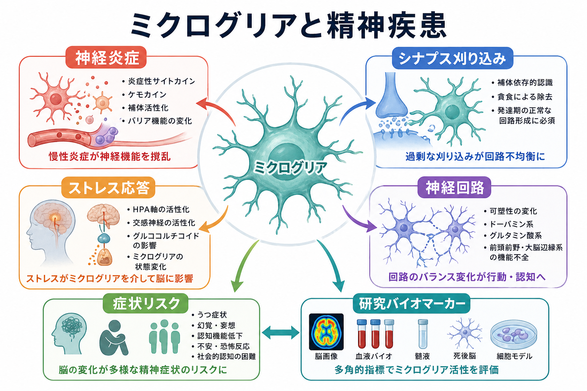
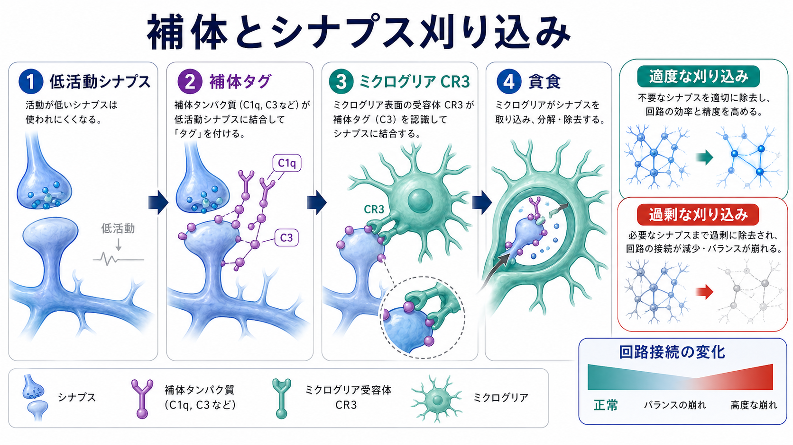
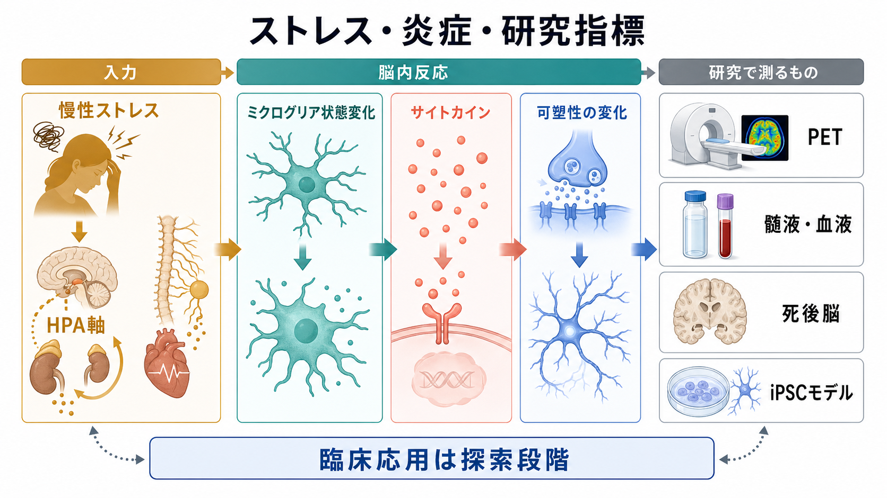

# ミクログリアは精神疾患にどう関わるのか

## 要点

- ミクログリアは脳内の免疫細胞であるだけでなく、発達期から成人期まで、シナプス、可塑性、神経回路、炎症応答を調整する細胞である。
- 精神疾患との関係は、単純な「炎症が強いから病気になる」という話ではない。重要なのは、ミクログリアがどの時期に、どの脳領域で、どの刺激に反応し、どの回路過程を変えるかである。
- 代表的な経路は、神経炎症、補体を介したシナプス刈り込み、慢性ストレスによるミクログリア状態変化の三つである。
- 統合失調症では、補体 C4 とシナプス刈り込みをつなぐ遺伝学・細胞モデル研究が有力な手がかりになっているが、それだけで疾患全体を説明できるわけではない。
- うつ病、PTSD、不安症、発達特性では、ストレス、末梢免疫、HPA軸、サイトカイン、神経可塑性の相互作用として理解する方がよい。
- TSPO PET、血液炎症マーカー、髄液、死後脳、iPSC モデルは重要な研究手段だが、現時点では個人の診断や治療選択に直接使える段階ではない。

## この記事で答える問い

この記事では、ミクログリアを「精神疾患の原因細胞」として単純化せず、次の問いに分けて整理する。

1. ミクログリアは通常、脳内で何をしているのか。
2. 神経炎症、シナプス刈り込み、ストレス応答はどのように精神疾患研究と結びつくのか。
3. 統合失調症やうつ病の研究では、どこまで確からしいことが言えるのか。
4. バイオマーカーや治療標的として考えるとき、何に注意すべきか。

## まず結論

ミクログリアは、精神疾患を「免疫の病気」に置き換えるための概念ではない。むしろ、免疫系、発達、ストレス、シナプス可塑性、神経回路をつなぐ節点として見ると理解しやすい。

たとえば、[[炎症仮説はうつ病をどう説明するのか]]では、炎症性サイトカインや末梢免疫の変化が気分、意欲、睡眠、認知に関わる可能性が議論される。ミクログリアは、その炎症シグナルを脳内の神経活動や可塑性に変換しうる細胞である。また、[[シナプス刈り込みの異常は統合失調症と関係するのか]]では、思春期から若年成人期にかけての回路再編が問題になる。ミクログリアは、補体シグナルを手がかりにシナプスを取り込むため、この領域でも重要な候補になる。

ただし、精神疾患は異質性が大きい。ミクログリアの変化は、疾患の原因、結果、代償、薬物・生活要因の影響のいずれでもありうる。したがって、現時点で確実に言えるのは「ミクログリアは精神疾患の一部の病態過程を媒介しうる」という範囲であり、「ミクログリア異常だけで診断できる」「抗炎症治療で一般に治る」といった主張は過剰である。

## 背景

ミクログリアは中枢神経系に常在するマクロファージ系細胞で、胚発生期に脳へ入り、成体脳でも自己更新しながら長く維持される。従来は、病変部で死細胞や老廃物を処理する「清掃細胞」と見なされることが多かった。しかし、ライブイメージング、単一細胞解析、遺伝学、ヒト iPSC モデルの発展により、ミクログリアは正常脳でも神経活動、シナプス、血管、髄鞘、細胞外環境を継続的に監視する細胞であることが明確になった[1]。

精神疾患研究でミクログリアが注目される理由は三つある。第一に、精神疾患では感染、炎症、自己免疫、ストレス、生活リズム、代謝など、免疫系と関係する危険因子がしばしば見つかる。第二に、発症時期が神経発達や回路再編と重なる疾患があり、ミクログリアが発達期のシナプス選別に関わる。第三に、うつ病や統合失調症の一部では、炎症マーカー、死後脳、PET、細胞モデルでミクログリア関連の変化が報告されている。精神疾患横断のレビューでも、ミクログリアは発達期から成人期まで、脆弱性、発症、慢性化、回復過程をつなぐ候補として整理されている[8]。

この背景は、[[神経科学は精神疾患をどのように説明できるのか]]や[[精神疾患は脳の病気なのか]]で扱う「脳の病態」とも関係する。ただし、脳内の細胞変化を見つけることと、それを個人の症状や治療へ直結させることは別問題である。

## 基本概念

### ミクログリア

ミクログリアは、脳内に存在する自然免疫系の細胞である。細い突起を伸ばして周囲を監視し、損傷、感染、異常タンパク、過剰な活動、低活動なシナプス、神経細胞からの「食べないで」というシグナルなどを読み取る。

古い文献では「静止型」「活性化型」という二分法が使われたが、現在はこの区別は粗すぎると考えられている。ミクログリアは状況に応じて多様な遺伝子発現状態をとり、炎症促進、炎症収束、貪食、修復、シナプス調整、代謝応答などを組み合わせる[1]。したがって、記事中では「活性化」という語を使う場合も、単一の良い状態・悪い状態ではなく「状態変化」として読む必要がある。

### 神経炎症

神経炎症とは、脳内で免疫関連分子、グリア細胞、血管、末梢免疫が関わる反応の総称である。感染防御や修復に必要な反応でもあるが、慢性化したり、発達期や可塑性の高い時期に過剰に起きたりすると、神経活動やシナプス機能を変えうる。

うつ病研究では、炎症性サイトカイン、ストレス、睡眠、代謝、報酬系、前頭前野・海馬の可塑性が結びつけられてきた[5]。これは[[報酬系の異常はうつ病をどう説明するのか]]や[[神経可塑性低下はうつ病をどう説明するのか]]とも接続する。

### シナプス刈り込み

シナプス刈り込みは、発達や学習の中で不要または低活動なシナプスが減り、回路が効率化される過程である。ミクログリアは補体タンパク質などで標識されたシナプスを認識し、貪食によって取り込むことがある。マウス視覚系では、ミクログリアによるシナプス取り込みが神経活動と補体に依存することが示されている[2]。

刈り込みは悪い現象ではない。問題は、時期、量、場所、標的がずれる場合である。過剰な刈り込みは接続低下に、刈り込み不足は過剰接続やノイズの増加に関わる可能性がある。

### ストレス応答

慢性ストレスは、[[HPA軸は精神疾患にどう関わるのか]]で扱う視床下部-下垂体-副腎系、交感神経系、グルココルチコイド、末梢免疫を介して脳内環境を変える。動物研究と臨床研究を統合したレビューでは、ストレスがミクログリアの数、形態、炎症関連遺伝子、サイトカイン応答、貪食能を変える可能性が整理されている[6]。

## 仕組み

### 1. 神経炎症が回路機能を変える

ミクログリアは、感染や損傷だけでなく、慢性ストレス、代謝変化、睡眠障害、加齢、末梢炎症の影響も受ける。炎症性サイトカインやケモカインが増えると、神経伝達物質放出、受容体機能、シナプス可塑性、神経新生、血液脳関門、グリア間相互作用が変化しうる。

うつ病に関する神経免疫レビューでは、心理社会的ストレスが末梢免疫と脳内ミクログリアを撹乱し、気分症状に関係する神経可塑性やシナプス機能に影響しうると整理されている[5]。この見方は、うつ病を「炎症だけの病気」と言うものではない。むしろ、炎症は報酬、睡眠、疲労、認知、身体症状を横断する調整因子の一つである。

### 2. 補体タグがシナプス選別に関わる

補体系は免疫系の分子群だが、脳発達ではシナプス選別にも関わる。単純化すると、低活動なシナプスに補体タグが付くと、ミクログリアが補体受容体を介してそれを認識し、取り込むことがある。マウスの発達期視覚回路では、ミクログリアが活動依存的かつ補体依存的にシナプスを刈り込むことが示された[2]。

この仕組みは統合失調症研究と強く結びついた。大規模遺伝学研究では、補体 C4 の構造多型が C4A 発現量と統合失調症リスクに関連し、C4 が発達期のシナプス除去に関わる可能性が示された[3]。さらに、統合失調症患者由来の細胞モデルでは、ミクログリア様細胞によるシナプス取り込みの増加が報告され、C4 リスク変異は補体沈着と取り込み増加の一部を説明した[4]。

この話は、[[グルタミン酸仮説は統合失調症をどう説明するのか]]や[[E_Iバランス異常は精神疾患をどう説明するのか]]とも相性がよい。過剰なシナプス除去は、グルタミン酸作動性シナプス、抑制性介在ニューロン、前頭前野-海馬回路などの発達的な接続変化と重なりうるからである。

### 3. ストレスがミクログリア状態を変える

慢性ストレスは、HPA軸と交感神経系を通じて免疫系を変える。グルココルチコイドは一見すると抗炎症的だが、慢性的・発達期・反復的なストレスでは、ミクログリアの反応性を高める「プライミング」として働く場合がある。つまり、同じ炎症刺激でも、ストレス履歴がある脳では強い反応が出やすくなる。

この経路は、[[海馬萎縮はストレスやうつ病と関係するのか]]、[[扁桃体過活動は不安症やPTSDにどう関わるのか]]、[[PTSDでは恐怖記憶ネットワークに何が起きているのか]]と接続できる。ストレスによるミクログリア状態変化は、海馬の可塑性、扁桃体の警戒反応、前頭前野の制御機能に影響する可能性がある。

### 4. 発達期の免疫刺激が回路形成に影響する

妊娠期・周産期・小児期の免疫刺激は、神経発達に影響する可能性がある。ミクログリアは発達期のシナプス選別、軸索誘導、細胞死の処理、神経新生に関わるため、発達期の炎症やストレスは長期的な回路特性に影響しうる。これは[[神経発達の異常は精神疾患にどう関わるのか]]で扱う、発達期リスクと成人期症状のつながりに関係する。

ただし、ヒトで「特定の感染や炎症が特定の精神疾患を必ず引き起こす」と言えるわけではない。遺伝的脆弱性、時期、性差、環境、社会的要因、保護因子が重なることで、リスクの方向や大きさが変わる。

## 図解

下図は、慢性ストレス、ミクログリア状態変化、サイトカイン、神経可塑性、研究指標を一つの流れとしてまとめたものである。重要なのは、研究指標が複数ある一方で、それぞれが「ミクログリアそのもの」を完全に測っているわけではない点である。

| 視点 | ミクログリアが関わる過程 | 精神疾患研究での読み方 |
|---|---|---|
| 神経炎症 | サイトカイン、ケモカイン、補体、血管・末梢免疫との相互作用 | うつ病、統合失調症、PTSDなどで炎症サブタイプを考える手がかり |
| シナプス刈り込み | 低活動シナプスの認識、補体依存的な貪食 | 統合失調症の発達期発症、皮質シナプス密度低下、回路接続変化と接続 |
| ストレス応答 | HPA軸、交感神経、グルココルチコイド、プライミング | 慢性ストレス、うつ、不安、PTSDにおける可塑性変化の媒介候補 |
| 発達 | 神経新生、軸索・シナプス形成、細胞死処理 | 発達期リスク、ASD特性、思春期発症リスクの背景過程 |
| 研究指標 | TSPO PET、死後脳、髄液・血液、iPSCモデル | 個人診断ではなく、病態仮説を検証するための間接指標 |

## 臨床・研究との接続

### うつ病

うつ病では、炎症性サイトカインの上昇、慢性ストレス、睡眠障害、肥満・代謝、身体疾患との併存がしばしば議論される。ミクログリアは、これらの末梢・環境シグナルを脳内の可塑性変化に変換する候補である。神経免疫レビューでは、炎症過程がうつ症状の一部、とくに疲労、意欲低下、認知、睡眠、報酬処理と結びつく可能性が示されている[5]。

ただし、うつ病の全例が炎症型ではない。炎症マーカーが高い一群、ストレス反応が目立つ一群、報酬系や認知制御の変化が目立つ一群などを分けて考える必要がある。

### 統合失調症

統合失調症では、補体 C4、思春期以降のシナプス刈り込み、皮質シナプス密度低下、前頭前野・側頭葉・海馬の接続変化が一つの仮説群を形成している[3][4]。この仮説は魅力的だが、統合失調症の幻覚、妄想、陰性症状、認知機能障害のすべてを直接説明するものではない。

臨床的には、[[ドパミン仮説は統合失調症をどこまで説明できるのか]]、[[GABA機能低下は統合失調症にどう関わるのか]]、[[陰性症状は報酬系や認知制御の障害と関係するのか]]と組み合わせて読むとよい。ミクログリア仮説は、神経伝達物質仮説の代替というより、発達期に回路の形を変える上流・背景過程として位置づけられる。

### PTSD・不安症・慢性ストレス

PTSDや不安症では、恐怖記憶、扁桃体過活動、前頭前野による制御低下、海馬文脈処理の変化が重視される。ミクログリアは、慢性ストレスによってこれらの回路の可塑性や炎症反応性を変える候補である[6]。とくに、ストレスが睡眠、身体炎症、痛み、疲労と結びつく場合、神経免疫の視点は有用である。

### 発達特性

ASDや神経発達症との関連では、発達期のシナプス形成・刈り込み、母体免疫活性化、感覚過敏、E/Iバランスが論点になる。ミクログリアは発達期の回路形成に関わるため、[[感覚過敏は神経回路でどう説明できるのか]]や[[神経発達の異常は精神疾患にどう関わるのか]]と接続できる。ただし、ASDを「炎症疾患」と一般化するのは不適切であり、発達軌道の多様性を前提にする必要がある。

### バイオマーカーと治療標的

ミクログリア研究では、TSPO PET がよく使われる。TSPO は炎症反応の PET 標的として使われるが、ミクログリアだけに特異的ではなく、疾患、脳領域、リガンド、定量法で結果が変わる。2023年の横断的メタ解析では、TSPO PET 信号は疾患群や定量法によって大きく異なり、統合失調症では主要結果が有意でなかったと報告された[7]。したがって、TSPO PET を「ミクログリア活性化の単純な温度計」として扱うのは危険である。

治療標的としては、抗炎症薬、ミノサイクリン、サイトカイン経路、補体経路、代謝・睡眠・運動介入などが研究対象になる。しかし、現時点では、個人の精神疾患に対してミクログリアを直接標的化する標準治療が確立しているわけではない。教育・研究目的では、ミクログリアは「将来の層別化と病態理解の候補」と位置づけるのが妥当である。

## よくある誤解

### 誤解1: ミクログリアはいつも悪者である

ミクログリアは発達、修復、感染防御、老廃物処理に不可欠である。問題は、必要な反応が過剰、慢性、時期外れ、領域不適合になる場合である。

### 誤解2: 炎症マーカーが高ければ精神疾患の原因が分かる

血液 CRP やサイトカインは参考になるが、脳内ミクログリア状態を直接示すものではない。末梢炎症、睡眠、体重、喫煙、薬物、身体疾患、感染などの影響も受ける。

### 誤解3: 統合失調症はシナプス刈り込みだけで説明できる

補体 C4 と刈り込み仮説は重要だが、統合失調症にはドパミン、グルタミン酸、GABA、発達、社会ストレス、認知制御、遺伝的多因子性が関わる。単一機序に還元しない方がよい。

### 誤解4: TSPO PET はミクログリア活性をそのまま測る

TSPO は有用な研究指標だが、ミクログリア特異的ではなく、アストロサイト、血管、末梢細胞、定量法の影響も受ける。結果は慎重に解釈する必要がある[7]。

### 誤解5: 抗炎症薬で精神疾患を一般に治せる

炎症が関わる一部のサブタイプでは介入可能性が研究されているが、標準治療を置き換える根拠はない。治療判断は個別の臨床評価に基づくべきであり、この記事は診断や治療指示ではない。

## 関連ノート

- [[炎症仮説はうつ病をどう説明するのか]]
- [[シナプス刈り込みの異常は統合失調症と関係するのか]]
- [[HPA軸は精神疾患にどう関わるのか]]
- [[神経発達の異常は精神疾患にどう関わるのか]]
- [[神経可塑性低下はうつ病をどう説明するのか]]
- [[海馬萎縮はストレスやうつ病と関係するのか]]
- [[PTSDでは恐怖記憶ネットワークに何が起きているのか]]
- [[E_Iバランス異常は精神疾患をどう説明するのか]]
- [[グルタミン酸仮説は統合失調症をどう説明するのか]]
- [[神経科学は精神疾患をどのように説明できるのか]]

## MOC更新候補

- `content/00_MOC/` 配下に神経科学・精神疾患系 MOC がある場合、本記事を「神経免疫」「神経炎症」「統合失調症」「うつ病」「ストレス応答」のいずれかの小見出しに追加する。
- 並列記事生成との競合を避けるため、このジョブでは MOC 本体は更新しない。

## 理解チェック

1. ミクログリアを「脳内の免疫細胞」とだけ説明すると、どの機能が抜け落ちるか。
2. シナプス刈り込みはなぜ正常発達にも必要で、過剰になると問題になるのか。
3. 補体 C4 と統合失調症の関係は、何を示していて、何をまだ示していないか。
4. 慢性ストレスがミクログリアに影響する経路として、HPA軸と交感神経系はどのように関わるか。
5. TSPO PET をミクログリア活性化の直接指標として扱うと、どのような誤解が起こるか。

## 未解決問題

- ヒト精神疾患で見られるミクログリア状態変化が、原因、結果、代償、薬物・生活要因のどれに当たるのかは、疾患段階ごとにまだ十分分かっていない。
- ミクログリアの「悪い活性化」を単一に定義することは難しく、単一細胞解析、空間解析、縦断 PET、iPSC モデル、臨床表現型の統合が必要である。
- 炎症型・補体型・ストレス型などのサブタイプを、臨床で再現よく層別化できるバイオマーカーはまだ確立していない。
- ミクログリアを標的にした介入が、どの疾患段階・どの患者群・どの症状次元に有効かは今後の検証課題である。

## 参考文献

[1] Prinz, M., Jung, S., & Priller, J. (2019). Microglia Biology: One Century of Evolving Concepts. *Cell*, 179(2), 292-311. https://doi.org/10.1016/j.cell.2019.08.053

[2] Schafer, D. P., Lehrman, E. K., Kautzman, A. G., et al. (2012). Microglia sculpt postnatal neural circuits in an activity and complement-dependent manner. *Neuron*, 74(4), 691-705. https://doi.org/10.1016/j.neuron.2012.03.026

[3] Sekar, A., Bialas, A. R., de Rivera, H., et al. (2016). Schizophrenia risk from complex variation of complement component 4. *Nature*, 530, 177-183. https://doi.org/10.1038/nature16549

[4] Sellgren, C. M., Gracias, J., Watmuff, B., et al. (2019). Increased synapse elimination by microglia in schizophrenia patient-derived models of synaptic pruning. *Nature Neuroscience*, 22, 374-385. https://doi.org/10.1038/s41593-018-0334-7

[5] Wohleb, E. S., Franklin, T., Iwata, M., & Duman, R. S. (2016). Integrating neuroimmune systems in the neurobiology of depression. *Nature Reviews Neuroscience*, 17, 497-511. https://doi.org/10.1038/nrn.2016.69

[6] Calcia, M. A., Bonsall, D. R., Bloomfield, P. S., Selvaraj, S., Barichello, T., & Howes, O. D. (2016). Stress and neuroinflammation: a systematic review of the effects of stress on microglia and the implications for mental illness. *Psychopharmacology*, 233, 1637-1650. https://doi.org/10.1007/s00213-016-4218-9

[7] De Picker, L. J., Morrens, M., Branchi, I., et al. (2023). TSPO PET brain inflammation imaging: A transdiagnostic systematic review and meta-analysis of 156 case-control studies. *Brain, Behavior, and Immunity*, 113, 415-431. https://doi.org/10.1016/j.bbi.2023.07.023

[8] Tay, T. L., Béchade, C., D’Andrea, I., St-Pierre, M.-K., Henry, M. S., Roumier, A., & Tremblay, M.-È. (2018). Microglia Gone Rogue: Impacts on Psychiatric Disorders across the Lifespan. *Frontiers in Molecular Neuroscience*, 10, 421. https://doi.org/10.3389/fnmol.2017.00421
