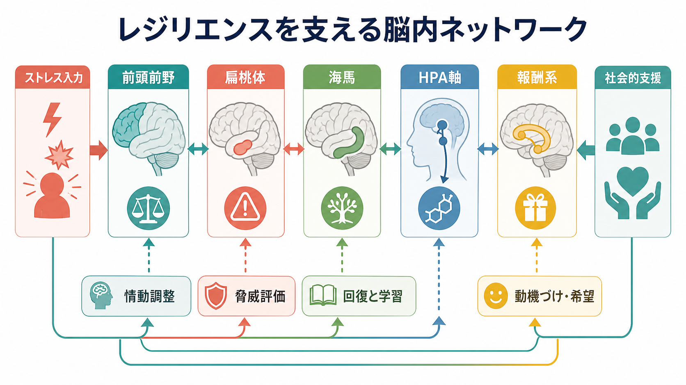
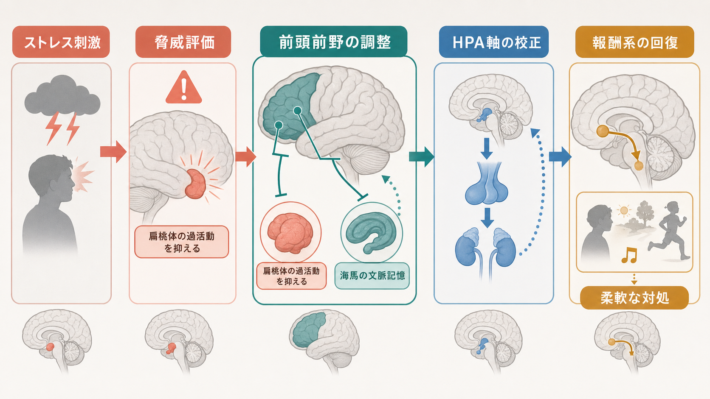
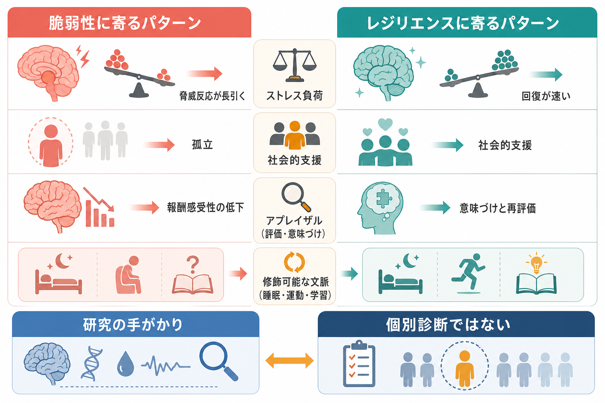

# レジリエンスは脳内でどう支えられているのか

## 要点

- レジリエンスは「ストレスを受けない性質」ではなく、ストレス後に機能を保ち、必要に応じて回復・再学習する動的な過程である。
- 中心になるのは、[[前頭前野は情動制御にどう関わるのか|前頭前野]]による脅威評価の調整、[[扁桃体過活動は不安症やPTSDにどう関わるのか|扁桃体]]の過活動抑制、[[海馬萎縮はストレスやうつ病と関係するのか|海馬]]による文脈記憶、[[HPA軸は精神疾患にどう関わるのか|HPA軸]]の校正である。
- [[報酬系の異常はうつ病をどう説明するのか|報酬系]]は、快感だけでなく、動機づけ・希望・探索行動の回復に関わる。
- 社会的支援は心理的な安心に留まらず、HPA軸、ノルアドレナリン系、オキシトシン系、社会的報酬系を通じてストレス反応を緩衝しうる。
- 脳画像やホルモン指標だけで個人のレジリエンスを診断することはできない。生活史、環境、発達段階、症状、支援資源を統合して読む必要がある。

## この記事で答える問い

このノートでは、レジリエンスを「脳のどこか一部の強さ」ではなく、複数の回路がストレス負荷に応じて調整される仕組みとして整理する。特に、脅威への反応、情動制御、報酬と動機づけ、社会的支援がどのように接続するかを扱う。

## まず結論

レジリエンスの神経機構は、単一の「レジリエンス中枢」では説明できない。ストレス刺激が入ると、扁桃体は脅威の重要性を評価し、HPA軸はコルチゾールを含む内分泌反応を動員する。海馬は「これはどの文脈で起きたことか」を符号化し、前頭前野は衝動的な脅威反応を抑えたり、意味づけや再評価を行ったりする。この調整がうまく働くほど、ストレス反応は必要な範囲で立ち上がり、長引きすぎず、経験からの学習に戻りやすい[1][2][3]。

さらに、報酬系はストレスからの回復に重要である。動物研究では、慢性社会的敗北ストレスに対する感受性と抵抗性が、中脳辺縁系ドパミン回路の適応と関連することが示されている[4]。人間では、社会的支援がストレス反応を弱める経路として、HPA軸、ノルアドレナリン系、オキシトシン系、社会的報酬関連領域が候補になる[5][6]。

## 背景

ストレス研究は長く、ストレスがどのように[[PTSDでは恐怖記憶ネットワークに何が起きているのか|PTSD]]、うつ、不安、身体症状、依存などのリスクを高めるかに注目してきた。しかし、同じような逆境を経験しても、全員が精神疾患を発症するわけではない。この差を「脆弱性が少ない」とだけ表現すると、レジリエンスの能動的な側面が見えにくくなる。

主要なレビューでは、レジリエンスはストレスによる変化が単に起きない状態ではなく、ストレス応答系が柔軟に働き、適応的な行動を維持する過程だと整理されている[1][2]。つまり、レジリエンスは「鈍感さ」ではなく、「必要な反応を起こし、不要になったら下げ、経験から学ぶ能力」に近い。

## 基本概念

### レジリエンス

レジリエンスとは、逆境・脅威・喪失・慢性ストレスにさらされたあとでも、心理的・社会的・身体的機能を一定程度保つ、または回復する過程である。個人特性として語られることも多いが、実際には発達、遺伝、生活環境、社会的支援、学習経験、現在の健康状態が相互作用する。

### アロスタシスと負荷

ストレス反応は本来、環境変化に対応するためのアロスタシス、つまり「変化を通じた安定化」である。しかし、脅威反応が長く続く、回復が遅い、予測できない負荷が重なる、といった条件では、脳・内分泌・自律神経の調整コストが高くなる。前頭前野や海馬はストレスに対して可塑的だが、慢性的な負荷のもとでは認知制御や文脈記憶に影響が出やすい[3]。

### 脆弱性との関係

レジリエンスと脆弱性は単純な反対語ではない。ある人が対人ストレスには強くても、睡眠不足や慢性痛には弱いことがある。ある時期には回復力が高くても、発達段階、加齢、ホルモン状態、生活上の喪失によって変わることもある。したがって、レジリエンスは固定値ではなく、状況依存的な調整能力として見る方がよい。

## 仕組み

### 1. 前頭前野は脅威反応を調整する

前頭前野は、作業記憶、目標維持、再評価、衝動抑制に関わる。ストレス下では前頭前野の働きが弱まり、扁桃体や習慣的反応の影響が強くなりやすい。一方、レジリエンスが高い状態では、前頭前野が「いま本当に危険か」「別の解釈はあるか」「どの行動が長期的に有利か」を調整する余地が残る[2][3]。

この点は、[[TMSはうつ病治療でどの神経回路を狙っているのか|TMS]]や認知行動療法の神経基盤を考えるときにも重要である。ただし、特定の脳部位を活性化すれば必ずレジリエンスが上がる、という単純な話ではない。

### 2. 扁桃体は脅威の重要性を検出する

扁桃体は恐怖だけの中枢ではなく、情動的に重要な刺激を検出し、注意・自律神経・内分泌反応を動員するハブである。脅威評価が過剰に続くと、危険が去ったあとも警戒が下がりにくくなる。レジリエンスには、扁桃体反応を完全に消すことではなく、必要な場面で立ち上げ、不要になったら下げる調整が関わる。

### 3. 海馬は「文脈」を与える

海馬は記憶の固定だけでなく、ストレス経験がどの場所・時間・状況で起きたのかを文脈化する。文脈記憶が働くと、「過去の危険」と「現在の安全」を区別しやすくなる。逆に、海馬機能が弱まると、似た手がかりに対して広く脅威反応が出やすくなる可能性がある。これは[[PTSDでは恐怖記憶ネットワークに何が起きているのか|PTSDの恐怖記憶ネットワーク]]とも接続する。

### 4. HPA軸は反応の強さと回復速度を決める

HPA軸は、視床下部、下垂体、副腎をつなぐ内分泌系で、ストレス時のコルチゾール反応に関わる。レジリエンスにおいて重要なのは、コルチゾールが低いことそのものではなく、状況に応じて上がり、フィードバックによって適切に下がることである。社会的支援や安全感は、このストレス反応の振幅や回復速度に影響しうる[5][6]。

### 5. 報酬系は「次の行動に戻る力」を支える

慢性ストレスでは、快感、動機づけ、探索、社会的関心が低下しやすい。動物モデルでは、慢性社会的敗北ストレスに対する感受性と抵抗性が、腹側被蓋野から側坐核へ向かう中脳辺縁系ドパミン回路の可塑性と関連する[4]。これは、レジリエンスが単なる恐怖反応の抑制ではなく、報酬・希望・意味づけに戻る回路を含むことを示している。

## 図解

上の1枚目は、レジリエンスを支える脳内ネットワークの概念地図である。ストレス入力、前頭前野、扁桃体、海馬、HPA軸、報酬系、社会的支援を横断的に配置している。

2枚目は、もっとも重要なメカニズムである「前頭前野によるトップダウン調整」を示している。ストレス刺激は扁桃体とHPA軸を動員するが、前頭前野と海馬が文脈・再評価・行動選択を与えることで、反応は固定化せず、柔軟な対処へ戻りやすくなる。

3枚目は、脆弱性に寄るパターンとレジリエンスに寄るパターンを比較したものである。研究上の指標は理解の手がかりになるが、個別診断の根拠として単独で使うべきではない。

## 臨床・研究との接続

臨床的には、レジリエンス研究は「なぜ発症したか」だけでなく、「なぜ保たれている部分があるのか」「どの機能が回復の足場になるのか」を考える視点を与える。たとえば、うつ病で快感や動機づけが低下している場合、報酬系の問題だけでなく、睡眠、炎症、社会的孤立、身体活動、生活上の意味づけを同時に見る必要がある。

社会的支援は、単なる気休めではない。レビューでは、良好な支援関係が精神的・身体的健康と関連し、HPA軸、ノルアドレナリン系、オキシトシン系を通じてストレス耐性を支える可能性が論じられている[5]。また、fMRI研究では、社会的支援に関連する神経活動がストレス時の神経内分泌反応の低下と結びつくことが報告されている[6]。

ただし、これらは「支援があれば必ず回復する」という意味ではない。支援が侵入的、評価的、条件つきである場合には、かえって負荷になることもある。支援の質、本人の受け取り方、関係性の安全性、文化的背景を分けて考える必要がある。

研究面では、レジリエンスを脳画像、コルチゾール、遺伝子多型、炎症マーカー、行動課題、生活史データの統合として扱う方向が重要である。主要レビューは、レジリエンスを多層的な表現型として捉え、神経回路、分子、内分泌、行動を横断して検討する必要性を強調している[1][2][7]。

## よくある誤解

### 誤解1: レジリエンスが高い人はストレスを感じない

レジリエンスが高い人もストレスを感じる。重要なのは、反応が必要以上に長引かず、支援を使い、意味づけを更新し、行動を再開できることである。

### 誤解2: レジリエンスは生まれつき決まっている

遺伝や発達歴は影響するが、経験、学習、社会的環境、身体状態も関与する。前頭前野や海馬はストレスに弱い一方で、経験に応じた可塑性も持つ[3]。

### 誤解3: 脳画像を見ればレジリエンスが診断できる

脳画像は研究上有用な手がかりだが、個人のレジリエンスを単独で診断する道具ではない。症状、生活史、社会的文脈、身体疾患、薬物、睡眠などを統合して解釈する必要がある。

### 誤解4: レジリエンスは自己責任で高めるもの

レジリエンスは個人の努力だけでなく、予測可能な環境、安全な対人関係、休息、経済的安定、ケアへのアクセスによって支えられる。社会的支援は神経生物学的にも重要な緩衝因子である[5][6]。

## 関連ノート

- [[HPA軸は精神疾患にどう関わるのか]]
- [[前頭前野は情動制御にどう関わるのか]]
- [[扁桃体過活動は不安症やPTSDにどう関わるのか]]
- [[海馬萎縮はストレスやうつ病と関係するのか]]
- [[報酬系の異常はうつ病をどう説明するのか]]
- [[PTSDでは恐怖記憶ネットワークに何が起きているのか]]
- [[ノルアドレナリン系は不安と覚醒にどう関わるのか]]
- [[睡眠障害は脳機能にどのような影響を与えるのか]]

## MOC更新候補

- `content/00_MOC/` 配下の脳・神経科学または精神疾患関連MOCに、本記事へのリンクを追加する候補。
- 並列ジョブとの衝突を避けるため、このタスクではMOC本体は更新しない。

## 理解チェック

1. レジリエンスを「ストレスを感じないこと」と定義すると、どの重要な側面が抜け落ちるか。
2. 前頭前野、扁桃体、海馬、HPA軸は、ストレス反応のどの段階に関わるか。
3. 報酬系は、なぜストレスからの回復や再適応に関係するのか。
4. 社会的支援が神経生物学的に重要だと言える理由は何か。
5. 脳画像やコルチゾール指標だけでレジリエンスを診断できないのはなぜか。

## 未解決問題

- 人間のレジリエンスを、長期縦断データと神経画像でどこまで予測できるか。
- 社会的支援の「量」と「質」を、脳・内分泌・行動指標とどのように対応づけるか。
- 動物モデルで見つかった報酬系の適応が、人間の多様な逆境経験にどこまで一般化できるか。
- 発達期、性差、加齢、慢性疾患がレジリエンス回路に与える影響をどのように統合するか。

## 参考文献

[1] Russo, S. J., Murrough, J. W., Han, M. H., Charney, D. S., & Nestler, E. J. (2012). Neurobiology of resilience. *Nature Neuroscience*, 15, 1475-1484. https://doi.org/10.1038/nn.3234

[2] Feder, A., Nestler, E. J., & Charney, D. S. (2009). Psychobiology and molecular genetics of resilience. *Nature Reviews Neuroscience*, 10, 446-457. https://doi.org/10.1038/nrn2649

[3] McEwen, B. S., & Morrison, J. H. (2013). The brain on stress: vulnerability and plasticity of the prefrontal cortex over the life course. *Neuron*, 79(1), 16-29. https://doi.org/10.1016/j.neuron.2013.06.028

[4] Krishnan, V., Han, M. H., Graham, D. L., Berton, O., Renthal, W., Russo, S. J., et al. (2007). Molecular adaptations underlying susceptibility and resistance to social defeat in brain reward regions. *Cell*, 131(2), 391-404. https://doi.org/10.1016/j.cell.2007.09.018

[5] Ozbay, F., Johnson, D. C., Dimoulas, E., Morgan, C. A., Charney, D., & Southwick, S. (2007). Social support and resilience to stress: from neurobiology to clinical practice. *Psychiatry (Edgmont)*, 4(5), 35-40. https://pmc.ncbi.nlm.nih.gov/articles/PMC2921311/

[6] Eisenberger, N. I., Taylor, S. E., Gable, S. L., Hilmert, C. J., & Lieberman, M. D. (2007). Neural pathways link social support to attenuated neuroendocrine stress responses. *NeuroImage*, 35(4), 1601-1612. https://doi.org/10.1016/j.neuroimage.2007.01.038

[7] Charney, D. S. (2004). Psychobiological mechanisms of resilience and vulnerability: implications for successful adaptation to extreme stress. *American Journal of Psychiatry*, 161(2), 195-216. https://doi.org/10.1176/appi.ajp.161.2.195
