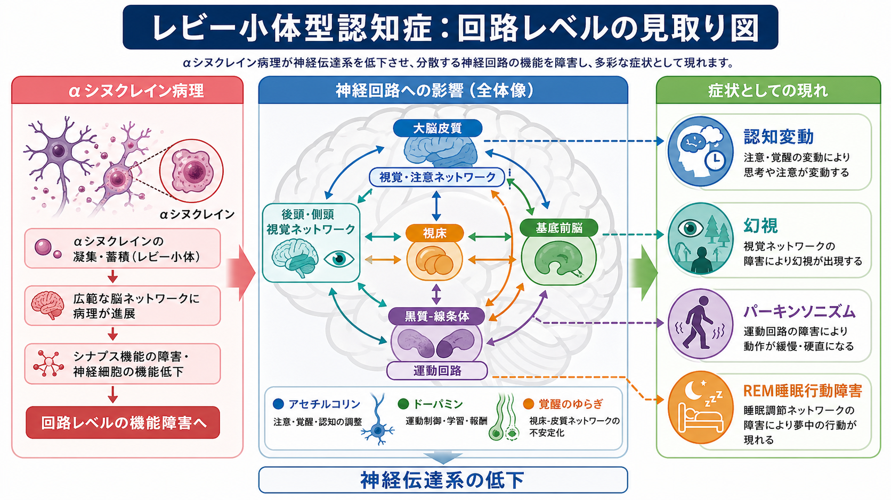
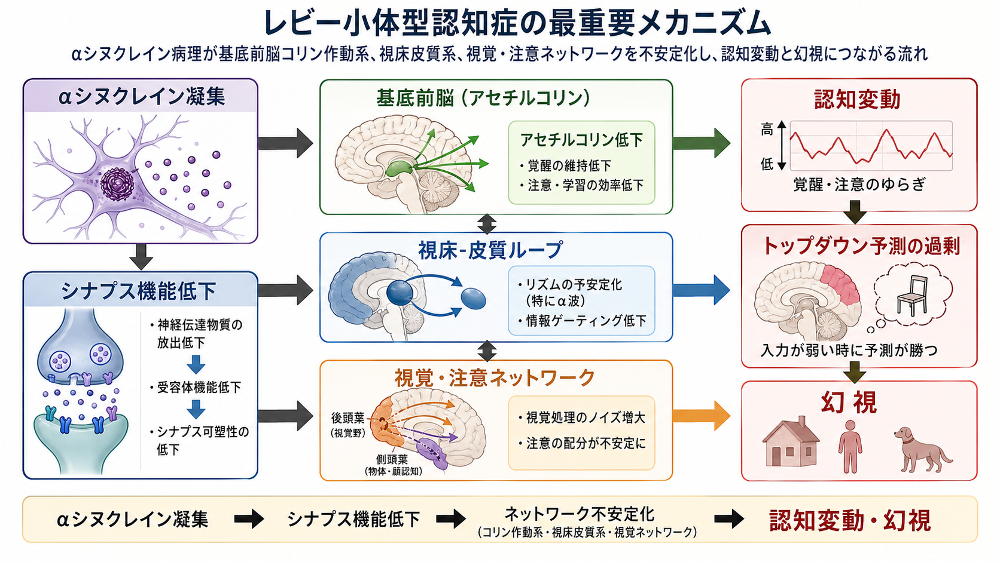
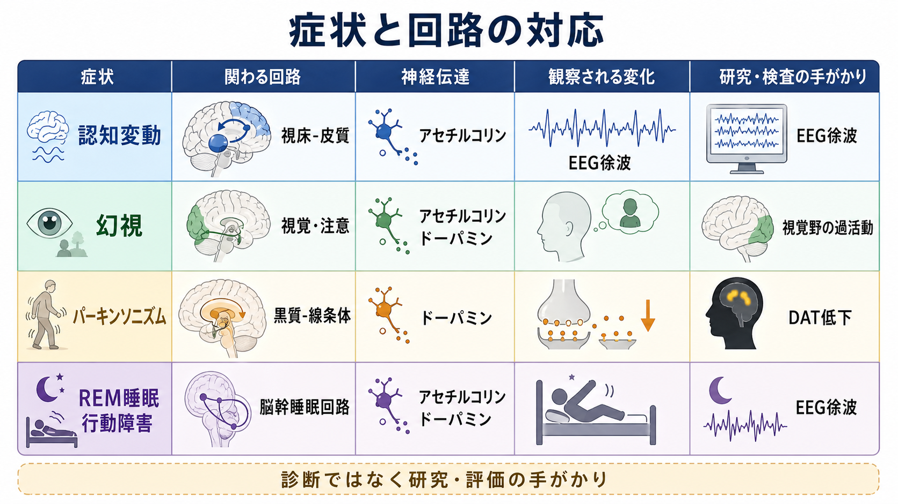

# レビー小体型認知症は神経回路にどのような影響を与えるのか

## 要点

- レビー小体型認知症（dementia with Lewy bodies: DLB）は、αシヌクレインを主成分とするレビー関連病理が、脳幹・辺縁系・大脳皮質に広がることで、[[神経回路とは何か|神経回路]]の入出力と同期を乱す疾患として理解できる。
- 認知変動は、注意・覚醒を支える基底前脳コリン作動系、視床-皮質ループ、脳幹覚醒系の不安定化と関係する。
- 幻視は、単なる「視覚野の異常」ではなく、視覚入力、注意、記憶、予測が結びつく[[視覚ネットワークはどのように階層的に情報処理するのか|視覚ネットワーク]]と前頭・帯状皮質を含むトップダウン制御のずれとして説明しやすい。
- パーキンソニズムは、黒質-線条体ドーパミン系と[[大脳基底核ループとは何か|大脳基底核ループ]]の障害により、運動選択と運動開始が硬くなる現象である。
- 本記事は教育・研究目的の整理であり、個別の診断や治療判断を目的としない。

## この記事で答える問い

DLBでは、認知、視覚体験、運動、睡眠が一見ばらばらに乱れる。しかし回路の観点から見ると、共通して「広域ネットワークを安定に調整する仕組み」が障害されている。この記事では、αシヌクレイン病理がどの回路に影響し、なぜ認知変動・幻視・パーキンソニズムが同じ疾患でまとまって現れるのかを整理する。

## まず結論

DLBの中心にあるのは、局所の神経細胞死だけではなく、[[シナプスとは何か|シナプス]]機能、神経伝達物質、長距離結合、脳波リズムが同時に乱れる「ネットワーク病態」である。αシヌクレイン病理は、基底前脳のアセチルコリン系、黒質-線条体のドーパミン系、視床-皮質ループ、後頭・側頭・頭頂の視覚-注意ネットワークに影響し、それぞれが認知変動、幻視、運動症状、REM睡眠行動障害に結びつく[1][2]。

## 背景

DLBは、アルツハイマー病に次いで重要な神経変性性認知症の一群に含まれ、臨床的には進行性の認知低下に加えて、認知変動、具体的で反復する幻視、パーキンソニズム、REM睡眠行動障害が重視される[1]。ただし、臨床像はアルツハイマー病やパーキンソン病認知症と重なりやすく、病理学的にもアルツハイマー病理を併存することが多い[2]。

この重なりは、DLBを「ひとつの病変がひとつの症状を作る疾患」として見ると理解しにくい。むしろ、複数の調整系が同時に弱くなり、[[脳内ネットワークとは何か|脳内ネットワーク]]が外界入力・内的予測・覚醒状態を安定に統合できなくなる疾患として考えると、症状のまとまりが見えやすい。

## 基本概念

### αシヌクレイン病理

αシヌクレインは本来、シナプス前終末や小胞動態に関わるタンパク質だが、異常に折りたたまれて凝集すると、レビー小体やレビー神経突起として観察される。DLBでは、この病理が脳幹だけでなく辺縁系や新皮質にも広がり、神経細胞の活動、シナプス伝達、軸索結合を乱す[3]。

重要なのは、レビー小体の数だけで症状が単純に決まるわけではない点である。αシヌクレインの可溶性オリゴマー、シナプス機能障害、炎症、ミトコンドリア障害、アルツハイマー病理との相互作用などが、回路の脆弱性を作ると考えられている[2][3]。

### 神経伝達系の障害

DLBでは、アセチルコリンとドーパミンの低下が特に重要である。基底前脳コリン作動系は、覚醒、注意、学習効率、感覚入力のゲイン調整に関わる。病理研究では、DLBに相当するレビー小体型変化で早期から広範なコリン作動系低下がみられ、アルツハイマー病より早く強く現れる可能性が示されている[4]。

一方、黒質から線条体へ向かうドーパミン系の低下は、運動開始、運動選択、習慣化された動作の滑らかさを障害する。これは[[ドパミンは報酬だけの物質なのか|ドパミン]]を報酬だけでなく運動制御の調整信号として見る必要があることを示している。

## 仕組み

### 1. 認知変動：注意と覚醒のゲインが揺らぐ

DLBの認知変動は、単に「記憶力が日によって違う」というより、注意・覚醒・反応性が短時間で大きく変わる現象である。回路的には、基底前脳コリン作動系、[[脳幹網様体は覚醒ネットワークで何をしているのか|脳幹覚醒ネットワーク]]、視床-皮質ループが十分に安定しない状態として理解できる。

視床-皮質ループは、大脳皮質の情報処理をリズムとして整える。ここが不安定になると、外界入力に対する感度、注意の持続、作業記憶の保持が揺らぐ。DLBで[[脳波EEGは何を測っているのか|EEG]]の徐波化や後頭優位リズムの変化が注目されるのは、この広域リズムの不安定性を反映しうるからである[8]。

### 2. 幻視：弱い入力と強い予測がずれる

DLBの幻視は、しばしば人や動物のような具体的な像として現れる。これは、視覚野だけの過活動では説明しきれない。研究では、幻視をもつDLBで、二次視覚野、前部帯状皮質、眼窩前頭皮質、側頭・海馬傍領域など、ボトムアップ視覚処理とトップダウン予測を結ぶ領域の関与が報告されている[5]。

計算論的に言えば、視覚入力が弱くノイズを含むとき、脳は過去経験や文脈にもとづく予測で不足分を補う。DLBではコリン作動系低下や視覚-注意ネットワークの結合低下により、入力を正しく重みづける力が弱まり、内的予測が知覚として立ち上がりやすくなる。EEGと拡散MRIを組み合わせた研究も、幻視をもつレビー小体型認知症で視覚系の機能結合とコリン作動性構造結合の関与を示している[6]。

### 3. パーキンソニズム：運動回路の選択性が低下する

DLBのパーキンソニズムは、筋固縮、寡動、歩行の小刻み化、姿勢反射障害などとして現れる。背景には、黒質-線条体ドーパミン系の低下と、大脳基底核ループの出力バランスの変化がある。ドーパミンが低下すると、運動候補を選び、不要な運動を抑え、必要な運動を開始する調整が難しくなる。

DAT-SPECTやPETによるドーパミントランスポーター評価は、線条体ドーパミン終末の低下を反映する検査としてDLB研究・臨床評価で使われてきた。ただし、検査結果は診断の一部であり、単独で疾患全体を説明するものではない[1][7]。

### 4. REM睡眠行動障害：脳幹の睡眠-運動抑制回路が破綻する

REM睡眠では、通常、夢の内容を実際の運動として実行しないように筋緊張が抑えられる。DLBでは、この抑制に関わる脳幹回路が早期から障害されることがあり、夢に合わせて声を出す、手足を動かすといったREM睡眠行動障害が現れる。DLB診断基準でも、REM睡眠行動障害は重要な中核的特徴として扱われる[1]。

## 図解

| 症状 | 主に関わる回路 | 神経伝達・生理指標 | 回路としての読み方 |
|---|---|---|---|
| 認知変動 | 基底前脳、脳幹覚醒系、視床-皮質ループ | アセチルコリン低下、EEG徐波化 | 注意と覚醒のゲインが安定しない |
| 幻視 | 後頭・側頭視覚系、前頭・帯状皮質、注意ネットワーク | コリン作動系、視覚ネットワーク結合 | 外界入力より内的予測が勝ちやすい |
| パーキンソニズム | 黒質-線条体、大脳基底核ループ | ドーパミン低下、DAT低下 | 運動の選択と開始が硬くなる |
| REM睡眠行動障害 | 脳幹睡眠回路、運動抑制系 | REM睡眠時筋緊張抑制の低下 | 夢の運動出力が抑えきれない |

## 臨床・研究との接続

臨床診断では、認知変動、幻視、パーキンソニズム、REM睡眠行動障害といった中核的特徴に加え、DAT低下、MIBG心筋シンチグラフィ、睡眠ポリグラフで確認されるREM睡眠筋緊張消失などが補助的に用いられる[1]。脳画像では[[FDG-PETは脳代謝をどう可視化するのか|FDG-PET]]、[[SPECTは脳血流をどう評価するのか|SPECT]]、DAT-SPECT、MRI、EEGなどが、異なる水準の回路障害を観察する窓になる。

研究上は、DLBを「αシヌクレイン病理の疾患」とだけ見るのでは不十分である。アルツハイマー病理の併存、コリン作動系低下、ドーパミン系低下、脳波リズムの変化、視覚-注意ネットワークの結合異常が重なり、症状の個人差を作る[2][6][8]。したがって、将来の理解には、病理、神経伝達、構造結合、機能結合、行動症状を結びつけるマルチモーダル研究が必要になる。

## よくある誤解

### 誤解1：DLBはアルツハイマー病にパーキンソン症状が加わっただけである

DLBでは、記憶低下だけでなく、注意、遂行機能、視空間機能、覚醒の変動が早期から目立ちやすい。アルツハイマー病理を併存することは多いが、DLBの症状はαシヌクレイン病理と神経伝達系障害を含む独自のネットワーク病態として考える必要がある[1][2]。

### 誤解2：幻視は精神症状なので神経回路とは別である

DLBの幻視は、視覚入力、注意、記憶、予測、覚醒状態の相互作用から生じる神経回路現象として研究されている。精神症状として観察される体験も、脳内では視覚-注意ネットワーク、前頭・帯状皮質、コリン作動系の変化と結びついている[5][6]。

### 誤解3：DAT低下があればDLBのすべてが説明できる

DAT低下は黒質-線条体ドーパミン系の障害を示す重要な手がかりだが、認知変動や幻視にはコリン作動系、視床-皮質ループ、視覚-注意ネットワークも関わる。DLBを理解するには、単一バイオマーカーではなく、複数回路の組み合わせを見る必要がある[1][7]。

## 関連ノート

- [[神経回路とは何か]]
- [[脳内ネットワークとは何か]]
- [[脳ネットワークの破綻は精神疾患をどう説明するのか]]
- [[シナプスとは何か]]
- [[神経伝達物質はどのように放出されるのか]]
- [[ドパミンは報酬だけの物質なのか]]
- [[視覚ネットワークはどのように階層的に情報処理するのか]]
- [[前頭頭頂ネットワークは認知制御をどう支えるのか]]
- [[大脳基底核ループとは何か]]
- [[脳幹網様体は覚醒ネットワークで何をしているのか]]
- [[脳波EEGは何を測っているのか]]
- [[SPECTは脳血流をどう評価するのか]]

## 理解チェック

1. DLBで認知変動が生じるとき、どのような注意・覚醒系の不安定化が想定されるか。
2. 幻視を、視覚野単独ではなく視覚-注意ネットワークとトップダウン予測の相互作用として説明すると何が見えやすいか。
3. パーキンソニズムとDAT低下は、どの神経回路の障害を反映しているか。
4. DLBを単一の病理や単一の検査所見だけで説明しにくい理由は何か。

## 参考文献

[1] McKeith IG, Boeve BF, Dickson DW, et al. (2017). Diagnosis and management of dementia with Lewy bodies: Fourth consensus report of the DLB Consortium. *Neurology*, 89(1), 88-100. https://doi.org/10.1212/WNL.0000000000004058

[2] Armstrong MJ. (2021). Advances in dementia with Lewy bodies. *Therapeutic Advances in Neurological Disorders*, 14, 17562864211057666. https://doi.org/10.1177/17562864211057666

[3] Simon C, Soga T, Okano HJ, Parhar I. (2021). α-Synuclein-mediated neurodegeneration in Dementia with Lewy bodies: the pathobiology of a paradox. *Cell & Bioscience*, 11, 196. https://doi.org/10.1186/s13578-021-00709-y

[4] Tiraboschi P, Hansen LA, Alford M, et al. (2002). Early and widespread cholinergic losses differentiate dementia with Lewy bodies from Alzheimer disease. *Archives of General Psychiatry*, 59(10), 946-951. https://doi.org/10.1001/archpsyc.59.10.946

[5] Heitz C, Noblet V, Cretin B, et al. (2015). Neural correlates of visual hallucinations in dementia with Lewy bodies. *Alzheimer's Research & Therapy*, 7, 6. https://doi.org/10.1186/s13195-014-0091-0

[6] Mehraram R, Kaiser M, Cromarty R, et al. (2022). Functional and structural brain network correlates of visual hallucinations in Lewy body dementia. *Brain*, 145(6), 2190-2203. https://doi.org/10.1093/brain/awac039

[7] McCleery J, Morgan S, Bradley KM, Noel-Storr AH, Ansorge O, Hyde C. (2015). Dopamine transporter imaging for the diagnosis of dementia with Lewy bodies. *Cochrane Database of Systematic Reviews*, 2015(1), CD010633. https://doi.org/10.1002/14651858.CD010633.pub2

[8] Chatzikonstantinou S, McKenna J, Karantali E, Petridis F, Kazis D, Mavroudis I. (2021). Electroencephalogram in dementia with Lewy bodies: a systematic review. *Aging Clinical and Experimental Research*, 33, 1197-1208. https://doi.org/10.1007/s40520-020-01576-2

## 関連ノート候補・MOC更新候補

- MOC更新候補: [[MOC｜脳・神経科学]], [[MOC｜精神医学]]
- 今後の作成候補: 「レビー小体型認知症とは何か」「αシヌクレイン病理とは何か」「認知変動とは何か」「幻視は脳内予測とどう関係するのか」

## 未解決問題

- αシヌクレインのどの分子種が、どの段階でシナプス機能障害を主導するのか。
- DLBに併存するアルツハイマー病理が、幻視や認知変動をどの程度修飾するのか。
- EEG、DAT、MRI、PET、体液・皮膚バイオマーカーを組み合わせたとき、症状別の回路病態をどこまで個別化できるのか。
