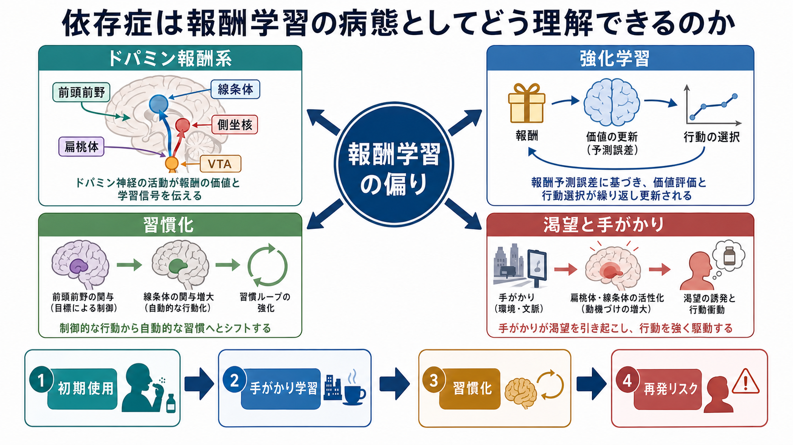
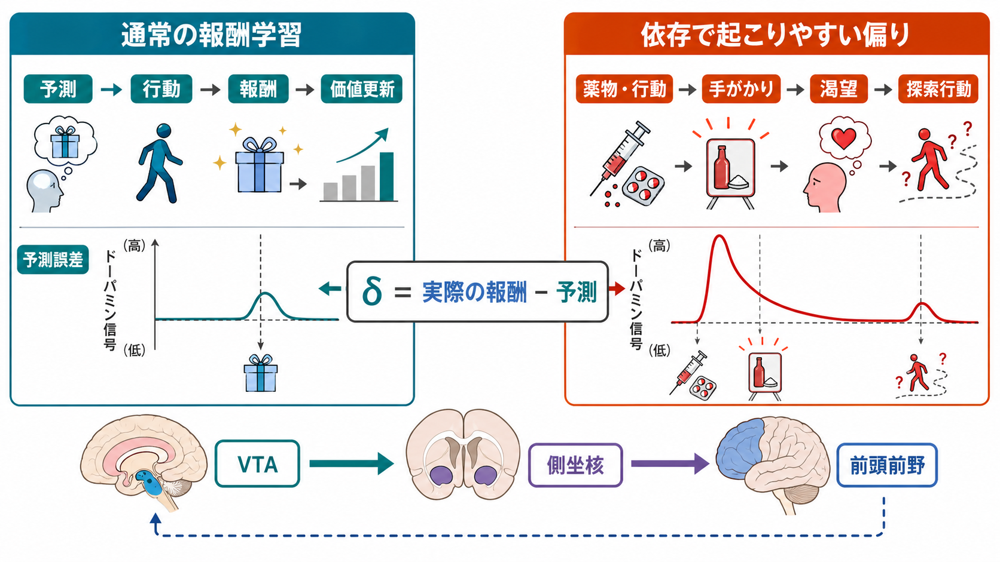
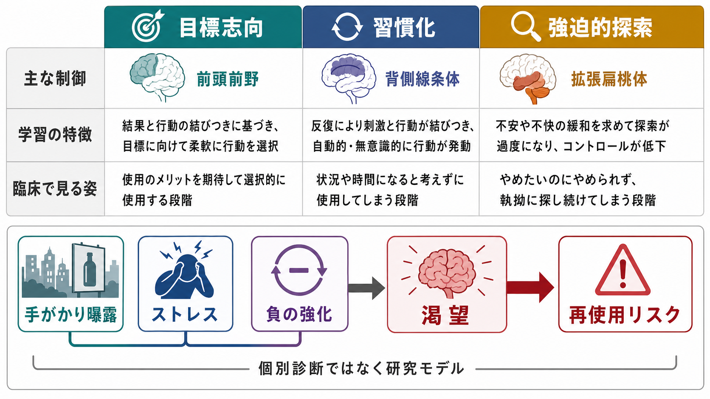

# 依存症は報酬学習の病態としてどう理解できるのか

## 要点

- 依存症は「快楽を求める弱さ」だけではなく、報酬・手がかり・行動・習慣・ストレス反応が長期的に結び直される状態として理解できる。
- ドパミンは快感そのものというより、重要な出来事を学習し、行動を再び起こしやすくする強化信号に深く関わる[1][8]。
- 初期には目標志向的な使用でも、反復により腹側線条体から背側線条体へ制御が移り、手がかりに反応した習慣的・強迫的な探索が強まりうる[2]。
- 渇望は単なる「欲しい気持ち」ではなく、薬物・行動と結びついた環境手がかり、誘因感作、負の情動状態、前頭前野による制御低下が重なって生じる[3][4][5]。
- 本記事は教育・研究目的の神経科学モデルであり、個別の診断や治療指示を行うものではない。

## この記事で答える問い

1. 依存症を「報酬学習の病態」と呼ぶとき、何が学習され、何が偏るのか。
2. ドパミン報酬系と強化学習は、薬物使用や行動依存の持続をどう説明するのか。
3. 習慣化、渇望、再使用リスクはどの神経回路でつながるのか。
4. このモデルを臨床・研究で使うとき、どこに限界があるのか。

## まず結論

依存症を報酬学習の病態として見るとは、「薬物や行動が強い報酬信号を出す」だけでなく、「その前後にある手がかり、気分、場所、人間関係、身体状態が、次の行動を選ばせる信号として過剰に学習される」と見ることである。つまり問題は快感の強さだけではない。報酬を予測する手がかりが目立ち、使う・探す・近づく行動が自動化し、やめたいという目標よりも習慣や渇望が先に行動を動かしやすくなる。

この見方では、[[ドパミンは報酬だけの物質なのか|ドパミン]]は「快楽物質」よりも、報酬予測誤差、動機づけ、注意の向け先、行動の反復に関わる調整信号として重要である[1][8]。また、[[大脳基底核ループとは何か|大脳基底核ループ]]、前頭前野、扁桃体、海馬、拡張扁桃体が、報酬・記憶・情動・ストレスを結びつける。

## 背景

依存症には、物質使用障害だけでなく、行動の制御困難を含む広い臨床・研究問題がある。共通して重要なのは、当人が単に「楽しんでいる」わけではなく、やめたい理由があっても行動が反復され、関連する手がかりで渇望が起こり、長い中断後にも再使用リスクが残る点である。

脳疾患モデルは、依存症を意志の欠如ではなく、報酬、ストレス、自己制御に関わる神経回路の可塑的変化として理解する枠組みを与えた[5]。ただし「脳の病気」と言うだけでは、個人の生活史、社会環境、併存症、アクセス可能な支援を見落としやすい。したがって、報酬学習モデルは、道徳的非難を避けつつ、行動がどのように形成・維持されるかを説明する中間的な道具として使うのがよい。

## 基本概念

### 報酬予測誤差

強化学習では、予測より良い結果が起きると、その行動や手がかりの価値が上がる。予測より悪い結果なら価値が下がる。この差を報酬予測誤差と呼ぶ。

$$
\delta_t = r_t + \gamma V(s_{t+1}) - V(s_t)
$$

ここで $\delta_t$ は予測誤差、$r_t$ は得られた報酬、$V(s_t)$ は現在状態の価値、$\gamma$ は将来価値の重みである。Schultz らの古典的研究は、中脳ドパミンニューロンが報酬そのものだけでなく、予測外の報酬や報酬を予測する手がかりに反応を移すことを示し、報酬予測誤差とドパミンを結びつける基盤になった[1]。

### 強化と誘因感作

強化とは、ある行動の後に報酬や苦痛の軽減が起こることで、その行動が再び選ばれやすくなる過程である。依存症では、薬物や行動が強い強化を生み、関連する手がかりまで価値を帯びる。

誘因感作理論では、反復使用によって「好き」という快感よりも、「欲しい」「近づきたい」という誘因顕著性が過剰に高まると考える[3]。このため、本人が快感をあまり感じていなくても、手がかりを見ると強い渇望や探索行動が起こりうる。

### 習慣化

初期の使用は、結果を期待して選ぶ目標志向的行動として理解しやすい。しかし反復されると、行動は結果の価値よりも刺激と反応の結びつきに支配されやすくなる。Everitt と Robbins は、依存症の進行を、前頭前野や腹側線条体が関わる目標志向的制御から、背側線条体が関わる習慣的・強迫的制御への移行として整理した[2]。

## 仕組み

### 1. 薬物・行動が強い学習信号を作る

多くの依存性薬物は、VTA から側坐核、前頭前野へ向かう中脳辺縁系ドパミン系に作用する。自然報酬でもドパミン信号は生じるが、薬物は通常の生理的範囲を超える信号を引き起こしやすい[6][8]。その結果、「何をしたか」「どこにいたか」「誰といたか」「どんな気分だったか」が強く記憶される。

この段階では、[[報酬系の異常はうつ病をどう説明するのか|報酬系]]で扱われる価値学習と同じ仕組みが関わる。ただし依存症では、価値が薬物・行動とその手がかりへ偏り、他の生活上の報酬が相対的に弱くなりやすい。

### 2. 手がかりが渇望を呼び出す

薬物そのものがなくても、場所、時間帯、匂い、スマートフォン通知、対人ストレスなどが使用経験と結びつくと、それらの手がかりが渇望を誘発する。NIDA は、薬物と結びついた日常環境の手がかりが、長期間の中断後にも強い渇望を引き起こしうると説明している[8]。

ここでは扁桃体と海馬が、情動的価値と文脈記憶を結びつける。[[扁桃体過活動は不安症やPTSDにどう関わるのか|扁桃体]]は恐怖だけでなく、重要な刺激を検出し、身体反応や行動準備を調整する。海馬は「どの文脈で起こったか」を保持し、前頭前野は目標や規則に照らして行動を制御する。

### 3. 習慣が目標を上回る

使用をやめたいという目標があっても、習慣化した行動は速く、自動的に起こる。これは「本人が本当はやめる気がない」という意味ではない。むしろ、行動選択を支える回路が、長期の反復で目標志向から刺激反応型へ偏ったと見ると理解しやすい[2]。

この点は [[前頭前野は情動制御にどう関わるのか|前頭前野]] の制御機能とも関係する。前頭前野は長期目標、社会的結果、自己制御を支えるが、ストレス、睡眠不足、離脱、強い手がかり曝露があると、短期的な行動衝動を抑えにくくなる。

### 4. 負の強化が行動を固定する

依存症の後期では、快感を得るためだけでなく、不快な離脱感、焦燥、不安、空虚感を下げるために使用が起こることがある。Koob と Volkow は、依存症を「過剰摂取・中毒」「離脱・負の感情」「渇望・予期」の循環として整理し、拡張扁桃体やストレス系の関与を重視した[4]。

この負の強化は、行動を非常に固定しやすい。不快感が一時的に下がると、その行動は「問題解決」として学習される。しかし長期的には生活機能を下げ、再び不快感やストレスを増やすため、循環が続きやすい。

## 図解

図1は、依存症を報酬学習の偏りとして見る全体地図である。ドパミン報酬系、強化学習、習慣化、渇望と手がかりが相互に影響し、初期使用から再使用リスクまでの流れを作る。

図2は、通常の報酬学習と依存で起こりやすい偏りを比較している。重要なのは、薬物や行動そのものだけでなく、それを予測する手がかりが価値を持ち、渇望と探索行動を動かす点である。

図3は、目標志向、習慣化、強迫的探索を比較し、臨床・研究で見るべき観点を整理したものである。これは個別診断ではなく、症状理解と研究設計のためのモデルである。

## 臨床・研究との接続

臨床的には、報酬学習モデルは「なぜ本人の意思だけでは制御しにくいのか」を説明する助けになる。手がかりを避ける、代替報酬を増やす、ストレスや睡眠を整える、渇望が高まる文脈を予測する、といった支援は、道徳的説教ではなく学習環境の再設計として理解できる。

研究では、報酬課題、cue-reactivity 課題、fMRI、PET、計算論的強化学習モデル、再発リスクの縦断研究が接続される。ただし、脳画像や計算モデルだけで個人の診断や予後を決めることはできない。依存症は、薬物特性、遺伝的脆弱性、発達歴、外傷体験、精神疾患の併存、社会的孤立、経済的要因が重なる多層的な問題である。

## よくある誤解

### 誤解1: 依存症は快楽が強すぎるだけで起こる

快楽は一部にすぎない。むしろ重要なのは、手がかりが行動を呼び出すこと、習慣化が進むこと、不快感の軽減が行動を強化することである[3][4]。

### 誤解2: ドパミンは快楽物質である

ドパミンは快楽経験と関係するが、それだけではない。報酬予測誤差、動機づけ、行動の反復、注意づけに関わるため、「快楽物質」とだけ呼ぶと依存症の仕組みを狭くしてしまう[1][8]。

### 誤解3: 習慣化したなら本人の責任ではない

神経学的な説明は、責任追及を単純化するためではなく、変えられる条件を見つけるために使う。習慣が強いなら、手がかり、代替行動、環境設計、支援資源、ストレス調整を含めて介入点を増やす必要がある。

### 誤解4: 脳回路が分かれば個人の依存症を診断できる

現時点では、脳画像や単一の報酬課題だけで個人診断を行うことはできない。研究知見は、症状理解、仮説形成、介入研究の設計に使うべきである。

## 関連ノート

### 既存ノート

- [[ドパミンは報酬だけの物質なのか]]
- [[報酬系の異常はうつ病をどう説明するのか]]
- [[大脳基底核ループとは何か]]
- [[前頭前野は情動制御にどう関わるのか]]
- [[扁桃体過活動は不安症やPTSDにどう関わるのか]]
- [[経験依存的可塑性はネットワークをどう変えるのか]]
- [[精神疾患は脳の病気なのか]]

### 関連ノート候補

- 報酬予測誤差とは何か
- 誘因感作理論とは何か
- 渇望はどの神経回路で生じるのか
- 負の強化は依存症をどう維持するのか
- cue-reactivity 課題とは何か

### MOC更新候補

- `content/00_MOC/` 配下の脳・神経科学、精神医学、計算論的精神医学、報酬学習関連 MOC に本記事へのリンクを追加する。
- 並列ジョブとの競合を避けるため、このタスクでは MOC 本体は更新しない。

## 理解チェック

1. 報酬予測誤差は、依存症における手がかり学習をどう説明するか。
2. 「好き」と「欲しい」を分けると、渇望の理解はどう変わるか。
3. 目標志向的行動から習慣的行動への移行は、どのような脳回路の変化として説明されるか。
4. 負の強化は、快感を目的とする使用とどこが違うか。
5. 脳画像や計算モデルを個人診断にそのまま使えない理由は何か。

## 参考文献

[1] Schultz, W., Dayan, P., & Montague, P. R. (1997). A neural substrate of prediction and reward. *Science, 275*(5306), 1593-1599. https://doi.org/10.1126/science.275.5306.1593

[2] Everitt, B. J., & Robbins, T. W. (2005). Neural systems of reinforcement for drug addiction: From actions to habits to compulsion. *Nature Neuroscience, 8*, 1481-1489. https://doi.org/10.1038/nn1579

[3] Robinson, T. E., & Berridge, K. C. (2008). The incentive sensitization theory of addiction: Some current issues. *Philosophical Transactions of the Royal Society B, 363*(1507), 3137-3146. https://doi.org/10.1098/rstb.2008.0093

[4] Koob, G. F., & Volkow, N. D. (2010). Neurocircuitry of addiction. *Neuropsychopharmacology, 35*, 217-238. https://doi.org/10.1038/npp.2009.110

[5] Volkow, N. D., Koob, G. F., & McLellan, A. T. (2016). Neurobiologic advances from the brain disease model of addiction. *New England Journal of Medicine, 374*(4), 363-371. https://doi.org/10.1056/NEJMra1511480

[6] Kauer, J. A., & Malenka, R. C. (2007). Synaptic plasticity and addiction. *Nature Reviews Neuroscience, 8*, 844-858. https://doi.org/10.1038/nrn2234

[7] Lüscher, C., & Malenka, R. C. (2011). Drug-evoked synaptic plasticity in addiction: From molecular changes to circuit remodeling. *Neuron, 69*(4), 650-663. https://doi.org/10.1016/j.neuron.2011.01.017

[8] National Institute on Drug Abuse. (n.d.). *Drugs, Brains, and Behavior: The Science of Addiction: Drugs and the Brain*. https://nida.nih.gov/publications/drugs-brains-behavior-science-addiction/drugs-brain

## 未解決問題

- 報酬予測誤差、誘因感作、習慣化、負の強化を、個人ごとの再使用リスク予測へどこまで統合できるか。
- 物質依存と行動依存で、共通する学習機構と異なる機構をどこまで分けられるか。
- 手がかり反応性や渇望を、日常生活の環境・スマートフォン使用・社会的ストレスと結びつけて測定する方法をどう改善できるか。
- 脳回路モデルを、個人の責任追及ではなく支援設計に使う倫理的枠組みをどう整えるか。

## 更新ログ

- 2026-04-27: 初稿作成。報酬予測誤差、誘因感作、習慣化、負の強化、渇望の神経機構を整理し、画像3枚と主要参考文献を追加。
