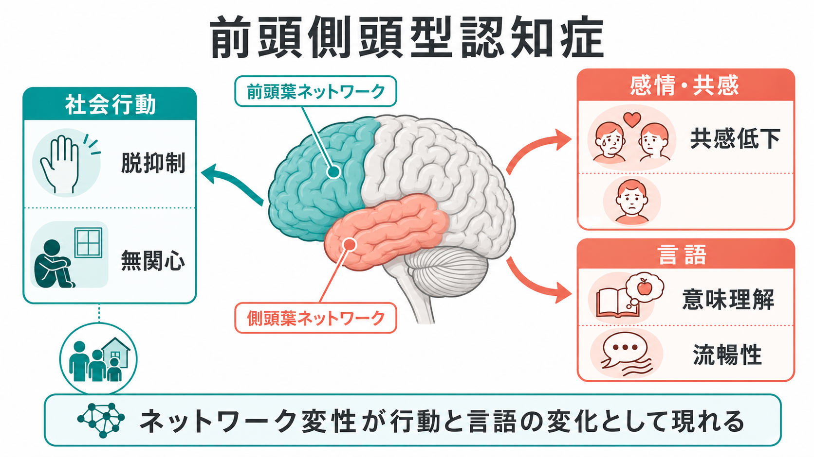
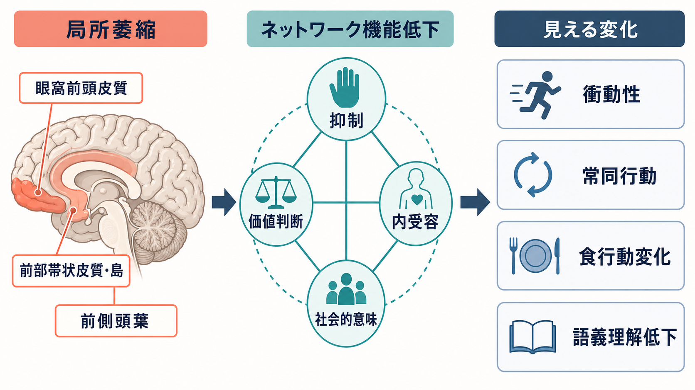
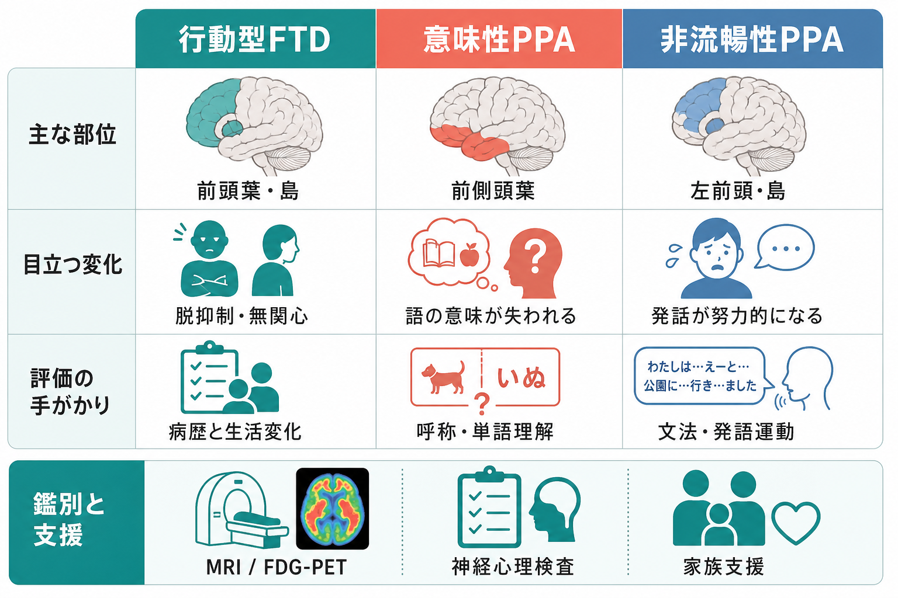

# 前頭側頭型認知症はなぜ人格や行動を変えるのか

## 要点

- 前頭側頭型認知症（frontotemporal dementia: FTD）は、単一の病気というより、前頭葉・側頭葉を中心とする神経変性症候群の総称である。
- 行動型FTDでは、眼窩前頭皮質、前部帯状皮質、前部島皮質、前側頭葉などを含む社会行動ネットワークが障害され、脱抑制、無関心、共感低下、常同行動、食行動変化が目立つ [1][2]。
- 一次進行性失語（primary progressive aphasia: PPA）では、左前頭葉・島皮質・側頭葉ネットワークの変性が、語の意味理解、文法、発語運動、語想起の障害として現れる [3]。
- 「性格が悪くなった」と理解すると本人や家族を責めやすい。より正確には、社会的意味、価値判断、抑制、内受容、言語を支える[[脳内ネットワークとは何か|脳内ネットワーク]]が変性していると捉える。

## この記事で答える問い

この記事では、前頭側頭型認知症がなぜ「人格の変化」「社会的に不適切な行動」「共感の低下」「言語の変化」として見えやすいのかを説明する。教育・研究目的の概説であり、個別の診断や治療方針を指示するものではない。

## まず結論

前頭側頭型認知症で人格や行動が変わるのは、記憶だけが壊れるからではない。むしろ初期には、社会的状況を読む、衝動を抑える、報酬や罰の意味を更新する、身体内部の変化を感情として読む、単語や対象の意味を保つ、といった機能を担う前頭葉・側頭葉ネットワークが選択的に障害される。

このため、本人の「意志」や「道徳性」だけでは説明できない行動変化が起こる。FTDは神経変性疾患だが、その表面には精神症状、対人関係の変化、家族内の葛藤、仕事上の失敗として現れやすい [5][6]。

## 背景

FTDは、アルツハイマー病のように初期からエピソード記憶障害が前景に立つとは限らない。多くの場合、前頭葉・側頭葉の萎縮に対応して、行動、情動、社会認知、言語の変化が先に目立つ [1][6]。

臨床的には、大きく次のような型で整理される。

| 型 | 初期に目立つ変化 | 関連しやすいネットワーク |
|---|---|---|
| 行動型FTD | 脱抑制、無関心、共感低下、常同行動、食行動変化 | 眼窩前頭皮質、前部帯状皮質、前部島皮質、前側頭葉 |
| 意味性PPA | 単語の意味理解、呼称、対象知識の低下 | 前側頭葉、意味記憶ネットワーク |
| 非流暢・失文法型PPA | 努力性発話、文法障害、発語運動の障害 | 左下前頭回、島皮質、発話運動ネットワーク |

この分類は、症状の見え方を整理するための臨床的枠組みである。実際には、病期が進むと行動症状と言語症状が重なり、運動ニューロン疾患、皮質基底核症候群、進行性核上性麻痺と連続する場合もある [1][5][6]。

## 基本概念

### 前頭葉は「社会的ブレーキ」だけではない

前頭葉は単なる理性の座ではない。行動の抑制、状況に応じた価値判断、計画、エラー修正、報酬予測、社会規範の読み取りに関わる。眼窩前頭皮質や腹内側前頭前野が障害されると、以前なら控えていた発言や行動が出やすくなり、前部帯状皮質や前部島皮質が障害されると、意欲、内受容、感情の切り替えが変化しやすい [2][7]。

### 側頭葉は「記憶」だけでなく意味と情動を支える

側頭葉、とくに前側頭葉は、単語、人物、物体、社会的概念を意味として結びつける領域である。ここが変性すると、「言葉が出ない」だけでなく、「その言葉や対象が何を意味するか」が薄れていく。意味性PPAでは、呼称障害や単語理解の低下がこのネットワーク変性として現れる [3]。

### 神経変性はネットワーク単位で広がる

神経変性疾患は、脳全体を均一に壊すのではなく、特定の大規模ネットワークを選択的に巻き込みやすい。Seeleyらは、複数の神経変性症候群が、それぞれ健康な脳に存在する固有結合ネットワークに対応した萎縮パターンを示すことを報告した [4]。FTDを理解するには、孤立した「部位」だけでなく、[[脳ネットワークの破綻は精神疾患をどう説明するのか|脳ネットワークの破綻]]として見る視点が役立つ。

## 仕組み

### 1. 脱抑制は「わざと」ではなく抑制ネットワークの低下として起こる

行動型FTDでは、社会的に不適切な発言、衝動買い、危険判断の低下、性的・食行動の変化が見られることがある。これは、本人が単に規範を軽視しているというより、眼窩前頭皮質を中心とした抑制・価値更新の機能が低下し、行動の前に「今ここでしてよいか」を評価する処理が弱くなるためである [2][6]。

### 2. 無関心は抑うつと似て見えるが、機序は同じとは限らない

FTDの無関心は、悲しみや罪責感を伴う抑うつとは異なることがある。前部帯状皮質、前部島皮質、線条体を含む[[サリエンスネットワークとは何か|サリエンスネットワーク]]が障害されると、重要な刺激へ注意を向け、行動を開始する力が弱くなる。家族からは「冷たくなった」「何もしなくなった」と見えるが、主観的苦痛の訴えが乏しい場合もある [5][7]。

### 3. 共感低下は社会認知ネットワークの障害として現れる

共感には、相手の表情を読む、相手の心的状態を推測する、自分の身体反応や感情を利用して相手の状態を理解する、という複数の処理がある。行動型FTDでは、前部島皮質や前部帯状皮質を含むサリエンスネットワークの萎縮が、情動的共感の低下と結びつくことが示されている [7]。

### 4. 常同行動と食行動変化は価値・習慣システムの偏りとして理解できる

同じ言動の反復、こだわり、甘いものへの嗜好、過食は、家族にとって負担が大きい症状である。これらは、前頭葉による柔軟な行動制御が弱まり、報酬や習慣に関わる回路の影響が相対的に強くなることで生じると考えられる [1][2]。

### 5. 言語症状は「認知症だから話せない」ではなく、言語ネットワークのどこが壊れるかで異なる

PPAでは、言語ネットワークの障害部位に応じて症状が分かれる。意味性PPAでは前側頭葉の変性により単語や対象の意味が失われやすい。非流暢・失文法型PPAでは、左下前頭回・島皮質周辺の障害により、文法処理や発話運動が努力的になる。ロゴペニック型PPAはFTD病理ではなくアルツハイマー病理と関連することも多く、鑑別が重要である [3]。

## 図解

3枚の図は、FTDを「人格の問題」ではなく「前頭葉・側頭葉ネットワークの変性」として理解するための補助図である。

| 図 | 役割 | 読み方 |
|---|---|---|
| 図1 | 全体概念地図 | 前頭葉・側頭葉ネットワークが社会行動、感情・共感、言語に分かれて表面化する |
| 図2 | 中核メカニズム | 局所萎縮がネットワーク機能低下を介して、衝動性、常同行動、食行動変化、語義理解低下として見える |
| 図3 | 臨床型の比較 | 行動型FTD、意味性PPA、非流暢性PPAでは、目立つ症状と評価の手がかりが異なる |

## 臨床・研究との接続

### 鑑別では「いつから、何が、生活でどう変わったか」が重要

FTDは、うつ病、双極性障害、統合失調症、パーソナリティ障害、依存症、発達特性、アルツハイマー病などと誤認されることがある [1][6]。鑑別では、本人の主観的訴えだけでなく、家族や職場から見た生活変化、金銭管理、食行動、対人トラブル、言語の変化、病識の低下を時系列で確認する必要がある。

### 画像検査は部位とネットワークを推定する手がかりになる

MRIでは前頭葉・側頭葉の萎縮、[[FDG-PETは脳代謝をどう可視化するのか|FDG-PET]]では前頭側頭領域の代謝低下が参考になる。[[PETは脳の何を測るのか|PET]]や髄液・血液バイオマーカー、遺伝学的検査は、アルツハイマー病理やFTD関連病理との鑑別に役立つ可能性があるが、臨床的文脈と合わせて解釈する必要がある [5]。

### 支援では本人だけでなく家族の理解を支える

FTDの行動症状は、周囲から「わざと」「反省がない」と受け取られやすい。支援では、神経変性による行動変化であることを共有し、環境調整、金銭・運転・食行動の安全管理、家族の負担軽減、言語症状へのコミュニケーション支援を組み合わせる。現時点で進行を止める確立した治療は限られるため、診断名だけでなく、日常生活上の具体的な困りごとに焦点を当てることが重要である [5][6]。

## よくある誤解

### 誤解1: 「記憶が保たれているなら認知症ではない」

FTDでは、初期に記憶や見当識が比較的保たれ、行動・言語の変化が先行することがある。記憶検査だけで否定するのではなく、社会行動、言語、遂行機能、生活変化を含めて評価する必要がある [2][3]。

### 誤解2: 「人格が変わったのは本人の性格の問題である」

人格のように見える変化の背後には、抑制、価値判断、共感、意味記憶を支える神経回路の変性がある。もちろん本人の生活歴や関係性も症状の出方に影響するが、FTDを道徳的失敗として説明すると、家族支援や安全管理を遅らせやすい。

### 誤解3: 「PPAは単なる物忘れの一種である」

PPAは、言語ネットワークが進行性に障害される症候群である。意味性PPAでは語の意味、非流暢・失文法型PPAでは文法や発話運動、ロゴペニック型PPAでは語想起や音韻性作業記憶が問題になりやすい [3]。

### 誤解4: 「画像で異常が薄ければFTDではない」

早期には画像所見が目立ちにくい場合もある。逆に、萎縮や代謝低下があっても、それだけで症状の原因を断定できるわけではない。診断は、病歴、神経心理検査、画像、必要に応じたバイオマーカーや遺伝学的情報を統合して行う [5]。

## 関連ノート

- [[脳内ネットワークとは何か]]
- [[サリエンスネットワークとは何か]]
- [[脳ネットワークの破綻は精神疾患をどう説明するのか]]
- [[FDG-PETは脳代謝をどう可視化するのか]]
- [[PETは脳の何を測るのか]]

MOC更新候補: `content/00_MOC/` 配下の神経科学、神経変性、認知症、精神疾患関連MOC。並列ジョブとの衝突を避けるため、本記事作成時点ではMOC本体は更新していない。

今後の作成候補: 「行動型前頭側頭型認知症とは何か」「一次進行性失語とは何か」「意味性認知症とは何か」「FTDとALSはどう関係するのか」「認知症と精神症状はどう関係するのか」。

## 理解チェック

1. FTDで初期から記憶障害より行動変化が目立つことがあるのはなぜか。
2. 脱抑制、無関心、共感低下は、それぞれどのような前頭葉・島皮質・帯状皮質ネットワーク機能と関係するか。
3. 意味性PPAと非流暢・失文法型PPAでは、言語症状の焦点はどう違うか。
4. FTDを「人格の問題」とだけ理解すると、臨床・家族支援でどのような不利益が起こりうるか。

## 参考文献

[1] Bang J, Spina S, Miller BL. Frontotemporal dementia. *Lancet*. 2015;386(10004):1672-1682. https://doi.org/10.1016/S0140-6736(15)00461-4

[2] Rascovsky K, Hodges JR, Knopman D, et al. Sensitivity of revised diagnostic criteria for the behavioural variant of frontotemporal dementia. *Brain*. 2011;134(9):2456-2477. https://doi.org/10.1093/brain/awr179

[3] Gorno-Tempini ML, Hillis AE, Weintraub S, et al. Classification of primary progressive aphasia and its variants. *Neurology*. 2011;76(11):1006-1014. https://doi.org/10.1212/WNL.0b013e31821103e6

[4] Seeley WW, Crawford RK, Zhou J, Miller BL, Greicius MD. Neurodegenerative diseases target large-scale human brain networks. *Neuron*. 2009;62(1):42-52. https://doi.org/10.1016/j.neuron.2009.03.024

[5] Boeve BF, Boxer AL, Kumfor F, Pijnenburg Y, Rohrer JD. Advances and controversies in frontotemporal dementia: diagnosis, biomarkers, and therapeutic considerations. *Lancet Neurology*. 2022;21(3):258-272. https://doi.org/10.1016/S1474-4422(21)00341-0

[6] National Institute of Neurological Disorders and Stroke. Frontotemporal Dementia and Other Frontotemporal Disorders. https://www.ninds.nih.gov/health-information/disorders/frontotemporal-dementia-and-other-frontotemporal-disorders

[7] Nana AL, Sidhu M, Gaus SE, et al. Salience network atrophy links neuron type-specific pathobiology to loss of empathy in frontotemporal dementia. *Brain*. 2020;143(6):1706-1720. https://doi.org/10.1093/brain/awaa119

## 未解決問題

- FTDの臨床型と、tau、TDP-43、FUSなどの病理型を生前にどこまで精密に対応づけられるか。
- 行動症状、社会認知障害、言語症状を、神経心理検査と日常生活データでどう早期検出するか。
- 家族負担を下げる環境調整や心理教育を、疾患進行と生活段階に合わせてどう最適化するか。
- 疾患修飾療法が登場した場合、どのバイオマーカーを治療適応と効果判定に用いるか。
