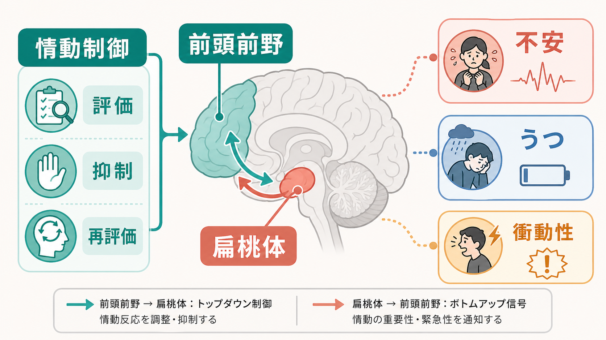
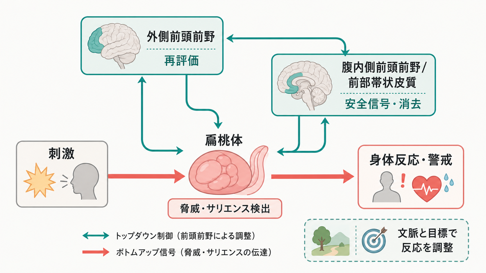
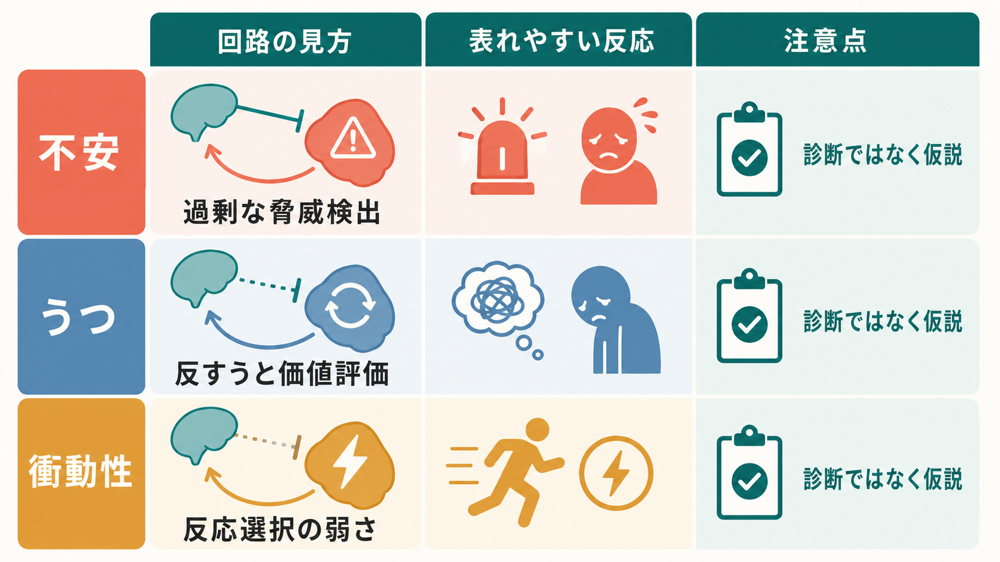

# 前頭前野は情動制御にどう関わるのか

## 要点

- 前頭前野は「情動を消す場所」ではなく、目標・文脈・価値・記憶を使って、扁桃体を含む情動回路の反応を調整する制御系である。
- 扁桃体は恐怖だけでなく、脅威、サリエンス、情動学習、注意、記憶の増幅に関わる。前頭前野との相互作用が、状況に合った反応と過剰反応の境界を作る[1]。
- 外側前頭前野は再評価や注意の向け直し、腹内側前頭前野と前部帯状皮質は安全信号、消去学習、価値評価に関わる[2][3][4]。
- 不安、うつ、衝動性は、単一の「前頭前野低下」ではなく、前頭前野-扁桃体回路のどの機能が、どの状況で、どの時間スケールで偏るかとして読むと整理しやすい[5][6][7]。
- これらの知見は教育・研究目的の神経回路仮説であり、個別の診断や治療方針を単独で決めるものではない。

## この記事で答える問い

1. 前頭前野は、情動反応をどのように調整しているのか。
2. 扁桃体との相互作用は、不安・うつ・衝動性の理解にどう役立つのか。
3. 「前頭前野が弱いから情動制御ができない」という説明は、どこまで正しいのか。
4. fMRI や機能的結合研究の知見を、臨床・研究でどう慎重に読むべきか。

## まず結論

前頭前野は、情動反応に対する「上からのブレーキ」だけではない。より正確には、前頭前野は、現在の目標、社会的文脈、過去の学習、行動の価値を統合し、扁桃体・海馬・線条体・視床下部・脳幹などの反応が状況に合うように調整する。

たとえば、暗い道で物音がしたとき、扁桃体は脅威の可能性を素早く拾い、身体反応や注意を高める。一方で、前頭前野は「ここはよく通る道か」「音は車か」「今逃げるべきか、確認すべきか」といった文脈評価を行う。危険でなければ反応を弱め、危険なら行動を準備する。この調整が柔軟に働くほど、情動は単なる反射ではなく、状況に合った行動選択になる。

したがって、不安は「脅威検出が強すぎる」だけでなく、脅威信号を安全文脈で弱める働きの不足としても理解できる。うつは、ネガティブな自己関連情報や反すうが価値評価・再評価回路に残りやすい状態として読める。衝動性は、情動喚起後の反応選択、報酬評価、結果予測の調整が間に合わない状態として整理できる。

## 背景

情動制御とは、感情を抑え込む能力ではない。情動反応の強さ、持続時間、注意の向き、解釈、行動への変換を、目標や文脈に合わせて変える働きである。心理学では再評価、注意配分、反応抑制、受容、問題解決などとして扱われるが、神経科学では前頭前野、扁桃体、前部帯状皮質、島皮質、海馬、線条体、自律神経系の連携として研究されてきた[2][3]。

扁桃体は、恐怖の中枢として単純化されやすい。しかし実際には、脅威学習、情動記憶、注意の増幅、社会的情報、情動反応の調整などに広く関わる[1]。また、前頭前野は単一の制御装置ではない。外側前頭前野、腹内側前頭前野、眼窩前頭皮質、前部帯状皮質は、それぞれ異なる計算を担う。

このため、前頭前野と扁桃体の関係は「前頭前野が扁桃体を抑える」という一方向の図だけでは不十分である。扁桃体から前頭前野へは、脅威やサリエンスに関するボトムアップ信号が上がる。前頭前野から扁桃体へは、文脈、目標、価値、安全信号に基づく調整が返る。情動制御は、この往復の安定性と柔軟性に支えられる。

## 基本概念

### 前頭前野

前頭前野は、行動を直接動かすだけでなく、現在の目標、ルール、予測、価値、社会的文脈を使って処理を方向づける領域群である。[[前頭頭頂ネットワークは認知制御をどう支えるのか]]で扱うような認知制御は、情動制御にも深く関わる。

外側前頭前野は、認知的再評価、注意の向け直し、言語化、ワーキングメモリを通じて情動反応を変える。たとえば「これは失敗ではなく練習の一部だ」と解釈を変えるとき、外側前頭前野は解釈の候補を保持し、情動刺激の意味づけを変える[2]。

腹内側前頭前野と前部帯状皮質は、価値評価、安全信号、自己関連処理、消去学習に関わる。恐怖条件づけの消去研究では、恐怖反応が消えるのではなく「その文脈では危険ではない」という新しい学習が形成され、前頭前野-扁桃体回路が重要な役割を果たす[4]。

### 扁桃体

扁桃体は、脅威や報酬を含む生物学的に重要な刺激を検出し、注意、記憶、自律神経反応を調整する。恐怖条件づけで中心的な役割を持つが、それだけに限定されない[1]。[[サリエンスネットワークとは何か]]と同様に、重要なのは「何が今、行動を変えるほど重要か」を検出する点である。

### 情動制御

情動制御は、感情の発生後に抑える働きだけではない。刺激をどう見るか、どの記憶を呼び出すか、どの意味づけを採用するか、身体反応をどう扱うか、行動に移すかどうかまでを含む。[[GABAは脳で何をしているのか]]や[[セロトニンは気分だけに関わるのか]]で扱う神経伝達物質も、この回路の興奮性、抑制性、柔軟性に影響する。

## 仕組み

### 1. 脅威・サリエンスを拾う

刺激が入ると、扁桃体は脅威や情動的サリエンスの可能性を評価し、注意や身体反応を高める。これは危険を素早く察知するうえで有用だが、誤検出が多いと不安や過警戒につながる。扁桃体活動は、視覚処理、記憶、身体反応と連動するため、単なる主観的な怖さではなく、行動準備を含む信号として見る必要がある[1]。

### 2. 文脈と目標で意味づけを変える

外側前頭前野は、刺激の解釈を変える再評価に関わる。再評価とは、情動刺激を別の意味づけで捉え直すことである。たとえば、怒った表情を「自分への敵意」ではなく「相手が疲れている可能性」と解釈すると、扁桃体反応や主観的苦痛は変わりうる[2]。

この過程は、[[神経可塑性は発達と学習をどう支えるのか]]で扱うような学習の積み重ねにも依存する。再評価は一回の命令ではなく、状況を読み替える習慣、注意の向け方、言語化の練習によって変わる。

### 3. 安全信号と消去学習を形成する

恐怖反応は、単に忘れられるのではない。消去学習では、以前は危険と結びついていた刺激に対して、「今の文脈では安全である」という新しい学習が重なる。腹内側前頭前野と前部帯状皮質は、この安全信号を扁桃体反応に反映させる回路として重要である[4]。

この視点は、不安障害の理解に役立つ。不安では、脅威検出そのものだけでなく、安全な文脈で反応を弱める機能や、消去学習の保持が問題になることがある。Etkin と Wager のメタ解析は、PTSD、社会不安症、特定恐怖症などで扁桃体や島皮質を含む情動処理領域の関与を示しており、不安を脅威処理ネットワークの偏りとして読む土台を与える[5]。

### 4. 反応を選ぶ

情動が強いと、行動は短絡しやすい。衝動性では、扁桃体、視床下部、中脳水道周囲灰白質などの急性脅威反応が行動へ移りやすく、腹内側前頭前野、背内側前頭領域、前部島皮質などによる反応選択や価値評価が十分に働かない可能性がある[7]。

ここで重要なのは、衝動性を「感情が強いから」だけで説明しないことである。感情が強くても、結果予測、報酬と損失の評価、社会的文脈の読み取り、行動抑制が働けば、反応は変えられる。衝動性は、情動喚起と行動選択の間に入る調整過程の問題として捉えるとよい。

## 図解

図1は、前頭前野と扁桃体の相互作用を、不安・うつ・衝動性へ接続した概念地図である。緑の矢印は前頭前野から扁桃体へのトップダウン調整、赤い矢印は扁桃体から前頭前野へのボトムアップ信号を示す。

図2は、外側前頭前野による再評価と、腹内側前頭前野・前部帯状皮質による安全信号・消去学習を分けて示している。情動制御は一つの「抑制」ではなく、再評価、文脈評価、安全学習、身体反応の調整が組み合わさる。

図3は、不安・うつ・衝動性を比較した整理である。不安では過剰な脅威検出とうまく弱まらない警戒、うつでは反すうや価値評価の固定化、衝動性では反応選択の弱さが中心になる。ただし、これは診断ではなく研究仮説としての見取り図である。

## 臨床・研究との接続

### 不安

不安では、脅威を拾う回路が過敏であることに加え、安全な状況でも反応が下がりにくいことが問題になる。PTSD、社会不安症、特定恐怖症を対象にしたメタ解析では、情動刺激に対する扁桃体・島皮質などの活動が、不安症状の神経基盤を考えるうえで重要であることが示されている[5]。

ただし、不安を「扁桃体が強い」とだけ読むのは不十分である。安全信号を学習し、保持し、別の文脈へ般化する過程には前頭前野と海馬も関わる。したがって、不安の研究では、扁桃体反応、前頭前野の調整、文脈記憶、自律神経反応を合わせて見る必要がある。

### うつ

うつでは、ネガティブな自己関連情報、反すう、報酬価値の低下、再評価困難が問題になりやすい。Johnstone らの fMRI 研究では、負の感情を再評価して弱める課題において、非うつ群では左腹外側前頭前野と扁桃体の逆相関が腹内側前頭前野に媒介される一方、うつ群では異なる前頭前野動員が示された[6]。

これは、うつを「前頭前野の活動低下」と単純化するより、努力して制御しようとしても回路全体として効率よく扁桃体反応を調整できない可能性として読む方がよい。[[ノルアドレナリンは覚醒とストレスにどう関わるのか]]で扱う覚醒・ストレス系も、こうした再評価や反すうの持続に影響する。

### 衝動性

衝動性では、情動喚起が行動へ移るまでの時間が短く、結果予測や価値評価が間に合わないことがある。Blair のレビューは、衝動的攻撃において、扁桃体から視床下部・中脳水道周囲灰白質へ向かう急性脅威反応と、腹内側前頭前野などによる反応選択・意思決定の相互作用を重視している[7]。

この視点では、衝動性は単なる「意志の弱さ」ではない。強い情動反応、報酬と罰の評価、社会的文脈の読み取り、実行制御が短い時間窓で組み合わさる問題である。

### 研究での測り方

前頭前野-扁桃体回路は、[[fMRIは神経活動を直接測っているのか]]、[[シードベース解析とは何か]]、[[有効結合とは何か]]などの方法で調べられる。ただし、機能的結合は因果をそのまま示さない。課題、安静時、解析パイプライン、年齢、薬剤、睡眠、併存症によって結果は変わる。研究知見は、個別診断ではなく仮説生成と群レベルの理解に使うのが妥当である。

## よくある誤解

### 誤解1: 前頭前野は扁桃体を抑え込むだけである

前頭前野は抑制に関わるが、それだけではない。再評価、注意配分、安全信号、価値更新、反応選択を通じて、扁桃体を含む情動回路を状況に合わせる。

### 誤解2: 扁桃体は恐怖だけの中枢である

扁桃体は恐怖条件づけで重要だが、情動記憶、注意、社会的情報、サリエンス検出にも関わる[1]。恐怖だけに限定すると、うつや衝動性との接続が見えにくくなる。

### 誤解3: 前頭前野の活動が強ければ良い

活動が強いことは、効率的な制御を意味するとは限らない。課題が難しい、努力が大きい、補償的に動員している、あるいは制御がうまくいっていない可能性もある。活動量だけで「良い」「悪い」を判断しない。

### 誤解4: 回路研究から個人の診断ができる

現時点では、前頭前野-扁桃体回路の指標だけで個人の不安、うつ、衝動性を診断することはできない。臨床では症状、生活史、身体疾患、薬剤、発達、環境を合わせて評価する必要がある。

## 関連ノート

- [[前頭頭頂ネットワークは認知制御をどう支えるのか]]
- [[サリエンスネットワークとは何か]]
- [[神経可塑性は発達と学習をどう支えるのか]]
- [[GABAは脳で何をしているのか]]
- [[セロトニンは気分だけに関わるのか]]
- [[ノルアドレナリンは覚醒とストレスにどう関わるのか]]
- [[fMRIは神経活動を直接測っているのか]]
- [[シードベース解析とは何か]]
- [[有効結合とは何か]]

### 関連ノート候補

- 扁桃体とは何か
- 情動制御とは何か
- 恐怖条件づけと消去学習とは何か
- 認知的再評価とは何か
- 腹内側前頭前野とは何か
- 眼窩前頭皮質とは何か
- 前部帯状皮質とは何か
- 反すうとは何か
- 衝動性とは何か

### MOC更新候補

- 並列実行時の競合を避けるため、本ジョブでは MOC ファイルを直接更新しない。
- 統合ジョブで `content/00_MOC/` 配下の脳・神経科学、精神疾患、情動制御、脳ネットワーク関連の MOC に本記事を追加するとよい。

## 理解チェック

1. 前頭前野-扁桃体回路を「ブレーキ」とだけ呼ぶと、どの機能が見落とされるか。
2. 不安において、脅威検出と安全信号の保持はどのように違う問題か。
3. うつにおける再評価困難を、前頭前野の単純な活動低下として読みにくい理由は何か。
4. 衝動性を、情動の強さだけでなく反応選択の問題として説明できるか。
5. fMRI の前頭前野-扁桃体結合を、個人診断の根拠として単独使用してはいけない理由は何か。

## 参考文献

[1] Phelps, E. A., & LeDoux, J. E. (2005). Contributions of the amygdala to emotion processing: From animal models to human behavior. *Neuron*, 48(2), 175-187. https://doi.org/10.1016/j.neuron.2005.09.025

[2] Ochsner, K. N., & Gross, J. J. (2005). The cognitive control of emotion. *Trends in Cognitive Sciences*, 9(5), 242-249. https://doi.org/10.1016/j.tics.2005.03.010

[3] Phillips, M. L., Ladouceur, C. D., & Drevets, W. C. (2008). A neural model of voluntary and automatic emotion regulation: Implications for understanding the pathophysiology and neurodevelopment of bipolar disorder. *Molecular Psychiatry*, 13, 833-857. https://doi.org/10.1038/mp.2008.65

[4] Milad, M. R., & Quirk, G. J. (2012). Fear extinction as a model for translational neuroscience: Ten years of progress. *Annual Review of Psychology*, 63, 129-151. https://doi.org/10.1146/annurev.psych.121208.131631

[5] Etkin, A., & Wager, T. D. (2007). Functional neuroimaging of anxiety: A meta-analysis of emotional processing in PTSD, social anxiety disorder, and specific phobia. *American Journal of Psychiatry*, 164(10), 1476-1488. https://doi.org/10.1176/appi.ajp.2007.07030504

[6] Johnstone, T., van Reekum, C. M., Urry, H. L., Kalin, N. H., & Davidson, R. J. (2007). Failure to regulate: Counterproductive recruitment of top-down prefrontal-subcortical circuitry in major depression. *Journal of Neuroscience*, 27(33), 8877-8884. https://doi.org/10.1523/JNEUROSCI.2063-07.2007

[7] Blair, R. J. R. (2016). The neurobiology of impulsive aggression. *Journal of Child and Adolescent Psychopharmacology*, 26(1), 4-9. https://doi.org/10.1089/cap.2015.0088

[8] Urry, H. L., van Reekum, C. M., Johnstone, T., Kalin, N. H., Thurow, M. E., Schaefer, H. S., Jackson, C. A., Frye, C. J., Greischar, L. L., Alexander, A. L., & Davidson, R. J. (2006). Amygdala and ventromedial prefrontal cortex are inversely coupled during regulation of negative affect and predict the diurnal pattern of cortisol secretion among older adults. *Journal of Neuroscience*, 26(16), 4415-4425. https://doi.org/10.1523/JNEUROSCI.3215-05.2006

## 未解決問題

- 前頭前野-扁桃体結合の「強さ」は、課題中・安静時・発達段階・症状状態によってどのように意味が変わるのか。
- 不安、うつ、衝動性に共通する回路特徴と、それぞれに固有の特徴をどこまで分けられるのか。
- 再評価、暴露、マインドフルネス、薬物療法、神経刺激が、どの時間スケールで前頭前野-扁桃体回路を変えるのか。
- 群レベルの神経画像知見を、個人レベルの支援や予後予測へどこまで橋渡しできるのか。
