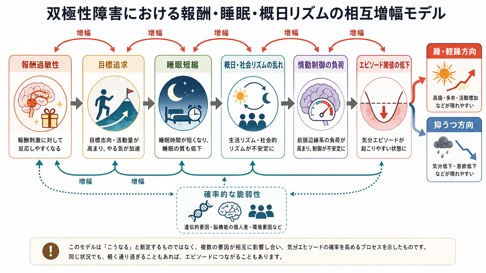
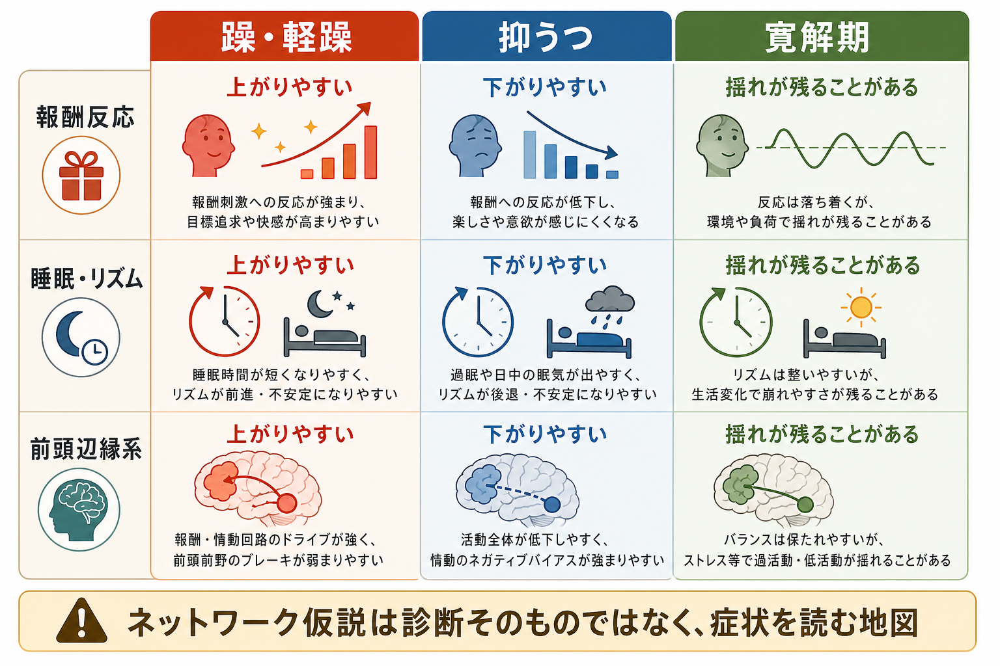

# 双極性障害は情動ネットワークの異常として説明できるのか

## 要点

- 双極性障害は、躁・軽躁エピソードと抑うつエピソードを反復しうる気分障害であり、気分、活動性、睡眠、報酬追求、思考速度、リスク判断がまとまって変化する[1][2]。
- 神経科学的には、単一の「病変部位」よりも、前頭前野、扁桃体、海馬、前部帯状皮質、腹側線条体などを含む前頭辺縁系・報酬系・概日リズム系の相互作用として読む方が自然である[3][4]。
- fMRI 研究のメタ解析では、双極性障害で情動処理、報酬処理、ワーキングメモリに関わる前頭辺縁系の活動差が報告されている。ただし、これは診断の代替ではなく、症状のまとまりを説明するモデルである[3]。
- 報酬過敏性モデルは、報酬手がかり、目標追求、活動増加、睡眠短縮が躁・軽躁方向の変化を増幅しうることを説明する[4][5]。
- 概日リズムと社会リズムの乱れは、双極性障害の経過や再発脆弱性を考えるうえで重要であり、睡眠・リズムを「生活習慣」だけでなく神経生物学的な調整系として捉える必要がある[6][7]。

## この記事で答える問い

1. 双極性障害を「情動ネットワークの異常」と呼ぶとき、どの脳内システムを指しているのか。
2. 前頭辺縁系、報酬系、概日リズムは、躁・軽躁と抑うつをどのように説明するのか。
3. ネットワーク仮説は、臨床理解や研究にどこまで役立ち、どこから先は言い過ぎになるのか。

## まず結論

双極性障害は、かなりの程度まで「情動ネットワークの状態が不安定に切り替わる疾患」として説明できる。ここでいう情動ネットワークとは、[[前頭前野は情動制御にどう関わるのか|前頭前野]]が情動反応を調整し、[[扁桃体過活動は不安症やPTSDにどう関わるのか|扁桃体]]や海馬が情動的意味づけと記憶を担い、腹側線条体などの報酬系が動機づけを調整し、睡眠・概日リズムがその全体の時間構造を支える、という複数システムのまとまりである[3][6]。

ただし、この説明は「扁桃体が過活動だから双極性障害になる」「報酬系が強いから躁になる」という単線的な因果ではない。双極性障害では、遺伝的要因、発達、ストレス、薬物、睡眠不足、社会リズム、併存症、治療歴が重なり、同じ人の中でも躁・軽躁、抑うつ、寛解期でネットワーク状態が変化する。したがって、ネットワーク仮説は診断装置ではなく、症状の連動を読むための地図である。

## 背景

双極性障害の中心は、気分だけではない。躁・軽躁では、睡眠欲求の低下、活動性の増加、観念奔逸、誇大性、目標志向行動の増加、衝動的な報酬追求が目立ちやすい。抑うつでは、快感の低下、意欲低下、疲労、睡眠・食欲の変化、集中困難、自責感、希死念慮が問題になる[1][2]。つまり、気分、報酬、覚醒、睡眠、身体活動、認知制御が同時に動く。

このまとまりは、神経回路の観点から説明しやすい。情動刺激への反応を評価する辺縁系、反応を文脈に合わせて調整する前頭前野、報酬予測と接近行動を支える腹側線条体、睡眠・覚醒と体内時計を支える概日リズム系が、互いに影響し合うからである[3][6]。

## 基本概念

### 前頭辺縁系

前頭辺縁系は、前頭前野、前部帯状皮質、扁桃体、海馬、島皮質などを含む広い回路である。情動刺激に反応するだけでなく、その刺激が今の状況でどれほど重要か、どの反応を抑え、どの行動を選ぶかを調整する。

双極性障害の fMRI メタ解析では、情動処理で扁桃体・海馬などの辺縁系活動差、前頭部の活動差、報酬処理で眼窩前頭皮質などの活動差が報告されている[3]。この知見は、双極性障害を「感情が強い病気」とだけ捉えるのではなく、情動反応と制御のバランスが状態依存的に変わる疾患として見る根拠になる。

### 報酬系

報酬系は、腹側被蓋野、腹側線条体、側坐核、眼窩前頭皮質、前部帯状皮質などを含む。報酬の予測、努力の投入、目標追求、快感、価値更新に関わる。[[報酬系の異常はうつ病をどう説明するのか|うつ病の報酬系]]ではしばしば報酬反応の低下が問題になるが、双極性障害では、とくに躁・軽躁方向で報酬手がかりへの反応性や接近動機づけの過剰な増幅が注目される[4][5]。

報酬過敏性モデルでは、昇進、達成、恋愛、競争、承認、創作活動などの報酬関連イベントが、活動量、目標追求、自己効力感、睡眠短縮を増幅し、躁・軽躁症状を押し上げる可能性があると考える[4][5]。一方、目標失敗や報酬喪失は抑うつ方向の変化と関連しうる。

### 概日リズムと社会リズム

概日リズムは、睡眠・覚醒、体温、ホルモン分泌、代謝、注意、気分の日内変動を調整する約 24 時間周期のシステムである。中核には視床下部の視交叉上核があり、光、食事、活動、対人予定などの外的手がかりによって調整される[6]。

双極性障害では、睡眠短縮、夜型傾向、社会リズムの乱れ、エピソード前後の睡眠変化がしばしば問題になる[6][7]。したがって、睡眠と生活リズムは単なる背景要因ではなく、報酬系と前頭辺縁系を変調し、気分エピソードの閾値を動かす生物学的・社会的インターフェイスである。

## 仕組み

### 1. 情動反応と制御のバランスがずれる

情動刺激に出会うと、扁桃体や海馬は重要性、危険性、報酬性、記憶との関連を素早く評価する。前頭前野や前部帯状皮質は、その反応を文脈に合わせて調整する。双極性障害では、この回路の活動差が情動処理、報酬処理、認知課題で繰り返し報告されている[3]。

躁・軽躁では、報酬や目標に向かうドライブが強まり、前頭前野のブレーキが相対的に効きにくくなるように見える場合がある。抑うつでは、報酬価値が感じにくくなり、悲観的な評価や身体的な疲労感が前景化することがある。どちらも「感情だけ」の問題ではなく、情動評価、行動選択、睡眠、報酬予測の連動として理解できる。

### 2. 報酬過敏性が目標追求と睡眠短縮を増幅する

報酬過敏性モデルは、双極スペクトラムを「報酬手がかりに対する反応性が強く、接近動機づけが過剰に高まりやすい状態」として説明する[4][5]。報酬手がかりが入ると、目標追求、活動性、計画拡大、対人行動が高まり、睡眠時間が短くなりやすい。睡眠短縮はさらに情動制御を弱め、報酬手がかりへの反応性を押し上げる。

このループは、躁・軽躁の「高揚」「多弁」「活動増加」「眠らなくても平気」という症状を一つの流れとして説明しやすい。ただし、報酬過敏性だけで双極性障害全体を説明できるわけではない。混合状態、不安、易怒性、精神病症状、物質使用、発達歴などは別の要因も必要とする。

### 3. 概日リズムがネットワークの「時間構造」を変える

睡眠不足は、疲労を増やすだけではない。前頭前野の制御、扁桃体反応、報酬判断、衝動性、注意を変化させ、気分エピソードの閾値を下げる可能性がある。概日リズムの乱れは、双極性障害の経過に関わる重要な候補機構として研究されている[6][7]。

社会リズムの乱れも重要である。仕事、学校、対人予定、食事、光曝露、夜間活動が不規則になると、体内時計と外的時間手がかりの同期が弱まる。双極性障害では、この同期の弱まりが睡眠変化と結びつき、気分状態の不安定化に関わる可能性がある[6]。

## 図解

上の 2 枚の図は、双極性障害を「報酬・睡眠・概日リズムの相互増幅」と「躁・軽躁、抑うつ、寛解期のネットワーク状態」として整理したものである。

3 枚目の図解案としては、次のような日本語インフォグラフィックが有用である。

> 「双極性障害の研究・臨床接続図」というタイトルで、左に fMRI・睡眠記録・気分評価・行動指標、中央に前頭辺縁系、報酬系、概日リズム、右に教育的理解、再発予防研究、個別化評価を配置する。注意書きとして「研究モデルであり、単独で診断や治療方針を決めるものではない」と入れる。

## 臨床・研究との接続

臨床的には、ネットワーク仮説は症状の連動を説明する助けになる。たとえば、睡眠短縮、活動量増加、目標追求、易怒性、浪費が同時に強まるなら、単なる「性格」や「気分の波」ではなく、報酬系と睡眠・概日リズムの増幅として理解しやすい。逆に、過眠、活動低下、快感低下、集中困難が続くなら、報酬反応の低下と前頭辺縁系の制御負荷として整理できる。

研究では、fMRI、安静時機能結合、課題中の報酬反応、アクチグラフィ、睡眠日誌、スマートフォンによる行動計測、経験サンプリング法を組み合わせる方向が重要になる。CANMAT/ISBD ガイドラインも、薬物療法だけでなく心理教育、生活リズム、睡眠、再発予防の重要性を扱っている[2]。ただし、本記事は教育・研究目的の概説であり、個別の診断や治療指示ではない。

## よくある誤解

### 「双極性障害は扁桃体の病気である」

単純化しすぎである。扁桃体や海馬の活動差は重要だが、前頭前野、前部帯状皮質、報酬系、睡眠・概日リズム、ストレス系も関わる[3][6]。[[HPA軸は精神疾患にどう関わるのか|HPA軸]]のようなストレス応答系も、気分エピソードの背景として無視できない。

### 「躁は報酬系が強いだけで説明できる」

報酬過敏性は有力なモデルだが、躁・軽躁には睡眠短縮、衝動性、易怒性、認知制御、社会的文脈、薬物、身体疾患などが絡む[4][5]。報酬系だけを原因として固定すると、混合状態や抑うつ、寛解期の残存症状を説明しにくい。

### 「リズムを整えれば治療になる」

睡眠・社会リズムは重要だが、それだけで十分という意味ではない。双極性障害では専門的評価、薬物療法、心理教育、危機対応、併存症評価が必要になることがある[2]。リズム調整は臨床的に重要な柱の一つだが、個別の治療判断は専門家と行う必要がある。

## 関連ノート

- [[前頭前野は情動制御にどう関わるのか]]
- [[扁桃体過活動は不安症やPTSDにどう関わるのか]]
- [[報酬系の異常はうつ病をどう説明するのか]]
- [[HPA軸は精神疾患にどう関わるのか]]
- [[神経科学は精神疾患をどのように説明できるのか]]
- [[精神疾患は脳の病気なのか]]

MOC 更新候補: `content/00_MOC/` 配下の神経科学・精神疾患・精神医学系 MOC に、本記事へのリンクを追加する。

## 理解チェック

1. 双極性障害を「情動ネットワークの異常」として読むとき、前頭辺縁系、報酬系、概日リズムはそれぞれ何を担うか。
2. 報酬過敏性モデルは、躁・軽躁のどの症状を説明しやすいか。
3. 睡眠・社会リズムの乱れは、なぜ単なる生活習慣ではなく神経生物学的な要因として扱われるのか。
4. ネットワーク仮説を診断や治療指示として使ってはいけない理由は何か。

## 参考文献

[1] American Psychiatric Association. (2022). *Diagnostic and Statistical Manual of Mental Disorders, Fifth Edition, Text Revision (DSM-5-TR).* American Psychiatric Association Publishing. https://doi.org/10.1176/appi.books.9780890425787

[2] Yatham, L. N., Kennedy, S. H., Parikh, S. V., et al. (2018). Canadian Network for Mood and Anxiety Treatments (CANMAT) and International Society for Bipolar Disorders (ISBD) 2018 guidelines for the management of patients with bipolar disorder. *Bipolar Disorders, 20*(2), 97-170. https://doi.org/10.1111/bdi.12609

[3] Mesbah, R., Koenders, M. A., van der Wee, N. J. A., Giltay, E. J., van Hemert, A. M., & de Leeuw, M. (2023). Association Between the Fronto-Limbic Network and Cognitive and Emotional Functioning in Individuals With Bipolar Disorder: A Systematic Review and Meta-analysis. *JAMA Psychiatry, 80*(5), 432-440. https://doi.org/10.1001/jamapsychiatry.2023.0131

[4] Nusslock, R., & Alloy, L. B. (2017). Reward processing and mood-related symptoms: An RDoC and translational neuroscience perspective. *Journal of Affective Disorders, 216*, 3-16. https://doi.org/10.1016/j.jad.2017.02.001

[5] Alloy, L. B., & Nusslock, R. (2019). Future Directions for Understanding Adolescent Bipolar Spectrum Disorders: A Reward Hypersensitivity Perspective. *Journal of Clinical Child & Adolescent Psychology, 48*(4), 669-683. https://doi.org/10.1080/15374416.2019.1567347

[6] Gold, A. K., & Kinrys, G. (2019). Treating Circadian Rhythm Disruption in Bipolar Disorder. *Current Psychiatry Reports, 21*, 14. https://doi.org/10.1007/s11920-019-1001-8

[7] Scott, J., et al. (2022). A systematic review and meta-analysis of sleep and circadian rhythms disturbances in individuals at high-risk of developing or with early onset of bipolar disorders. *Neuroscience & Biobehavioral Reviews.* https://pmc.ncbi.nlm.nih.gov/articles/PMC8957543/

[8] Strakowski, S. M., et al. (2011). fMRI brain activation in bipolar mania: Evidence for disruption of the ventrolateral prefrontal-amygdala emotional pathway. *Biological Psychiatry, 69*(4), 381-388. https://pmc.ncbi.nlm.nih.gov/articles/PMC3058900/
