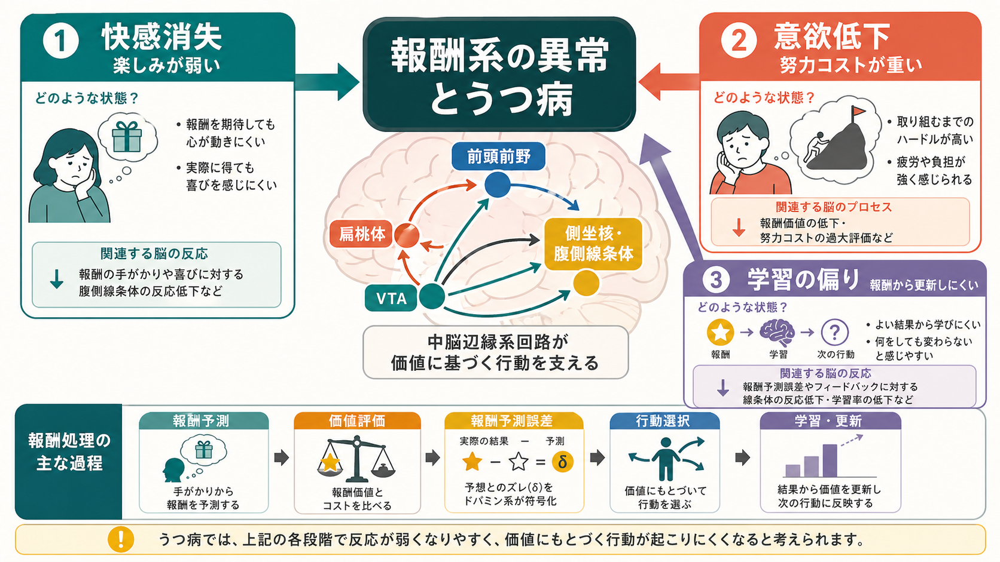
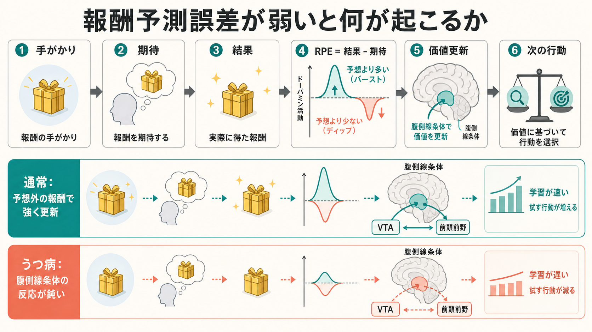

# 報酬系の異常はうつ病をどう説明するのか

## 要点

- うつ病の報酬系異常は、「楽しくない」だけでなく、「楽しみを予測しにくい」「努力して近づきにくい」「結果から価値を更新しにくい」という複数の過程に分けて理解する必要がある。
- NIMH の RDoC では、報酬反応性、報酬学習、報酬価値づけが陽性価システムとして整理される。これは診断名ではなく、症状を横断して測れる機能単位である[1]。
- 中脳の腹側被蓋野、側坐核・腹側線条体、前頭前野、眼窩前頭皮質、扁桃体は、報酬の予測、動機づけ、価値評価、行動選択を結ぶ主要な回路である[3][4]。
- うつ病では、報酬フィードバック時の線条体反応低下や、行動課題上の報酬処理障害がメタ解析で示されている。ただし効果は症状・課題・年齢・薬物・併存症によって変わる[6][7]。
- この説明は教育・研究目的の神経科学モデルであり、個別の診断や治療方針を決めるものではない。

## この記事で答える問い

この記事では、[[ドパミンは報酬だけの物質なのか]]、[[BOLD信号とは何か]]、[[脳ネットワークの破綻は精神疾患をどう説明するのか]]を背景に、次の問いに答える。

1. 報酬系とは、どのような脳回路と心理過程を指すのか。
2. うつ病の快感消失や意欲低下は、報酬処理のどの段階の問題として説明できるのか。
3. 強化学習や報酬予測誤差の異常は、うつ病理解に何を加えるのか。
4. 報酬系モデルを臨床・研究に使うとき、どこに注意が必要か。

## まず結論

報酬系の異常は、うつ病を「気分が落ち込む病気」とだけ見るのではなく、価値にもとづいて世界へ近づく力が弱まる状態として説明する。ここでいう報酬は、単なる快感ではない。報酬を予測すること、報酬を得るために努力すること、得られた結果から次の行動価値を更新することまで含む。

したがって、うつ病の快感消失は「楽しい刺激を見ても快を感じない」という消費的快感の問題だけではない。むしろ多くの研究では、報酬を期待して行動を起こす過程、努力コストと報酬価値を比較する過程、報酬フィードバックから学習する過程が重要視される[2][3][7]。この見方は、うつ病の異質性を、症状のラベルではなく機能の分解として扱うための入口になる。

## 背景

うつ病では、抑うつ気分、興味・喜びの低下、疲労感、睡眠や食欲の変化、集中困難、罪責感、自殺念慮などが組み合わさる。ただし、同じ診断名でも、主に反すうや不安が目立つ人、身体症状が目立つ人、意欲や喜びの低下が中心になる人がいる。報酬系モデルは、このうち特に快感消失、意欲低下、活動性低下、意思決定の変化を説明しやすい。

RDoC の陽性価システムは、報酬への反応、報酬学習、報酬価値づけを研究単位として整理する[1]。これは「うつ病 = 報酬系の病気」と断定する枠組みではない。むしろ、うつ病、不安症、依存、統合失調症、パーキンソン病などをまたいで、報酬に近づく行動がどの段階で変わるのかを測るための研究言語である。

## 基本概念

### 報酬系

報酬系とは、報酬を検出し、予測し、価値づけ、行動へ結びつけ、結果から学習する回路群である。代表的には、腹側被蓋野、側坐核を含む腹側線条体、前頭前野、眼窩前頭皮質、前帯状皮質、扁桃体、海馬などが関わる[4]。この回路は単独で働くのではなく、[[脳内ネットワークとは何か|脳内ネットワーク]]、身体状態、ストレス、記憶、社会的文脈と結びついて行動を調整する。

### 快感消失

快感消失は、ふつうなら報酬的な出来事から喜びや興味を得にくい状態を指す。ただし、Treadway と Zald が強調したように、快感消失は少なくとも「消費的快感」と「動機づけ的快感」に分ける必要がある[2]。前者は実際に得た報酬を快いと感じる過程であり、後者は報酬を期待し、欲し、近づく過程である。

### 報酬予測誤差

報酬予測誤差は、実際の結果と予測された結果の差である。強化学習では、予想外によい結果があれば価値を上げ、期待した報酬が得られなければ価値を下げる。中脳ドパミンニューロンの活動がこの誤差信号に似た性質を示すことは、報酬学習研究の重要な基盤になった[5]。

### 努力コスト

報酬があると分かっていても、得るための努力、時間、失敗可能性、社会的負荷が大きいと、行動は起こりにくくなる。うつ病の意欲低下は、報酬価値が低く見積もられること、努力コストが高く見積もられること、またはその両方として整理できる。

## 仕組み

### 1. 予測段階: 未来の報酬が立ち上がりにくい

報酬を得る前には、「それをすればよいことが起こりそうだ」という予測が必要になる。腹側線条体や前頭前野は、報酬を予測する手がかりや期待と関係する。うつ病では、報酬を知らせる手がかりへの反応や、報酬期待時の主観的高まりが弱いことがあり、これが「楽しみを想像しても動き出せない」感覚に関わる可能性がある[3][6]。

### 2. 選択段階: 報酬価値より努力コストが重くなる

次に、脳は「その報酬に向かう価値があるか」を計算する。ここでは、報酬の大きさ、確率、遅延、努力、失敗可能性が比較される。うつ病では、報酬が小さく見えるだけでなく、努力や疲労のコストが大きく見積もられやすい。すると、実際には価値のある活動でも、開始前の段階で選ばれにくくなる。

### 3. 結果段階: 報酬からの更新が弱い

行動のあとに報酬が得られたとき、その経験は次の選択を変える。ところが、報酬フィードバックに対する腹側線条体反応が鈍いと、よい結果が「次もやってみよう」という価値更新につながりにくい。fMRI と EEG のメタ解析では、うつ病で報酬フィードバック時の線条体信号やフィードバック関連陰性電位が低下する傾向が報告されている[6]。ただし、[[fMRIは神経活動を直接測っているのか|fMRI]] の信号は神経活動を直接測るものではなく、課題設計や解析方法の影響を受ける。

### 4. 学習段階: 行動レパートリーが狭くなる

報酬予測誤差が弱い、あるいは報酬からの学習率が低いと、環境の中で何が自分にとって価値をもつのかを更新しにくくなる。すると、以前は意味があった活動に近づきにくくなり、新しい活動を試す頻度も下がる。行動が減ると、報酬を得る機会も減るため、さらに「何をしても変わらない」という学習が強まりやすい。

## 図解

図1は、うつ病における報酬系異常を、快感消失、意欲低下、学習の偏りに分けた概念地図である。VTA、側坐核・腹側線条体、前頭前野、扁桃体は、報酬予測、価値評価、努力コスト、結果からの更新をつなぐ。

図2は、報酬予測誤差が弱い場合の流れである。通常は、予想外の報酬が価値更新を強め、次の行動選択を変える。うつ病でみられる傾向としては、腹側線条体やフィードバック処理の反応が鈍く、報酬から行動価値を更新する力が弱まる可能性がある[6][7]。

## 臨床・研究との接続

報酬系の観点は、うつ病をサブタイプや症状次元で理解する助けになる。たとえば、同じ抑うつ重症度でも、快感消失が強い人、努力回避が強い人、罰への過敏性が強い人、報酬学習の低下が目立つ人では、課題成績や脳反応が異なる可能性がある。Pizzagalli は、ストレスと報酬系の相互作用が快感消失の重要な中間表現型になりうると整理している[3]。

行動課題のメタ解析では、うつ病群は健常群に比べて報酬処理全体に小から中程度の障害を示し、とくに報酬バイアス、選択価値づけ、強化学習に差がみられた[7]。これは、主観報告だけでなく、客観的な課題成績にも報酬処理の変化が現れうることを示す。

一方で、報酬系指標だけで個人のうつ病を診断することはできない。報酬反応は、年齢、性別、薬物、睡眠、慢性ストレス、身体疾患、併存症、課題の種類、報酬の種類に左右される。また、群平均の差は個人レベルの診断精度を保証しない。この点は、[[脳ネットワークの破綻は精神疾患をどう説明するのか]]で扱うネットワーク指標と同じ注意が必要である。

## よくある誤解

### 誤解1: うつ病はドパミン不足だけで説明できる

ドパミン系は重要だが、うつ病を単一の神経伝達物質不足に還元することはできない。報酬系には、ドパミンだけでなく、グルタミン酸、GABA、セロトニン、ストレスホルモン、炎症、神経可塑性、前頭前野制御が関わる[3][4]。

### 誤解2: 快感消失は「楽しいことをすれば治る」という意味である

快感消失では、楽しい刺激を受け取る力だけでなく、楽しいことを予測し、始め、続け、結果から学ぶ力が弱まることがある。したがって、単純に刺激を増やせばよいという話ではない。臨床的介入は個別評価にもとづいて行われるべきであり、本記事は治療指示ではない。

### 誤解3: 報酬系異常が見つかれば診断できる

報酬課題や脳画像は、集団レベルの研究や症状次元の理解には有用だが、現時点で個人の診断を単独で決めるバイオマーカーではない。研究知見は、症状、生活機能、発達歴、身体疾患、薬物、環境要因と統合して解釈する必要がある。

### 誤解4: 報酬系は快楽だけを扱う

報酬系は、快楽だけでなく、予測、努力、選択、学習、習慣、価値更新に関わる。むしろうつ病理解では、快い刺激を受け取る瞬間よりも、その前後にある「近づく」「試す」「学ぶ」過程が重要になることが多い。

## 関連ノート

既存ノート:

- [[ドパミンは報酬だけの物質なのか]]
- [[BOLD信号とは何か]]
- [[fMRIは神経活動を直接測っているのか]]
- [[脳内ネットワークとは何か]]
- [[脳ネットワークの破綻は精神疾患をどう説明するのか]]
- [[神経可塑性は発達と学習をどう支えるのか]]
- [[直接路と間接路は行動選択をどう制御するのか]]

関連ノート候補:

- 報酬予測誤差とは何か
- 快感消失とは何か
- 強化学習モデルはうつ病をどう説明するのか
- 腹側線条体は報酬学習にどう関わるのか
- 努力コストは意欲低下をどう説明するのか
- RDoCの陽性価システムとは何か

MOC更新候補:

- `content/00_MOC/` 内の脳・神経科学、精神医学、計算論的精神医学関連 MOC に、本記事へのリンクを追加する。
- 並列ジョブとの競合を避けるため、このタスクでは MOC 本体は更新しない。

## 理解チェック

1. 快感消失を、消費的快感と動機づけ的快感に分けると何が見えやすくなるか。
2. 報酬予測誤差は、強化学習においてどのような役割をもつか。
3. うつ病で腹側線条体反応が鈍いという知見を、個人診断にそのまま使えない理由は何か。
4. 意欲低下を「報酬価値」と「努力コスト」の観点から説明すると、どのような理解になるか。
5. 報酬系モデルが、うつ病の異質性を理解するうえで有用な理由は何か。

## 参考文献

[1] National Institute of Mental Health. (n.d.). *Definitions of the RDoC Domains and Constructs*. https://www.nimh.nih.gov/research/research-funded-by-nimh/rdoc/definitions-of-the-rdoc-domains-and-constructs

[2] Treadway, M. T., & Zald, D. H. (2011). Reconsidering anhedonia in depression: Lessons from translational neuroscience. *Neuroscience & Biobehavioral Reviews, 35*(3), 537-555. https://doi.org/10.1016/j.neubiorev.2010.06.006

[3] Pizzagalli, D. A. (2014). Depression, stress, and anhedonia: Toward a synthesis and integrated model. *Annual Review of Clinical Psychology, 10*, 393-423. https://doi.org/10.1146/annurev-clinpsy-050212-185606

[4] Russo, S. J., & Nestler, E. J. (2013). The brain reward circuitry in mood disorders. *Nature Reviews Neuroscience, 14*, 609-625. https://doi.org/10.1038/nrn3381

[5] Schultz, W., Dayan, P., & Montague, P. R. (1997). A neural substrate of prediction and reward. *Science, 275*(5306), 1593-1599. https://doi.org/10.1126/science.275.5306.1593

[6] Keren, H., O'Callaghan, G., Vidal-Ribas, P., Buzzell, G. A., Brotman, M. A., Leibenluft, E., Pan, P. M., Meffert, L., Kaiser, A., Wolke, S., Pine, D. S., & Stringaris, A. (2018). Reward processing in depression: A conceptual and meta-analytic review across fMRI and EEG studies. *American Journal of Psychiatry, 175*(11), 1111-1120. https://doi.org/10.1176/appi.ajp.2018.17101124

[7] Halahakoon, D. C., Kieslich, K., O'Driscoll, C., Nair, A., Lewis, G., & Roiser, J. P. (2020). Reward-processing behavior in depressed participants relative to healthy volunteers: A systematic review and meta-analysis. *JAMA Psychiatry, 77*(12), 1286-1295. https://doi.org/10.1001/jamapsychiatry.2020.2139

## 未解決問題

- 報酬予測、努力コスト、消費的快感、強化学習を、臨床的に再現性の高いサブタイプへどう結びつけるか。
- 報酬系指標が、治療反応や再発リスクの予測にどこまで使えるか。
- ストレス、炎症、睡眠、社会的孤立が、腹側線条体や前頭前野の報酬処理をどの時間スケールで変えるか。
- 行動課題、自己報告、fMRI、EEG、計算モデルを、個人差の大きいうつ病研究でどう統合するか。

## 更新ログ

- 2026-04-27: 初稿作成。報酬系異常、快感消失、意欲低下、強化学習異常を整理し、画像2枚と主要参考文献を追加。
