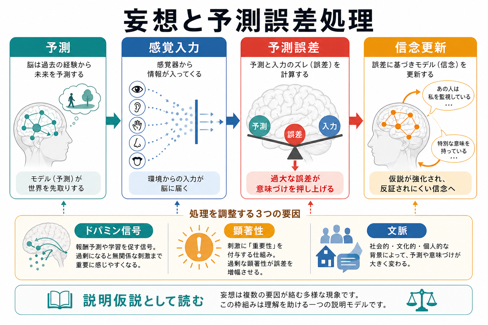
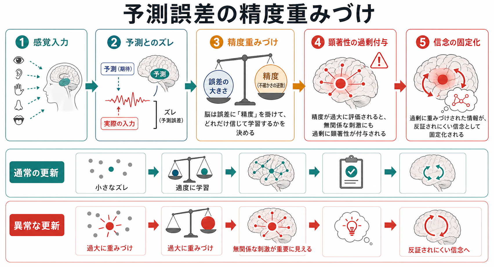
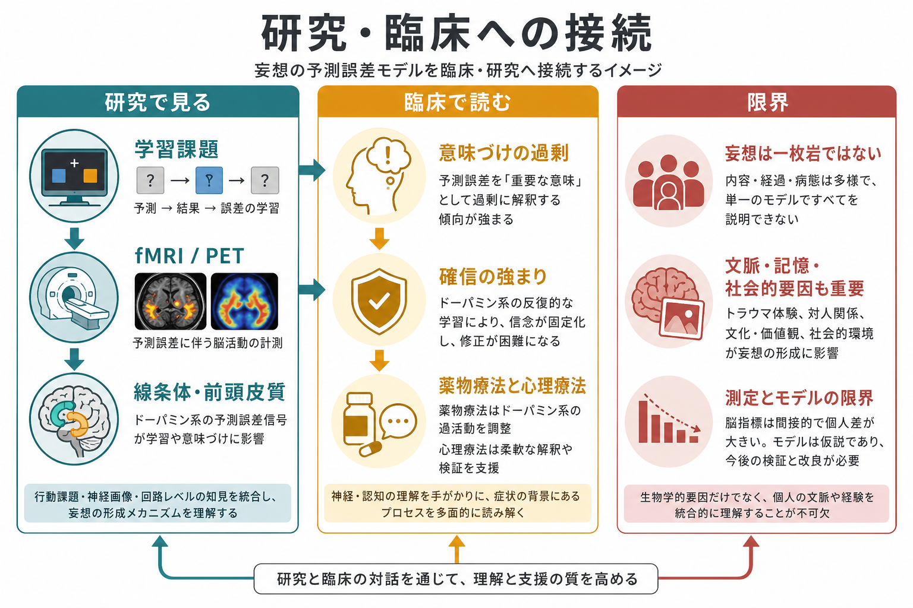

# 妄想は予測誤差処理の異常として説明できるのか

## 要点

- 妄想は「誤った考えを持つこと」だけでなく、経験に過剰な意味が付与され、その意味づけが反証されにくい信念として固定化する過程として理解できる。
- 予測処理モデルでは、脳は入力を受け身に写し取るのではなく、予測と感覚入力のズレ、すなわち予測誤差を使って信念を更新すると考える[2][4]。
- 妄想の一部は、無関係な刺激に過大な顕著性が付与される「異常な顕著性」の枠組みとよく接続する。Kapur は、この顕著性付与の異常をドパミン信号の乱れと結びつけて説明した[1]。
- ドパミン仮説は、妄想を含む精神病症状の重要な生物学的経路を示すが、妄想をドパミンだけで説明するものではない。記憶、情動、社会的文脈、推論様式、皮質階層の予測処理も関与する[3][5]。
- したがって、この問いへの答えは「かなり説明できるが、十分条件でも単一原因でもない」である。

## この記事で答える問い

この記事の問いは、[[精神疾患は脳の病気なのか]]という大きな問いの中でも、妄想をどのような情報処理の変化として理解できるかにある。とくに、[[ドパミン仮説は統合失調症をどこまで説明できるのか]]、[[グルタミン酸仮説は統合失調症をどう説明するのか]]、[[GABA機能低下は統合失調症にどう関わるのか]]と接続しながら、妄想を「信念形成の異常」として読む。

ここで扱う内容は教育・研究目的の整理であり、個別の診断や治療指示ではない。妄想様の体験や強い確信がある場合でも、その意味は生活史、文化、ストレス、睡眠、薬物、身体疾患、精神疾患の全体像の中で慎重に評価される必要がある。

## まず結論

妄想は、予測誤差処理の異常としてかなり説得的に説明できる。通常、私たちは世界についての予測を持ち、入力と予測がズレたときに、そのズレをどれほど信頼して学習するかを調整する。重要なのは、誤差の「大きさ」だけでなく、その誤差をどれほど信じるか、つまり精度重みづけである[2][4]。

この精度重みづけが過剰になると、偶然の一致、他人の視線、テレビの言葉、身体感覚、環境音などが、通常以上に「自分に関係がある」「何かを意味している」と感じられる可能性がある。そこに説明を与えようとする認知的過程が働くと、「誰かが監視している」「特別なメッセージが送られている」といった信念が形成されうる。Kapur の異常な顕著性仮説は、この「意味が過剰に立ち上がる」現象を、ドパミン系の異常な信号と結びつけた[1]。

ただし、妄想は一枚岩ではない。被害妄想、関係妄想、誇大妄想、身体妄想などでは、情動、対人経験、記憶、自己モデル、文化的意味づけが異なる仕方で関与する。予測誤差モデルは「妄想のすべて」を一つの式で説明する理論ではなく、妄想が形成・維持される過程を多層的に読むための枠組みである[3][4]。

## 背景

従来、妄想はしばしば「訂正不能な誤った信念」として記述されてきた。この定義は臨床的には有用だが、どのようにしてその信念が生まれ、なぜ反証されにくくなるのかまでは説明しにくい。たとえば、同じ偶然の出来事でも、ある人には単なる偶然として流され、別の人には「重要なサイン」として経験される。この差は、単に知識量や論理性だけでは説明できない。

予測処理の考え方では、知覚は外界をそのまま写す過程ではない。脳は過去の経験にもとづいて「いま何が起きているはずか」を予測し、実際の入力との差を使って予測を更新する。信念はこの階層的な予測の一部であり、感覚入力だけでなく、文脈、期待、情動、身体状態によっても変わる[2][4]。

統合失調症や精神病症状の研究では、ドパミン系の異常が長く注目されてきた。とくに線条体の前シナプス性ドパミン機能の亢進は、精神病症状への脆弱性や発症と関連する経路として議論されている[5]。この知見は、[[ドパミン仮説は統合失調症をどこまで説明できるのか]]で扱うような薬理学的・画像研究的な根拠とつながる。

## 基本概念

### 予測誤差

予測誤差とは、脳が予測した入力と、実際に入ってきた入力とのズレである。報酬学習では「期待よりよかった」「期待より悪かった」というズレが学習信号になる。知覚や信念形成でも、予測と入力が合わないときに、モデルを更新する圧力が生じる[2][4]。

ただし、予測誤差はいつも信念を変えるわけではない。雑音、見間違い、偶然、文脈依存の入力であれば、脳は誤差を低く重みづける。逆に、誤差が信頼できると判断されれば、学習や信念更新が起こる。

### 精度重みづけ

精度重みづけとは、予測誤差をどれくらい信頼するかの調整である。数学的にいえば、同じ誤差でも「ノイズが大きい環境で生じた誤差」と「信頼できる環境で繰り返し生じる誤差」では、更新の強さが異なる。

妄想の予測処理モデルでは、この精度重みづけが重要になる。無関係な刺激や偶然の一致に過剰な精度が割り当てられると、脳は「これは重要な誤差だ」と扱い、世界モデルを強く更新しようとする[4]。

### 顕著性

顕著性とは、ある刺激や出来事が「目立つ」「重要だ」「自分に関係している」と感じられる性質である。Kapur の異常な顕著性仮説では、精神病状態ではドパミン信号の異常により、通常なら中立的な出来事にも過剰な顕著性が付与されると考える[1]。

この仮説では、妄想は突然ゼロから作られるのではない。まず世界が妙に意味深く感じられ、その違和感や重要感を説明するために、本人にとって一貫した物語が形成される。その物語が繰り返し強化されると、反証されにくい信念として固定化しうる。

### ドパミン信号

ドパミンは単純な「快楽物質」ではない。報酬予測、学習、動機づけ、注意の配分、行動選択に関わる神経修飾物質である。精神病症状との関係では、線条体ドパミン機能の異常が、予測誤差や顕著性付与の異常を通じて、陽性症状の形成に関与する可能性がある[1][5]。

ただし、ドパミンは妄想の唯一の原因ではない。[[グルタミン酸仮説は統合失調症をどう説明するのか]]や[[GABA機能低下は統合失調症にどう関わるのか]]で扱うように、皮質回路の興奮・抑制バランス、NMDA受容体機能、発達過程、ストレス応答も予測処理に影響する。

## 仕組み

### 1. 予測と入力のズレが過剰に目立つ

通常、脳は感覚入力の多くを背景として処理する。足音、視線、偶然聞こえた言葉、身体感覚の小さな変化などは、文脈に応じて重要度が調整される。妄想形成に関わる状態では、このフィルタリングが不安定になり、背景的な入力が過剰に目立つ可能性がある。

この段階では、まだ妄想そのものではない。むしろ「何か変だ」「偶然とは思えない」「世界が自分に向けて反応している感じがする」といった経験の変化として現れる。Corlett らは、妄想を予測誤差と学習の異常から説明する神経生物学的枠組みを提示し、予測誤差信号が不適切に発生することで信念形成が歪む可能性を論じた[3]。

### 2. 誤差に過剰な精度が与えられる

予測誤差が生じても、それが雑音として扱われれば信念は大きく変わらない。問題は、その誤差が「非常に信頼できる」「重要なサインだ」と重みづけられる場合である。予測処理モデルでは、この過程を精度重みづけの異常として表現する[4]。

たとえば、テレビの一文、他人の咳払い、スマートフォンの通知音が、偶然ではなく自分への合図のように感じられるとする。このとき脳は、入力の統計的な偶然性よりも、入力が持つ「自分に関係する意味」を強く学習してしまうかもしれない。

### 3. 顕著性の過剰付与が説明を要求する

異常な顕著性が続くと、本人にとって世界は意味の密度を増す。中立的な刺激が中立的に感じられず、何かの合図、警告、監視、選別、特別な使命のように経験されることがある。Kapur のモデルでは、この「意味が勝手に立ち上がる」段階が妄想形成の入り口になる[1]。

人間は意味のない出来事をそのまま放置するのが得意ではない。強い違和感が続けば、それを説明する仮説を作る。妄想は、その仮説が本人にとって経験を最もよく説明するものとして採用され、確信を伴って固定化していく過程として理解できる。

### 4. 反証されにくい信念として固定化する

妄想が形成されると、その信念は新しい入力の解釈にも影響する。疑いを否定する証拠があっても、「相手が隠している」「証拠を消した」「試されている」と解釈されれば、反証はむしろ信念を補強してしまう。これは、信念が上位の予測として働き、下位の入力を再解釈するためである[2][4]。

この点で、妄想は単なる「情報不足」ではない。新しい情報を提示するだけでは修正されにくい場合があるのは、信念が知覚、注意、記憶、情動を組織する枠組みとして働くからである。

## 図解

| 図 | 読み方 |
|---|---|
| 概念地図 | 予測、感覚入力、予測誤差、信念更新の流れに、ドパミン信号・顕著性・文脈がどう関与するかを見る。 |
| メカニズム図 | 予測誤差の精度重みづけが過剰になると、無関係な刺激が重要に見え、反証されにくい信念へ進む流れを見る。 |
| 研究・臨床接続図 | 行動課題、fMRI/PET、線条体・前頭皮質、薬物療法・心理療法、限界を一つの図として読む。 |

## 臨床・研究との接続

### 行動課題

研究では、学習課題、確率推論課題、連合学習課題などを使って、予測誤差や信念更新の特徴を測定する。妄想傾向が高い人では、不確実な証拠から結論へ飛びやすい、あるいは予測誤差への反応が通常と異なる、といった仮説が検討されてきた[3][4]。

ただし、課題成績をそのまま個人診断に使うことはできない。課題は研究上のモデルを検証する道具であり、臨床では生活史、症状の時間経過、苦痛、機能障害、身体疾患、薬物、睡眠などを総合して評価する必要がある。

### 脳画像と神経回路

fMRI研究では、予測誤差に関連する活動や、前頭皮質・線条体・海馬などの回路が検討される。PET研究では、ドパミン合成能や受容体占有率などを通じて、ドパミン系の状態を間接的に評価する。Howes と Kapur は、複数のリスク経路が最終的に線条体ドパミン機能異常へ収束し、精神病症状へつながるという「最終共通経路」としてドパミン仮説を再構成した[5]。

この見方は、妄想を「前頭皮質だけ」「線条体だけ」といった単一部位の問題としてではなく、学習、顕著性、文脈、認知制御のネットワーク問題として読む方向に近い。

### 薬物療法との関係

多くの抗精神病薬はD2受容体遮断作用を持ち、陽性症状の軽減と関係する。これは、異常なドパミン信号が顕著性付与や学習信号を不安定にするという仮説と整合的である[1][5]。

しかし、薬物療法の効果は「妄想の内容が論理的に否定される」こととは別である。むしろ、異常な顕著性や切迫感が弱まり、体験を別の仕方で検討できる余地が生まれる、と考える方が理解しやすい。治療抵抗性の例ではドパミン以外の機序も重要であり、妄想の維持には情動、対人関係、記憶、社会的文脈が関わる[3][4]。

### 心理療法・支援との関係

予測誤差モデルは、心理的支援とも矛盾しない。妄想を単に「間違い」として否定するのではなく、本人にとってその信念がどのような経験を説明しているのか、どのような証拠が強く重みづけられているのかを丁寧に扱う視点を与える。

たとえば、認知行動療法的な支援では、確信度、代替説明、証拠の重みづけ、不安や睡眠との関係を検討することがある。これは、上位信念を直接壊すというより、予測誤差の解釈と精度重みづけを柔らかくする作業として理解できる。

## よくある誤解

### 誤解1: 妄想はドパミンが多すぎるだけで起こる

ドパミン系の異常は重要だが、妄想をドパミンだけで説明するのは単純化しすぎである。ドパミンは顕著性、学習、予測誤差に関わるが、妄想の内容や固定化には、記憶、情動、文化、対人経験、推論様式、皮質階層の予測処理が関与する[3][4]。

### 誤解2: 予測誤差モデルは「本人の推論が悪い」と言っている

このモデルは、本人の責任や性格を説明するものではない。むしろ、世界が異常に意味深く感じられるような体験が先にあり、その体験を説明するために信念が形成される可能性を重視する。本人にとって妄想的信念は、混乱した体験に秩序を与える仮説として機能することがある[1][3]。

### 誤解3: 妄想は反証すれば修正できる

妄想が上位の予測として働いている場合、反証はそのまま受け取られないことがある。反証が「隠蔽」「罠」「試験」と解釈されれば、信念はむしろ強まる。したがって、単に論破するよりも、確信の強さ、代替説明、不安、睡眠、対人安全感を含めて扱う必要がある。

### 誤解4: 予測処理で説明できるなら、社会的要因は不要である

逆である。予測処理は、社会的文脈を脳内モデルから切り離さない。いじめ、差別、孤立、トラウマ、文化的意味、慢性ストレスは、何を危険と予測するか、どの入力を重要とみなすかに影響する。神経科学的説明は、心理社会的説明を置き換えるものではなく、接続するための枠組みである。

## 関連ノート

- [[ドパミン仮説は統合失調症をどこまで説明できるのか]]
- [[グルタミン酸仮説は統合失調症をどう説明するのか]]
- [[GABA機能低下は統合失調症にどう関わるのか]]
- [[神経科学は精神疾患をどのように説明できるのか]]
- [[精神疾患は脳の病気なのか]]
- [[E_Iバランス異常は精神疾患をどう説明するのか]]
- [[神経発達の異常は精神疾患にどう関わるのか]]

MOC更新候補:

- `content/00_MOC/` 配下の脳・神経科学、精神医学、計算論的精神医学に関するMOC
- 並列ジョブとの競合を避けるため、このタスクではMOC本体は更新しない。

## 理解チェック

1. 予測誤差の「大きさ」と「精度重みづけ」は何が違うか。
2. 異常な顕著性仮説では、妄想はどのような順序で形成されると考えるか。
3. ドパミン信号の異常は、なぜ妄想内容そのものではなく「意味づけの立ち上がり」と関係すると考えられるか。
4. 反証が妄想を弱めず、むしろ強めることがあるのはなぜか。
5. 予測処理モデルと心理社会的要因は、どのように両立するか。

## 未解決問題

- 妄想のどのタイプが、予測誤差や精度重みづけの異常で最もよく説明できるのか。
- 異常な顕著性、報酬予測誤差、感覚予測誤差、社会的予測誤差は、同じ機序の別表現なのか、異なる階層の現象なのか。
- ドパミン、グルタミン酸、GABA、海馬・前頭皮質・線条体回路の相互作用を、個人差まで含めてどうモデル化するか。
- 予測処理モデルを、臨床支援で有用な説明や介入設計にどこまで翻訳できるか。

## 参考文献

[1] Kapur, S. (2003). Psychosis as a state of aberrant salience: A framework linking biology, phenomenology, and pharmacology in schizophrenia. *American Journal of Psychiatry, 160*(1), 13-23. https://doi.org/10.1176/appi.ajp.160.1.13

[2] Fletcher, P. C., & Frith, C. D. (2009). Perceiving is believing: A Bayesian approach to explaining the positive symptoms of schizophrenia. *Nature Reviews Neuroscience, 10*(1), 48-58. https://doi.org/10.1038/nrn2536

[3] Corlett, P. R., Taylor, J. R., Wang, X. J., Fletcher, P. C., & Krystal, J. H. (2010). Toward a neurobiology of delusions. *Progress in Neurobiology, 92*(3), 345-369. https://doi.org/10.1016/j.pneurobio.2010.06.007

[4] Sterzer, P., Adams, R. A., Fletcher, P., Frith, C., Lawrie, S. M., Muckli, L., Petrovic, P., Uhlhaas, P., Voss, M., & Corlett, P. R. (2018). The predictive coding account of psychosis. *Biological Psychiatry, 84*(9), 634-643. https://doi.org/10.1016/j.biopsych.2018.05.015

[5] Howes, O. D., & Kapur, S. (2009). The dopamine hypothesis of schizophrenia: Version III--the final common pathway. *Schizophrenia Bulletin, 35*(3), 549-562. https://doi.org/10.1093/schbul/sbp006

[6] Schultz, W., & Dickinson, A. (2000). Neuronal coding of prediction errors. *Annual Review of Neuroscience, 23*, 473-500. https://doi.org/10.1146/annurev.neuro.23.1.473

[7] Adams, R. A., Napier, G., Roiser, J. P., Mathys, C., & Gilleen, J. (2018). Attractor-like dynamics in belief updating in schizophrenia. *Journal of Neuroscience, 38*(44), 9471-9485. https://doi.org/10.1523/JNEUROSCI.3163-17.2018

[8] Corlett, P. R., Honey, G. D., & Fletcher, P. C. (2016). Prediction error, ketamine and psychosis: An updated model. *Journal of Psychopharmacology, 30*(11), 1145-1155. https://doi.org/10.1177/0269881116650087
