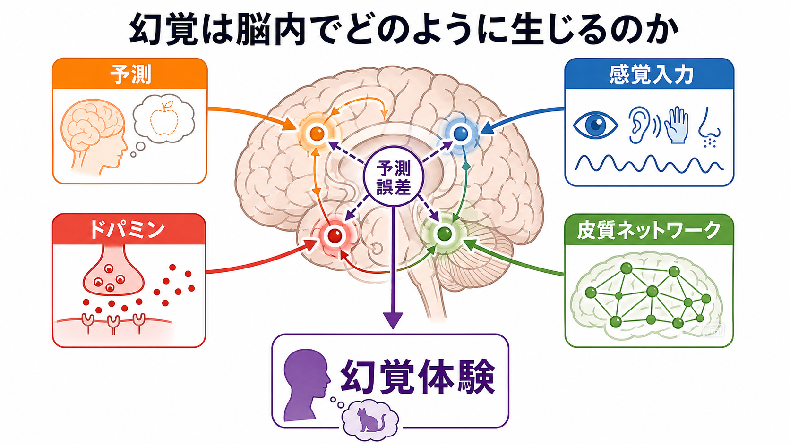
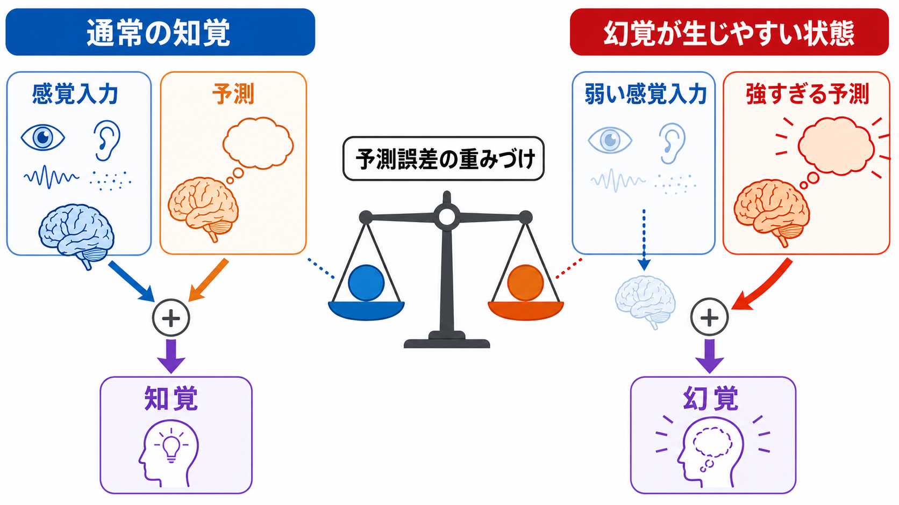
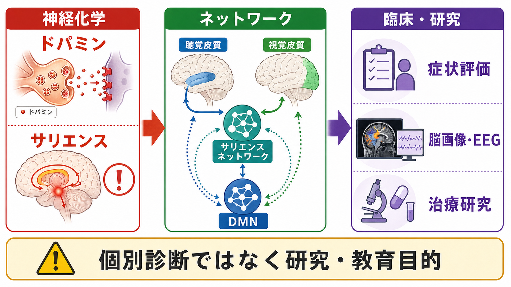

# 幻覚は脳内でどのように生じるのか

## 要点

- 幻覚は「外界に対応する刺激がないのに、知覚として経験されるもの」と整理できる。ただし、これは単なる想像や作り話ではなく、本人には知覚として迫ってくる体験である [1]。
- 現代的には、脳が感覚入力を受け身に写し取るのではなく、予測と感覚入力を照合して知覚を作るという枠組みで理解される [1], [2]。
- 幻覚が生じやすい状態では、予測が強すぎる、感覚入力の信頼度が低い、予測誤差の重みづけが変わる、あるいはそれらを調整する神経調節系が乱れる [1], [3]。
- ドパミン異常は、刺激や内的表象に「重要そうだ」というサリエンスを過剰に割り当て、幻覚や妄想を支える背景になりうる [4], [5]。
- 聴覚性幻覚では、聴覚皮質、言語産生・言語理解領域、島皮質、海馬周辺、デフォルトモードネットワークなどを含む分散ネットワークの関与が示されている [6], [7]。

## この記事で答える問い

1. 幻覚はなぜ「外にあるもの」のように感じられるのか。
2. 知覚予測と感覚入力のバランスは、幻覚にどう関わるのか。
3. ドパミン異常は幻覚をどう説明するのか。
4. 聴覚皮質やネットワーク研究は、幻覚のどの部分を説明するのか。

## まず結論

幻覚は、単一の「幻覚中枢」が暴走して起こるというより、脳が世界を推論する仕組みの偏りとして理解すると見通しがよい。脳は、感覚入力だけでなく、過去の経験、文脈、期待、身体状態から「いま何が起きているか」を予測している。通常は、予測と感覚入力のずれ、つまり予測誤差によって知覚が修正される。

しかし、予測が過度に強い、感覚入力が弱い、予測誤差が適切に重みづけられない、あるいはドパミンなどの神経調節により内的表象へ過剰なサリエンスが付与されると、内側で生成された表象が外界由来の知覚のように扱われやすくなる [1], [2], [5]。このとき、聴覚・視覚などの感覚皮質、言語ネットワーク、海馬、島皮質、前頭前野、デフォルトモードネットワークなどが相互作用し、体験の内容、迫真性、自己帰属、苦痛度を形づくる [6], [7]。

## 背景

幻覚は、統合失調症スペクトラムでよく議論されるが、そこに限定されない。パーキンソン病、レビー小体型認知症、てんかん、感覚遮断、視覚・聴覚の障害、睡眠移行期、薬物、強いストレスや喪失体験でも報告される [1]。したがって「幻覚があるから特定の疾患である」と短絡するのは危険である。

このノートでは、個別診断や治療指示ではなく、研究・教育目的で、幻覚の神経メカニズムを整理する。臨床では、幻覚の有無だけでなく、頻度、内容、苦痛度、現実検討、睡眠、薬物、神経疾患、気分症状、認知機能、生活への影響を総合的に評価する必要がある。

## 基本概念

### 幻覚と錯覚の違い

錯覚は、外界に刺激があるが、それを別のものとして知覚する現象である。たとえば暗がりの服を人影のように見間違える場合がこれに近い。幻覚は、対応する外的刺激が客観的に確認できないにもかかわらず、声が聞こえる、ものが見える、触れられる感じがする、といった知覚体験が生じる状態である [1]。

ただし、脳の側から見れば、錯覚と幻覚は完全に別物ではない。どちらも「感覚入力」と「予測」の組み合わせで知覚が決まるという連続線上に置ける。違いは、外的入力がどの程度あり、それに対して内的予測がどれだけ強く知覚を支配しているかである。

### 知覚は受動的な記録ではない

予測処理の考え方では、脳は外界をそのまま記録する装置ではない。脳は、階層的なモデルを使って「次にどんな入力が来るか」を予測し、実際の入力とのずれを使ってモデルを更新する [2]。このずれが予測誤差である。

重要なのは、予測誤差が単に大きいか小さいかではなく、「どれだけ信頼するか」である。暗い場所、騒音、感覚障害、疲労、強い情動、薬物、神経疾患などで感覚入力の信頼度が下がると、脳は相対的に予測へ頼りやすくなる。逆に、予測が過度に確信的になると、弱い入力や曖昧な入力が予測に引き寄せられ、存在しない知覚が成立しやすくなる [1], [3]。

## 仕組み

### 1. 強すぎる予測が知覚を押し切る

幻覚研究で重要な考え方の一つは、「強い事前信念」または「強い知覚的予測」である。Corlett らは、幻覚を、内的な予測が感覚入力よりも過度に重く扱われることで生じる現象として整理している [1]。これは、想像が単に強いという意味ではない。脳内の生成モデルが「この音がある」「この声がある」という仮説を高い確信度で採用し、感覚入力側からの訂正が効きにくくなる、という意味である。

Powers らの研究では、視覚刺激と音を繰り返し対にする条件づけ課題で、実際には音がない試行でも音を聞いたと報告する条件づけ性の幻聴様体験が誘導された。声を聞く傾向のある人は、この効果を受けやすく、計算モデル上も知覚的事前信念の重みづけが高いことが示された [3]。これは、幻覚を「特殊な脳の異常」だけでなく、通常知覚に内在するトップダウン作用の偏りとして研究できることを示している。

### 2. 感覚入力が弱いと、内的表象が前に出る

感覚入力が弱い状況では、脳は曖昧な情報を補う。これは通常は有用である。雑音の中でも会話を聞き取れる、欠けた文字を読める、暗がりで物体を推定できるのは、予測が働くからである。

しかし、聴覚障害、視覚障害、感覚遮断、睡眠不足、疲労、孤立、神経変性疾患などでは、外部入力による訂正が弱まり、内的に生成された音声・イメージ・記憶断片が知覚として扱われやすくなる。これは、幻覚が精神疾患だけでなく、感覚系や神経疾患でも起こる理由の一部を説明する [1]。

### 3. ドパミン異常が「重要そうだ」という印を付ける

ドパミン仮説は、統合失調症や精神病症状を説明する中心的仮説の一つである。Howes と Kapur は、統合失調症のドパミン仮説を、特に線条体のシナプス前ドパミン機能亢進を精神病症状への最終共通経路として整理した [4]。ただし、ドパミンは「幻覚物質」ではない。むしろ、刺激や出来事にどれだけ重要性、報酬予測、注意、学習信号を割り当てるかに関わる。

異常なドパミン信号は、本来なら無視される中立刺激や内的表象に過剰なサリエンスを付ける可能性がある [5]。たとえば、頭の中の言葉、記憶断片、環境音、身体感覚が「意味がある」「外から来た」「自分に向けられている」と感じられやすくなる。これが幻覚の迫真性や妄想的解釈と結びつくと、体験はさらに強固になる。

この点は、[[ドパミン仮説は統合失調症をどこまで説明できるのか]]、[[報酬系の異常はうつ病をどう説明するのか]]とも接続する。ドパミンは報酬だけでなく、注意、学習、サリエンス、行動選択に関わるため、幻覚の「内容」そのものよりも、体験の重みづけや確信度を変える因子として考えるとよい。

### 4. 皮質ネットワークが体験の内容と自己帰属を作る

聴覚性幻覚、特に声の幻覚では、聴覚皮質だけでなく、言語産生に関わる前頭部、言語理解に関わる側頭部、島皮質、運動前野、下頭頂小葉、海馬・海馬傍回などを含む分散ネットワークの活動が報告されている [6]。これは、声の幻覚が単なる「耳の中の音」ではなく、音声知覚、内言、記憶、注意、自己モニタリングが組み合わさった体験であることを示唆する。

安静時ネットワーク研究では、デフォルトモードネットワーク、サリエンスネットワーク、中央実行ネットワーク、聴覚・言語ネットワークの相互作用が注目されている [7]。デフォルトモードネットワークは内的思考、自伝的記憶、心的シミュレーションに関わる。これが感覚・言語ネットワークと過度に結びついたり、外界志向のネットワークとの切り替えが不安定になると、内的表象が外的知覚のように扱われる可能性がある。

この観点は、[[前頭前野は情動制御にどう関わるのか]]、[[E_Iバランス異常は精神疾患をどう説明するのか]]、[[GABA機能低下は統合失調症にどう関わるのか]]、[[グルタミン酸仮説は統合失調症をどう説明するのか]]とも関係する。幻覚は、局所の興奮・抑制バランス、長距離結合、注意制御、記憶想起、自己モニタリングが重なった現象として読む必要がある。

## 図解

| 観点 | 何を説明しやすいか | 注意点 |
|---|---|---|
| 強い予測 | 曖昧な入力や入力不在でも知覚が成立する理由 | すべての幻覚を単独で説明するわけではない |
| 弱い感覚入力 | 感覚障害・遮断・疲労で幻覚が増える理由 | 感覚入力が弱いだけで必ず幻覚が生じるわけではない |
| ドパミン異常 | 内的表象や中立刺激が過剰に重要に感じられる理由 | 幻覚の内容そのものを直接コードするわけではない |
| 皮質ネットワーク | 声・映像・自己帰属・記憶との結びつき | 画像所見は原因、結果、相関を慎重に分ける必要がある |

## 臨床・研究との接続

臨床的には、幻覚は「あるか、ないか」だけでは不十分である。重要なのは、本人がどの程度苦痛を感じているか、生活がどれだけ妨げられているか、体験をどのように解釈しているか、危険な命令や自傷他害のリスクがあるか、睡眠・薬物・身体疾患・認知症・てんかんなどの要因がないかである。

研究的には、幻覚は複数のレベルで扱われる。

- 行動課題: 曖昧な音や視覚刺激、条件づけ、期待操作を使い、予測と感覚入力の重みづけを測る。
- 計算モデル: 予測、予測誤差、精度、信念更新、意思決定ノイズを分けて推定する。
- 脳画像・EEG/MEG: 聴覚皮質、言語ネットワーク、島皮質、前頭前野、DMN、サリエンスネットワークの活動や結合を調べる。
- 薬理・神経調節研究: ドパミン、グルタミン酸、GABA、セロトニン系が予測誤差や精度調整にどう関わるかを検討する。

重要なのは、これらの測定がすぐに個人の診断名を決めるわけではないという点である。多くの所見は群平均や相関に基づくため、個人の体験を理解するには、現象学的な聞き取り、生活文脈、神経学的評価、精神医学的評価を組み合わせる必要がある。

## よくある誤解

### 誤解1: 幻覚は「現実と空想を区別できない弱さ」である

幻覚は、意志の弱さや想像力の暴走ではない。本人には知覚として経験され、しばしば強い迫真性をもつ。予測処理の観点では、これは脳の通常の知覚推論が、特定条件で偏った結果と考えられる [1], [2]。

### 誤解2: 幻覚があれば必ず統合失調症である

幻覚は統合失調症で重要な症状だが、他の精神疾患、神経疾患、感覚障害、薬物、睡眠関連現象でも起こりうる。診断には、幻覚だけでなく、妄想、思考障害、陰性症状、気分症状、認知機能、経過、身体疾患、薬剤、生活機能などの総合評価が必要である。

### 誤解3: ドパミンだけで幻覚のすべてが説明できる

ドパミンは重要だが、幻覚の内容、感覚様式、自己帰属、苦痛度、信念化を単独で説明するわけではない。ドパミンは、感覚入力や内的表象にどれだけサリエンスを付けるか、どの予測誤差を学習に使うかを調整する因子として位置づける方が妥当である [4], [5]。

## 関連ノート

- [[神経科学は精神疾患をどのように説明できるのか]]
- [[精神疾患は脳の病気なのか]]
- [[ドパミン仮説は統合失調症をどこまで説明できるのか]]
- [[グルタミン酸仮説は統合失調症をどう説明するのか]]
- [[GABA機能低下は統合失調症にどう関わるのか]]
- [[E_Iバランス異常は精神疾患をどう説明するのか]]
- [[前頭前野は情動制御にどう関わるのか]]

## MOC更新候補

- `content/00_MOC/` 配下の神経科学・精神疾患関連 MOC に、本記事 `[[幻覚は脳内でどのように生じるのか]]` を追加候補とする。
- 並列記事生成との衝突を避けるため、このタスクでは MOC 本体は更新しない。

## 理解チェック

1. 幻覚と錯覚の違いは何か。
2. 予測処理の枠組みでは、知覚はなぜ「感覚入力だけ」では説明できないのか。
3. 「強すぎる予測」と「弱い感覚入力」は、どのように幻覚を生じやすくするか。
4. ドパミン異常は、幻覚の内容そのものではなく、どのような心理的性質に関わると考えられるか。
5. 聴覚性幻覚で、聴覚皮質以外の言語・記憶・注意ネットワークが重要になるのはなぜか。

## 未解決問題

- 強い予測、弱い自己モニタリング、ドパミン異常、皮質ネットワーク変化のどれが原因で、どれが結果なのかは、まだ完全には分離できない。
- 聴覚性幻覚、視覚性幻覚、体性感覚性幻覚が同じ原理で説明できる部分と、感覚様式ごとに異なる部分の整理が必要である。
- 脳画像・EEG・計算モデルの指標を、個人の苦痛度や治療反応の予測へどう結びつけるかは今後の課題である。
- 幻覚体験を病理としてのみ扱わず、非臨床的な声聞き体験や文化的文脈を含めて理解する枠組みが必要である。

## 参考文献

[1] Corlett, P. R., Horga, G., Fletcher, P. C., Alderson-Day, B., Schmack, K., & Powers, A. R. (2019). Hallucinations and Strong Priors. *Trends in Cognitive Sciences*, 23(2), 114-127. https://doi.org/10.1016/j.tics.2018.12.001

[2] Sterzer, P., Adams, R. A., Fletcher, P., Frith, C., Lawrie, S. M., Muckli, L., Petrovic, P., Uhlhaas, P., Voss, M., & Corlett, P. R. (2018). The Predictive Coding Account of Psychosis. *Biological Psychiatry*, 84(9), 634-643. https://doi.org/10.1016/j.biopsych.2018.05.015

[3] Powers, A. R., Mathys, C., & Corlett, P. R. (2017). Pavlovian conditioning-induced hallucinations result from overweighting of perceptual priors. *Science*, 357(6351), 596-600. https://doi.org/10.1126/science.aan3458

[4] Howes, O. D., & Kapur, S. (2009). The dopamine hypothesis of schizophrenia: version III--the final common pathway. *Schizophrenia Bulletin*, 35(3), 549-562. https://doi.org/10.1093/schbul/sbp006

[5] Howes, O. D., & Nour, M. M. (2016). Dopamine and the aberrant salience hypothesis of schizophrenia. *World Psychiatry*, 15(1), 3-4. https://doi.org/10.1002/wps.20276

[6] Jardri, R., Pouchet, A., Pins, D., & Thomas, P. (2011). Cortical activations during auditory verbal hallucinations in schizophrenia: a coordinate-based meta-analysis. *American Journal of Psychiatry*, 168(1), 73-81. https://doi.org/10.1176/appi.ajp.2010.09101522

[7] Alderson-Day, B., Diederen, K., Fernyhough, C., Ford, J. M., Horga, G., Margulies, D. S., McCarthy-Jones, S., Northoff, G., Shine, J. M., Turner, J., van de Ven, V., & Waters, F. (2016). Auditory Hallucinations and the Brain's Resting-State Networks: Findings and Methodological Observations. *Schizophrenia Bulletin*, 42(5), 1110-1123. https://doi.org/10.1093/schbul/sbw078
