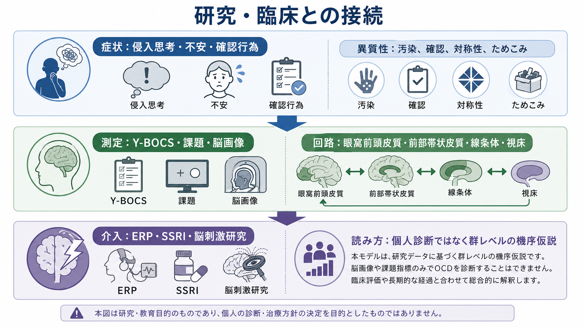
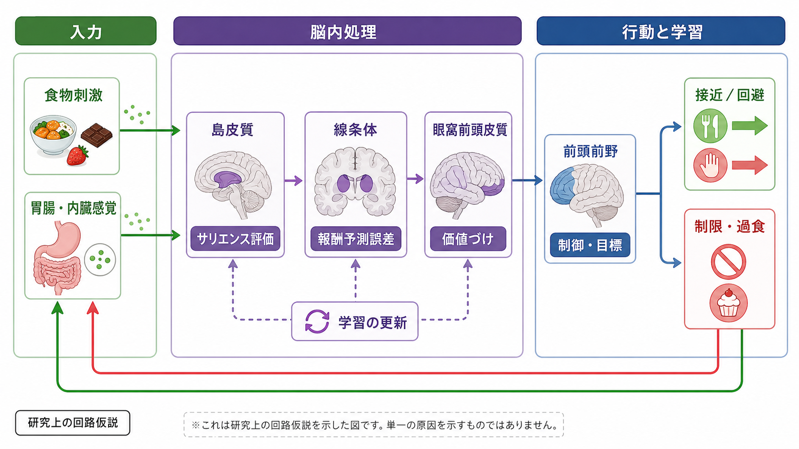
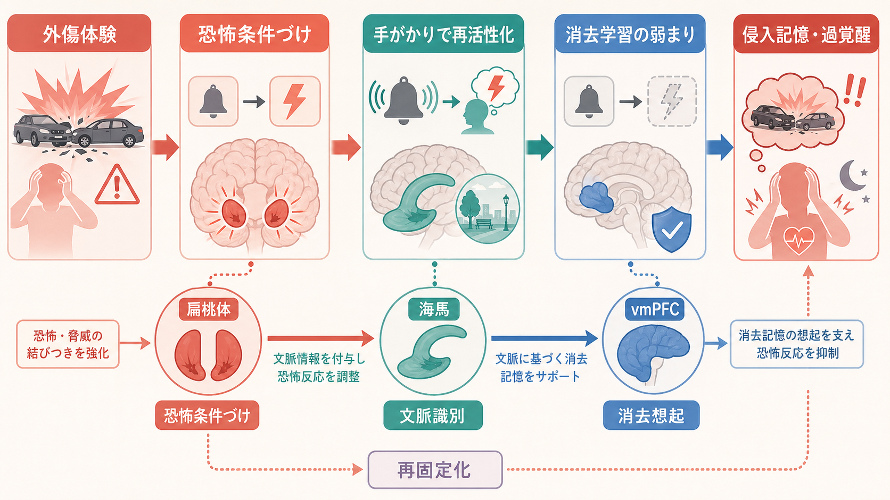

# 強迫症では皮質線条体視床回路に何が起きているのか

## 要点

- 強迫症（obsessive-compulsive disorder: OCD）は、侵入的で苦痛な思考・イメージ・衝動と、それを打ち消すための確認、洗浄、反復、心の中の儀式などが問題になる状態である[1]。
- 神経科学では、眼窩前頭皮質、前部帯状皮質、線条体、淡蒼球、視床を結ぶ皮質線条体視床皮質回路（cortico-striato-thalamo-cortical loop: CSTCループ）が中心仮説として扱われてきた[1][2]。
- ただし「CSTCループが過活動だから強迫症になる」と一文で片づけるのは単純化しすぎである。症状次元、習慣化、認知制御、不安、セロトニン・ドパミン・グルタミン酸系、発達・環境要因が重なる[1][3][6]。
- 脳画像や回路モデルは、個人診断の代替ではない。現時点では、臨床評価、生活機能、症状評価、心理社会的文脈と合わせて読む必要がある[4][5]。

## この記事で答える問い

この記事の問いは、「強迫症で反復思考や確認行為が続くとき、CSTCループという回路モデルでは何が起きていると考えられるのか」である。ここでは診断や治療指示ではなく、[[大脳基底核ループとは何か]]、[[直接路と間接路は行動選択をどう制御するのか]]、[[皮質視床ループは意識や注意にどう関わるのか]]で扱う基礎回路を、精神疾患研究へ接続する。

## まず結論

強迫症のCSTCモデルでは、皮質が「危険かもしれない」「間違っているかもしれない」という信号を強く出し、線条体の行動ゲートがその信号を十分に弱められず、視床を介して再び皮質へ戻るループが強まりやすい、と考える。結果として、本人は「もう確認した」と分かっていても、警告感・未完了感・違和感が残り、確認や洗浄などの行為によって一時的に不安を下げようとする。

この説明の重要点は、強迫行為を「意思が弱いから」ではなく、エラー検出、脅威評価、行動選択、習慣化、安心の学習が絡む回路現象として読むことである。ただし、CSTCは強迫症のすべてを説明する単一原因ではなく、前頭頭頂ネットワーク、サリエンスネットワーク、辺縁系、小脳、発達要因も含む広いネットワーク仮説の中核として位置づけるのが妥当である[1][2][3]。

## 背景

強迫症では、汚染への恐れ、加害への恐れ、対称性・正確性へのこだわり、確認、洗浄、数え直し、ためこみなど、多様な症状がみられる。Mataix-Colsらは、強迫症を単一の症状ではなく複数の症状次元をもつ状態として整理しており、同じ診断名でも目立つ困難は人によって異なる[6]。

この異質性にもかかわらず、古くから比較的一貫して注目されてきたのが前頭部と線条体を結ぶ回路である。眼窩前頭皮質は価値、罰、違和感、結果の評価に関わり、前部帯状皮質は葛藤、エラー、行動調整に関わる。これらの皮質領域は線条体へ入力し、基底核出力核と視床を経由して再び皮質へ戻る。この循環構造がCSTCループである[2]。

## 基本概念

### CSTCループ

CSTCループは、皮質から線条体へ、線条体から淡蒼球・黒質網様部などの基底核出力系へ、そこから視床を介して皮質へ戻る閉じた回路である。運動だけでなく、認知制御、情動、価値判断、習慣、行動選択にも関わる。強迫症では、特に眼窩前頭皮質、前部帯状皮質、尾状核・被殻を含む線条体、視床の結合や活動が議論される[1][2]。

### 過活動

ここでいう過活動は、単に「脳が元気に動く」という意味ではない。課題中の活動、安静時の機能的結合、代謝、構造差、治療前後の変化など、研究方法ごとに測っているものが違う。したがって、[[機能的結合解析とは何か]]や[[課題fMRIでは何を比較しているのか]]で扱うように、所見は測定法と解析法に依存して読む必要がある。

### 行動ゲート

線条体は、候補となる行動や思考を「通す」「止める」ゲートとして説明されることが多い。直接路は行動を通しやすくし、間接路は不要な行動を抑えやすくする、という単純化がよく使われる。強迫症では、このゲートが「もう十分」という停止信号をうまく反映できず、確認や洗浄の行動候補が繰り返し通りやすくなる、と考えられる[2][3]。

## 仕組み

強迫症のCSTCモデルを、確認行為の例で追うと分かりやすい。

まず、鍵を閉めた後に「閉め忘れたかもしれない」という警告信号が生じる。眼窩前頭皮質や前部帯状皮質は、危険、罰、エラー、未完了感に関係するため、この信号が強いと「確認すべき」という行動候補が立ち上がる。通常なら、記憶、状況、行動結果をもとに「もう確認済み」と判断し、線条体と基底核回路が不要な反復を抑える。

しかし、CSTCループの信号が過度に残ると、視床から皮質へ戻る入力が再び警告感を強める。確認すれば一時的に不安は下がるが、その低下は「確認すれば安心できる」という学習を強める。こうして、短期的には合理的に見える対処が、長期的には反復行為を固定化する[2][3]。

このモデルは、習慣化の観点とも接続する。Burguiereらは、線条体回路と習慣の研究から、強迫行為を「目標に応じた柔軟な行動」から「きっかけが来ると自動的に出る行動」へ偏る過程として整理している[3]。これは、本人が行為の不合理さを理解していても止めにくいことを説明する助けになる。

動物研究も、CSTCモデルを支える一部の因果的手がかりを与えている。Ahmariらはマウスで眼窩前頭皮質から腹内側線条体への投射を反復刺激し、持続的な過剰グルーミングが生じることを報告した[7]。ただし、マウスのグルーミングをヒトの強迫症と同一視することはできない。ここから言えるのは、皮質線条体入力の反復的な過活動が、反復行動を持続させる回路可塑性を生みうる、という限定的な機序仮説である。

## 図解

3枚の図は、同じ内容を粒度を変えて示している。

| 図 | 読み方 |
|---|---|
| 図1 | 強迫症を、皮質、線条体、視床の再帰的なループとして俯瞰する。 |
| 図2 | 直接路・間接路を含む行動ゲートの偏りとして、確認や洗浄が通りやすくなる仕組みを見る。 |
| 図3 | 症状評価、脳画像、ERP、SSRI、脳刺激研究を、個人診断ではなく機序仮説として位置づける。 |

## 臨床・研究との接続

臨床では、強迫症の重症度評価にYale-Brown Obsessive Compulsive Scale（Y-BOCS）がよく用いられる。Y-BOCSは強迫観念と強迫行為の重症度を、症状内容そのものから比較的独立に評価する目的で作られた尺度である[4]。研究では、Y-BOCS、症状次元、課題成績、脳画像所見、治療前後の変化を組み合わせて、CSTCループの関与を検討する。

治療との関係では、NICEガイドラインは強迫症に対して認知行動療法、とくに曝露反応妨害法（ERP）を含むCBTやSSRIを主要な選択肢として位置づけている[5]。ERPは、恐れている刺激に段階的に向き合いながら、確認や洗浄などの反応を行わずに不安の変化を学習する方法である。回路モデルから見ると、ERPは「警告信号が出ても儀式をしなくてよい」という新しい学習を通じて、CSTCループと関連ネットワークの反応性を変える可能性がある。

重症・治療抵抗例では、[[深部脳刺激DBSは神経回路をどう調節するのか]]のような脳刺激研究も行われている。Malletらは、重症強迫症に対する視床下核刺激の臨床試験を報告しており、これは基底核ループが治療標的になりうることを示す重要な研究である[8]。ただし、DBSは一般的な第一選択治療ではなく、専門的評価のもとで限定的に検討される領域である。

## よくある誤解

### 誤解1: 強迫症は「確認好き」や「きれい好き」の延長である

強迫症では、本人が望まない侵入思考や強い苦痛、時間の消費、生活機能の障害が問題になる。几帳面さや好みだけでは説明できない。回路モデルは、本人の性格や努力不足に還元しないための説明枠である。

### 誤解2: CSTCループだけで強迫症を説明できる

CSTCループは中心的だが、それだけでは不十分である。強迫症には症状次元の違いがあり、[[サリエンスネットワークとは何か]]、[[前頭前野は情動制御にどう関わるのか]]、[[脳ネットワークの破綻は精神疾患をどう説明するのか]]で扱う広域ネットワークも関与する可能性がある[1][6]。

### 誤解3: 脳画像で強迫症を個人診断できる

脳画像研究は群レベルの傾向や機序仮説を作るうえで有用だが、個人診断を単独で決める道具ではない。診断と支援は、症状、経過、苦痛、機能障害、併存症、生活背景を含めて行う必要がある。これは[[精神疾患は脳の病気なのか]]で扱う論点とも重なる。

### 誤解4: 強迫行為は不安を下げるのでよい対処である

強迫行為は短期的には安心をもたらすことがある。しかし、その安心が反復行為を強化し、長期的には「確認しないと安心できない」状態を強めることがある。このため、ERPでは不安をすぐ打ち消す行為を控え、時間経過とともに危険予測が修正される経験を重ねる[5]。

## 関連ノート

- [[大脳基底核ループとは何か]]
- [[直接路と間接路は行動選択をどう制御するのか]]
- [[皮質視床ループは意識や注意にどう関わるのか]]
- [[視床は単なる中継核なのか]]
- [[前頭前野は情動制御にどう関わるのか]]
- [[脳ネットワークの破綻は精神疾患をどう説明するのか]]
- [[精神疾患は脳の病気なのか]]
- [[深部脳刺激DBSは神経回路をどう調節するのか]]

### 今後の作成候補

- 強迫症とは何か
- 曝露反応妨害法ERPとは何か
- Y-BOCSとは何か
- 眼窩前頭皮質は価値と罰をどう評価するのか
- 尾状核は行動選択にどう関わるのか

### MOC更新候補

- `content/00_MOC/MOC｜脳・神経科学.md` の「神経科学と精神疾患」項目に本記事へのリンクを追加する候補。
- `content/00_MOC/MOC｜計算論的精神医学.md` に、強迫症の回路モデル・習慣モデル・行動学習モデルとの接続として追加する候補。

## 理解チェック

1. CSTCループの「皮質」「線条体」「視床」は、それぞれ強迫症モデルでどのような役割として説明できるか。
2. 確認行為が一時的に安心をもたらしても、長期的には反復を強めうる理由を説明できるか。
3. 強迫症をCSTCループだけで説明することの限界を挙げられるか。
4. 脳画像所見を個人診断と混同してはいけない理由を説明できるか。

## 未解決問題

- 強迫症の症状次元ごとに、CSTCループ内のどのサブ回路がどの程度異なるのか。
- CSTC過活動が症状の原因、結果、補償反応のどれに近いのか。
- ERPやSSRIによる改善が、どの時間スケールでどの回路変化として現れるのか。
- 習慣化、不安、エラー処理、身体感覚の違いを、同じ回路モデル内でどう統合するか。

## 参考文献

[1] Pauls, D. L., Abramovitch, A., Rauch, S. L., & Geller, D. A. (2014). Obsessive-compulsive disorder: an integrative genetic and neurobiological perspective. *Nature Reviews Neuroscience*, 15, 410-424. https://doi.org/10.1038/nrn3746

[2] Menzies, L., Chamberlain, S. R., Laird, A. R., Thelen, S. M., Sahakian, B. J., & Bullmore, E. T. (2008). Integrating evidence from neuroimaging and neuropsychological studies of obsessive-compulsive disorder: The orbitofronto-striatal model revisited. *Neuroscience & Biobehavioral Reviews*, 32(3), 525-549. https://doi.org/10.1016/j.neubiorev.2007.09.005

[3] Burguiere, E., Monteiro, P., Mallet, L., Feng, G., & Graybiel, A. M. (2015). Striatal circuits, habits, and implications for obsessive-compulsive disorder. *Current Opinion in Neurobiology*, 30, 59-65. https://doi.org/10.1016/j.conb.2014.08.008

[4] Goodman, W. K., Price, L. H., Rasmussen, S. A., et al. (1989). The Yale-Brown Obsessive Compulsive Scale. I. Development, use, and reliability. *Archives of General Psychiatry*, 46(11), 1006-1011. https://doi.org/10.1001/archpsyc.1989.01810110048007

[5] National Institute for Health and Care Excellence. (2005). *Obsessive-compulsive disorder and body dysmorphic disorder: treatment* (Clinical guideline CG31). https://www.ncbi.nlm.nih.gov/books/n/nicecg31/ch10/

[6] Mataix-Cols, D., do Rosario-Campos, M. C., & Leckman, J. F. (2005). A multidimensional model of obsessive-compulsive disorder. *American Journal of Psychiatry*, 162(2), 228-238. https://doi.org/10.1176/appi.ajp.162.2.228

[7] Ahmari, S. E., Spellman, T., Douglass, N. L., et al. (2013). Repeated cortico-striatal stimulation generates persistent OCD-like behavior. *Science*, 340(6137), 1234-1239. https://doi.org/10.1126/science.1234733

[8] Mallet, L., Polosan, M., Jaafari, N., et al. (2008). Subthalamic nucleus stimulation in severe obsessive-compulsive disorder. *New England Journal of Medicine*, 359(20), 2121-2134. https://doi.org/10.1056/NEJMoa0708514
