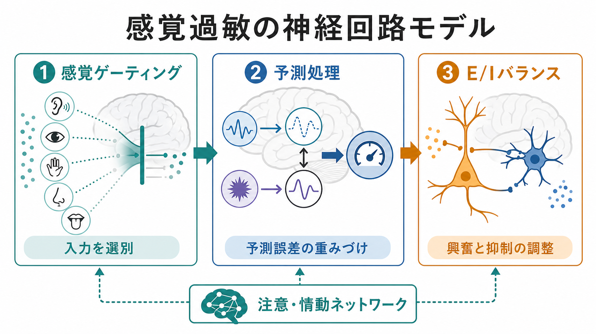
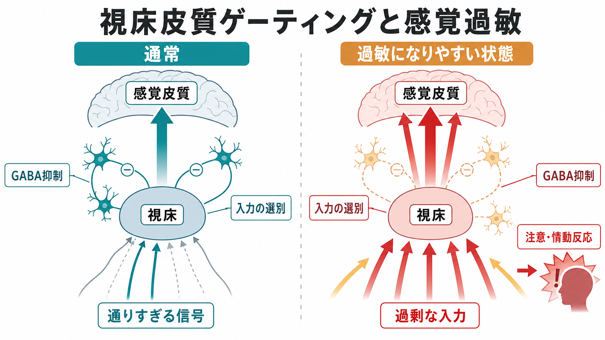

# 感覚過敏は神経回路でどう説明できるのか

## 要点

- 感覚過敏は、音・光・触覚・におい・身体感覚などが「強すぎる」「痛い」「逃げたい」と感じられる状態である。
- 神経回路の観点では、単に感覚器が鋭いというより、入力を絞る感覚ゲーティング、予測誤差への重みづけ、興奮性・抑制性バランス、注意・情動ネットワークの相互作用として理解しやすい。
- ASDでは感覚刺激への過反応・低反応・感覚探索が診断基準にも含まれるが、感覚過敏はASDだけに限られない[1][2]。
- E/Iバランスは有用な説明軸だが、単一の「抑制不足」だけで説明できるものではない。発達段階、脳部位、課題、疲労、不安、睡眠、環境文脈を合わせて考える必要がある[7][8]。

## この記事で答える問い

感覚過敏は、本人の主観的なつらさとして経験される。一方で、研究では脳波、fMRI、MRS、行動評価、質問紙などを通じて、神経回路のどの段階で入力が増幅されるのかを調べる。このノートでは、感覚過敏を次の問いに分けて整理する。

1. どの入力を通すかを決める感覚ゲーティングは、過敏性とどう関係するのか。
2. 予測処理では、なぜ同じ刺激が「毎回新しい」「無視できない」ものとして感じられるのか。
3. [[E_Iバランス異常は精神疾患をどう説明するのか|E/Iバランス]]や[[GABA機能低下は統合失調症にどう関わるのか|GABA機能]]は、過敏性のどこを説明できるのか。
4. 研究知見を、臨床や支援の理解にどう接続すればよいのか。

## まず結論

感覚過敏は、感覚入力の「入口」から「意味づけ」までの複数段階で、信号のゲインが高くなりすぎる現象として捉えられる。視床や一次感覚皮質で不要な入力を十分に絞れないと、背景音や衣服の触覚のような刺激が意識に残りやすくなる。皮質回路で予測誤差が強く重みづけられると、慣れているはずの刺激も毎回目立つ。さらに不安、疲労、警戒、過去の不快経験が加わると、島皮質、扁桃体、前頭前野などの注意・情動ネットワークが刺激の重要度を高く評価し、回避や苦痛につながりやすい[3][6]。

## 背景

感覚過敏は、発達障害の文脈で語られることが多い。ASDの診断基準では、感覚入力への過反応または低反応、あるいは感覚的側面への強い関心が、限定的・反復的行動様式の一部として扱われる[1]。ただし、これは「感覚過敏がASDの人だけに起こる」という意味ではない。不安、PTSD、統合失調症、慢性疼痛、片頭痛、睡眠不足、ストレス状態でも、感覚刺激への耐性は変化しうる。

RobertsonとBaron-Cohenのレビューは、ASDの感覚症状を社会認知の二次的結果としてではなく、知覚・注意・神経回路の違いとして直接検討すべきだと整理している[2]。この見方は、[[神経科学は精神疾患をどのように説明できるのか]]という大きな問いにもつながる。精神症状を「気の持ちよう」としてではなく、身体・環境・脳回路の相互作用として扱えるからである。

## 基本概念

### 感覚ゲーティング

感覚ゲーティングとは、反復する刺激や重要度の低い刺激への反応を弱め、必要な情報だけを通しやすくする仕組みである。脳波研究では、同じクリック音を短い間隔で2回提示し、2回目のP50反応がどの程度抑制されるかを見ることがある。P50ゲーティングは統合失調症研究でよく用いられてきたが、より広く「不要な入力をどれだけ絞れるか」を考える入口になる[5]。

ゲーティングが弱いと、背景音、蛍光灯のちらつき、衣服の肌触り、他人の動きなどが、無視できる情報として背景に退きにくい。これは[[前頭前野は情動制御にどう関わるのか|前頭前野]]のトップダウン制御や、視床皮質回路、感覚皮質の局所抑制とも関係する。

### 予測処理

予測処理では、脳は外界を受動的に写し取る装置ではなく、次に来る入力を予測し、実際の入力との差である予測誤差を更新するシステムと考える。ここで重要なのは、予測誤差そのものだけでなく、その誤差をどれほど信頼するか、つまり精度の重みづけである。

PellicanoとBurrは、ASDの知覚をベイズ的な枠組みから説明し、事前予測が弱い、あるいは感覚入力の重みが相対的に強い場合、世界が過度に「生々しく」「変化し続ける」ものとして感じられうると論じた[6]。この仮説は決定的な結論ではないが、感覚過敏を「入力が強い」だけでなく「予測と誤差のバランスが変わる」問題として読む視点を与える。

### E/Iバランス

E/Iバランスとは、興奮性入力と抑制性入力のつり合いである。興奮性活動は信号を広げ、抑制性活動はタイミングをそろえ、不要な活動を絞り、回路の安定性を支える。RubensteinとMerzenichは、ASDの一部を主要な神経システムにおける興奮/抑制比の上昇として説明するモデルを提案した[7]。その後の研究では、この仮説は有力な入口である一方、脳部位、発達段階、細胞種、測定方法によって意味が変わることも強調されている[8]。

## 仕組み

### 1. 入力段階: 弱い刺激が残りやすくなる

視床、脳幹、一次感覚皮質は、感覚入力を単純に中継するだけでなく、反復性・新規性・重要度に応じて信号を調整する。感覚ゲーティングが弱いと、通常なら背景に退く刺激が、意識や行動を占有しやすくなる。

Woodらは、ASD児を対象にMRSと機能的結合を組み合わせ、感覚過反応の強さが視床皮質回路におけるGABA作動性抑制の低さ、また体性感覚皮質のグルタミン酸濃度の高さと関連することを報告した[4]。これは因果を一挙に証明するものではないが、[[グルタミン酸仮説は統合失調症をどう説明するのか|グルタミン酸]]とGABAの局所バランスが感覚過敏の個人差に関係しうることを示す。

### 2. 皮質段階: 増幅と慣れの問題

感覚皮質では、入力の強さだけでなく、コントラスト、時間変化、空間パターン、注意の向きによって活動が変わる。通常は同じ刺激に繰り返し接すると反応が弱まるが、慣れが不十分だと刺激は目立ち続ける。これは「敏感すぎる性格」ではなく、回路のゲイン調整と学習の問題として考えられる。

E/Iバランスの乱れは、この段階で信号対雑音比を変える。抑制が弱い場合、活動が広がりやすくなる。一方で、抑制が強すぎても入力の時間構造が不自然に切られ、予測や統合が乱れる可能性がある。したがって「抑制不足だから過敏」とだけ言うのは単純化しすぎである[8]。

### 3. 予測段階: 誤差が高く評価される

日常環境の刺激は常に少しずつ変化する。予測処理の観点では、脳はその変化を「無視してよい誤差」と見るか、「重要な変化」と見るかを決めている。感覚過敏では、予測誤差の精度が高く見積もられ、刺激が毎回新しく、強く、避けるべきものとして感じられる可能性がある[6]。

この説明は、音量そのものが大きくないのに「刺さる」、服のタグが「意識から消えない」、人混みで複数の音が同時に迫ってくる、という体験を理解しやすくする。ただし、予測処理モデルは行動、神経計測、主観報告をつなぐ仮説であり、個々人の症状を単独で診断する道具ではない。

### 4. 注意・情動段階: サリエンスが増幅される

GreenらのfMRI研究では、ASDの若者が軽度不快な聴覚・触覚刺激を受けたとき、一次感覚皮質だけでなく、扁桃体や眼窩前頭皮質など情動・評価に関わる領域にも過反応がみられた[3]。これは、感覚過敏が感覚皮質だけの問題ではなく、「その刺激が自分にとって危険か、不快か、逃げるべきか」を評価するネットワークとも結びつくことを示す。

そのため、感覚過敏は疲労、不安、睡眠不足、ストレス、過去の不快経験で変動しやすい。[[扁桃体過活動は不安症やPTSDにどう関わるのか|扁桃体]]や前頭前野の状態が変われば、同じ音や光でも耐えやすさが変わる。

## 図解

次の図は、研究指標と臨床的理解の接続を整理したものである。P50やPPIはゲーティング、EEGやfMRIは時間的・空間的な反応、MRSはGABAやグルタミン酸の濃度、質問紙は日常の困りごとをそれぞれ違う角度から捉える。

| 観点 | 代表的な測定 | 解釈上の注意 |
|---|---|---|
| 感覚ゲーティング | P50、PPI、反復刺激への慣れ | 抑制性フィルタの一側面であり、日常の過敏性と一対一対応しない |
| 神経活動 | EEG、MEG、fMRI | 刺激の種類、課題、注意、疲労で変わる |
| 神経化学 | MRSによるGABA・グルタミン酸 | 空間解像度や測定部位に制限がある |
| 行動・主観 | 質問紙、観察、本人の語り | 実験室反応と生活上の困難はずれることがある |

## 臨床・研究との接続

臨床的には、感覚過敏を「わがまま」「気にしすぎ」「慣れればよい」と扱わないことが重要である。神経回路の説明は、本人の体験を研究可能な現象として扱うための枠組みになる。ただし、個別の診断や治療方針は、本人の生活歴、発達歴、併存症状、環境、身体疾患、薬剤、睡眠、ストレスを含めて専門家と検討する必要がある。

研究上は、主観的な感覚過敏と神経指標をどう対応づけるかが難しい。P50、MRS、fMRI、質問紙はそれぞれ異なるレベルを測っている。したがって、ひとつのバイオマーカーで「感覚過敏の原因」を決めるより、複数の測定を組み合わせ、個人内でどの条件で悪化・軽減するかを見る方が実用的である。

支援の理解としては、刺激量を下げる、予測可能性を高める、休息時間を確保する、逃げ場を用意する、本人が説明しやすい言葉を持つ、といった環境調整が神経回路のゲインを下げる条件づくりとして理解できる。これは個別の治療指示ではなく、研究知見から見た一般的な考え方である。

## よくある誤解

### 誤解1: 感覚過敏は感覚器が優れているという意味である

感覚過敏は、音がよく聞こえる、視力が高い、触覚が鋭い、という単純な能力ではない。入力の選別、慣れ、予測誤差、情動評価が重なった結果として、不快さや疲労が増える状態である。

### 誤解2: E/Iバランスを測れば感覚過敏を診断できる

E/Iバランスは便利な研究概念だが、単一の臨床検査値ではない。脳部位、発達段階、測定方法によって意味が変わるため、診断や支援をそれだけで決めることはできない[8]。

### 誤解3: 感覚過敏はASDだけの特徴である

ASDでは感覚反応の違いが重要な特徴として扱われるが、感覚過敏はASDに限定されない。不安、PTSD、慢性疼痛、片頭痛、睡眠不足、ストレスなどでも、刺激への耐性は変化する。

### 誤解4: 慣れさせれば必ずよくなる

慣れは重要だが、無理な曝露は警戒や回避を強めることがある。予測可能性、刺激量、休息、本人のコントロール感を調整することが、回路のゲインを下げる条件になりうる。

## 関連ノート

- [[E_Iバランス異常は精神疾患をどう説明するのか]]
- [[GABA機能低下は統合失調症にどう関わるのか]]
- [[グルタミン酸仮説は統合失調症をどう説明するのか]]
- [[神経発達の異常は精神疾患にどう関わるのか]]
- [[前頭前野は情動制御にどう関わるのか]]
- [[扁桃体過活動は不安症やPTSDにどう関わるのか]]
- [[神経科学は精神疾患をどのように説明できるのか]]

## 理解チェック

1. 感覚ゲーティングが弱いと、日常環境ではどのような刺激が残りやすくなるか。
2. 予測処理では、感覚過敏を「入力が強い」だけでなく、どのような重みづけの問題として説明できるか。
3. E/Iバランス仮説を使うとき、なぜ単一原因モデルにしてはいけないのか。
4. 感覚皮質だけでなく、注意・情動ネットワークを考える必要があるのはなぜか。

## 未解決問題

- 主観的な苦痛と、P50、PPI、MRS、fMRIなどの神経指標は、個人内でどこまで対応づけられるのか。
- 感覚過敏、感覚鈍麻、感覚探索が同じ人の中で併存するとき、回路モデルをどう統合するのか。
- 発達段階、睡眠、ストレス、薬剤、ホルモン、生活環境は、感覚ゲインにどのように影響するのか。
- 予測処理モデルの「精度」を、行動課題・神経計測・臨床評価の間でどう同定するのか。

## MOC更新候補

- `content/00_MOC/` 内の神経科学・精神疾患関連MOCに、「神経回路」「感覚処理」「E/Iバランス」周辺のノートとして追加候補。
- 並列ジョブとの競合を避けるため、本タスクではMOCファイル自体は更新しない。

## 参考文献

[1] Centers for Disease Control and Prevention. Clinical Testing and Diagnosis for Autism Spectrum Disorder. https://www.cdc.gov/autism/hcp/diagnosis/index.html

[2] Robertson, C. E., & Baron-Cohen, S. (2017). Sensory perception in autism. *Nature Reviews Neuroscience*, 18, 671-684. https://doi.org/10.1038/nrn.2017.112

[3] Green, S. A., Rudie, J. D., Colich, N. L., et al. (2013). Over-reactive brain responses to sensory stimuli in youth with autism spectrum disorders. *Journal of the American Academy of Child & Adolescent Psychiatry*, 52(11), 1158-1172. https://doi.org/10.1016/j.jaac.2013.08.004

[4] Wood, E. T., Cummings, K. K., Jung, J., et al. (2021). Sensory over-responsivity is related to GABAergic inhibition in thalamocortical circuits. *Translational Psychiatry*, 11, 39. https://doi.org/10.1038/s41398-020-01154-0

[5] Freedman, R., Olsen-Dufour, A. M., & Olincy, A. (2020). P50 inhibitory sensory gating in schizophrenia: analysis of recent studies. *Schizophrenia Research*, 218, 93-98. https://doi.org/10.1016/j.schres.2020.02.003

[6] Pellicano, E., & Burr, D. (2012). When the world becomes too real: a Bayesian explanation of autistic perception. *Trends in Cognitive Sciences*, 16(10), 504-510. https://doi.org/10.1016/j.tics.2012.08.009

[7] Rubenstein, J. L. R., & Merzenich, M. M. (2003). Model of autism: increased ratio of excitation/inhibition in key neural systems. *Genes, Brain and Behavior*, 2(5), 255-267. https://doi.org/10.1034/j.1601-183X.2003.00037.x

[8] Nelson, S. B., & Valakh, V. (2015). Excitatory/Inhibitory balance and circuit homeostasis in autism spectrum disorders. *Neuron*, 87(4), 684-698. https://doi.org/10.1016/j.neuron.2015.07.033
