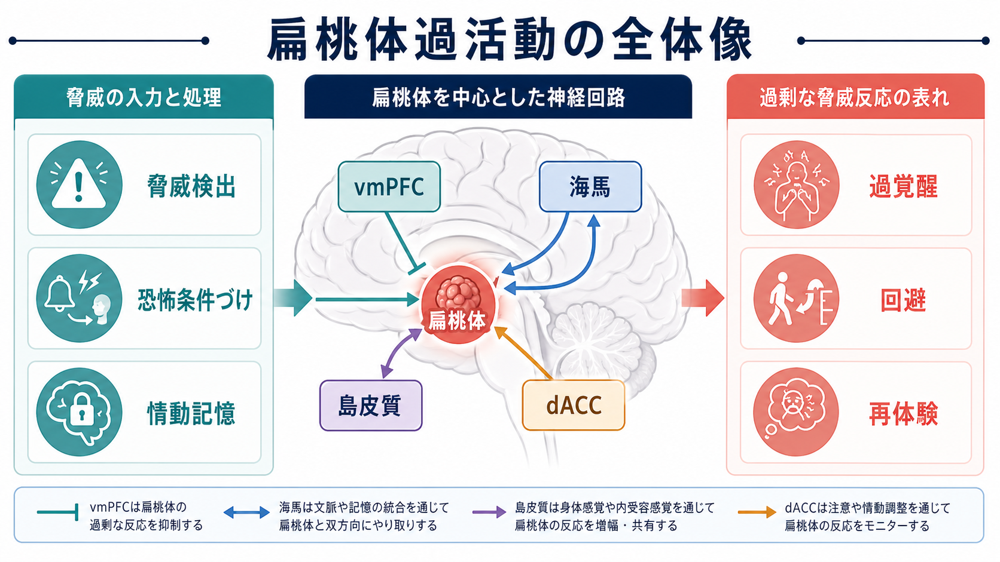
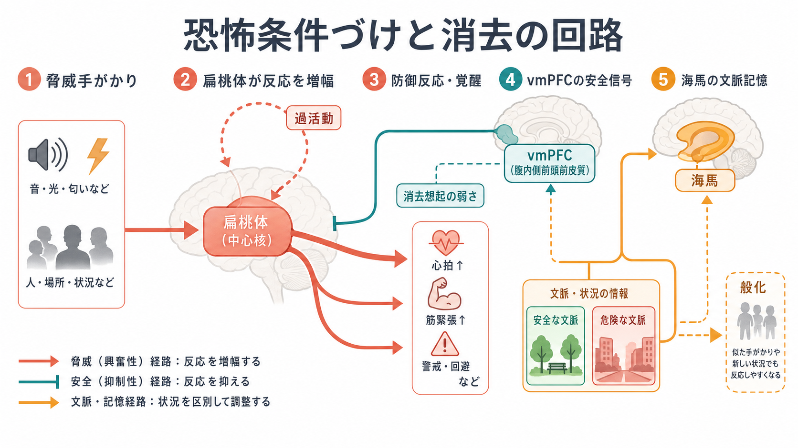
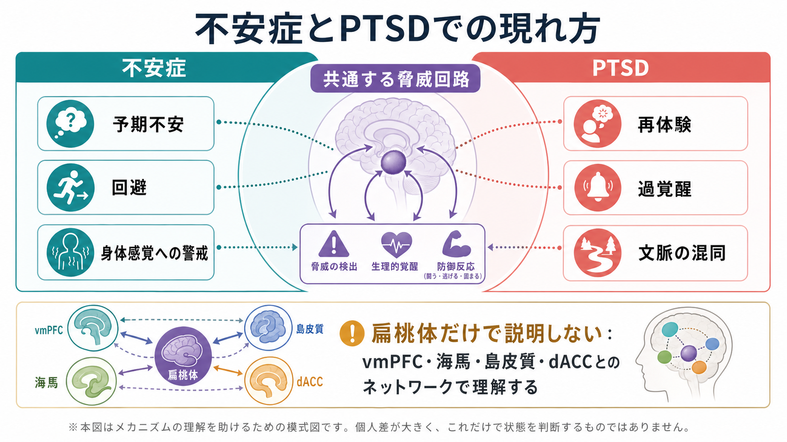

# 扁桃体過活動は不安症やPTSDにどう関わるのか

## 要点

- 扁桃体は「恐怖の中枢」というより、危険を示す手がかり、身体反応、過去の情動記憶を結びつけ、防御反応の優先度を上げる回路の要所である[1][2]。
- 不安症やPTSDでは、脅威関連刺激に対する扁桃体・島皮質などの反応亢進と、前頭前野・海馬による安全信号や文脈調整の弱さが組み合わさる、というモデルがよく使われる[3][4][8]。
- PTSDでは、外傷関連手がかりが「いま危険がある」かのように処理され、再体験、過覚醒、回避につながる可能性がある。ただし、扁桃体だけでPTSDを説明できるわけではない[4][8]。
- 恐怖消去は恐怖記憶の単純な削除ではなく、vmPFCや海馬を含む安全学習の想起であり、この過程の弱さが恐怖反応の持続や般化に関わる[6][7]。
- ここでの説明は教育・研究目的であり、個別の診断や治療方針を決めるものではない。

## この記事で答える問い

1. 扁桃体過活動とは、神経回路のどのような状態を指すのか。
2. それは不安症やPTSDの症状と、どのように結びつけて考えられるのか。
3. 恐怖条件づけ、消去、情動記憶、文脈処理はどこで関わるのか。
4. 「扁桃体が過活動だから不安症になる」という単純化のどこが危ないのか。

## まず結論

扁桃体過活動は、不安症やPTSDを説明するときの中心概念の一つだが、単独の原因ではない。より正確には、扁桃体を中心とする脅威処理回路が、前頭前野による抑制、海馬による文脈識別、島皮質による身体感覚の評価、dACCによる恐怖表出や注意調整と相互作用する。その結果、危険の手がかりが過大評価され、安全な状況でも防御反応が起こりやすくなる、という理解が妥当である[3][4][8]。

## 背景

扁桃体研究の基礎は、動物の恐怖条件づけ研究から大きく発展した。音や光などの中立刺激が、痛みや強い脅威と繰り返し結びつくと、その刺激だけで防御反応が起こるようになる。このとき外側扁桃体は感覚入力と脅威経験を結びつける重要な部位とされ、扁桃体内のシナプス可塑性が恐怖学習の細胞基盤として研究されてきた[1][2]。

ヒトの不安症やPTSD研究では、この基礎モデルが脳画像研究と接続された。機能的MRIやPETのメタ分析では、PTSD、社交不安症、特定の恐怖症などで、情動刺激に対する扁桃体や島皮質の反応増大が報告されている[3]。PTSDの神経回路モデルでは、扁桃体反応の増大、内側前頭前野の調整不足、海馬の文脈処理の弱さが、再体験、過覚醒、回避、文脈の混同に関わると考えられてきた[4][8]。

ここで重要なのは、脳画像で観察される「過活動」は、個人の診断をそのまま決める指標ではないという点である。課題、刺激、解析方法、薬物、併存症、発症時期、外傷経験の性質によって結果は変わる。したがって、扁桃体過活動は診断ラベルではなく、症状を神経回路レベルで読むためのモデルとして扱う必要がある。

## 基本概念

### 扁桃体

扁桃体は側頭葉内側にある複数核からなる構造で、脅威手がかり、報酬・嫌悪価、身体反応、記憶との結びつきに関わる。恐怖条件づけでは、外側扁桃体が感覚入力を受け取り、中心核などを介して自律神経反応、すくみ、警戒などの防御反応を出力する、と整理されることが多い[1][2]。

### 過活動

過活動とは、単に「常に活動が高い」という意味ではない。多くの場合、脅威顔、外傷関連手がかり、予期不安を誘発する刺激などに対して、対照群より大きなBOLD反応や血流反応が観察されることを指す。したがって、[[BOLD信号とは何か]]や[[fMRIは神経活動を直接測っているのか]]で扱うように、測定値は神経活動そのものではなく、課題と解析に依存する間接指標である。

### 恐怖条件づけと消去

恐怖条件づけは、特定の手がかりが危険を予測するように学習される過程である。一方、消去は恐怖記憶の削除ではなく、「この状況ではその手がかりは危険ではない」という新しい安全学習である。ヒト研究では、消去想起にvmPFCと海馬が協調して関わることが示されており、安全な文脈で恐怖反応を弱める仕組みとして重要である[6][7]。

### 情動記憶と文脈

PTSDで問題になるのは、外傷記憶が単に強いことだけではない。断片的な感覚、身体反応、場所、匂い、音などが、現在の安全な文脈から切り離されて再活性化しやすい点が重要である。[[海馬回路は記憶をどう形成するのか]]で扱うように、海馬は文脈やエピソード記憶の統合に関わるため、扁桃体との相互作用が「いま本当に危険か」を判定する上で重要になる。

## 仕組み

### 1. 脅威検出が強くなる

不安症やPTSDでは、曖昧な表情、身体感覚、場所、音、外傷を連想させる刺激などが、脅威手がかりとして処理されやすくなる。扁桃体はこれらの手がかりに対して防御反応の優先度を上げ、視線、注意、自律神経反応、筋緊張、回避行動を動員する。メタ分析では、PTSD、社交不安症、特定の恐怖症において、情動処理課題中の扁桃体・島皮質の反応亢進が示されている[3]。

### 2. 身体感覚が「危険の証拠」になりやすい

島皮質は、心拍、呼吸、胃腸感覚、痛み、息苦しさなどの内受容感覚と関わる。扁桃体と島皮質の反応が高まると、身体の小さな変化が「何か危険が起きている」という主観的確信につながりやすい。これはパニック、不安予期、過覚醒の理解に役立つ。関連する広域回路としては、[[サリエンスネットワークとは何か]]も参照できる。

### 3. 前頭前野の安全信号が弱まる

vmPFCは、扁桃体反応を状況に応じて抑え、安全な文脈では防御反応を下げる働きに関わる。PTSDモデルでは、扁桃体の反応増大だけでなく、内側前頭前野の調整機能の低下が重要とされる[4][8]。これは「理性で恐怖を抑える」という単純な話ではなく、安全学習を想起し、現在の状況に応じて反応を調整する回路の問題として考える方が正確である。

### 4. 海馬の文脈処理が弱いと般化が起こる

海馬は、場所、時間、状況、出来事のまとまりを扱う。もし海馬による文脈識別が弱いと、「危険だった場所」と「似ているが安全な場所」の区別がつきにくくなる。PTSDでは、外傷関連手がかりが安全な現在文脈から切り離され、過去の危険が現在に侵入するように再体験される、というモデルが提案されている[4][8]。

### 5. dACCは恐怖表出と注意の維持に関わる

dACCは、恐怖反応の表出、葛藤、注意、行動準備に関わる領域として研究されている。扁桃体が脅威信号を強め、dACCがその信号に注意や行動準備を割り当てると、警戒が下がりにくくなる。これは、危険が去った後も身体が戦闘・逃走モードから戻りにくい状態として理解できる。

## 図解

図1は、脅威検出、恐怖条件づけ、情動記憶、過覚醒、回避、再体験を、扁桃体中心の回路としてまとめている。ポイントは、扁桃体が孤立して働くのではなく、vmPFC、海馬、島皮質、dACCと相互作用することで症状に近い現象が生じる点である。

図2は、恐怖条件づけと消去の回路を示している。脅威手がかりが扁桃体反応を増幅し、防御反応・覚醒を引き起こす一方で、vmPFCは安全信号、海馬は文脈情報を与える。消去想起が弱いと、危険が去った後も反応が残りやすい。

図3は、不安症とPTSDの違いと重なりを示している。不安症では予期不安、回避、身体感覚への警戒が目立ちやすく、PTSDでは再体験、過覚醒、外傷文脈の混同が中心になりやすい。ただし、どちらも扁桃体中心の脅威回路だけではなく、複数ネットワークの問題として読む必要がある。

## 臨床・研究との接続

### PTSD

PTSDの神経回路モデルでは、外傷関連手がかりに対する扁桃体反応の増大、前頭前野の調整不足、海馬の文脈処理の弱さが中心に置かれる[4][8]。この組み合わせにより、外傷を思い出させる音、匂い、場所、身体感覚が、現在の安全な状況でも強い脅威信号として処理される可能性がある。再体験や過覚醒は、この回路モデルから理解しやすい。

ただし、PTSDは扁桃体だけの疾患ではない。ストレスホルモン、ノルアドレナリン、睡眠、炎症、遺伝的脆弱性、発達歴、外傷の反復性、社会的支援など、多くの要因が関わる[8]。脳回路モデルは、症状を理解する地図であって、個別の診断や治療指示そのものではない。

### 不安症

不安症では、将来の脅威を予測し、それに備える反応が過剰になる。社交不安症では他者の評価や表情、特定の恐怖症では特定対象、パニック症では身体感覚が脅威手がかりになりやすい。メタ分析は、PTSD、社交不安症、特定の恐怖症に共通して、情動処理時の扁桃体・島皮質反応の亢進を報告している[3]。一方で、不安症の種類ごとに、前頭前野、線条体、島皮質、視覚領域などの関与は異なる。

### 研究での使い方

研究では、扁桃体過活動を「病気の原因」と断定するのではなく、仮説として扱う。たとえば、外傷関連刺激に対する扁桃体反応、消去学習中のvmPFC活動、文脈識別課題中の海馬活動、安静時の機能的結合などを組み合わせることで、症状のどの側面がどの回路に関わるかを検討できる。これは[[機能的結合解析とは何か]]や[[課題fMRIでは何を比較しているのか]]とも接続する。

## よくある誤解

### 誤解1: 扁桃体が大きく活動すれば、必ず不安症やPTSDである

違う。扁桃体は健康な人でも脅威、驚き、曖昧な刺激、重要な社会的刺激に反応する。過活動は集団差として観察されることが多く、個人の診断を単独で決めるものではない。

### 誤解2: 扁桃体は恐怖だけを処理する

違う。扁桃体は恐怖だけでなく、刺激の情動的・動機づけ的な重要性、記憶の増強、注意の配分にも関わる[1]。したがって「恐怖中枢」とだけ呼ぶと、機能を狭く見すぎる。

### 誤解3: 消去とは恐怖記憶を消すことである

違う。消去は新しい安全学習であり、元の恐怖記憶と競合する。だから、文脈が変わったりストレスが強まったりすると、恐怖反応が再び出ることがある[6][7]。

### 誤解4: PTSDは外傷記憶が強すぎるだけで説明できる

不十分である。PTSDでは、記憶の強さだけでなく、断片化、文脈からの切り離し、身体反応、回避、睡眠、注意、予測、社会的意味づけが絡む。扁桃体、海馬、前頭前野の相互作用として理解する必要がある[4][8]。

## 関連ノート

- [[精神疾患は脳の病気なのか]]
- [[脳ネットワークの破綻は精神疾患をどう説明するのか]]
- [[海馬回路は記憶をどう形成するのか]]
- [[サリエンスネットワークとは何か]]
- [[BOLD信号とは何か]]
- [[fMRIは神経活動を直接測っているのか]]
- [[機能的結合解析とは何か]]
- [[課題fMRIでは何を比較しているのか]]

### 関連ノート候補

- 扁桃体とは何か
- 恐怖条件づけとは何か
- 恐怖消去とは何か
- PTSDの神経回路モデルとは何か
- 島皮質と内受容感覚は不安にどう関わるのか
- dACCは恐怖表出にどう関わるのか

### MOC更新候補

- `content/00_MOC/MOC｜脳・神経科学.md`
- `content/00_MOC/MOC｜精神医学.md`
- `content/00_MOC/MOC｜基礎神経科学.md`

並列ジョブとの競合を避けるため、本タスクではMOC本文は更新しない。

## 理解チェック

1. 扁桃体過活動を「扁桃体だけの問題」と見なすと、どの回路要素が見落とされるか。
2. 恐怖条件づけと恐怖消去は、どのように違うか。
3. PTSDで海馬の文脈処理が弱いと、どのような症状理解につながるか。
4. 不安症とPTSDで共通する脅威回路と、異なりやすい現れ方は何か。
5. 脳画像の扁桃体反応を、個人診断にそのまま使えない理由は何か。

## 参考文献

[1] Phelps, E. A., & LeDoux, J. E. (2005). Contributions of the amygdala to emotion processing: from animal models to human behavior. *Neuron, 48*(2), 175-187. https://doi.org/10.1016/j.neuron.2005.09.025

[2] Blair, H. T., Schafe, G. E., Bauer, E. P., Rodrigues, S. M., & LeDoux, J. E. (2001). Synaptic plasticity in the lateral amygdala: a cellular hypothesis of fear conditioning. *Learning & Memory, 8*(5), 229-242. https://doi.org/10.1101/lm.30901

[3] Etkin, A., & Wager, T. D. (2007). Functional neuroimaging of anxiety: a meta-analysis of emotional processing in PTSD, social anxiety disorder, and specific phobia. *American Journal of Psychiatry, 164*(10), 1476-1488. https://doi.org/10.1176/appi.ajp.2007.07030504

[4] Rauch, S. L., Shin, L. M., & Phelps, E. A. (2006). Neurocircuitry models of posttraumatic stress disorder and extinction: human neuroimaging research-past, present, and future. *Biological Psychiatry, 60*(4), 376-382. https://doi.org/10.1016/j.biopsych.2006.06.004

[5] Shin, L. M., Wright, C. I., Cannistraro, P. A., et al. (2005). A functional magnetic resonance imaging study of amygdala and medial prefrontal cortex responses to overtly presented fearful faces in posttraumatic stress disorder. *Archives of General Psychiatry, 62*(3), 273-281. https://doi.org/10.1001/archpsyc.62.3.273

[6] Milad, M. R., Wright, C. I., Orr, S. P., Pitman, R. K., Quirk, G. J., & Rauch, S. L. (2007). Recall of fear extinction in humans activates the ventromedial prefrontal cortex and hippocampus in concert. *Biological Psychiatry, 62*(5), 446-454. https://doi.org/10.1016/j.biopsych.2006.10.011

[7] Milad, M. R., Rosenbaum, B. L., & Simon, N. M. (2014). Neuroscience of fear extinction: implications for assessment and treatment of fear-based and anxiety related disorders. *Behaviour Research and Therapy, 62*, 17-23. https://doi.org/10.1016/j.brat.2014.08.006

[8] Pitman, R. K., Rasmusson, A. M., Koenen, K. C., Shin, L. M., Orr, S. P., Gilbertson, M. W., Milad, M. R., & Liberzon, I. (2012). Biological studies of post-traumatic stress disorder. *Nature Reviews Neuroscience, 13*(11), 769-787. https://doi.org/10.1038/nrn3339

## 未解決問題

- 扁桃体過活動が、外傷後の原因要因なのか、結果なのか、脆弱性なのかを個人レベルでどう区別するか。
- PTSDの下位タイプや併存症ごとに、扁桃体、vmPFC、海馬、島皮質、dACCのどの結合変化が最も重要か。
- 恐怖消去、再固定化、文脈学習、睡眠、身体感覚の変化を、同じ回路モデルでどこまで統合できるか。
- 脳画像指標を、診断ではなく予後予測や介入反応の研究にどう慎重に接続するか。
