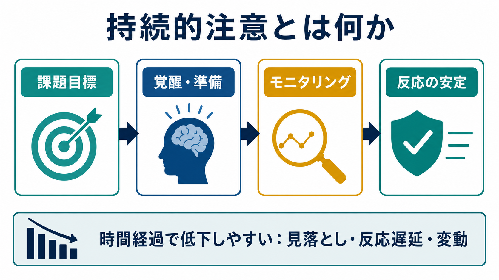
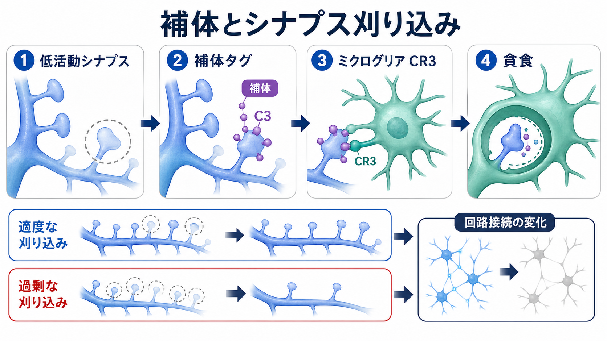
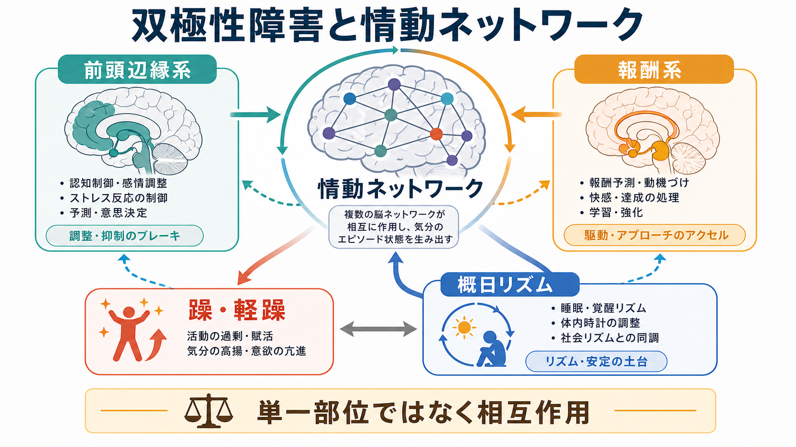

# 摂食障害は脳の報酬系や身体感覚とどう関わるのか

## 要点

- 摂食障害は「食べたい／食べたくない」という意思の問題だけではなく、食物報酬、身体内部の感覚、自己身体イメージ、前頭前野による制御が絡む多層的な病態として理解される[1][2]。
- 食物刺激は、腹側線条体、島皮質、眼窩前頭皮質、前帯状皮質、視床下部などを含む報酬・サリエンス・恒常性ネットワークで処理される。神経性やせ症、神経性過食症、過食性障害では、このネットワークの反応や学習の仕方が異なる可能性がある[3][4]。
- 島皮質は、味覚、胃腸感覚、空腹・満腹、不安、嫌悪、自己感覚を結びつける領域であり、摂食障害の「身体の感じ方」と「食物の意味づけ」を考えるうえで重要である[5][6]。
- 自己身体イメージは、視覚的な体形認知だけでなく、内受容感覚、情動、社会比較、自己評価を含む。神経画像研究では、頭頂葉、島皮質、前頭前野、扁桃体などの関与が報告されている[7]。
- ただし、脳画像や報酬反応だけで個人の診断や治療方針を決めることはできない。臨床では症状、身体状態、発達歴、併存症、生活環境を統合して評価する必要がある[1][8]。

## この記事で答える問い

1. 摂食障害では、食物報酬や報酬予測誤差がどのように関わるのか。
2. 島皮質と内受容感覚は、空腹、満腹、嫌悪、不安、自己身体イメージをどう結びつけるのか。
3. 前頭前野による制御は、制限、過食、回避をどう支え、どう固定化しうるのか。
4. 神経科学の知見を、研究・臨床でどこまで使ってよいのか。

## まず結論

摂食障害を脳回路から見ると、中心にあるのは「食物の価値」と「身体の状態」を脳がどう予測し、学習し、制御するかという問題である。食物は本来、味、匂い、満腹、安心、社会的文脈と結びついた強い報酬刺激である。しかし摂食障害では、食物が快だけでなく、不安、嫌悪、罪悪感、体形変化への恐れ、制御感と結びつくことがある。

このとき、[[依存症は報酬学習の病態としてどう理解できるのか]]で扱う報酬学習と同じく、重要なのは単純な快感の強さだけではない。予測と結果のずれ、つまり報酬予測誤差、身体内部からの信号、過去の学習、社会的意味づけが行動を変える。島皮質は、味覚や胃腸感覚だけでなく「この身体状態は危険か、安全か」「この感覚をどう解釈するか」に関わるため、食物報酬と身体感覚の接点になる[5][6]。

したがって、「報酬系が弱いから食べられない」「報酬系が強いから過食する」という一軸の説明では不十分である。摂食障害では、食物報酬、身体イメージ、前頭制御、不安、回避、習慣化が循環し、その循環が制限、過食、排出行動、確認行動、回避を維持しうる。

## 背景

摂食障害には、神経性やせ症、神経性過食症、過食性障害、回避・制限性食物摂取症などが含まれる。代表的な症状は、極端な摂食制限、過食、排出行動、体重・体形への過度な関心、食事への強い不安、身体状態の危険な変化である。Lancet の総説は、摂食障害を身体健康と心理社会的機能に大きな影響を及ぼす精神疾患群として整理している[2]。

神経科学研究が注目するのは、これらの症状が単なる意志の弱さや文化的影響だけで説明できない点である。もちろん社会的な痩身圧力や対人環境は重要だが、それらは脳・身体の学習過程を通じて働く。食物を見る、食べる、胃が張る、体重計を見る、鏡を見る、他者の反応を受ける、といった経験が、報酬・不安・身体感覚・自己評価のネットワークを繰り返し変化させる。

医療的には、摂食障害は生命に関わることがある。APA や NICE のガイドラインは、心理症状だけでなく、体重変化、身体合併症、過食・排出行動、併存する精神疾患、家族や生活環境を含めて評価する必要を強調している[1][8]。本記事の神経科学的説明も、個別診断や治療指示ではなく、教育・研究目的の整理である。

## 基本概念

### 食物報酬

食物報酬とは、食べ物を見る、近づく、摂取する、摂取後の身体変化を経験する、という一連の過程から学ぶ仕組みである。関与する領域には、腹側線条体、島皮質、眼窩前頭皮質、前帯状皮質、視床下部、扁桃体などがある[3][4]。

ここで重要なのは、報酬が「快感」だけを意味しないことである。報酬系は、期待、接近、学習、驚き、回避、習慣化にも関わる。たとえば神経性やせ症では、食物が生理的には必要な刺激であっても、体重増加や身体変化への不安と結びつき、接近ではなく回避を促す刺激になることがある。一方、神経性過食症や過食性障害では、ストレス、負の感情、衝動性、満腹感の変化が過食エピソードと結びつきやすい。

### 内受容感覚と島皮質

内受容感覚とは、胃の張り、空腹、満腹、心拍、呼吸、吐き気、痛み、体温など、身体内部から来る信号を感じ取り、解釈する働きである。島皮質、とくに前部島皮質は、内受容感覚を情動、注意、自己感覚、意思決定と結びつける領域として研究されてきた[5][6]。この点は[[サリエンスネットワークとは何か]]とも重なる。

摂食障害では、空腹なのに空腹として感じにくい、満腹や胃の張りを強い不安として感じる、食後の身体感覚を危険な変化として解釈する、といった問題が生じうる。胃腸内受容感覚のレビューは、摂食障害を理解するには脳だけでも消化管だけでも不十分で、両者の相互作用を見る必要があると整理している[6]。

### 自己身体イメージ

自己身体イメージは、体形を視覚的にどう見積もるかだけではない。身体への感情、自己評価、理想とのずれ、他者比較、身体内部の感じ方、身体への注意が含まれる。Gaudio と Quattrocchi のレビューは、神経性やせ症の身体イメージ障害を、知覚的、感情的、認知的な成分に分け、頭頂葉、島皮質、扁桃体、前頭前野などの関与を整理している[7]。

この見方では、「本当の体形を見誤っている」という単純な視覚問題ではなく、「身体がどう感じられ、どんな意味をもつか」が変化する問題として理解できる。身体イメージは、食物報酬と内受容感覚の間に入る強い文脈である。

### 前頭制御

前頭前野は、目標、ルール、抑制、柔軟な切り替え、長期的結果の評価に関わる。摂食障害では、前頭制御が単に弱いわけではない。神経性やせ症では、制限を保つ方向に強い制御が働くことがあり、過食や排出を伴う病態では、強い負の感情や食物刺激に対して制御が不安定になることがある。これは[[前頭前野は情動制御にどう関わるのか]]で扱うトップダウン制御の問題と接続できる。

## 仕組み

### 1. 食物刺激が「報酬」と「脅威」の両方になる

食物は、味や栄養という報酬刺激であると同時に、体重増加、自己評価の低下、胃の不快感、社会的評価への不安と結びつくことがある。Frank らの JAMA Psychiatry 研究は、摂食障害の若年女性を対象に、甘味刺激の予期せぬ提示や省略に対する脳反応を調べ、BMI と報酬予測誤差、腹側線条体・視床下部回路の関係を示した[3]。これは、身体状態と報酬学習が切り離せないことを示す。

ただし、この結果は「低 BMI なら必ずこうなる」「過食なら必ずこうなる」という個人診断ではない。むしろ、食物刺激に対する予測、身体状態、行動傾向が互いに強め合う回路モデルとして読むべきである。

### 2. 島皮質が身体信号を意味づける

島皮質は、味覚や胃腸感覚だけでなく、不安、嫌悪、自己感覚、注意の切り替えと関わる。神経性やせ症の内受容感覚レビューでは、空腹・満腹、リスク予測誤差、情動認識、身体異形的な経験をつなぐ仕組みとして、内受容感覚系の障害が提案されている[5]。

ここでいう障害は、単に「身体感覚が鈍い」という意味ではない。身体信号が弱い、強すぎる、文脈に合わない、危険として解釈される、行動の手がかりとして信頼されない、など複数の形をとりうる。[[感覚過敏は神経回路でどう説明できるのか]]と同様に、感覚の強さだけでなく、予測、注意、情動が関わる。

### 3. 自己身体イメージが食物価値を変える

食物の価値は、空腹や味だけで決まらない。「これを食べると身体が変わるのではないか」「自分は太っているのではないか」「食べた自分はだめなのではないか」という自己身体イメージと自己評価が、食物への接近や回避を大きく変える。

身体イメージ研究では、知覚的成分には頭頂葉や楔前部、感情的成分には島皮質、扁桃体、前頭前野が関わる可能性が示されている[7]。したがって、身体イメージの問題は視覚の錯覚だけではなく、身体の感じ方、感情、注意、自己評価が重なる問題である。

### 4. 前頭制御が保護にも固定化にも働く

前頭制御は、危険な衝動を抑える保護的な働きをもつ。一方で、摂食障害では制御が症状維持に回ることもある。たとえば制限が強い場合、短期的な安心や制御感が得られ、その安心が次の制限を強化する。過食を伴う場合、負の感情や食物刺激に対して制御が崩れ、あとから罪悪感や補償行動が強まることがある。

つまり問題は、制御が弱いか強いかだけではない。どの目標が優先され、どの身体信号が信頼され、どの報酬が学習されるかが重要である。

## 図解

| 図 | 読み方 |
|---|---|
| 図1 | 食物報酬、内受容感覚、身体イメージ、前頭制御が循環する全体像。摂食行動は単発の選択ではなく、予測、身体感覚、自己評価、学習が絡む。 |
| 図2 | 食物刺激と予測誤差が、腹側線条体、前部島皮質、視床下部、前頭前野を通じて、制限・過食・回避の行動ループに入る流れ。 |
| 図3 | 制限、過食、回避を、同じ脳回路の異なる現れ方として比較する。個人差が大きく、脳画像だけで診断しない点が重要。 |

## 臨床・研究との接続

臨床では、神経科学的説明を「脳がこうだから治らない」と使うべきではない。むしろ、本人の苦痛を意志や性格に還元せず、食物、身体感覚、不安、自己評価、環境が絡む循環として理解するために使う。APA ガイドラインは、摂食障害の評価で、摂食行動、体重・身体状態、過食・排出行動、身体合併症、併存精神疾患、自殺リスクなどを包括的に確認する必要を示している[1]。NICE も、スクリーニングだけに頼らず、身体指標、急速な体重変化、食行動、社会的引きこもり、体重・体形への関心、身体症状を含めて評価するよう勧めている[8]。

研究では、fMRI、構造 MRI、安静時機能結合、食物画像課題、味覚課題、身体イメージ課題、内受容感覚課題が用いられる。ただし、[[BOLD信号とは何か]]や[[課題fMRIでは何を比較しているのか]]で扱うように、脳画像は神経活動そのものを直接見るものではなく、課題設計や比較条件に依存する。群平均の差は、個人の診断や治療選択を単独で決める根拠にはならない。

治療研究への接続としては、食物への予測、身体感覚への注意、食後の不安、身体イメージ、感情調整をどのように変えられるかが重要になる。ただし、本記事は特定の治療法を指示するものではない。実際の支援は、専門職による評価と、医学的安全性の確認を前提に行われる。

## よくある誤解

### 誤解1: 摂食障害は報酬系の異常だけで説明できる

報酬系は重要だが、それだけでは不十分である。摂食障害では、食物報酬、内受容感覚、身体イメージ、前頭制御、不安、社会的意味づけが相互作用する。[[報酬系の異常はうつ病をどう説明するのか]]と同様に、報酬系の説明は有用だが、単独の原因論にすると見落としが増える。

### 誤解2: 神経性やせ症では食べ物に報酬を感じない

食物への反応が低い場合もあるが、より重要なのは報酬と脅威が同時に生じることである。食物は栄養や味の手がかりであると同時に、体重増加、不安、自己評価の低下を予測させる刺激にもなりうる。したがって「快くないから食べない」という単純な説明ではない。

### 誤解3: 身体イメージの問題は視覚の錯覚である

身体イメージは、視覚、内受容感覚、情動、注意、社会比較、自己評価を含む。神経画像研究でも、頭頂葉だけでなく、島皮質、扁桃体、前頭前野の関与が議論されている[7]。

### 誤解4: 脳画像があれば個人診断ができる

現時点では、脳画像だけで摂食障害の個人診断や治療方針を決めることはできない。脳画像研究は、群平均の傾向や機構仮説を示す道具であり、臨床では症状、身体状態、生活史、併存症、環境を統合して判断する必要がある[1][8]。

## 関連ノート

既存ノート:

- [[依存症は報酬学習の病態としてどう理解できるのか]]
- [[報酬系の異常はうつ病をどう説明するのか]]
- [[前頭前野は情動制御にどう関わるのか]]
- [[サリエンスネットワークとは何か]]
- [[感覚過敏は神経回路でどう説明できるのか]]
- [[HPA軸は精神疾患にどう関わるのか]]
- [[BOLD信号とは何か]]
- [[課題fMRIでは何を比較しているのか]]
- [[脳画像とは何を見ているのか]]

関連ノート候補:

- 摂食障害とは何か
- 島皮質は身体感覚と情動をどう統合するのか
- 内受容感覚とは何か
- 報酬予測誤差とは何か
- 身体イメージ障害とは何か
- 神経性やせ症の認知神経科学
- 過食性障害の報酬学習モデル

MOC更新候補:

- `content/00_MOC/MOC｜脳・神経科学.md`
- `content/00_MOC/MOC｜精神医学.md`
- `content/00_MOC/MOC｜計算論的精神医学.md`

## 理解チェック

1. 摂食障害における食物報酬を、単なる「快感」ではなく「予測・接近・回避・学習」として見ると、何が説明しやすくなるか。
2. 島皮質と内受容感覚は、空腹、満腹、嫌悪、不安、自己身体イメージをどのように結びつけると考えられるか。
3. 前頭制御は、摂食障害でどのように保護的にも固定化的にも働きうるか。
4. 脳画像研究の結果を、個人診断や治療指示に直接使えない理由は何か。

## 参考文献

[1] Crone, C., Fochtmann, L. J., Attia, E., et al. (2023). The American Psychiatric Association Practice Guideline for the Treatment of Patients With Eating Disorders. *American Journal of Psychiatry, 180*(2), 167-171. https://doi.org/10.1176/appi.ajp.23180001

[2] Treasure, J., Duarte, T. A., & Schmidt, U. (2020). Eating disorders. *The Lancet, 395*(10227), 899-911. https://doi.org/10.1016/S0140-6736(20)30059-3

[3] Frank, G. K. W., Shott, M. E., Stoddard, J., Swindle, S., & Pryor, T. L. (2021). Association of Brain Reward Response With Body Mass Index and Ventral Striatal-Hypothalamic Circuitry Among Young Women With Eating Disorders. *JAMA Psychiatry, 78*(10), 1123-1133. https://doi.org/10.1001/jamapsychiatry.2021.1580

[4] Frank, G. K. W., Shott, M. E., & DeGuzman, M. C. (2019). The Neurobiology of Eating Disorders. *Child and Adolescent Psychiatric Clinics of North America, 28*(4), 629-640. https://doi.org/10.1016/j.chc.2019.05.007

[5] Jacquemot, A. M. M. C., & Park, R. (2020). The Role of Interoception in the Pathogenesis and Treatment of Anorexia Nervosa: A Narrative Review. *Frontiers in Psychiatry, 11*, 281. https://doi.org/10.3389/fpsyt.2020.00281

[6] Khalsa, S. S., Berner, L. A., & Anderson, L. M. (2022). Gastrointestinal Interoception in Eating Disorders: Charting a New Path. *Current Psychiatry Reports, 24*, 47-60. https://doi.org/10.1007/s11920-022-01318-3

[7] Gaudio, S., & Quattrocchi, C. C. (2012). Neural basis of a multidimensional model of body image distortion in anorexia nervosa. *Neuroscience & Biobehavioral Reviews, 36*(8), 1839-1847. https://doi.org/10.1016/j.neubiorev.2012.05.003

[8] National Institute for Health and Care Excellence. (2020). *Eating disorders: recognition and treatment* (NICE Guideline NG69). https://www.nice.org.uk/guidance/ng69

## 未解決問題

- 報酬予測誤差や島皮質反応の変化は、発症前の脆弱性、低栄養や過食の結果、回復過程のどれをどの程度反映しているのか。
- 制限、過食、排出行動、回避行動は、同じ回路の異なる表現なのか、それとも部分的に別の機構なのか。
- 内受容感覚への介入や身体イメージへの介入は、島皮質、前頭制御、報酬学習の水準をどの程度変えるのか。
- 脳画像、行動課題、症状評価、身体指標、生活環境を統合して、個別化された理解にどこまで近づけるのか。

## 更新ログ

- 2026-04-27: 文字化けしていた既存稿を置き換え。食物報酬、島皮質・内受容感覚、自己身体イメージ、前頭制御の観点から再構成し、画像3点と主要参考文献を追加。
