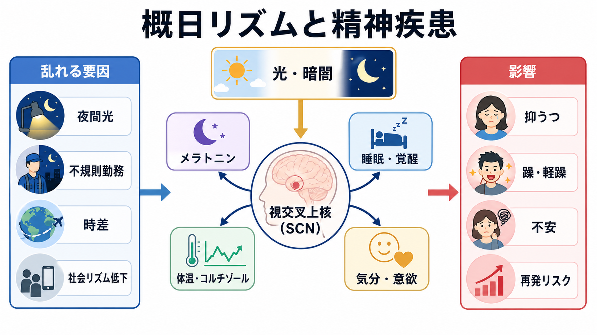
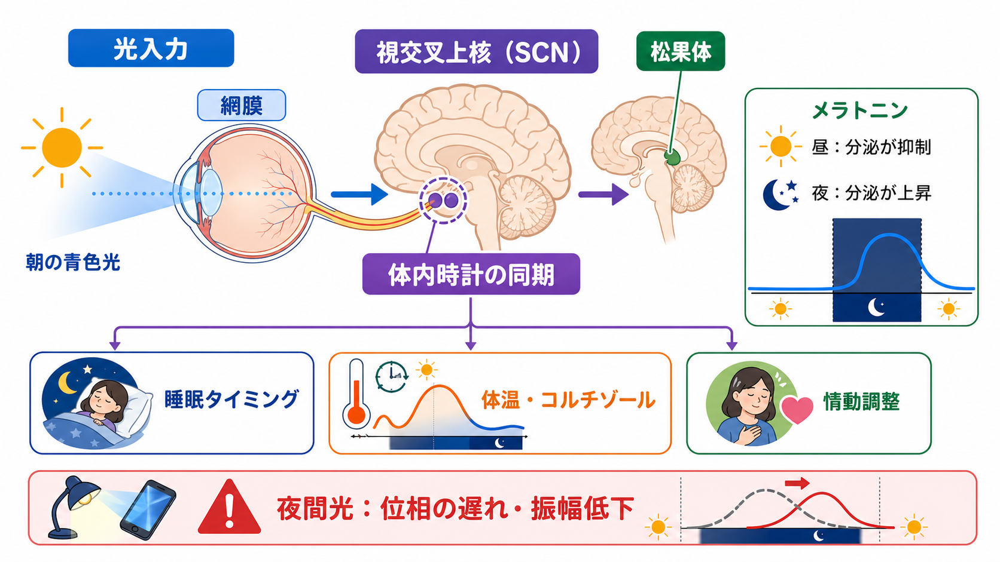
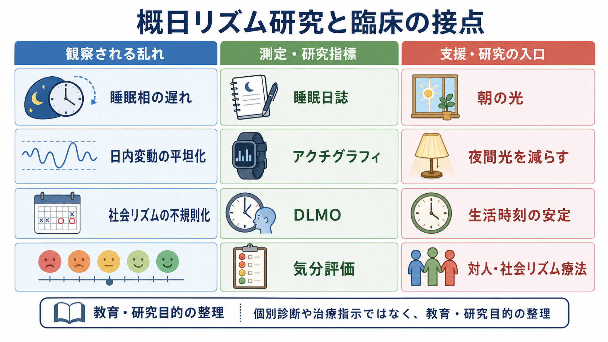

# 概日リズムの乱れは精神疾患にどう関わるのか

## 要点

- 概日リズムは、約24時間周期で睡眠・覚醒、体温、ホルモン、代謝、注意、気分のタイミングをそろえる仕組みである。NIMH の RDoC でも、覚醒・調節系の一部として位置づけられている[1][2]。
- 中心時計は視床下部の視交叉上核（suprachiasmatic nucleus; SCN）で、網膜からの光情報を受け、メラトニン、体温、コルチゾール、睡眠タイミングなどを同調させる[1][5]。
- 精神疾患では、睡眠障害が「結果」として現れるだけでなく、概日リズムの乱れが情動調整、認知、ストレス応答、再発リスクに関わる可能性がある[4]。
- うつ病や双極症では、位相の遅れ、振幅低下、睡眠覚醒リズムの不規則化、社会リズムの乱れがよく議論される。ただし、これらは単独の診断マーカーではなく、症状、生活、薬物、身体疾患、環境を統合して解釈する必要がある[5][6]。
- メラトニンや光、生活時刻の安定は研究・臨床で重要な入口だが、個別の治療判断は専門的評価に基づくべきである[7][8]。

## この記事で答える問い

この記事では、[[精神疾患は脳の病気なのか]]、[[HPA軸は精神疾患にどう関わるのか]]、[[報酬系の異常はうつ病をどう説明するのか]]と接続しながら、次の問いに答える。

1. 概日リズムとは何で、睡眠覚醒リズムと何が違うのか。
2. 視交叉上核、光、メラトニンはどのようにつながっているのか。
3. 概日リズムの乱れは、うつ病や双極症などの気分障害とどう関係するのか。
4. 臨床・研究でこの知識を使うとき、どのような誤解を避けるべきか。

## まず結論

概日リズムの乱れは、精神疾患の「唯一の原因」ではない。しかし、睡眠覚醒、光曝露、社会的活動時刻、メラトニン分泌、体温、コルチゾール、覚醒系がずれると、脳と身体は同じ一日を同じタイミングで処理しにくくなる。すると、眠気、注意低下、情動不安定、意欲低下、ストレス反応、対人活動の低下が相互に増幅し、症状の維持や再発リスクに関わりうる。

重要なのは、「眠れないから気分が悪い」という一方向の説明では足りないことである。気分が悪いと活動が減り、朝の光を浴びる機会が減り、就寝起床時刻がずれ、さらに睡眠と気分が悪化する。このような循環を、概日リズムは時間構造の観点から説明する。

## 背景

睡眠と精神疾患の関係は古くから知られている。うつ病では早朝覚醒、過眠、不眠、日内変動がみられることがあり、双極症では睡眠時間の減少が躁・軽躁エピソードの前後で重要なサインになることがある。統合失調症、不安症、PTSD、発達症、神経変性疾患でも、睡眠と活動リズムの乱れはしばしば問題になる[4]。

ただし、睡眠障害をすべて「精神症状の結果」や「薬の副作用」とみなすと、時間構造そのものを見落とす。睡眠は、睡眠圧が高まる恒常性過程と、眠りやすい時刻を決める概日過程の相互作用で決まる[2][3]。十分に疲れていても、体内時計が夜型に遅れていれば寝つきにくい。逆に、睡眠時間が短くても、朝の光や活動時刻が安定していれば、翌日の覚醒が比較的保たれることもある。

この視点は、[[セロトニンは気分だけに関わるのか]]や[[ノルアドレナリンは覚醒とストレスにどう関わるのか]]で扱う広域調節系とも接続する。気分は単独の神経伝達物質だけで決まるのではなく、睡眠、覚醒、ストレス、報酬、身体状態、社会的リズムの中で変動する。

## 基本概念

### 概日リズム

概日リズムとは、約24時間周期で繰り返す内因性の生物リズムである。光・暗闇、食事、運動、対人接触、仕事・学校の時刻などの外的手がかりによって、外界の24時間周期に同調する[1]。

概日リズムは睡眠だけを制御しているわけではない。体温、メラトニン、コルチゾール、血糖、消化、注意、反応時間、気分の変動にも関わる。そのため、睡眠時間だけを見ても、リズム全体の状態は分からない。

### 視交叉上核

視交叉上核（SCN）は、視床下部にある小さな神経核で、哺乳類の中心時計として働く。網膜、とくにメラノプシンをもつ光感受性網膜神経節細胞から光情報を受け取り、脳内外の時計をそろえる[1][5]。

SCN は、松果体のメラトニン分泌、体温リズム、コルチゾール、摂食・活動時刻、自律神経出力に影響する。これは、脳の中に「時計が一つだけある」という意味ではない。末梢組織にも時計はあるが、SCN はそれらをまとめる指揮者に近い。

### メラトニン

メラトニンは、暗くなると松果体から分泌が増えるホルモンである。夜の到来を身体に知らせ、睡眠の準備と概日位相の調整に関わる。光、とくに夜間の強い光や短波長光は、メラトニン分泌を抑制し、体内時計を遅らせる方向に働きうる[5][7]。

ここで注意したいのは、メラトニンを「睡眠薬」と単純化しないことである。メラトニンは睡眠を強制する物質というより、暗闇と夜の時刻を知らせるシグナルである。メラトニン作動薬やサプリメントは睡眠・概日リズムに影響しうるが、精神疾患の中核症状を直接改善する効果は疾患や研究デザインによってばらつきがある[7]。

## 仕組み

### 1. 光が時計を合わせる

朝の光は、SCN に「昼が来た」という情報を送り、覚醒、体温上昇、コルチゾールリズム、活動開始をそろえる。夜の暗さはメラトニン分泌を許し、身体に休息モードへの移行を促す。逆に、夜間光、深夜のスマートフォン、交代勤務、時差、不規則な休日睡眠は、時計を遅らせたり振幅を弱めたりする。

### 2. 睡眠覚醒と情動制御が同じリズムに乗る

睡眠不足やリズムの乱れは、単に眠気を増やすだけではない。注意、作業記憶、報酬学習、脅威への反応、前頭前野による情動制御にも影響する。たとえば、眠気が強いと、前頭前野の制御が落ち、扁桃体や報酬系の反応を調整しにくくなる可能性がある。この点は、[[前頭前野は情動制御にどう関わるのか]]、[[扁桃体過活動は不安症やPTSDにどう関わるのか]]、[[報酬系の異常はうつ病をどう説明するのか]]と接続できる。

### 3. 社会リズムが体内時計の手がかりになる

人間の体内時計は、光だけでなく、起床、食事、登校・出勤、対人接触、運動、服薬、就寝前行動にも影響される。気分障害では、症状によって活動が減り、社会的接触が減り、生活時刻が不規則になりやすい。すると、体内時計の手がかりが弱まり、睡眠覚醒リズムがさらに不安定になる。

双極症で対人・社会リズム療法（IPSRT）が議論されるのは、このためである。IPSRT は、薬物療法を置き換えるものではなく、対人ストレスと生活時刻の乱れが気分エピソードに関わるという仮説に基づき、日常リズムの安定を支援する心理社会的介入として発展してきた[8]。

## 図解

3枚目の図は、研究と臨床の接点をまとめたものである。概日リズムの研究では、睡眠日誌、アクチグラフィ、DLMO（dim light melatonin onset; 薄明条件でのメラトニン分泌開始時刻）、気分評価、光曝露量などが使われる。これらは、個人を単独で診断する検査というより、時間構造と症状変動を結びつけて理解するための測定である。

| 観点 | 何を見るか | 精神疾患との読み方 |
|---|---|---|
| 位相 | 眠くなる時刻、DLMO、起床時刻 | 夜型化、睡眠相の遅れ、朝の活動低下と関係しうる |
| 振幅 | 昼夜差、活動量のメリハリ、体温・ホルモンリズム | 日中活動低下、過眠、不眠、疲労感と重なりうる |
| 安定性 | 平日・休日差、食事・活動時刻、対人接触 | 社会リズムの乱れが再発リスクと結びつく可能性 |
| 環境 | 朝の光、夜間光、交代勤務、時差 | 光のタイミングが時計の遅れや同調不全に影響しうる |

## 臨床・研究との接続

### うつ病

うつ病では、不眠、早朝覚醒、過眠、疲労、日内変動がみられることがある。概日リズムの観点では、睡眠相のずれ、活動リズムの平坦化、体温・コルチゾール・メラトニンのタイミング変化が注目されてきた[5]。ただし、うつ病の全員に同じリズム異常があるわけではない。炎症、ストレス、報酬系、認知、身体疾患、薬物、生活環境と重ねて読む必要がある。

### 双極症

双極症では、睡眠覚醒リズムの乱れ、夜型傾向、メラトニン分泌の変化、時計遺伝子、社会的時刻手がかりの不規則化が研究されている[6]。臨床的には、睡眠時間の短縮や活動量の増加が躁・軽躁の前後で重要な観察点になることがある。ただし、これは「寝ていない人は双極症である」という意味ではない。症状の質、持続期間、機能障害、既往、薬物、身体疾患を含めて評価する必要がある。

### 統合失調症・不安症・PTSD

睡眠と概日リズムの乱れは、統合失調症、不安症、PTSD でも問題になる。たとえば、過覚醒や悪夢は睡眠を妨げ、睡眠不足は警戒心や情動反応を増幅しうる。統合失調症では活動リズム、光曝露、メラトニンリズムの乱れが研究されている[4]。ただし、疾患ごとの所見は薬物、入院環境、日中活動、社会的孤立、身体疾患の影響を受ける。

### 介入研究への入口

研究・臨床では、朝の光、夜間光の調整、起床時刻の安定、食事・活動時刻の安定、睡眠日誌、アクチグラフィ、心理教育、IPSRT などが入口になる[7][8]。しかし、光療法やメラトニンはタイミングを誤ると逆方向に働くことがあり、双極症では躁転リスクへの配慮も必要である。したがって、本記事は教育・研究目的の整理であり、個別の治療指示ではない。

## よくある誤解

### 誤解1: 「睡眠時間だけ見ればよい」

睡眠時間は重要だが、それだけでは足りない。起床時刻、入眠時刻、昼夜の光、活動量、休日とのずれ、日中の眠気、気分の日内変動を合わせて見る必要がある。

### 誤解2: 「メラトニンを増やせば精神症状が治る」

メラトニンは概日リズムと睡眠に関わる重要なシグナルだが、精神疾患の中核症状を直接治す万能薬ではない。メラトニン作動薬の研究では、睡眠覚醒や概日指標への効果は示される一方、疾患中核症状への効果は一貫しない部分がある[7]。

### 誤解3: 「夜型は悪い」

夜型傾向そのものを道徳的に評価する必要はない。問題になるのは、本人の体内時計、社会的要求、睡眠時間、光環境、症状変動がずれて苦痛や機能障害を生む場合である。

### 誤解4: 「概日リズムの乱れが原因なら、心理社会的要因は関係ない」

むしろ逆である。概日リズムは、光、仕事、学校、家族、孤立、ストレス、食事、運動、スマートフォン利用など、心理社会的環境を身体と脳へつなぐ経路である。[[精神疾患は脳の病気なのか]]で扱う多層モデルと相性がよい。

## 関連ノート

既存ノート:

- [[精神疾患は脳の病気なのか]]
- [[HPA軸は精神疾患にどう関わるのか]]
- [[報酬系の異常はうつ病をどう説明するのか]]
- [[前頭前野は情動制御にどう関わるのか]]
- [[扁桃体過活動は不安症やPTSDにどう関わるのか]]
- [[セロトニンは気分だけに関わるのか]]
- [[ノルアドレナリンは覚醒とストレスにどう関わるのか]]
- [[脳幹網様体は覚醒ネットワークで何をしているのか]]

関連ノート候補:

- 概日リズムとは何か
- 視交叉上核とは何か
- メラトニンは睡眠と体内時計にどう関わるのか
- 睡眠相後退症候群とは何か
- 対人・社会リズム療法とは何か
- 光療法は気分障害にどう使われるのか

MOC更新候補:

- `content/00_MOC/MOC｜脳・神経科学.md`
- `content/00_MOC/MOC｜精神医学.md`
- `content/00_MOC/MOC｜臨床実践・治療.md`

並列生成ジョブとの競合を避けるため、本タスクでは MOC 本体は更新していない。

## 理解チェック

1. 概日リズムと睡眠恒常性過程の違いを説明できるか。
2. SCN、光、メラトニン、睡眠覚醒リズムの関係を一つの流れで説明できるか。
3. うつ病や双極症で、概日リズムの乱れが「原因」「結果」「維持因子」のどれにもなりうる理由を説明できるか。
4. メラトニンや光を、単純な睡眠薬・覚醒薬として扱うと何を見落とすか。
5. 社会リズムの安定が、気分障害の研究・支援でなぜ重視されるのか。

## 参考文献

[1] National Institute of Mental Health. (n.d.). *Circadian Rhythms*. RDoC Construct: Arousal and Regulatory Systems. https://www.nimh.nih.gov/research/research-funded-by-nimh/rdoc/constructs/circadian-rhythms

[2] National Institute of Mental Health. (n.d.). *Sleep-Wakefulness*. RDoC Construct: Arousal and Regulatory Systems. https://www.nimh.nih.gov/research/research-funded-by-nimh/rdoc/constructs/sleep-wakefulness.shtml

[3] Borbély, A. A. (1982). A two process model of sleep regulation. *Human Neurobiology, 1*(3), 195-204. https://pubmed.ncbi.nlm.nih.gov/7185792/

[4] Wulff, K., Gatti, S., Wettstein, J. G., & Foster, R. G. (2010). Sleep and circadian rhythm disruption in psychiatric and neurodegenerative disease. *Nature Reviews Neuroscience, 11*, 589-599. https://doi.org/10.1038/nrn2868

[5] Quera Salva, M. A., & Hartley, S. (2012). Mood disorders, circadian rhythms, melatonin and melatonin agonists. *Journal of Central Nervous System Disease, 4*, 15-26. https://doi.org/10.4137/JCNSD.S4103

[6] Takaesu, Y. (2018). Circadian rhythm in bipolar disorder: A review of the literature. *Psychiatry and Clinical Neurosciences, 72*(9), 673-682. https://doi.org/10.1111/pcn.12688

[7] Moon, E., Partonen, T., Beaulieu, S., & Linnaranta, O. (2022). Melatonergic agents influence the sleep-wake and circadian rhythms in healthy and psychiatric participants: A systematic review and meta-analysis of randomized controlled trials. *Neuropsychopharmacology, 47*, 1523-1536. https://doi.org/10.1038/s41386-022-01278-5

[8] Crowe, M., Beaglehole, B., & Inder, M. (2016). Social rhythm interventions for bipolar disorder: A systematic review and rationale for practice. *Journal of Psychiatric and Mental Health Nursing, 23*(1), 3-11. https://doi.org/10.1111/jpm.12271

## 未解決問題

- 概日リズムの乱れは、どの精神疾患で原因、前駆サイン、維持因子、結果のどれとして働くのか。
- DLMO、アクチグラフィ、睡眠日誌、光曝露データを、個人差の大きい臨床場面でどう統合するか。
- 朝の光、夜間光の制限、生活時刻の安定、IPSRT などの介入が、どのサブグループに最も有効か。
- 双極症における光・睡眠介入の効果とリスクを、躁・軽躁リスクを含めてどう最適化するか。

## 更新ログ

- 2026-04-27: 初稿作成。概日リズム、SCN、メラトニン、睡眠覚醒、気分障害との接続を整理し、画像3点と参考文献を追加。
