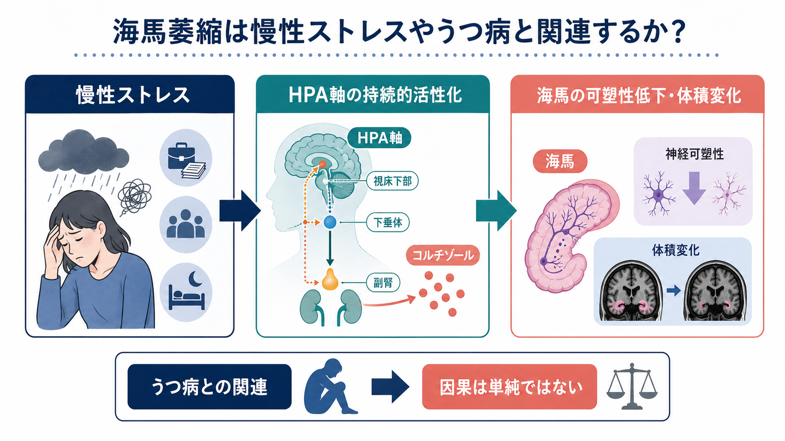
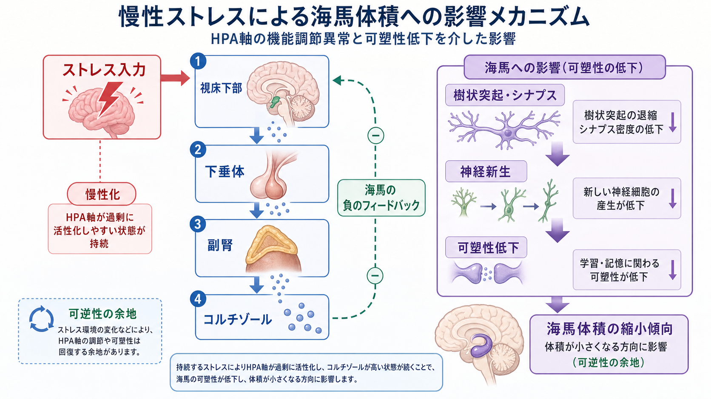
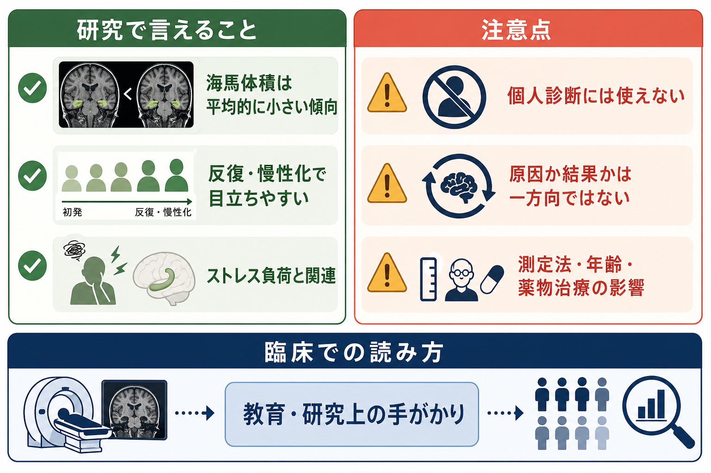

# 海馬萎縮はストレスやうつ病と関係するのか

## 要点

- 海馬は記憶だけでなく、ストレス応答を調節する HPA 軸の負のフィードバックにも関わるため、慢性ストレスの影響を受けやすい脳領域である[1][2]。
- うつ病では、健常対照群と比べて海馬体積が平均的に小さいというメタ解析・大規模共同研究の結果がある。ただし効果量は小さく、個人診断には使えない[3][4]。
- 関連は、初発例より反復・慢性化したうつ病、早発例、長い罹病期間で目立ちやすい[4][5]。
- 仕組みとしては、慢性ストレスによる HPA 軸の持続的活性化、コルチゾール、樹状突起・シナプスの変化、歯状回の神経新生低下、BDNF などの神経栄養シグナル低下が候補になる[1][6][7]。
- 「海馬が小さいからうつ病になる」「うつ病になると必ず海馬が萎縮する」という単純な因果ではない。脆弱性、病相の反復、ストレス曝露、治療、年齢、測定法が重なって見える現象として読む必要がある[4][8]。

## この記事で答える問い

この記事では、[[海馬回路は記憶をどう形成するのか|海馬]]の体積変化が、慢性ストレスやうつ病とどのように関係すると考えられているのかを整理する。中心になる問いは次の3つである。

1. 慢性ストレスはなぜ海馬に影響しやすいのか。
2. うつ病研究で観察される海馬体積低下は、どの程度確かな知見なのか。
3. その知見を、臨床や研究でどこまで解釈してよいのか。

ここでの説明は教育・研究目的であり、個別の診断、予後判定、治療選択を指示するものではない。

## まず結論

海馬萎縮は、慢性ストレスやうつ病と「関係する」と言える。ただし、その意味は「うつ病の人を1人 MRI で見れば判定できる」という意味ではない。より正確には、集団平均として、うつ病、とくに反復・慢性化したうつ病では海馬体積が小さい傾向があり、その背景にはストレス応答系と神経可塑性の変化が関わる可能性が高い、という位置づけである[3][4]。

海馬は、HPA 軸を抑える負のフィードバックにも関与する。慢性ストレスでコルチゾールなどのグルココルチコイド曝露が長引くと、海馬の樹状突起、[[シナプス可塑性とは何か|シナプス可塑性]]、歯状回の神経新生、神経栄養因子の働きが変化しうる[1][6][7]。その結果として、[[構造MRIは脳の何を測っているのか|構造MRI]]で観察される体積差に結びつく、という仮説がある。

## 背景

海馬は、エピソード記憶、文脈記憶、空間記憶に関わる領域として知られる。同時に、ストレス応答の制御にも深く関わる。HPA 軸では、ストレス入力により視床下部から CRH、下垂体から ACTH、副腎皮質からコルチゾールが分泌される。コルチゾールは短期的には適応的だが、過剰または長期に続くと、身体と脳に負荷をかける[2]。

海馬はグルココルチコイド受容体を比較的多く持ち、HPA 軸を抑えるフィードバックに関わる。そのため、海馬の機能が弱まると HPA 軸の抑制が効きにくくなり、ストレス応答がさらに持続する、という悪循環が想定される[1][2]。この観点では、海馬萎縮は単なる「結果」ではなく、ストレス調節の乱れを維持する要因にもなりうる。

一方で、うつ病は非常に不均一な症候群である。発症年齢、反復回数、現在症状、寛解状態、薬物治療歴、併存症、幼少期ストレス、睡眠、炎症、生活習慣などが大きく異なる。そのため、海馬体積の研究結果も「全員に同じ変化がある」とは読めない[4][8]。

## 基本概念

### 海馬萎縮

海馬萎縮とは、画像研究では多くの場合、構造 MRI で推定される海馬体積が対照群より小さいことを指す。細胞が死んでいることを直接意味するとは限らない。体積差には、神経細胞数、樹状突起、シナプス、グリア、血管、細胞外空間、測定アルゴリズムなど複数の要素が関わる。

したがって、「萎縮」という語は強く聞こえるが、研究上は「体積低下」「縮小傾向」と言い換えた方が誤解が少ない。McEwen は、ストレスによる海馬変化を考える際、細胞死のような不可逆的損傷と、樹状突起やシナプスの可逆的なリモデリングを区別することが重要だと論じている[1]。

### HPA軸

HPA 軸は、視床下部、下垂体、副腎を結ぶストレス応答系である。急性ストレスでは、エネルギー動員、注意喚起、免疫調節などに役立つ。一方、慢性ストレスやうつ病の一部では、コルチゾール高値、デキサメタゾン抑制試験での抑制不全、CRH 系の変化など、HPA 軸の過活動が報告されている[2]。

HPA 軸の異常は、うつ病の全例に見られるわけではない。むしろ、メランコリー型、精神病性うつ病、高齢、重症例、反復例などで目立ちやすい可能性がある。したがって、HPA 軸は「うつ病の単一原因」ではなく、うつ病を構成する複数の病態経路の1つとして捉えるのが妥当である。

### 神経可塑性

[[神経可塑性は発達と学習をどう支えるのか|神経可塑性]]とは、経験、学習、ストレス、薬物、発達、加齢に応じて神経回路が変化する性質である。海馬では、樹状突起の分枝、スパイン密度、[[長期増強LTPとは何か|LTP]]、歯状回の成人神経新生などが議論される。

うつ病の神経可塑性仮説では、慢性ストレスが BDNF や mTOR などの可塑性関連経路を抑え、前頭前野・海馬などのシナプス機能を弱めると考える[6][7]。これは、単に「神経伝達物質が足りない」という説明よりも、回路の接続性と可塑性の変化に焦点を当てる見方である。

## 仕組み

### 1. 慢性ストレスがHPA軸を持続的に動かす

ストレスが短期間で終わる場合、HPA 軸の活性化は適応的に働く。しかし、強いストレスや予測不能なストレスが長く続くと、コルチゾール曝露が長引き、HPA 軸の負のフィードバックが乱れやすくなる[2]。

海馬はこのフィードバックの一部を担うため、海馬機能の低下は HPA 軸の過活動を抑えにくくする可能性がある。逆に、HPA 軸の過活動は海馬の可塑性を低下させうる。ここには、双方向の関係がある。

### 2. グルココルチコイドとグルタミン酸が海馬可塑性を変える

動物研究では、反復ストレスにより海馬 CA3 領域の樹状突起が退縮し、急性・慢性ストレスにより歯状回の神経新生が抑制されることが示されてきた[1]。この過程には、グルココルチコイドだけでなく、[[グルタミン酸は脳で何をしているのか|グルタミン酸]]、NMDA 受容体、カルシウム、神経栄養因子が関与する。

重要なのは、これを「ストレスで海馬細胞が一方的に死ぬ」と単純化しないことである。多くの変化は、環境への適応としてのリモデリングであり、条件が変われば一部は回復しうる[1]。

### 3. うつ病ではシナプス可塑性の低下が回路レベルの問題になる

うつ病では、気分、報酬、記憶、自己参照、認知制御に関わる広い[[脳内ネットワークとは何か|脳内ネットワーク]]が関係する。Duman らは、慢性ストレスとうつ病では前頭前野や海馬のシナプス形成・維持が低下し、気分調節回路の接続が弱まるという見方を提示している[6][7]。

この視点では、海馬体積の低下は独立した局所変化ではなく、ストレス応答、記憶、情動、認知制御をまたぐ回路変化の一部である。海馬だけを見ても、うつ病全体は説明できない。

## 図解

上の図では、慢性ストレスが HPA 軸を介してコルチゾール分泌を増やし、海馬の可塑性に影響する流れを示した。押さえるべき点は、次の3つである。

- HPA 軸は急性ストレスでは必要な適応反応である。
- 問題になるのは、過剰な活性化、慢性化、負のフィードバック低下である。
- 海馬体積低下は、細胞死だけでなく、樹状突起、シナプス、神経新生、グリアなどの複合的変化を反映しうる。

研究結果を読むときは、「有意差があるか」だけでなく、効果量、対象者、年齢、発症年齢、反復回数、薬物治療、測定法を見る必要がある。

## 臨床・研究との接続

### 研究で比較的確かなこと

MRI 研究のメタ解析では、うつ病群で海馬体積が低い傾向が報告されている[3]。さらに ENIGMA MDD ワーキンググループの大規模研究では、1,728名のうつ病患者と7,199名の対照を解析し、うつ病群で海馬体積が小さいことを示した。ただし差は約1.2%で、Cohen's d も小さい。主な差は反復例や早発例で目立ち、初発例では明確でなかった[4]。

この結果は、海馬体積低下が「うつ病の一般的な特徴」ではなく、「病相の反復、早期発症、慢性ストレス負荷、罹病期間」と関係する可能性を示している。

### 因果は一方向ではない

海馬体積低下には、少なくとも3つの解釈がある。

1. 反復するうつ病エピソードや慢性ストレスの結果として、海馬可塑性が低下する。
2. 発症前から海馬や HPA 軸の特徴があり、ストレス脆弱性に関わる。
3. 両方が相互に強め合う。

Sheline らの研究では、再発性うつ病の女性で海馬体積が小さく、総うつ病罹病期間と関連することが報告された[5]。一方、大規模横断研究だけでは「原因」か「結果」かを分けきれない。縦断研究、発症前コホート、治療・寛解に伴う変化の追跡が必要である。

### 臨床での読み方

個人の MRI で海馬が小さい、または左右差があるからといって、それだけでうつ病を診断したり、ストレス原因を断定したりすることはできない。海馬体積は年齢、頭蓋内容積、測定法、睡眠、身体疾患、薬物、アルコール、外傷、てんかん、神経変性疾患など多くの要因に影響される。

臨床的には、海馬萎縮という知見は「長期ストレスや反復うつ病が脳の可塑性と関係しうる」という教育・研究上の手がかりとして扱うのがよい。個別判断では、症状経過、生活背景、身体疾患、薬物、心理社会的要因を合わせて評価する必要がある。

## よくある誤解

### 誤解1: 海馬萎縮があればうつ病である

これは誤りである。海馬体積は多くの要因で変わる。うつ病研究で見られる差は集団平均の差であり、個人診断に使えるほど特異的ではない[4]。

### 誤解2: うつ病になると必ず海馬が不可逆的に壊れる

これも単純化しすぎである。ストレスによる海馬変化には、樹状突起やシナプスの可塑的変化が含まれ、不可逆的な細胞死だけを意味しない[1]。治療、寛解、環境変化、睡眠、身体活動などが可塑性に影響する可能性はあるが、ここから個別の治療効果を断定してはいけない。

### 誤解3: コルチゾールだけで説明できる

HPA 軸とコルチゾールは重要だが、それだけではない。グルタミン酸、BDNF、炎症、睡眠、報酬系、前頭前野、扁桃体、遺伝・発達要因などが重なる。うつ病は単一のホルモン異常では説明できない[6][7]。

### 誤解4: 海馬だけを測ればうつ病の重症度が分かる

ENIGMA 研究では、研究参加時の症状重症度は海馬を含む領域体積と明確に関連しなかった[4]。海馬体積は病態理解の一部であり、現在の気分症状の強さを直接読む指標ではない。

## 関連ノート

- [[海馬回路は記憶をどう形成するのか]]
- [[三シナプス回路とは何か]]
- [[構造MRIは脳の何を測っているのか]]
- [[脳画像とは何を見ているのか]]
- [[神経可塑性は発達と学習をどう支えるのか]]
- [[シナプス可塑性とは何か]]
- [[長期増強LTPとは何か]]
- [[グルタミン酸は脳で何をしているのか]]
- [[脳ネットワークの破綻は精神疾患をどう説明するのか]]

今後の作成候補:

- HPA軸とは何か
- コルチゾールは脳にどう作用するのか
- うつ病の神経可塑性仮説とは何か
- BDNFはストレスとうつ病で何をしているのか

MOC更新候補:

- `content/00_MOC/MOC｜脳・神経科学.md`
- `content/00_MOC/MOC｜精神医学.md`
- `content/00_MOC/MOC｜基礎神経科学.md`

## 理解チェック

1. 海馬が HPA 軸の負のフィードバックに関わるとは、どのような意味か。
2. うつ病における海馬体積低下が「個人診断に使えない」のはなぜか。
3. 慢性ストレスが海馬体積に影響しうる経路として、樹状突起、シナプス、神経新生、BDNF のどれが関係するか説明できるか。
4. 初発うつ病と反復うつ病で、海馬体積研究の解釈がなぜ異なるのか。
5. 「海馬萎縮は原因か結果か」という問いに、なぜ単純に答えられないのか。

## 参考文献

[1] McEwen, B. S. (1999). Stress and hippocampal plasticity. *Annual Review of Neuroscience*, 22, 105-122. https://doi.org/10.1146/annurev.neuro.22.1.105

[2] Varghese, F. P., & Brown, E. S. (2001). The hypothalamic-pituitary-adrenal axis in major depressive disorder: A brief primer for primary care physicians. *Primary Care Companion to The Journal of Clinical Psychiatry*, 3(4), 151-155. https://doi.org/10.4088/pcc.v03n0401

[3] Campbell, S., Marriott, M., Nahmias, C., & MacQueen, G. M. (2004). Lower hippocampal volume in patients suffering from depression: A meta-analysis. *American Journal of Psychiatry*, 161(4), 598-607. https://doi.org/10.1176/appi.ajp.161.4.598

[4] Schmaal, L., Veltman, D. J., van Erp, T. G. M., et al. (2016). Subcortical brain alterations in major depressive disorder: Findings from the ENIGMA Major Depressive Disorder working group. *Molecular Psychiatry*, 21, 806-812. https://doi.org/10.1038/mp.2015.69

[5] Sheline, Y. I., Sanghavi, M., Mintun, M. A., & Gado, M. H. (1999). Depression duration but not age predicts hippocampal volume loss in medically healthy women with recurrent major depression. *Journal of Neuroscience*, 19(12), 5034-5043. https://doi.org/10.1523/JNEUROSCI.19-12-05034.1999

[6] Duman, R. S., & Aghajanian, G. K. (2012). Synaptic dysfunction in depression: Potential therapeutic targets. *Science*, 338(6103), 68-72. https://doi.org/10.1126/science.1222939

[7] Duman, R. S., Aghajanian, G. K., Sanacora, G., & Krystal, J. H. (2016). Synaptic plasticity and depression: New insights from stress and rapid-acting antidepressants. *Nature Medicine*, 22, 238-249. https://doi.org/10.1038/nm.4050

[8] Nolan, M., Roman, E., Nasa, A., Levins, K. J., & Roddy, D. W. (2020). Hippocampal and amygdalar volume changes in major depressive disorder: A targeted review and focus on stress. *Chronic Stress*, 4, 2470547020944553. https://doi.org/10.1177/2470547020944553
