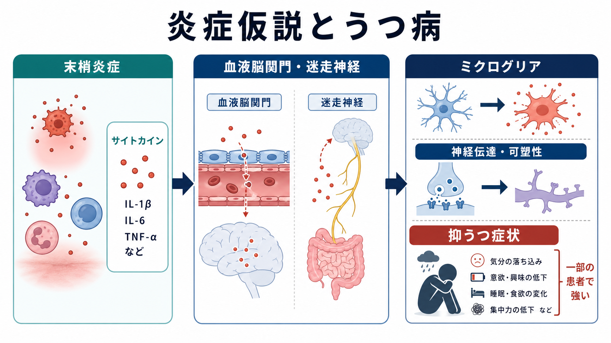
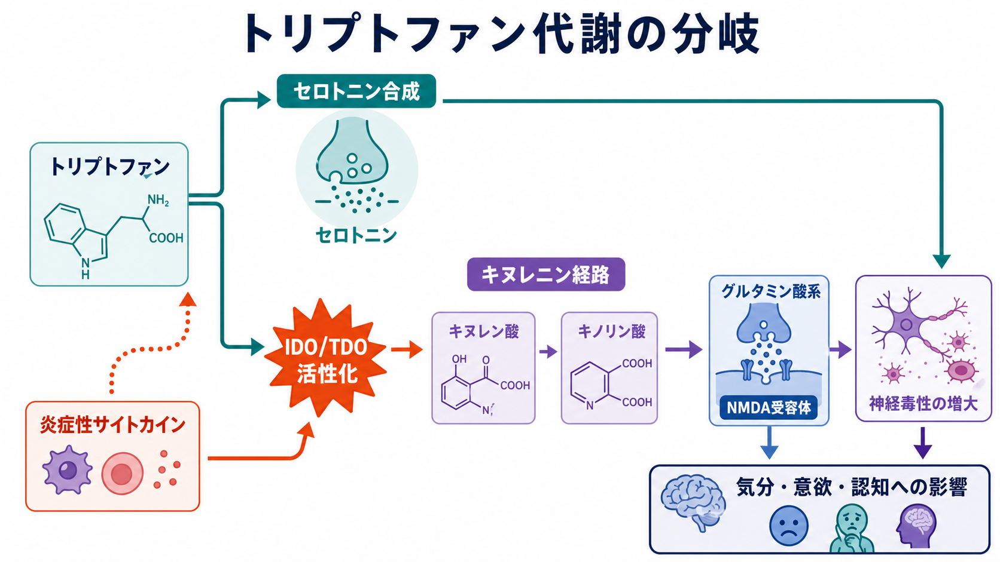
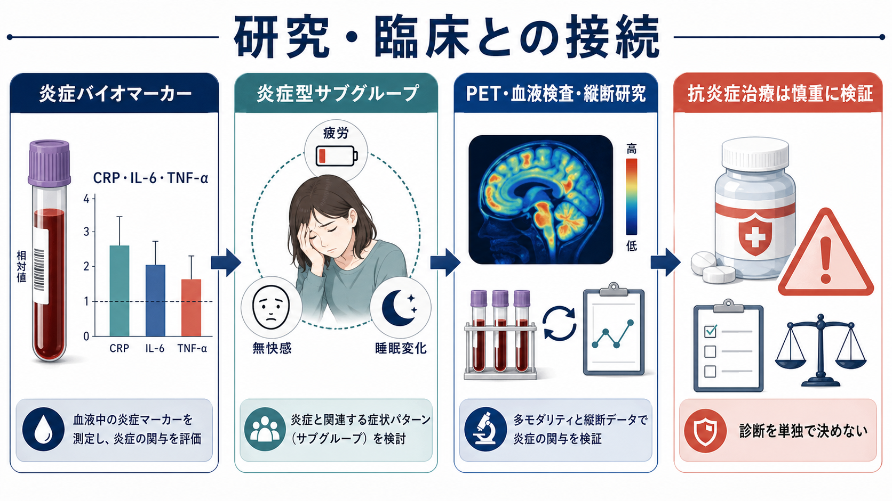

# 炎症仮説はうつ病をどう説明するのか

## 要点

- 炎症仮説は、うつ病を「心の弱さ」ではなく、免疫系、脳、代謝、神経回路が相互作用する病態の一部として捉える枠組みである。
- うつ病患者の全員で炎症が高いわけではないが、CRP、IL-6、TNF-α などが高いサブグループがあることは、メタ解析で繰り返し示されている[1][2]。
- 炎症性サイトカインは、血液脳関門、迷走神経、内皮細胞、ミクログリアなどを介して脳機能へ影響しうる[3]。
- 重要な経路の一つは、トリプトファン代謝がセロトニン合成だけでなくキヌレニン経路へ傾き、グルタミン酸系や NMDA 受容体機能と接続することである[4]。
- 抗炎症治療は研究上の重要な方向だが、現時点では「うつ病なら抗炎症薬を使えばよい」という意味ではない。炎症マーカーが高いサブグループ、薬剤リスク、併存疾患を分けて検証する必要がある[7][8]。

## この記事で答える問い

この記事では、うつ病の炎症仮説を、[[ミクログリアは脳の免疫細胞として何をしているのか|ミクログリア]]、[[血液脳関門はなぜ必要なのか|血液脳関門]]、[[セロトニンは気分だけに関わるのか|セロトニン]]、[[グルタミン酸は脳で何をしているのか|グルタミン酸]]の基礎と接続して整理する。中心になる問いは次の4つである。

1. うつ病で「炎症が関係する」とは、何が上がり、何を意味するのか。
2. 末梢の炎症は、どのように脳内の神経伝達や可塑性へ届くのか。
3. トリプトファン代謝とキヌレニン経路は、なぜ重要なのか。
4. 臨床・研究では、炎症仮説をどこまで使えるのか。

## まず結論

炎症仮説は、うつ病のすべてを炎症だけで説明する理論ではない。むしろ、うつ病という症候群の中に、免疫活性化、慢性ストレス、代謝異常、睡眠障害、身体疾患、肥満、感染後状態などと重なりながら、炎症系が症状の維持や治療反応に関わるサブグループがある、という見方である[1][3]。

炎症が高まると、IL-1β、IL-6、TNF-α などのサイトカインが増え、末梢から脳へ複数の信号経路を通じて影響する。脳内では、ミクログリア、アストロサイト、血管内皮、神経細胞が相互作用し、神経伝達、シナプス可塑性、HPA軸、報酬系、睡眠・食欲・疲労感に関わる回路の状態を変えうる[3][5]。

特に重要なのが、トリプトファン代謝である。炎症性サイトカインは IDO/TDO などの酵素活性を高め、トリプトファンをセロトニン合成だけでなくキヌレニン経路へ流しやすくする。キヌレニン経路の代謝物は、神経保護的にも神経毒性的にも働きうるため、炎症とうつ症状をつなぐ代謝経路として注目されている[4]。

## 背景

古典的なうつ病説明では、セロトニン、ノルアドレナリン、ドパミンなどのモノアミン系、ストレスホルモン、認知の歪み、対人関係、遺伝要因が強調されてきた。これらは今でも重要である。ただし、身体疾患や感染症、自己免疫疾患、肥満、慢性ストレス、睡眠障害が抑うつ症状と結びつくことを考えると、脳だけを閉じた系として見る説明では足りない。

炎症仮説が注目された理由の一つは、免疫系を強く刺激する治療や疾患で、疲労、無快感、睡眠変化、食欲変化、集中困難など、うつ病と重なる「 sickness behavior 」が生じることである[3][4]。これは、感染時に休息、活動低下、社会的撤退を促す適応反応として理解できる。しかし、炎症が長期化したり、身体状態に対して過剰に持続したりすると、同じ反応が生活機能を損なう症状として現れる可能性がある。

## 基本概念

### 炎症性サイトカイン

サイトカインは、免疫細胞や内皮細胞などが放出するシグナル分子である。IL-1β、IL-6、TNF-α などは、感染や損傷に対する防御反応で重要だが、慢性的に高い状態では脳機能にも影響しうる。うつ病研究では、血中 CRP、IL-6、TNF-α などが代表的な炎症指標として扱われる[1][2]。

ただし、血液中のマーカーは脳内炎症をそのまま測っているわけではない。CRP が高いとき、それは感染、肥満、喫煙、睡眠不足、身体疾患、薬剤、社会的ストレスなど多くの要因を反映しうる。したがって、炎症マーカーは「うつ病の診断検査」ではなく、病態の一側面を示す研究・層別化指標として読む必要がある。

### ミクログリアと神経炎症

ミクログリアは、脳内に常在する免疫系の細胞である。健常時にも周囲を監視し、損傷、感染、細胞片、異常なシナプス状態を検出して反応する。炎症仮説では、末梢炎症や慢性ストレスがミクログリアの反応性を変え、神経伝達やシナプス環境に影響する可能性が議論される[3][5]。

ヒト研究では、TSPO PET を用いて神経炎症やミクログリア活性化に関連する指標を測る試みがある。ある研究では、大うつ病エピソード中の患者で前頭前野、前部帯状皮質、島皮質の TSPO 分布容積が高く、前部帯状皮質の値が症状重症度と関連した[5]。ただし、TSPO はミクログリアだけに完全特異的な指標ではなく、リガンド、遺伝子型、解析法の影響も受けるため、結果は慎重に読む必要がある。

### トリプトファンとキヌレニン経路

トリプトファンは、セロトニン合成の原料として知られる一方、体内では多くがキヌレニン経路へ流れる。炎症性サイトカインは indoleamine 2,3-dioxygenase（IDO）や tryptophan 2,3-dioxygenase（TDO）を介してこの経路を促進し、キヌレニン、キヌレン酸、キノリン酸などの代謝物バランスを変えうる[4]。

この経路が重要なのは、単に「セロトニンの材料が減る」だけではない。キノリン酸は NMDA 受容体やグルタミン酸系と関わり、過剰な場合には神経毒性やシナプス機能の変化に結びつく可能性がある。一方、キヌレン酸には NMDA 受容体拮抗作用などがあり、代謝物の比率によって意味が変わる。したがって、炎症とうつ病をつなぐ説明では、[[セロトニンは気分だけに関わるのか|セロトニン]]だけでなく、[[グルタミン酸は脳で何をしているのか|グルタミン酸]]系も一緒に見る必要がある。

## 仕組み

### 1. 末梢炎症が脳へ信号を送る

末梢で炎症が起こると、サイトカインは複数の経路で脳へ影響する。第一に、血液脳関門の内皮細胞や周囲細胞が炎症信号を受け取り、脳側のサイトカイン産生や神経血管単位の状態を変える。第二に、迷走神経などの求心性経路が身体の炎症状態を脳幹へ伝える。第三に、特定の部位では免疫信号が比較的入りやすく、血液脳関門の性質や内皮反応を通じて脳内環境が変わる[3]。

このとき脳は、末梢のサイトカインがそのまま大量に流入する場所ではない。むしろ、血管、グリア、神経細胞、神経内分泌系が中継しながら、身体状態を脳内の行動制御へ翻訳する。[[血液脳関門はなぜ必要なのか|血液脳関門]]は、炎症を完全に遮断する壁ではなく、免疫信号の通り方を調整する動的な境界である。

### 2. ミクログリアが神経回路の環境を変える

炎症信号を受けたミクログリアは、サイトカイン、ケモカイン、活性酸素種、補体、代謝物を介して周囲の神経細胞やアストロサイトと相互作用する。これにより、シナプス伝達、可塑性、神経新生、神経栄養因子、回路の興奮性・抑制性バランスが変化しうる[3][5]。

ただし、「ミクログリア活性化 = 悪」ではない。炎症応答は、感染や損傷への防御、細胞片の除去、修復にも必要である。問題になるのは、反応が強すぎる、長すぎる、適切に解決されない、または本来保護的であるはずの反応がシナプスや回路機能を損なう方向へ偏る場合である。

### 3. 報酬系・疲労・認知制御に影響する

炎症とうつ病の接点で特に注目される症状は、疲労、意欲低下、無快感、精神運動制止、睡眠・食欲変化、集中困難である。これらは、報酬系、前頭前野、前部帯状皮質、島皮質、視床下部、脳幹覚醒系などと関わる。炎症は、ドパミン合成・放出、グルタミン酸調整、ストレスホルモン、睡眠調節を介して、これらの回路の反応性を変える可能性がある[3]。

この見方は、うつ病を「気分の低下」だけでなく、身体エネルギー、内受容感覚、行動選択、報酬学習、認知制御の変化として見る助けになる。たとえば、同じ抑うつでも、罪責感や反すうが前景に出る人と、疲労・無快感・身体症状が前景に出る人では、炎症系の関与の強さが異なる可能性がある。

## 図解

図1は、末梢炎症、サイトカイン、血液脳関門・迷走神経、ミクログリア、神経伝達・可塑性、抑うつ症状の関係をまとめた概念地図である。図2は、炎症性サイトカインが IDO/TDO を介してトリプトファン代謝をキヌレニン経路へ傾け、NMDA 受容体やグルタミン酸系と接続する流れを示している。

図3は、臨床・研究との接続である。炎症マーカー、症状サブタイプ、PET や縦断研究、抗炎症治療の検証は互いに関係するが、個別診断や治療選択を単独で決めるものではない。

## 臨床・研究との接続

### 炎症マーカーはサブグループを探す手がかりになる

メタ解析では、うつ病患者で IL-6 や TNF-α などの炎症性サイトカインが高い傾向が報告されている[1]。また、CRP に関する系統的レビュー・メタ解析では、うつ病患者の約4分の1が CRP >3 mg/L の低度炎症を示し、半数以上が CRP >1 mg/L の軽度上昇を示すと推定された[2]。

この結果は、「うつ病患者の多くに炎症が関係しうる」ことを示す一方で、「全員が炎症型ではない」ことも同時に示している。したがって、炎症仮説を臨床研究に使うなら、診断名だけでまとめるのではなく、CRP、BMI、睡眠、身体疾患、薬剤、症状プロファイル、治療反応を組み合わせて層別化する必要がある。

### 抗炎症治療は有望だが、一般化は危険である

抗炎症薬や免疫調整薬をうつ病治療に使う試みは、RCT とメタ解析で検討されている。2020年の系統的レビュー・メタ解析では、抗炎症薬全体として抑うつ症状への効果が示唆されたが、薬剤の種類、併用療法、対象患者、研究の質には大きなばらつきがある[7]。

TNF-α 阻害薬 infliximab の治療抵抗性うつ病 RCT では、全体では有効性が示されなかったが、ベースラインの hs-CRP が高い患者では効果が示唆された[8]。これは、抗炎症介入が「全員に効く薬」ではなく、炎症マーカーで選ばれるサブグループに意味を持つ可能性を示す。ただし、免疫抑制薬には感染などのリスクがあり、研究知見を自己判断の治療に直結させてはいけない。

### 研究デザインでは因果と交絡を分ける必要がある

炎症とうつ病の関連は、因果方向が一つではない。炎症が抑うつ症状を生むこともあれば、うつ病に伴う睡眠不足、運動不足、食事、喫煙、肥満、ストレス、社会的孤立が炎症を高めることもある。身体疾患や薬剤が両者に影響する場合もある。

そのため、研究では縦断データ、介入研究、メンデルランダム化、症状別解析、脳画像、血液マーカー、行動指標を組み合わせる必要がある。単回の CRP 測定だけで「炎症が原因」と言うことはできない。

## よくある誤解

### 誤解1: うつ病は炎症だけで説明できる

説明できない。うつ病は、遺伝、発達、ストレス、認知、対人関係、睡眠、内分泌、神経伝達、身体疾患、社会環境が重なる異質な症候群である。炎症仮説は、その中の重要な一部を説明する枠組みであり、単一原因説ではない。

### 誤解2: CRP が高ければうつ病だと診断できる

できない。CRP は全身炎症の非特異的指標であり、感染、肥満、喫煙、外傷、自己免疫疾患、薬剤などで上がる。うつ病診断は臨床面接、症状、経過、生活機能、身体疾患の評価を含む総合判断であり、CRP だけで決まらない。

### 誤解3: 炎症を下げれば必ず気分が改善する

必ずではない。炎症が病態に強く関わるサブグループでは抗炎症介入が役立つ可能性があるが、炎症が主因でない場合、効果は乏しいかもしれない。さらに、抗炎症薬や免疫抑制薬には副作用がある。研究知見は、個別の治療指示ではなく、層別化医療の候補として読む必要がある。

### 誤解4: ミクログリアは悪い炎症細胞である

ミクログリアは、監視、貪食、修復、シナプス調整に関わる細胞であり、保護的にも有害にも働く。慢性炎症で問題になるのは、ミクログリアそのものではなく、反応の文脈、強さ、持続時間、周囲の細胞との相互作用である。

## 関連ノート

- [[ミクログリアは脳の免疫細胞として何をしているのか]]
- [[血液脳関門はなぜ必要なのか]]
- [[セロトニンは気分だけに関わるのか]]
- [[グルタミン酸は脳で何をしているのか]]
- [[ドパミンは報酬だけの物質なのか]]
- [[ノルアドレナリンは覚醒とストレスにどう関わるのか]]
- [[デフォルトモードネットワークとは何か]]
- [[脳ネットワークの破綻は精神疾患をどう説明するのか]]

### 関連ノート候補

- 神経炎症とは何か
- HPA軸とは何か
- CRPとは何か
- キヌレニン経路とは何か
- うつ病のバイオマーカーはどこまで使えるのか

### MOC更新候補

- `content/00_MOC/MOC｜脳・神経科学.md` の「神経科学と精神疾患」項目に本記事へのリンクを追加する候補。
- `content/00_MOC/MOC｜精神医学.md` のうつ病・病態仮説項目に本記事へのリンクを追加する候補。

## 理解チェック

1. 炎症仮説が「うつ病の全員に炎症がある」という主張ではない理由を説明できるか。
2. 末梢のサイトカインが脳へ影響する経路を、血液脳関門、迷走神経、ミクログリアから説明できるか。
3. トリプトファン代謝が、セロトニンだけでなくキヌレニン経路と関係する理由を説明できるか。
4. CRP や IL-6 を診断検査としてではなく、研究・層別化指標として読むべき理由を説明できるか。
5. 抗炎症治療研究で、なぜ炎症マーカーが高いサブグループを分ける必要があるのか。

## 参考文献

[1] Dowlati, Y., Herrmann, N., Swardfager, W., et al. (2010). A meta-analysis of cytokines in major depression. *Biological Psychiatry, 67*(5), 446-457. https://doi.org/10.1016/j.biopsych.2009.09.033

[2] Osimo, E. F., Baxter, L. J., Lewis, G., Jones, P. B., & Khandaker, G. M. (2019). Prevalence of low-grade inflammation in depression: a systematic review and meta-analysis of CRP levels. *Psychological Medicine, 49*(12), 1958-1970. https://doi.org/10.1017/S0033291719001454

[3] Miller, A. H., & Raison, C. L. (2016). The role of inflammation in depression: from evolutionary imperative to modern treatment target. *Nature Reviews Immunology, 16*, 22-34. https://doi.org/10.1038/nri.2015.5

[4] Dantzer, R., O'Connor, J. C., Lawson, M. A., & Kelley, K. W. (2011). Inflammation-associated depression: from serotonin to kynurenine. *Psychoneuroendocrinology, 36*(3), 426-436. https://doi.org/10.1016/j.psyneuen.2010.09.012

[5] Setiawan, E., Wilson, A. A., Mizrahi, R., et al. (2015). Role of translocator protein density, a marker of neuroinflammation, in the brain during major depressive episodes. *JAMA Psychiatry, 72*(3), 268-275. https://doi.org/10.1001/jamapsychiatry.2014.2427

[6] Enache, D., Pariante, C. M., & Mondelli, V. (2019). Markers of central inflammation in major depressive disorder: a systematic review and meta-analysis of studies examining cerebrospinal fluid, positron emission tomography and post-mortem brain tissue. *Brain, Behavior, and Immunity, 81*, 24-40. https://doi.org/10.1016/j.bbi.2019.06.015

[7] Bai, S., Guo, W., Feng, Y., et al. (2020). Efficacy and safety of anti-inflammatory agents for the treatment of major depressive disorder: a systematic review and meta-analysis of randomised controlled trials. *Journal of Neurology, Neurosurgery & Psychiatry, 91*(1), 21-32. https://doi.org/10.1136/jnnp-2019-320912

[8] Raison, C. L., Rutherford, R. E., Woolwine, B. J., et al. (2013). A randomized controlled trial of the tumor necrosis factor antagonist infliximab for treatment-resistant depression: the role of baseline inflammatory biomarkers. *JAMA Psychiatry, 70*(1), 31-41. https://doi.org/10.1001/2013.jamapsychiatry.4

## 未解決問題

- 炎症型うつ病を、CRP、サイトカイン、代謝物、症状、脳画像からどの程度再現性高く定義できるのか。
- 末梢炎症と脳内炎症の対応関係を、ヒトでどこまで直接測定できるのか。
- 抗炎症介入が有効な患者を、治療前にどのマーカーで選べるのか。
- 炎症、睡眠、肥満、ストレス、腸内環境、運動不足の因果方向をどう切り分けるのか。

## 更新ログ

- 2026-04-27: 初版作成。炎症性サイトカイン、ミクログリア、トリプトファン代謝、抗炎症治療研究、図解 3 点を整理。
