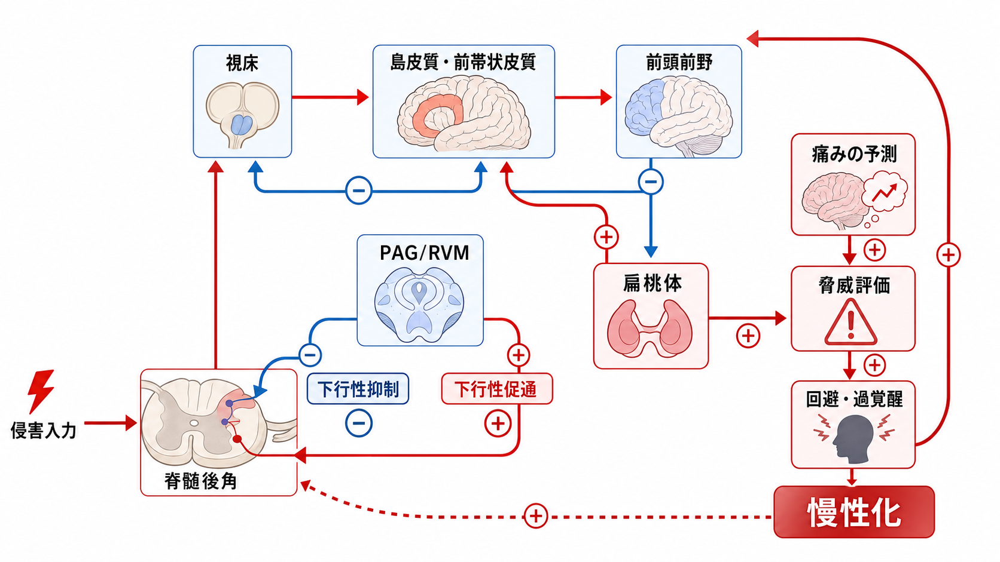
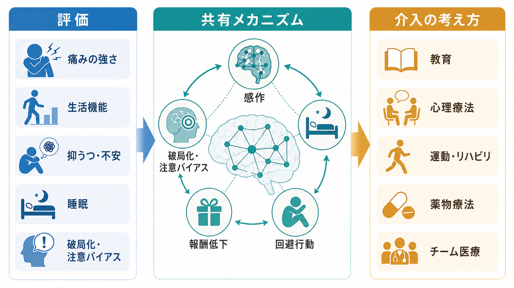

# 疼痛と精神疾患は脳内でどうつながるのか

## 要点

- 痛みは単なる末梢からの信号ではなく、感覚、情動、注意、予測、行動選択が統合された経験である。
- 慢性疼痛では、島皮質、前帯状皮質、前頭前野、扁桃体、視床、側坐核、下行性疼痛調節系が、痛みの強さだけでなく「脅威」「意味」「避けたい感覚」を作る。
- うつや不安との関係は、痛みが精神疾患を一方向に引き起こすという単純な図式ではなく、睡眠、活動量、注意バイアス、報酬低下、回避行動を介した悪循環として理解しやすい。
- 臨床的には、痛みの強さだけでなく、生活機能、抑うつ・不安、睡眠、破局化、回避、報酬経験を合わせて見る必要がある。

## この記事で答える問い

慢性疼痛とうつ・不安は、なぜ同じ人に併存しやすいのか。脳内では、侵害受容の経路、情動を担う回路、注意を向けるネットワーク、報酬系がどのように結びついているのか。

ここでは、[[精神疾患は脳の病気なのか]]という問いに近い立場から、痛みを「身体だけの問題」でも「心だけの問題」でもなく、脳・身体・環境が作る経験として整理する。

## まず結論

疼痛と精神疾患をつなぐ中心は、「痛み信号そのもの」ではなく、痛みを脅威として評価し、注意を引きつけ、行動を制限し、報酬経験を減らす脳内ループである。

国際疼痛学会は、痛みを「実際または潜在的な組織損傷に関連する、あるいはそれに類似する、不快な感覚・情動経験」と定義している[1]。つまり、痛みには最初から情動成分が含まれる。ICD-11 でも慢性疼痛は 3 か月を超えて続く痛みとして分類され、慢性一次性疼痛では情動的苦痛や機能障害が診断上重要な位置を占める[2]。

成人の慢性疼痛では、臨床的に意味のある抑うつ症状と不安症状がそれぞれ約 4 割にみられるという大規模メタ解析がある[3]。この数字は「痛みが気のせい」という意味ではない。むしろ、痛みが脳内の情動・注意・報酬・行動制御ネットワークを長く巻き込み、精神症状と共有する維持機構を持ちうることを示している。

## 背景

急性痛は、損傷や危険を知らせる警報として役立つことが多い。しかし痛みが長期化すると、警報としての役割だけでなく、睡眠の乱れ、活動低下、将来への不安、対人関係の制限、自己効力感の低下を伴いやすい。ここで痛みは、単なる感覚入力ではなく、生活全体を再編する状態になる。

このとき脳内では、痛みを感じる部位だけが活動しているわけではない。島皮質や前帯状皮質は身体内部の変化と不快さを統合し、前頭前野は痛みの意味づけや行動選択に関わり、扁桃体は脅威や恐怖学習を支える。さらに、腹側被蓋野や側坐核を含む報酬系は、「やってみよう」「動いてもよい」「価値がある」という動機づけを調整する。

このため慢性疼痛は、[[前頭前野は情動制御にどう関わるのか]]、[[扁桃体過活動は不安症やPTSDにどう関わるのか]]、[[報酬系の異常はうつ病をどう説明するのか]]と重なるテーマを持つ。

## 基本概念

### 疼痛と侵害受容は同じではない

侵害受容は、組織損傷やその可能性に反応する神経信号である。一方、疼痛は、その信号が脳内で身体状態、記憶、注意、予測、情動と統合されて生じる主観的経験である[1]。侵害受容が強ければ痛みも強いことが多いが、両者は一対一ではない。

同じ入力でも、恐怖が強いと痛みは増しやすく、安心や注意の転換があると弱まりうる。これは「痛みを想像しているだけ」という意味ではなく、脳が感覚入力の重みづけを変えるという意味である。

### 慢性疼痛はネットワークの問題である

慢性疼痛では、末梢組織だけでなく、脊髄、視床、島皮質、前帯状皮質、前頭前野、扁桃体、側坐核、脳幹の下行性疼痛調節系が関わる。感覚の経路、情動の経路、注意の経路、報酬の経路が分離して動くのではなく、互いに影響し合う。

痛みに注意を向けるほど、痛みは脅威として目立ちやすくなる。脅威として評価されるほど、回避行動や過覚醒が増える。回避が増えるほど、活動量と報酬経験が減り、抑うつや不安が維持されやすくなる。

### うつ・不安は「反応」でも「維持因子」でもある

慢性疼痛が続けば、将来への見通しが悪くなり、抑うつや不安が生じやすい。一方で、抑うつや不安は睡眠、注意、身体活動、社会参加、痛みへの予測を変え、痛みの持続や障害を強めることがある[3]。したがって、うつ・不安は痛みの単なる結果でも、痛みの原因でもなく、相互に影響する維持因子として扱うのがよい。

## 仕組み

### 1. 情動は痛みの「不快さ」と「脅威性」を変える

痛みには、場所や強さを表す感覚成分と、不快さ・怖さ・耐えがたさを表す情動成分がある。島皮質は身体内部の状態を統合し、前帯状皮質は不快さや行動調整に関わる。扁桃体は、痛みを危険や予測不能性と結びつける学習に関与する。

情動と注意は痛みを強く調整する。レビュー研究では、痛み経験が情動状態や注意の向け方に大きく影響され、前頭前野、PAG、脳幹、島皮質、頭頂葉、体性感覚野などがその調整に関わると整理されている[4]。つまり、痛みは感覚入力に「情動的な意味」が重なった経験である。

### 2. 下行性疼痛調節は痛みを抑えることも増幅することもある

脳は脊髄から上がってくる入力をただ受け取るだけではない。前頭前野、前帯状皮質、扁桃体、PAG、吻側延髄腹内側部などを介して、脊髄後角の痛み信号を上から調整する。下行性抑制が働けば痛みは弱まり、下行性促通が優位になれば痛みは増幅される。

慢性疼痛では、下行性抑制と促通のバランスが崩れることがある。下行性疼痛調節に関するレビューは、慢性疼痛で末梢・中枢感作だけでなく疼痛調節経路の変化が関与し、促通と抑制の不均衡が重要だと述べている[5]。

### 3. 注意ネットワークは痛みを「目立つ刺激」にする

痛みは、生存上重要な信号なので注意を奪いやすい。急性痛ではこれは役に立つ。しかし慢性化すると、注意が痛みに固定され、身体感覚の監視、破局的解釈、回避行動が強まりやすい。

慢性疼痛の脳画像研究では、デフォルトモードネットワークや島皮質・前帯状皮質を含むサリエンス関連ネットワークの機能的再編が報告されている。たとえば複数の慢性疼痛群を対象にした研究では、内側前頭前野と島皮質の結合変化など、安静時ネットワークの再編が痛みの持続と関連することが示された[6]。

この観点では、痛みは身体から上がる信号であると同時に、脳が「今もっとも重要な問題」として選び続ける対象でもある。

### 4. 報酬系の低下は抑うつと活動低下をつなぐ

慢性疼痛では、痛いから動けないだけでなく、動く価値や楽しさが感じにくくなることがある。これは[[報酬系の異常はうつ病をどう説明するのか]]と重なる。側坐核、腹側被蓋野、前頭前野、扁桃体は、痛み、価値評価、動機づけ、気分を結びつける。

動物研究では、慢性疼痛に伴う動機づけ低下に側坐核のシナプス可塑性が関わることが示されている[8]。ヒトのうつと慢性疼痛の関係を考えるときも、痛みの強さだけでなく、報酬経験の減少、活動の回避、楽しみの低下を見る必要がある。

### 5. 痛みとうつは共有領域を持つが、完全に同じではない

疼痛とうつの併存に関する脳画像メタ解析では、痛みとうつが共有する候補領域として、前帯状皮質、島皮質、前頭前野、視床などが検討されている[7]。ただし、これは「痛みとうつは同じ病気」という意味ではない。共有する回路がある一方で、痛みの種類、うつの重症度、薬物、睡眠、生活背景、炎症、ストレス経験によって経路は異なる。

[[炎症仮説はうつ病をどう説明するのか]]や[[HPA軸は精神疾患にどう関わるのか]]と同様、ひとつの回路だけで説明しすぎないことが重要である。

## 図解

上の 2 枚は、疼痛と精神疾患の関係を「全体像」と「下行性疼痛調節」の 2 段階で示している。3 枚目を追加する場合は、次のような図解案が有用である。

**図解案: 臨床・研究への接続図**

日本語インフォグラフィック。3 列構成で、左から「評価」「共有メカニズム」「介入の考え方」。評価には「痛みの強さ」「生活機能」「抑うつ・不安」「睡眠」「破局化・注意バイアス」。共有メカニズムには「感作」「報酬低下」「回避行動」「下行性疼痛調節」。介入の考え方には「教育」「心理療法」「運動・リハビリ」「薬物療法」「チーム医療」。教育・研究目的であり、個別治療指示に見えない表現にする。

## 臨床・研究との接続

慢性疼痛を診るとき、痛みの強さだけを追うと重要な情報を見落としやすい。研究・臨床では、少なくとも次の軸を分けて考えると整理しやすい。

| 見る対象 | 脳・心理メカニズムとの関係 | 注意点 |
|---|---|---|
| 痛みの強さ | 侵害入力、感作、下行性調節 | 強さだけで生活障害は説明しきれない |
| 生活機能 | 回避、活動低下、報酬経験 | 「痛みがあるか」より「何ができなくなったか」を見る |
| 抑うつ・不安 | 情動回路、予測、脅威評価 | 痛みの二次反応でも維持因子でもある |
| 睡眠 | 過覚醒、注意制御、回復 | 睡眠不良は痛みと気分の両方を悪化させうる |
| 破局化・注意バイアス | サリエンス、前頭前野、島皮質 | 本人の性格の問題ではなく、学習された注意様式として扱う |
| 報酬・活動 | 側坐核、前頭前野、ドパミン系 | うつ症状や活動回避と結びつく |

教育的には、「身体か心か」という二分法を避けることが重要である。慢性疼痛は、身体からの入力、脳内調節、行動、環境、社会的文脈が重なる状態であり、精神症状はその中で自然に生じうる。なお本記事は教育・研究目的の整理であり、個別の診断や治療指示ではない。

## よくある誤解

### 誤解 1: 痛みとうつ・不安が関係するなら、痛みは気のせいである

そうではない。痛みは主観的経験だが、主観的であることは非実在を意味しない。脳が感覚、情動、予測、注意を統合して痛みを作るからこそ、心理社会的要因も神経生物学的要因として扱える。

### 誤解 2: 画像で異常がなければ痛みは説明できない

画像所見は重要だが、慢性疼痛のすべてを説明するわけではない。ICD-11 の慢性一次性疼痛の考え方は、明確な別疾患だけで説明できない痛みでも、情動的苦痛や機能障害を伴う臨床状態として扱う[2]。

### 誤解 3: 不安を減らせば痛みは必ず消える

不安や抑うつは痛みを増幅しうるが、痛みの原因は単一ではない。末梢病変、神経障害、炎症、睡眠、薬物、生活負荷、ストレス、学習、報酬系などが重なる。したがって、単一の説明で片づけるより、多層的に見るほうが安全である。

### 誤解 4: 慢性疼痛の人は動かないから悪化する

活動低下は単なる意思の弱さではない。痛み予測、恐怖、報酬低下、睡眠不良、実際の身体制約が重なって生じる。行動を扱う場合も、段階づけ、安全感、機能目標、本人の価値を含めて考える必要がある。

## 関連ノート

- [[精神疾患は脳の病気なのか]]
- [[前頭前野は情動制御にどう関わるのか]]
- [[扁桃体過活動は不安症やPTSDにどう関わるのか]]
- [[報酬系の異常はうつ病をどう説明するのか]]
- [[HPA軸は精神疾患にどう関わるのか]]
- [[炎症仮説はうつ病をどう説明するのか]]

### 関連ノート候補

- 慢性疼痛と中枢性感作
- 疼痛破局化と注意バイアス
- 下行性疼痛調節
- 慢性疼痛における報酬系
- 慢性疼痛と睡眠

### MOC 更新候補

- `content/00_MOC/` 配下の神経科学、精神疾患、臨床実践系 MOC に、本記事へのリンクを追加する候補。並列ジョブとの競合を避けるため、本タスクでは MOC ファイルは更新しない。

## 理解チェック

1. 疼痛と侵害受容はどのように違うか。
2. 慢性疼痛とうつ・不安をつなぐ「悪循環」には、どのような要素が含まれるか。
3. 下行性疼痛調節は、痛みを抑える方向と増幅する方向のどちらに働きうるか。
4. 報酬系の変化は、慢性疼痛における活動低下や抑うつとどう関係するか。
5. 「痛みが心理的要因と関係する」と「痛みは気のせいである」は、なぜ同じ意味ではないのか。

## 参考文献

[1] Raja, S. N., Carr, D. B., Cohen, M., et al. (2020). The revised International Association for the Study of Pain definition of pain: concepts, challenges, and compromises. *Pain, 161*(9), 1976-1982. https://doi.org/10.1097/j.pain.0000000000001939

[2] Treede, R. D., Rief, W., Barke, A., et al. (2019). Chronic pain as a symptom or a disease: the IASP Classification of Chronic Pain for the International Classification of Diseases (ICD-11). *Pain, 160*(1), 19-27. https://doi.org/10.1097/j.pain.0000000000001384

[3] Aaron, R. V., Ravyts, S. G., Carnahan, N. D., et al. (2025). Prevalence of Depression and Anxiety Among Adults With Chronic Pain: A Systematic Review and Meta-Analysis. *JAMA Network Open*. https://jamanetwork.com/journals/jamanetworkopen/fullarticle/2831134

[4] Bushnell, M. C., Ceko, M., & Low, L. A. (2013). Cognitive and emotional control of pain and its disruption in chronic pain. *Nature Reviews Neuroscience, 14*, 502-511. https://doi.org/10.1038/nrn3516

[5] Ossipov, M. H., Dussor, G. O., & Porreca, F. (2010). Central modulation of pain. *The Journal of Clinical Investigation, 120*(11), 3779-3787. https://doi.org/10.1172/JCI43766

[6] Baliki, M. N., Mansour, A. R., Baria, A. T., & Apkarian, A. V. (2014). Functional reorganization of the default mode network across chronic pain conditions. *PLOS ONE, 9*(9), e106133. https://doi.org/10.1371/journal.pone.0106133

[7] Zheng, C. J., Van Drunen, S., & Egorova-Brumley, N. (2022). Neural correlates of co-occurring pain and depression: an activation-likelihood estimation meta-analysis and systematic review. *Translational Psychiatry, 12*, 196. https://doi.org/10.1038/s41398-022-01949-3

[8] Schwartz, N., Temkin, P., Jurado, S., et al. (2014). Decreased motivation during chronic pain requires long-term depression in the nucleus accumbens. *Science, 345*(6196), 535-542. https://doi.org/10.1126/science.1253994
