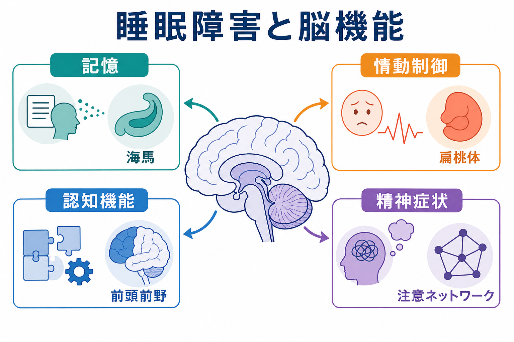
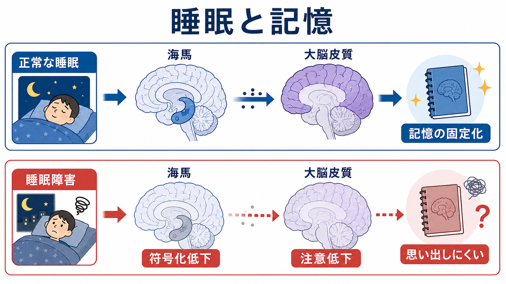
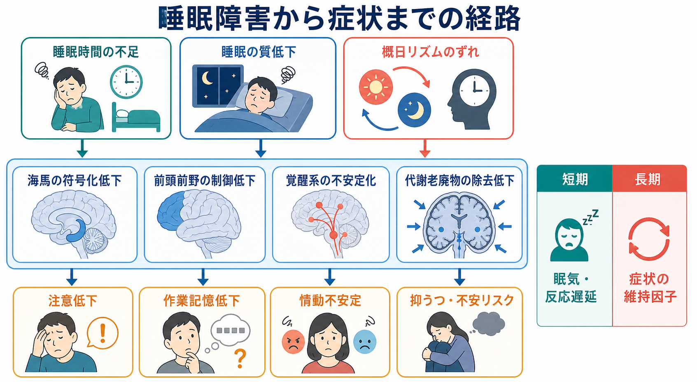

# 睡眠障害は脳機能にどのような影響を与えるのか

## 要点

- 睡眠障害は「眠い」だけではなく、[[海馬萎縮はストレスやうつ病と関係するのか|海馬]]による記憶の符号化、[[前頭前野は情動制御にどう関わるのか|前頭前野]]による注意・実行制御、[[扁桃体過活動は不安症やPTSDにどう関わるのか|扁桃体]]を含む情動反応の調整に影響する。
- 睡眠中には記憶の再活性化と再編成が起こり、特に海馬依存的なエピソード記憶や手続き学習の固定化に関わる[2]。
- 睡眠不足は翌日の新しい記憶形成を弱める。実験的睡眠剥奪では、海馬活動とその後の記憶成績が低下することが示されている[3]。
- 情動面では、睡眠不足により扁桃体反応が強まり、内側前頭前野からの制御が弱まる可能性がある[4]。
- 慢性的な睡眠制限では、本人の主観的な慣れとは別に、注意、反応時間、作業記憶の低下が蓄積する[5]。

## この記事で答える問い

この記事では、睡眠障害が脳に与える影響を「どの症状が、どの神経システムの変化として理解できるか」という観点で整理する。ここでいう睡眠障害には、不眠、睡眠時間の不足、睡眠の質の低下、睡眠覚醒リズムの乱れを含める。ただし、個別の診断や治療指示ではなく、教育・研究目的の概説として扱う。

## まず結論

睡眠は、脳を停止させる時間ではない。記憶を整理し、情動反応を調整し、翌日の注意・意思決定に必要な神経資源を回復させる能動的な脳状態である。したがって睡眠障害は、単に睡眠時間の問題ではなく、記憶、情動、認知制御、精神症状を横断する「脳の調整不全」として理解できる[1]。

## 背景

睡眠は複数の段階からなる。ノンレム睡眠では徐波活動や睡眠紡錘波が目立ち、記憶の再活性化や大脳皮質への統合に関わる。レム睡眠では情動記憶、夢見、覚醒に近い脳活動がみられ、情動処理との関連が議論されている[2]。

睡眠障害が問題になるのは、夜間の不快感だけでなく、翌日の脳機能に影響するからである。レビュー研究では、睡眠不足が注意、報酬処理、情動制御、社会的認知、リスク判断など広い領域に影響することが整理されている[1]。

## 基本概念

**睡眠圧**は、起きている時間が長いほど高まる眠気の力である。睡眠圧が高い状態では、注意の持続、反応の速さ、作業記憶が不安定になりやすい。

**概日リズム**は、体内時計によっておよそ24時間周期で調整される覚醒・睡眠のリズムである。睡眠時間が足りていても、夜勤、時差、就寝時刻の大きなずれがあると、脳が「活動すべき時間」と「眠るべき時間」をうまく合わせられない。

**睡眠の質**は、単に長さだけでは測れない。中途覚醒、浅い睡眠、睡眠時無呼吸、周期性四肢運動、強いストレスによる過覚醒などは、同じ睡眠時間でも脳の回復効率を下げうる。

## 仕組み

### 1. 記憶: 海馬から大脳皮質への再編成

新しい出来事の記憶は、まず海馬が文脈やエピソードを一時的に束ねる。睡眠中には、覚醒時に経験した神経活動パターンが再活性化し、大脳皮質の既存知識と統合されると考えられている[2]。このため睡眠障害では、「勉強したのに定着しない」「翌日に思い出しにくい」という形で問題が現れやすい。

実験的に一晩眠らせない条件では、その翌日に新しい情報を覚える能力が低下し、海馬活動も弱くなることが報告されている[3]。これは、睡眠が過去の記憶を固定化するだけでなく、翌日に新しい記憶を受け入れる準備にも関わることを示している。

### 2. 情動制御: 扁桃体反応と前頭前野の制御

睡眠不足では、情動刺激に対する扁桃体の反応が強まり、内側前頭前野との機能的結合が弱まる可能性が示されている[4]。これは、嫌な出来事に対して反応が大きくなる一方で、距離を置いて評価する制御が効きにくくなる状態として理解できる。

この見方は、[[扁桃体過活動は不安症やPTSDにどう関わるのか]]や[[前頭前野は情動制御にどう関わるのか]]とつながる。睡眠不足が続くと、怒りっぽさ、不安、過敏さ、気分の落ち込みが強まりやすいが、それは意志の弱さではなく、情動反応と制御系のバランスが崩れた状態として説明できる。

### 3. 認知機能: 注意、作業記憶、実行機能の低下

睡眠不足は注意を一様に下げるだけではない。むしろ、反応できる時とできない時のばらつきが増える。慢性的な睡眠制限の実験では、6時間睡眠や4時間睡眠が続くと、反応時間や注意課題の成績低下が日ごとに蓄積する[5]。重要なのは、本人が「慣れた」と感じても客観的成績は回復しないことがある点である。

不眠症に関するメタ解析でも、注意、エピソード記憶、作業記憶、問題解決などに小から中程度の低下がみられると報告されている[7]。ただし効果量は課題や対象者によって異なり、すべての人に同じ低下が起こるわけではない。

### 4. 脳の代謝環境: 老廃物除去と可塑性

動物研究では、睡眠中に脳間質腔が広がり、代謝老廃物の除去が促進されることが示されている[6]。この知見はしばしば「睡眠で脳が掃除される」と表現されるが、人間の臨床症状へ直接単純化するには注意が必要である。それでも、睡眠が神経活動の回復、代謝環境、シナプス可塑性に関わるという大きな見方を支える重要な証拠である。

## 図解

上の3枚は、睡眠障害の影響を次の順に整理している。

1. 睡眠障害は、記憶、情動制御、認知機能、精神症状を横断して脳機能に影響する。
2. 記憶では、海馬と大脳皮質の相互作用が睡眠によって支えられ、睡眠障害では符号化と固定化が弱まりやすい。
3. 症状としては、短期的には眠気、反応遅延、注意低下として現れ、長期的には精神症状の維持因子や再燃リスクの一部になりうる。

## 臨床・研究との接続

臨床的には、睡眠障害はうつ病、不安症、双極性障害、統合失調症、認知症、神経変性疾患などでしばしばみられる。睡眠と概日リズムの乱れは、精神疾患や神経疾患の単なる副産物ではなく、症状の維持、悪化、回復過程に関わる可能性がある[8]。

ただし、睡眠障害があるから特定の精神疾患である、あるいは睡眠を改善すればすべての症状が解決する、とはいえない。睡眠は、ストレス、身体疾患、薬剤、生活リズム、疼痛、物質使用、環境、対人関係と相互作用する。研究では、睡眠を介入可能な因子として扱いながら、脳画像、認知課題、日誌、ウェアラブル、心理尺度を組み合わせる設計が重要になる。

## よくある誤解

**誤解1: 睡眠不足は気合いで補える。**  
短期的には覚醒努力で眠気を隠せることがある。しかし慢性的な睡眠制限では、注意や反応時間の低下が蓄積し、主観的な慣れと客観的成績がずれることがある[5]。

**誤解2: 長く寝れば必ず脳機能は回復する。**  
睡眠時間は重要だが、睡眠の質、リズム、呼吸障害、過覚醒、中途覚醒も関係する。長時間寝ていても、日中の強い眠気や認知低下が続く場合は、睡眠の構造や基礎疾患を考える必要がある。

**誤解3: 睡眠障害は精神症状の結果にすぎない。**  
精神症状が睡眠を乱すこともあれば、睡眠障害が気分、認知、情動制御を悪化させることもある。現在は、睡眠と精神症状を双方向の関係として捉える見方が有力である[8]。

## 関連ノート

- [[前頭前野は情動制御にどう関わるのか]]
- [[扁桃体過活動は不安症やPTSDにどう関わるのか]]
- [[海馬萎縮はストレスやうつ病と関係するのか]]
- [[HPA軸は精神疾患にどう関わるのか]]
- [[精神疾患は脳の病気なのか]]

### MOC更新候補

- `content/00_MOC/` 配下の脳・神経科学系MOC
- `content/00_MOC/` 配下の精神医学・精神疾患系MOC

並列ジョブとの衝突を避けるため、本記事作成時点ではMOCファイル自体は更新していない。

## 理解チェック

1. 睡眠障害が「記憶の固定化」と「翌日の新規符号化」の両方に影響しうるのはなぜか。
2. 睡眠不足で情動反応が強くなることを、扁桃体と前頭前野の関係からどう説明できるか。
3. 本人が睡眠不足に慣れたと感じても、認知課題の成績が低下し続ける可能性があるのはなぜか。
4. 睡眠障害と精神症状を「原因か結果か」の一方向でなく、双方向の関係として考える利点は何か。

## 未解決問題

- 睡眠のどの成分が、どの記憶タイプや情動調整過程に最も重要なのかは、まだ完全には分かっていない。
- 動物研究で示された代謝老廃物除去の知見を、人間の臨床症状や認知機能へどの程度直接結びつけられるかには慎重さが必要である。
- 睡眠改善介入が、精神症状、認知機能、脳ネットワーク指標をどの順序で変えるのかは、今後の縦断研究と介入研究の課題である。

## 参考文献

[1] Krause, A. J., Simon, E. B., Mander, B. A., Greer, S. M., Saletin, J. M., Goldstein-Piekarski, A. N., & Walker, M. P. (2017). The sleep-deprived human brain. *Nature Reviews Neuroscience*, 18, 404-418. https://doi.org/10.1038/nrn.2017.55

[2] Rasch, B., & Born, J. (2013). About sleep's role in memory. *Physiological Reviews*, 93(2), 681-766. https://doi.org/10.1152/physrev.00032.2012

[3] Yoo, S. S., Hu, P. T., Gujar, N., Jolesz, F. A., & Walker, M. P. (2007). A deficit in the ability to form new human memories without sleep. *Nature Neuroscience*, 10, 385-392. https://doi.org/10.1038/nn1851

[4] Yoo, S. S., Gujar, N., Hu, P., Jolesz, F. A., & Walker, M. P. (2007). The human emotional brain without sleep: a prefrontal amygdala disconnect. *Current Biology*, 17(20), R877-R878. https://doi.org/10.1016/j.cub.2007.08.007

[5] Van Dongen, H. P. A., Maislin, G., Mullington, J. M., & Dinges, D. F. (2003). The cumulative cost of additional wakefulness: dose-response effects on neurobehavioral functions and sleep physiology from chronic sleep restriction and total sleep deprivation. *Sleep*, 26(2), 117-126. https://doi.org/10.1093/sleep/26.2.117

[6] Xie, L., Kang, H., Xu, Q., Chen, M. J., Liao, Y., Thiyagarajan, M., O'Donnell, J., Christensen, D. J., Nicholson, C., Iliff, J. J., Takano, T., Deane, R., & Nedergaard, M. (2013). Sleep drives metabolite clearance from the adult brain. *Science*, 342(6156), 373-377. https://doi.org/10.1126/science.1241224

[7] Wardle-Pinkston, S., Slavish, D. C., & Taylor, D. J. (2019). Insomnia and cognitive performance: A systematic review and meta-analysis. *Sleep Medicine Reviews*, 48, 101205. https://doi.org/10.1016/j.smrv.2019.07.008

[8] Wulff, K., Gatti, S., Wettstein, J. G., & Foster, R. G. (2010). Sleep and circadian rhythm disruption in psychiatric and neurodegenerative disease. *Nature Reviews Neuroscience*, 11, 589-599. https://doi.org/10.1038/nrn2868
