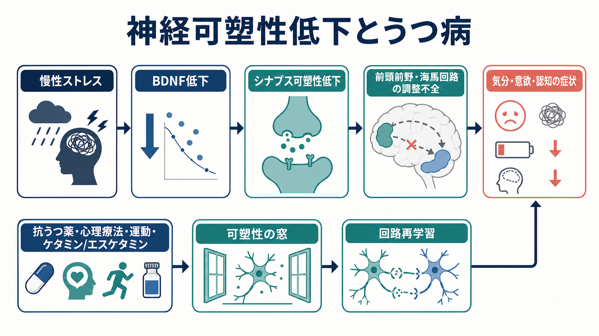
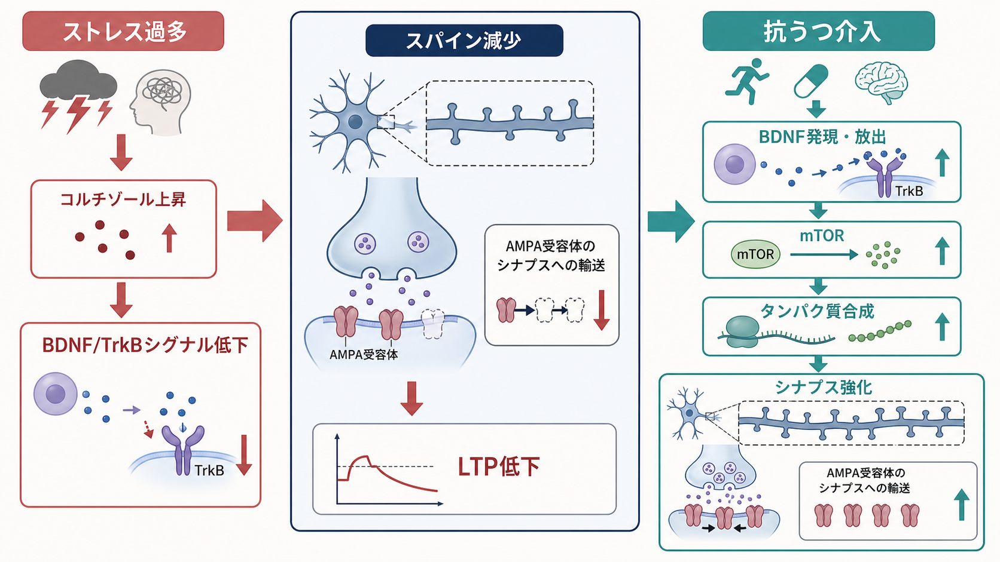
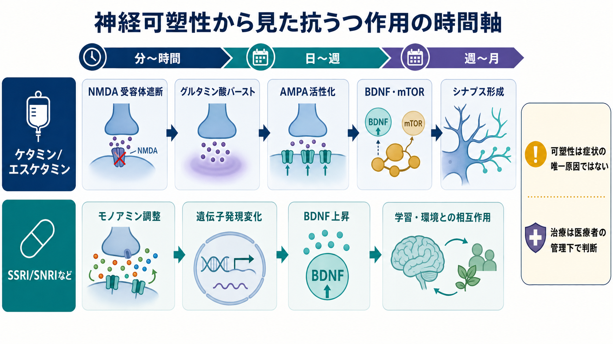

# 神経可塑性低下はうつ病をどう説明するのか

## 要点

- 神経可塑性低下仮説は、うつ病を「気分だけの問題」ではなく、慢性ストレスなどにより前頭前野・海馬などの回路が変化しにくくなる状態として捉える。
- BDNF/TrkBシグナル、樹状突起スパイン、[[シナプス可塑性とは何か|シナプス可塑性]]、[[長期増強LTPとは何か|LTP]]は、この仮説の中心語である。
- うつ病では前頭前野や海馬の体積低下、シナプス関連変化、末梢BDNF低下などが報告されるが、個人診断に使える単一マーカーではない[1][2][3]。
- 抗うつ薬、ケタミン/エスケタミン、心理療法、運動などは、症状を直接「消す」というより、脳回路が再学習しやすい可塑性の窓を開く介入として理解できる。
- この説明は教育・研究目的のモデルであり、個別の診断や治療選択を指示するものではない。

## この記事で答える問い

この記事では、[[神経可塑性は発達と学習をどう支えるのか|神経可塑性]]の低下が、うつ病のどの側面を説明し、どこまで説明できないのかを整理する。中心となる問いは次の4つである。

1. BDNFやシナプス可塑性は、うつ病研究でなぜ重要視されるのか。
2. 慢性ストレスは、前頭前野・海馬・シナプスにどのような影響を与えるのか。
3. SSRI/SNRIなどの抗うつ薬とケタミン/エスケタミンは、可塑性という観点からどう違って見えるのか。
4. 神経可塑性低下仮説を、どのように過大評価せずに使えばよいのか。

## まず結論

神経可塑性低下仮説の要点は、うつ病を「脳が変化できない病気」と単純化することではない。より正確には、慢性ストレス、炎症、睡眠リズム、報酬系、HPA軸、遺伝的脆弱性、生活環境などが重なり、前頭前野・海馬・扁桃体・報酬系を含む回路が、経験から柔軟に更新されにくい状態としてうつ病の一部を説明する、という見方である[1][2]。

この仮説が有用なのは、うつ病の症状を「気分の低下」だけでなく、「学習し直しにくさ」として読める点にある。たとえば、楽しい経験があっても価値更新が起こりにくい、休息しても疲労感の予測が変わりにくい、対人場面で安全な経験をしても脅威予測が残りやすい、といった現象は、回路の可塑性と結びつけて考えられる。

ただし、BDNF低下やシナプス減少がすべてのうつ病の原因だとは言えない。BDNF研究では、末梢血中BDNFが急性期うつ病で低く、治療後に上昇する傾向はメタ解析で示されている一方、BDNF遺伝子多型や末梢BDNFをもって個人の発症リスクや診断を十分に説明できるわけではない[3][4][5]。

## 背景

従来の抗うつ薬理解では、セロトニン、ノルアドレナリン、ドパミンなどのモノアミン系が中心に置かれてきた。これは今も重要であり、[[セロトニンは気分だけに関わるのか|セロトニン]]や[[ドパミンは報酬だけの物質なのか|ドパミン]]は、気分、意欲、睡眠、報酬学習、認知制御に関わる。

しかし、モノアミン濃度の変化だけでは、抗うつ薬の効果発現に数週かかること、心理療法や運動にも抗うつ効果があること、ケタミンが数時間から数日単位で作用しうることを十分に説明しにくい。そこで、薬物が神経伝達物質を変えるだけでなく、BDNF/TrkB、mTOR、AMPA受容体輸送、樹状突起スパイン形成などを通じて、回路の再編成しやすさを変えるという見方が発展した[2][6][7]。

慢性ストレスとうつ病の研究では、前頭前野と海馬が特に重要である。これらは気分の制御、記憶、予測、自己評価、ストレス応答の調節に関わる。うつ病では、これらの領域の体積低下やシナプス関連変化が報告されており、DumanとAghajanianは、うつ病をシナプス機能不全の観点から理解する枠組みを提示した[1]。この視点は、[[海馬萎縮はストレスやうつ病と関係するのか]]、[[前頭前野は情動制御にどう関わるのか]]、[[HPA軸は精神疾患にどう関わるのか]]と接続する。

## 基本概念

### 神経可塑性

神経可塑性とは、経験、学習、ストレス、薬物、発達、損傷などに応じて、神経系の結合や反応特性が変わる性質である。細胞レベルでは、[[シナプスとは何か|シナプス]]伝達効率、受容体数、樹状突起スパイン、遺伝子発現、タンパク質合成などが変わる。

うつ病の文脈では、神経可塑性は「回復力」と完全に同じではない。可塑性は、よい方向にも悪い方向にも働く。慢性ストレスにより脅威予測や回避行動が固定されることも可塑性の結果であり、治療や安全な経験を通じて回路が再学習することも可塑性の結果である。

### BDNFとTrkB

BDNFは brain-derived neurotrophic factor の略で、神経細胞の生存、樹状突起、シナプス形成、シナプス可塑性に関わる神経栄養因子である。BDNFはTrkB受容体に結合し、細胞内シグナルを通じてタンパク質合成やシナプス機能を調整する[2][4]。

BDNF仮説では、慢性ストレスやうつ病でBDNF/TrkBシグナルが低下し、海馬や前頭前野のシナプス機能が弱まり、気分・認知・意欲の調節が不安定になると考える。一方で、CastrenとMonteggiaは、BDNFと抗うつ作用の関係を支持する証拠がある一方、初期の知見の一部はより新しいメタ解析で十分に支持されていない点にも注意を促している[2]。

### シナプス可塑性とLTP

シナプス可塑性とは、活動履歴に応じてシナプスの伝達効率が変わる性質である。LTPは伝達効率が長く強まる現象、LTDは長く弱まる現象である。グルタミン酸シナプスでは、NMDA受容体、AMPA受容体、Ca2+流入、受容体輸送、スパイン形態変化が重要になる。

うつ病の説明では、LTPやスパイン形成が弱いことを「よい経験が記憶に残らない」と直接言い換えるのは粗い。より慎重には、前頭前野・海馬・報酬系の回路が、新しい経験や報酬予測から反応パターンを更新する力が弱まる可能性として捉えるのがよい。

## 仕組み

### 1. 慢性ストレスがBDNF/TrkBシグナルを弱める

慢性ストレスは、HPA軸、グルココルチコイド、グルタミン酸、炎症性シグナル、睡眠リズムなどを介して、神経回路の可塑性に影響する。動物研究では、慢性ストレスが前頭前野や海馬の樹状突起、スパイン、シナプス機能を変化させることが示されてきた[1][7]。

このときBDNFは、単なる「栄養」ではなく、活動依存的なシナプス変化を支える信号として働く。BDNF/TrkBシグナルが弱まると、シナプス関連タンパク質の合成、AMPA受容体輸送、スパイン維持が弱まり、回路が新しい経験に応じて更新されにくくなる可能性がある[2][6]。

### 2. 前頭前野・海馬回路が調整しにくくなる

前頭前野は、情動反応、注意、行動選択、再評価、衝動制御に関わる。海馬は記憶だけでなく、文脈処理やストレス応答の調整にも関わる。慢性ストレスとうつ病でこれらの領域に変化が出ると、脅威や失敗の予測が残りやすくなり、報酬や安全の経験から学習しにくくなる。

DumanとAghajanianは、うつ病では前頭前野や海馬など気分と認知を調整する領域でシナプス関連の低下が起こり、抗うつ作用はこれらのシナプス欠損を回復させる方向に働く可能性があると整理した[1]。この見方は、[[報酬系の異常はうつ病をどう説明するのか]]や[[炎症仮説はうつ病をどう説明するのか]]と競合するというより、別の階層から同じ症状を説明する。

### 3. 抗うつ薬は「可塑性の窓」を開く

SSRIやSNRIなどの抗うつ薬は、投与直後からモノアミン系に作用するが、症状改善には数週かかることが多い。この遅れは、神経伝達物質の変化だけでなく、遺伝子発現、BDNF、受容体感受性、シナプス再編成などの時間を要する過程が関わる可能性を示す。

末梢BDNFに関しては、Senらのメタ解析で、うつ病群では血清BDNFが健常対照より低く、抗うつ薬治療後に上昇する傾向が報告された[3]。さらに、Kishiらのメタ解析レビューも、末梢BDNFは発症リスクの単純な原因というより、うつ状態や治療反応を反映する状態マーカーとして理解するのが妥当だと述べている[5]。

重要なのは、可塑性が高まるだけで自動的に回復するわけではないことである。可塑性の窓が開いても、その期間にどのような睡眠、対人経験、行動活性化、心理療法、運動、生活環境があるかによって、回路がどの方向へ学習するかは変わる。

### 4. ケタミン/エスケタミンは速い可塑性変化を示すモデルになる

ケタミンはNMDA受容体拮抗薬であり、低用量では治療抵抗性うつ病で速い抗うつ効果を示すことが知られている。前臨床研究では、ケタミンがグルタミン酸バースト、AMPA受容体活性化、BDNF放出、mTORC1シグナル、タンパク質合成、スパイン形成を通じて、前頭前野のシナプス形成を速く促す可能性が示されている[6][7]。

Liらの研究では、ケタミンがラット前頭前野でmTOR経路を速く活性化し、シナプス関連タンパク質、スパイン数、シナプス機能を増やし、mTOR阻害で行動効果が遮断された[6]。Dumanのレビューは、ケタミンなどの速効性抗うつ薬が、慢性ストレスで減少したシナプス数や機能を回復させる方向に働くモデルを提示している[7]。

ただし、臨床でのケタミン/エスケタミンは安全管理が不可欠である。米国FDAの2025年版SPRAVATOラベルでは、エスケタミン鼻腔スプレーは成人の治療抵抗性うつ病に対して単剤または経口抗うつ薬との併用で適応があり、鎮静、解離、呼吸抑制、乱用・誤用などのリスクからREMS下で医療者の監督と投与後モニタリングが必要とされている[8]。

## 図解

1枚目は、慢性ストレス、BDNF低下、シナプス可塑性低下、前頭前野・海馬回路の調整不全、症状をひとつの流れとして整理した概念地図である。下段には、抗うつ薬、心理療法、運動、ケタミン/エスケタミンなどの介入が、可塑性の窓と回路再学習へつながる可能性を示した。

2枚目は、BDNF/TrkBシグナル低下からスパイン減少、LTP低下へ至る流れと、抗うつ介入がBDNF発現・放出、mTOR、タンパク質合成、シナプス強化に関わる流れを対比した。ここでの矢印は研究モデルであり、すべての患者に同じ順序で起こることを意味しない。

3枚目は、ケタミン/エスケタミンとSSRI/SNRIなどを、神経可塑性の時間軸として比較した。ケタミン/エスケタミンは速いグルタミン酸・AMPA・BDNF/mTOR経路のモデルとして、SSRI/SNRIなどはモノアミン調整から遺伝子発現・BDNF・環境との相互作用へ進むモデルとして描いている。

## 臨床・研究との接続

神経可塑性低下仮説は、うつ病を単一原因で説明するモデルではなく、複数の治療や研究指標をつなぐ橋渡しモデルである。臨床的には、「薬で神経伝達物質を変える」「心理療法で認知や行動を変える」「運動や睡眠で生理状態を整える」を別々の話としてではなく、回路の再学習を支える条件づくりとして統合的に理解できる。

研究上は、BDNF、スパイン、シナプス関連タンパク質、機能的結合、報酬学習、認知制御、ストレスホルモン、炎症マーカーなどを、異なる階層の指標として組み合わせる必要がある。末梢BDNFは有用な候補マーカーだが、脳内BDNFを直接測っているわけではなく、血小板、炎症、運動、採血条件、薬物、年齢、性別などの影響を受ける。

臨床的な読み方としては、「この人はBDNFが低いからうつ病である」と考えるのではなく、「この人の症状には、ストレス応答、報酬学習、睡眠、対人環境、認知制御、身体疾患がどう関わり、その中で可塑性を高める条件をどのように作れるか」と問う方が実用的である。

## よくある誤解

### 誤解1: うつ病はBDNF不足である

BDNFは重要だが、うつ病をBDNF不足だけに還元するのは不正確である。BDNF研究には支持的な結果がある一方、遺伝子多型、末梢血中BDNF、脳内BDNF、症状、治療反応の関係は単純ではない[2][5]。

### 誤解2: 神経可塑性が高いほどよい

可塑性は変化しやすさであり、方向を含まない。ストレスで不適応な予測や回避が強化されることも可塑性である。治療で重要なのは、可塑性を高めることだけでなく、安全で反復可能な学習環境を整えることである。

### 誤解3: ケタミンはシナプスを増やすから安全に使える

これは危険な飛躍である。ケタミン/エスケタミンには鎮静、解離、血圧上昇、乱用・誤用などのリスクがあり、適応、禁忌、投与環境、モニタリングが重要である[8]。本記事は作用機序の教育的説明であり、使用判断を勧めるものではない。

### 誤解4: 神経可塑性低下仮説は心理社会的要因を軽視する

むしろ逆である。可塑性の観点では、対人関係、生活リズム、運動、心理療法、職場・家庭環境、睡眠、安全感が、回路の再学習に影響する条件として重要になる。脳と環境を切り離さずに見るための仮説として使える。

## 関連ノート

- 既存ノート: [[神経可塑性は発達と学習をどう支えるのか]]
- 既存ノート: [[シナプス可塑性とは何か]]
- 既存ノート: [[長期増強LTPとは何か]]
- 既存ノート: [[シナプスとは何か]]
- 既存ノート: [[グルタミン酸は脳で何をしているのか]]
- 既存ノート: [[セロトニンは気分だけに関わるのか]]
- 既存ノート: [[前頭前野は情動制御にどう関わるのか]]
- 既存ノート: [[海馬萎縮はストレスやうつ病と関係するのか]]
- 既存ノート: [[HPA軸は精神疾患にどう関わるのか]]
- 既存ノート: [[報酬系の異常はうつ病をどう説明するのか]]
- 既存ノート: [[炎症仮説はうつ病をどう説明するのか]]
- MOC更新候補: [[MOC｜脳・神経科学]]
- MOC更新候補: [[MOC｜精神医学]]
- MOC更新候補: [[MOC｜基礎神経科学]]

## 理解チェック

1. 神経可塑性低下仮説は、うつ病のどの側面を説明しやすいか。
2. BDNF/TrkBシグナルとシナプス可塑性は、どのように関係するか。
3. 末梢BDNFを、うつ病の単純な診断マーカーとして使いにくい理由は何か。
4. SSRI/SNRIなどとケタミン/エスケタミンを、可塑性の時間軸で比較すると何が見えるか。
5. 「可塑性が高いほどよい」という理解が不十分な理由は何か。

## 未解決問題

- 末梢BDNFの変化が、脳内のどの領域・細胞種・シナプス変化をどの程度反映するのか。
- うつ病のサブタイプごとに、BDNF、炎症、報酬学習、HPA軸、睡眠、認知制御のどの経路が主要になるのか。
- 可塑性の窓が開いた時期に、心理療法、運動、睡眠介入、社会的支援をどう組み合わせると回復学習が最大化されるのか。
- ケタミン/エスケタミンの速効性と長期安全性、再発予防、最適な維持戦略をどのように評価するか。

## 参考文献

[1] Duman, R. S., & Aghajanian, G. K. (2012). Synaptic dysfunction in depression: potential therapeutic targets. *Science*, 338(6103), 68-72. https://doi.org/10.1126/science.1222939

[2] Castren, E., & Monteggia, L. M. (2021). Brain-Derived Neurotrophic Factor Signaling in Depression and Antidepressant Action. *Biological Psychiatry*, 90(2), 128-136. https://doi.org/10.1016/j.biopsych.2021.05.008

[3] Sen, S., Duman, R., & Sanacora, G. (2008). Serum brain-derived neurotrophic factor, depression, and antidepressant medications: meta-analyses and implications. *Biological Psychiatry*, 64(6), 527-532. https://doi.org/10.1016/j.biopsych.2008.05.005

[4] Autry, A. E., & Monteggia, L. M. (2012). Brain-Derived Neurotrophic Factor and Neuropsychiatric Disorders. *Pharmacological Reviews*, 64(2), 238-258. https://doi.org/10.1124/pr.111.005108

[5] Kishi, T., Yoshimura, R., Ikuta, T., & Iwata, N. (2018). Brain-Derived Neurotrophic Factor and Major Depressive Disorder: Evidence from Meta-Analyses. *Frontiers in Psychiatry*, 8, 308. https://doi.org/10.3389/fpsyt.2017.00308

[6] Li, N., Lee, B., Liu, R. J., Banasr, M., Dwyer, J. M., Iwata, M., Li, X. Y., Aghajanian, G., & Duman, R. S. (2010). mTOR-dependent synapse formation underlies the rapid antidepressant effects of NMDA antagonists. *Science*, 329(5994), 959-964. https://doi.org/10.1126/science.1190287

[7] Duman, R. S. (2018). Ketamine and rapid-acting antidepressants: a new era in the battle against depression and suicide. *F1000Research*, 7, 659. https://doi.org/10.12688/f1000research.14344.1

[8] U.S. Food and Drug Administration. (2025). *SPRAVATO (esketamine) nasal spray, CIII: Prescribing Information*. Revised 04/2025. https://www.accessdata.fda.gov/drugsatfda_docs/label/2025/211243s019lbl.pdf

## 更新ログ

- 2026-04-27: 初版作成。BDNF、シナプス可塑性、慢性ストレス、抗うつ薬、ケタミン/エスケタミン、図解、参考文献を整理。
