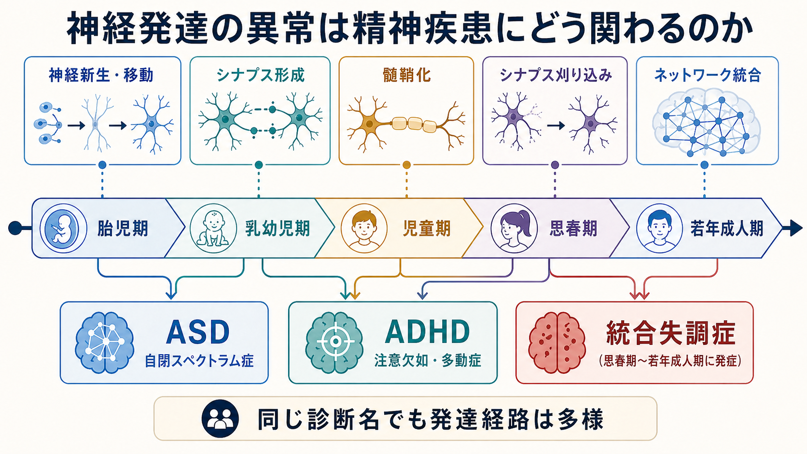
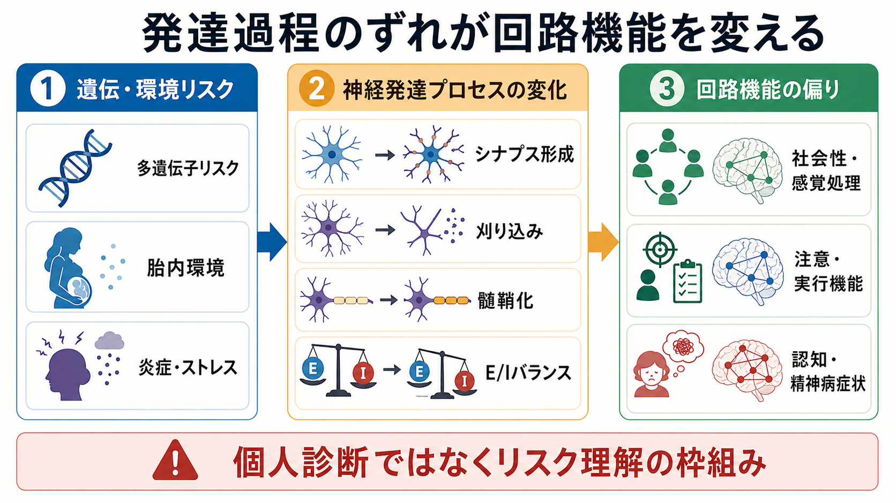
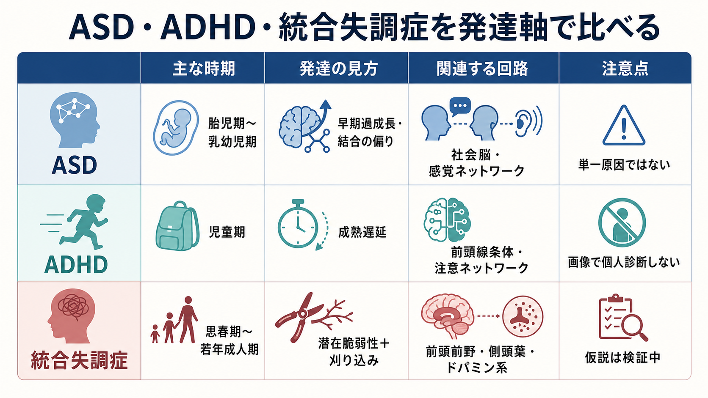

# 神経発達の異常は精神疾患にどう関わるのか

## 要点

- 精神疾患の一部は、成人後に突然始まる「完成した脳の故障」だけではなく、胎児期から思春期にかけて進む[[神経回路の発達はどのように進むのか|神経回路の発達]]の偏りとして理解できる。
- ASD、ADHD、統合失調症はいずれも神経発達と関係するが、関わる時期・回路・症状の出方は同じではない。
- 発達の異常は単一原因ではなく、遺伝リスク、胎内環境、炎症、ストレス、経験、社会的環境が重なって、回路の成熟軌道を変える。
- 脳画像や遺伝子だけで個人を診断する段階ではない。臨床では、発達歴、現在の機能、環境との相互作用を合わせて理解する必要がある。

## この記事で答える問い

神経発達の異常という言葉は、ASDやADHDだけでなく、統合失調症の理解にも使われる。では、胎児期、乳幼児期、児童期、思春期の脳発達のどの変化が、どのように精神疾患のリスクや症状に結びつくのだろうか。

## まず結論

神経発達の異常とは、「脳の部品が壊れる」というより、細胞移動、シナプス形成、髄鞘化、[[シナプス刈り込みはなぜ重要なのか|シナプス刈り込み]]、ネットワーク統合のタイミングや強さがずれ、結果として情報処理の仕方が変わることを指す。発達早期のずれは社会性・感覚処理・注意の違いとして現れやすく、思春期以降の再編成の時期には、認知機能、動機づけ、現実検討、精神病症状の脆弱性として表面化することがある[1][2]。

## 背景

ヒトの脳は、胎児期に神経細胞が生まれて移動し、乳幼児期から児童期にかけて大量のシナプスを形成し、経験に応じて結合を強めたり弱めたりする。思春期には前頭前野を含む連合野で灰白質量の変化、白質成熟、シナプスの整理が続き、認知制御や社会的判断に関わるネットワークが再編成される[1][2]。

このため、精神疾患を発症時点だけで見ると見落としが生じる。たとえば統合失調症は思春期から若年成人期に発症しやすいが、リスクの一部は胎児期・小児期からの神経発達過程に由来すると考えられている[6]。一方、ASDやADHDはより早期から行動特徴が目立ちやすく、発達歴そのものが診断理解の中心になる[3][5]。

## 基本概念

### 神経発達

神経発達は、ニューロンが増える過程だけではない。神経細胞の移動、軸索誘導、シナプス形成、髄鞘化、興奮性・抑制性入力の調整、不要な結合の除去、長距離ネットワークの統合を含む。これらは[[神経可塑性は発達と学習をどう支えるのか|神経可塑性]]と連続しており、遺伝的プログラムと経験依存的な変化が重なる。

### 発達軌道

発達軌道とは、ある機能や脳構造が年齢とともにどう変化するかを表す考え方である。重要なのは、ある時点の値だけでなく、変化の速さ、順序、タイミングである。ADHDでは、皮質成熟のタイミングが平均より遅れるという縦断MRI研究が知られており、単純な「前頭葉が小さい」という見方よりも、発達のペースに注目する視点を与えた[5]。

### 脆弱性と発症

脆弱性は、症状そのものではない。遺伝リスク、発達早期の環境、ストレス、社会的逆境などが重なって、一定の条件で症状が出やすくなる状態である。したがって、神経発達の異常は「将来必ず精神疾患になる」という意味ではなく、発達経路の幅を変えるリスク因子として捉えるのが適切である。

## 仕組み

### 1. 遺伝リスクは回路形成の確率を変える

ASD、ADHD、統合失調症には多遺伝子性があり、個々の遺伝子が単独で疾患を決めるわけではない。多数の小さな効果が、シナプス、クロマチン制御、神経伝達、免疫関連経路などに影響し、発達過程の感受性を変える。精神疾患間で遺伝リスクが一部共有されることも、診断カテゴリを越えた神経発達的連続性を示唆する[8]。

### 2. シナプス形成と刈り込みのずれが情報処理を変える

発達期には多めに作られた結合が経験に応じて整理される。整理が過剰でも不足でも、局所回路と長距離ネットワークのバランスが変わる。統合失調症では、補体C4を含む免疫関連分子がシナプス刈り込みに関与する可能性が示され、遺伝リスクと発達期の回路整理を結ぶ有力な仮説になっている[7]。ただし、これは統合失調症全体を単独で説明する完成した理論ではない。

### 3. E/Iバランスの変化は感覚・認知・精神病症状に波及する

興奮性入力と抑制性入力の釣り合いである[[E_Iバランスとは何か|E/Iバランス]]は、発達期の回路安定化に重要である。抑制性介在ニューロンの成熟やシナプス機能の変化は、感覚過敏、注意の揺らぎ、認知制御の低下、ガンマ同期の変化などと関連づけて研究されている。ASDの一部でも、過剰結合・低結合という単純な二分法ではなく、領域・年齢・課題によって結合の偏りが異なると考えられる[4]。

### 4. 髄鞘化とネットワーク統合が認知制御を支える

髄鞘化は神経伝導を速くし、遠い脳領域どうしのタイミングを合わせる。前頭前野、線条体、側頭葉、頭頂葉などを結ぶネットワークの成熟は、注意、ワーキングメモリ、社会的推論、現実検討に関わる。したがって、[[脳ネットワークの破綻は精神疾患をどう説明するのか|脳ネットワークの破綻]]は、症状を局所病変ではなく分散した回路の問題として見る視点を与える。

## 図解

次の比較図は、ASD・ADHD・統合失調症を「発達のどの時期に、どの機能の偏りとして見えやすいか」という軸で整理したものである。実際には併存、個人差、発達段階ごとの変化が大きいため、この表は診断基準ではなく理解の地図として読む。

## 臨床・研究との接続

### ASD

ASDでは、社会的コミュニケーション、感覚処理、反復行動などの特徴が早期から現れやすい。神経発達の観点では、胎児期から乳幼児期にかけての皮質発達、シナプス形成、局所・長距離結合の偏りが注目される[3][4]。ただし、ASDは単一の脳パターンではなく、発達歴、知的機能、言語発達、感覚特性、併存症によって大きく異なる。

### ADHD

ADHDでは、不注意、多動性、衝動性が中心になる。縦断MRI研究は、ADHDの一部で皮質成熟のピークが遅れることを示し、発達遅延モデルを支えた[5]。臨床的には、成熟が遅いという表現だけで片づけず、実行機能、報酬感受性、睡眠、家庭・学校環境、併存する不安や学習困難を合わせて評価する必要がある。

### 統合失調症

統合失調症では、思春期から若年成人期にかけて陽性症状、陰性症状、認知機能障害が目立つことが多い。神経発達仮説は、早期からの脆弱性が、思春期のシナプス刈り込み、ホルモン変化、ストレス、社会的要求の増加と重なって顕在化するという見方を提供する[2][6]。補体C4研究はこの仮説に分子レベルの足場を与えたが、統合失調症はドパミン、グルタミン酸、ストレス、社会的要因も含む多層的な疾患である[7]。

## よくある誤解

### 誤解1: 神経発達の異常は生まれつきで変わらない

発達早期の要因は重要だが、脳は発達後も変化する。教育、環境調整、心理社会的支援、薬物療法、睡眠、ストレス低減は、症状の出方や機能予後に影響しうる。神経発達という言葉は、固定的な運命ではなく、変化しうる発達経路を理解するための枠組みである。

### 誤解2: ASD・ADHD・統合失調症は同じ発達障害である

共通する発達基盤や遺伝的重なりはあるが、臨床像、発症時期、支援ニーズは異なる[8]。共通性を見ることは有用だが、診断名ごとの具体的な困りごとを消してしまってはいけない。

### 誤解3: 脳画像で個人診断できる

研究では群平均の差や発達軌道の違いが示されるが、それをそのまま個人診断に使うことはできない。画像所見は、研究上の仮説生成や病態理解には役立つが、臨床判断では発達歴、面接、行動観察、心理検査、生活機能の評価と統合する必要がある。

## 関連ノート

- [[神経回路の発達はどのように進むのか]]
- [[シナプス刈り込みはなぜ重要なのか]]
- [[E_Iバランスとは何か]]
- [[神経可塑性は発達と学習をどう支えるのか]]
- [[脳ネットワークの破綻は精神疾患をどう説明するのか]]
- [[ミクログリアは脳の免疫細胞として何をしているのか]]

### 関連ノート候補

- ASDとは何か
- ADHDとは何か
- 統合失調症とは何か
- 統合失調症の前駆期とは何か
- 発達障害と精神疾患の併存

### MOC更新候補

- MOC 脳・神経科学
- MOC 精神医学
- MOC 神経科学と精神疾患

## 理解チェック

1. 神経発達の異常を「脳の故障」ではなく「発達軌道のずれ」と見る利点は何か。
2. ASD、ADHD、統合失調症では、神経発達との関係がどの時期に目立ちやすいか。
3. シナプス刈り込みやE/Iバランスの異常は、なぜ症状を単独で決める原因とは言えないのか。
4. 脳画像研究の知見を、個人診断にそのまま使えない理由は何か。

## 未解決問題

- 発達期のどの時点の変化が、どの症状ドメインにどれだけ寄与するのかは、まだ十分に分離できていない。
- ASD、ADHD、統合失調症にまたがる共通リスクと、診断ごとの固有リスクをどう切り分けるかは研究途上である。
- 脳画像、遺伝子、認知課題、生活機能を統合して、個別支援に使える予測モデルを作るには、再現性と臨床的有用性の検証が必要である。

## 参考文献

[1] Gogtay, N., Giedd, J. N., Lusk, L., et al. (2004). Dynamic mapping of human cortical development during childhood through early adulthood. *Proceedings of the National Academy of Sciences*, 101(21), 8174-8179. https://doi.org/10.1073/pnas.0402680101

[2] Paus, T., Keshavan, M., & Giedd, J. N. (2008). Why do many psychiatric disorders emerge during adolescence? *Nature Reviews Neuroscience*, 9, 947-957. https://doi.org/10.1038/nrn2513

[3] Lord, C., Elsabbagh, M., Baird, G., & Veenstra-VanderWeele, J. (2018). Autism spectrum disorder. *The Lancet*, 392(10146), 508-520. https://doi.org/10.1016/S0140-6736(18)31129-2

[4] Geschwind, D. H., & Levitt, P. (2007). Autism spectrum disorders: developmental disconnection syndromes. *Current Opinion in Neurobiology*, 17(1), 103-111. https://doi.org/10.1016/j.conb.2007.01.009

[5] Shaw, P., Eckstrand, K., Sharp, W., et al. (2007). Attention-deficit/hyperactivity disorder is characterized by a delay in cortical maturation. *Proceedings of the National Academy of Sciences*, 104(49), 19649-19654. https://doi.org/10.1073/pnas.0707741104

[6] Rapoport, J. L., Giedd, J. N., & Gogtay, N. (2012). Neurodevelopmental model of schizophrenia: update 2012. *Molecular Psychiatry*, 17, 1228-1238. https://doi.org/10.1038/mp.2012.23

[7] Sekar, A., Bialas, A. R., de Rivera, H., et al. (2016). Schizophrenia risk from complex variation of complement component 4. *Nature*, 530, 177-183. https://doi.org/10.1038/nature16549

[8] Cross-Disorder Group of the Psychiatric Genomics Consortium. (2019). Genomic relationships, novel loci, and pleiotropic mechanisms across eight psychiatric disorders. *Cell*, 179(7), 1469-1482.e11. https://doi.org/10.1016/j.cell.2019.11.020
