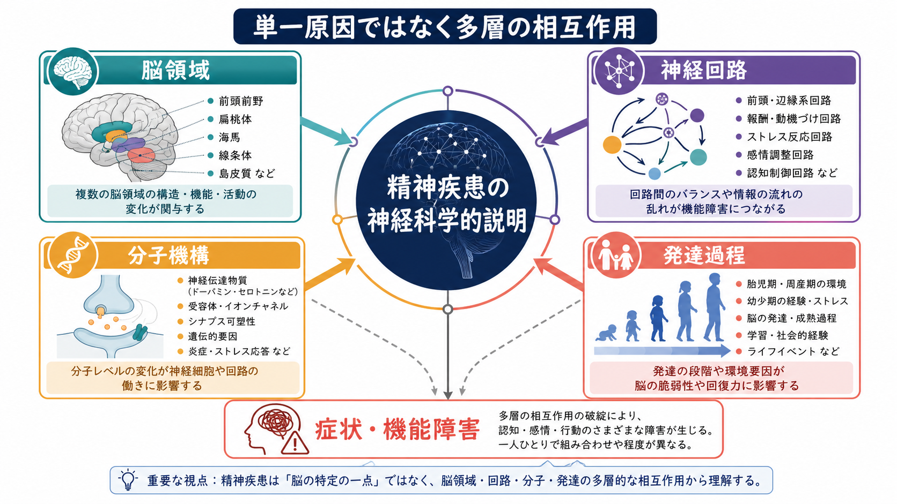
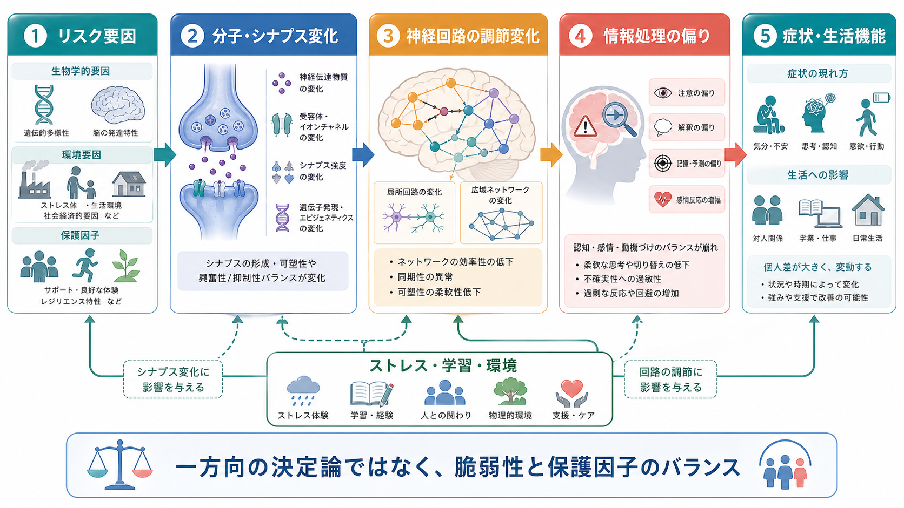
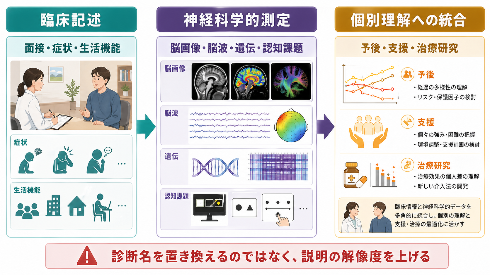

# 神経科学は精神疾患をどのように説明できるのか

## 要点

- 精神疾患は「脳の一部が壊れた状態」と単純化できない。症状は、脳領域、神経回路、分子・シナプス機構、発達過程、環境経験が重なって現れる。
- DSMなどの診断分類は臨床的な記述に強いが、病態機序をそのまま表す分類ではない。神経科学は、診断名の背後にある認知・感情・行動の次元を説明する道具になる[1][2]。
- 現時点で、脳画像や遺伝情報だけから個人の精神疾患を確定診断することは一般にはできない。神経科学的データは、症状理解、予後研究、介入標的の検討に使うのが基本である[3][4]。
- 教育・研究上は、[[ニューロンとは何か]]、[[シナプスとは何か]]、[[神経伝達物質はどのように放出されるのか]]、[[E_Iバランスとは何か]]、[[神経可塑性は発達と学習をどう支えるのか]]をつなげて読むと理解しやすい。

## この記事で答える問い

この記事の問いは、「神経科学は、精神疾患の症状をどの階層から説明できるのか」である。ここでいう説明とは、個別の人を診断したり治療方針を断定したりすることではなく、症状がどのような脳・身体・環境の仕組みと関係しうるかを整理することである。

## まず結論

神経科学が精神疾患を説明するときの基本形は、「診断名から脳部位を一対一対応させる」ことではない。むしろ、症状を複数の説明階層に分けて考える。

| 説明階層 | 何を見るか | 例 |
|---|---|---|
| 脳領域 | どの領域がどの機能に関わるか | 扁桃体、海馬、前頭前野、線条体 |
| 神経回路 | 領域間の情報の流れと制御 | [[サリエンスネットワークとは何か]]、[[デフォルトモードネットワークとは何か]]、前頭線条体回路 |
| 分子・シナプス | 受容体、神経伝達物質、可塑性 | [[ドパミンは報酬だけの物質なのか]]、[[セロトニンは気分だけに関わるのか]]、GABA、グルタミン酸 |
| 発達過程 | いつ、どの経験と脳成熟が重なるか | [[シナプス刈り込みはなぜ重要なのか]]、思春期、ストレス経験 |
| 行動・環境 | 症状が生活の中でどう維持・変化するか | 回避、睡眠、社会的支援、学習履歴 |

このような多層説明は、精神疾患を「脳だけの問題」に閉じ込めるためではない。むしろ、脳、身体、発達、環境、社会的文脈を接続して、症状の成り立ちを細かく見るための枠組みである[5]。

## 背景

精神疾患の診断は、主に面接、症状、持続期間、生活機能への影響、除外診断にもとづく。DSM-5では、精神疾患は認知、情動調節、行動における臨床的に重要な障害であり、その背後に心理学的・生物学的・発達的過程の機能不全が想定される、と定義される[1]。

ただし、この定義は「すべての診断名に固有の単一病因がある」という意味ではない。たとえば、うつ、不安、強迫、依存、統合失調症、発達障害などは、症状のまとまりとしては区別されるが、遺伝的リスク、認知機能、脳回路、環境ストレスは部分的に重なり合う[6]。

この限界を補う試みの一つが、NIMHのResearch Domain Criteria、すなわちRDoCである。RDoCは、診断名よりも、報酬学習、脅威反応、認知制御、社会過程、覚醒調節などの機能次元を、遺伝子、分子、細胞、回路、行動、自己報告と対応づけて研究する枠組みである[2][7]。

## 基本概念

### 症状は説明階層をまたぐ

不安、意欲低下、幻覚、衝動性、注意困難、対人機能の障害といった症状は、単独の脳領域だけでは説明しにくい。たとえば「不安」は、扁桃体だけではなく、前頭前野による制御、海馬による文脈記憶、自律神経反応、回避学習、社会的経験と関係する。

このため、神経科学的説明では、[[前頭頭頂ネットワークは認知制御をどう支えるのか]]のような制御系、[[大脳基底核ループとは何か]]のような行動選択系、[[海馬回路は記憶をどう形成するのか]]のような記憶系を組み合わせて考える。

### 診断名と神経機序は同じ粒度ではない

診断名は、臨床現場で共有しやすい記述単位である。一方、神経機序は、より細かい機能単位を扱う。たとえば「うつ病」という診断名の中にも、報酬感受性の低下が目立つ人、睡眠・覚醒リズムの乱れが目立つ人、反すうや認知制御の困難が目立つ人がいる。逆に、報酬学習や脅威反応の変化は、複数の診断群にまたがって現れる。

### 分子は「原因」ではなく回路の調節因子である

セロトニン、ドパミン、グルタミン酸、GABAなどの神経伝達物質は、症状と関係しうる。しかし、「うつ病はセロトニン不足」「統合失調症はドパミン過剰」といった単純な説明は不十分である。神経伝達物質は、受容体、発火パターン、シナプス可塑性、発達段階、薬理作用、環境ストレスと組み合わさって働く[5]。

## 仕組み

精神疾患を神経科学的に説明するときは、次のような流れで考えると整理しやすい。

1. 遺伝的多様性、胎児期・幼少期の環境、ストレス、感染、睡眠、物質使用、社会的経験などが、発達中または成人期の脳に影響する。
2. その影響は、受容体発現、神経伝達、シナプス強度、炎症反応、ホルモン応答、神経可塑性などに現れる。
3. 分子・細胞レベルの変化は、局所回路や長距離ネットワークの活動パターン、同期、結合、興奮と抑制のバランスを変える。
4. 回路の変化は、注意、予測、価値評価、感情調節、記憶、社会認知、行動選択の偏りとして現れる。
5. その偏りが、本人の生活環境や学習履歴と相互作用し、症状や生活機能の困難として観察される。

この流れは、一方向の決定論ではない。症状が強くなると、睡眠、活動量、対人関係、学習機会、ストレス反応が変わり、それが再び脳回路や身体状態に影響する。したがって、神経科学的説明は「脳が原因で生活が結果」という単純な矢印ではなく、脳と環境の循環として捉える必要がある。

## 図解

この記事の3枚の図は、次の役割で読むとよい。

| 図 | 読み方 |
|---|---|
| 概念地図 | 精神疾患を、脳領域・神経回路・分子機構・発達過程の相互作用として見る |
| メカニズム図 | リスク要因から症状までを、分子、回路、情報処理、生活機能の連鎖として見る |
| 臨床・研究接続図 | 神経科学的測定は診断名を置き換えるのではなく、説明の解像度を上げるものとして見る |

## 臨床・研究との接続

神経科学の強みは、症状記述だけでは見えにくい中間過程を調べられる点にある。脳画像は構造的結合や機能的結合を、脳波は時間分解能の高い神経活動を、遺伝研究はリスクの分布を、認知課題は情報処理の偏りを調べる。

しかし、これらの測定は、現時点では多くの場合、個人診断の決定打ではない。精神疾患は異質性が大きく、同じ診断名でも脳・認知・環境の組み合わせが異なる。また、同じ神経指標が複数の診断群にまたがって現れることもある[3][4]。

そのため、実践上は次のように考えるのが安全である。

| 用途 | 適切な使い方 | 注意点 |
|---|---|---|
| 研究 | 症状次元、回路、遺伝、認知課題の関連を調べる | 群平均を個人にそのまま当てはめない |
| 臨床理解 | 症状の背景仮説を広げる | 脳画像だけで診断を断定しない |
| 治療研究 | 薬物療法、心理療法、ニューロモデュレーションの作用機序を調べる | 効果の個人差を前提にする |
| 支援 | 睡眠、ストレス、学習、対人環境などの調整点を見つける | 個人の責任に還元しない |

## よくある誤解

### 誤解1: 精神疾患には必ず一つの脳部位が対応する

精神疾患の多くは、単一部位よりも回路・ネットワークの問題として理解した方がよい。前頭前野、辺縁系、線条体、海馬、視床、小脳、島皮質などは、それぞれ孤立して働くのではなく、機能的なネットワークの中で役割を持つ。

### 誤解2: 分子機構がわかれば症状は完全に説明できる

分子機構は重要だが、それだけでは不十分である。薬が受容体やトランスポーターに作用しても、臨床効果は回路、学習、睡眠、ストレス、社会的支援、期待、時間経過に依存する。分子は説明の出発点であって、症状全体の完全な説明ではない。

### 誤解3: 脳画像があれば個人診断できる

研究では、群平均として脳構造や機能結合の違いが見つかることがある。しかし、個人差、測定誤差、発達段階、薬物、併存症、生活状況が大きいため、脳画像だけで精神疾患を診断することは一般的ではない[3][4]。

### 誤解4: 神経科学的説明は心理社会的説明を否定する

むしろ逆である。ストレス、トラウマ、学習、対人関係、社会的支援は、神経可塑性、ストレス応答、睡眠、報酬学習、認知制御を通じて脳と結びつく。神経科学は、心理社会的要因を「脳に関係ないもの」として切り離すのではなく、脳と環境の相互作用として扱う。

## 関連ノート

- [[ニューロンとは何か]]
- [[シナプスとは何か]]
- [[神経伝達物質はどのように放出されるのか]]
- [[神経可塑性は発達と学習をどう支えるのか]]
- [[シナプス刈り込みはなぜ重要なのか]]
- [[E_Iバランスとは何か]]
- [[ドパミンは報酬だけの物質なのか]]
- [[セロトニンは気分だけに関わるのか]]
- [[サリエンスネットワークとは何か]]
- [[デフォルトモードネットワークとは何か]]
- [[前頭頭頂ネットワークは認知制御をどう支えるのか]]
- [[大脳基底核ループとは何か]]

## MOC更新候補

- `content/00_MOC/` 配下に脳・神経科学または精神医学のMOCがある場合、本記事を「神経科学と精神疾患」の導入ノートとして追加する。
- 並列ジョブとの競合を避けるため、このタスクではMOC本体は更新しない。

## 理解チェック

1. 精神疾患を「脳領域だけ」で説明すると、どのような限界があるか。
2. DSMの診断分類とRDoCの研究枠組みは、何をそれぞれ得意としているか。
3. 神経伝達物質の説明が、症状の完全な説明にならない理由は何か。
4. 脳画像や遺伝情報を、個人診断にそのまま使いにくい理由は何か。
5. 心理社会的要因は、どのように神経科学的説明と接続できるか。

## 未解決問題

- 診断名を超えて共有される神経回路の異常と、診断群に比較的特異的な異常をどう分けるか。
- 群平均の神経科学的知見を、個人の支援や予後予測にどこまで使えるか。
- 発達段階、性差、文化差、社会経済的要因を、神経科学モデルにどう組み込むか。
- 脳画像、遺伝、認知課題、日常生活データを統合したモデルが、臨床的に有用な説明をどこまで提供できるか。

## 参考文献

[1] American Psychiatric Association. (2013). *Diagnostic and Statistical Manual of Mental Disorders, Fifth Edition*. American Psychiatric Publishing. https://doi.org/10.1176/appi.books.9780890425596

[2] Insel, T., Cuthbert, B., Garvey, M., Heinssen, R., Pine, D. S., Quinn, K., Sanislow, C., & Wang, P. (2010). Research Domain Criteria (RDoC): Toward a new classification framework for research on mental disorders. *American Journal of Psychiatry, 167*(7), 748-751. https://doi.org/10.1176/appi.ajp.2010.09091379

[3] Woo, C. W., Chang, L. J., Lindquist, M. A., & Wager, T. D. (2017). Building better biomarkers: Brain models in translational neuroimaging. *Nature Neuroscience, 20*(3), 365-377. https://doi.org/10.1038/nn.4478

[4] Marek, S., Tervo-Clemmens, B., Calabro, F. J., et al. (2022). Reproducible brain-wide association studies require thousands of individuals. *Nature, 603*, 654-660. https://doi.org/10.1038/s41586-022-04492-9

[5] Kendler, K. S. (2012). The dappled nature of causes of psychiatric illness: Replacing the organic-functional/hardware-software dichotomy with empirically based pluralism. *Molecular Psychiatry, 17*, 377-388. https://doi.org/10.1038/mp.2011.182

[6] Cross-Disorder Group of the Psychiatric Genomics Consortium. (2013). Genetic relationship between five psychiatric disorders estimated from genome-wide SNPs. *Nature Genetics, 45*, 984-994. https://doi.org/10.1038/ng.2711

[7] National Institute of Mental Health. Research Domain Criteria (RDoC). https://www.nimh.nih.gov/research/research-funded-by-nimh/rdoc

[8] Casey, B. J., Oliveri, M. E., & Insel, T. (2014). A neurodevelopmental perspective on the Research Domain Criteria (RDoC) framework. *Biological Psychiatry, 76*(5), 350-353. https://doi.org/10.1016/j.biopsych.2014.01.006
