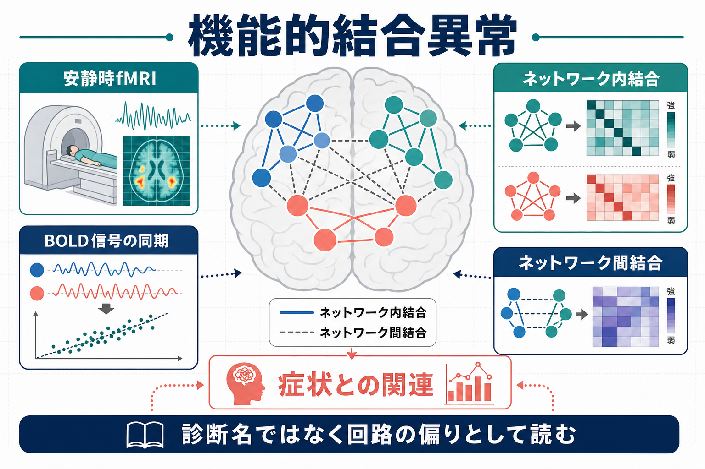
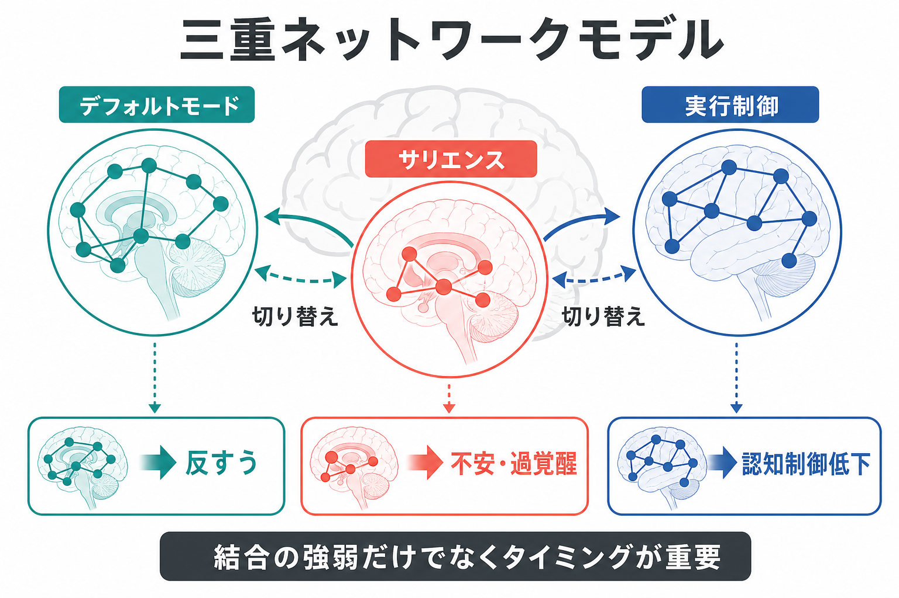
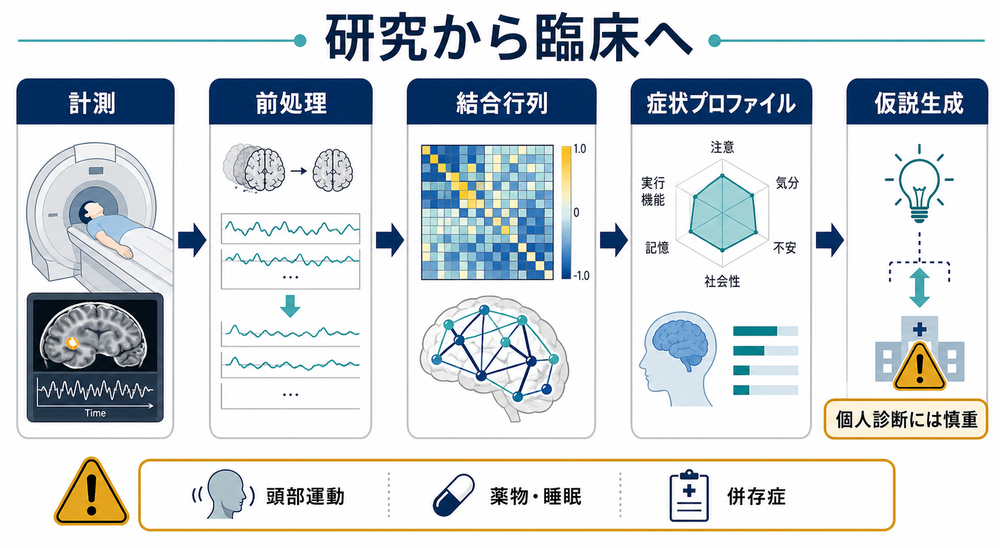

# 精神疾患における機能的結合異常とは何か

## 要点

- 機能的結合とは、離れた脳領域の活動ゆらぎがどれくらい同期しているかを表す指標である。
- 安静時fMRIでは、課題をしていないときの低周波BOLD信号から、[[脳内ネットワークとは何か|脳内ネットワーク]]のまとまりや領域間の結合を推定する。
- 精神疾患では、[[デフォルトモードネットワークとは何か|デフォルトモードネットワーク]]、[[サリエンスネットワークとは何か|サリエンスネットワーク]]、[[中央実行ネットワークとは何か|中央実行ネットワーク]]などの結合変化が、反すう、不安、認知制御低下、幻覚・妄想、感情調整困難と関連して研究されている。
- ただし、機能的結合異常は「この画像だけで診断できる所見」ではない。頭部運動、薬物、睡眠、併存症、解析手法の影響を受けるため、臨床では個人診断よりも仮説生成・層別化・治療反応予測の研究指標として読むのが慎重である。

## この記事で答える問い

1. 機能的結合異常とは、何が「異常」だと言っているのか。
2. 安静時fMRIの結合変化は、精神症状とどのように結びつけられるのか。
3. うつ病や統合失調症の研究では、どのようなネットワーク変化が報告されているのか。
4. 臨床応用を考えるとき、どこまで信じてよく、どこから慎重であるべきか。

## まず結論

精神疾患における機能的結合異常とは、単一の脳部位が壊れているというより、複数の脳領域が作るネットワークの協調パターンが、症状や認知・情動機能に関連して偏っている状態を指す。安静時fMRIでは、[[BOLD信号とは何か|BOLD信号]]の時間的な相関からこの偏りを推定する。たとえば、内的思考に関わるデフォルトモードネットワーク、重要な刺激を検出しネットワークを切り替えるサリエンスネットワーク、目標志向的な制御を支える中央実行・前頭頭頂ネットワークのバランスが、反すう、不安、注意制御、現実検討などに関係する可能性がある[1][2][3]。

しかし、機能的結合は原因そのものではなく、神経活動、血流反応、身体状態、計測ノイズ、解析選択が重なった観察量である。したがって、精神疾患の理解には有用だが、個人の診断や治療選択にそのまま置き換えるには、再現性、外部検証、臨床的追加価値の確認が必要である[6][7][8]。

## 背景

従来の精神医学的説明では、うつ病ならセロトニン、統合失調症ならドパミン、PTSDなら扁桃体というように、特定の神経伝達物質や脳部位が強調されやすかった。これらは重要な入口だが、症状は多くの場合、知覚、注意、記憶、情動、身体状態、社会的文脈が同時に変化する現象である。そのため、近年の神経科学では、個別部位だけでなく、領域間の情報の流れや同期を扱うネットワーク視点が重視される。

安静時fMRIは、この視点に合っている。被験者に明示的な課題をさせず、数分から十数分ほど脳全体のBOLD信号を測定し、各領域の時間波形の相関を調べる。自発的なBOLDゆらぎは単なるノイズではなく、機能的に関連する領域間で相関し、既知の脳システムと対応することが示されてきた[1]。この方法により、疾患群と対照群の平均差、症状重症度との相関、治療反応の予測、発症リスク群の特徴などが研究される。

## 基本概念

### 機能的結合

機能的結合は、2つ以上の脳領域の活動が時間的にどれくらい一緒に変動するかを表す。典型的には、領域Aと領域BのBOLD時系列の相関係数として計算される。相関が高いほど、両領域は同じネットワーク状態に関与している可能性がある。

ただし、機能的結合は「直接つながっている神経線維」を意味しない。白質線維の接続を扱う[[構造的結合と機能的結合は何が違うのか|構造的結合]]とは区別される。機能的結合は、共通入力、間接経路、脳状態、血流反応、前処理の選択にも影響される。

### ネットワーク内結合とネットワーク間結合

機能的結合異常は、大きく2種類に分けると理解しやすい。

| 観点 | 何を見るか | 精神疾患での読み方 |
|---|---|---|
| ネットワーク内結合 | 同じネットワーク内の領域がどれくらいまとまって動くか | 内的思考、注意、情動処理などのまとまりの強さ |
| ネットワーク間結合 | 異なるネットワーク同士がどれくらい協調・競合するか | 切り替え、制御、過剰な相互干渉 |
| 動的結合 | 時間とともに結合状態がどう変わるか | 固着、柔軟性低下、状態遷移の偏り |

このうち動的結合については、[[動的機能的結合とは何か]]と強く関係する。

## 仕組み

### 1. BOLD信号から結合行列を作る

安静時fMRIでは、脳を多数の領域に分け、それぞれのBOLD信号の時間波形を取り出す。次に、領域どうしの相関を計算し、全領域ペアの結合を行列として表す。この結合行列を使うと、ネットワークのまとまり、ハブ、効率、モジュール性などを評価できる。こうした解析は[[グラフ理論は脳ネットワーク解析にどう使われるのか|グラフ理論]]とも接続する[2]。

### 2. 三重ネットワークモデルで読む

精神疾患の機能的結合を説明する代表的な枠組みに、三重ネットワークモデルがある。これは、デフォルトモードネットワーク、サリエンスネットワーク、中央実行ネットワークの相互作用に注目するモデルである[3]。

- デフォルトモードネットワーク: 自己関連思考、内省、記憶、未来想像に関わる。
- サリエンスネットワーク: 身体内部や外界の重要な変化を検出し、他のネットワークの切り替えを促す。
- 中央実行ネットワーク: ワーキングメモリ、注意制御、目標志向的行動に関わる。

たとえば、サリエンスネットワークの切り替え機能が不安定になると、内的思考から外的課題への移行が滞り、反すうや注意制御困難として現れる可能性がある。中央実行ネットワークの制御が弱い場合、情動反応や侵入思考を調整しにくくなる。この説明は、[[前頭前野は情動制御にどう関わるのか]]や[[扁桃体過活動は不安症やPTSDにどう関わるのか]]ともつながる。

### 3. 「強すぎる」「弱すぎる」だけではない

機能的結合異常は、単純に結合が強いか弱いかだけでは理解できない。重要なのは、どのネットワークで、どの時間帯に、どの症状と、どの解析条件で観察された変化なのかである。たとえば、同じ「結合低下」でも、デフォルトモード内のまとまり低下、サリエンスと視床の連携低下、前頭頭頂ネットワークとの切り替え低下では意味が異なる。[[局所回路と長距離結合は何が違うのか|局所回路と長距離結合]]のどちらが問題になっているかも区別する必要がある。

## 図解

### 機能的結合異常の読み方

1. 安静時fMRIでBOLD信号のゆらぎを測る。
2. 脳領域どうしの同期を計算し、結合行列にする。
3. ネットワーク内結合とネットワーク間結合を見る。
4. 症状、認知機能、情動調整、行動指標と対応づける。
5. 頭部運動や薬物などの交絡を確認したうえで、研究上の仮説として解釈する。

### 代表的なネットワークと症状仮説

| ネットワーク | 主な機能 | 関連が研究される症状・機能 |
|---|---|---|
| デフォルトモードネットワーク | 自己関連思考、記憶、内省 | 反すう、自己関連的な否定的思考、現実検討の偏り |
| サリエンスネットワーク | 重要刺激の検出、ネットワーク切り替え | 不安、過覚醒、幻覚・妄想に関わる顕著性付与 |
| 中央実行・前頭頭頂ネットワーク | 認知制御、作業記憶、目標維持 | 注意制御低下、実行機能低下 |
| 情動・辺縁系ネットワーク | 情動評価、報酬、脅威処理 | 抑うつ、不安、快感消失、恐怖記憶 |
| 視床・感覚ネットワーク | 感覚入力のゲーティング | 知覚異常、幻覚、感覚過敏 |

## 臨床・研究との接続

### うつ病

うつ病では、安静時機能的結合のメタ解析により、デフォルトモードネットワーク、情動・辺縁系、前頭前野制御系などの広範なネットワーク変化が報告されている[4]。この知見は、反すう、否定的自己評価、報酬感受性低下、情動調整困難を、単一部位ではなくネットワークの偏りとして読む視点を支える。関連する背景として、[[報酬系の異常はうつ病をどう説明するのか]]、[[神経可塑性低下はうつ病をどう説明するのか]]、[[海馬萎縮はストレスやうつ病と関係するのか]]も参照できる。

一方で、うつ病の機能的結合所見は均質ではない。大規模多施設データを用いて、うつ病を異なる結合パターンのサブタイプに分けようとする研究もある[6]。こうした研究は、将来的な層別化や治療反応予測につながる可能性があるが、外部データでの再現性と実臨床での追加価値が重要な課題である。

### 統合失調症・精神病リスク

統合失調症では、古くから「結合不全」や「情報統合の障害」として説明されてきた。安静時fMRIのメタ解析では、デフォルトモード、サリエンス、視床、前頭頭頂、感覚ネットワークなどにまたがる低結合や不均衡が報告されている[5]。特にサリエンスネットワークは、内的体験と外界刺激の重要性づけを調整するため、幻覚・妄想や自己感の変化を考えるうえで注目される。

この視点は、[[ドパミン仮説は統合失調症をどこまで説明できるのか]]や[[グルタミン酸仮説は統合失調症をどう説明するのか]]と対立するものではない。むしろ、神経伝達物質の変化が、局所回路、視床皮質ループ、長距離ネットワークの協調にどう影響するかをつなぐ中間レベルの説明として位置づけられる。

### 臨床応用の距離感

機能的結合は、個人診断よりも、研究上の層別化、治療反応予測、症状次元の理解に向いている。たとえば、TMSやDBSの標的選択、薬物療法や心理療法の反応予測、疾患横断的な症状クラスターの理解に応用する研究が進んでいる。ただし、日常診療で「あなたの安静時fMRIからこの精神疾患です」と判断する段階にはない。

## よくある誤解

### 誤解1: 機能的結合異常は原因そのものを示す

機能的結合は、原因というより観察された協調パターンである。結合変化が症状を生む場合もありうるが、症状、薬物、睡眠、ストレス、身体状態が結合を変える場合もある。横断研究では、とくに因果方向を断定できない。

### 誤解2: 結合が高いほどよい

結合が高いことは、必ずしも健康的とは限らない。必要なときに協調し、不要なときには分離できる柔軟性が重要である。過剰な結合は、反すう、過覚醒、過剰な顕著性付与、ネットワーク間干渉と関係する可能性がある。

### 誤解3: 安静時fMRIは簡単に個人診断へ使える

頭部運動は、機能的結合に系統的な偽相関を生むことが知られている[7]。さらに、交絡除去の方法によって結果は変わり、最適な前処理は研究目的によって異なる[8]。したがって、個人診断に使うには、標準化された計測、前処理、外部検証、臨床的有用性の評価が必要である。これは[[頭動補正はfMRIでなぜ重要なのか]]と直接関係する。

## 関連ノート

- [[安静時fMRIは何を測っているのか]]
- [[機能的結合解析とは何か]]
- [[BOLD信号とは何か]]
- [[脳ネットワークの破綻は精神疾患をどう説明するのか]]
- [[デフォルトモードネットワークとは何か]]
- [[サリエンスネットワークとは何か]]
- [[中央実行ネットワークとは何か]]
- [[精神疾患は脳の病気なのか]]
- [[神経科学は精神疾患をどのように説明できるのか]]

## 理解チェック

1. 機能的結合は、構造的結合と何が違うか。
2. 安静時fMRIで「ネットワーク内結合」と「ネットワーク間結合」を分けて考える理由は何か。
3. 三重ネットワークモデルでは、サリエンスネットワークにどのような役割が置かれているか。
4. なぜ機能的結合異常だけで個人診断をしてはいけないのか。
5. うつ病や統合失調症の結合所見を、単一部位説ではなくネットワーク説として読む利点は何か。

## 関連ノート候補

- MOC更新候補: `content/00_MOC/` 配下の脳・神経科学、精神医学、神経画像関連MOC
- 追加作成候補: 「三重ネットワークモデルとは何か」
- 追加作成候補: 「精神疾患のバイオタイプとは何か」
- 追加作成候補: 「安静時fMRIを個人診断に使う限界」

## 未解決問題

- 疾患診断名を超えた症状次元と機能的結合パターンを、どこまで再現よく対応づけられるか。
- 多施設・多機種・多解析パイプラインでも頑健な結合指標はどれか。
- 薬物、睡眠、発達段階、併存症、頭部運動の影響をどの程度分離できるか。
- 機能的結合に基づく層別化が、通常の臨床情報を超えて治療選択に役立つか。

## 参考文献

[1] Fox, M. D., & Raichle, M. E. (2007). Spontaneous fluctuations in brain activity observed with functional magnetic resonance imaging. *Nature Reviews Neuroscience*, 8, 700-711. https://doi.org/10.1038/nrn2201

[2] Uddin, L. Q., Yeo, B. T. T., & Spreng, R. N. (2019). Towards a universal taxonomy of macro-scale functional human brain networks. *Brain Topography*, 32, 926-942. https://doi.org/10.1007/s10548-019-00744-6

[3] Menon, V. (2011). Large-scale brain networks and psychopathology: A unifying triple network model. *Trends in Cognitive Sciences*, 15(10), 483-506. https://doi.org/10.1016/j.tics.2011.08.003

[4] Kaiser, R. H., Andrews-Hanna, J. R., Wager, T. D., & Pizzagalli, D. A. (2015). Large-scale network dysfunction in major depressive disorder: A meta-analysis of resting-state functional connectivity. *JAMA Psychiatry*, 72(6), 603-611. https://doi.org/10.1001/jamapsychiatry.2015.0071

[5] Dong, D., Wang, Y., Chang, X., Luo, C., & Yao, D. (2018). Dysfunction of large-scale brain networks in schizophrenia: A meta-analysis of resting-state functional connectivity. *Schizophrenia Bulletin*, 44(1), 168-181. https://doi.org/10.1093/schbul/sbx034

[6] Drysdale, A. T., Grosenick, L., Downar, J., et al. (2017). Resting-state connectivity biomarkers define neurophysiological subtypes of depression. *Nature Medicine*, 23, 28-38. https://doi.org/10.1038/nm.4246

[7] Power, J. D., Barnes, K. A., Snyder, A. Z., Schlaggar, B. L., & Petersen, S. E. (2012). Spurious but systematic correlations in functional connectivity MRI networks arise from subject motion. *NeuroImage*, 59(3), 2142-2154. https://doi.org/10.1016/j.neuroimage.2011.10.018

[8] Ciric, R., Wolf, D. H., Power, J. D., et al. (2017). Benchmarking of participant-level confound regression strategies for the control of motion artifact in studies of functional connectivity. *NeuroImage*, 154, 174-187. https://doi.org/10.1016/j.neuroimage.2017.03.020
