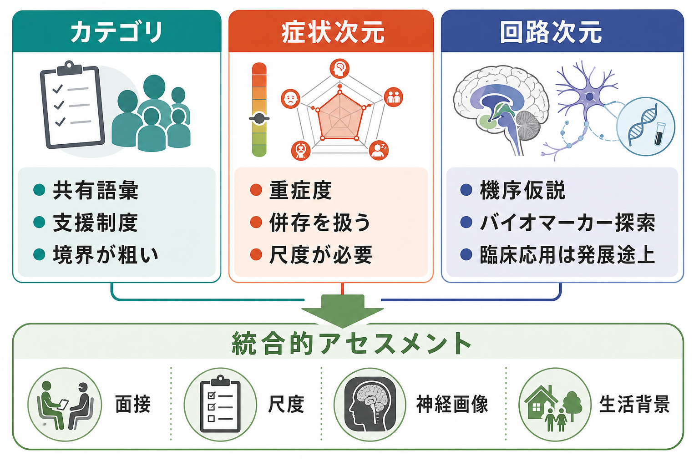
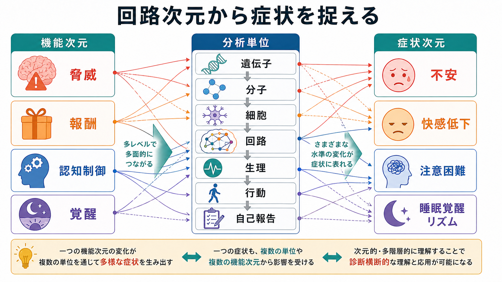

# 精神疾患の次元的理解とは何か

## 要点

- 精神疾患の次元的理解とは、「うつ病」「不安症」「統合失調症」のような診断カテゴリだけでなく、不安、抑うつ、衝動性、快感低下、認知制御困難などの連続的な症状次元で状態を捉える考え方である。
- さらに RDoC では、症状を脅威、報酬、認知制御、覚醒・睡眠、社会過程などの機能次元と、それを支える遺伝子、分子、細胞、回路、生理、行動、自己報告の分析単位に結びつけて研究する [1][2]。
- 次元的理解はカテゴリ診断を捨てる考え方ではない。カテゴリ診断は臨床コミュニケーション、制度、疫学、治療選択で有用であり、次元評価は重症度、併存、個人差、機序仮説を補う [3]。
- HiTOP や p factor 研究は、精神症状が内在化、外在化、思考障害、一般精神病理などの階層的・連続的構造を持つことを示し、診断横断的理解を支えている [4][5]。
- 臨床では、個別診断や治療指示として単純化せず、面接、尺度、生活背景、身体疾患・薬物要因、機能障害を統合して使う必要がある。

## この記事で答える問い

このノートでは、次の問いに答える。

1. 精神疾患を「カテゴリ」ではなく「次元」で捉えるとは、何を意味するのか。
2. 症状次元と神経回路次元は、どのように関係するのか。
3. RDoC や HiTOP は、DSM / ICD 型の診断分類と何が違うのか。
4. 研究や臨床で次元的理解を使うとき、何に注意すべきか。

## まず結論

精神疾患の次元的理解とは、診断名を最終的な実体として扱うのではなく、症状の強さ、持続、組み合わせ、発達経過、生活機能への影響、神経回路・認知機能・生理指標との関係を連続量として見る発想である。たとえば「うつ病か、うつ病でないか」だけでなく、抑うつ気分、快感低下、睡眠覚醒リズム、認知制御、報酬感受性、ストレス反応がどの程度変化しているかを評価する。

この発想は、[[神経科学は精神疾患をどのように説明できるのか]]という問いと強く関係する。ただし「脳画像や回路指標があれば診断カテゴリはいらない」という意味ではない。現時点では、多くの神経科学的指標は研究上の機序仮説や群レベルの傾向を支えるものであり、個人の診断や治療選択を単独で決めるほど十分ではない [3][6]。

## 背景

DSM や ICD のような診断分類は、臨床現場で状態を共有し、保険・福祉制度、疫学調査、治療研究を動かすために必要な共通語彙である。一方で、精神疾患にはいくつかの難しさがある。

第一に、症状は連続的である。不安、抑うつ、注意困難、幻覚様体験、衝動性、睡眠障害は、健常から重症まで連続的に分布しうる。第二に、併存が多い。不安症とうつ病、PTSD と解離、ADHD と物質使用、統合失調症と認知機能障害のように、診断カテゴリをまたいで症状が重なる。第三に、同じ診断名でも背景メカニズムが均質とは限らない。抑うつ症状ひとつを取っても、報酬系、睡眠覚醒、炎症、ストレス反応、対人環境などが異なる重みで関与することがある。

Clark らは、ICD、DSM、RDoC を比較し、精神疾患の分類には病因、多因子性、カテゴリと次元、閾値、併存という難題があると整理している [3]。これは[[精神疾患は脳の病気なのか]]という問いにも関わる。脳は重要な水準だが、神経回路だけを原因の最上位に置くのではなく、発達、環境、文化、身体状態、学習史と相互作用する水準として扱う必要がある。

## 基本概念

### カテゴリ診断

カテゴリ診断は、「ある基準を満たすなら疾患A、満たさないなら疾患Aではない」という境界を置く。これは臨床で有用である。診断名があることで、リスク評価、治療選択、支援制度、研究対象の定義が可能になる。

ただしカテゴリは、自然界に完全に切れ目のある「箱」とは限らない。境界は実用的な閾値であり、閾値の近くにはグレーゾーンがある。カテゴリ診断を使うときは、その背後にある重症度、持続、機能障害、併存、個人差を併せて見る必要がある。

### 症状次元

症状次元とは、症状を有無ではなく連続的な強さとして扱う見方である。例として、次のような次元がある。

| 症状次元 | 観察される内容 | 関連しやすい研究テーマ |
|---|---|---|
| 内在化 | 不安、抑うつ、恐怖、回避 | 脅威処理、ストレス、情動制御 |
| 外在化 | 衝動性、物質使用、規則違反 | 報酬学習、抑制制御、習慣形成 |
| 思考障害 | 幻覚、妄想、思考のまとまりにくさ | サリエンス、予測処理、現実検討 |
| 認知機能 | 注意、作業記憶、実行機能 | 前頭前野、前頭頭頂ネットワーク |
| 覚醒・睡眠 | 過覚醒、不眠、概日リズムの乱れ | 覚醒系、HPA軸、睡眠覚醒制御 |

HiTOP は、精神病理を症状・症候群・サブファクター・スペクトラム・一般因子へと階層的に整理する試みである [4]。また p factor 研究は、多様な診断に共通する一般精神病理因子が、併存、慢性化、機能障害、発達リスクと関係する可能性を示した [5]。

### 神経回路次元

神経回路次元とは、症状を脳の機能システムの変化として研究する見方である。たとえば、不安は扁桃体だけで説明されるのではなく、脅威検出、予測、内受容感覚、前頭前野による調整、身体覚醒、回避学習の組み合わせとして理解される。これは[[扁桃体過活動は不安症やPTSDにどう関わるのか]]や[[前頭前野は情動制御にどう関わるのか]]と接続する。

RDoC は、診断名ではなく機能ドメインと構成概念を研究単位に置く。現在の RDoC は、負の価システム、正の価システム、認知システム、社会過程システム、感覚運動システム、覚醒・調節システムなどを含み、それぞれを遺伝子、分子、細胞、回路、生理、行動、自己報告、課題パラダイムで測る [2][6]。

## 仕組み

次元的理解の中心にあるのは、「一つの診断名に一つの原因がある」と考えないことである。むしろ、複数の次元が重なって、ある時点の症状像を作る。

たとえば、同じ「うつ状態」でも、ある人では報酬系の感受性低下が中心で、快感低下や意欲低下が目立つかもしれない。この場合は[[報酬系の異常はうつ病をどう説明するのか]]が関係する。別の人では、慢性ストレスと睡眠覚醒リズムの乱れが強く、[[HPA軸は精神疾患にどう関わるのか]]や[[概日リズムの乱れは精神疾患にどう関わるのか]]が重要になるかもしれない。さらに別の人では、認知制御や実行機能の弱さが、反すう、問題解決困難、対人ストレスの維持に関与する。

このように、次元的理解では次の三つを分けて考える。

| 水準 | 問い | 例 |
|---|---|---|
| 症状次元 | 何が、どの程度、どのくらい続いているか | 不安、快感低下、過覚醒、注意困難 |
| 機能次元 | どの心理・行動システムが変化しているか | 脅威、報酬、認知制御、社会認知 |
| 分析単位 | どの測定水準で確認するか | 自己報告、行動課題、生理、脳画像、分子指標 |

重要なのは、これらが一対一対応しないことである。一つの症状は複数の回路・生理・生活背景から生じうるし、一つの回路次元の変化は複数の症状に波及しうる。この多対多の関係が、精神疾患の診断横断性を生む。

## 図解

図1は、カテゴリ診断、症状次元、回路次元の役割を比較している。カテゴリ診断は共有語彙と制度上の支援に強い。症状次元は重症度や併存を扱いやすい。回路次元は機序仮説やバイオマーカー探索に向いているが、臨床応用は発展途上である。

図2は、RDoC 的な発想を簡略化したものである。脅威、報酬、認知制御、覚醒のような機能次元は、遺伝子から自己報告まで複数の分析単位で測られ、最終的には不安、快感低下、注意困難、睡眠覚醒リズムの乱れとして観察される。ここでは「症状が脳に還元される」のではなく、「症状を多層的に測り、仮説を更新する」と考える。

## 臨床・研究との接続

研究では、次元的理解はサンプルの異質性を扱うために役立つ。診断名だけで群を分けると、同じ群の中に異なる病態が混ざり、脳画像や遺伝子研究の効果が薄まることがある。RDoC は、診断横断的な機能次元を用いて、行動科学と神経科学を統合する研究枠組みとして設計された [1][2]。

臨床では、次元的理解はケースフォーミュレーションを豊かにする。診断名に加えて、どの症状次元が生活機能を損なっているのか、どの次元が再発リスクや安全性に関係するのか、どの保護因子が働いているのかを整理できる。たとえば、同じ PTSD でも、恐怖記憶、過覚醒、解離、睡眠、対人安全感のどれが中心かで支援計画は変わる。これは[[PTSDでは恐怖記憶ネットワークに何が起きているのか]]や[[解離症状は脳ネットワークでどう説明できるのか]]と接続する。

一方で、臨床での使用には注意が必要である。次元評価は診断面接の代替ではない。身体疾患、薬剤、物質使用、発達特性、トラウマ、社会的困難を評価せずに、尺度得点や脳画像だけで判断するのは危険である。また、RDoC は研究枠組みであり、DSM / ICD の臨床診断をそのまま置き換えるものではない [3][6]。

## よくある誤解

### 誤解1: 次元的理解は診断名を否定する

否定しない。診断名は、臨床・制度・研究で必要な共通語彙である。次元的理解は、診断名の内側にある重症度、併存、機序、個人差を補う。

### 誤解2: 神経回路次元を見れば原因が一つに決まる

決まらない。精神疾患は多因子性であり、遺伝、発達、環境、身体状態、学習、文化が時間を通じて相互作用する [3]。[[脳ネットワークの破綻は精神疾患をどう説明するのか]]で扱うように、ネットワーク異常も単一原因ではなく、複数の経路の結果として現れる。

### 誤解3: 次元評価は主観的な尺度だけでよい

不十分である。自己報告は重要だが、行動課題、生理指標、生活機能、周囲からの情報、神経画像、発達歴と組み合わせることで意味が増す。RDoC が複数の分析単位を置くのは、このためである [2]。

### 誤解4: バイオマーカーが見つかれば診断カテゴリは不要になる

現時点ではそう言えない。精神疾患の神経画像・生物学的指標は、群レベルの差や機序仮説を示すことはあっても、個人の診断を単独で確定するには限界がある。バイオマーカー探索は重要だが、面接、機能評価、生活背景と統合して解釈する必要がある。

## 関連ノート

- [[神経科学は精神疾患をどのように説明できるのか]]
- [[精神疾患は脳の病気なのか]]
- [[脳ネットワークの破綻は精神疾患をどう説明するのか]]
- [[神経発達の異常は精神疾患にどう関わるのか]]
- [[HPA軸は精神疾患にどう関わるのか]]
- [[報酬系の異常はうつ病をどう説明するのか]]
- [[E_Iバランス異常は精神疾患をどう説明するのか]]
- [[身体症状症は脳の予測処理で説明できるのか]]

## MOC更新候補

- `content/00_MOC/` 配下の神経科学・精神医学系 MOC がある場合、本記事を「神経科学と精神疾患」「診断横断的理解」「RDoC / HiTOP」付近に追加する。
- 並列ジョブとの競合を避けるため、このタスクでは MOC 本体は更新しない。

## 理解チェック

1. カテゴリ診断と症状次元は、それぞれ何に強く、何に弱いか。
2. RDoC が「診断名」ではなく「機能次元」と「分析単位」を重視する理由は何か。
3. 一つの症状が複数の神経回路・生活背景から生じうるとは、どのような意味か。
4. 次元的理解を臨床で使うとき、尺度や脳画像だけに頼ってはいけない理由は何か。

## 参考文献

[1] Insel, T., Cuthbert, B., Garvey, M., Heinssen, R., Pine, D. S., Quinn, K., Sanislow, C., & Wang, P. (2010). Research Domain Criteria (RDoC): Toward a new classification framework for research on mental disorders. *American Journal of Psychiatry, 167*(7), 748-751. https://doi.org/10.1176/appi.ajp.2010.09091379

[2] National Institute of Mental Health. RDoC Matrix. https://www.nimh.nih.gov/research/research-funded-by-nimh/rdoc/constructs/rdoc-matrix

[3] Clark, L. A., Cuthbert, B., Lewis-Fernandez, R., Narrow, W. E., & Reed, G. M. (2017). Three approaches to understanding and classifying mental disorder: ICD-11, DSM-5, and the National Institute of Mental Health's Research Domain Criteria (RDoC). *Psychological Science in the Public Interest, 18*(2), 72-145. https://doi.org/10.1177/1529100617727266

[4] Kotov, R., Krueger, R. F., & Watson, D. (2018). A paradigm shift in psychiatric classification: The Hierarchical Taxonomy of Psychopathology (HiTOP). *World Psychiatry, 17*(1), 24-25. https://doi.org/10.1002/wps.20478

[5] Caspi, A., Houts, R. M., Belsky, D. W., Goldman-Mellor, S. J., Harrington, H., Israel, S., Meier, M. H., Ramrakha, S., Shalev, I., Poulton, R., & Moffitt, T. E. (2014). The p factor: One general psychopathology factor in the structure of psychiatric disorders? *Clinical Psychological Science, 2*(2), 119-137. https://doi.org/10.1177/2167702613497473

[6] National Institute of Mental Health. Definitions of the RDoC Domains and Constructs. https://www.nimh.nih.gov/research/research-funded-by-nimh/rdoc/definitions-of-the-rdoc-domains-and-constructs

## 未解決問題

- 症状次元、神経回路次元、生活環境のどの組み合わせが、個人レベルの予後や治療反応をどこまで予測できるのか。
- RDoC や HiTOP の研究知見を、通常診療の短い面接時間や制度上の診断分類とどう接続するのか。
- 精神疾患の次元評価を進めるとき、スティグマや過剰な生物学的還元をどう避けるのか。
