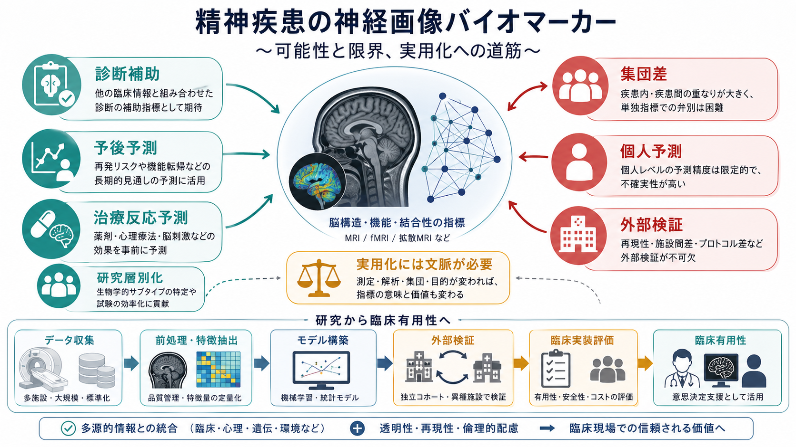
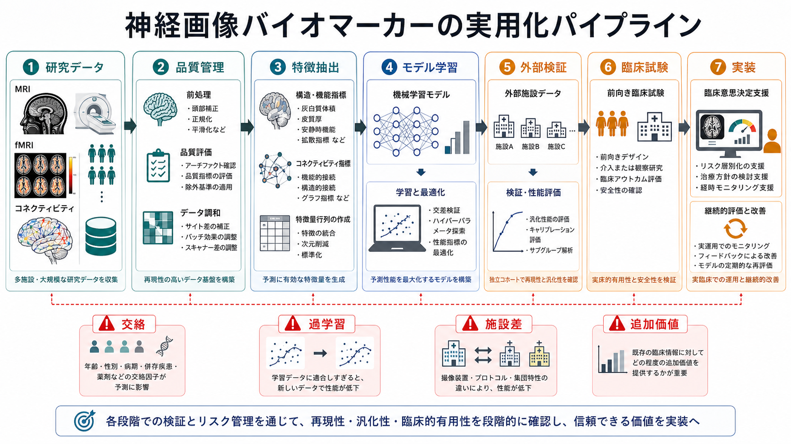
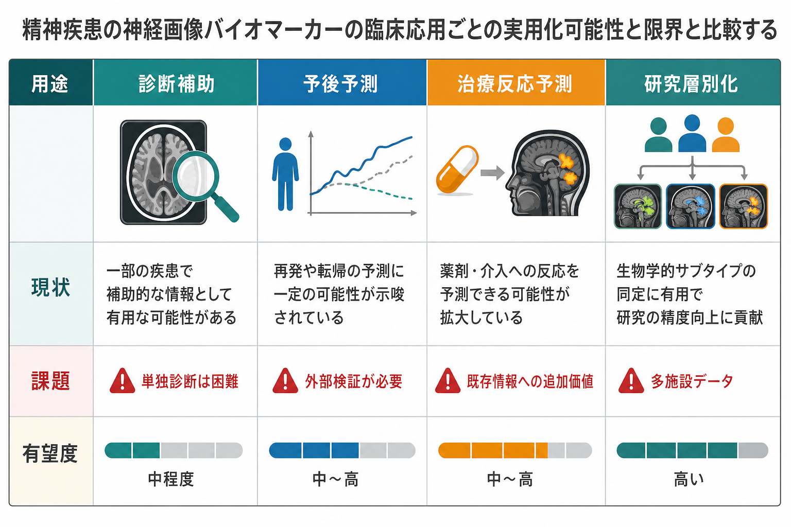

# 精神疾患の神経画像バイオマーカーは実用化できるのか

## 要点

- 神経画像バイオマーカーは、精神疾患を「脳のどこが悪いか」だけで分類する道具ではなく、臨床症状・心理尺度・経過・遺伝・環境情報と組み合わせて、診断補助、予後予測、治療反応予測、研究層別化に使う候補である。
- 現時点で最も実用化に近いのは、単独診断ではなく、既存の臨床判断に追加価値を与える意思決定支援である。たとえば再発リスク、機能予後、治療反応の確率を少し改善する用途が考えやすい。
- 集団平均の差は多く示されているが、それだけでは個人診療に使えるとは限らない。実用化には、外部検証、施設差への頑健性、前向き臨床試験、費用対効果、説明可能性、倫理的運用が必要である[1][2]。
- 精神疾患では疾患内の異質性と疾患間の重なりが大きいため、「一つの画像指標で一つの診断を決める」発想は脆い。むしろ多次元のリスク・状態・治療標的を扱う方向が現実的である[3][4]。

## この記事で答える問い

この記事では、[[構造MRIは脳の何を測っているのか]]、[[fMRIは神経活動を直接測っているのか]]、[[安静時fMRIは何を測っているのか]]、[[PETは脳の何を測るのか]]などで得られる脳画像指標が、精神疾患の臨床でどこまで使えるのかを考える。

中心の問いは次の三つである。

1. 脳画像は精神疾患の診断を直接置き換えられるのか。
2. 予後や治療反応の予測にはどの程度使えそうか。
3. 実用化に必要な条件は何か。

## まず結論

精神疾患の神経画像バイオマーカーは、研究としては有望だが、通常診療で単独診断に使える段階にはまだない。理由は単純で、精神疾患の診断単位が生物学的に均一ではなく、脳画像の差も小さく、個人レベルの予測誤差が大きいからである。

ただし、「実用化できない」という意味ではない。画像が役立つ可能性は、単独診断よりも、次のような限定された用途にある。

- 初発精神病、うつ病、双極性障害などで、経過や機能予後のリスク推定を補助する。
- 薬物療法、心理療法、脳刺激療法などへの反応可能性を、臨床情報に上乗せして推定する。
- 研究や臨床試験で、生物学的に近いサブグループを層別化する。
- [[脳内ネットワークとは何か]]、[[コネクトームとは何か]]、[[サリエンスネットワークとは何か]]などの回路指標を用いて、症状の背景仮説を精緻化する。

つまり、神経画像バイオマーカーの本命は「診断名を当てる機械」ではなく、「臨床判断の不確実性を少し減らす道具」である。

## 背景

精神医学の診断は、現在も主に症状、経過、機能障害、除外診断、生活史に基づいている。これは臨床的には有用だが、同じ診断名の中に多様な病態が含まれ、異なる診断名の間にも症状や神経機構の重なりがある。たとえば抑うつ、不安、睡眠障害、認知機能低下、報酬感受性の低下は、うつ病、[[双極性障害は情動ネットワークの異常として説明できるのか]]、統合失調症関連の病態で横断的に現れる。

この問題に対して、脳画像研究は、診断名の背後にある脳構造、機能結合、課題反応、神経伝達、代謝、白質結合の違いを測ろうとしてきた。大規模コンソーシアム研究では、統合失調症、双極性障害、うつ病、ADHD、自閉スペクトラム症などで、皮質厚、皮質表面積、海馬体積、白質指標などの集団差が再現されている[3]。

しかし、集団差はそのまま個人診断にはならない。平均値がずれていても分布が大きく重なれば、一人の患者がどちらの集団に属するかを高精度に判定することは難しい。さらに、頭動、薬物、罹病期間、併存症、年齢、性別、スキャナ差、解析パイプライン差が結果に影響する。[[頭動補正はfMRIでなぜ重要なのか]]、[[アーチファクトとは何か]]が重要になるのはこのためである。

## 基本概念

### バイオマーカーとは何か

バイオマーカーとは、正常な生物過程、病的過程、または介入への反応を示す測定可能な指標である。BEST resource では、診断、モニタリング、薬力学・反応、予後、予測、安全性など、複数の役割が区別されている[1]。

精神疾患の神経画像で問題になるのは、とくに次の四種類である。

| 種類 | 何をしたいか | 例 | 実用化の難しさ |
|---|---|---|---|
| 診断バイオマーカー | 疾患の有無や分類を補助する | 構造MRI、安静時fMRI、PET | 疾患間の重なりが大きい |
| 予後バイオマーカー | 将来の経過を予測する | 再発、慢性化、機能転帰 | 長期追跡と外部検証が必要 |
| 予測バイオマーカー | 治療反応を予測する | 抗うつ薬、CBT、rTMS、DBSへの反応 | 既存情報への追加価値が必要 |
| 層別化バイオマーカー | サブタイプや治療標的を分ける | ネットワーク型、炎症型、報酬系型など | 臨床的意味づけが難しい |

### 「集団差」と「個人予測」は別物

神経画像研究でよく示されるのは、「患者群と対照群の平均差」である。しかし臨床で必要なのは、「この一人にどう使えるか」である。両者の間には大きな距離がある。

大規模な脳ワイド関連研究では、脳画像と行動・症状の関連は小さいことが多く、再現可能な推定には数千例規模のサンプルが必要になりうることが示された[5]。これは、精神疾患の画像バイオマーカー開発にも直結する。小規模データで高精度に見えるモデルは、過学習や施設固有の特徴を拾っている可能性がある。

## 仕組み

神経画像バイオマーカー開発は、単に「MRIを撮ってAIに入れる」作業ではない。実際には、測定、前処理、特徴抽出、モデル化、検証、臨床評価という段階が必要である。

### 1. 測定

構造MRIでは皮質厚、灰白質体積、海馬体積などを測る。拡散MRIでは白質路の指標を扱い、[[FA値とは何か]]が代表的である。fMRIでは、[[BOLD信号とは何か]]に基づいて課題反応や安静時の機能結合を推定する。PETでは代謝、血流、受容体結合などを測定できる。

それぞれの測定は「脳そのもの」を直接読むわけではない。BOLD信号は神経活動に伴う血行動態変化であり、拡散MRIは水分子拡散から白質微細構造を推定する。したがって、画像指標は常に測定モデルと解析仮定を含む。

### 2. 特徴抽出

画像から臨床予測に使う特徴を作る方法には、ROI解析、全脳ボクセル解析、機能結合、グラフ理論、深層学習などがある。[[ROI解析と全脳解析は何が違うのか]]、[[グラフ理論は脳ネットワーク解析にどう使われるのか]]は、この段階を理解する基礎になる。

精神疾患では、単一領域よりもネットワーク指標が注目されやすい。たとえばデフォルトモードネットワーク、サリエンスネットワーク、中央実行ネットワークの相互作用は、情動制御、注意、自己関連処理、認知制御と結びつけて解釈される。ただし、ネットワーク名がついたからといって、それが即座に臨床的な原因を意味するわけではない。

### 3. モデル化

機械学習モデルは、画像特徴から診断、症状重症度、将来経過、治療反応を予測する。ここで重要なのは、モデルの目的を明確にすることである。

- 診断名を分類したいのか。
- 症状の連続量を予測したいのか。
- 再発や入院などの将来イベントを予測したいのか。
- 特定治療に反応する群を見つけたいのか。

目的が違えば、必要なデータ、評価指標、許容される誤差、臨床での使い方も変わる。たとえば診断補助なら感度・特異度・陽性的中率が問題になるが、治療選択なら「標準治療と比べて転帰が改善するか」が問題になる。

### 4. 外部検証

神経画像バイオマーカーの最大の関門は外部検証である。開発した施設のデータで高精度でも、別の病院、別のスキャナ、別の撮像条件、別の対象集団で同じ性能が出なければ臨床には使いにくい。

臨床予測モデルの報告では、TRIPOD+AI のようなガイドラインが、データ源、対象者、アウトカム定義、欠測処理、過学習対策、外部検証、モデル更新、使用場面の明示を求めている[6]。神経画像AIも例外ではない。

## 図解

神経画像バイオマーカーの実用化可能性は、用途ごとにかなり違う。

### 診断補助

診断補助は最も期待されやすいが、実は最も難しい用途の一つである。精神疾患の診断名は、症状・経過・機能障害に基づく臨床カテゴリーであり、単一の脳画像パターンと一対一対応しない。画像は、器質疾患の除外、神経変性疾患やてんかんなどの鑑別、特定症状の背景理解には役立つが、通常の精神疾患診断を単独で置き換えるわけではない。

### 予後予測

予後予測では、診断名そのものよりも「将来どうなりやすいか」を扱う。たとえば、初発精神病後の機能転帰、うつ病の再発リスク、認知機能低下の進行、治療抵抗性の可能性などである。

この用途では、画像単独よりも、症状、認知機能、生活史、併存症、薬物、心理社会的要因と組み合わせる多変量モデルが現実的である。神経画像は、既存の臨床情報に上乗せして、予測性能や意思決定を改善できるかが問われる。

### 治療反応予測

治療反応予測は、実用化の期待が比較的大きい領域である。うつ病では、前頭前野、帯状皮質、扁桃体、報酬系、安静時機能結合などが、抗うつ薬、心理療法、脳刺激療法への反応と関連する候補として研究されてきた[2][7]。[[前頭前野は情動制御にどう関わるのか]]、[[報酬系の異常はうつ病をどう説明するのか]]、[[扁桃体過活動は不安症やPTSDにどう関わるのか]]は、この読み方の背景になる。

ただし、候補指標があることと、臨床で治療選択を変える根拠になることは別である。必要なのは、「この画像指標を使った場合に、使わない場合よりも患者アウトカムが改善するか」を示す前向き研究である。

### 研究層別化

現時点で最も堅実なのは、研究層別化である。画像指標を使って、症状や診断名だけでは見えにくいサブグループを見つけ、臨床試験の対象選択や機序研究に活かす。これは、個人診療で即時に診断を下す用途よりも、必要な精度と責任範囲が限定される。

## 臨床・研究との接続

### 臨床で使うなら「追加価値」が必要

神経画像は高価で、撮像・前処理・解析に手間がかかる。したがって、実用化には、既存の問診、診察、心理検査、血液検査、生活情報だけでは得られない追加価値が必要である。

追加価値には三つの形がある。

1. 予測精度が改善する。
2. 治療選択が変わる。
3. 患者にとって意味のある転帰が改善する。

単に論文上のAUCが高いだけでは足りない。臨床で使うには、誤分類したときの害、説明可能性、費用、アクセス、患者の理解、データ保護まで含めて評価する必要がある。

### 規範モデルという発想

最近の方向性として、診断群を二分する分類モデルではなく、個人が年齢・性別などを考慮した典型的な脳発達・脳機能からどれくらい外れているかを見る規範モデルがある[4]。これは、精神疾患を単一のカテゴリーではなく、多次元の偏位として捉える考え方と相性がよい。

たとえば、同じ「うつ病」でも、報酬系の偏位が目立つ人、情動制御ネットワークの偏位が目立つ人、認知制御ネットワークの偏位が目立つ人がいるかもしれない。この読み方は、[[脳ネットワークの破綻は精神疾患をどう説明するのか]]や[[精神疾患は脳の病気なのか]]と接続する。

### 大規模・多施設・オープンサイエンス

神経画像バイオマーカーの信頼性を高めるには、大規模データと標準化が不可欠である。ENIGMA のような国際コンソーシアムは、解析パイプラインを調和させ、多施設データから精神疾患に関連する脳構造差を検証してきた[3]。一方で、大規模化しても、交絡、選択バイアス、文化差、医療制度差、薬物治療歴の違いは残る。

そのため、将来の実用化は、単一の万能モデルではなく、地域・施設・対象集団に応じて性能を監視し、更新し続ける「学習する臨床システム」に近くなる可能性がある。

## よくある誤解

### 誤解1: 脳画像があれば精神疾患は客観的に診断できる

精神疾患に脳の関与があることと、脳画像だけで診断できることは同じではない。現在の画像指標は、群間差やリスク情報を与えることはあっても、通常診療で診断面接を置き換えるものではない。

### 誤解2: AIを使えば小規模データでも高精度になる

AIはデータの限界を消すわけではない。小規模データでは、過学習、リーク、施設差、撮像条件差、前処理差を拾いやすい。とくに神経画像は次元が高く、症例数が少ないと見かけの精度が過大評価されやすい[5][6]。

### 誤解3: バイオマーカーは一つ見つかればよい

精神疾患は多因子的であり、症状、認知、発達、ストレス、社会環境、薬物、身体疾患が絡む。画像指標も、一つの「決定的な印」ではなく、多層的な情報の一部として扱う必要がある。

### 誤解4: 画像バイオマーカーは患者の主観を不要にする

臨床で重要なのは、症状の主観的苦痛、生活機能、価値観、治療希望である。画像はこれらを置き換えない。むしろ、患者の語りと客観指標をどう統合するかが、実用化の倫理的課題になる。

## 関連ノート

- [[精神疾患は脳の病気なのか]]
- [[神経科学は精神疾患をどのように説明できるのか]]
- [[構造MRIは脳の何を測っているのか]]
- [[fMRIは神経活動を直接測っているのか]]
- [[安静時fMRIは何を測っているのか]]
- [[BOLD信号とは何か]]
- [[ROI解析と全脳解析は何が違うのか]]
- [[コネクトームとは何か]]
- [[グラフ理論は脳ネットワーク解析にどう使われるのか]]
- [[脳ネットワークの破綻は精神疾患をどう説明するのか]]
- [[前頭前野は情動制御にどう関わるのか]]
- [[報酬系の異常はうつ病をどう説明するのか]]
- [[双極性障害は情動ネットワークの異常として説明できるのか]]
- [[頭動補正はfMRIでなぜ重要なのか]]
- [[アーチファクトとは何か]]

## MOC更新候補

- `content/00_MOC/MOC脳・神経科学.md`
- `content/00_MOC/MOC精神医学.md`
- `content/00_MOC/MOC機械学習・AI.md`

並列実行時の競合を避けるため、本ジョブでは MOC 本体は更新していない。

## 理解チェック

1. 集団平均の脳画像差が、そのまま個人診断に使えない理由は何か。
2. 診断バイオマーカー、予後バイオマーカー、予測バイオマーカーの違いは何か。
3. 神経画像AIモデルで外部検証が重要になる理由は何か。
4. 治療反応予測で「既存の臨床情報への追加価値」が必要なのはなぜか。
5. 規範モデルは、従来の患者群対対照群比較と何が違うか。

## 参考文献

[1] FDA-NIH Biomarker Working Group. (2016). *BEST (Biomarkers, EndpointS, and other Tools) Resource*. National Center for Biotechnology Information. https://www.ncbi.nlm.nih.gov/books/NBK326791/

[2] Woo, C. W., Chang, L. J., Lindquist, M. A., & Wager, T. D. (2017). Building better biomarkers: brain models in translational neuroimaging. *Nature Neuroscience*, 20, 365-377. https://doi.org/10.1038/nn.4478

[3] Thompson, P. M., Jahanshad, N., Ching, C. R. K., et al. (2020). ENIGMA and global neuroscience: A decade of large-scale studies of the brain in health and disease across more than 40 countries. *Translational Psychiatry*, 10, 100. https://doi.org/10.1038/s41398-020-0705-1

[4] Wolfers, T., Doan, N. T., Kaufmann, T., et al. (2018). Mapping the heterogeneous phenotype of schizophrenia and bipolar disorder using normative models. *JAMA Psychiatry*, 75(11), 1146-1155. https://doi.org/10.1001/jamapsychiatry.2018.2467

[5] Marek, S., Tervo-Clemmens, B., Calabro, F. J., et al. (2022). Reproducible brain-wide association studies require thousands of individuals. *Nature*, 603, 654-660. https://doi.org/10.1038/s41586-022-04492-9

[6] Collins, G. S., Dhiman, P., Andaur Navarro, C. L., et al. (2024). TRIPOD+AI statement: updated guidance for reporting clinical prediction models that use regression or machine learning methods. *BMJ*, 385, e078378. https://doi.org/10.1136/bmj-2023-078378

[7] Fu, C. H. Y., & Costafreda, S. G. (2013). Neuroimaging-based biomarkers in psychiatry: clinical opportunities of a paradigm shift. *Canadian Journal of Psychiatry*, 58(9), 499-508. https://doi.org/10.1177/070674371305800902

[8] Kambeitz, J., Cabral, C., Sacchet, M. D., et al. (2017). Detecting neuroimaging biomarkers for depression: a meta-analysis of multivariate pattern recognition studies. *Biological Psychiatry*, 82(5), 330-338. https://doi.org/10.1016/j.biopsych.2016.10.028
