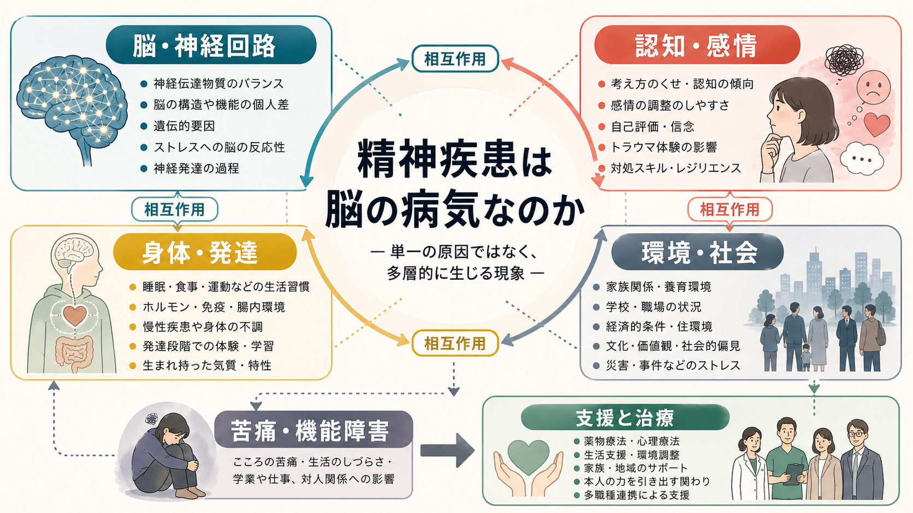
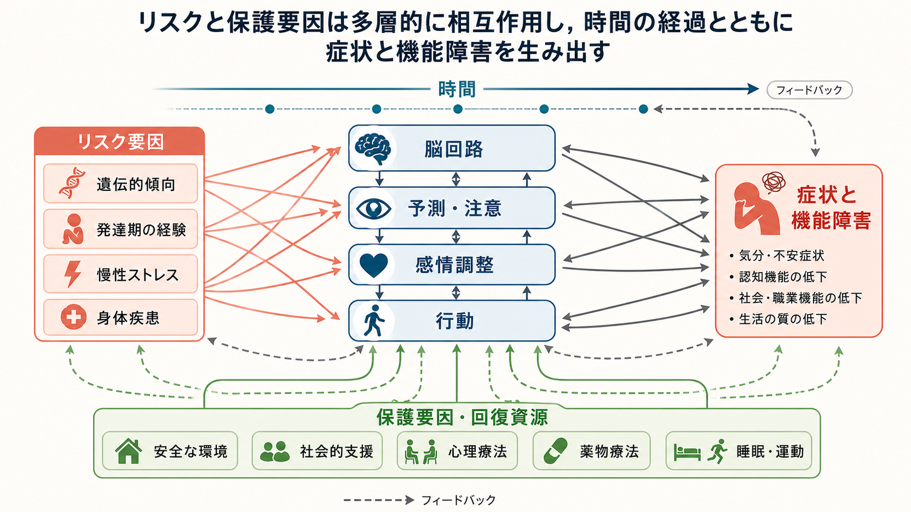
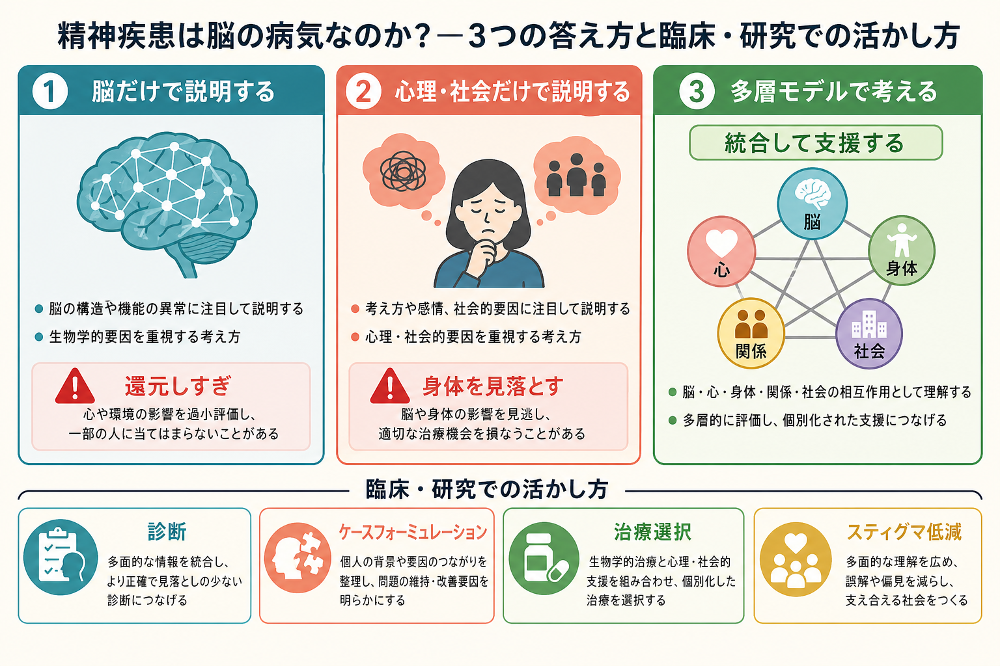

# 精神疾患は脳の病気なのか

## 要点

- 精神疾患は脳に関係する。しかし「脳だけの病気」と言い切ると、発達、身体、経験、対人関係、社会環境を見落とす。
- DSM は精神疾患を、認知・感情調整・行動における臨床的に重要な障害として定義し、その背景に心理的・生物学的・発達的過程の機能不全を想定する[1]。
- RDoC のような研究枠組みは、診断名だけでなく、脳回路、行動、認知、遺伝子、環境をまたいだ次元として精神症状を調べる方向を示した[2]。
- 生物心理社会モデルは、身体医学の還元主義を補うために提案され、精神医学では今も臨床推論の基本姿勢になる[3]。
- もっとも実用的な答えは、「精神疾患は脳を含む多層的な疾患・困難である」という表現である。

## この記事で答える問い

1. 精神疾患を「脳の病気」と呼ぶことには、どのような利点と限界があるのか。
2. 生物学的説明と心理社会的説明は、対立するのではなくどう接続できるのか。
3. 研究や臨床では、この多層性をどう使えばよいのか。

## まず結論

精神疾患は、脳と無関係ではない。うつ病、統合失調症、不安症、PTSD、発達症、依存症などでは、神経伝達、脳ネットワーク、ストレス応答、認知制御、報酬学習、情動調整などに変化が観察される。しかし、これらの変化は「原因が脳だけにある」ことを自動的には意味しない。脳は、遺伝、発達、身体状態、学習、対人関係、文化、貧困、差別、トラウマ、慢性ストレスを受け取りながら変化する器官だからである[4][5]。

したがって、「精神疾患は脳の病気か」という問いには、二つの答えが必要になる。研究上は「脳を含む神経生物学的現象として調べる必要がある」。臨床上は「脳だけでなく、その人の生活史・身体・関係・環境まで含めて理解する必要がある」。この二つを分けて考えると、脳科学と心理社会的支援は競合せず、同じケース理解の別の層になる。

## 背景

精神疾患を「脳の病気」と呼ぶ語り方には、歴史的な意味がある。第一に、本人の弱さ、性格、道徳、努力不足として説明されてきた苦痛を、医学的・生物学的に理解し直す効果がある。第二に、薬物療法、脳刺激、神経画像、遺伝学、計算論的精神医学などの研究を進める方向づけになる。第三に、精神症状が身体や神経系から切り離された「気のせい」ではないことを示す。

一方で、この表現には限界もある。精神疾患は、腫瘍や感染症のように単一の病変で定義できることが少ない。DSM や ICD の診断は、多くの場合、原因ではなく症候群、経過、苦痛、機能障害、除外診断を組み合わせて成立する分類である[1][6]。同じ診断名でも経路は複数あり、異なる診断名に共通する認知・情動・行動の次元もある。このため、診断名をそのまま一つの脳病変に対応させる発想は単純化しすぎである。

## 基本概念

### 脳の病気という表現の利点

「脳の病気」という言い方は、精神症状を身体から切り離さないために有用である。幻覚、妄想、抑うつ、不安、強迫、衝動性、注意困難、依存行動は、意志だけで自由に変えられるものではなく、知覚、予測、注意、記憶、報酬、身体感覚、情動調整のシステムに関係する。たとえば [[ドパミンは報酬だけの物質なのか]]、[[セロトニンは気分だけに関わるのか]] のような神経生物学的知見は、症状を「本人のせい」にしない説明を支える。

### 脳だけの病気という表現の限界

しかし「脳だけの病気」と言うと、別の誤解が生じる。脳は環境から独立した閉じた装置ではない。発達期の養育、逆境、睡眠、運動、炎症、身体疾患、学校や職場の負荷、家族関係、社会的孤立、貧困、差別、災害は、ストレス応答、学習、認知スタイル、自己評価、身体感覚、脳ネットワークに影響しうる[5][7]。ここで重要なのは、「心理社会的要因だから生物学ではない」のではなく、心理社会的要因が身体と脳を通して経験されるという点である。

### 多層モデル

多層モデルでは、精神疾患を次のような階層の相互作用として考える。

| 層 | 例 | 臨床で見ること |
|---|---|---|
| 分子・細胞 | 神経伝達物質、受容体、炎症、ホルモン | 薬物療法、身体疾患、睡眠、物質使用 |
| 神経回路 | 報酬、恐怖、認知制御、サリエンス、デフォルトモード | 注意、感情調整、反すう、過覚醒 |
| 認知・感情 | 予測、解釈、信念、自己評価、記憶 | 心理療法、認知行動的介入、トラウマ理解 |
| 行動・身体 | 回避、活動低下、睡眠、食事、身体症状 | 行動活性化、生活支援、リハビリテーション |
| 関係・社会 | 家族、職場、学校、貧困、差別、支援制度 | ケースワーク、環境調整、社会資源 |

この見方は、ストレス脆弱性モデルやケースフォーミュレーションと相性がよい。診断名を出発点にしつつ、「なぜこの人に、いま、この形で困難が出ているのか」を層ごとに整理する。

## 仕組み

精神疾患の多層性は、原因が複数あるというだけではない。重要なのは、各層が時間を通して相互に変化させ合うことである。

たとえば慢性ストレスは、睡眠を乱し、身体の炎症や自律神経反応に影響し、注意を脅威へ向けやすくし、回避行動を増やす。回避が増えると成功体験や社会的接触が減り、抑うつや不安が強まり、さらに睡眠や活動が悪化する。この循環は、脳回路、認知、行動、環境のどれか一つだけでは説明しにくい。

逆に、治療や支援も多層的に働く。薬物療法は神経伝達や睡眠、情動反応を変えうる。心理療法は注意、解釈、記憶、行動選択を変えうる。環境調整や社会的支援は、脅威や孤立を減らし、回復資源を増やす。運動や睡眠改善は身体状態と脳機能の両方に関わる。どれか一つを「本当の治療」とみなすより、困難を維持しているループを見つけ、複数の入り口から変える方が実践的である。

## 図解

上の図は、リスク要因、脳回路、予測・注意、感情調整、行動、症状と機能障害が一方向ではなく相互作用することを示している。精神疾患は「遺伝か環境か」「脳か心か」という二択ではなく、時間の中で多層のフィードバックが強まった状態として理解できる。

もう一つのポイントは、保護要因である。安全な環境、社会的支援、心理療法、薬物療法、睡眠・運動は、単に症状を押さえるだけではなく、悪循環を弱める資源になる。これはレジリエンスやライフスパン精神医学と接続できる見方である。

## 臨床・研究との接続

研究では、診断名をそのまま脳の単位とみなすのではなく、症状次元や機能次元を調べる動きがある。RDoC は、負の感情価、正の感情価、認知システム、社会過程、覚醒・調節などのドメインを、遺伝子、分子、細胞、回路、行動、自己報告と接続して研究する枠組みである[2]。これは [[脳ネットワークの破綻は精神疾患をどう説明するのか]] に関係する。

臨床では、多層モデルは診断を否定するものではない。診断は、症状のまとまり、予後、治療選択、制度利用、研究知見へのアクセスを助ける。一方で、診断名だけでは、その人にとって何が発症・維持・悪化・回復に関わっているかは十分にわからない。そこで、診断に加えて、発症準備因子、誘発因子、維持因子、保護因子を整理する 5P モデルやケースフォーミュレーションが必要になる。

また、スティグマへの影響も単純ではない。生物学的説明は、本人責任を弱める可能性がある一方で、「脳が壊れている」「一生変わらない」という本質主義的な見方を強める危険もある[8]。そのため、教育的説明では「脳に関係するが、脳は経験と支援で変わりうる」「生物学的要因と心理社会的要因は同時に扱える」と伝えることが重要である。

## よくある誤解

### 誤解1: 脳の病気なら心理療法は効かない

脳に関係することと、心理療法が効かないことは別である。学習、注意、記憶、予測、対人関係の変化は、脳の可塑性を通して成立する。心理療法は「気休め」ではなく、経験を通じて認知・感情・行動のループを変える介入である。

### 誤解2: 心理社会的要因を重視すると、本人や家族の責任になる

心理社会的要因を扱うことは、責任追及ではない。むしろ、支援可能な要因を見つけるための作業である。家族、学校、職場、制度、経済状況、差別、孤立を含めて見ることで、本人だけに負担を集めない理解が可能になる。

### 誤解3: 脳画像で精神疾患はすべて診断できる

現時点では、多くの精神疾患について、個人の診断を単独で確定できる脳画像指標は一般臨床で確立していない。脳画像は研究や鑑別、身体疾患の除外に重要だが、精神医学的診断は面接、経過、機能、身体評価、生活背景を統合して行う。

### 誤解4: 生物学的説明と社会的説明は対立する

対立するのは説明の層を混同したときである。社会的孤立や慢性ストレスは、心理的経験であると同時に、睡眠、自律神経、内分泌、免疫、脳回路に影響する生物学的出来事でもある。多層モデルでは、どちらが「本物」かではなく、どの層を変えると回復に近づくかを考える。

## 関連ノート

- [[脳ネットワークの破綻は精神疾患をどう説明するのか]]
- [[脳画像研究の再現性問題とは何か]]

## 今後の作成候補

- RDoCは精神疾患研究をどう変えたのか
- ストレス脆弱性モデルとは何か
- 5Pモデルとは何か
- ケースフォーミュレーションとは何か
- HPA軸は精神疾患にどう関わるのか
- スティグマとは何か

## MOC更新候補

- `content/00_MOC/` 配下の脳・神経科学、精神医学、計算論的精神医学に関する MOC へ追加候補。
- 並列生成ジョブとの競合を避けるため、本記事作成時点では MOC 本体は更新しない。

## 理解チェック

1. 「精神疾患は脳の病気である」という表現が役に立つ場面と、誤解を生む場面をそれぞれ説明できるか。
2. 生物学的要因、心理的要因、社会的要因を、別々の原因ではなく相互作用する層として説明できるか。
3. ある症例について、発症準備因子、誘発因子、維持因子、保護因子を一つずつ挙げられるか。
4. 脳画像やバイオマーカーだけで精神疾患を単純に診断できない理由を説明できるか。

## 未解決問題

- 診断カテゴリと脳回路・症状次元をどのように対応させるべきか。
- 個人レベルの予測に使えるバイオマーカーを、どの程度まで臨床実装できるか。
- 生物学的説明がスティグマを減らす条件と、逆に固定観念を強める条件は何か。
- 多層モデルを、診療時間の限られた現場でどこまで実用的に使えるか。

## 参考文献

[1] American Psychiatric Association. (2022). *Diagnostic and Statistical Manual of Mental Disorders, Fifth Edition, Text Revision (DSM-5-TR)*. American Psychiatric Association Publishing. https://doi.org/10.1176/appi.books.9780890425787

[2] Cuthbert, B. N., & Insel, T. R. (2013). Toward the future of psychiatric diagnosis: The seven pillars of RDoC. *BMC Medicine, 11*, 126. https://doi.org/10.1186/1741-7015-11-126

[3] Engel, G. L. (1977). The need for a new medical model: A challenge for biomedicine. *Science, 196*(4286), 129-136. https://doi.org/10.1126/science.847460

[4] Kendler, K. S. (2005). Toward a philosophical structure for psychiatry. *American Journal of Psychiatry, 162*(3), 433-440. https://doi.org/10.1176/appi.ajp.162.3.433

[5] World Health Organization. (2022). *World mental health report: Transforming mental health for all*. https://www.who.int/publications/i/item/9789240049338

[6] World Health Organization. (2024). *ICD-11: Mental, behavioural or neurodevelopmental disorders*. https://icd.who.int/browse/2024-01/mms/en

[7] Caspi, A., & Moffitt, T. E. (2018). All for one and one for all: Mental disorders in one dimension. *American Journal of Psychiatry, 175*(9), 831-844. https://doi.org/10.1176/appi.ajp.2018.17121383

[8] Haslam, N., & Kvaale, E. P. (2015). Biogenetic explanations of mental disorder: The mixed-blessings model. *Current Directions in Psychological Science, 24*(5), 399-404. https://doi.org/10.1177/0963721415588082
