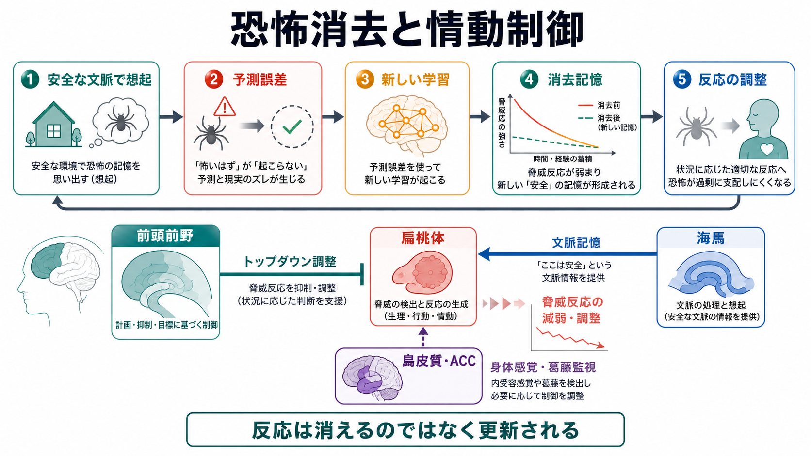
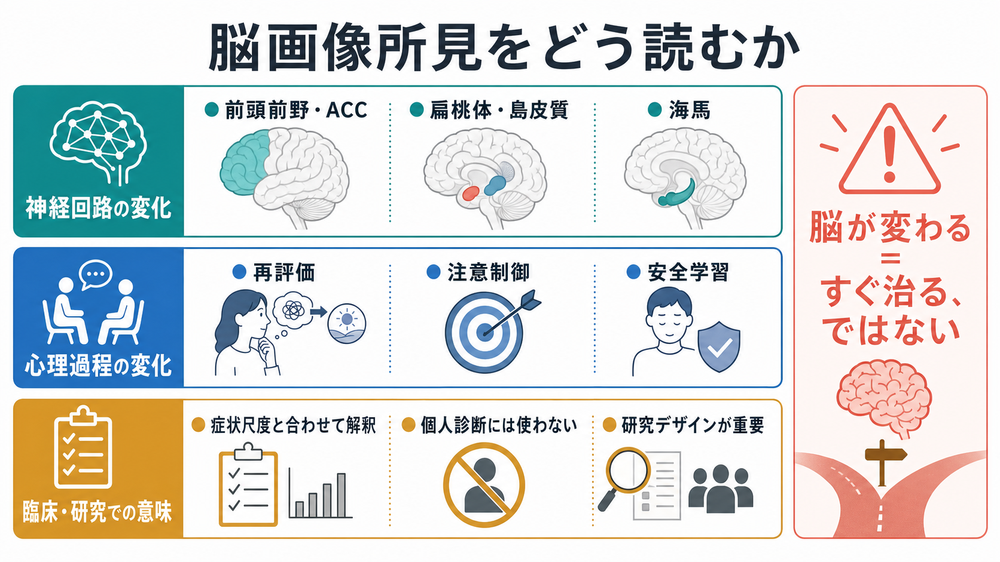

# 精神療法は脳を変えるのか

## 要点

- 精神療法は「言葉だけ」の介入ではなく、注意、記憶、予測、情動反応、行動選択を反復的に更新する学習環境として働く。
- 脳画像研究では、認知行動療法、曝露療法、対人関係療法などの前後で、前頭前野、前帯状皮質、扁桃体、島皮質、海馬、線条体を含むネットワーク活動や結合の変化が報告されている[1][2]。
- ただし「脳が変わる」は「すぐ治る」「全員に同じ変化が起きる」「画像で個人診断できる」という意味ではない。研究所見は平均的傾向であり、症状尺度、生活史、治療過程と合わせて読む必要がある[2][3]。
- 神経可塑性の観点では、精神療法は新しい経験を通じて、恐怖消去、再評価、注意制御、安全学習、自己理解を支える回路を再訓練する過程として理解できる[4][5]。
- この記事は教育・研究目的の整理であり、個別の診断や治療選択を指示するものではない。

## この記事で答える問い

この記事で扱う問いは、次の4つである。

1. 精神療法で「脳が変わる」とは、具体的に何が変わるという意味なのか。
2. その変化は、[[神経可塑性低下はうつ病をどう説明するのか|神経可塑性]]、情動制御、認知制御とどのように関係するのか。
3. 脳画像研究の結果を、どこまで臨床的に読めるのか。
4. 「脳が変わる」という説明には、どのような誤解があるのか。

## まず結論

精神療法は、脳を変える可能性がある。より正確には、精神療法は経験依存的な学習を通じて、脳内ネットワークの活動パターン、領域間結合、反応の文脈依存性を変えうる。たとえば、恐怖や脅威に過敏に反応する扁桃体、身体感覚や苦痛の顕著性を評価する島皮質、葛藤やエラーを監視する前帯状皮質、状況に応じた制御を担う前頭前野、文脈記憶に関わる海馬が、治療前後で異なる働き方を示すことがある[1][2][4]。

しかし、「精神療法が脳を変える」という表現は慎重に使う必要がある。第一に、変化は治療法、疾患、課題、測定方法、解析方法によって異なる。第二に、脳画像の変化が症状改善の原因なのか、結果なのか、並行して起きる指標なのかは、研究デザインによって解釈が変わる。第三に、現時点では、個人のfMRI画像だけから「この人にはこの心理療法が効く」と判断できる段階ではない[2][3]。

したがって、もっとも実用的な理解は次のようになる。精神療法は、脳の特定部位を機械的に修理する操作ではない。むしろ、対話、曝露、再評価、行動実験、関係性の経験を通じて、脳が予測と行動を更新するための条件を整える介入である。

## 背景

精神療法は長いあいだ、薬物療法に比べて「心理的」「主観的」「言語的」な介入として見られやすかった。しかし、記憶、注意、予測、情動、自己評価はすべて神経システムの活動として実現される。心理的経験が反復され、意味づけが変わり、行動の選択肢が広がるなら、それは何らかの神経過程の変化を伴うはずである。

この発想は、精神疾患を単純な「脳の故障」とみなすためではない。むしろ、[[精神疾患は脳の病気なのか]]で問題になるように、症状は脳、身体、環境、対人関係、社会的文脈の相互作用として生じる。精神療法の神経科学は、この相互作用のうち、経験が神経回路にどのように刻まれ、また更新されるのかを扱う。

神経可塑性とは、経験、学習、ストレス、発達、治療などに応じて、神経系の構造や機能が変化する性質である。細胞レベルではシナプス効率、受容体、樹状突起スパイン、遺伝子発現などが関わり、回路レベルでは機能的結合、課題中活動、安静時ネットワークの変化として観察される。精神療法で観察される変化は、主にこの回路レベル、ネットワークレベルの可塑性として理解される。

## 基本概念

### 精神療法

ここでいう精神療法は、認知行動療法、曝露療法、対人関係療法、精神力動的療法、マインドフルネス系介入などを広く含む。共通するのは、症状を単に抑えるだけでなく、ものの見方、注意の向け方、記憶の呼び出し方、行動パターン、対人関係の予測を変える点である。

### 情動制御

情動制御とは、感情を消す能力ではない。刺激をどう解釈するか、どこに注意を向けるか、身体反応をどう読み取るか、行動へどう移すかを調整する働きである。[[前頭前野は情動制御にどう関わるのか]]で扱うように、前頭前野と前帯状皮質は、扁桃体や島皮質の反応を状況に合わせて調整する。

### 認知制御

認知制御は、目標に沿って注意、記憶、反応を調整する働きである。抑うつでは反すうから離れにくい、不安では脅威関連情報へ注意が偏る、PTSDでは安全な文脈でも脅威記憶が再活性化しやすい、といった問題が生じる。精神療法は、これらの自動的パターンに気づき、別の反応を練習することで、認知制御の使い方を変える。

### 恐怖消去

恐怖消去は、恐怖記憶を削除することではない。「この文脈では危険ではない」という新しい安全学習を重ねる過程である。曝露療法では、回避せずに安全な条件で恐怖関連刺激に触れることで、扁桃体、腹内側前頭前野、海馬の相互作用が変わると考えられている[4][5]。これは[[PTSDでは恐怖記憶ネットワークに何が起きているのか]]や[[扁桃体過活動は不安症やPTSDにどう関わるのか]]と直接つながる。

## 仕組み

### 1. 注意と予測が変わる

不安や抑うつでは、脅威、失敗、拒絶、身体感覚などに注意が偏りやすい。精神療法では、どの情報を拾っているのか、どの予測を当然視しているのかを明示化する。これにより、刺激そのものではなく、刺激を読む枠組みが変わる。

脳レベルでは、この過程は前頭前野、前帯状皮質、頭頂葉ネットワーク、島皮質などの相互作用として研究される。情動刺激に対する扁桃体反応が変わるだけでなく、前頭前野による再評価、注意配分、反応選択が変わることが重要である[6][7]。

### 2. 回避が減り、安全学習が増える

多くの症状は、短期的には回避で軽くなる。たとえば、人前で話すことを避ければ不安は下がる。しかし、回避が続くと「避けたから安全だった」という学習が強まり、脳は危険予測を更新する機会を失う。

曝露療法や行動実験は、この循環を変える。安全な条件で恐怖や不安に近づき、予測した破局が起きないことを体験する。すると、扁桃体の脅威反応を消すというより、海馬が文脈情報を提供し、前頭前野が反応を調整し、「危険ではない」という新しい記憶が使われやすくなる[4][5]。

### 3. 再評価が情動反応を変える

認知再評価は、出来事の意味づけを変えることで情動反応を調整する方法である。たとえば、「相手が返事をしないのは自分が嫌われたからだ」という解釈を、「忙しい可能性もある」「まだ情報が足りない」と再構成する。これは単なるポジティブ思考ではなく、証拠、文脈、代替仮説を使って予測を更新する作業である。

再評価研究では、前頭前野と前帯状皮質が情動評価に関わる扁桃体などの領域を調整するモデルが提案されている[6]。精神療法で再評価を反復すると、情動反応そのものだけでなく、情動反応を観察し、言語化し、選択肢を検討する回路の使い方が変わる可能性がある。

### 4. 自己理解と対人予測が変わる

精神療法の変化は、恐怖消去や認知再評価だけでは説明できない。対人関係療法や精神力動的療法では、自己像、他者像、関係性の予測、感情の意味づけが扱われる。これらはデフォルトモードネットワーク、内側前頭前野、後部帯状皮質、側頭頭頂接合部などの自己・社会認知ネットワークと関係する可能性がある。

ただし、この領域は治療法ごとの差が大きく、神経画像研究もまだ発展途上である。したがって、特定の精神療法を「この脳部位を変える治療」と単純化するのは避けるべきである。

## 図解

1枚目の図は、恐怖消去と情動制御を中心に、精神療法がどのように新しい安全学習をつくるかを示している。重要なのは、恐怖反応が完全に消えるのではなく、文脈に応じて更新され、調整される点である。

2枚目の図は、脳画像所見を読むときの注意点をまとめている。精神療法研究で「前頭前野が変わった」「扁桃体反応が下がった」と報告されても、それだけで個人診断や治療選択ができるわけではない。症状尺度、治療内容、課題、対照群、フォローアップ期間と合わせて解釈する必要がある。

## 臨床・研究との接続

### うつ病

うつ病では、反すう、否定的自己評価、報酬感受性の低下、認知制御の困難が問題になる。心理療法後には、前頭前野、前帯状皮質、扁桃体、線条体などで活動変化が報告されている[1][2]。これは[[報酬系の異常はうつ病をどう説明するのか]]や[[神経可塑性低下はうつ病をどう説明するのか]]と接続できる。

ただし、うつ病の精神療法研究では、薬物療法との併用、症状の自然経過、治療者要因、課題差の影響が大きい。そのため、単一の「心理療法による脳変化パターン」を想定するより、個々の治療がどの心理過程を標的にしているかを明確にするほうが有益である。

### 不安症・PTSD

不安症やPTSDでは、脅威検出、身体感覚、回避、安全学習が中心的なテーマになる。曝露療法や認知処理療法では、恐怖記憶の文脈づけ、回避の減少、危険予測の更新が治療過程の核になる。神経回路としては、扁桃体、島皮質、dACC、vmPFC、海馬の相互作用が重要である[4][5][7]。

この見方は、[[PTSDでは恐怖記憶ネットワークに何が起きているのか]]、[[扁桃体過活動は不安症やPTSDにどう関わるのか]]、[[前頭前野は情動制御にどう関わるのか]]と重なる。精神療法は、脅威記憶を消すのではなく、現在の文脈で安全を学び直す機会をつくる。

### 研究での読み方

脳画像研究を読むときは、少なくとも次の点を確認する必要がある。

- 治療前後比較だけでなく、対照群があるか。
- 症状改善と脳変化が相関しているか。
- 課題中活動なのか、安静時結合なのか。
- 治療法の内容が十分に記述されているか。
- 結果が独立サンプルで再現されているか。
- 個人予測ではなく、群平均の説明にとどまっていないか。

メタ解析やレビューは、精神療法による脳変化が存在する可能性を支持する一方で、研究間の異質性、サンプルサイズ、出版バイアス、解析手法の違いを指摘している[1][2][3]。このため、現時点では「精神療法は脳を変えることがあるが、その変化は一枚岩ではない」と読むのが妥当である。

## よくある誤解

### 誤解1: 脳が変わるなら、精神療法は生物学的治療で薬と同じである

精神療法も薬物療法も脳に影響しうるが、介入の経路は異なる。薬物療法は主に受容体、神経伝達、細胞内シグナルを通じて可塑性の条件を変える。精神療法は、経験、対話、学習、行動変化を通じて、どの回路がどの文脈で使われるかを変える。両者は競合する説明ではなく、異なるレベルの介入である。

### 誤解2: 脳画像で治療効果を直接判定できる

脳画像は研究上有用だが、現時点で個人の治療効果を日常臨床で直接判定する標準ツールではない。BOLD信号は神経活動そのものではなく、血流変化を介した間接指標であり、解析条件にも依存する。臨床的には、症状、生活機能、本人の困りごと、治療関係、時間経過を統合して判断する必要がある[3]。

### 誤解3: 精神療法で脳が変わるなら、本人の努力不足で治らない

これは誤りである。神経可塑性は、意志の強さだけで決まるものではない。症状の重症度、トラウマ歴、睡眠、薬物療法、社会的支援、経済状況、治療へのアクセス、治療者との適合性などが影響する。精神療法の神経科学は、本人を責めるためではなく、変化が起きる条件をよりよく理解するために使うべきである。

### 誤解4: 恐怖記憶は消せる

曝露や消去学習で重要なのは、恐怖記憶の削除ではなく、新しい安全学習の形成である。古い反応が再燃することもあるため、文脈、反復、般化、再発予防が重要になる[4][5]。

## 関連ノート

- [[神経可塑性低下はうつ病をどう説明するのか]]
- [[前頭前野は情動制御にどう関わるのか]]
- [[扁桃体過活動は不安症やPTSDにどう関わるのか]]
- [[PTSDでは恐怖記憶ネットワークに何が起きているのか]]
- [[精神疾患は脳の病気なのか]]
- [[神経科学は精神疾患をどのように説明できるのか]]
- MOC更新候補: [[MOC｜脳・神経科学]], [[MOC｜精神医学]], [[MOC｜臨床実践・治療]]

## 理解チェック

1. 「精神療法が脳を変える」と言うとき、部位の大きさ、課題中活動、機能的結合、症状改善のどれを指しているのかを区別できるか。
2. 恐怖消去が「恐怖記憶の削除」ではなく「安全学習の追加」である理由を説明できるか。
3. 脳画像所見を個人診断に直結させてはいけない理由を説明できるか。
4. 精神療法と薬物療法を、神経可塑性という観点から競合ではなく補完的に説明できるか。

## 未解決問題

- どの治療要素が、どの神経回路変化ともっとも強く対応するのか。
- 治療前の脳画像や行動指標から、個人に合う治療をどこまで予測できるのか。
- 症状改善に先行する脳変化と、症状改善の結果として生じる脳変化をどう区別するのか。
- 治療後の変化が、数か月から数年の維持や再発予防とどう関係するのか。

## 図解案

概念地図としては、次のような追加インフォグラフィックが有用である。今回は実在確認できた採用画像を2枚に限定したため、存在しない画像リンクは挿入しない。

**日本語インフォグラフィック用プロンプト案**: 「精神療法は脳を変えるのか」という記事全体の概念地図。左に「心理療法の経験」、中央に「学習と神経可塑性」、右に「回路の変化と症状の変化」を配置し、「新しい経験」「注意の向け方」「意味づけの更新」「恐怖消去」「情動制御」「認知制御」「前頭前野」「扁桃体」「海馬」「ネットワーク再編」「症状の軽減」を日本語で大きく表示する。注記として「変化は平均的傾向であり個人差が大きい」を入れる。

## 参考文献

[1] Barsaglini, A., Sartori, G., Benetti, S., Pettersson-Yeo, W., & Mechelli, A. (2014). The effects of psychotherapy on brain function: A systematic and critical review. *Progress in Neurobiology*, 114, 1-14. https://doi.org/10.1016/j.pneurobio.2013.10.006

[2] Sankar, A., Scott, J., Paszkiewicz, A., Giampietro, V. P., Steiner, H., & Fu, C. H. Y. (2018). Neural effects of cognitive-behavioural therapy on dysfunctional attitudes in depression. *Psychological Medicine*, 48(14), 2335-2347. https://doi.org/10.1017/S0033291718001327

[3] Woo, C. W., Chang, L. J., Lindquist, M. A., & Wager, T. D. (2017). Building better biomarkers: Brain models in translational neuroimaging. *Nature Neuroscience*, 20, 365-377. https://doi.org/10.1038/nn.4478

[4] Quirk, G. J., & Mueller, D. (2008). Neural mechanisms of extinction learning and retrieval. *Neuropsychopharmacology*, 33, 56-72. https://doi.org/10.1038/sj.npp.1301555

[5] Milad, M. R., & Quirk, G. J. (2012). Fear extinction as a model for translational neuroscience: Ten years of progress. *Annual Review of Psychology*, 63, 129-151. https://doi.org/10.1146/annurev.psych.121208.131631

[6] Ochsner, K. N., & Gross, J. J. (2005). The cognitive control of emotion. *Trends in Cognitive Sciences*, 9(5), 242-249. https://doi.org/10.1016/j.tics.2005.03.010

[7] Etkin, A., & Wager, T. D. (2007). Functional neuroimaging of anxiety: A meta-analysis of emotional processing in PTSD, social anxiety disorder, and specific phobia. *American Journal of Psychiatry*, 164(10), 1476-1488. https://doi.org/10.1176/appi.ajp.2007.07030504

[8] Kandel, E. R. (1998). A new intellectual framework for psychiatry. *American Journal of Psychiatry*, 155(4), 457-469. https://doi.org/10.1176/ajp.155.4.457
