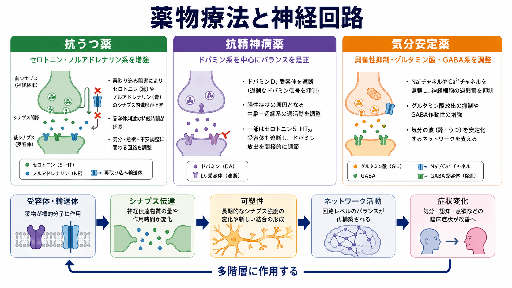
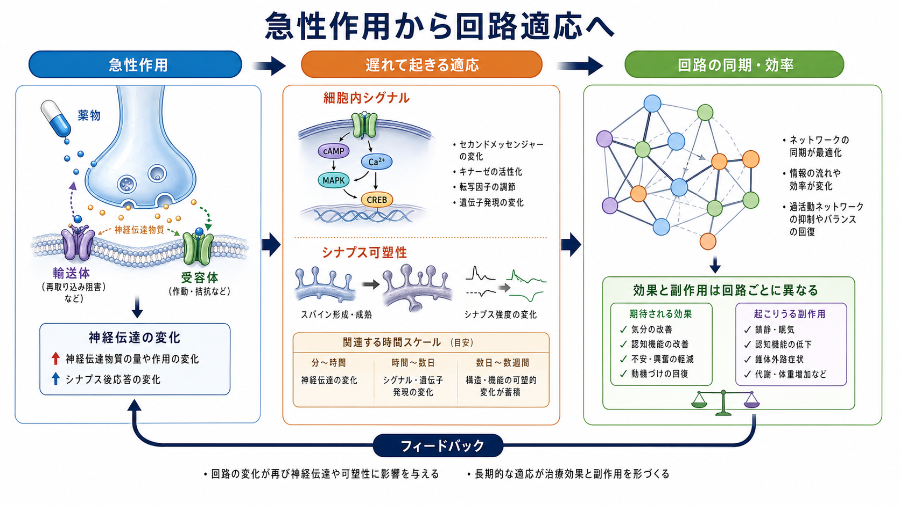
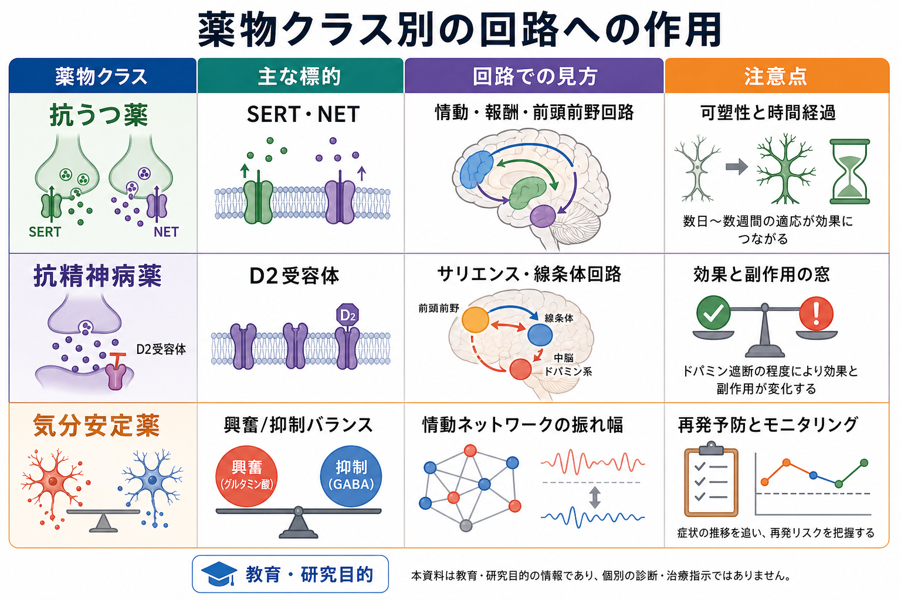

# 薬物療法は神経回路にどう作用するのか

## 要点

- 薬物療法は「気分物質を増やす」「ドパミンを下げる」といった単一作用ではなく、受容体・輸送体、シナプス伝達、細胞内シグナル、神経可塑性、ネットワーク活動をまたいで働く。
- 抗うつ薬では、SERT/NET などへの急性作用に加えて、前頭前野・海馬・報酬系を含む回路の可塑性が症状変化に関わると考えられる[1][2]。
- 抗精神病薬では、多くの薬剤で D2 受容体作用が中核だが、線条体、サリエンス処理、運動系、副作用の窓を同時に考える必要がある[3][4]。
- 気分安定薬では、リチウムやバルプロ酸がイノシトール代謝、GSK3、PKC、GABA/グルタミン酸系など複数の経路を通じ、情動ネットワークの振れ幅を小さくする方向に作用すると理解できる[5][6]。
- ここでの説明は教育・研究目的であり、個別の診断、処方選択、用量調整、服薬中止の指示ではない。

## この記事で答える問い

1. 抗うつ薬、抗精神病薬、気分安定薬は、脳内の何に最初に作用するのか。
2. 受容体や輸送体への作用が、どのように神経回路の活動変化へつながるのか。
3. 薬効と副作用を、神経回路の観点からどう読み分ければよいのか。
4. 薬物療法を「脳を単純に正常化する方法」と見なすと、どこで誤解が生じるのか。

## まず結論

薬物療法は、神経回路の「入力の重み」「興奮と抑制のバランス」「可塑性の起こりやすさ」「ネットワーク間の同期」を変える介入である。薬が最初に触れるのは SERT、NET、D2 受容体、Na+ チャネル、GABA/グルタミン酸系、細胞内酵素などの分子標的だが、臨床的な変化はその標的だけで完結しない。

たとえば SSRI は SERT を阻害してシナプス外・シナプス内のセロトニン信号を変える。しかし、抑うつ症状の改善が数日から数週間の時間幅をもって現れることは、急性の伝達物質変化だけでなく、受容体感受性、遺伝子発現、BDNF/TrkB、シナプス可塑性、前頭前野・海馬・報酬系の再調整が関わることを示唆する[1][2]。この点は [[神経可塑性低下はうつ病をどう説明するのか]] や [[報酬系の異常はうつ病をどう説明するのか]] と接続して読むと理解しやすい。

抗精神病薬では D2 受容体遮断または部分作動が中心的だが、これは「ドパミンを悪者として消す」ことではない。線条体ドパミン信号はサリエンス、予測誤差、行動選択に関わるため、過剰な意味づけや幻覚・妄想の形成を弱める一方、運動系や内分泌系に作用すれば副作用も生じうる[3][4]。これは [[ドパミン仮説は統合失調症をどこまで説明できるのか]] と深く関係する。

気分安定薬は、単一の「気分中枢」を押さえる薬ではない。リチウムやバルプロ酸はイノシトール代謝、GSK3、PKC、神経保護、GABA/グルタミン酸系など複数の層に作用し、躁とうつの間で振れやすい情動・睡眠・報酬・行動活性化のネットワークを安定化する方向に働くと考えられる[5][6]。これは [[双極性障害は情動ネットワークの異常として説明できるのか]] や [[E_Iバランス異常は精神疾患をどう説明するのか]] と接続する。

## 背景

精神科薬物療法は、しばしば「足りない物質を足す」「多すぎる物質を減らす」と説明される。この説明は導入としては便利だが、神経科学的には粗い。脳の症状は、単一の神経伝達物質濃度ではなく、複数の回路がどのタイミングで、どの強度で、どの文脈に反応するかによって現れる。

うつ病では、気分、意欲、睡眠、食欲、自己評価、報酬感受性、ストレス反応が同時に変化する。統合失調症では、幻覚・妄想だけでなく、陰性症状、認知機能、社会機能、運動副作用のリスクが問題になる。双極性障害では、気分の上下だけでなく、睡眠、活動量、報酬追求、衝動性、再発予防が重要になる。したがって薬物療法も、分子標的からネットワークまでをつなぐ多階層の現象として捉える必要がある。

## 基本概念

### 受容体・輸送体

受容体は神経伝達物質を受け取る分子であり、輸送体は放出された伝達物質を細胞内へ回収する分子である。SSRI は主に SERT、SNRI は SERT と NET に作用し、セロトニンやノルアドレナリン信号の時間幅や空間的広がりを変える[1]。抗精神病薬の多くは D2 受容体に作用し、ドパミン信号の強さや意味づけの過剰さを調整する[3][4]。

### シナプス可塑性

シナプス可塑性とは、経験、ストレス、学習、薬物、睡眠などに応じてシナプスの強さや構造が変わる性質である。抗うつ薬の作用を考えるとき、急性のモノアミン変化だけでなく、前頭前野や海馬でのシナプス密度、樹状突起スパイン、BDNF/TrkB、mTOR などの変化が重要になる[2]。詳しくは [[神経可塑性低下はうつ病をどう説明するのか]] を参照。

### 興奮/抑制バランス

神経回路は、グルタミン酸を中心とする興奮性入力と、GABA を中心とする抑制性入力のバランスで安定する。気分安定薬や抗てんかん薬由来の薬剤は、このバランス、イオンチャネル、細胞内シグナルを通じて過剰な発火や振れ幅を抑える方向に働くことがある[5]。これは [[グルタミン酸仮説は統合失調症をどう説明するのか]]、[[GABA機能低下は統合失調症にどう関わるのか]] とも関連する。

## 仕組み

### 1. 抗うつ薬: 急性の再取り込み阻害から回路可塑性へ

SSRI/SNRI は、投与後比較的早期に SERT/NET を阻害し、セロトニンやノルアドレナリンの再取り込みを弱める。これにより、シナプス周辺の伝達物質信号は変化する。しかし、症状改善が遅れて現れることが多い点から、薬効は単なる濃度上昇ではなく、自己受容体の適応、受容体感受性の変化、細胞内シグナル、BDNF 関連の可塑性、ストレスで弱った前頭前野・海馬回路の再調整と結びつけて考えられる[1][2]。

この見方では、抗うつ薬は「気分を直接上げる薬」というより、情動処理、報酬予測、反すう、ストレス反応、認知制御に関わる回路が再学習しやすい状態を作る介入として理解できる。薬物療法、心理療法、睡眠、運動、社会的経験が相互作用する理由もここにある。

### 2. 抗精神病薬: D2 受容体とサリエンス調整

統合失調症や精神病症状の研究では、線条体ドパミン機能の亢進が重要な経路として扱われてきた。Howes と Kapur は、ドパミン異常を統合失調症全体の唯一原因ではなく、複数の上流要因が収束する「最終共通経路」として位置づけた[3]。この見方では、D2 受容体に作用する抗精神病薬は、世界の出来事に過剰な意味や確信が付与される過程を弱める薬として理解できる。

ただし D2 受容体作用は、線条体のサリエンス処理だけでなく、黒質線条体系の運動制御、下垂体のプロラクチン調整、報酬・意欲にも関わる。D2 受容体占有率が高くなりすぎると錐体外路症状のリスクが上がることが、近年の用量反応メタ分析でも整理されている[4]。そのため抗精神病薬の作用は「症状を抑える回路」と「副作用が出る回路」の両方から読む必要がある。

### 3. 気分安定薬: 情動ネットワークの振れ幅を小さくする

リチウム、バルプロ酸、ラモトリギンなどは、同じ「気分安定薬」と呼ばれても標的は一様ではない。リチウムとバルプロ酸については、イノシトール枯渇、GSK3 阻害、PKC 経路、神経保護、GABA/グルタミン酸系などが候補として議論されてきた[5]。これらの作用は、躁状態の過剰な行動活性化、睡眠欲求低下、報酬追求、衝動性、うつ状態の活動低下や報酬反応低下を、単一の回路ではなく複数回路の安定性として捉える視点を与える。

CANMAT/ISBD ガイドラインでは、双極性障害の急性期とうつ病相、維持療法で薬剤選択の位置づけが異なり、リチウム、divalproex、非定型抗精神病薬、ラモトリギンなどが病相ごとに整理されている[6]。これは、気分安定薬を「躁を止める薬」だけでなく、再発予防、睡眠・概日リズム、認知機能、長期的機能回復に関わる介入として考える必要があることを示している。

## 図解

上の図は、薬物療法を「急性作用」と「遅れて起きる適応」に分けて読むための模式図である。薬物はまず輸送体・受容体・イオンチャネル・細胞内酵素などに作用する。そこから神経伝達の強さやタイミングが変わり、細胞内シグナル、遺伝子発現、シナプス可塑性が変化し、最終的にネットワーク活動の同期や効率が変わる。

重要なのは、効果と副作用が同じ薬の別々の回路作用として生じる点である。抗精神病薬なら、線条体ドパミン信号の調整は精神病症状の軽減に関わりうるが、黒質線条体系への作用は運動副作用に関わる。抗うつ薬なら、情動回路の再調整は改善につながりうるが、睡眠、性機能、消化器症状など別の身体・脳内回路にも影響が出ることがある。気分安定薬でも、再発予防と副作用モニタリングは切り離せない。

## 臨床・研究との接続

臨床的には、薬物療法の効果判定は「症状が少し下がったか」だけでなく、睡眠、活動量、意欲、認知、社会機能、副作用、服薬継続可能性を含めて行われる。APA の統合失調症ガイドラインは、抗精神病薬の使用だけでなく、効果と副作用のモニタリング、患者中心の治療計画、心理社会的介入との併用を重視している[7]。双極性障害でも、維持療法と再発予防が重要であり、急性期だけを見て薬効を判断するのは不十分である[6]。

研究では、薬物療法の作用を理解するために PET、fMRI、EEG、行動課題、血中・脳脊髄液バイオマーカー、計算論モデルが使われる。PET は D2 受容体占有率やトランスポーター結合を調べる助けになり、fMRI や EEG は薬物投与後のネットワーク活動の変化を調べる助けになる。ただし、これらの指標は個別診断や薬剤選択を単独で決めるものではなく、症状尺度、生活史、身体状態、副作用、患者の価値観と合わせて解釈する必要がある。

## よくある誤解

### 「抗うつ薬はセロトニン不足を補うだけである」

SSRI が SERT に作用することは重要だが、うつ病を単純なセロトニン不足として説明するのは不十分である。抗うつ薬の効果には、受容体適応、可塑性、ストレス回路、報酬系、認知制御の変化が関わる[1][2]。

### 「抗精神病薬はドパミンを止めればよい」

ドパミンは報酬、学習、行動選択、サリエンスに関わる重要な信号である。抗精神病薬の目的は、必要なドパミン機能をすべて消すことではなく、症状に関わる過剰または不適切な信号を副作用とのバランスの中で調整することである[3][4]。

### 「気分安定薬は気分を平板にする薬である」

気分安定薬は、情動、睡眠、活動性、報酬追求、再発しやすさに関わるネットワークの振れ幅を小さくする方向に作用すると理解できる。望ましい目標は感情をなくすことではなく、過剰な振幅や再発リスクを下げ、生活機能を保ちやすくすることである[5][6]。

### 「薬が効けば脳は正常に戻ったと言える」

薬効は、脳が固定された正常状態へ戻るというより、回路の反応性や学習の方向が変わることとして理解した方がよい。症状改善と副作用、主観的な回復感、社会機能、長期的再発予防は同じではない。

## 関連ノート

- [[神経可塑性低下はうつ病をどう説明するのか]]
- [[報酬系の異常はうつ病をどう説明するのか]]
- [[前頭前野は情動制御にどう関わるのか]]
- [[ドパミン仮説は統合失調症をどこまで説明できるのか]]
- [[グルタミン酸仮説は統合失調症をどう説明するのか]]
- [[GABA機能低下は統合失調症にどう関わるのか]]
- [[E_Iバランス異常は精神疾患をどう説明するのか]]
- [[双極性障害は情動ネットワークの異常として説明できるのか]]

## 理解チェック

1. SSRI が SERT に作用してから、症状改善までに時間差が生じる理由を、シナプス可塑性の観点から説明できるか。
2. 抗精神病薬の D2 受容体作用が、精神病症状の軽減と運動副作用の両方に関わりうるのはなぜか。
3. 気分安定薬を「情動ネットワークの振れ幅を小さくする介入」と捉えると、双極性障害の再発予防をどう理解できるか。
4. 薬物療法の効果を評価するとき、症状尺度以外にどのような情報を合わせて見るべきか。

## 参考文献

[1] Artigas, F. (2013). Serotonin receptors involved in antidepressant effects. *Pharmacology & Therapeutics*, 137(1), 119-131. https://doi.org/10.1016/j.pharmthera.2012.09.006

[2] Duman, R. S., Aghajanian, G. K., Sanacora, G., & Krystal, J. H. (2016). Synaptic plasticity and depression: new insights from stress and rapid-acting antidepressants. *Nature Medicine*, 22, 238-249. https://doi.org/10.1038/nm.4050

[3] Howes, O. D., & Kapur, S. (2009). The dopamine hypothesis of schizophrenia: version III--the final common pathway. *Schizophrenia Bulletin*, 35(3), 549-562. https://doi.org/10.1093/schbul/sbp006

[4] Siafis, S., Wu, H., Wang, D., Burschinski, A., Nomura, N., Takeuchi, H., Schneider-Thoma, J., Davis, J. M., & Leucht, S. (2023). Antipsychotic dose, dopamine D2 receptor occupancy and extrapyramidal side-effects: a systematic review and dose-response meta-analysis. *Molecular Psychiatry*, 28, 3267-3277. https://doi.org/10.1038/s41380-023-02203-y

[5] Harwood, A. J., & Agam, G. (2017). Inositol depletion, GSK3 inhibition and bipolar disorder. *Future Neurology*, 12(1), 1-14. https://pmc.ncbi.nlm.nih.gov/articles/PMC5751514/

[6] Yatham, L. N., Kennedy, S. H., Parikh, S. V., Schaffer, A., Bond, D. J., Frey, B. N., Sharma, V., et al. (2018). Canadian Network for Mood and Anxiety Treatments (CANMAT) and International Society for Bipolar Disorders (ISBD) 2018 guidelines for the management of patients with bipolar disorder. *Bipolar Disorders*, 20(2), 97-170. https://doi.org/10.1111/bdi.12609

[7] Keepers, G. A., Fochtmann, L. J., Anzia, J. M., Benjamin, S., Lyness, J. M., Mojtabai, R., Servis, M., et al. (2020). The American Psychiatric Association Practice Guideline for the Treatment of Patients With Schizophrenia. *American Journal of Psychiatry*, 177(9), 868-872. https://doi.org/10.1176/appi.ajp.2020.177901

## 未解決問題

- 分子標的、脳画像、症状変化を個人単位で結びつける予測モデルは、まだ研究段階である。
- 薬物療法と心理療法、睡眠、運動、社会的介入がどの順序・組み合わせで回路可塑性を促すのかは、疾患や個人差によって異なる。
- 「効いている回路」と「副作用が出ている回路」を、臨床で簡便に分けて測定する方法は十分に確立していない。

## MOC更新候補

- `content/00_MOC/` 配下の神経科学・精神疾患関連 MOC に、本記事へのリンクを追加候補とする。
- 並列ジョブとの競合を避けるため、本タスクでは MOC 本体は更新しない。
