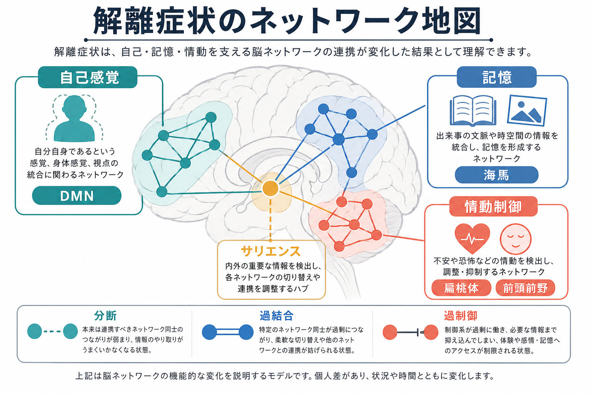
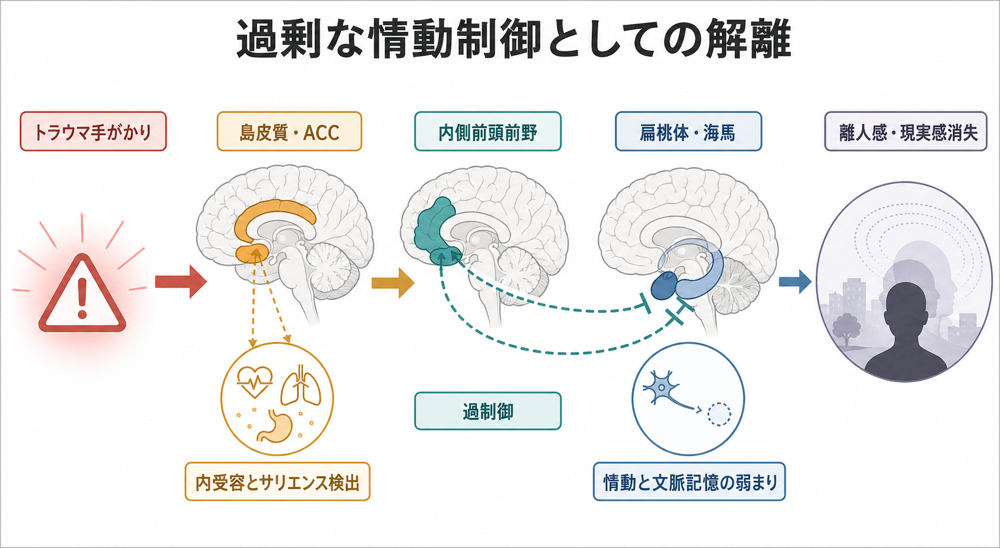
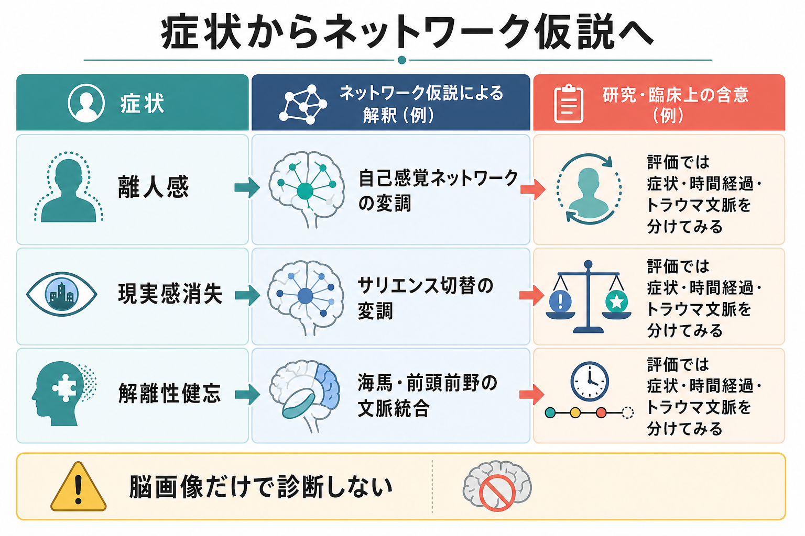

# 解離症状は脳ネットワークでどう説明できるのか

## 要点

- 解離は「意識・記憶・知覚・身体感覚・自己同一性がばらばらになる」現象として定義されるが、脳では単一部位の故障というより、自己感覚、記憶、情動制御、身体内受容を結ぶネットワークの協調不全として考えやすい[1]。
- 画像研究で繰り返し注目されるのは、前頭前野、前部帯状皮質、島皮質、扁桃体、海馬、側頭・頭頂領域である。ただし研究数はまだ少なく、診断や治療方針を脳画像だけで決める段階ではない[1]。
- PTSD の解離サブタイプでは、再体験・過覚醒型と対照的に、内側前頭前野や前部帯状皮質による情動の「過剰調整」が扁桃体・辺縁系反応を抑え、離人感や現実感消失に関わるというモデルが提案されている[2]。
- 離人感・現実感消失は、前頭前野による辺縁系抑制、身体内受容の変調、自己関連処理の変化として説明されることが多い[6][7]。
- この説明は教育・研究目的の神経ネットワーク仮説であり、個別の診断や治療指示ではない。

## この記事で答える問い

1. 解離症状を「脳のどこが壊れたか」ではなく「どのネットワークの協調が変わったか」として読むと、何が見えてくるのか。
2. 自己感覚、記憶、情動制御、身体感覚は、解離のどの側面に関わるのか。
3. PTSD の解離サブタイプや離人感・現実感消失の研究は、どこまで一般化できるのか。
4. 臨床や研究で、このネットワーク仮説をどう使い、どこに注意すべきか。

## まず結論

解離症状は、脳の一つの場所が止まる現象というより、「自己を感じるネットワーク」「出来事を文脈づける記憶ネットワーク」「情動と身体反応を評価するサリエンス・内受容ネットワーク」「情動反応を抑制・調整する前頭前野ネットワーク」の結びつきが、一時的または持続的に変調する現象として理解できる。

たとえば、強い脅威やトラウマ関連手がかりに直面したとき、通常は扁桃体や島皮質が危険・身体反応・情動の重要性を強く知らせ、海馬が「いつ、どこで、何が起きたか」という文脈を与え、前頭前野が反応を調整する。ところが解離が前面に出る場合、この協調が過剰に切り替わり、情動が「弱く感じられる」、身体が「自分のものではない」、周囲が「現実味を失う」、記憶が「つながらない」といった形で経験される[2][6][7]。

重要なのは、解離を「気のせい」や「単なる逃避」と見なさないこと、同時に「脳画像で解離が証明できる」と短絡しないことである。脳画像研究は、症状の理解を助ける地図であって、本人の語り、時間経過、トラウマ文脈、併存症、生活機能の評価を置き換えるものではない[1][5]。

## 背景

解離は、精神医学では意識、記憶、同一性、感情、知覚、身体表象、運動制御などの統合が途切れる現象として扱われる。軽い没入や一時的な現実感の薄れから、強い離人感、現実感消失、解離性健忘、同一性の変化まで、幅の広い現象を含む[1]。

神経科学的には、解離を単一の「解離中枢」で説明するより、複数の大規模ネットワークの切り替えとして考える方が自然である。[[fMRIは神経活動を直接測っているのか]] や [[BOLD信号とは何か]] で扱うように、fMRI は神経活動を直接測るものではなく、課題や安静時に伴う血流変化を通じてネットワーク活動を推定する。したがって、解離研究の画像所見も「この部位が原因」と読むより、「この条件でこのネットワーク結合が変わりやすい」と読む必要がある。

近年の PTSD 研究では、解離サブタイプがとくに注目されている。PTSD の典型的な再体験・過覚醒では、情動反応が強く出て、前頭前野による調整が十分に働かない「情動の過小調整」として説明されることが多い。一方、解離サブタイプでは、内側前頭前野や前部帯状皮質による調整が過剰になり、辺縁系反応が抑え込まれる「情動の過剰調整」として説明される[2]。この対比は、解離が「感情がない」のではなく、「感情へのアクセスや身体化のされ方が変わる」現象であることを示している。

## 基本概念

### 自己感覚ネットワーク

自己感覚には、内側前頭前野、後部帯状皮質・楔前部、側頭頭頂接合部、島皮質などが関わる。これらは、内的な自己参照、身体の所有感、視点、他者との境界づけに関係する。離人感では「考えている自分を外から見ている」「身体が自分のものではない」といった経験が起こるため、自己関連処理と身体表象の結合が重要になる[7]。

### 記憶と文脈づけ

海馬は、出来事を時間・場所・状況の文脈に結びつける。解離性健忘やトラウマ記憶では、出来事の一部が断片化したり、現在の安全な文脈と過去の危険な文脈が区別しにくくなったりする。これは単なる「記憶力の低下」ではなく、情動、身体感覚、自己感覚を含む出来事の統合の問題として捉えられる。

### 情動制御ネットワーク

[[前頭前野は情動制御にどう関わるのか]] で扱うように、前頭前野は扁桃体などの情動関連領域を状況に応じて調整する。PTSD の解離サブタイプでは、この調整が不足するのではなく、過剰なトップダウン抑制として働く可能性がある[2][4]。その結果、恐怖や怒りが「強すぎる」のではなく、「感じられない」「遠い」「自分のものではない」という形で現れる。

### サリエンスと身体内受容

島皮質と前部帯状皮質は、身体内部の変化、痛み、心拍、呼吸、緊張、危険の手がかりを統合し、「いま何が重要か」を選ぶ。解離では、このサリエンス検出が不安定になり、身体反応が鈍く感じられる場合もあれば、逆に身体感覚が過剰に目立つ場合もある。[[扁桃体過活動は不安症やPTSDにどう関わるのか]] と同じく、扁桃体だけを切り出すより、島皮質、前部帯状皮質、前頭前野、海馬との関係を見る方が実態に近い。

## 仕組み

### 1. 分断としての解離

解離を最も直感的に説明するなら、「自己・身体・記憶・情動の同期が崩れること」である。通常、ある出来事を経験すると、視覚や聴覚、身体感覚、情動、意味づけ、記憶がまとまって「私がこの出来事を経験している」という一つのまとまりになる。解離では、このまとまりが弱まり、出来事は見えているが現実感が薄い、身体反応はあるが自分のものに感じない、記憶は残っているが情動が伴わない、という分離が起こる。

機能画像研究のシステマティックレビューでは、解離性障害において前頭前野の機能変化が目立ち、前部帯状皮質、頭頂・側頭・島皮質、皮質下領域も報告されている[1]。これは、解離を一つの局所病変としてではなく、複数領域の機能的ネットワークとして扱う根拠になる。

### 2. 過剰な情動制御としての解離

PTSD の解離サブタイプで重要なのは、情動反応が単に「弱い」のではなく、上位制御によって過剰に抑えられている可能性である。Lanius らは、再体験・過覚醒を情動の過小調整、解離を情動の過剰調整として整理した[2]。このモデルでは、内側前頭前野や前部帯状皮質が扁桃体・辺縁系を強く抑制し、主観的には「怖いはずなのに感じない」「自分がその場にいない」「世界が膜の向こうにある」といった経験につながる。

安静時機能結合研究でも、PTSD 解離サブタイプでは扁桃体亜領域の結合パターンが非解離型 PTSD や対照群と異なることが報告されている[3]。また、動的因果モデリングを用いた研究では、恐怖・情動制御回路におけるボトムアップ処理とトップダウン処理の違いが検討され、解離サブタイプのネットワーク理解を支持している[4]。

### 3. 大規模ネットワークの切り替え不全

解離をより広く見ると、デフォルトモードネットワーク、サリエンスネットワーク、中央実行ネットワークの切り替え問題としても整理できる。デフォルトモードネットワークは自己参照や自伝的記憶に、サリエンスネットワークは重要な内外刺激の検出に、中央実行ネットワークは注意や作業記憶、認知制御に関わる。サリエンスネットワークは、内的自己処理と外的課題処理の切り替えを調整する役割を持つとされる[8]。

PTSD サブタイプの系統的レビューでは、解離サブタイプ研究の多くが安静時機能結合に注目しており、前部デフォルトモードネットワーク内の vmPFC 結合やサリエンスネットワーク内結合の変化が報告されている[5]。この見方では、解離は「自己が消える」のではなく、自己関連処理、身体内受容、注意制御、情動制御の切り替えが過度に固定化または分断される現象として読める。

### 4. 離人感・現実感消失の前頭辺縁モデル

離人感・現実感消失では、前頭前野が辺縁系や自律神経反応を抑えることで、情動の色づきや身体の実感が弱まるというモデルが長く提案されてきた[6]。近年の批判的レビューも、前頭辺縁抑制、情動的しびれ、身体スキーマの統合不全、トラウマ関連病理との連続性を論じている[7]。

このモデルの利点は、離人感を「感情がない人の特徴」と誤解せず、「情動反応へのアクセスが変わる状態」と説明できる点にある。本人の中では苦痛が強いにもかかわらず、外からは平静に見えることがある。これは、主観的苦痛と外見上の表情・自律神経反応が一致しない可能性を示している。

## 図解

図1は、解離を自己感覚、記憶、情動制御、サリエンスのネットワーク変調としてまとめた概念地図である。図2は、PTSD 解離サブタイプ研究でよく使われる「過剰な情動制御」モデルを簡略化している。図3は、症状からネットワーク仮説へ読み替えるときの整理である。

| 症状の表れ | ネットワーク仮説 | 見るべきポイント |
|---|---|---|
| 離人感 | 自己感覚・身体所有感ネットワークの変調 | 自分の身体・感情・行為への実感 |
| 現実感消失 | サリエンス、知覚、自己参照の切り替え不全 | 周囲の現実味、距離感、夢のような感覚 |
| 解離性健忘 | 海馬・前頭前野による文脈統合の変調 | 時間、場所、出来事の連続性 |
| 情動の麻痺 | 前頭前野による辺縁系の過剰抑制 | 感情の「強さ」ではなく、感情へのアクセス |
| トラウマ関連解離 | 脅威手がかり、サリエンス、情動制御の再編成 | 安全な現在と危険な過去の区別 |

## 臨床・研究との接続

臨床的には、解離症状を評価するとき、症状名だけでなく「いつ起こるか」「どの感覚が切れるか」「記憶は残るか」「身体反応はあるか」「情動を感じるか」「トラウマ手がかりと関係するか」を分けて見る必要がある。たとえば、同じ「ぼんやりする」でも、睡眠不足、薬物、てんかん、抑うつ、パニック、PTSD、解離性障害では意味が異なる。

研究では、解離を単一尺度の総点だけで扱うより、離人感、現実感消失、健忘、同一性の変化、身体感覚の変化に分け、脳ネットワークとの対応を検討する方が有用である。PTSD 解離サブタイプの研究が示すように、同じ診断名の中でもネットワークパターンが異なる可能性がある[3][5]。

ただし、画像研究には限界がある。サンプルサイズが小さい研究が多く、課題、解析方法、併存症、薬物治療歴、トラウマ歴、発症時期が結果に影響する。したがって、脳画像所見は「個人の解離の証明」ではなく、「集団レベルでありそうなメカニズム」を示すものとして読むのが安全である[1]。

## よくある誤解

### 誤解1: 解離は感情が弱い人に起こる

解離は感情が弱いことを意味しない。むしろ強い脅威や過負荷の中で、情動、身体感覚、記憶、自己感覚の統合が保てなくなる、または過剰に抑制される現象として理解できる[2][7]。

### 誤解2: 解離は扁桃体だけで説明できる

扁桃体は重要だが、解離を扁桃体だけで説明するのは狭すぎる。前頭前野、前部帯状皮質、島皮質、海馬、側頭・頭頂領域、デフォルトモードネットワーク、サリエンスネットワークを含む協調の問題として見る必要がある[1][5]。

### 誤解3: 脳画像を撮れば解離かどうかわかる

現時点では、脳画像だけで個別の解離症状を診断することはできない。画像研究は神経機構の理解に役立つが、診断は症状、経過、生活機能、除外診断、本人の経験の丁寧な評価に基づく。

### 誤解4: 解離はトラウマがある人だけに起こる

トラウマは重要な関連要因だが、解離様体験は疲労、強いストレス、パニック、薬物、神経疾患、発達的要因など多様な文脈で生じうる。トラウマ文脈の評価は重要だが、原因を一つに決めつけないことが必要である。

## 関連ノート

- [[前頭前野は情動制御にどう関わるのか]]
- [[扁桃体過活動は不安症やPTSDにどう関わるのか]]
- [[海馬萎縮はストレスやうつ病と関係するのか]]
- [[精神疾患は脳の病気なのか]]
- [[fMRIは神経活動を直接測っているのか]]
- [[BOLD信号とは何か]]

MOC更新候補: `content/00_MOC/MOC｜脳・神経科学.md`, `content/00_MOC/MOC｜精神医学.md`

今後の作成候補: 「解離性障害とは何か」「離人感・現実感消失症とは何か」「PTSDの解離サブタイプとは何か」「サリエンスネットワークとは何か」「デフォルトモードネットワークとは何か」

## 理解チェック

1. 解離症状を単一部位ではなくネットワーク変調として見る利点は何か。
2. PTSD の解離サブタイプで提案される「情動の過剰調整」は、再体験・過覚醒型とどう違うか。
3. 離人感・現実感消失を「感情がない」と説明すると、どのような誤解が起こるか。
4. 脳画像研究の所見を臨床診断にそのまま使えない理由は何か。

## 未解決問題

- 解離の下位症状ごとに、安定したネットワーク指標があるのか。
- 一過性の解離と慢性的な解離性障害では、同じ神経機構が働くのか。
- トラウマ歴、発達段階、併存するうつ・不安・PTSD・神経疾患をどう分けて解析すべきか。
- 脳ネットワーク所見は、心理療法や身体志向アプローチの反応予測に使えるのか。

## 参考文献

[1] Modesti, M. N., Rapisarda, L., Capriotti, G., et al. (2022). Functional Neuroimaging in Dissociative Disorders: A Systematic Review. *Journal of Personalized Medicine*, 12(9), 1405. https://doi.org/10.3390/jpm12091405

[2] Lanius, R. A., Vermetten, E., Loewenstein, R. J., Brand, B., Schmahl, C., Bremner, J. D., & Spiegel, D. (2010). Emotion Modulation in PTSD: Clinical and Neurobiological Evidence for a Dissociative Subtype. *American Journal of Psychiatry*, 167(6), 640-647. https://doi.org/10.1176/appi.ajp.2009.09081168

[3] Nicholson, A. A., Densmore, M., Frewen, P. A., Theberge, J., Neufeld, R. W. J., McKinnon, M. C., & Lanius, R. A. (2015). The Dissociative Subtype of Posttraumatic Stress Disorder: Unique Resting-State Functional Connectivity of Basolateral and Centromedial Amygdala Complexes. *Neuropsychopharmacology*, 40, 2317-2326. https://doi.org/10.1038/npp.2015.79

[4] Nicholson, A. A., Friston, K. J., Zeidman, P., et al. (2017). Dynamic causal modeling in PTSD and its dissociative subtype: Bottom-up versus top-down processing within fear and emotion regulation circuitry. *Human Brain Mapping*, 38(11), 5551-5561. https://doi.org/10.1002/hbm.23748

[5] Zhang, C., Haim-Nachum, S., Prasad, N., Suarez-Jimenez, B., Zilcha-Mano, S., Lazarov, A., Neria, Y., & Zhu, X. (2025). PTSD subtypes and their underlying neural biomarkers: a systematic review. *Psychological Medicine*, 55, e153. https://doi.org/10.1017/S0033291725001229

[6] Sierra, M., & Berrios, G. E. (1998). Depersonalization: neurobiological perspectives. *Biological Psychiatry*, 44(9), 898-908. https://doi.org/10.1016/S0006-3223(98)00015-8

[7] Murphy, R. J. (2023). Depersonalization/Derealization Disorder and Neural Correlates of Trauma-related Pathology: A Critical Review. *Innovations in Clinical Neuroscience*, 20(1-3), 53-59. https://pmc.ncbi.nlm.nih.gov/articles/PMC10132272/

[8] Chand, G. B., Wu, J., Hajjar, I., & Qiu, D. (2017). Interactions of the Salience Network and Its Subsystems with the Default-Mode and the Central-Executive Networks in Normal Aging and Mild Cognitive Impairment. *Brain Connectivity*, 7(7), 401-412. https://doi.org/10.1089/brain.2017.0509
