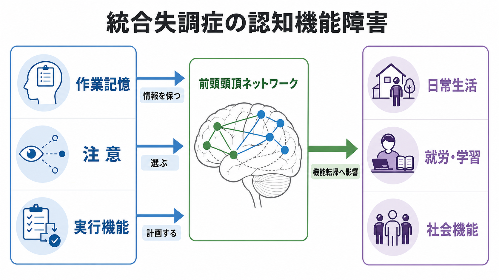
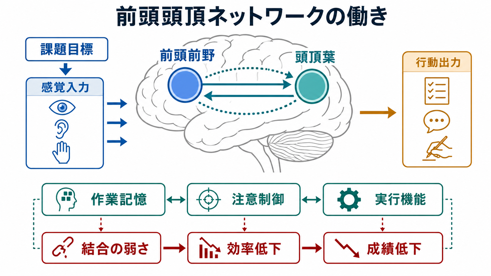
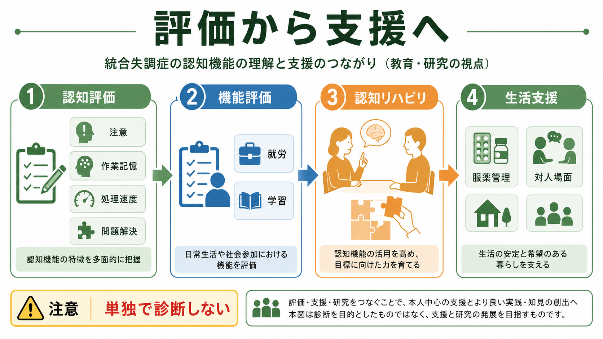

# 認知機能障害は統合失調症でなぜ重要なのか

## 要点

- 統合失調症では、幻覚・妄想だけでなく、注意、作業記憶、処理速度、学習、問題解決、社会認知などの認知機能障害が重要な症状群である[1][2]。
- 認知機能障害は「検査点が低い」という問題にとどまらず、会話を追う、予定を保つ、学習する、就労する、対人場面で柔軟に反応する、といった日常機能に関係する[2][4]。
- 作業記憶・注意・実行機能は、前頭前野と頭頂葉を結ぶ[[前頭頭頂ネットワークは認知制御をどう支えるのか|前頭頭頂ネットワーク]]、[[中央実行ネットワークとは何か|中央実行ネットワーク]]、サリエンス系、デフォルトモード系との相互作用として理解しやすい[5][6][7]。
- 抗精神病薬は陽性症状に有効なことが多い一方、認知機能障害の改善は限定的であり、認知リハビリテーション、心理社会的支援、環境調整と組み合わせて考える必要がある[1][8]。
- ここでの記述は教育・研究目的であり、個別の診断や治療方針を示すものではない。

## この記事で答える問い

このノートでは、次の問いを扱う。

1. 統合失調症で「認知機能障害」がなぜ中核的な問題になるのか。
2. 作業記憶・注意・実行機能の障害は、どのように日常生活や社会機能へつながるのか。
3. 前頭頭頂ネットワークという見方は、統合失調症の認知障害をどう整理するのに役立つのか。
4. 研究・臨床では、認知機能障害をどのように評価し、どこまで支援につなげられるのか。

## まず結論

統合失調症の認知機能障害が重要なのは、**症状の目立ちやすさと生活上の困難が必ずしも一致しない**からである。幻覚や妄想が軽くなっても、情報を一時的に保つ、必要な刺激を選ぶ、計画を立てる、誤りに気づいて修正する、といった認知制御が弱いままだと、学業、仕事、家事、服薬管理、対人関係は難しくなりうる[1][2][4]。

このとき、認知機能障害を「本人の努力不足」や「単なる集中力の低さ」と見ると理解を誤る。作業記憶、注意、実行機能は、前頭前野、頭頂葉、視床、感覚野、サリエンスネットワーク、デフォルトモードネットワークなどが、課題や文脈に応じて協調することで成り立つ。統合失調症では、この協調が効率よく働きにくくなる可能性がある[5][6][7]。

したがって、認知機能障害は「検査で測る副次的特徴」ではなく、回復、社会参加、リハビリテーション、治療標的を考えるための中心的な入口である。

## 背景

統合失調症は、陽性症状、陰性症状、認知症状を含む複合的な精神疾患である。NIMHの一般向け解説でも、認知症状として、注意・集中、記憶、情報処理と意思決定の困難が挙げられ、日常機能の予測因子として重要視されている[1]。

歴史的には、統合失調症は幻覚・妄想や思考障害を中心に説明されやすかった。しかし、神経心理学研究が蓄積するにつれ、認知機能障害は慢性期だけでなく初回エピソードでもみられ、複数領域に広がることが明らかになった。BowieとHarveyのレビューは、注意、作業記憶、言語学習・記憶、実行機能などの障害が中等度から重度に及び、機能転帰と関係することを整理している[2]。

評価面では、NIMHのMATRICSプロジェクトにより、統合失調症の認知改善治療を評価する標準バッテリーとしてMCCBが整備された。MCCBは、処理速度、注意・警戒、作業記憶、言語学習、視覚学習、推論・問題解決、社会認知という7領域を扱う[3]。この記事では、そのうち作業記憶、注意、実行機能に相当する推論・問題解決を中心に、前頭頭頂ネットワークから整理する。

## 基本概念

### 認知機能障害

認知機能障害とは、情報を受け取り、保ち、選び、更新し、行動へ変換する過程の障害である。統合失調症では、単一の認知領域だけが落ちるというより、処理速度、注意、記憶、学習、問題解決、社会認知が広く影響を受けやすい[2][3]。

重要なのは、認知機能障害が症状評価尺度だけでは見えにくい点である。たとえば、会話中に話題を保持できない、指示を聞いても途中で抜け落ちる、複数手順の作業を組み立てられない、予定変更に対応できない、といった困難は、幻覚や妄想の強さだけでは説明できない。

### 作業記憶

作業記憶は、情報を短時間保持しながら操作する働きである。電話番号を一時的に覚えるだけなら短期記憶に近いが、指示を聞きながら順序を組み替える、会話の文脈を保ったまま返答を考える、買い物の途中で予算と品目を同時に考える、といった場面では作業記憶が必要になる。

統合失調症の作業記憶障害は、社会機能や職業機能と関係し、MCCBにも独立した領域として含まれている[3][7]。

### 注意

注意は、すべての刺激を同じ重みで処理せず、今の目標に必要な情報を選び、不要な情報を抑える働きである。注意には、持続的に集中する、複数刺激から選ぶ、妨害を抑える、必要なときに切り替える、といった側面がある。

統合失調症では、注意の問題が、会話を追う困難、作業の中断、刺激への過敏さ、疲労しやすさとして現れることがある。ただし、これは本人の意志の弱さではなく、課題目標、感覚入力、覚醒水準、報酬、情動、[[皮質視床ループは意識や注意にどう関わるのか|皮質視床ループ]]が関わる多層的な問題として考える必要がある。

### 実行機能

実行機能は、目標を立て、手順を選び、行動を開始し、誤りを検出し、必要に応じて方略を変える働きである。MCCBでは「推論と問題解決」に近い領域として測られる[3]。

実行機能が弱いと、知識や技能があっても、それを現実の場面で使うことが難しくなる。たとえば、薬の飲み方を理解していても、予定変更や疲労が入ると服薬管理が崩れる。職場のルールを知っていても、複数の指示が重なると優先順位をつけられない。ここに、認知機能障害が生活機能へ影響する具体的な経路がある。

## 仕組み

### 前頭頭頂ネットワークは「課題に合わせて脳を構成する」

前頭頭頂ネットワークは、外界の情報を直接表すだけのネットワークではない。むしろ、「今は何をすべきか」「どの情報を保つか」「何を無視するか」「どの反応を選ぶか」という課題セットを保ち、他の感覚・記憶・運動系を調整するネットワークとして働く。

作業記憶課題では、背外側前頭前野、腹外側前頭前野、頭頂間溝、上頭頂小葉などが関与し、前頭葉と頭頂葉の結合が課題要求に応じて変化する。統合失調症の作業記憶fMRIメタ解析では、単純な「前頭葉低活動」だけでなく、前頭葉・頭頂葉を含む広域ネットワークの活動差として理解する必要が示されている[5]。

### 「前頭葉だけが弱い」ではなく、結合と効率の問題として見る

統合失調症の認知機能障害を、前頭前野の局所機能低下だけで説明すると単純化しすぎる。実行機能課題の機能画像メタ解析では、前頭前野、前帯状皮質、頭頂領域、視床、小脳などを含む広域の活動差が報告されている[6]。これは、認知制御が単一部位ではなく、複数領域の同期、切り替え、抑制、情報統合で成り立つことを示している。

作業記憶を例にすると、必要なのは「記憶の箱」だけではない。刺激を符号化する、妨害を抑える、保持した内容を更新する、反応を選ぶ、誤りを検出する、という処理が連続する。前頭頭頂ネットワークの結合が弱い、あるいは課題に合わせて柔軟に変わりにくい場合、同じ課題を解くにも余分な努力が必要になり、処理が遅くなったり、疲労しやすくなったりする。

### 内的思考と外的課題の切り替え

統合失調症の認知障害では、前頭頭頂ネットワークだけでなく、デフォルトモードネットワーク、サリエンスネットワーク、注意ネットワークとの関係も重要である。Wylieらの研究は、MCCBの作業記憶得点と左右の実行制御ネットワークを含む広域ネットワーク結合の関連を示し、作業記憶の神経基盤を分散ネットワークとして扱う必要を示している[7]。

日常場面で言えば、内的な考えや不安に注意が引き込まれる状態から、外的な課題へ切り替えることが難しい場合がある。これは「気が散る」という表現で済ませられがちだが、ネットワークの水準では、サリエンス検出、目標維持、不要情報の抑制、前頭頭頂系の課題設定がうまく接続しない問題として整理できる。

### 神経伝達物質・局所回路との接続

前頭頭頂ネットワークは、抽象的な「線」だけでできているわけではない。[[ドパミン仮説は統合失調症をどこまで説明できるのか|ドパミン]]、[[グルタミン酸仮説は統合失調症をどう説明するのか|グルタミン酸]]、[[GABA機能低下は統合失調症にどう関わるのか|GABA]]、[[アセチルコリンは注意や記憶にどう関わるのか|アセチルコリン]]などの神経修飾・シナプス機構、[[抑制性介在ニューロンにはどのような種類があるのか|抑制性介在ニューロン]]、[[神経同期とは何か|神経同期]]が、ネットワークのタイミングと信号対雑音比を支えている。

したがって、統合失調症の認知機能障害は、分子、細胞、局所回路、長距離結合、行動、社会機能をつなぐ多階層の問題である。単一の神経伝達物質だけで説明するより、どの水準の障害がどの認知操作に効いているのかを分けて考える方が有用である。

## 図解

図1は、作業記憶・注意・実行機能が前頭頭頂ネットワークを介して日常生活、就労・学習、社会機能へ影響する流れを示している。図2は、前頭前野と頭頂葉の結合、課題目標、感覚入力、行動出力の関係を、認知制御の機構として整理している。図3は、評価から支援へつなげる流れを示す。

## 臨床・研究との接続

### 評価は「診断」ではなく「支援設計」の入口である

認知評価は、統合失調症かどうかを単独で決める検査ではない。診断には、症状の経過、生活歴、身体疾患、薬物使用、気分症状、発達歴、文化的文脈などを含む総合評価が必要である。

一方で、認知評価は支援設計には役立つ。たとえば、作業記憶が弱い人には口頭説明だけでなくチェックリストや視覚的手がかりを使う。注意の持続が難しい人には、作業時間を短く区切り、妨害刺激を減らす。実行機能が弱い人には、目標を細かく分け、開始手順を外在化し、振り返りの機会を作る。

### 機能転帰を考える

Greenらの古典的レビューは、神経認知機能と機能転帰の関係を整理し、とくに社会的問題解決、技能獲得、地域生活などとの関連を議論した[4]。この視点は現在でも重要である。なぜなら、認知機能障害の意義は、脳内の異常を見つけること自体ではなく、本人がどのような場面で困り、どのような支援で参加しやすくなるかを考える点にあるからである。

### 認知リハビリテーション

認知リハビリテーションは、反復練習、方略学習、日常場面への橋渡しを通じて、認知技能と機能を改善しようとする介入である。2021年のメタ解析では、統合失調症に対する認知リハビリテーションは、複数の認知領域に小から中等度の改善をもたらし、機能面にも小さな改善を示した[8]。

ただし、認知リハビリテーションは「脳トレをすれば生活が自動的に改善する」という単純な介入ではない。効果を日常へ移すには、本人の目標、環境調整、就労・学習支援、家族・支援者との共有、心理社会的リハビリテーションとの接続が必要になる。

### 研究指標としての前頭頭頂ネットワーク

脳画像研究では、[[機能的結合解析とは何か|機能的結合解析]]、[[動的機能的結合とは何か|動的機能的結合]]、課題fMRI、安静時fMRI、EEG、[[P300とは何を反映しているのか|P300]]、[[NIRSは精神医学研究でどう使われるのか|NIRS]]などが用いられる。これらは、認知機能障害を回路水準で理解するための有用な手段である。

しかし、研究指標をそのまま個別診断や治療選択に使えるわけではない。前頭頭頂ネットワークの活動や結合は、課題難度、薬物、睡眠、動機づけ、教育歴、年齢、頭部運動、解析方法に影響される。研究では群レベルの傾向を読み、臨床では本人の生活課題と合わせて慎重に解釈する必要がある。

## よくある誤解

### 誤解1: 認知機能障害は幻覚や妄想が治れば自然に消える

陽性症状の改善と認知機能の改善は同じではない。抗精神病薬で幻覚・妄想が軽くなっても、注意、作業記憶、処理速度、実行機能の問題が残ることがある[1][2]。だからこそ、認知評価と生活支援を別に考える必要がある。

### 誤解2: 認知機能障害は知能の問題である

認知機能障害は、単純な知能の高さ低さだけでは説明できない。処理速度、注意の持続、情報更新、干渉抑制、社会的手がかりの読み取りなど、複数の処理が関わる。知識があっても、疲労や刺激過多の場面で使いにくくなることがある。

### 誤解3: 前頭葉だけを鍛えればよい

作業記憶・注意・実行機能は、前頭前野だけでなく、頭頂葉、前帯状皮質、視床、感覚野、サリエンス系、デフォルトモード系との相互作用で成り立つ[5][6][7]。支援でも、本人の訓練だけでなく、環境、手順、休息、対人支援を含めて設計する方が現実的である。

### 誤解4: 認知評価の点数が本人の価値や可能性を決める

認知評価は、困難の構造を理解するための道具であり、本人の価値を決めるものではない。検査成績は、疲労、緊張、薬剤、睡眠、症状、検査環境に影響される。重要なのは、点数を固定的なラベルにすることではなく、学習しやすい条件、働きやすい条件、暮らしやすい条件を見つけることである。

## 関連ノート

- [[前頭頭頂ネットワークは認知制御をどう支えるのか]]
- [[中央実行ネットワークとは何か]]
- [[皮質視床ループは意識や注意にどう関わるのか]]
- [[機能的結合解析とは何か]]
- [[動的機能的結合とは何か]]
- [[P300とは何を反映しているのか]]
- [[NIRSは精神医学研究でどう使われるのか]]
- [[ドパミン仮説は統合失調症をどこまで説明できるのか]]
- [[グルタミン酸仮説は統合失調症をどう説明するのか]]
- [[GABA機能低下は統合失調症にどう関わるのか]]
- [[シナプス刈り込みの異常は統合失調症と関係するのか]]

## MOC更新候補

- `content/00_MOC/MOC｜基礎神経科学.md`
- `content/00_MOC/MOC｜精神医学.md`
- `content/00_MOC/MOC｜脳画像・神経計測.md`

並列ジョブとの競合を避けるため、このノートではMOC本文の直接更新は行わない。

## 理解チェック

1. 統合失調症の認知機能障害が、幻覚・妄想とは別に重要視される理由は何か。
2. 作業記憶、注意、実行機能は、日常生活のどのような場面に現れやすいか。
3. 前頭頭頂ネットワークを使うと、「前頭葉だけの障害」という説明より何が見えやすくなるか。
4. 認知評価を個別診断の決め手として使うのではなく、支援設計に使うとはどういうことか。
5. 認知リハビリテーションを生活機能へつなげるには、どのような橋渡しが必要か。

## 未解決問題

- 統合失調症の認知機能障害には複数のサブタイプがあるのか、それとも一般的な認知因子として捉える方がよいのか。
- 前頭頭頂ネットワーク、サリエンスネットワーク、デフォルトモードネットワークのどの相互作用が、どの認知領域や生活機能に最も関係するのか。
- 認知リハビリテーション、薬物療法、非侵襲的脳刺激、就労支援、環境調整を、どの順序・組み合わせで提供すると機能転帰に最もつながるのか。
- 認知機能の改善が、本人にとって意味のある生活目標、希望、参加感にどう結びつくのか。

## 参考文献

[1] National Institute of Mental Health. Schizophrenia. Last Reviewed: December 2024. https://www.nimh.nih.gov/health/publications/schizophrenia

[2] Bowie, C. R., & Harvey, P. D. (2006). Cognitive deficits and functional outcome in schizophrenia. *Neuropsychiatric Disease and Treatment*, 2(4), 531-536. https://doi.org/10.2147/nedt.2006.2.4.531

[3] Nuechterlein, K. H., Green, M. F., Kern, R. S., et al. (2008). The MATRICS Consensus Cognitive Battery, part 1: Test selection, reliability, and validity. *American Journal of Psychiatry*, 165(2), 203-213. https://doi.org/10.1176/appi.ajp.2007.07010042

[4] Green, M. F., Kern, R. S., Braff, D. L., & Mintz, J. (2000). Neurocognitive deficits and functional outcome in schizophrenia: Are we measuring the "right stuff"? *Schizophrenia Bulletin*, 26(1), 119-136. https://doi.org/10.1093/oxfordjournals.schbul.a033430

[5] Glahn, D. C., Ragland, J. D., Abramoff, A., et al. (2005). Beyond hypofrontality: A quantitative meta-analysis of functional neuroimaging studies of working memory in schizophrenia. *Human Brain Mapping*, 25(1), 60-69. https://doi.org/10.1002/hbm.20138

[6] Minzenberg, M. J., Laird, A. R., Thelen, S., Carter, C. S., & Glahn, D. C. (2009). Meta-analysis of 41 functional neuroimaging studies of executive function in schizophrenia. *Archives of General Psychiatry*, 66(8), 811-822. https://doi.org/10.1001/archgenpsychiatry.2009.91

[7] Wylie, K. P., Harris, J. G., Ghosh, D., et al. (2019). Working memory is associated with distributed executive control networks in schizophrenia. *Journal of Neuropsychiatry and Clinical Neurosciences*, 31(4), 368-377. https://doi.org/10.1176/appi.neuropsych.18060131

[8] Lejeune, J. A., Northrop, A., & Kurtz, M. M. (2021). A meta-analysis of cognitive remediation for schizophrenia: Efficacy and the role of participant and treatment factors. *Schizophrenia Bulletin*, 47(4), 997-1006. https://doi.org/10.1093/schbul/sbab022
