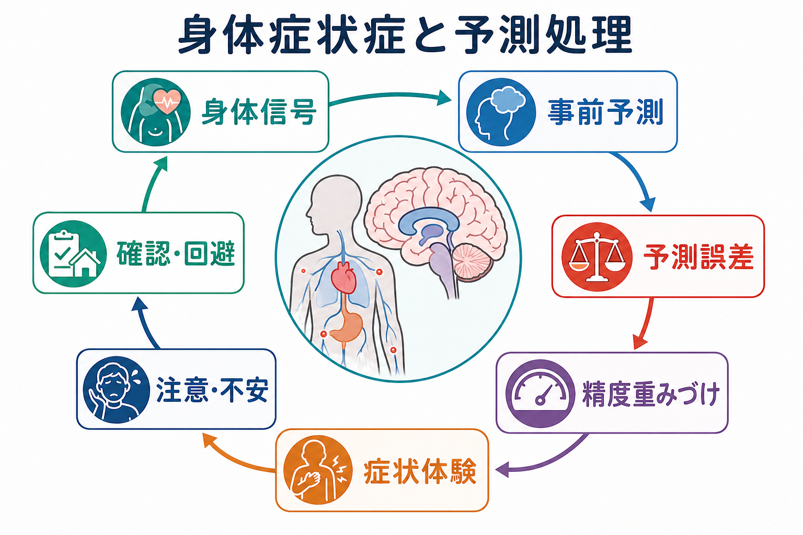
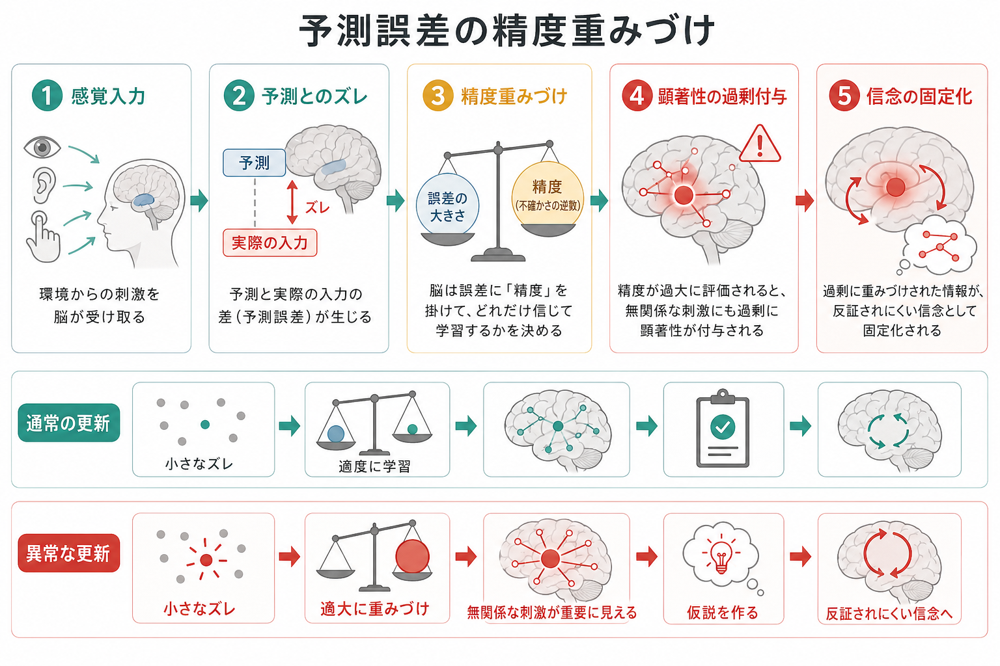
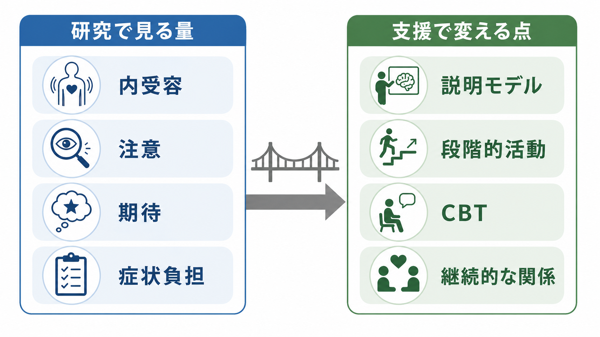

# 身体症状症は脳の予測処理で説明できるのか

## 要点

- 身体症状症は「症状が作りもの」という意味ではなく、つらい身体症状と、それに対する思考・不安・行動が生活を大きく圧迫する状態を指す。
- 予測処理の視点では、症状体験は身体から上がる信号だけでなく、過去経験、文脈、注意、予測、予測誤差の重みづけから生まれる。
- 身体への注意や健康不安は、あいまいな身体信号を「危険な症状」として解釈しやすくし、確認・回避・受診の反復が予測を強めることがある。
- ただし、このモデルは身体症状症のすべてを説明する完成理論ではない。身体疾患の評価、疼痛・疲労・自律神経症状の医学的理解、心理社会的要因を並行して扱う必要がある。

## この記事で答える問い

この記事の問いは、身体症状症を「脳の予測処理のずれ」としてどこまで理解できるのか、である。ここでいう予測処理とは、脳が身体から来る信号を受動的に読むだけでなく、今の身体状態についての仮説を作り、その仮説と感覚入力のずれを更新し続けるという考え方である。関連する基礎としては、[[体性感覚ネットワークは身体情報をどう表現するのか]]、[[皮質視床ループは意識や注意にどう関わるのか]]、[[小脳回路は予測と誤差学習にどう関わるのか]]も参照できる。

## まず結論

身体症状症は、予測処理だけで「説明し尽くせる」わけではない。しかし、身体感覚がどのように症状として立ち上がり、なぜ検査所見の重さと本人の苦痛が単純に対応しないことがあるのかを理解するには有力な枠組みである。

DSM-5以降の身体症状症では、症状が医学的に説明不能かどうかよりも、苦痛を伴う身体症状と、それに関連する過剰な思考・不安・時間やエネルギーの消費が重視される[1]。この変更は、身体症状を「器質性か心因性か」に二分するより、症状体験と生活障害を正面から扱うためのものと考えられる[2]。

## 背景

身体の信号と症状体験は、いつも一対一に対応するわけではない。例えば、心拍、胃腸の動き、筋緊張、疲労感、痛みは日常的に変動しているが、すべてが症状として意識されるわけではない。一方で、同じ程度の生理的変化でも、不安な文脈では強く感じられ、安心できる文脈では背景に退くことがある。

このようなズレは、身体症状症だけでなく、慢性疼痛、機能性身体症状、パニック症状、疲労、プラセボ・ノセボ効果にも関わる。症状知覚の予測処理モデルは、脳を「身体信号の読み取り装置」ではなく、「身体状態について推論する器官」とみなす[3]。この点で、[[神経科学は精神疾患をどのように説明できるのか]]や[[精神疾患は脳の病気なのか]]で扱う、神経科学的説明の限界と可能性にも接続する。

## 基本概念

### 身体症状症

身体症状症では、1つ以上の身体症状が苦痛や生活障害をもたらし、症状や健康への持続的な心配、強い不安、確認や受診などに多くの時間とエネルギーが使われる。重要なのは、身体疾患が「ない」と証明された人だけを指す診断ではない点である。医学的疾患が併存していても、症状への反応が苦痛と機能障害を大きくしている場合には、この枠組みで理解されることがある[1]。

### 内受容

内受容とは、心拍、呼吸、胃腸感覚、痛み、疲労、体温、空腹、筋緊張など、身体内部からの信号を神経系が感知・解釈・統合する過程である[4]。内受容は単なる「正確な感知」ではなく、注意、情動、記憶、文脈と結びつく。島皮質、前帯状皮質、視床、脳幹、自律神経系はこの処理に関わる重要なネットワークとして議論される[4]。

### 予測処理

予測処理では、脳は上位の予測を下位の感覚入力と照合し、予測誤差を減らすように知覚・注意・行動を更新すると考える。予測誤差は、単に大きければよいのではなく、「どれくらい信頼できる誤差として扱うか」という精度重みづけを受ける。身体症状では、身体信号そのもの、症状についての予測、注意の向け方、過去の病気経験、医療者や家族からの情報が組み合わさり、最終的な症状体験が形成される[3][5]。

## 仕組み

身体症状症の予測処理モデルは、次のような循環として理解しやすい。

1. 身体から、心拍、胃腸運動、筋緊張、痛み、疲労などの信号が上がる。
2. 脳は、過去経験や現在の文脈に基づいて「これは危険な症状かもしれない」という予測を作る。
3. 注意が身体に向くと、あいまいな信号の精度が高く見積もられ、身体感覚が意識に上がりやすくなる。
4. 予測と入力のずれは、身体状態についての推論としてまとめられ、「胸が苦しい」「胃が悪い」「体が壊れているかもしれない」という症状体験になる。
5. 確認、回避、検索、受診、安静の反復が短期的な安心をもたらす一方で、「やはり危険だった」という学習を強めることがある。

このモデルで中心になるのは、症状が「上から作られる」か「下から来る」かの二択ではない。身体信号と予測が相互に制約し合う点である。Van den Berghらは、症状体験と客観的生理指標の対応が人・文脈・相互作用によって大きく変わることを踏まえ、予測符号化を身体症状の統一的説明として提案した[3]。Edwardsらも、機能性運動・感覚症状を、事前信念、身体焦点化された注意、感覚情報のバランスから説明する階層ベイズ推論モデルを提示している[5]。

## 図解

上の1枚目は、身体からの信号、予測、予測誤差、精度重みづけ、症状体験、注意・不安・回避を一つのループとして示している。2枚目は、あいまいな身体信号が、事前予測と注意によって症状として知覚され、確認・回避・受診を通じて学習が強化されうる流れを示している。

3枚目は、研究と臨床の接続を整理する図である。研究では内受容課題、症状質問紙、注意・期待の実験操作、脳画像などで仮説を検証する。臨床では、症状を否定するのではなく、説明モデルの共有、段階的活動、認知行動療法、継続的な治療関係を通じて、予測と行動の循環に働きかける。

## 臨床・研究との接続

臨床的には、この見方は「身体の問題ではない」と伝えるためのものではない。むしろ、身体信号、神経系の予測、情動、注意、行動、対人関係、医療システムが同時に症状を形作ることを説明するためのモデルである。持続性身体症状に関する近年のレビューでも、原因の有無で分けるより、数か月以上続く苦痛を伴う身体症状を、生物・心理・社会的に評価し管理することが重視される[6]。

研究面では、内受容の正確さだけを測ればよいわけではない。身体症状症や病気不安症、機能性身体症候群を対象にしたメタ解析では、内受容正確性の結果は不均一で、身体症状症・病気不安症では明確な低下が一貫して示されたわけではない。一方で、反応バイアスには小さいが有意な効果があり、トップダウン要因による「偏った身体知覚」という見方を支持する結果が得られている[7]。

治療との接続では、認知行動療法が身体症状、心理的苦痛、機能障害を軽減しうることがメタ解析で示されている[8]。予測処理の言葉で言えば、CBTは「症状を考えないようにする」方法ではなく、症状予測、注意、破局的解釈、確認・回避行動、活動量の調整を扱い、予測を更新できる経験を増やす介入として理解できる。CBT、ACT、5Pモデルは、今後の関連ノート作成候補として臨床的な見立てと介入計画に接続できる。

## よくある誤解

### 誤解1: 予測処理で説明するなら、症状は気のせいである

これは誤りである。予測処理は、症状体験が脳内で推論されるという意味であって、症状が偽物だという意味ではない。痛みや息苦しさや疲労は、本人にとって実在する体験である。むしろ予測処理は、実在する苦痛がどのような条件で強まり、持続し、生活を狭めるのかを説明する。

### 誤解2: 検査で異常がなければ身体症状症である

これも誤りである。身体症状症の診断は、検査で説明できないことだけで決まらない。苦痛を伴う身体症状と、それに関連する思考・感情・行動の持続的な負担を評価する必要がある[1][2]。また、医学的疾患の見落としを避ける評価は常に重要である。

### 誤解3: 予測を変えればすぐ治る

予測は、説明を聞いただけで直ちに変わるとは限らない。予測は、身体感覚、情動、睡眠、痛み、家族や職場の反応、医療経験、回避行動の結果を通じて学習される。したがって、理解、安心、活動調整、身体への注意の扱い方、継続的な治療関係を組み合わせる必要がある。

## 関連ノート

- [[体性感覚ネットワークは身体情報をどう表現するのか]]
- [[皮質視床ループは意識や注意にどう関わるのか]]
- [[小脳回路は予測と誤差学習にどう関わるのか]]
- [[ノルアドレナリン系は不安と覚醒にどう関わるのか]]
- [[扁桃体過活動は不安症やPTSDにどう関わるのか]]
- [[摂食障害は脳の報酬系や身体感覚とどう関わるのか]]
- [[神経科学は精神疾患をどのように説明できるのか]]
- [[精神疾患は脳の病気なのか]]

今後の作成候補: `CBTとは何か`, `ACTとは何か`, `5Pモデルとは何か`

MOC更新候補: `content/00_MOC/` 配下の神経科学・精神疾患・臨床実践系MOC。並列ジョブとの衝突を避けるため、本タスクでは更新しない。

## 理解チェック

1. 身体症状症の診断で、DSM-5以降に重視される心理行動面は何か。
2. 予測処理モデルでは、身体信号と症状体験が一対一に対応しない理由をどう説明するか。
3. 「精度重みづけ」が高まると、身体感覚の知覚にはどのような変化が起こりうるか。
4. 確認・回避・受診が短期的には安心をもたらしつつ、長期的には症状予測を強めうる理由は何か。
5. 予測処理モデルを臨床で使うとき、なぜ「症状は気のせい」と伝えてはいけないのか。

## 参考文献

[1] American Psychiatric Association. (2013). *Diagnostic and Statistical Manual of Mental Disorders, Fifth Edition (DSM-5)*. American Psychiatric Publishing. 診断概念の要約として: https://www.ncbi.nlm.nih.gov/books/NBK532253/

[2] Rief, W., & Martin, A. (2022). Somatic symptom disorder: a scoping review on the empirical evidence of a new diagnosis. *Psychological Medicine*, 52(4), 632-648. https://doi.org/10.1017/S0033291721004177

[3] Van den Bergh, O., Witthöft, M., Petersen, S., & Brown, R. J. (2017). Symptoms and the body: Taking the inferential leap. *Neuroscience & Biobehavioral Reviews*, 74(Pt A), 185-203. https://doi.org/10.1016/j.neubiorev.2017.01.015

[4] Khalsa, S. S., Adolphs, R., Cameron, O. G., Critchley, H. D., Davenport, P. W., Feinstein, J. S., et al. (2018). Interoception and Mental Health: A Roadmap. *Biological Psychiatry: Cognitive Neuroscience and Neuroimaging*, 3(6), 501-513. https://doi.org/10.1016/j.bpsc.2017.12.004

[5] Edwards, M. J., Adams, R. A., Brown, H., Pareés, I., & Friston, K. J. (2012). A Bayesian account of 'hysteria'. *Brain*, 135(11), 3495-3512. https://doi.org/10.1093/brain/aws129

[6] Löwe, B., Toussaint, A., Rosmalen, J. G. M., Huang, W.-L., Burton, C., Weigel, A., Levenson, J. L., & Henningsen, P. (2024). Persistent physical symptoms: definition, genesis, and management. *The Lancet*, 403(10444), 2649-2662. https://doi.org/10.1016/S0140-6736(24)00623-8

[7] Wolters, C., Gerlach, A. L., & Pohl, A. (2022). Interoceptive accuracy and bias in somatic symptom disorder, illness anxiety disorder, and functional syndromes: A systematic review and meta-analysis. *PLOS ONE*, 17(8), e0271717. https://doi.org/10.1371/journal.pone.0271717

[8] Liu, J., Gill, N. S., Teodorczuk, A., Li, Z.-J., & Sun, J. (2019). The efficacy of cognitive behavioural therapy in somatoform disorders and medically unexplained physical symptoms: A meta-analysis of randomized controlled trials. *Journal of Affective Disorders*, 245, 98-112. https://doi.org/10.1016/j.jad.2018.10.114

## 未解決問題

- 身体症状症のどのサブタイプで、どの内受容指標や脳指標がもっとも安定して変化するのかは、まだ十分に確立していない。
- 予測処理モデルは理論的に魅力的だが、臨床現場で個別症例の治療選択を直接決めるバイオマーカーにはなっていない。
- 身体疾患、慢性疼痛、機能性身体症候群、病気不安、うつ・不安症状との重なりを、診断横断的にどう扱うかが今後の課題である。
