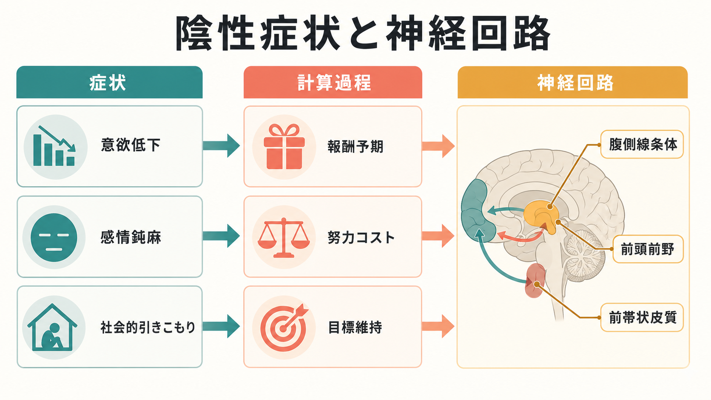
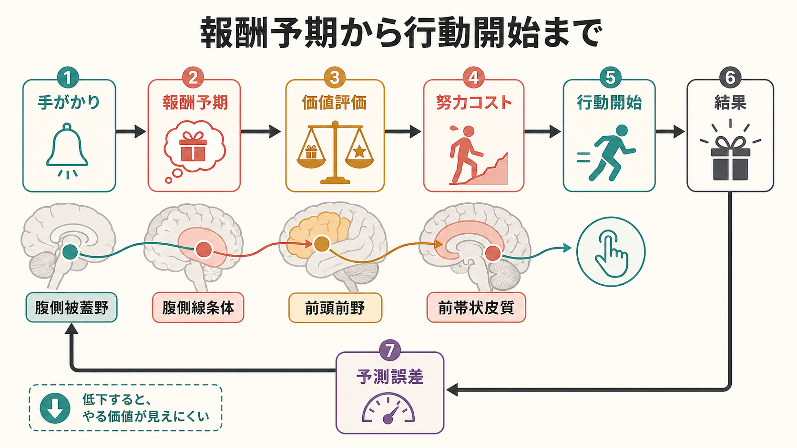
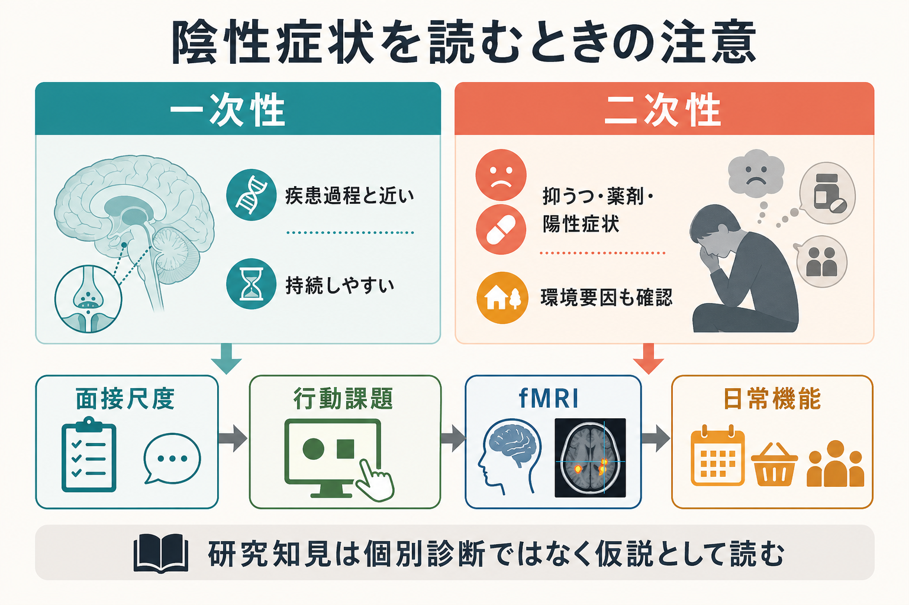

# 陰性症状は報酬系や認知制御の障害と関係するのか

## 要点

- 陰性症状は、意欲低下、快感消失、社会的引きこもり、感情鈍麻、会話量の低下などからなる症状群であり、現代的には「動機づけ・快感」と「表出低下」の2次元、または5領域として整理される[1][2]。
- 報酬系との関係は、単に「楽しいと感じない」という話ではない。とくに問題になりやすいのは、未来の報酬を予期し、努力コストと比べ、行動を始め、結果から学習する一連の過程である[2][3]。
- 統合失調症では、報酬予期時の腹側線条体活動低下が比較的一貫して報告され、陰性症状、とくにアパシーや意欲低下と関連する[3][4]。
- 認知制御も独立ではない。前頭前野が目標や文脈を保持できなければ、報酬価値を行動計画に変換しにくくなる。逆に動機づけが弱いと、認知課題へ努力を配分しにくくなる[5][6]。
- ただし、陰性症状を「報酬系の故障」だけで説明するのは単純化しすぎである。抑うつ、陽性症状、薬剤性パーキンソニズム、鎮静、社会的孤立などによる二次性陰性症状を区別する必要がある[7]。

## この記事で答える問い

この記事では、[[ドパミン仮説は統合失調症をどこまで説明できるのか]]、[[報酬系の異常はうつ病をどう説明するのか]]、[[前頭前野は情動制御にどう関わるのか]]を背景に、次の問いに答える。

1. 陰性症状とは何を指すのか。
2. 報酬系の障害は、意欲低下や社会的引きこもりをどう説明するのか。
3. 認知制御の障害は、報酬系の説明に何を加えるのか。
4. 臨床・研究でこの説明を使うとき、どこに注意すべきか。

## まず結論

陰性症状は、報酬系や認知制御の障害と関係する。とくに「報酬を得た瞬間の快感」よりも、「これをすれば価値ある結果が得られそうだ」と予期すること、「そのために努力する価値がある」と見積もること、「目標を保って行動を始めること」の障害として理解すると整理しやすい[2][6]。

ただし、これは一対一の因果説明ではない。腹側線条体、前頭前野、前帯状皮質、島皮質、海馬系、ドパミン・グルタミン酸系などが関わる広い回路の問題であり、抑うつや薬剤副作用のような二次性要因も重なる[6][7]。したがって、陰性症状は「やる気がない」という性格評価ではなく、価値・努力・目標維持・学習・社会環境が絡む神経認知的な問題として読むのがよい。

## 背景

陰性症状は統合失調症で重要視されてきたが、陽性症状より目立ちにくく、治療反応性や日常機能との関係が難しい。近年の尺度研究では、陰性症状は大きく2つに分けられることが多い。第一は「動機づけ・快感」次元で、意欲低下、快感消失、社会性低下を含む。第二は「表出低下」次元で、感情表出の低下や会話量の低下を含む[1][2]。

この区別が重要なのは、神経回路との結びつきが同じではないからである。報酬予期、努力コスト、価値学習、探索行動の変化は、主に動機づけ・快感次元を説明しやすい。一方、感情鈍麻や会話量低下は、社会認知、運動表出、言語、覚醒水準、薬剤副作用なども関わるため、報酬系だけで説明するのは不十分である[1][7]。

## 基本概念

### 陰性症状

陰性症状とは、通常期待される行動・意欲・情動表出が減る方向の症状である。代表的には、意欲低下、快感消失、社会的引きこもり、感情鈍麻、会話量の低下が挙げられる[1]。ただし、同じ「外に出ない」でも、迫害妄想による回避、抑うつによる気力低下、薬剤による鎮静、貧困や孤立による機会減少では意味が違う。

### 報酬系

報酬系は、腹側被蓋野から腹側線条体、前頭前野、前帯状皮質、島皮質などへ広がる回路として理解される。ここでいう報酬は、快感そのものだけではなく、報酬を予期すること、報酬を得るために努力すること、結果から学習することを含む。統合失調症の陰性症状では、とくに報酬予期と努力配分の障害が注目されている[2][3]。

### 認知制御

認知制御とは、目標、ルール、文脈、課題要求を保ち、注意や行動を調整する働きである。[[前頭前野は情動制御にどう関わるのか]]で扱う前頭前野は、情動制御だけでなく、報酬を「いま何をすべきか」という行動計画へ変換するうえでも重要である[5][6]。

## 仕組み

### 1. 報酬予期が弱いと、未来の価値が立ち上がりにくい

報酬予期とは、まだ報酬が得られていない段階で「これをすれば良い結果がありそうだ」と見積もる過程である。統合失調症を対象にした報酬処理のメタ解析では、報酬予期時に腹側線条体活動が低下することが示され、その低下は陰性症状の強さと関連した[3]。2024年の多施設研究でも、報酬予期時の線条体反応は統合失調症群で低く、陰性症状、特にアパシーとの関連が検討されている[4]。

これは「報酬を受け取っても何も感じない」という意味だけではない。多くの研究は、目の前の快い刺激への反応は比較的保たれる一方、未来の快さを予期し、行動に移す過程が弱い可能性を示している[2]。そのため、本人の内的経験と外から見える行動の低下は一致しないことがある。

### 2. 努力コストが高く見積もられると、行動開始が止まりやすい

行動を始めるには、報酬の大きさだけでなく、必要な努力、失敗可能性、時間、疲労、社会的負荷を見積もる必要がある。陰性症状では、報酬価値が低く見積もられるだけでなく、努力コストが相対的に高く見積もられる可能性がある[2][6]。

この観点から見ると、意欲低下は「欲しいものがない」だけではなく、「欲しいものがあっても、そこへ向かう行動系列を開始する価値が十分に立ち上がらない」状態として理解できる。前帯状皮質や前頭前野は、この価値と努力の比較に関わる候補回路である。

### 3. 認知制御が弱いと、価値を行動計画に変換しにくい

報酬があると分かっていても、目標を保持し、手順を組み、途中で注意を戻し、結果を評価する必要がある。統合失調症では、文脈処理や認知制御の障害が古くから指摘されており、報酬文脈で背外側前頭前野や線条体の活動が意欲低下と関連する研究もある[5]。

したがって、報酬系と認知制御は別々の故障箇所ではない。認知制御が弱いと、将来の価値を作業記憶内に保ちにくくなる。動機づけが弱いと、認知的努力を投入しにくくなる。Robisonらは、統合失調症では認知回路と報酬回路の相互作用が損なわれると考える方が、片方だけを見るより適切だと論じている[6]。

### 4. 表出低下は、報酬系だけでは説明しにくい

感情鈍麻や会話量の低下は、動機づけの問題と重なることもあるが、表情・発話・身体運動・社会的文脈の問題としても理解する必要がある。たとえば、本人の内的情動経験は残っているのに、表情や声の抑揚として外に出にくい場合がある。ここでは報酬予期だけでなく、社会認知、運動表出、認知負荷、薬剤副作用も検討する必要がある[1][7]。

## 図解

図1は、陰性症状を「症状」「計算過程」「神経回路」の3層で対応づけた概念地図である。意欲低下、感情鈍麻、社会的引きこもりは、それぞれ報酬予期、努力コスト、目標維持などの過程と重なるが、一対一対応ではない。

図2は、報酬予期から行動開始までの流れを示している。手がかりから報酬を予期し、価値評価と努力コストの比較を経て行動が始まる。結果は予測誤差として次の学習に戻る。この循環が弱いと、「やる価値が見えにくい」状態になる。

図3は、陰性症状を読むときの臨床・研究上の注意である。一次性陰性症状と二次性陰性症状を区別し、面接尺度、行動課題、fMRI、日常機能を組み合わせて解釈する必要がある。

## 臨床・研究との接続

臨床的には、陰性症状を見たときに、まず一次性か二次性かを考える必要がある。一次性陰性症状は疾患過程に近く、持続しやすい。一方、二次性陰性症状は、陽性症状による回避、抑うつ、抗精神病薬による錐体外路症状や鎮静、物質使用、社会的孤立、環境刺激の乏しさなどから生じうる[7]。これは個別診断や治療指示ではなく、教育・研究上の整理である。

研究では、BNSSやCAINSのような陰性症状尺度、努力報酬課題、報酬予期課題、fMRI、日常行動指標を組み合わせると、陰性症状のどの過程を見ているのかが明確になりやすい[1][4]。ただし、fMRIの群平均差を個人診断に直接使うことはできない。報酬系の低活動は有力な研究指標だが、年齢、薬剤、課題設計、併存症、動機づけの種類、解析方法に左右される。

この観点は、[[神経科学は精神疾患をどのように説明できるのか]]や[[精神疾患は脳の病気なのか]]ともつながる。神経回路の説明は、本人の責任に還元するためではなく、症状をより細かい過程に分け、研究可能な仮説へ変換するために使う。

## よくある誤解

### 誤解1: 陰性症状は「怠け」や「性格」の問題である

陰性症状は、行動開始、報酬予期、努力評価、認知制御、表出、社会環境が絡む症状群である。本人の意志の弱さだけで説明すると、神経認知的な問題や二次性要因を見落とす。

### 誤解2: 報酬系が悪いなら、楽しい刺激を増やせばよい

問題は快感の瞬間だけではない。未来の価値を予期し、努力を払って行動し、結果から学ぶ過程が重要である[2]。刺激を増やすだけでは、行動系列を支える目標維持や環境設計の問題は残ることがある。

### 誤解3: 陰性症状はドパミンだけで説明できる

ドパミンは報酬予期や線条体機能に深く関わるが、陰性症状はドパミン単独の問題ではない。前頭前野、前帯状皮質、グルタミン酸、GABA、社会認知、薬剤副作用、環境要因も関わる。[[グルタミン酸仮説は統合失調症をどう説明するのか]]や[[GABA機能低下は統合失調症にどう関わるのか]]も合わせて読むと、単一物質モデルの限界が見えやすい。

### 誤解4: 脳画像で陰性症状の有無を判定できる

現在のところ、報酬予期時の腹側線条体反応などは研究上有用な指標だが、個人の診断を単独で決めるものではない[4]。面接、経過、生活機能、二次性要因、課題成績を統合して解釈する必要がある。

## 関連ノート

既存ノート:

- [[ドパミン仮説は統合失調症をどこまで説明できるのか]]
- [[報酬系の異常はうつ病をどう説明するのか]]
- [[前頭前野は情動制御にどう関わるのか]]
- [[グルタミン酸仮説は統合失調症をどう説明するのか]]
- [[GABA機能低下は統合失調症にどう関わるのか]]
- [[神経科学は精神疾患をどのように説明できるのか]]
- [[精神疾患は脳の病気なのか]]

今後の作成候補:

- 陰性症状尺度BNSSとCAINSとは何か
- 努力報酬課題は意欲低下をどう測るのか
- 腹側線条体は報酬予期にどう関わるのか
- 前帯状皮質は努力コストをどう計算するのか
- 一次性陰性症状と二次性陰性症状の違い

MOC更新候補:

- `content/00_MOC/` 配下の神経科学・精神疾患関連MOCへ、本記事へのリンクを追加する候補とする。並列ジョブとの衝突を避けるため、今回はMOC本体は更新しない。

## 理解チェック

1. 陰性症状の5領域を挙げると何か。
2. 「報酬を得た瞬間の快感」と「報酬予期」はどう違うか。
3. 腹側線条体の報酬予期反応低下は、陰性症状のどの側面と関係しやすいか。
4. 認知制御の障害は、なぜ意欲低下の説明に加える必要があるか。
5. 一次性陰性症状と二次性陰性症状を区別する理由は何か。

## 参考文献

[1] Strauss, G. P., Bartolomeo, L. A., & Harvey, P. D. (2021). Avolition as the core negative symptom in schizophrenia: relevance to pharmacological treatment development. *npj Schizophrenia, 7*, 16. https://doi.org/10.1038/s41537-021-00145-4

[2] Kring, A. M., & Barch, D. M. (2014). The motivation and pleasure dimension of negative symptoms: Neural substrates and behavioral outputs. *European Neuropsychopharmacology, 24*(5), 725-736. https://doi.org/10.1016/j.euroneuro.2013.06.007

[3] Radua, J., Schmidt, A., Borgwardt, S., Heinz, A., Schlagenhauf, F., McGuire, P., & Fusar-Poli, P. (2015). Ventral striatal activation during reward processing in psychosis: A neurofunctional meta-analysis. *JAMA Psychiatry, 72*(12), 1243-1251. https://doi.org/10.1001/jamapsychiatry.2015.2196

[4] Carruzzo, F., Kaliuzhna, M., Kuenzi, N., Geffen, T., Katthagen, T., Schlagenhauf, F., & Kaiser, S. (2024). Striatal response to reward anticipation as a biomarker for schizophrenia and negative symptoms: Effects, test-retest reliability, and stability across sites. *Schizophrenia Bulletin, 50*(4), 733-746. https://doi.org/10.1093/schbul/sbae046

[5] Chung, Y. S., & Barch, D. M. (2016). Frontal-striatum dysfunction during reward processing: Relationships to amotivation in schizophrenia. *Journal of Abnormal Psychology, 125*(3), 453-469. https://doi.org/10.1037/abn0000137

[6] Robison, A. J., Thakkar, K. N., & Diwadkar, V. A. (2020). Cognition and reward circuits in schizophrenia: Synergistic, not separate. *Biological Psychiatry, 87*(3), 204-214. https://doi.org/10.1016/j.biopsych.2019.09.021

[7] Mosolov, S. N., & Yaltonskaya, P. A. (2022). Primary and secondary negative symptoms in schizophrenia. *Frontiers in Psychiatry, 12*, 766692. https://doi.org/10.3389/fpsyt.2021.766692

[8] Correll, C. U., & Schooler, N. R. (2020). Negative symptoms in schizophrenia: A review and clinical guide for recognition, assessment, and treatment. *Neuropsychiatric Disease and Treatment, 16*, 519-534. https://doi.org/10.2147/NDT.S225643

## 未解決問題

- 報酬予期、努力コスト、認知制御のどれが陰性症状の中核に近いのかは、個人差と症状次元ごとに検討する必要がある。
- 腹側線条体反応を、治療反応性や日常機能の予測にどこまで使えるかはまだ限定的である。
- 感情鈍麻や会話量低下を、報酬系、社会認知、運動表出、薬剤副作用のどの組み合わせで説明するかは未解決である。
- 二次性陰性症状を十分に除外した縦断研究と、日常生活のデジタル指標を組み合わせた研究が必要である。
