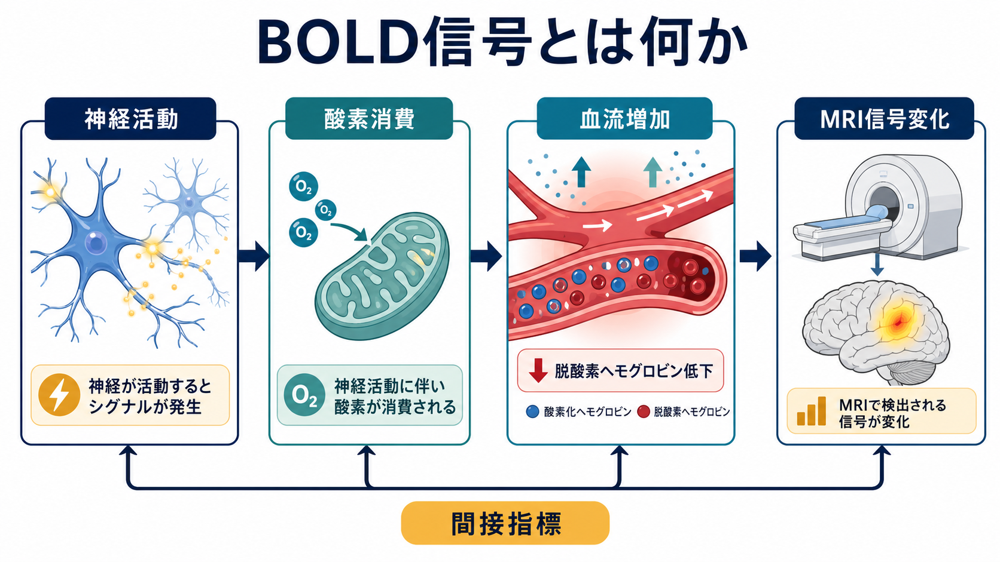
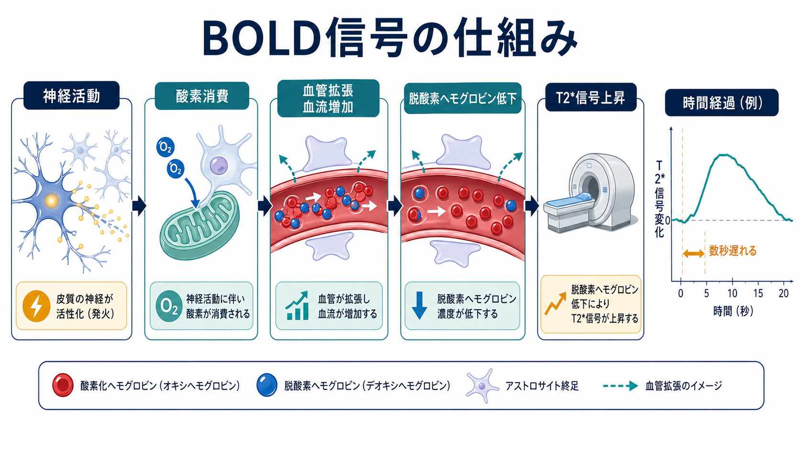
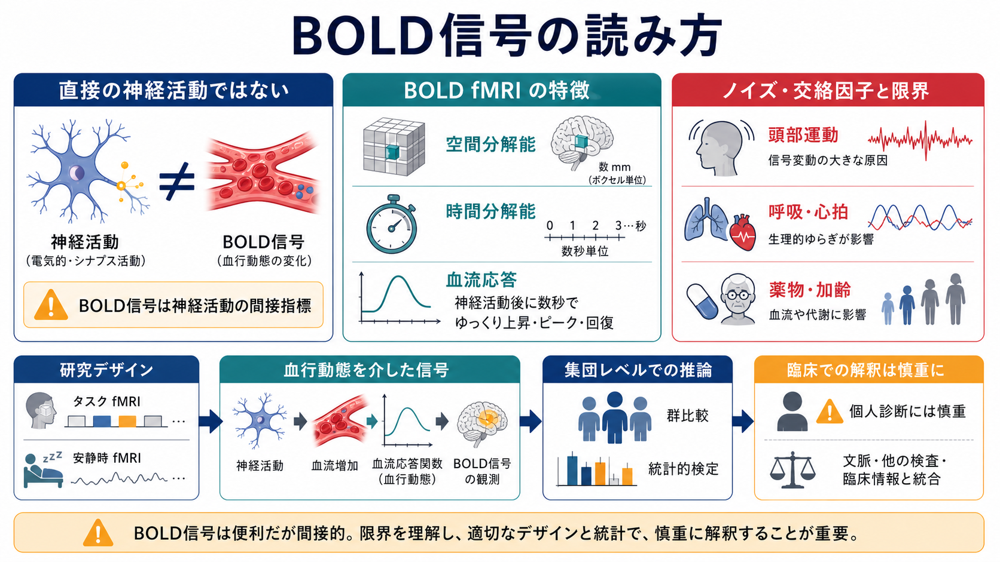

# BOLD信号とは何か

## 要点

- BOLD信号は *blood oxygenation level dependent signal*、すなわち血液酸素化レベルに依存するMRI信号変化である。
- 神経活動そのものを直接測るのではなく、神経活動に伴う酸素消費、血流増加、脱酸素ヘモグロビン濃度変化を介して推定する。
- 脳活動が増えると酸素消費も増えるが、多くの条件では局所血流の増加がそれを上回り、脱酸素ヘモグロビンが相対的に減るため、T2*感受性のMRI信号が上がりやすい[1][5][6]。
- BOLD-fMRIは空間的な脳活動地図を作る強力な方法だが、時間分解能、血管要因、呼吸・心拍、頭部運動、薬物、加齢などの影響を受ける[4][7][8]。

## この記事で答える問い

1. BOLD信号は、MRIの中で何を反映しているのか。
2. なぜ神経活動が血流や酸素化の変化として見えるのか。
3. BOLD-fMRIを読むとき、何を言えて、何を言いすぎてはいけないのか。

## まず結論

BOLD信号は、[[活動電位はどのように発生するのか|活動電位]]や[[シナプスとは何か|シナプス活動]]を直接読む信号ではない。より正確には、神経活動に伴う局所の代謝需要と神経血管応答が、酸素化ヘモグロビンと脱酸素ヘモグロビンの比率を変え、その磁気的性質の違いがMRI信号に反映されたものである[1][4][6]。

それでもBOLD信号が有用なのは、神経活動と血行動態応答が多くの実験条件で系統的に結びつくからである。特にヒトでは、侵襲的な神経記録が難しい場面でも、課題中・安静時の脳領域活動や[[構造的結合と機能的結合は何が違うのか|機能的結合]]を全脳規模で調べられる。

## 背景

BOLDコントラストの出発点は、脱酸素ヘモグロビンが常磁性を持ち、局所磁場を乱す内因性造影剤のように働くという発見である。Ogawaらは1990年、血液酸素化に依存したMRIコントラストが脳内血液酸素化の地図を与えうることを示した[1]。その後、Kwongらはヒトの感覚刺激中に動的MRI信号変化を測定し、BOLD-fMRIがヒト脳機能マッピングに使えることを示した[2]。

この発展によって、脳機能研究は大きく変わった。従来の[[T1強調画像とT2強調画像は何が違うのか|構造MRI]]が脳の形や病変コントラストを主に扱うのに対し、BOLD-fMRIは課題、安静、刺激、行動、症状、学習、薬理作用などに伴う信号変化を測定できる。ただし、BOLDはあくまで血行動態を介した信号であり、神経活動の「発火数メーター」ではない。

## 基本概念

### BOLDとは何か

BOLDは、血液中の酸素化状態に依存するMRI信号変化である。ポイントは、酸素化ヘモグロビンと脱酸素ヘモグロビンが磁場に与える影響の違いにある。脱酸素ヘモグロビンが増えると局所磁場の不均一性が増し、特にT2*強調の信号は低下しやすくなる。逆に、脱酸素ヘモグロビンが相対的に減ると、局所磁場の乱れが弱まり、信号が上がりやすくなる[1][6]。

### fMRIとの関係

fMRIは functional MRI の略で、機能的な変化をMRIで測る総称である。現在の認知神経科学で「fMRI」と言う場合、多くはBOLD-fMRIを指す。課題fMRIでは、刺激や行動条件に合わせてBOLD時系列をモデル化し、条件間の差を調べる。安静時fMRIでは、明示的な課題を課さず、BOLD信号の低周波ゆらぎの相関から[[脳内ネットワークとは何か|脳内ネットワーク]]や機能的結合を推定する。

## 仕組み

BOLD信号の典型的な流れは、次のように整理できる。

1. 局所のニューロン集団でシナプス入力や発火が増える。
2. イオン勾配の回復、神経伝達物質処理、代謝支援のため、酸素とグルコースの需要が増える。
3. ニューロン、[[アストロサイトはシナプスと代謝をどう支えているのか|アストロサイト]]、血管細胞を含む神経血管単位が血管径や血流を調整する。
4. 局所脳血流が増え、しばしば酸素消費の増加を上回る。
5. 脱酸素ヘモグロビンが相対的に低下し、T2*信号が上昇する[5][6]。

重要なのは、血流増加が「酸素が足りないから単に補充される」というだけではない点である。BuxtonとFrankのモデルは、小さな酸素代謝増加を支えるにも大きな血流変化が必要になりうることを示し、BOLD解釈を酸素抽出率、血流、血液量、代謝の関係として整理した[5]。

### 神経活動との対応

BOLD信号は神経活動に関係するが、どの神経活動成分にどれだけ対応するかは単純ではない。Logothetisらのサル視覚皮質研究では、BOLD応答は単一ニューロンのスパイクだけでなく、局所場電位、つまりシナプス入力や局所処理を強く反映する可能性が示された[3]。そのため、BOLDの上昇を「その領域の出力発火が増えた」とだけ読むのは危うい。

この点は、[[興奮性ニューロンと抑制性ニューロンは回路内でどう協調するのか|興奮性・抑制性の協調]]を考えると分かりやすい。抑制性入力が増えても代謝需要や局所場電位は変わりうるため、BOLD上昇が常に興奮性出力の増加を意味するとは限らない。

## 図解

上の図1は、BOLD信号を「神経活動からMRI信号へ至る間接指標」としてまとめたもの。図2は、酸素消費、血管拡張、血流増加、脱酸素ヘモグロビン低下、T2*信号上昇という主要メカニズムを示している。

下の図3は、BOLD信号を研究や臨床文脈で読むときの注意点を整理している。BOLD-fMRIは群比較、課題差、安静時ネットワーク、薬理・発達・疾患研究に有用だが、単独で個人診断を確定する検査ではない。

## 臨床・研究との接続

### 研究での使い方

課題fMRIでは、刺激提示や反応タイミングを血行動態応答関数に畳み込み、各ボクセルのBOLD時系列にどの程度合うかを調べる。一般線形モデルはその代表的な枠組みであり、条件Aと条件Bの差、刺激強度、行動成績、症状尺度などとの関連を検討できる。

安静時fMRIでは、BOLD信号の自発的な低周波変動を使い、領域間の相関やネットワーク構造を推定する。このとき得られる機能的結合は、直接の解剖学的接続や因果方向を意味しない。[[コネクトームとは何か|コネクトーム]]研究では、BOLD機能結合、拡散MRIによる構造的結合、行動指標、計算モデルを組み合わせて解釈する必要がある。

### 臨床での位置づけ

臨床では、脳外科術前計画の言語・運動機能マッピング、てんかん焦点評価の補助、神経疾患・精神疾患研究などでfMRIが使われることがある。ただし、BOLDは血管反応性、病変、薬物、加齢、覚醒度、呼吸、頭部運動の影響を受ける。[[FLAIR画像はどのような病変検出に役立つのか|FLAIR]]や拡散MRI、構造MRI、脳波、神経心理検査、臨床情報と統合して読むべきである。

このノートの内容は教育・研究目的であり、個別の診断や治療方針を示すものではない。

## よくある誤解

### 誤解1: BOLD信号は神経発火を直接測っている

BOLD信号は血流・血液量・酸素代謝を介した信号である。スパイク活動、シナプス活動、局所場電位、抑制性活動、血管反応が混ざるため、神経発火の直接測定とは言えない[3][4]。

### 誤解2: BOLDが上がった領域は必ず興奮している

BOLD上昇は局所処理や代謝需要の増加を示唆するが、興奮性出力の増加と同義ではない。抑制性入力、予測誤差、注意、課題難度、血管反応性の違いでも変化しうる。

### 誤解3: fMRI画像は個人の心を読める

fMRIは統計的推論の道具であり、個人の思考内容をそのまま読む装置ではない。特に臨床応用では、群レベルの研究知見と個人診断を混同してはいけない[8]。

### 誤解4: BOLD信号はどの脳部位でも同じ遅れ方をする

血行動態応答は個人差や部位差を持つ。Handwerkerらは、HRFのばらつきがfMRI統計解析に影響しうることを示しており、標準的な応答関数だけに過度に依存すると見逃しや誤推定が起こりうる[7]。

## 関連ノート

- [[T1強調画像とT2強調画像は何が違うのか]]
- [[FLAIR画像はどのような病変検出に役立つのか]]
- [[構造的結合と機能的結合は何が違うのか]]
- [[脳内ネットワークとは何か]]
- [[コネクトームとは何か]]
- [[活動電位はどのように発生するのか]]
- [[シナプスとは何か]]
- [[アストロサイトはシナプスと代謝をどう支えているのか]]
- [[血液脳関門はなぜ必要なのか]]

MOC更新候補: `content/00_MOC/MOC｜脳・神経科学.md` の「脳画像・神経計測」配下に本記事を追加する。

今後の作成候補: 「神経血管カップリングとは何か」「血行動態応答関数HRFとは何か」「課題fMRIと安静時fMRIは何が違うのか」「fMRI前処理とは何か」。

## 理解チェック

1. BOLD信号が「神経活動の直接指標」ではなく「間接指標」と呼ばれる理由を説明できるか。
2. 神経活動が増えたとき、なぜ脱酸素ヘモグロビンが相対的に低下しうるのか。
3. BOLD-fMRIの時間分解能が神経活動そのものより遅い理由を説明できるか。
4. 安静時fMRIの機能的結合を、解剖学的接続や因果関係と同一視してはいけない理由を説明できるか。
5. 臨床でBOLD-fMRIを単独の個人診断指標として使いにくい理由を3つ挙げられるか。

## 参考文献

[1] Ogawa, S., Lee, T. M., Kay, A. R., & Tank, D. W. (1990). Brain magnetic resonance imaging with contrast dependent on blood oxygenation. *Proceedings of the National Academy of Sciences of the United States of America, 87*(24), 9868-9872. https://doi.org/10.1073/pnas.87.24.9868

[2] Kwong, K. K., Belliveau, J. W., Chesler, D. A., et al. (1992). Dynamic magnetic resonance imaging of human brain activity during primary sensory stimulation. *Proceedings of the National Academy of Sciences of the United States of America, 89*(12), 5675-5679. https://doi.org/10.1073/pnas.89.12.5675

[3] Logothetis, N. K., Pauls, J., Augath, M., Trinath, T., & Oeltermann, A. (2001). Neurophysiological investigation of the basis of the fMRI signal. *Nature, 412*, 150-157. https://doi.org/10.1038/35084005

[4] Logothetis, N. K., & Wandell, B. A. (2004). Interpreting the BOLD signal. *Annual Review of Physiology, 66*, 735-769. https://doi.org/10.1146/annurev.physiol.66.082602.092845

[5] Buxton, R. B., & Frank, L. R. (1997). A model for the coupling between cerebral blood flow and oxygen metabolism during neural stimulation. *Journal of Cerebral Blood Flow & Metabolism, 17*(1), 64-72. https://doi.org/10.1097/00004647-199701000-00009

[6] Kim, S.-G., & Ogawa, S. (2012). Biophysical and physiological origins of blood oxygenation level-dependent fMRI signals. *Journal of Cerebral Blood Flow & Metabolism, 32*, 1188-1206. https://doi.org/10.1038/jcbfm.2012.23

[7] Handwerker, D. A., Ollinger, J. M., & D'Esposito, M. (2004). Variation of BOLD hemodynamic responses across subjects and brain regions and their effects on statistical analyses. *NeuroImage, 21*(4), 1639-1651. https://doi.org/10.1016/j.neuroimage.2003.11.029

[8] Logothetis, N. K. (2008). What we can do and what we cannot do with fMRI. *Nature, 453*, 869-878. https://doi.org/10.1038/nature06976
