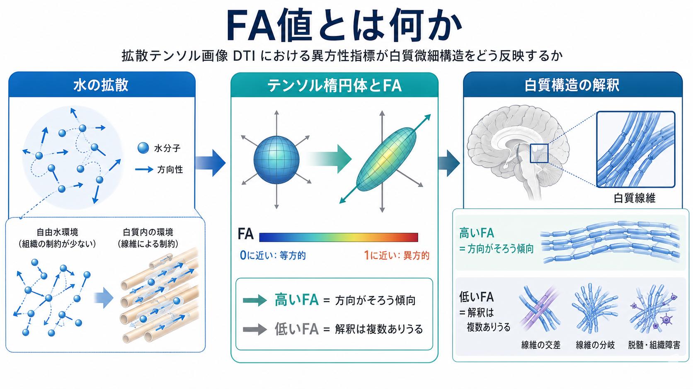
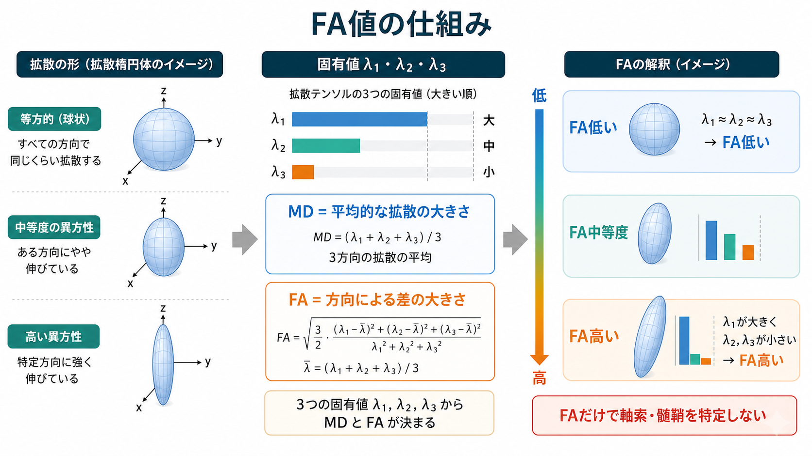
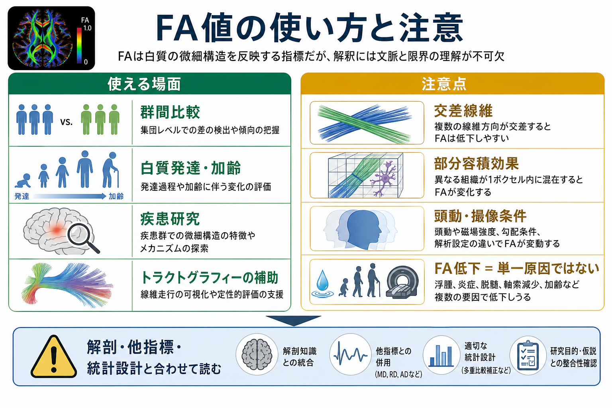

# FA値とは何か

## 要点

- FA値（fractional anisotropy）は、拡散テンソル画像（DTI）で推定した水分子拡散の「方向による偏り」を 0 から 1 に近い値で表す指標である[1][2]。
- 白質では、軸索束、髄鞘、細胞膜、線維のそろい方などが水分子の動きを方向づけるため、FAは白質微細構造の感度の高い指標として使われる[3][4]。
- ただし、FAは「軸索密度」「髄鞘量」「白質の健康度」を単独で直接測る値ではない。交差線維、浮腫、炎症、萎縮、部分容積効果、撮像条件でも変化する[4][6][7]。
- 解釈では、FAだけでなくMD、AD、RD、解剖学的位置、トラクトグラフィー、統計設計、臨床・行動指標を合わせて読む必要がある[4][5][8]。

## この記事で答える問い

この記事では、[[軸索はどのように情報を遠くへ伝えるのか]]や[[髄鞘はなぜ神経伝導を速くするのか]]で扱う白質構造を、拡散MRIでどのように間接的に読むのかを整理する。中心となる問いは次の三つである。

1. FA値は、DTIの中で何を数値化しているのか。
2. なぜFA値は白質の微細構造と関係するのか。
3. FA値の高低を、研究・臨床文脈でどう解釈すべきか。

## まず結論

FA値は、「水分子がどれくらい一方向に動きやすいか」を表す指標である。自由水のようにどの方向にも同じくらい拡散する環境ではFAは低くなり、線維束のように特定方向へ動きやすく、横方向には動きにくい環境ではFAが高くなりやすい[1][2]。

白質では、軸索膜、髄鞘、細胞外空間、線維束の配列が水分子の拡散を制限する。そのため、FAは白質の「方向性のそろい方」や「微細構造の変化」に敏感である[3][4]。しかし敏感であることと特異的であることは別である。FA低下を見ても、それだけで脱髄、軸索減少、炎症、浮腫、線維交差、加齢変化のどれかを一意に決めることはできない[4][6][7]。

したがって、FA値は白質を読むための有用な入口だが、単独の診断ラベルではない。解剖学的知識、他の拡散指標、解析方法、群間比較の設計、個人差を含めて解釈する必要がある。

## 背景

拡散MRIは、水分子のランダムな動きが組織構造によってどのように制限されるかを利用するMRI手法である。DTIでは、各ボクセル内の拡散を3次元の楕円体、つまりテンソルとして近似する。このテンソルから、平均的な拡散の大きさ、拡散の主方向、方向による偏りを計算できる[1][3]。

脳の白質は、離れた脳領域を結ぶ長距離線維を多く含む。これは[[脳内ネットワークとは何か]]や[[コネクトームとは何か]]で扱う構造的結合の基盤である。DTIとFA値は、この構造的結合を非侵襲的に調べるための代表的な方法として、発達、加齢、神経疾患、精神疾患、外傷、神経可塑性研究で広く使われてきた[3][4][5]。

ただし、DTIは顕微鏡ではない。典型的なMRIボクセルは、多数の軸索、グリア、血管、細胞外空間、場合によっては複数方向の線維束を含む。FAはそのボクセル全体から推定された拡散異方性であり、単一の細胞構造を直接観察しているわけではない。

## 基本概念

### FA値

FA値は、拡散テンソルの三つの固有値 $\lambda_1, \lambda_2, \lambda_3$ がどの程度ばらつくかを正規化して表す指標である。直感的には、三つの固有値がほぼ同じなら拡散は球状で等方的になりFAは低い。一つの固有値が大きく、残り二つが小さいなら、拡散楕円体は細長くなりFAは高い[1][2]。

代表的には次の形で定義される。

$$
FA =
\sqrt{\frac{3}{2}}
\frac{\sqrt{(\lambda_1-\bar{\lambda})^2+(\lambda_2-\bar{\lambda})^2+(\lambda_3-\bar{\lambda})^2}}
{\sqrt{\lambda_1^2+\lambda_2^2+\lambda_3^2}}
$$

ここで $\bar{\lambda} = (\lambda_1+\lambda_2+\lambda_3)/3$ であり、平均拡散率（MD）に対応する。FAは「拡散の大きさ」そのものではなく、「方向による差の相対的な大きさ」を表す。

### 等方性と異方性

等方性とは、どの方向にも同じ性質をもつことである。水槽の中の水分子のように、周囲に大きな制約がなければ、水分子は平均的にはどの方向にも同じように動く。この場合、拡散テンソルは球に近く、FAは低い。

異方性とは、方向によって性質が異なることである。白質線維束では、水分子は線維に沿った方向へ動きやすく、線維を横切る方向へは動きにくい。この場合、拡散テンソルは楕円体になり、FAは高くなりやすい[2][3]。

### 白質微細構造

白質微細構造とは、軸索の密度、配列、径、髄鞘、細胞外空間、グリア、炎症や浮腫などを含む細かな組織構造を指す。FAはこれらに敏感だが、どの要素がどれだけ寄与したかを単独で分解することは苦手である[4][8]。

## 仕組み

### 1. 拡散強調画像からテンソルを推定する

DTIでは、複数の方向に拡散感受性をもたせたMRI画像を撮像する。各方向で信号がどれだけ減衰するかから、ボクセル内の拡散テンソルを推定する[1][3]。このテンソルは、拡散がもっとも大きい方向、二番目の方向、三番目の方向をもつ。

白質線維束がそろっていれば、主方向の拡散が大きくなりやすい。逆に、灰白質、脳脊髄液、線維が複雑に交差する領域では、方向性が弱く見えやすい。

### 2. 固有値のばらつきからFAを計算する

拡散テンソルを対角化すると、三つの固有値 $\lambda_1, \lambda_2, \lambda_3$ が得られる。これらは三つの主軸方向に沿った拡散の大きさを表す。FAは、この三つが互いにどれだけ違うかを測る[1][2]。

三つの固有値がほぼ同じなら、拡散は球状でFAは低い。$\lambda_1$ が大きく、$\lambda_2$ と $\lambda_3$ が小さいなら、拡散は一方向に伸びた楕円体となり、FAは高い。ここで重要なのは、FAが「主方向にどれだけ速く拡散するか」だけでなく、「三方向の差の大きさ」を表している点である。

### 3. 白質では構造が水の動きを方向づける

白質では、軸索膜や髄鞘が水分子の動きを制限し、線維束の長軸方向に沿った拡散が相対的に大きくなりやすい[3][4]。したがって、線維がそろっている領域ではFAが高くなりやすい。

一方、線維が交差・分岐・扇状に広がる領域では、たとえ個々の線維が保たれていても、ボクセル全体としては単一方向の異方性が弱く見える。大規模データを用いた研究では、白質内の多くのボクセルが複雑な線維構成を含むことが示され、テンソルモデルとFA解釈の限界が強調された[6]。

### 4. FAの変化は「複数の原因の合成」である

FA低下は、線維のそろいの低下、脱髄、軸索障害、浮腫、炎症、神経変性、部分容積効果などで起こりうる[4][7][8]。逆に、FA上昇も単純に「よい白質」を意味しない。たとえば、ある方向の線維が減ることで、残った別方向の線維が相対的に目立ち、FAが上がるように見える場合もある。

このため、FAは「何かが違う可能性に敏感な指標」として扱い、原因の特定には追加情報が必要である。

## 図解

FA値の読み方は、三つの層に分けると混乱しにくい。

| 層 | FAが反映しやすいこと | 注意点 |
|---|---|---|
| 物理量 | 拡散テンソルの固有値のばらつき | 水分子の動きからの推定値である |
| 組織構造 | 線維配列、軸索膜、髄鞘、細胞外空間 | 個々の成分をFAだけでは分解できない |
| 研究解釈 | 群間差、発達・加齢変化、疾患関連変化 | 交差線維、頭動、撮像条件、統計設計の影響を受ける |

つまり、FAは「白質の質」を直接示す単語ではなく、「拡散方向性の指標」である。この区別を保つことが、過剰解釈を避ける第一歩になる。

## 臨床・研究との接続

研究では、FAは群間比較、縦断変化、発達・加齢、神経疾患、精神疾患、外傷、リハビリテーション、学習経験との関連などで使われる[3][4][5]。たとえば特定の白質路でFAが低い群が見つかれば、その領域の微細構造または線維構成に差がある可能性を示す。

臨床的には、DTIやFAマップは、通常のMRIだけでは見えにくい白質変化の評価や、手術計画における線維走行の把握を補助することがある。ただし、個人のFA値だけで疾患を診断したり、症状の原因を断定したりすることはできない。この記事は教育・研究目的の説明であり、個別診断や治療判断を行うものではない。

実務的には、FAを読むときには少なくとも次を確認する。

- どの白質路・どの解剖学的位置のFAか。
- MD、AD、RDなど他の拡散指標は同じ方向に変化しているか。
- 交差線維や部分容積効果が強い領域ではないか。
- 群間差なら、年齢、性別、頭動、撮像条件、前処理、統計補正が適切に扱われているか。
- 行動指標、臨床指標、他の画像指標と整合するか。

## よくある誤解

### 誤解1: FAが高いほど白質が健康である

FAが高いことは、単一方向の拡散異方性が強いことを意味する。しかし、それが常に「健康」「高機能」「優れた結合」を意味するわけではない。発達段階、線維構成、病変、萎縮、解析対象によって解釈は変わる[4][8]。

### 誤解2: FA低下は脱髄を意味する

脱髄はFA低下に寄与しうるが、FA低下の原因は脱髄だけではない。軸索障害、浮腫、炎症、線維交差、部分容積効果、頭動や前処理の違いもFAを変える[4][6][7]。脱髄を議論するには、RDやAD、髄鞘関連画像、病理、臨床情報などとの照合が必要である。

### 誤解3: ADとRDを見れば軸索障害と髄鞘障害を分けられる

AD（axial diffusivity）やRD（radial diffusivity）は有用だが、これらも単純に「AD = 軸索」「RD = 髄鞘」と読めるわけではない。交差線維や低FA領域では、主固有ベクトルの方向そのものが不安定になり、AD/RDの生物物理学的解釈が崩れやすい[7]。

### 誤解4: DTIのトラクトグラフィーは本物の神経線維を見ている

トラクトグラフィーは、拡散方向の連続性から線維走行を推定する方法である。実際の軸索を一本ずつ追跡しているわけではなく、交差線維、曲がり、分岐、ノイズ、アルゴリズム設定に影響される。FAはその補助指標にはなるが、解剖学的事実そのものではない[5][6]。

## 関連ノート

- [[軸索はどのように情報を遠くへ伝えるのか]]
- [[髄鞘はなぜ神経伝導を速くするのか]]
- [[脳内ネットワークとは何か]]
- [[コネクトームとは何か]]
- [[構造的結合と機能的結合は何が違うのか]]

関連ノート候補:

- 拡散テンソル画像とは何か
- トラクトグラフィーとは何か
- MD・AD・RDとは何か
- 白質とは何か
- 交差線維問題とは何か
- 拡散MRIの前処理とは何か

MOC更新候補:

- バッチ統合時に、脳画像・神経計測または脳・神経科学系MOCへ本記事を追加する。

## 理解チェック

1. FA値が 0 に近い場合、拡散テンソルの三つの固有値はどのような関係になりやすいか。
2. FA値が高い白質領域では、水分子の拡散はどの方向に大きくなりやすいか。
3. FA低下を見ただけで脱髄と断定できない理由を三つ挙げられるか。
4. 交差線維があるボクセルで、FAや主固有ベクトルの解釈が難しくなるのはなぜか。
5. FAを研究で使うとき、MD、AD、RD、解剖、統計設計を合わせて確認する理由を説明できるか。

## 参考文献

[1] Basser PJ, Pierpaoli C. Microstructural and physiological features of tissues elucidated by quantitative-diffusion-tensor MRI. *Journal of Magnetic Resonance, Series B.* 1996;111(3):209-219. https://doi.org/10.1006/jmrb.1996.0086

[2] Pierpaoli C, Basser PJ. Toward a quantitative assessment of diffusion anisotropy. *Magnetic Resonance in Medicine.* 1996;36(6):893-906. https://doi.org/10.1002/mrm.1910360612

[3] Mori S, Zhang J. Principles of diffusion tensor imaging and its applications to basic neuroscience research. *Neuron.* 2006;51(5):527-539. https://doi.org/10.1016/j.neuron.2006.08.012

[4] Alexander AL, Lee JE, Lazar M, Field AS. Diffusion tensor imaging of the brain. *Neurotherapeutics.* 2007;4(3):316-329. https://doi.org/10.1016/j.nurt.2007.05.011

[5] Jones DK, Knosche TR, Turner R. White matter integrity, fiber count, and other fallacies: The do's and don'ts of diffusion MRI. *NeuroImage.* 2013;73:239-254. https://doi.org/10.1016/j.neuroimage.2012.06.081

[6] Jeurissen B, Leemans A, Tournier JD, Jones DK, Sijbers J. Investigating the prevalence of complex fiber configurations in white matter tissue with diffusion magnetic resonance imaging. *Human Brain Mapping.* 2013;34(11):2747-2766. https://doi.org/10.1002/hbm.22099

[7] Wheeler-Kingshott CAM, Cercignani M. About "axial" and "radial" diffusivities. *Magnetic Resonance in Medicine.* 2009;61(5):1255-1260. https://doi.org/10.1002/mrm.21965

[8] Assaf Y, Pasternak O. Diffusion tensor imaging (DTI)-based white matter mapping in brain research: A review. *Journal of Molecular Neuroscience.* 2008;34(1):51-61. https://doi.org/10.1007/s12031-007-0029-0

## 未解決問題

- FA、MD、AD、RDを、細胞種・軸索径・髄鞘・炎症・細胞外空間の変化へどこまで一意に対応づけられるか。
- 交差線維や複雑な線維構成を含む領域で、テンソルモデルの代替手法をどのように標準化するか。
- 個人レベルの臨床判断に耐える拡散MRI指標を作るには、撮像標準化、縦断信頼性、病理対応、機械学習モデルの検証をどう統合すべきか。
