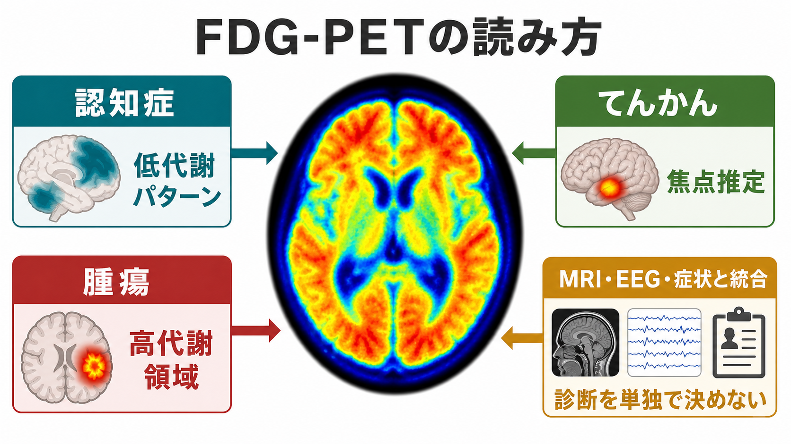
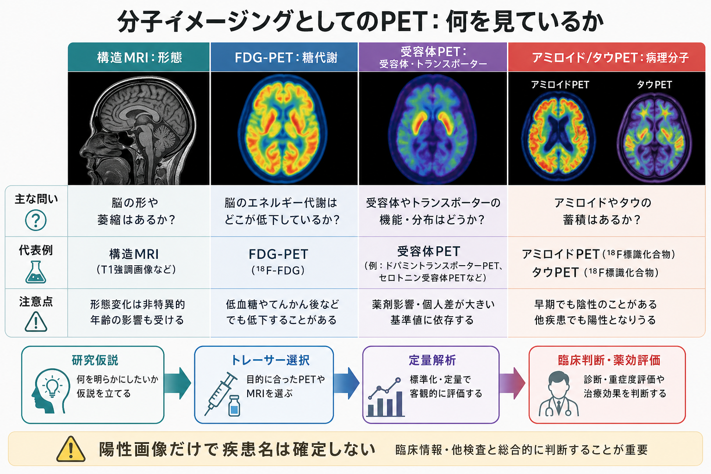

# FDG-PETは脳代謝をどう可視化するのか

## 要点

- FDG-PETは、放射性フッ素で標識したグルコース類似体 $^{18}$F-FDG の分布から、脳内の相対的なグルコース利用を画像化する[[PETは脳の何を測るのか|PET]]検査である [1][2]。
- FDGは[[血液脳関門はなぜ必要なのか|血液脳関門]]を越えて細胞内へ入り、ヘキソキナーゼで FDG-6-P へリン酸化される。FDG-6-P は通常のグルコースほど解糖系を進みにくいため、一定時間、細胞内に捕捉される [2][3]。
- 脳FDG-PETの信号は「ニューロンの発火そのもの」ではなく、神経活動、[[シナプスとは何か|シナプス]]機能、[[アストロサイトはシナプスと代謝をどう支えているのか|アストロサイト]]、炎症、腫瘍細胞、血糖、撮像条件が合わさった代謝指標である [2][5]。
- 認知症では疾患に特徴的な低代謝パターン、てんかんでは発作間欠期の低代謝、腫瘍では腫瘍代謝と正常皮質代謝のコントラストが主な読み取り対象になる [1][6][7][8]。
- 本記事は教育・研究目的の解説であり、個別の診断や治療方針は、臨床経過、神経心理検査、[[構造MRIは脳の何を測っているのか|MRI]]、[[脳波EEGは何を測っているのか|EEG]]、血液・髄液バイオマーカーなどと統合して判断される。

## この記事で答える問い

1. FDG-PETは、脳の何を直接測り、何を推定しているのか。
2. FDGが細胞内に「残る」ことが、なぜ代謝画像につながるのか。
3. 認知症・腫瘍・てんかんでは、FDG-PETをどのように読むのか。
4. FDG-PETを「脳活動そのもの」や「単独診断」と誤解しないために、どこへ注意すべきか。

## まず結論

FDG-PETは、脳内に入った $^{18}$F-FDG の分布を測り、そこから局所のグルコース利用を推定する検査である。FDGはグルコースに似ているため、グルコース輸送体を介して細胞へ取り込まれ、ヘキソキナーゼによってリン酸化される。ところが、リン酸化された FDG-6-P は通常のグルコース代謝のようには進みにくい。そのため、測定時間内では「取り込まれてリン酸化された場所」に相対的に残りやすい [2][3]。

PET装置が直接見ているのは、FDG由来の陽電子が電子と消滅したときに生じる511 keVの光子対である。したがって画像上の明るさは、神経細胞の発火や意識内容を直接映したものではない。FDG-PETは、神経・グリア・血管・代謝・病理変化が反映された「代謝の地図」として読む必要がある [1][2][5]。

## 背景

脳は安静時にも多くのエネルギーを消費し、その主要な供給源はグルコース代謝である。EANMの脳FDG-PET手技ガイドラインは、脳のグルコース代謝が生理的条件では神経・シナプス機能と密接に結びつくと説明している [2]。これは、[[fMRIは神経活動を直接測っているのか|BOLD fMRI]]が血行動態を介して神経活動を推定するのと同じく、脳画像の信号が「間接指標」であることを理解する入口になる。

この発想の基礎には、Sokoloffらによるデオキシグルコース法がある。デオキシグルコースを使って局所脳グルコース利用を測る方法は、脳の構造単位ごとの機能活動を代謝として可視化する道を開いた [4]。その後、Phelpsらは $^{18}$F-FDG と陽電子断層撮影を組み合わせ、ヒトで局所脳グルコース代謝率を測る方法を検証した [3]。

## 基本概念

FDGは 2-deoxy-2-[$^{18}$F]fluoro-D-glucose の略で、グルコースの2位水酸基が $^{18}$F に置き換わった分子である。$^{18}$F は陽電子を放出し、陽電子が電子と出会うと、ほぼ反対方向へ飛ぶ2本の511 keV光子が生じる。PET装置はこの同時計数を多数集め、減弱補正や再構成を経て、体内のトレーサー分布を三次元画像として推定する [1]。

脳FDG-PETで重要なのは、FDGの集積が「グルコース利用に近いが、グルコース利用そのものではない」という点である。FDG集積には、血中グルコース濃度、投与から撮像までの時間、安静状態、薬剤、発作のタイミング、部分容積効果、画像正規化、参照領域の選び方が影響する [1][2][7]。

| 概念 | 何を意味するか | 読み方の注意 |
|---|---|---|
| FDG集積 | FDGが取り込まれ、リン酸化され、測定時間内に残った程度 | 純粋な発火率ではない |
| 低代謝 | 参照領域や正常データベースに比べて相対的に低い集積 | 神経変性、発作間欠期、血流・萎縮・解析条件の影響を分けて考える |
| 高代謝 | 相対的に高い集積 | 腫瘍、炎症、発作期・発作後、正常皮質活動などを鑑別する |
| SUV / 正規化値 | 半定量的な集積指標 | 絶対値より、標準化条件と比較対象が重要 |

## 仕組み

FDG-PETの流れは、次の4段階に整理できる。

1. 静脈から $^{18}$F-FDG を投与する。
2. FDGが血液中を移動し、血液脳関門を通って脳へ入る。脳内移行にはGLUT-1などのグルコース輸送体が関与する [2]。
3. 細胞内でヘキソキナーゼにより FDG-6-P へリン酸化される。FDG-6-P は通常のグルコースほど先の代謝へ進みにくく、測定時間内に細胞内へ残りやすい [2][3]。
4. $^{18}$F の崩壊で生じた陽電子が電子と消滅し、PET装置が511 keV光子対を同時計測する。集めたイベントから、FDG分布が画像として再構成される [1]。

この仕組みは、シナプス活動と代謝の関係を考えるうえでも重要である。FDG信号は長く「ニューロン活動の代謝的近似」として扱われてきたが、動物研究では、アストロサイトのグルタミン酸輸送がFDG信号の主要な駆動因子になりうることも示されている [5]。つまり、FDG-PETは[[ニューロンとは何か|ニューロン]]だけでなく、[[グルタミン酸は脳で何をしているのか|グルタミン酸]]処理、グリア、血管、病理過程を含む、組織レベルの代謝指標として読むのがよい。

## 図解

図1は、FDG-PETを「トレーサー投与、脳内取り込み、PET再構成、疾患パターンの解釈」という全体の流れで示したものである。FDG-PETは単に「明るい場所を探す検査」ではなく、トレーサーの生物学、撮像条件、臨床文脈をつないで読む検査である。

図2は、FDGが細胞内に捕捉される主要メカニズムを示す。グルコース輸送体による取り込み、ヘキソキナーゼによるリン酸化、FDG-6-Pとしての相対的な滞留が、代謝画像の核になる。

図3は、臨床・研究応用を比較する。認知症、てんかん、腫瘍では同じFDG-PETでも、読んでいる問いが異なる。認知症では低代謝の分布、てんかんでは発作間欠期低代謝と発作タイミング、腫瘍では腫瘍代謝と正常皮質代謝のコントラストが中心になる。

## 臨床・研究との接続

### 認知症

神経変性疾患では、構造MRIで明らかな萎縮が目立つ前から、シナプス機能低下や神経ネットワーク障害に対応する低代謝が見られることがある。認知症領域では、FDG-PETは神経変性・進行のマーカーとして位置づけられ、アルツハイマー病、前頭側頭型認知症、レビー小体型認知症などの鑑別補助に使われる [2][6]。

典型的には、アルツハイマー病では後部帯状皮質、楔前部、側頭頭頂連合野の低代謝が重視される。前頭側頭型認知症では前頭葉・前部側頭葉、レビー小体型認知症では後頭葉を含む低代謝が手がかりになる [6]。ただし、FDG-PETはアミロイドやタウを直接測る検査ではない。神経心理検査、MRI、髄液・血液バイオマーカー、アミロイドPETやタウPETなどと合わせて解釈する必要がある。

### てんかん

薬剤抵抗性焦点てんかんの術前評価では、発作間欠期FDG-PETで焦点または関連ネットワークに低代謝が見られることがある。これは、機能低下領域またはてんかん原性領域の一部を示す手がかりとして、MRI、発作時・発作間欠期EEG、発作症候、神経心理検査、必要に応じた頭蓋内EEGと統合される [1][7]。

注意点は、FDGが投与後の一定時間の代謝を反映するため、投与時点の発作状態に影響されることである。発作直後や発作中に近いタイミングでは、高代謝や混合パターンを示すことがある。したがって、FDG投与時の発作の有無、睡眠、鎮静、薬剤、頭部運動、血糖は読影にとって重要な情報になる [1][7]。

### 腫瘍

腫瘍細胞はグルコース代謝が高いことが多く、FDG-PETは悪性度、再発、治療後変化、活動性病変の推定に役立つ場合がある。一方、正常大脳皮質も生理的にFDG集積が高いため、脳腫瘍では背景とのコントラストが問題になりやすい [8]。

このため、グリオーマなどの脳腫瘍では、FDG-PETだけでなく、アミノ酸PET、造影MRI、[[FLAIR画像はどのような病変検出に役立つのか|FLAIR]]、[[拡散強調画像DWIは何を反映しているのか|拡散強調画像]]、灌流画像、病理所見、治療歴を組み合わせる。ガイドラインでも、アミノ酸PETは多くの脳腫瘍関連目的でFDGより有用な場面がある一方、FDGも標準化された手順とMRI統合のもとで解釈されるべき検査として位置づけられる [8]。

### 研究利用

研究では、FDG-PETは脳全体または特定ネットワークの代謝状態を評価するために使われる。認知課題、疾患群比較、治療前後比較、神経変性の進行、てんかんネットワーク、腫瘍代謝の評価などが代表例である。ただし、横断研究で見られる代謝差を、個人の診断や病因へ直接読み替えることはできない。研究デザイン、前処理、部分容積補正、参照領域、統計閾値、併存疾患、薬剤、年齢を明示して読む必要がある。

## よくある誤解

### 誤解1: FDG-PETは神経活動を直接測っている

直接測っているのは、FDG由来の放射線イベントである。そこから、FDG分布とグルコース利用を推定している。神経活動との関係は深いが、アストロサイト、炎症、腫瘍、血糖、薬剤、撮像条件にも影響される [1][2][5]。

### 誤解2: 赤い部位はいつも病的で、低い部位はいつも萎縮である

カラースケールは相対表示であり、正規化方法や参照領域で印象が変わる。低集積は神経変性だけでなく、入力低下、発作間欠期変化、部分容積効果、血糖、解析条件でも生じうる。高集積も、腫瘍や炎症だけでなく、正常皮質活動や発作関連変化を反映することがある。

### 誤解3: FDG-PETだけで認知症の病名を決められる

FDG-PETは診断仮説を支えるが、単独で病名を確定する検査ではない。認知症では、臨床経過、神経心理検査、MRI、血液・髄液バイオマーカー、アミロイドPET、タウPETなどと統合して読む [6]。

### 誤解4: 脳腫瘍ならFDG-PETが常に最適である

正常皮質のFDG集積が高いため、脳腫瘍では病変コントラストが制限されることがある。グリオーマなどでは、アミノ酸PETのほうが目的に合う場面があり、FDG-PETはMRIや他のPETトレーサーと合わせて位置づける [8]。

## 限界と未解決問題

- FDG信号を、ニューロン、アストロサイト、ミクログリア、血管、腫瘍細胞の寄与へどこまで分解できるか。
- 認知症のFDG低代謝パターンを、個人レベルの予後予測や治療反応予測へどこまで安定して使えるか。
- てんかん術前評価で、FDG-PET、MRI、EEG、SEEG、発作症候をどの順序・重みで統合すると最も妥当か。
- 腫瘍領域で、FDG-PETとアミノ酸PET、灌流MRI、分子病理をどう組み合わせると、再発・壊死・治療効果をより正確に分けられるか。

## 関連ノート

- [[PETは脳の何を測るのか]]
- [[受容体PETとは何か]]
- [[SPECTは脳血流をどう評価するのか]]
- [[構造MRIは脳の何を測っているのか]]
- [[T1強調画像とT2強調画像は何が違うのか]]
- [[FLAIR画像はどのような病変検出に役立つのか]]
- [[脳波EEGは何を測っているのか]]
- [[血液脳関門はなぜ必要なのか]]
- [[アストロサイトはシナプスと代謝をどう支えているのか]]

関連ノート候補:

- PETとSPECTの違い
- アミロイドPETとタウPET
- てんかん術前評価
- 認知症の画像バイオマーカー
- グリオーマの分子イメージング

MOC更新候補:

- `content/00_MOC/MOC｜脳・神経科学.md` の脳画像・神経計測またはPET関連項目に、本記事へのリンクを追加する候補。
- 並列ジョブとの競合を避けるため、今回はMOC本体は更新しない。

## 理解チェック

1. FDG-PETが直接検出している物理現象は何か。
2. FDG-6-P が細胞内に残りやすいことは、画像化にどう関係するか。
3. FDG-PETを「神経発火そのもの」と読んではいけない理由を説明できるか。
4. 認知症、てんかん、腫瘍で、FDG-PETの読み取りの焦点はどう違うか。
5. FDG-PETの結果をMRI、EEG、神経心理検査、バイオマーカーと統合すべき理由を説明できるか。

## 参考文献

[1] Arbizu, J., Morbelli, S., Minoshima, S., Barthel, H., Kuo, P., Van Weehaeghe, D., Horner, N., Colletti, P. M., & Guedj, E. (2024). SNMMI Procedure Standard/EANM Practice Guideline for Brain [18F]FDG PET Imaging, Version 2.0. *Journal of Nuclear Medicine*. https://doi.org/10.2967/jnumed.124.268754

[2] Guedj, E., Varrone, A., Boellaard, R., Albert, N. L., Barthel, H., van Berckel, B., Brendel, M., Cecchin, D., Ekmekcioglu, O., Garibotto, V., et al. (2022). EANM procedure guidelines for brain PET imaging using [18F]FDG, version 3. *European Journal of Nuclear Medicine and Molecular Imaging, 49*, 632-651. https://doi.org/10.1007/s00259-021-05603-w

[3] Phelps, M. E., Huang, S. C., Hoffman, E. J., Selin, C., Sokoloff, L., & Kuhl, D. E. (1979). Tomographic measurement of local cerebral glucose metabolic rate in humans with (F-18)2-fluoro-2-deoxy-D-glucose: validation of method. *Annals of Neurology, 6*(5), 371-388. https://doi.org/10.1002/ana.410060502

[4] Sokoloff, L., Reivich, M., Kennedy, C., Des Rosiers, M. H., Patlak, C. S., Pettigrew, K. D., Sakurada, O., & Shinohara, M. (1977). The [14C]deoxyglucose method for the measurement of local cerebral glucose utilization: theory, procedure, and normal values in the conscious and anesthetized albino rat. *Journal of Neurochemistry, 28*(5), 897-916. https://doi.org/10.1111/j.1471-4159.1977.tb10649.x

[5] Zimmer, E. R., Parent, M. J., Souza, D. G., Leuzy, A., Lecrux, C., Kim, H. I., Gauthier, S., Pellerin, L., Hamel, E., & Rosa-Neto, P. (2017). [18F]FDG PET signal is driven by astroglial glutamate transport. *Nature Neuroscience, 20*, 393-395. https://doi.org/10.1038/nn.4492

[6] Nobili, F., Arbizu, J., Bouwman, F., Drzezga, A., Agosta, F., Nestor, P., Walker, Z., & Boccardi, M. (2018). European Association of Nuclear Medicine and European Academy of Neurology recommendations for the use of brain 18F-fluorodeoxyglucose positron emission tomography in neurodegenerative cognitive impairment and dementia: Delphi consensus. *European Journal of Neurology, 25*(10), 1201-1217. https://doi.org/10.1111/ene.13728

[7] Rosenow, F., et al. (2025). Seminars in epileptology: Presurgical epilepsy evaluation. *Epileptic Disorders*. https://pmc.ncbi.nlm.nih.gov/articles/PMC12747706/

[8] Law, I., Albert, N. L., Arbizu, J., Boellaard, R., Drzezga, A., Galldiks, N., La Fougere, C., Langen, K. J., Lopci, E., Lowe, V., et al. (2019). Joint EANM/EANO/RANO practice guidelines/SNMMI procedure standards for imaging of gliomas using PET with radiolabelled amino acids and [18F]FDG: version 1.0. *European Journal of Nuclear Medicine and Molecular Imaging, 46*, 540-557. https://doi.org/10.1007/s00259-018-4207-9
